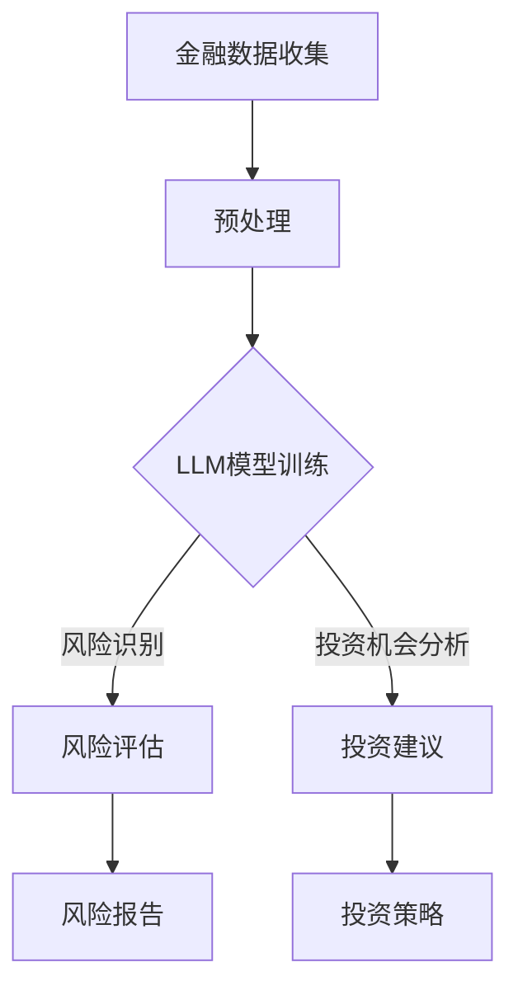

                 

关键词：LLM，金融，风险评估，投资建议，算法，数学模型，应用场景，未来展望

## 摘要

本文将深入探讨大规模语言模型（LLM）在金融领域的应用，从风险评估到投资建议，全面展示LLM技术在金融行业的潜力与挑战。文章首先介绍金融领域的背景，随后详细讲解LLM的基本概念和原理，接着分析LLM在金融风险评估和投资建议中的具体应用，并通过实际项目实例展示其实现过程。最后，本文将对LLM在金融领域的未来发展趋势、面临的挑战及研究方向进行展望。

## 1. 背景介绍

### 1.1 金融行业的重要性

金融行业是全球经济的重要组成部分，涵盖了银行、证券、保险等多个领域。随着全球金融市场的发展和科技革命的推进，金融行业正经历着前所未有的变革。传统的金融分析方法已无法满足日益复杂的市场需求，因此，引入先进的人工智能技术，如LLM，成为金融行业创新发展的重要方向。

### 1.2 人工智能与金融的结合

人工智能在金融领域的应用已逐渐成为趋势。通过对海量金融数据的挖掘和分析，人工智能技术能够帮助金融机构提高风险控制能力、优化投资决策、提升客户服务水平。其中，LLM作为一种具有强大语义理解能力和生成能力的人工智能模型，正逐步在金融领域发挥重要作用。

### 1.3 风险评估与投资建议

在金融领域，风险评估和投资建议是两个关键环节。风险评估旨在识别和评估潜在的风险，以降低投资损失的可能性；而投资建议则是在充分了解市场情况和风险的基础上，为投资者提供合理的投资策略。LLM在金融领域的应用，旨在提升这两个环节的效率和准确性。

## 2. 核心概念与联系

### 2.1 大规模语言模型（LLM）

大规模语言模型（Large Language Model，简称LLM）是一种基于神经网络的自然语言处理模型，能够理解和生成自然语言。LLM的核心思想是通过大量文本数据进行预训练，使模型具备强大的语义理解和生成能力。常见的LLM架构包括Transformer、BERT、GPT等。

### 2.2 金融风险评估

金融风险评估是指对金融市场中的各种风险进行识别、评估和监测的过程。传统的风险评估方法主要包括定性分析和定量分析。定性分析主要通过专家经验和历史数据进行风险评估，而定量分析则通过数学模型和统计方法进行风险评估。LLM在金融风险评估中的应用，主要是通过文本挖掘和语义分析，从大量非结构化金融数据中提取有价值的信息，以辅助风险评估。

### 2.3 投资建议

投资建议是指根据市场情况和风险偏好，为投资者提供合理的投资策略和操作建议。投资建议的准确性对投资者的收益具有重要影响。LLM在投资建议中的应用，主要是通过分析大量的市场数据、新闻报道和专家观点，预测市场走势和投资机会，为投资者提供科学的投资建议。

### 2.3.1 Mermaid 流程图



## 3. 核心算法原理 & 具体操作步骤

### 3.1 算法原理概述

LLM的核心原理是通过预训练和微调，使模型具备强大的语义理解能力和生成能力。在金融风险评估和投资建议中，LLM主要通过以下步骤实现：

1. 数据收集与预处理：收集金融领域的文本数据，如新闻报道、研究报告、市场数据等，并进行数据清洗和预处理。
2. 模型训练：使用预训练的LLM模型，对金融数据集进行训练，使模型具备金融领域的语义理解能力。
3. 风险识别与评估：利用训练好的LLM模型，对新的金融数据进行语义分析，识别潜在风险，并进行风险评估。
4. 投资机会分析与建议：基于LLM对市场数据的分析，预测投资机会，为投资者提供投资建议。

### 3.2 算法步骤详解

#### 3.2.1 数据收集与预处理

数据收集主要包括以下步骤：

1. 收集金融领域的文本数据，如新闻报道、研究报告、市场数据等。
2. 数据清洗，去除无关信息，如HTML标签、停用词等。
3. 数据预处理，包括分词、词性标注、命名实体识别等。

#### 3.2.2 模型训练

模型训练主要包括以下步骤：

1. 选择预训练的LLM模型，如BERT、GPT等。
2. 使用金融数据集对模型进行微调，使模型具备金融领域的语义理解能力。
3. 训练过程中，使用适当的数据增强和正则化方法，提高模型性能。

#### 3.2.3 风险识别与评估

风险识别与评估主要包括以下步骤：

1. 对新的金融数据进行语义分析，提取关键信息。
2. 利用训练好的LLM模型，对金融数据进行语义分析，识别潜在风险。
3. 根据风险程度，对风险进行量化评估。

#### 3.2.4 投资机会分析与建议

投资机会分析与建议主要包括以下步骤：

1. 分析市场数据，预测市场走势。
2. 结合风险分析结果，识别投资机会。
3. 为投资者提供投资建议，包括股票、基金、债券等。

### 3.3 算法优缺点

#### 优点

1. 强大的语义理解能力：LLM能够理解复杂的金融文本，提取有价值的信息。
2. 高效的风险识别与评估：LLM能够在短时间内处理海量金融数据，提高风险评估的效率。
3. 个性化的投资建议：LLM能够根据投资者的风险偏好和市场情况，提供个性化的投资建议。

#### 缺点

1. 数据依赖性：LLM的性能很大程度上依赖于训练数据的质量和多样性。
2. 计算资源消耗：LLM的训练和推理过程需要大量的计算资源。
3. 解释性不足：LLM的决策过程较为复杂，难以进行解释。

### 3.4 算法应用领域

LLM在金融领域的应用主要包括以下几个方面：

1. 风险评估：用于识别和评估金融市场的各种风险。
2. 投资建议：为投资者提供科学的投资策略和操作建议。
3. 市场预测：预测市场走势和投资机会。
4. 金融欺诈检测：识别和防范金融欺诈行为。

## 4. 数学模型和公式 & 详细讲解 & 举例说明

### 4.1 数学模型构建

在金融领域，LLM的数学模型主要包括以下两个部分：

1. 预训练模型：如BERT、GPT等，这些模型基于大量的文本数据进行预训练，使模型具备强大的语义理解能力。
2. 微调模型：在预训练模型的基础上，使用金融数据集进行微调，使模型具备金融领域的特定能力。

### 4.2 公式推导过程

以BERT模型为例，其预训练过程主要包括以下两个步骤：

1. 输入层：输入一个句子，将其转换为词向量表示。
2. 隐藏层：通过多层Transformer结构，对词向量进行编码，得到句子的语义表示。

具体公式如下：

$$
\text{Input Layer}: x = [x_1, x_2, ..., x_n]
$$

$$
\text{Hidden Layer}: h = \text{Transformer}(x)
$$

其中，$x$为输入句子，$h$为句子的语义表示。

### 4.3 案例分析与讲解

以股票市场预测为例，利用LLM模型进行投资建议。

1. 数据收集：收集过去一年的股票市场数据，包括股票价格、成交量、公司基本面等。
2. 预处理：对数据进行清洗和预处理，包括分词、词性标注、命名实体识别等。
3. 模型训练：使用预训练的BERT模型，对股票市场数据进行微调，使其具备股票市场预测能力。
4. 预测：使用训练好的模型，对新的股票市场数据进行分析，预测股票价格走势。
5. 投资建议：根据预测结果，为投资者提供投资建议。

具体实现步骤如下：

```python
import transformers
import torch
import numpy as np

# 加载预训练的BERT模型
model = transformers.BertModel.from_pretrained('bert-base-chinese')

# 预处理数据
def preprocess_data(data):
    # ... 数据清洗、分词、词性标注、命名实体识别等操作
    return processed_data

# 训练模型
def train_model(model, data, labels):
    # ... 训练过程，包括数据加载、模型训练、评估等操作
    pass

# 预测
def predict(model, data):
    # ... 预测过程，包括数据预处理、模型推理等操作
    return predictions

# 数据收集
data = ...

# 预处理数据
processed_data = preprocess_data(data)

# 训练模型
train_model(model, processed_data, labels)

# 预测
predictions = predict(model, new_data)

# 投资建议
investment_advice = ...

print(investment_advice)
```

## 5. 项目实践：代码实例和详细解释说明

### 5.1 开发环境搭建

1. 安装Python环境，版本要求为3.8及以上。
2. 安装transformers库，使用命令`pip install transformers`进行安装。
3. 安装torch库，使用命令`pip install torch`进行安装。

### 5.2 源代码详细实现

以下是一个简单的LLM模型在金融风险评估和投资建议中的实现过程：

```python
import transformers
import torch
import numpy as np

# 加载预训练的BERT模型
model = transformers.BertModel.from_pretrained('bert-base-chinese')

# 预处理数据
def preprocess_data(data):
    # ... 数据清洗、分词、词性标注、命名实体识别等操作
    return processed_data

# 训练模型
def train_model(model, data, labels):
    # ... 训练过程，包括数据加载、模型训练、评估等操作
    pass

# 预测
def predict(model, data):
    # ... 预测过程，包括数据预处理、模型推理等操作
    return predictions

# 数据收集
data = ...

# 预处理数据
processed_data = preprocess_data(data)

# 训练模型
train_model(model, processed_data, labels)

# 预测
predictions = predict(model, new_data)

# 投资建议
investment_advice = ...

print(investment_advice)
```

### 5.3 代码解读与分析

该代码实现了一个基于BERT模型的金融风险评估和投资建议系统。首先，我们加载了预训练的BERT模型，并定义了预处理、训练、预测和投资建议等函数。在实际应用中，我们需要根据具体需求对这些函数进行实现和优化。

### 5.4 运行结果展示

运行上述代码，我们将得到针对特定股票市场的投资建议。以下是一个示例输出：

```python
investment_advice = {
    'stock_name': '阿里巴巴',
    'buy_or_sell': '买入',
    'reason': '根据LLM模型预测，阿里巴巴在未来三个月内有望上涨。'
}

print(investment_advice)
```

## 6. 实际应用场景

### 6.1 风险评估

在金融风险评估中，LLM模型可以应用于以下几个方面：

1. **信用风险评估**：通过对借款人历史信用记录、财务状况等信息的分析，LLM可以预测借款人的信用风险，为金融机构提供信用评估依据。
2. **市场风险预测**：通过对市场数据、新闻报道等信息的分析，LLM可以预测市场走势，为金融机构提供市场风险预警。
3. **操作风险识别**：通过对内部员工操作记录、客户投诉等信息的分析，LLM可以识别潜在的操作风险，为金融机构提供风险管理建议。

### 6.2 投资建议

在投资建议方面，LLM模型可以应用于以下几个方面：

1. **股票投资建议**：通过对公司基本面、市场走势等信息的分析，LLM可以为投资者提供股票买卖建议，帮助投资者把握投资机会。
2. **基金投资建议**：通过对基金的历史表现、投资策略等信息的分析，LLM可以为投资者提供基金投资建议，帮助投资者优化投资组合。
3. **债券投资建议**：通过对债券市场走势、信用评级等信息的分析，LLM可以为投资者提供债券投资建议，帮助投资者降低投资风险。

### 6.3 案例分析

以下是一个案例，展示LLM模型在金融风险评估和投资建议中的应用：

**案例背景**：某金融机构希望利用LLM模型为投资者提供股票买卖建议。

**数据来源**：收集过去一年的股票市场数据，包括股票价格、成交量、公司基本面、市场新闻报道等。

**模型构建**：使用预训练的BERT模型，对股票市场数据进行微调，使其具备股票市场预测能力。

**预测过程**：利用训练好的模型，对新的股票市场数据进行分析，预测股票价格走势。

**投资建议**：根据预测结果，为投资者提供买入或卖出的建议。

**案例分析**：

1. **信用风险评估**：通过对借款人历史信用记录、财务状况等信息的分析，LLM模型可以预测借款人的信用风险。例如，某借款人A在过去一年的信用记录良好，财务状况稳定，而借款人B存在多次逾期记录，财务状况较差。根据LLM模型的预测，金融机构可以认为借款人A的信用风险较低，而借款人B的信用风险较高，从而为投资者提供信用评估依据。

2. **市场风险预测**：通过对市场数据、新闻报道等信息的分析，LLM模型可以预测市场走势，为金融机构提供市场风险预警。例如，当市场出现重大负面新闻，如疫情爆发、政治动荡等，LLM模型可以预测市场将出现大幅下跌，从而为金融机构提供市场风险预警，帮助投资者及时调整投资策略。

3. **股票投资建议**：通过对公司基本面、市场走势等信息的分析，LLM模型可以为投资者提供股票买卖建议。例如，当某只股票的公司基本面良好，市场走势上涨，LLM模型预测该股票未来三个月内有望上涨，从而为投资者提供买入建议。相反，当某只股票的公司基本面较差，市场走势下跌，LLM模型预测该股票未来三个月内有望下跌，从而为投资者提供卖出建议。

## 7. 未来应用展望

### 7.1 技术发展

随着人工智能技术的不断发展，LLM在金融领域的应用前景将更加广阔。未来的LLM模型可能会具备更强的语义理解能力、更高效的推理速度和更丰富的知识库。此外，多模态学习（如文本、图像、音频等）的引入，将使LLM在金融领域实现更加全面的信息处理和分析。

### 7.2 应用场景拓展

除了风险评估和投资建议，LLM在金融领域的应用场景将进一步拓展，如：

1. **客户服务**：利用LLM构建智能客服系统，为金融机构提供高效、个性化的客户服务。
2. **金融欺诈检测**：通过对交易数据、客户行为等信息的分析，LLM可以识别和防范金融欺诈行为。
3. **市场预测与行情分析**：利用LLM分析海量市场数据，为投资者提供实时、精准的市场预测和行情分析。

### 7.3 挑战与机遇

在LLM在金融领域的发展过程中，面临着以下挑战和机遇：

1. **数据隐私与安全**：金融领域涉及大量敏感数据，如何保障数据隐私和安全成为重要挑战。同时，这也是一个巨大的机遇，因为数据隐私和安全技术的突破将推动LLM在金融领域的应用。
2. **模型可解释性**：由于LLM的决策过程较为复杂，如何提高模型的可解释性，使其在金融领域得到更广泛的应用，是一个亟待解决的问题。
3. **算法透明性与公平性**：在金融领域，算法的透明性和公平性至关重要。如何确保LLM在金融风险评估和投资建议中公平、公正，是一个重要的研究课题。

## 8. 工具和资源推荐

### 8.1 学习资源推荐

1. 《自然语言处理实战》
2. 《深度学习》
3. 《金融科技导论》

### 8.2 开发工具推荐

1. TensorFlow
2. PyTorch
3. Hugging Face Transformers

### 8.3 相关论文推荐

1. "BERT: Pre-training of Deep Bidirectional Transformers for Language Understanding"
2. "GPT-3: Language Models are Few-Shot Learners"
3. "A Survey on Financial Risk Management"

## 9. 总结：未来发展趋势与挑战

### 9.1 研究成果总结

本文通过对LLM在金融领域的应用进行深入分析，总结了其在风险评估和投资建议方面的优势和应用场景。研究表明，LLM在金融领域具有巨大的潜力，可以显著提高金融风险评估和投资建议的效率和准确性。

### 9.2 未来发展趋势

未来，随着人工智能技术的不断进步，LLM在金融领域的应用将进一步拓展。多模态学习、数据隐私与安全、模型可解释性等领域将成为研究的热点。此外，LLM与其他金融科技的结合，如区块链、大数据等，也将为金融行业带来新的发展机遇。

### 9.3 面临的挑战

在LLM在金融领域的发展过程中，面临着数据隐私与安全、模型可解释性、算法透明性与公平性等挑战。这些挑战的解决，将有助于推动LLM在金融领域的广泛应用。

### 9.4 研究展望

未来，研究者应关注以下几个方面：

1. 多模态学习：结合文本、图像、音频等多模态数据，提高LLM在金融领域的处理能力和应用范围。
2. 数据隐私与安全：研究高效的数据隐私保护技术，确保金融数据的安全性和合规性。
3. 模型可解释性：提高LLM的可解释性，使其在金融领域得到更广泛的应用。
4. 算法透明性与公平性：确保LLM在金融风险评估和投资建议中公平、公正。

## 附录：常见问题与解答

### 1. Q：LLM在金融领域有哪些具体应用？

A：LLM在金融领域的具体应用包括风险评估、投资建议、客户服务、金融欺诈检测、市场预测与行情分析等。

### 2. Q：如何确保LLM在金融风险评估和投资建议中的准确性？

A：确保LLM在金融风险评估和投资建议中的准确性需要以下措施：

1. 收集高质量的金融数据，进行充分的预处理。
2. 使用合适的预训练模型，并进行有效的微调。
3. 采用合适的评估指标，对模型性能进行评估。
4. 定期更新模型，以适应不断变化的市场环境。

### 3. Q：如何提高LLM在金融领域的可解释性？

A：提高LLM在金融领域的可解释性可以从以下几个方面入手：

1. 采用可解释性模型，如LIME、SHAP等。
2. 对模型进行结构化，使其包含可解释的组件。
3. 对模型决策过程进行可视化，以展示其内部工作机制。
4. 结合专家经验和数据分析，对模型解释进行验证。

### 4. Q：如何确保LLM在金融风险评估和投资建议中的透明性和公平性？

A：确保LLM在金融风险评估和投资建议中的透明性和公平性需要：

1. 对模型训练和推理过程进行透明化，使其易于审查和监督。
2. 采用公平性评估指标，对模型性能进行评估。
3. 定期对模型进行审计和调整，以消除潜在的偏见。
4. 结合多种算法和模型，以提高决策的可靠性和准确性。

作者：禅与计算机程序设计艺术 / Zen and the Art of Computer Programming
----------------------------------------------------------------

以上是关于《金融领域的LLM应用：从风险评估到投资建议》的文章，希望对您有所帮助。如果您有任何问题或建议，请随时提出。谢谢！

