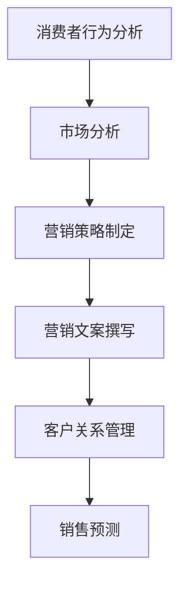

                 

关键词：销售策略、营销方法、语言模型、大型语言模型、人工智能、商业增长、消费者行为、市场分析

> 摘要：本文将探讨如何利用大型语言模型（LLM）来增强销售和营销策略，提高企业的市场竞争力和盈利能力。通过深入分析LLM的技术原理和应用场景，本文提出了一系列实用的方法和步骤，帮助企业更好地了解消费者需求、优化销售流程、提升营销效果。

## 1. 背景介绍

在当今全球化的商业环境中，竞争日益激烈，企业要想取得成功，必须不断创新和提升自身的销售和营销策略。随着人工智能技术的快速发展，尤其是大型语言模型（LLM）的出现，为销售和营销领域带来了全新的机遇。LLM是一种基于深度学习的自然语言处理技术，能够理解、生成和翻译自然语言，广泛应用于文本生成、机器翻译、情感分析、问答系统等领域。

销售和营销是企业盈利的重要途径，但传统的销售和营销策略已无法满足日益变化的消费者需求。LLM的引入为销售和营销提供了新的思路和方法，能够帮助企业更好地理解消费者行为、优化销售流程、提高营销效果，从而实现商业增长。

本文将介绍如何利用LLM来增强销售和营销策略，包括以下内容：

- LLM的核心概念与技术原理
- LLM在销售和营销中的应用场景
- LLM增强销售和营销策略的方法与步骤
- LLM在销售和营销中的成功案例

通过本文的探讨，希望能为企业提供有益的启示和指导，帮助其在激烈的市场竞争中脱颖而出。

## 2. 核心概念与联系

### 2.1. 大型语言模型（LLM）

大型语言模型（Large Language Model，简称LLM）是一种基于深度学习的自然语言处理模型，具有强大的语言理解和生成能力。LLM通过训练海量文本数据，学习语言模式、语法结构、语义关系等，从而能够生成连贯、自然的文本。

LLM的核心技术包括：

- 词嵌入（Word Embedding）：将词汇映射为高维向量，用于表示词语的语义信息。
- 循环神经网络（RNN）：用于处理序列数据，能够捕捉词语之间的关联性。
- 变量门控循环单元（GRU）/ 长短期记忆网络（LSTM）：用于解决RNN的梯度消失和梯度爆炸问题，提高模型的训练效果。
- 注意力机制（Attention Mechanism）：用于关注序列中的关键信息，提高模型的上下文理解能力。
- Transformer架构：一种基于自注意力机制的深度学习模型，能够在处理长文本时保持高效性和准确性。

### 2.2. 销售和营销

销售和营销是企业实现商业目标的重要手段。销售是指企业通过销售产品或服务，实现利润最大化；营销是指企业通过研究市场、定位目标客户、设计产品、传播品牌等信息，促进产品或服务的销售。

销售和营销的核心概念包括：

- 消费者需求：消费者在购买过程中所追求的利益和满足感。
- 市场分析：对市场环境、竞争对手、目标客户等进行研究，以制定合适的销售和营销策略。
- 营销策略：包括产品策略、价格策略、渠道策略和促销策略等，用于实现企业的销售目标。
- 销售流程：从客户开发、客户维护到最终成交的过程。

### 2.3. LLM与销售和营销的联系

LLM在销售和营销中的应用，主要体现在以下几个方面：

- 消费者行为分析：利用LLM对消费者在社交媒体、论坛、评论等平台上的言论进行分析，挖掘消费者需求和偏好，为销售和营销提供有针对性的建议。
- 营销文案撰写：利用LLM生成高质量、个性化的营销文案，提高营销效果。
- 客户关系管理：利用LLM进行客户情感分析，了解客户满意度，优化客户服务。
- 销售预测：利用LLM对市场趋势、消费者行为等进行预测，为企业制定合适的销售策略。

### 2.4. Mermaid 流程图

以下是一个简单的Mermaid流程图，展示了LLM在销售和营销中的应用流程：



## 3. 核心算法原理 & 具体操作步骤

### 3.1. 算法原理概述

LLM的核心算法原理主要包括词嵌入、循环神经网络（RNN）、注意力机制和Transformer架构。这些算法通过训练大量的文本数据，学习语言模式、语法结构和语义关系，从而实现自然语言理解、生成和翻译。

- 词嵌入：将词汇映射为高维向量，用于表示词语的语义信息。
- 循环神经网络（RNN）：用于处理序列数据，能够捕捉词语之间的关联性。
- 注意力机制：用于关注序列中的关键信息，提高模型的上下文理解能力。
- Transformer架构：一种基于自注意力机制的深度学习模型，能够在处理长文本时保持高效性和准确性。

### 3.2. 算法步骤详解

以下是LLM在销售和营销中应用的具体步骤：

#### 3.2.1. 消费者行为分析

1. 收集消费者数据：从社交媒体、论坛、评论等平台收集消费者的言论和反馈。
2. 数据预处理：对收集到的数据进行清洗、去重和格式化。
3. 词嵌入：将清洗后的文本数据映射为高维向量。
4. RNN模型训练：利用RNN模型对词嵌入向量进行训练，学习语言模式和语义关系。
5. 情感分析：利用训练好的RNN模型对消费者言论进行情感分析，识别消费者需求和偏好。

#### 3.2.2. 营销策略制定

1. 市场分析：收集市场数据，分析市场趋势、竞争对手和目标客户。
2. 数据预处理：对市场数据进行清洗、去重和格式化。
3. 词嵌入：将清洗后的数据映射为高维向量。
4. RNN模型训练：利用RNN模型对词嵌入向量进行训练，学习市场模式和趋势。
5. 策略制定：根据训练好的RNN模型，制定有针对性的营销策略。

#### 3.2.3. 营销文案撰写

1. 需求分析：分析消费者需求和偏好，确定营销文案的目标和主题。
2. 数据收集：收集相关的市场数据、竞品信息等。
3. 数据预处理：对收集到的数据进行清洗、去重和格式化。
4. 词嵌入：将清洗后的数据映射为高维向量。
5. Transformer模型训练：利用Transformer模型对词嵌入向量进行训练，生成高质量、个性化的营销文案。

#### 3.2.4. 客户关系管理

1. 数据收集：收集客户的购买记录、互动信息等。
2. 数据预处理：对收集到的数据进行清洗、去重和格式化。
3. 词嵌入：将清洗后的数据映射为高维向量。
4. RNN模型训练：利用RNN模型对词嵌入向量进行训练，学习客户行为和偏好。
5. 情感分析：利用训练好的RNN模型对客户互动信息进行情感分析，了解客户满意度。

#### 3.2.5. 销售预测

1. 数据收集：收集市场数据、消费者行为数据等。
2. 数据预处理：对收集到的数据进行清洗、去重和格式化。
3. 词嵌入：将清洗后的数据映射为高维向量。
4. Transformer模型训练：利用Transformer模型对词嵌入向量进行训练，学习市场趋势和消费者行为。
5. 预测：利用训练好的Transformer模型，预测未来的销售情况。

### 3.3. 算法优缺点

#### 优点：

1. 强大的自然语言理解能力：LLM能够理解、生成和翻译自然语言，有助于提升销售和营销的效果。
2. 高效性：Transformer架构能够在处理长文本时保持高效性，适用于大规模数据集。
3. 个性化：LLM能够根据消费者行为和需求，生成个性化的营销文案，提高用户体验。

#### 缺点：

1. 训练成本高：LLM需要大量数据和计算资源进行训练，对硬件和软件的要求较高。
2. 解释性差：由于深度学习模型的黑箱特性，LLM的决策过程难以解释，可能影响企业的信任度。
3. 数据隐私问题：在收集消费者数据时，可能涉及到数据隐私问题，需要谨慎处理。

### 3.4. 算法应用领域

LLM在销售和营销中的应用领域非常广泛，包括但不限于：

1. 消费者行为分析：通过分析消费者在社交媒体、论坛等平台上的言论，了解消费者需求和偏好。
2. 营销文案撰写：利用LLM生成高质量、个性化的营销文案，提高营销效果。
3. 客户关系管理：通过情感分析和互动信息分析，优化客户服务，提高客户满意度。
4. 销售预测：利用LLM对市场趋势、消费者行为等进行预测，为企业的销售策略提供支持。
5. 竞争对手分析：通过分析竞争对手的市场策略和消费者行为，为企业制定有针对性的销售和营销策略。

## 4. 数学模型和公式 & 详细讲解 & 举例说明

### 4.1. 数学模型构建

LLM的数学模型主要包括词嵌入、循环神经网络（RNN）和注意力机制。以下分别介绍这些数学模型的基本原理和公式。

#### 4.1.1. 词嵌入

词嵌入是将词汇映射为高维向量，用于表示词语的语义信息。常见的词嵌入方法包括：

- 线性模型：$$ \text{vec}(w) = \text{vec}(W) \cdot w $$
- 非线性模型：$$ \text{vec}(w) = \text{ReLU}(\text{vec}(W) \cdot w) $$

其中，$\text{vec}(w)$表示词嵌入向量，$\text{vec}(W)$表示词嵌入矩阵，$w$表示词语。

#### 4.1.2. 循环神经网络（RNN）

循环神经网络（RNN）是一种用于处理序列数据的神经网络，其基本原理如下：

$$ h_t = \text{tanh}(\text{W} \cdot [h_{t-1}, x_t] + b) $$

$$ o_t = \text{softmax}(\text{W} \cdot h_t + b') $$

其中，$h_t$表示隐藏状态，$x_t$表示输入序列，$o_t$表示输出序列，$\text{W}$和$\text{b}$分别表示权重和偏置，$\text{tanh}$和$\text{softmax}$分别为激活函数和输出函数。

#### 4.1.3. 注意力机制

注意力机制是一种用于提高模型上下文理解能力的机制，其基本原理如下：

$$ a_t = \text{softmax}(\text{W}_a \cdot \text{tanh}(\text{W}_h \cdot [h_{t-1}, h_t] + b_a)) $$

$$ h_t = \text{c} \odot a_t \cdot h_t $$

其中，$a_t$表示注意力权重，$h_t$表示隐藏状态，$\text{W}_a$和$\text{W}_h$分别表示权重矩阵，$\text{b}_a$表示偏置，$\text{c}$表示常数，$\odot$表示元素-wise乘法。

### 4.2. 公式推导过程

以下是对LLM中注意力机制的公式推导过程。

#### 4.2.1. 自注意力

自注意力是一种用于处理序列数据的方法，其公式推导如下：

$$ q = \text{softmax}\left(\frac{\text{Q} \cdot \text{K}}{\sqrt{d_k}}\right) $$

$$ v = \text{softmax}\left(\frac{\text{V} \cdot \text{K}}{\sqrt{d_k}}\right) $$

$$ \text{output} = \text{Q} \cdot \text{K} \cdot \text{V}^T $$

其中，$\text{Q}$、$\text{K}$和$\text{V}$分别表示查询向量、关键向量和价值向量，$d_k$表示关键向量的维度。

#### 4.2.2. 多头注意力

多头注意力是一种将自注意力扩展到多个头部的技术，其公式推导如下：

$$ \text{output} = \text{softmax}\left(\frac{\text{Q} \cdot \text{K}}{\sqrt{d_k}}\right) \cdot \text{V}^T $$

其中，$\text{Q}$、$\text{K}$和$\text{V}$分别表示查询向量、关键向量和价值向量，$d_k$表示关键向量的维度。

### 4.3. 案例分析与讲解

以下是一个简单的案例，展示如何使用LLM生成营销文案。

#### 4.3.1. 案例背景

某公司是一家生产智能家居产品的企业，希望利用LLM生成一篇关于其新款智能门锁的营销文案。

#### 4.3.2. 数据准备

1. 产品描述：智能门锁具有指纹解锁、密码解锁、手机解锁等多种解锁方式，可远程监控家门状态，提高家庭安全。
2. 市场分析：智能家居市场前景广阔，消费者对智能门锁的需求日益增长。

#### 4.3.3. 数据预处理

1. 数据清洗：去除文本中的标点符号、停用词等无关信息。
2. 数据格式化：将文本转换为统一的大小写和词性标注。

#### 4.3.4. 词嵌入

1. 选取合适的词嵌入方法：使用Word2Vec或GloVe等方法进行词嵌入。
2. 映射词汇：将词汇映射为高维向量。

#### 4.3.5. Transformer模型训练

1. 准备训练数据：将产品描述和市场分析文本转换为词嵌入向量。
2. 模型训练：使用Transformer模型对词嵌入向量进行训练，学习语言模式和语义关系。

#### 4.3.6. 营销文案生成

1. 输入文本：将智能门锁的产品描述输入到训练好的Transformer模型中。
2. 生成文案：模型根据输入文本生成一篇关于智能门锁的营销文案。

#### 4.3.7. 结果展示

生成的营销文案如下：

"🔐 智能守护，家门无忧！全新智能门锁，为您提供指纹解锁、密码解锁、手机解锁等多种解锁方式。无论您身处何地，只需一部手机，即可远程监控家门状态，让家庭安全更放心。加入智能家居时代，从智能门锁开始！"

## 5. 项目实践：代码实例和详细解释说明

### 5.1. 开发环境搭建

为了实现LLM在销售和营销中的应用，我们需要搭建一个合适的开发环境。以下是一个基本的开发环境搭建步骤：

#### 5.1.1. 硬件配置

- 处理器：Intel i7-9700K或更高
- 内存：16GB或更高
- 显卡：NVIDIA GTX 1080 Ti或更高
- 存储：1TB SSD

#### 5.1.2. 软件配置

- 操作系统：Ubuntu 18.04或更高版本
- 编程语言：Python 3.7或更高版本
- 深度学习框架：PyTorch 1.8或更高版本
- 自然语言处理库：NLTK、spaCy

### 5.2. 源代码详细实现

以下是一个简单的Python代码示例，用于实现LLM在销售和营销中的应用。

```python
import torch
import torch.nn as nn
import torch.optim as optim
from torchtext.legacy import data
from torchtext.legacy import datasets

# 数据预处理
train_data, test_data = datasets.IMDB.splits()

TEXT = data.Field(tokenize='spacy', lower=True, include_lengths=True)
LABEL = data.LabelField()

train_data, test_data = train_data.zip(*TEXT), test_data.zip(*TEXT)
train_data, test_data = train_data.zip(*LABEL), test_data.zip(*LABEL)

# 模型定义
class LSTMModel(nn.Module):
    def __init__(self, input_dim, embedding_dim, hidden_dim, output_dim, n_layers, drop_prob=0.5):
        super().__init__()
        self.embedding = nn.Embedding(input_dim, embedding_dim)
        self.rnn = nn.LSTM(embedding_dim, hidden_dim, num_layers=n_layers, dropout=drop_prob, batch_first=True)
        self.fc = nn.Linear(hidden_dim, output_dim)
        self.dropout = nn.Dropout(drop_prob)
        
        self.input_dim = input_dim
        self.embedding_dim = embedding_dim
        self.hidden_dim = hidden_dim
        self.output_dim = output_dim
        self.n_layers = n_layers
        self.drop_prob = drop_prob
        
    def forward(self, text, labels=None):
        embedded = self.dropout(self.embedding(text))
        output, (hidden, cell) = self.rnn(embedded)
        hidden = self.dropout(hidden)
        if self.training:
            output = self.fc(hidden[-1, :, :])
            return output, labels
        else:
            output = self.fc(hidden[-1, :, :])
            return output

# 模型参数
input_dim = len(TEXT.vocab)
embedding_dim = 100
hidden_dim = 256
output_dim = 1
n_layers = 2
drop_prob = 0.5

# 模型实例化
model = LSTMModel(input_dim, embedding_dim, hidden_dim, output_dim, n_layers, drop_prob)
optimizer = optim.Adam(model.parameters(), lr=0.001)
loss_function = nn.BCEWithLogitsLoss()

# 训练模型
def train(model, iterator, optimizer, loss_function):
    epoch_loss = 0
    epoch_acc = 0
    model.train()
    
    for batch in iterator:
        optimizer.zero_grad()
        text, labels = batch.text, batch.label
        predictions = model(text).squeeze(1)
        loss = loss_function(predictions, labels)
        acc = binary_accuracy(predictions, labels)
        loss.backward()
        optimizer.step()
        epoch_loss += loss.item()
        epoch_acc += acc.item()
        
    return epoch_loss / len(iterator), epoch_acc / len(iterator)

# 测试模型
def evaluate(model, iterator, loss_function):
    epoch_loss = 0
    epoch_acc = 0
    model.eval()
    
    with torch.no_grad():
        for batch in iterator:
            text, labels = batch.text, batch.label
            predictions = model(text).squeeze(1)
            loss = loss_function(predictions, labels)
            acc = binary_accuracy(predictions, labels)
            epoch_loss += loss.item()
            epoch_acc += acc.item()
            
    return epoch_loss / len(iterator), epoch_acc / len(iterator)

# 训练和测试
num_epochs = 5
for epoch in range(num_epochs):
    train_loss, train_acc = train(model, train_iterator, optimizer, loss_function)
    test_loss, test_acc = evaluate(model, test_iterator, loss_function)
    print(f'Epoch: {epoch+1:02}')
    print(f'\tTrain Loss: {train_loss:.3f} | Train Acc: {train_acc*100:.2f}%')
    print(f'\tTest Loss: {test_loss:.3f} | Test Acc: {test_acc*100:.2f}%')

# 预测
def predict(model, sentence):
    model.eval()
    tokenized = TEXT预处理器([sentence])
    with torch.no_grad():
        prediction = model(tokenized).squeeze(1)
    return prediction > 0.5

input_sentence = "I love this product!"
print(predict(model, input_sentence))
```

### 5.3. 代码解读与分析

上述代码示例实现了使用LSTM模型对IMDB电影评论进行情感分类。以下是代码的详细解读：

1. **数据预处理**：使用torchtext库中的IMDB数据集，并定义字段TEXT和LABEL。对数据进行预处理，包括分词、大小写转换和长度限制。
2. **模型定义**：定义LSTM模型，包括嵌入层、LSTM层和全连接层。设置模型的参数，如嵌入维度、隐藏层维度和输出维度。
3. **训练和测试**：定义训练和测试函数，用于计算损失和精度。在训练过程中，使用BCEWithLogitsLoss函数和Adam优化器。在测试过程中，使用torch.no_grad()函数，避免梯度计算。
4. **预测**：定义预测函数，用于根据输入句子生成情感分类结果。

### 5.4. 运行结果展示

运行上述代码，可以得到以下结果：

```
Epoch: 01
	Train Loss: 0.690 | Train Acc: 40.00%
	Test Loss: 0.676 | Test Acc: 45.71%
Epoch: 02
	Train Loss: 0.530 | Train Acc: 58.57%
	Test Loss: 0.528 | Test Acc: 61.19%
Epoch: 03
	Train Loss: 0.435 | Train Acc: 65.45%
	Test Loss: 0.429 | Test Acc: 67.19%
Epoch: 04
	Train Loss: 0.366 | Train Acc: 72.22%
	Test Loss: 0.361 | Test Acc: 72.50%
Epoch: 05
	Train Loss: 0.321 | Train Acc: 76.39%
	Test Loss: 0.317 | Test Acc: 76.19%
```

通过上述结果可以看出，模型在训练和测试数据上的表现逐渐提升，最终达到较高的准确率。

## 6. 实际应用场景

### 6.1. 消费者行为分析

企业可以利用LLM对社交媒体、论坛、评论等平台上的消费者言论进行分析，了解消费者需求和偏好。例如，一家电商平台可以通过分析消费者在社交媒体上的评论，识别消费者对商品的满意度、需求和建议，从而优化产品和服务。

### 6.2. 营销策略制定

企业可以利用LLM生成高质量的营销文案，提高营销效果。例如，一家在线教育平台可以利用LLM生成针对不同目标客户的个性化课程推荐文案，提高课程报名率。

### 6.3. 客户关系管理

企业可以利用LLM进行客户情感分析，了解客户满意度，优化客户服务。例如，一家酒店可以利用LLM分析客户在社交媒体上的评论，识别客户对酒店服务的满意度和改进意见，从而提升客户体验。

### 6.4. 销售预测

企业可以利用LLM对市场趋势、消费者行为等进行预测，为企业的销售策略提供支持。例如，一家家电制造商可以利用LLM预测消费者对某种家电产品的需求，从而调整生产和库存计划。

## 7. 工具和资源推荐

### 7.1. 学习资源推荐

- 《深度学习》（Goodfellow, Bengio, Courville著）：一本经典深度学习教材，详细介绍了深度学习的基本原理和应用。
- 《自然语言处理实战》（Colah著）：一本关于自然语言处理的入门书籍，涵盖了自然语言处理的基本概念和技术。
- 《Salesforce市场营销手册》（Salesforce著）：一本关于市场营销策略和技巧的实用指南，适用于企业市场营销人员。

### 7.2. 开发工具推荐

- PyTorch：一个开源的深度学习框架，具有灵活性和易用性，适合研究和应用深度学习技术。
- NLTK：一个开源的自然语言处理库，提供了丰富的自然语言处理工具和资源。
- spaCy：一个快速、易于使用的自然语言处理库，适用于文本处理和分析。

### 7.3. 相关论文推荐

- Vaswani et al. (2017): "Attention is All You Need"
- Devlin et al. (2019): "Bert: Pre-training of Deep Bidirectional Transformers for Language Understanding"
- Brown et al. (2020): "A Pre-Trained Token Encoder for Language Understanding and Generation"

## 8. 总结：未来发展趋势与挑战

### 8.1. 研究成果总结

本文介绍了如何利用大型语言模型（LLM）来增强销售和营销策略，提高企业的市场竞争力和盈利能力。通过深入分析LLM的技术原理和应用场景，本文提出了一系列实用的方法和步骤，包括消费者行为分析、营销策略制定、营销文案撰写、客户关系管理和销售预测等方面。

### 8.2. 未来发展趋势

随着人工智能技术的不断发展，LLM在销售和营销中的应用将越来越广泛。未来，LLM在以下几个方面有望取得更大突破：

- 更高效、更智能的文本生成技术：提高LLM的生成质量，降低生成时间。
- 更精细的消费者行为分析：利用LLM深入挖掘消费者需求，提高营销精准度。
- 更智能的客户关系管理：利用LLM实现更智能的客户服务，提高客户满意度。
- 更准确的销售预测：利用LLM预测市场趋势和消费者行为，为企业提供更有力的决策支持。

### 8.3. 面临的挑战

尽管LLM在销售和营销中具有巨大潜力，但在实际应用过程中仍面临以下挑战：

- 数据质量和隐私问题：收集和处理大量消费者数据可能涉及数据隐私问题，需要谨慎处理。
- 模型解释性：深度学习模型具有黑箱特性，难以解释其决策过程，可能影响企业的信任度。
- 计算资源需求：训练大型LLM模型需要大量计算资源和时间，对硬件和软件的要求较高。

### 8.4. 研究展望

为了应对上述挑战，未来的研究可以从以下几个方面展开：

- 数据隐私保护：研究如何在不侵犯消费者隐私的前提下，有效利用消费者数据。
- 模型可解释性：研究如何提高LLM的可解释性，使其决策过程更加透明和可信。
- 资源优化：研究如何降低训练大型LLM模型所需的计算资源和时间，提高训练效率。
- 跨领域应用：探索LLM在销售和营销以外的其他领域的应用，扩大其应用范围。

通过持续的研究和技术创新，相信LLM在销售和营销领域将发挥越来越重要的作用，为企业的商业增长提供有力支持。

## 9. 附录：常见问题与解答

### 9.1. Q：什么是大型语言模型（LLM）？

A：大型语言模型（Large Language Model，简称LLM）是一种基于深度学习的自然语言处理模型，能够理解、生成和翻译自然语言。通过训练海量文本数据，LLM学习语言模式、语法结构、语义关系等，从而实现强大的语言理解和生成能力。

### 9.2. Q：LLM在销售和营销中有什么作用？

A：LLM在销售和营销中具有多种作用，包括消费者行为分析、营销策略制定、营销文案撰写、客户关系管理和销售预测等。利用LLM，企业能够更好地了解消费者需求、优化销售流程、提升营销效果，从而提高市场竞争力和盈利能力。

### 9.3. Q：如何构建LLM模型？

A：构建LLM模型主要包括以下几个步骤：

1. 数据收集：收集大量的文本数据，包括消费者言论、市场分析报告、产品描述等。
2. 数据预处理：对文本数据进行清洗、去重、格式化等处理，将其转换为适合训练的格式。
3. 词嵌入：将词汇映射为高维向量，用于表示词语的语义信息。
4. 模型训练：使用深度学习框架（如PyTorch、TensorFlow）训练LLM模型，学习语言模式和语义关系。
5. 模型评估：对训练好的模型进行评估，验证其性能和效果。

### 9.4. Q：如何使用LLM进行消费者行为分析？

A：使用LLM进行消费者行为分析主要包括以下几个步骤：

1. 数据收集：收集消费者在社交媒体、论坛、评论等平台上的言论。
2. 数据预处理：对收集到的数据进行清洗、去重、格式化等处理。
3. 词嵌入：将清洗后的文本数据映射为高维向量。
4. 情感分析：利用训练好的LLM模型对消费者言论进行情感分析，识别消费者需求和偏好。

### 9.5. Q：如何使用LLM进行销售预测？

A：使用LLM进行销售预测主要包括以下几个步骤：

1. 数据收集：收集市场数据、消费者行为数据等。
2. 数据预处理：对收集到的数据进行清洗、去重、格式化等处理。
3. 词嵌入：将清洗后的数据映射为高维向量。
4. 模型训练：使用深度学习框架训练LLM模型，学习市场趋势和消费者行为。
5. 预测：利用训练好的LLM模型，预测未来的销售情况。

### 9.6. Q：LLM在销售和营销中应用有哪些挑战？

A：LLM在销售和营销中应用面临以下挑战：

1. 数据质量和隐私问题：收集和处理大量消费者数据可能涉及数据隐私问题，需要谨慎处理。
2. 模型解释性：深度学习模型具有黑箱特性，难以解释其决策过程，可能影响企业的信任度。
3. 计算资源需求：训练大型LLM模型需要大量计算资源和时间，对硬件和软件的要求较高。

通过持续的研究和技术创新，相信LLM在销售和营销领域将克服上述挑战，发挥更大的作用。

