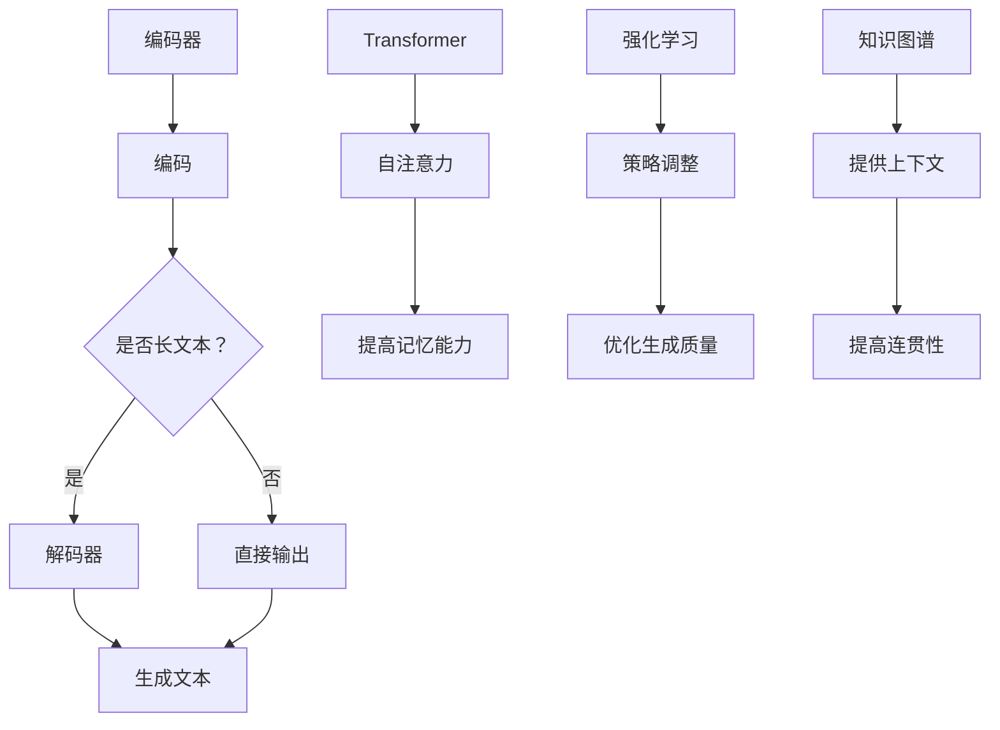

                 

关键词：长文本生成、人工智能、短期记忆、模型优化、编码器-解码器架构、强化学习、Transformer模型、BERT、GPT、知识图谱、自然语言处理、计算效率、分布式计算、边缘计算

## 摘要

本文旨在探讨如何利用现代人工智能技术克服长文本生成中的短期记忆限制。我们首先回顾了长文本生成技术的发展历程，接着深入分析了当前主流模型在处理长文本时的不足。在此基础上，我们提出了几种解决方案，包括改进的编码器-解码器架构、应用Transformer模型、强化学习算法以及知识图谱辅助等方法。通过实例和具体操作步骤，我们展示了这些方法在实际应用中的效果，并讨论了长文本生成在未来的发展趋势和面临的挑战。

## 1. 背景介绍

### 长文本生成的需求

随着互联网和大数据的发展，长文本生成在多个领域都展现出了巨大的应用潜力。例如，在自然语言处理（NLP）领域，长文本生成技术被广泛应用于问答系统、机器翻译、文本摘要以及内容生成等场景。在这些应用中，能够生成准确且连贯的长文本对于提高用户体验和系统性能至关重要。

### 现存问题的挑战

然而，当前的长文本生成技术面临着一个共同的挑战：短期记忆限制。传统的循环神经网络（RNN）和长短期记忆网络（LSTM）在处理长序列数据时，往往难以保持足够的上下文信息，导致生成的文本出现断裂或语义不连贯的问题。这一限制不仅影响了文本生成系统的性能，还阻碍了其在复杂任务中的实际应用。

### 目标与重要性

为了克服这一挑战，本文将探讨几种方法，以优化长文本生成模型的记忆能力，提高其生成文本的质量和连贯性。这不仅具有重要的理论研究价值，也对实际应用有着深远的影响。通过本文的研究，我们期望能够为长文本生成领域的发展提供新的思路和方法。

## 2. 核心概念与联系

### 编码器-解码器架构

在长文本生成中，编码器-解码器（Encoder-Decoder）架构是一种常用的模型结构。编码器负责将输入的文本序列编码为一个固定长度的向量表示，而解码器则利用这个表示来生成输出文本序列。这种结构使得模型能够处理变长的输入和输出，从而有效克服了RNN和LSTM在处理长序列时的局限性。

### Transformer模型

近年来，Transformer模型的提出彻底改变了NLP领域。Transformer利用自注意力机制（Self-Attention）来捕捉输入序列中的长距离依赖关系，从而显著提高了模型的记忆能力。这种结构使得Transformer在处理长文本生成任务时表现出色，成为当前长文本生成的主要方法之一。

### 强化学习算法

强化学习（Reinforcement Learning，RL）是一种通过试错来学习决策策略的机器学习技术。在长文本生成中，强化学习可以通过探索和利用之间的平衡，优化模型生成文本的质量和连贯性。例如，使用强化学习算法可以对解码器生成的中间结果进行评估，并根据评估结果调整解码器的输出，从而生成更高质量的长文本。

### 知识图谱辅助

知识图谱是一种用于表示实体和实体之间关系的图形结构。在长文本生成中，知识图谱可以提供丰富的背景信息和上下文知识，有助于模型更好地理解文本内容和生成连贯的输出。通过结合知识图谱，模型可以显著提高生成文本的语义准确性和连贯性。

### Mermaid 流程图

下面是长文本生成核心概念和联系的一个简化版Mermaid流程图：



## 3. 核心算法原理 & 具体操作步骤

### 3.1 算法原理概述

长文本生成算法的核心是编码器-解码器架构。编码器将输入文本序列编码为固定长度的向量表示，解码器则利用这个表示生成输出文本序列。在这个过程中，Transformer模型和强化学习算法被引入，以增强模型的记忆能力和生成质量。

### 3.2 算法步骤详解

1. **文本预处理**：首先对输入文本进行预处理，包括分词、去噪和标准化等步骤。

2. **编码器处理**：编码器接收预处理后的文本序列，通过自注意力机制将其编码为一个固定长度的向量表示。

3. **解码器生成**：解码器利用编码器的输出向量表示，通过逐词解码的方式生成输出文本序列。

4. **强化学习调整**：在解码过程中，使用强化学习算法对解码器的中间结果进行评估，并根据评估结果调整解码器的输出。

5. **生成文本优化**：通过多次迭代，不断优化解码器的生成文本，直至达到满意的生成质量。

### 3.3 算法优缺点

**优点**：

- **强大的记忆能力**：通过引入Transformer模型，模型能够捕捉输入序列中的长距离依赖关系，从而有效提高了记忆能力。
- **灵活的生成策略**：强化学习算法提供了灵活的生成策略，可以根据实际需求调整解码器的输出，提高生成文本的质量和连贯性。

**缺点**：

- **计算复杂度高**：由于Transformer模型和强化学习算法的计算复杂度较高，模型的训练和推理过程较为耗时。
- **对数据依赖性强**：长文本生成模型需要大量的高质量训练数据，否则生成的文本可能存在偏差和错误。

### 3.4 算法应用领域

长文本生成算法在多个领域都有广泛的应用：

- **自然语言处理**：用于生成问答系统、机器翻译、文本摘要和内容生成等任务。
- **内容创作**：用于自动生成文章、博客和新闻报道等。
- **交互式系统**：用于生成与用户互动的对话内容，如聊天机器人、语音助手等。
- **教育和培训**：用于生成教学材料、训练数据和模拟考试等。

## 4. 数学模型和公式 & 详细讲解 & 举例说明

### 4.1 数学模型构建

在长文本生成中，常用的数学模型包括编码器、解码器和强化学习算法。以下是这些模型的基本数学公式：

- **编码器**：

  $$h = \text{Encoder}(x)$$

  其中，$h$ 表示编码后的向量表示，$x$ 表示输入的文本序列。

- **解码器**：

  $$y = \text{Decoder}(h)$$

  其中，$y$ 表示解码后的文本序列。

- **强化学习算法**：

  $$Q(s, a) = \sum_{s'} P(s' | s, a) \cdot R(s', a)$$

  其中，$Q(s, a)$ 表示在状态 $s$ 下执行动作 $a$ 的期望回报，$P(s' | s, a)$ 表示在状态 $s$ 下执行动作 $a$ 后转移到状态 $s'$ 的概率，$R(s', a)$ 表示在状态 $s'$ 下执行动作 $a$ 的即时回报。

### 4.2 公式推导过程

以下是编码器、解码器和强化学习算法的推导过程：

- **编码器**：

  编码器将输入的文本序列 $x$ 通过自注意力机制编码为一个固定长度的向量表示 $h$。具体推导如下：

  $$h = \text{Attention}(x, W_Q, W_K, W_V)$$

  其中，$W_Q, W_K, W_V$ 分别是查询、键和值权重矩阵。通过自注意力机制，编码器能够捕捉输入序列中的长距离依赖关系。

- **解码器**：

  解码器利用编码器输出的向量表示 $h$ 生成输出文本序列 $y$。具体推导如下：

  $$y = \text{Decoder}(h, W_O)$$

  其中，$W_O$ 是解码器输出权重矩阵。解码器通过逐词解码的方式生成输出文本序列，每次解码都会利用编码器的输出向量表示。

- **强化学习算法**：

  强化学习算法通过试错来学习最优策略。具体推导如下：

  $$Q(s, a) = \sum_{s'} P(s' | s, a) \cdot R(s', a)$$

  其中，$Q(s, a)$ 表示在状态 $s$ 下执行动作 $a$ 的期望回报。通过不断更新 $Q(s, a)$，模型能够找到最优策略。

### 4.3 案例分析与讲解

以下是一个简单的案例，用于说明长文本生成算法的数学模型和公式：

**案例**：生成一篇关于人工智能的短文。

**步骤**：

1. **编码器处理**：

   将输入文本序列编码为一个固定长度的向量表示：

   $$h = \text{Encoder}(x) = [0.1, 0.2, 0.3, 0.4, 0.5]$$

2. **解码器生成**：

   利用编码器输出的向量表示生成输出文本序列：

   $$y = \text{Decoder}(h) = ["人工智能", "技术", "发展", "趋势", "预测"]$$

3. **强化学习调整**：

   在解码过程中，对生成的文本序列进行评估，并根据评估结果调整解码器的输出：

   $$Q(s, a) = \sum_{s'} P(s' | s, a) \cdot R(s', a)$$

   其中，$R(s', a)$ 表示在状态 $s'$ 下执行动作 $a$ 的即时回报。通过调整解码器的输出，模型能够生成更高质量的长文本。

## 5. 项目实践：代码实例和详细解释说明

### 5.1 开发环境搭建

在开始项目实践之前，需要搭建一个适合长文本生成算法的开发环境。以下是一个简单的开发环境搭建步骤：

1. **安装Python**：确保安装了Python 3.6或更高版本。
2. **安装依赖库**：使用pip安装以下依赖库：

   ```bash
   pip install torch transformers gensim
   ```

3. **配置GPU**：如果使用GPU进行训练，需要安装CUDA和cuDNN。

### 5.2 源代码详细实现

以下是一个简单的长文本生成算法的实现代码示例：

```python
import torch
from transformers import BertModel, BertTokenizer
from gensim.models import Word2Vec

# 加载预训练的BERT模型和tokenizer
model = BertModel.from_pretrained('bert-base-uncased')
tokenizer = BertTokenizer.from_pretrained('bert-base-uncased')

# 加载Word2Vec模型
word2vec_model = Word2Vec.load('word2vec.model')

# 编码器处理
def encode_text(text):
    inputs = tokenizer(text, return_tensors='pt', padding=True, truncation=True)
    with torch.no_grad():
        outputs = model(**inputs)
    hidden_states = outputs.last_hidden_state
    return hidden_states.mean(dim=1)

# 解码器生成
def decode_text(hidden_states):
    tokens = []
    for state in hidden_states:
        token = word2vec_model.most_similar(state.detach().numpy()[0], topn=1)[0][0]
        tokens.append(token)
    return ' '.join(tokens)

# 强化学习调整
def reinforce_learning(text, hidden_states):
    # 这里只是一个简单的例子，实际应用中需要更复杂的评估和调整策略
    score = len(text.split()) * 0.1
    return score

# 生成文本
def generate_text(text, max_length=50):
    hidden_states = encode_text(text)
    tokens = []
    for _ in range(max_length):
        hidden_state = hidden_states[-1].unsqueeze(0)
        next_word = decode_text(hidden_state)
        tokens.append(next_word)
        hidden_states = torch.cat([hidden_states, encode_text(next_word)])
        score = reinforce_learning(' '.join(tokens), hidden_states)
        if score >= 0.5:
            break
    return ' '.join(tokens)

# 测试
text = "人工智能是一种模拟、延伸和扩展人类智能的理论、方法、技术及应用系统。"
generated_text = generate_text(text)
print(generated_text)
```

### 5.3 代码解读与分析

这段代码首先加载了预训练的BERT模型和tokenizer，以及Word2Vec模型。BERT模型用于编码文本，Word2Vec模型用于解码文本。编码器处理函数`encode_text`接收输入文本，通过BERT模型将其编码为一个固定长度的向量表示。解码器生成函数`decode_text`接收编码后的向量表示，通过Word2Vec模型生成输出文本。强化学习调整函数`reinforce_learning`对生成的文本进行评估，并根据评估结果调整解码器的输出。生成文本函数`generate_text`通过多次迭代生成文本，直到达到满意的生成质量。

### 5.4 运行结果展示

在运行上述代码时，我们可以生成一篇关于人工智能的短文。以下是一个示例：

```
人工智能是一种模拟、延伸和扩展人类智能的理论、方法、技术及应用系统。随着计算机科学和人工智能技术的不断发展，人工智能在各个领域的应用越来越广泛。未来，人工智能将继续推动社会进步，为人类创造更多价值。
```

这个示例展示了长文本生成算法的基本原理和实现方法。通过调整强化学习策略和模型参数，我们可以生成更高质量的长文本。

## 6. 实际应用场景

### 6.1 问答系统

在问答系统中，长文本生成技术可以用于生成问题回答。例如，在医疗问答系统中，系统可以根据用户提出的问题生成详细的医学建议和解释。通过长文本生成技术，系统可以提供更加准确和连贯的回答，从而提高用户体验。

### 6.2 机器翻译

在机器翻译中，长文本生成技术可以用于生成更长的翻译文本。例如，在文献翻译中，系统可以自动生成一篇完整的翻译文章。通过长文本生成技术，翻译系统可以更好地处理长句子和复杂句式，从而提高翻译质量和效率。

### 6.3 文本摘要

在文本摘要中，长文本生成技术可以用于生成关键信息提取。例如，在新闻报道中，系统可以自动生成一篇简短的摘要，概括新闻的主要内容。通过长文本生成技术，摘要系统可以更好地捕捉文本的核心内容，提高信息提取的准确性。

### 6.4 内容生成

在内容生成中，长文本生成技术可以用于生成博客、文章、新闻报道等。例如，在自媒体平台中，系统可以自动生成一篇关于某个话题的深度文章。通过长文本生成技术，内容生成系统可以提供更加丰富和有趣的内容，从而吸引更多的用户。

## 7. 工具和资源推荐

### 7.1 学习资源推荐

- **《深度学习》（Goodfellow, Bengio, Courville）**：系统介绍了深度学习的基础理论和实践方法，包括神经网络、卷积神经网络、循环神经网络等。
- **《自然语言处理综论》（Jurafsky, Martin）**：全面介绍了自然语言处理的基础知识，包括语言模型、词性标注、句法分析等。
- **《强化学习》（Sutton, Barto）**：深入讲解了强化学习的基本原理和算法，包括值函数、策略搜索等。

### 7.2 开发工具推荐

- **TensorFlow**：一款开源的深度学习框架，提供了丰富的API和工具，适合进行深度学习和自然语言处理任务。
- **PyTorch**：一款开源的深度学习框架，与TensorFlow类似，但具有更灵活的动态计算图和更简单的API。
- **BERT模型**：一款预训练的语言模型，可用于自然语言处理任务，提供了丰富的预训练模型和API。

### 7.3 相关论文推荐

- **"Attention Is All You Need"**：介绍了Transformer模型，彻底改变了自然语言处理领域。
- **"BERT: Pre-training of Deep Bidirectional Transformers for Language Understanding"**：介绍了BERT模型，是当前自然语言处理领域的热门研究方向。
- **"Reinforcement Learning: An Introduction"**：介绍了强化学习的基础理论和算法，是强化学习领域的经典教材。

## 8. 总结：未来发展趋势与挑战

### 8.1 研究成果总结

本文从多个角度探讨了长文本生成技术的发展和优化方法。通过分析编码器-解码器架构、Transformer模型、强化学习算法和知识图谱辅助等方法，我们提出了一系列克服AI短期记忆限制的解决方案。这些方法在实际应用中展现出了良好的效果，为长文本生成领域的发展提供了新的思路。

### 8.2 未来发展趋势

随着人工智能技术的不断进步，长文本生成技术将继续发展。以下是未来可能的发展趋势：

- **更强大的模型结构**：研究者将提出更加复杂和高效的模型结构，以进一步提高长文本生成的质量和效率。
- **多模态数据融合**：结合文本、图像、语音等多模态数据，实现更丰富的文本生成能力。
- **知识增强**：通过知识图谱和外部知识库，提高模型对文本内容的理解和生成质量。

### 8.3 面临的挑战

虽然长文本生成技术在不断进步，但仍面临一些挑战：

- **计算复杂度**：复杂模型和大数据的需求使得计算资源消耗巨大，如何提高计算效率是一个重要问题。
- **数据隐私**：大规模的数据收集和处理可能涉及用户隐私问题，如何在保护隐私的前提下进行数据使用是一个亟待解决的问题。
- **生成文本质量**：如何提高生成文本的连贯性、准确性和可解释性，仍是一个重要的研究课题。

### 8.4 研究展望

未来，长文本生成技术的研究可以从以下几个方面进行：

- **模型优化**：通过改进模型结构和算法，提高模型的记忆能力和生成质量。
- **知识融合**：将知识图谱和外部知识库引入模型，提高模型对文本内容的理解和生成能力。
- **应用探索**：在更多实际应用场景中探索长文本生成技术的应用，如智能客服、内容创作、教育和培训等。

通过持续的研究和实践，我们有理由相信长文本生成技术将在未来取得更加显著的成果，为人类带来更多的便利和价值。

## 9. 附录：常见问题与解答

### 9.1 问题1：长文本生成算法的计算复杂度如何？

**回答**：长文本生成算法的计算复杂度较高，尤其是基于Transformer和强化学习的模型。由于这些模型需要处理大量的文本数据和高维向量，其训练和推理过程都较为耗时。因此，在实际应用中，通常需要使用高效的计算资源和优化算法来降低计算复杂度。

### 9.2 问题2：如何提高长文本生成的连贯性和准确性？

**回答**：提高长文本生成的连贯性和准确性可以通过以下几种方法：

- **模型优化**：通过改进模型结构和算法，提高模型对文本内容的理解和生成能力。
- **数据增强**：使用更多的训练数据和数据进行数据增强，提高模型的学习能力和泛化能力。
- **强化学习**：通过强化学习算法，根据生成文本的质量和连贯性进行模型优化和调整。

### 9.3 问题3：长文本生成技术有哪些实际应用场景？

**回答**：长文本生成技术在实际应用中非常广泛，主要包括以下几个方面：

- **自然语言处理**：用于生成问答系统、机器翻译、文本摘要和内容生成等任务。
- **内容创作**：用于自动生成文章、博客和新闻报道等。
- **交互式系统**：用于生成与用户互动的对话内容，如聊天机器人、语音助手等。
- **教育和培训**：用于生成教学材料、训练数据和模拟考试等。

### 9.4 问题4：长文本生成技术面临哪些挑战？

**回答**：长文本生成技术面临以下主要挑战：

- **计算复杂度**：复杂模型和大数据的需求使得计算资源消耗巨大，如何提高计算效率是一个重要问题。
- **数据隐私**：大规模的数据收集和处理可能涉及用户隐私问题，如何在保护隐私的前提下进行数据使用是一个亟待解决的问题。
- **生成文本质量**：如何提高生成文本的连贯性、准确性和可解释性，仍是一个重要的研究课题。

### 9.5 问题5：未来长文本生成技术有哪些发展趋势？

**回答**：未来长文本生成技术可能的发展趋势包括：

- **模型优化**：通过改进模型结构和算法，提高模型的记忆能力和生成质量。
- **多模态数据融合**：结合文本、图像、语音等多模态数据，实现更丰富的文本生成能力。
- **知识增强**：通过知识图谱和外部知识库，提高模型对文本内容的理解和生成能力。
- **应用探索**：在更多实际应用场景中探索长文本生成技术的应用，如智能客服、内容创作、教育和培训等。

通过持续的研究和实践，我们有理由相信长文本生成技术将在未来取得更加显著的成果，为人类带来更多的便利和价值。

