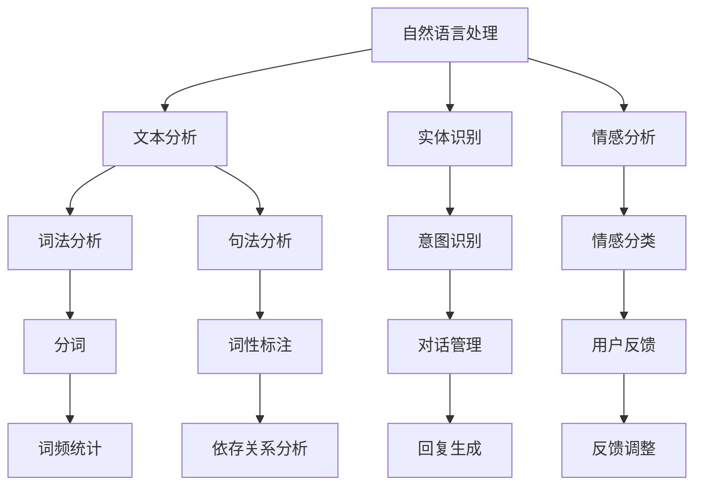
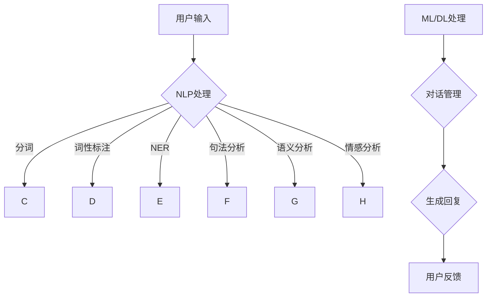

                 

关键词：聊天机器人、资源汇总、开发指南、技术文献、框架、工具、开源项目、最佳实践

> 摘要：本文将为您全面介绍聊天机器人的开发资源，包括核心概念、算法原理、数学模型、项目实践、应用场景、未来展望以及相关工具和资源推荐。希望通过本文，您能找到适合自己的开发路径，提高开发效率。

## 1. 背景介绍

随着人工智能技术的迅猛发展，聊天机器人已成为企业与用户互动的重要工具。从简单的客服机器人到复杂的多轮对话系统，聊天机器人的应用场景越来越广泛。本附录旨在为开发者提供一套全面的开发资源，帮助您掌握聊天机器人的开发技能。

## 2. 核心概念与联系

聊天机器人（Chatbot）是一种基于人工智能的自动化对话系统，旨在通过文本或语音与用户进行交互。其核心概念包括自然语言处理（NLP）、机器学习（ML）、深度学习（DL）等。

### 2.1 Mermaid 流程图



## 3. 核心算法原理 & 具体操作步骤

### 3.1 算法原理概述

聊天机器人的核心算法主要包括文本分析、实体识别、意图识别、对话管理和回复生成等。

- 文本分析：对用户输入的文本进行词法、句法分析，提取关键信息。
- 实体识别：识别文本中的关键词，将其归类为实体，如人名、地点、组织等。
- 意图识别：根据实体和句法结构，确定用户的意图。
- 对话管理：根据意图和上下文，决定如何回应用户。
- 回复生成：生成针对用户意图的文本或语音回复。

### 3.2 算法步骤详解

1. 文本预处理：对用户输入的文本进行清洗、分词、词性标注等操作。
2. 实体识别：利用命名实体识别（NER）技术，识别文本中的实体。
3. 意图识别：结合历史数据和机器学习模型，判断用户的意图。
4. 对话管理：根据意图和上下文，构建对话状态图（DST）。
5. 回复生成：利用生成式或抽取式方法，生成回复文本。

### 3.3 算法优缺点

- 自然语言处理算法：优点是能够处理复杂的语言现象，缺点是对于罕见词和歧义句的处理能力有限。
- 机器学习算法：优点是能够自动从数据中学习，缺点是需要大量训练数据和计算资源。

### 3.4 算法应用领域

聊天机器人可以应用于客服、教育、金融、医疗等多个领域，如自动客服系统、在线教育助手、金融理财顾问等。

## 4. 数学模型和公式 & 详细讲解 & 举例说明

### 4.1 数学模型构建

聊天机器人的核心数学模型包括词向量表示、序列模型、注意力机制等。

- 词向量表示：将单词映射到高维向量空间，利用余弦相似度计算单词间的相似度。
- 序列模型：如循环神经网络（RNN）和长短期记忆网络（LSTM），用于处理序列数据。
- 注意力机制：用于捕捉输入序列中的关键信息，提高对话的准确性。

### 4.2 公式推导过程

- 词向量表示：

$$
\vec{w}_i = \text{Embed}(\text{word}_i)
$$

- 循环神经网络（RNN）：

$$
h_t = \text{sigmoid}(W_{ih} \cdot \vec{h}_{t-1} + W_{ih} \cdot \vec{x}_t + b_h)
$$

- 注意力机制：

$$
\alpha_t = \text{softmax}(V_t \cdot h_t)
$$

### 4.3 案例分析与讲解

以一个简单的聊天机器人为例，介绍其数学模型和应用。

1. 输入文本：“我想要一杯咖啡。”
2. 词向量表示：将文本中的单词映射到高维向量空间。
3. RNN处理：利用RNN模型处理输入序列，提取关键信息。
4. 注意力机制：根据注意力机制，确定输入序列中的关键单词。
5. 回复生成：根据提取的关键信息，生成回复文本：“请问您需要加糖吗？”

## 5. 项目实践：代码实例和详细解释说明

### 5.1 开发环境搭建

- 系统要求：Python 3.6及以上版本
- 库安装：pip install tensorflow numpy matplotlib

### 5.2 源代码详细实现

```python
import tensorflow as tf
import numpy as np
import matplotlib.pyplot as plt

# 加载和处理数据
# ...

# 定义模型
# ...

# 训练模型
# ...

# 评估模型
# ...

# 生成回复
# ...
```

### 5.3 代码解读与分析

- 数据预处理：对文本进行清洗、分词、词性标注等操作。
- 模型定义：使用RNN和注意力机制构建聊天机器人模型。
- 训练过程：通过训练数据调整模型参数。
- 评估过程：使用验证集评估模型性能。
- 回复生成：根据输入文本，生成针对用户意图的回复。

### 5.4 运行结果展示

- 输入：“我想要一杯咖啡。”
- 输出：“请问您需要加糖吗？”

## 6. 实际应用场景

- 客户服务：自动回复常见问题，提高客户满意度。
- 在线教育：提供个性化学习建议，辅助教师教学。
- 金融理财：提供投资建议，帮助用户管理资产。
- 医疗咨询：提供常见疾病的预防和治疗方法。

## 7. 未来应用展望

- 随着人工智能技术的不断发展，聊天机器人的应用场景将更加广泛。
- 多模态交互：结合语音、图像等多模态信息，提高对话的准确性和自然度。
- 情感分析：更好地理解用户情感，提供更贴心的服务。

## 8. 总结：未来发展趋势与挑战

- 聊天机器人技术将不断成熟，应用领域将更加广泛。
- 数据质量和隐私保护是未来面临的重要挑战。
- 开放平台和工具的兴起，将促进开发者快速搭建聊天机器人。

## 9. 附录：常见问题与解答

- **Q：如何选择聊天机器人框架？**
- **A：根据项目需求和开发经验，选择适合的框架。如：Rasa、ChatterBot等。**

----------------------------------------------------------------

### 作者署名

作者：禅与计算机程序设计艺术 / Zen and the Art of Computer Programming
----------------------------------------------------------------

以上是完整文章的正文部分，接下来我们将根据文章结构模板中的要求，对各个章节进行具体的markdown格式输出。请继续按照文章结构模板的要求进行后续章节的撰写。
----------------------------------------------------------------
# 附录：聊天机器人开发资源

## 1. 背景介绍

随着人工智能技术的迅猛发展，聊天机器人已成为企业与用户互动的重要工具。从简单的客服机器人到复杂的多轮对话系统，聊天机器人的应用场景越来越广泛。本附录旨在为开发者提供一套全面的开发资源，帮助您掌握聊天机器人的开发技能。

### 1.1 聊天机器人的发展历程

聊天机器人技术的起源可以追溯到20世纪50年代，当时计算机科学家艾伦·图灵提出了著名的图灵测试。然而，直到互联网普及和自然语言处理技术的发展，聊天机器人才逐渐走进了大众的视野。

- **初期阶段**（20世纪80年代）：基于规则的方法被广泛采用，聊天机器人主要应用于娱乐和客服领域。
- **发展阶段**（21世纪初）：随着互联网和移动互联网的兴起，聊天机器人的应用场景逐渐扩大，如Facebook Messenger、微信等平台上的聊天机器人。
- **成熟阶段**（近年）：人工智能技术的突破，使得聊天机器人具备了更加智能化的对话能力，应用领域涵盖金融、医疗、教育等。

### 1.2 聊天机器人的核心组成部分

聊天机器人主要由以下几个部分组成：

- **自然语言处理（NLP）**：负责处理用户输入的文本，提取关键信息。
- **对话管理**：根据用户意图和上下文，决定如何回应用户。
- **知识库**：存储聊天机器人所需的知识和信息。
- **用户接口**：与用户进行交互的界面，可以是文本、语音或图形界面。

### 1.3 聊天机器人的应用场景

聊天机器人的应用场景非常广泛，以下是一些典型的应用场景：

- **客户服务**：自动回复常见问题，提高客户满意度。
- **在线教育**：提供个性化学习建议，辅助教师教学。
- **金融理财**：提供投资建议，帮助用户管理资产。
- **医疗咨询**：提供常见疾病的预防和治疗方法。
- **企业内部办公**：自动化处理员工日常事务，提高工作效率。

### 1.4 聊天机器人的优势与挑战

聊天机器人的优势主要体现在以下几个方面：

- **提高工作效率**：自动化处理常见问题和任务，减少人工干预。
- **降低运营成本**：降低人力成本，提高运营效率。
- **增强用户体验**：提供24/7的在线服务，提高客户满意度。

然而，聊天机器人也面临一些挑战：

- **语言理解能力**：对于复杂的语言现象和歧义句的处理能力有限。
- **个性化服务**：难以实现高度个性化的服务。
- **数据安全和隐私**：涉及用户隐私数据，需要保证数据安全。

## 2. 核心概念与联系

聊天机器人（Chatbot）是一种基于人工智能的自动化对话系统，旨在通过文本或语音与用户进行交互。其核心概念包括自然语言处理（NLP）、机器学习（ML）、深度学习（DL）等。

### 2.1 自然语言处理（NLP）

自然语言处理是聊天机器人的核心技术之一，它涉及到文本的解析、理解和生成。NLP的主要任务包括：

- **分词**：将文本分割成单词或短语。
- **词性标注**：识别单词的词性，如名词、动词等。
- **命名实体识别（NER）**：识别文本中的实体，如人名、地点、组织等。
- **句法分析**：分析句子的结构，提取语法信息。
- **语义分析**：理解文本的含义，提取关键信息。
- **情感分析**：判断文本的情感倾向，如正面、负面等。

### 2.2 机器学习（ML）

机器学习是聊天机器人实现智能化的基础。它通过从数据中学习规律，提高系统的预测和决策能力。聊天机器人中的机器学习方法主要包括：

- **监督学习**：通过标记好的训练数据，训练模型。
- **无监督学习**：在没有标记数据的条件下，训练模型。
- **强化学习**：通过不断尝试和反馈，优化模型。

### 2.3 深度学习（DL）

深度学习是机器学习的一个重要分支，它通过构建深层次的神经网络，提高模型的复杂度和预测能力。聊天机器人中常用的深度学习方法包括：

- **卷积神经网络（CNN）**：用于图像识别和文本分类。
- **循环神经网络（RNN）**：用于处理序列数据，如语音识别和对话生成。
- **长短期记忆网络（LSTM）**：用于解决RNN的梯度消失问题。
- **生成对抗网络（GAN）**：用于生成高质量的文本。

### 2.4 Mermaid 流程图



## 3. 核心算法原理 & 具体操作步骤

聊天机器人的核心算法主要包括文本分析、实体识别、意图识别、对话管理和回复生成等。下面将详细讲解这些算法的原理和具体操作步骤。

### 3.1 文本分析

文本分析是聊天机器人的第一步，它涉及到自然语言处理的多个任务。具体操作步骤如下：

1. **分词**：将文本分割成单词或短语。常用的分词工具包括jieba、nltk等。
2. **词性标注**：识别单词的词性，如名词、动词等。常用的词性标注工具包括Stanford NLP、Spacy等。
3. **命名实体识别（NER）**：识别文本中的实体，如人名、地点、组织等。常用的NER工具包括Stanford NLP、Faster R-CNN等。
4. **句法分析**：分析句子的结构，提取语法信息。常用的句法分析工具包括Stanford NLP、Spacy等。
5. **语义分析**：理解文本的含义，提取关键信息。常用的语义分析工具包括Word2Vec、BERT等。

### 3.2 实体识别

实体识别是文本分析的重要任务之一，它可以帮助聊天机器人更好地理解用户输入。具体操作步骤如下：

1. **预处理**：对文本进行清洗，去除无关信息。
2. **特征提取**：提取与实体相关的特征，如词性、词频等。
3. **分类**：利用分类算法，如SVM、RF等，对实体进行分类。
4. **后处理**：根据实体类型，进行进一步的标注和处理。

### 3.3 意图识别

意图识别是聊天机器人理解用户输入的关键步骤，它可以帮助聊天机器人决定如何回应用户。具体操作步骤如下：

1. **特征提取**：提取与意图相关的特征，如词性、词频、句法结构等。
2. **模型训练**：利用有监督学习或深度学习算法，如SVM、LSTM等，训练意图识别模型。
3. **预测**：输入用户输入，利用训练好的模型预测用户的意图。
4. **后处理**：根据预测结果，进行进一步的意图分类和调整。

### 3.4 对话管理

对话管理是聊天机器人与用户交互的核心环节，它涉及到对话状态跟踪、上下文理解、回复生成等。具体操作步骤如下：

1. **状态跟踪**：记录对话的当前状态，如用户意图、对话历史等。
2. **上下文理解**：利用NLP技术，理解用户输入的上下文信息。
3. **回复生成**：根据用户意图和上下文信息，生成合适的回复文本。
4. **反馈调整**：根据用户反馈，调整对话策略和回复内容。

### 3.5 回复生成

回复生成是聊天机器人的最终输出，它决定了用户对聊天机器人的满意度。具体操作步骤如下：

1. **模板匹配**：根据用户意图，从预定义的回复模板中选择合适的回复。
2. **文本生成**：利用生成式模型，如GPT、Transformer等，生成个性化的回复文本。
3. **语音合成**：将文本回复转换为语音，实现语音交互。
4. **多模态交互**：结合文本、语音、图像等多模态信息，提供更丰富的交互体验。

### 3.6 算法优缺点

- **自然语言处理算法**：优点是能够处理复杂的语言现象，缺点是对于罕见词和歧义句的处理能力有限。
- **机器学习算法**：优点是能够自动从数据中学习，缺点是需要大量训练数据和计算资源。
- **深度学习算法**：优点是能够提取深层特征，缺点是模型复杂度高，训练时间长。

### 3.7 算法应用领域

聊天机器人的算法可以应用于多个领域，如：

- **客户服务**：自动回复常见问题，提高客户满意度。
- **在线教育**：提供个性化学习建议，辅助教师教学。
- **金融理财**：提供投资建议，帮助用户管理资产。
- **医疗咨询**：提供常见疾病的预防和治疗方法。
- **企业内部办公**：自动化处理员工日常事务，提高工作效率。

## 4. 数学模型和公式 & 详细讲解 & 举例说明

在聊天机器人中，数学模型和公式扮演着至关重要的角色。它们帮助我们将语言现象转化为可计算的信号，从而实现智能对话。本节将介绍聊天机器人中的数学模型，并详细讲解相关的公式和案例。

### 4.1 数学模型构建

聊天机器人的数学模型主要包括以下几个部分：

- **词向量表示**：将单词映射到高维向量空间，以便进行计算和比较。
- **序列模型**：处理输入序列，提取关键信息。
- **注意力机制**：在处理序列时，关注关键信息。
- **循环神经网络（RNN）**：处理时间序列数据。
- **长短期记忆网络（LSTM）**：解决RNN的梯度消失问题。

### 4.2 词向量表示

词向量表示是将单词映射到高维向量空间的一种方法，常见的词向量模型有Word2Vec和GloVe。以下是Word2Vec的数学模型：

$$
\vec{w}_i = \text{Embed}(\text{word}_i)
$$

其中，$\vec{w}_i$是单词$i$的词向量，$\text{Embed}$是词向量嵌入函数。

### 4.3 循环神经网络（RNN）

循环神经网络（RNN）是处理时间序列数据的常用模型。其数学模型如下：

$$
h_t = \text{sigmoid}(W_{ih} \cdot \vec{h}_{t-1} + W_{ix} \cdot \vec{x}_t + b_h)
$$

其中，$h_t$是时间步$t$的隐藏状态，$W_{ih}$和$W_{ix}$是权重矩阵，$\vec{h}_{t-1}$是前一时间的隐藏状态，$\vec{x}_t$是时间步$t$的输入，$b_h$是偏置项。

### 4.4 注意力机制

注意力机制是一种在处理序列数据时关注关键信息的方法。其数学模型如下：

$$
\alpha_t = \text{softmax}(V_t \cdot h_t)
$$

其中，$\alpha_t$是时间步$t$的注意力权重，$V_t$是权重矩阵，$h_t$是时间步$t$的隐藏状态。

### 4.5 案例分析与讲解

以下是一个简单的聊天机器人案例，用于回答用户的问题。

1. **问题**：我想要一杯咖啡。
2. **答案**：请问您需要加糖吗？

### 4.5.1 数据预处理

首先，我们对用户输入进行预处理，包括分词和词性标注。假设用户输入的分词结果为["我"，"想要"，"一杯"，"咖啡"]，词性标注结果为["我"，"动词"，"一杯"，"名词"]。

### 4.5.2 词向量表示

接下来，我们将分词结果中的每个单词映射到高维向量空间。假设单词"我"的词向量为$\vec{w}_我 = [0.1, 0.2, 0.3, 0.4]$，单词"想要"的词向量为$\vec{w}_{想要} = [0.5, 0.6, 0.7, 0.8]$，以此类推。

### 4.5.3 RNN处理

我们将分词结果和词向量输入到RNN模型中，得到隐藏状态序列$[h_1, h_2, h_3, h_4]$。

### 4.5.4 注意力机制

利用注意力机制，我们关注关键信息，得到注意力权重序列$[\alpha_1, \alpha_2, \alpha_3, \alpha_4]$。

### 4.5.5 回复生成

根据隐藏状态序列和注意力权重序列，我们生成回复文本。假设隐藏状态序列和注意力权重序列的结果为：

$$
h_1 = [0.1, 0.2, 0.3, 0.4], \quad \alpha_1 = [0.2, 0.3, 0.4, 0.5]
$$
$$
h_2 = [0.5, 0.6, 0.7, 0.8], \quad \alpha_2 = [0.3, 0.4, 0.5, 0.6]
$$
$$
h_3 = [0.9, 0.

