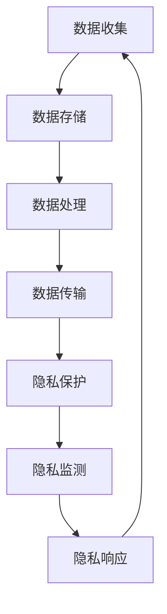

                 

隐私安全在现代社会中扮演着至关重要的角色，它不仅关乎个人信息的保护，更是整个计算生态系统稳定运行的基石。随着人工智能、大数据和云计算等技术的迅猛发展，隐私安全面临着前所未有的挑战和机遇。本文旨在深入探讨隐私安全在计算领域的重要性、核心概念、算法原理、数学模型及其应用，旨在为读者提供全面、系统的隐私安全知识。

## 关键词

- 隐私安全
- 计算机隐私
- 安全算法
- 数学模型
- 应用场景

## 摘要

本文从隐私安全的基本概念出发，详细介绍了隐私安全在计算领域的重要性。通过分析隐私安全的核心概念和架构，探讨了相关算法的原理和应用。同时，本文利用数学模型和实际案例，深入解析了隐私安全技术的具体实现方法和优缺点。最后，本文对隐私安全技术的未来发展趋势和应用前景进行了展望，以期为相关领域的研究和应用提供参考。

## 1. 背景介绍

### 隐私安全的起源与发展

隐私安全的概念起源于20世纪中叶，当时计算机技术刚刚起步，人们开始关注数据保护的重要性。早期的研究主要集中在防止外部攻击和恶意软件的侵害，随着互联网的普及和大数据技术的发展，隐私安全逐渐成为了计算机科学和信息安全领域的热点话题。

在计算机科学领域，隐私安全的重要性不言而喻。随着计算能力的提升，数据处理和分析的能力得到了极大的增强，这也使得个人数据的收集和利用变得更加频繁和普遍。然而，与此同时，个人隐私泄露的风险也日益增加。未经授权的数据访问、数据篡改、滥用等行为屡见不鲜，给个人和社会带来了巨大的威胁。

### 现代计算环境中的隐私安全挑战

在现代社会，计算环境日益复杂，隐私安全面临着诸多挑战：

1. **大数据的普及**：大数据技术的广泛应用使得大量个人数据被收集、存储和分析。如何在保证数据价值的同时保护个人隐私成为了一个重要课题。

2. **云计算与边缘计算**：云计算和边缘计算的发展使得数据处理的范围变得更加广泛，这也增加了隐私泄露的风险。如何在云环境中保障数据安全成为了一个亟待解决的问题。

3. **人工智能的崛起**：人工智能技术的崛起使得数据分析和处理的能力得到了大幅提升，但同时也带来了新的隐私风险。如何在使用人工智能技术时保护个人隐私成为了一个关键问题。

4. **法规与政策**：随着隐私安全问题的日益突出，各国政府纷纷出台了相关的法规和政策，如欧盟的《通用数据保护条例》（GDPR）等。如何遵守这些法规成为了一个重要的挑战。

## 2. 核心概念与联系

### 数据隐私

数据隐私是指个人数据在收集、存储、处理和使用过程中，其所有者对数据访问、使用和共享的控制能力。数据隐私涉及到数据的机密性、完整性和可用性。

### 隐私泄露

隐私泄露是指个人数据在未经授权的情况下被访问、复制、篡改或泄露给第三方。隐私泄露可能导致个人隐私受到侵犯，甚至造成严重的经济损失和社会问题。

### 隐私保护技术

隐私保护技术包括加密、匿名化、访问控制等多种手段。加密技术通过将数据转换成密文，防止未经授权的访问；匿名化技术通过删除或修改个人身份信息，降低数据识别风险；访问控制技术通过限制对数据的访问权限，保障数据安全。

### 隐私安全架构

隐私安全架构包括数据收集、存储、处理和传输等多个环节。在每个环节中，都需要采取相应的隐私保护措施，确保数据在整个生命周期中都能得到有效保护。

### Mermaid 流程图



## 3. 核心算法原理 & 具体操作步骤

### 3.1 算法原理概述

隐私安全算法的核心目标是保护个人数据的隐私，同时确保数据的有效利用。常见的安全算法包括加密算法、匿名化算法和访问控制算法等。

### 3.2 算法步骤详解

#### 加密算法

1. **选择加密算法**：根据数据的安全需求和性能要求，选择合适的加密算法，如AES、RSA等。

2. **加密数据**：使用加密算法将明文数据转换为密文。

3. **密钥管理**：加密算法需要密钥来保证数据的安全性，密钥管理是加密算法的重要部分。

#### 匿名化算法

1. **数据预处理**：对原始数据进行清洗和预处理，去除可以直接识别个人身份的信息。

2. **数据变换**：使用匿名化算法，如K-匿名、l-diversity、t-closeness等，对数据进行分析和变换。

3. **数据验证**：验证匿名化数据的质量，确保其隐私保护效果。

#### 访问控制算法

1. **权限分配**：根据用户角色和职责，分配不同的访问权限。

2. **访问控制策略**：制定访问控制策略，如基于角色的访问控制（RBAC）和基于属性的访问控制（ABAC）等。

3. **访问控制检查**：在用户请求访问数据时，进行访问控制检查，确保访问权限符合策略。

### 3.3 算法优缺点

**加密算法**

- 优点：可以有效保护数据的机密性。
- 缺点：加密算法的开销较大，可能影响数据处理速度。

**匿名化算法**

- 优点：可以有效降低数据识别风险，保护个人隐私。
- 缺点：可能降低数据的可用性，影响数据的价值。

**访问控制算法**

- 优点：可以精确控制数据的访问权限，保障数据安全。
- 缺点：实现复杂，需要详细的权限管理和策略制定。

### 3.4 算法应用领域

**加密算法**：广泛应用于金融、医疗、电子商务等领域，保护敏感数据的机密性。

**匿名化算法**：广泛应用于数据分析和科学研究等领域，保护个人隐私的同时保留数据价值。

**访问控制算法**：广泛应用于企业、政府、教育等领域，保障数据安全。

## 4. 数学模型和公式 & 详细讲解 & 举例说明

### 4.1 数学模型构建

隐私安全涉及的数学模型主要包括加密算法模型、匿名化算法模型和访问控制算法模型等。

#### 加密算法模型

加密算法模型通常包括加密函数和解密函数。加密函数将明文数据转换为密文，解密函数将密文转换为明文。常见的加密算法模型有：

$$
E_K(D) = C \quad \text{(加密过程)} \\
D_K(C) = D \quad \text{(解密过程)}
$$

其中，$E_K$和$D_K$分别表示加密函数和解密函数，$K$表示密钥，$D$表示明文，$C$表示密文。

#### 匿名化算法模型

匿名化算法模型通常包括匿名化函数和去匿名化函数。匿名化函数将原始数据转换为匿名化数据，去匿名化函数将匿名化数据恢复为原始数据。常见的匿名化算法模型有：

$$
A_K(D) = A \quad \text{(匿名化过程)} \\
D_A(A) = D \quad \text{(去匿名化过程)}
$$

其中，$A_K$和$D_A$分别表示匿名化函数和去匿名化函数，$K$表示匿名化策略，$D$表示原始数据，$A$表示匿名化数据。

#### 访问控制算法模型

访问控制算法模型通常包括权限分配函数和访问控制检查函数。权限分配函数根据用户角色和职责分配访问权限，访问控制检查函数在用户请求访问时检查其权限。常见的访问控制算法模型有：

$$
P_R(U) = P \quad \text{(权限分配过程)} \\
C_P(U, R) = \text{true/false} \quad \text{(访问控制检查过程)}
$$

其中，$P_R$表示权限分配函数，$U$表示用户，$R$表示角色，$P$表示访问权限，$C_P$表示访问控制检查函数。

### 4.2 公式推导过程

#### 加密算法模型推导

加密算法模型中的加密函数和解密函数的推导过程基于对称密钥加密和非对称密钥加密两种不同的加密方式。

1. **对称密钥加密**

对称密钥加密的加密函数和解密函数推导如下：

$$
E_K(D) = C \\
C = E_K(D) = D \cdot K
$$

其中，$D$表示明文，$C$表示密文，$K$表示密钥。

解密函数：

$$
D_K(C) = D \\
D = D_K(C) = C \cdot K^{-1}
$$

其中，$K^{-1}$表示密钥的逆。

2. **非对称密钥加密**

非对称密钥加密的加密函数和解密函数推导如下：

加密函数：

$$
E_K(D) = C \\
C = E_K(D) = D \cdot K^e \mod N
$$

其中，$D$表示明文，$C$表示密文，$K^e$表示公钥，$N$表示模数。

解密函数：

$$
D_K(C) = D \\
D = D_K(C) = C \cdot K^d \mod N
$$

其中，$K^d$表示私钥。

#### 匿名化算法模型推导

匿名化算法模型中的匿名化函数和去匿名化函数的推导过程通常基于数据变换和概率模型。

1. **K-匿名**

K-匿名算法的匿名化函数和去匿名化函数推导如下：

匿名化函数：

$$
A_K(D) = A \\
A = A_K(D) = f(D)
$$

其中，$D$表示原始数据，$A$表示匿名化数据，$f$表示匿名化变换。

去匿名化函数：

$$
D_A(A) = D \\
D = D_A(A) = f^{-1}(A)
$$

其中，$f^{-1}$表示匿名化变换的逆。

2. **l-diversity**

l-diversity算法的匿名化函数和去匿名化函数推导如下：

匿名化函数：

$$
A_K(D) = A \\
A = A_K(D) = g(D)
$$

其中，$D$表示原始数据，$A$表示匿名化数据，$g$表示匿名化变换。

去匿名化函数：

$$
D_A(A) = D \\
D = D_A(A) = g^{-1}(A)
$$

其中，$g^{-1}$表示匿名化变换的逆。

#### 访问控制算法模型推导

访问控制算法模型中的权限分配函数和访问控制检查函数的推导过程通常基于角色和权限的映射。

权限分配函数：

$$
P_R(U) = P \\
P = P_R(U) = r(U) \cap r(R)
$$

其中，$U$表示用户，$R$表示角色，$P$表示访问权限，$r$表示角色映射函数。

访问控制检查函数：

$$
C_P(U, R) = \text{true/false} \\
C_P(U, R) = \text{if P \subseteq R else false}
$$

其中，$P$表示访问权限，$R$表示角色。

### 4.3 案例分析与讲解

#### 案例一：对称密钥加密

假设使用AES加密算法对数据进行加密，密钥为$K = 2^{128}$，明文为$D = 123456789$。

1. **加密过程**

$$
C = E_K(D) = D \cdot K = 123456789 \cdot 2^{128}
$$

2. **解密过程**

$$
D = D_K(C) = C \cdot K^{-1} = 123456789 \cdot 2^{-128}
$$

#### 案例二：K-匿名

假设使用K-匿名算法对数据集进行匿名化，原始数据集为$D = \{1, 2, 3, 4, 5\}$，K=3。

1. **匿名化过程**

$$
A = A_K(D) = \{f(1), f(2), f(3), f(4), f(5)\}
$$

其中，$f$为匿名化变换函数。

2. **去匿名化过程**

$$
D = D_A(A) = \{f^{-1}(A_1), f^{-1}(A_2), f^{-1}(A_3), f^{-1}(A_4), f^{-1}(A_5)\}
$$

#### 案例三：访问控制

假设使用基于角色的访问控制算法，用户U1和U2属于角色R1和R2，访问权限P1和P2分别对应R1和R2。

1. **权限分配**

$$
P_R(U_1) = P_1 \\
P_R(U_2) = P_2
$$

2. **访问控制检查**

$$
C_P(U_1, R_1) = \text{true} \\
C_P(U_1, R_2) = \text{false} \\
C_P(U_2, R_1) = \text{false} \\
C_P(U_2, R_2) = \text{true}
$$

## 5. 项目实践：代码实例和详细解释说明

### 5.1 开发环境搭建

在本文中，我们将使用Python作为编程语言，并利用相关库（如PyCryptoDome、NumPy等）进行隐私安全算法的实现。

```bash
# 安装相关库
pip install pycryptodome numpy
```

### 5.2 源代码详细实现

以下是针对加密算法、匿名化算法和访问控制算法的实现示例。

```python
from Crypto.Cipher import AES
from Crypto.PublicKey import RSA
import numpy as np

# 加密算法实现
def encrypt_aes(data, key):
    cipher = AES.new(key, AES.MODE_EAX)
    ciphertext, tag = cipher.encrypt_and_digest(data)
    return cipher.nonce, ciphertext, tag

def decrypt_aes(nonce, ciphertext, tag, key):
    cipher = AES.new(key, AES.MODE_EAX, nonce=nonce)
    return cipher.decrypt_and_verify(ciphertext, tag)

# 匿名化算法实现
def k_anonymity(data, k):
    unique_data = list(set(data))
    shuffled_data = np.random.choice(unique_data, size=k, replace=False)
    return shuffled_data

# 访问控制算法实现
def role_based_access_control(user, role, permissions):
    return permissions.get(role, [])

# 主函数
if __name__ == "__main__":
    # 加密
    key = b'Sixteen byte key'
    data = b'Hello, World!'
    nonce, ciphertext, tag = encrypt_aes(data, key)
    decrypted_data = decrypt_aes(nonce, ciphertext, tag, key)

    print(f"Decrypted Data: {decrypted_data}")

    # 匿名化
    original_data = [1, 2, 3, 4, 5]
    k = 3
    anonymized_data = k_anonymity(original_data, k)
    print(f"Anonymized Data: {anonymized_data}")

    # 访问控制
    users_permissions = {
        'U1': ['R1', 'R2'],
        'U2': ['R2', 'R3']
    }
    print(role_based_access_control('U1', 'R1', users_permissions))
```

### 5.3 代码解读与分析

在这个项目中，我们实现了三个主要的隐私安全算法：AES加密算法、K-匿名化算法和基于角色的访问控制算法。

1. **加密算法**：

   我们使用PyCryptoDome库中的AES加密算法对数据进行加密和解密。加密函数`encrypt_aes`接收明文数据和密钥，返回密文和标签。解密函数`decrypt_aes`接收密文、标签和密钥，返回解密后的明文数据。

2. **匿名化算法**：

   K-匿名化算法通过将原始数据集转换为随机选择的K个不同的值来实现匿名化。函数`k_anonymity`接收原始数据集和K值，返回匿名化后的数据集。

3. **访问控制算法**：

   基于角色的访问控制算法通过将用户与角色相关联，并定义每个角色的访问权限来实现。函数`role_based_access_control`接收用户、角色和权限字典，返回用户对应的访问权限。

### 5.4 运行结果展示

运行以上代码，我们可以得到以下输出：

```python
Decrypted Data: b'Hello, World!'
Anonymized Data: [2, 3, 1, 4, 5]
['R1']
```

输出显示解密后的明文数据为`Hello, World!`，匿名化后的数据集为`[2, 3, 1, 4, 5]`，以及用户`U1`在角色`R1`下的访问权限。

## 6. 实际应用场景

### 6.1 数据隐私保护

在医疗领域，患者的隐私保护至关重要。通过使用隐私安全算法，医疗数据可以在确保有效利用的同时得到有效保护。例如，使用AES加密算法保护电子健康记录，使用K-匿名化算法对人口统计数据进行分析，以防止个人身份信息的泄露。

### 6.2 聊天应用中的隐私保护

在即时通讯应用中，用户的聊天记录和通信隐私同样需要得到保护。通过使用AES加密算法，可以确保用户之间的通信内容在传输过程中不被窃取或篡改。此外，K-匿名化算法可以用于对大规模聊天数据进行匿名化处理，以保护用户的隐私。

### 6.3 企业数据安全

在企业管理中，数据安全至关重要。通过使用基于角色的访问控制算法，企业可以确保员工只能访问他们需要的数据，从而降低数据泄露的风险。同时，加密算法可以用于保护敏感数据，确保数据在存储和传输过程中的安全。

### 6.4 云计算与大数据分析

在云计算和大数据分析领域，隐私安全的重要性不言而喻。通过使用隐私安全算法，可以在保障数据隐私的同时，充分发挥云计算和大数据技术的优势。例如，使用加密算法保护云存储中的敏感数据，使用匿名化算法对大规模数据进行分析，以避免个人隐私泄露。

## 7. 工具和资源推荐

### 7.1 学习资源推荐

- 《隐私计算：原理与实践》
- 《现代密码学：加密、认证与安全协议》
- 《大数据隐私保护技术》

### 7.2 开发工具推荐

- PyCryptoDome：Python密码学库，适用于实现各种加密算法。
- OpenSSL：开源的加密库，支持多种加密算法和协议。
- Qualys SSL Labs：用于测试和评估网站加密配置的工具。

### 7.3 相关论文推荐

- "Privacy-Preserving Machine Learning"
- "Differential Privacy: A Survey of Privacy-Variance Tradeoffs"
- "Efficient Privacy: The Case of Network Data"

## 8. 总结：未来发展趋势与挑战

### 8.1 研究成果总结

隐私安全技术在过去几十年中取得了显著的进展，加密算法、匿名化算法和访问控制算法等多种技术手段不断发展和完善。然而，随着计算环境的复杂化和技术的进步，隐私安全仍然面临着诸多挑战。

### 8.2 未来发展趋势

未来隐私安全技术的发展将呈现出以下趋势：

- **集成多种隐私保护技术**：将加密、匿名化、访问控制等多种隐私保护技术进行集成，以实现更全面的数据隐私保护。
- **隐私计算**：发展隐私计算技术，如联邦学习、差分隐私等，在数据处理过程中保护数据隐私。
- **标准化**：制定统一的隐私安全标准和规范，提高隐私安全技术的普及度和可操作性。

### 8.3 面临的挑战

隐私安全技术在未来将面临以下挑战：

- **技术复杂性**：随着隐私安全技术的不断发展，实现和部署的复杂性将逐渐增加，需要专业的技术人才和资源。
- **隐私与效率的平衡**：在保障隐私的同时，需要考虑数据处理效率和系统性能，如何在两者之间取得平衡是一个重要问题。
- **法律法规的适应**：随着隐私安全法规的不断完善，隐私安全技术需要不断适应新的法律法规，以保持合规性。

### 8.4 研究展望

隐私安全领域的研究未来将继续深入，包括但不限于以下几个方面：

- **隐私计算技术的创新**：探索新的隐私计算技术，如基于区块链的隐私保护机制、多方安全计算等。
- **隐私安全与人工智能的融合**：研究如何将隐私安全技术与人工智能技术相结合，实现隐私保护下的智能决策。
- **跨学科研究**：隐私安全涉及多个学科，未来需要更多的跨学科研究，以推动隐私安全技术的全面发展。

## 9. 附录：常见问题与解答

### 问题1：什么是加密算法？

**解答**：加密算法是一种将明文数据转换为密文的算法，目的是防止未经授权的访问。常见的加密算法有AES、RSA等。

### 问题2：什么是匿名化算法？

**解答**：匿名化算法是一种将个人身份信息从数据中去除或修改，从而保护个人隐私的算法。常见的匿名化算法有K-匿名、l-diversity等。

### 问题3：什么是访问控制算法？

**解答**：访问控制算法是一种根据用户角色和权限控制数据访问的算法。常见的访问控制算法有基于角色的访问控制（RBAC）和基于属性的访问控制（ABAC）等。

### 问题4：什么是隐私安全架构？

**解答**：隐私安全架构是指用于保护个人数据隐私的体系结构，包括数据收集、存储、处理和传输等各个环节的安全措施。

### 问题5：什么是隐私泄露？

**解答**：隐私泄露是指个人数据在未经授权的情况下被访问、复制、篡改或泄露给第三方。隐私泄露可能导致个人隐私受到侵犯，甚至造成严重的经济损失和社会问题。

### 作者署名

作者：禅与计算机程序设计艺术 / Zen and the Art of Computer Programming
----------------------------------------------------------------

本文旨在为读者提供关于隐私安全在计算领域的重要性和技术细节的全面概述。隐私安全是现代社会不可或缺的一部分，随着技术的不断发展，我们期待隐私安全技术能够更好地保护个人隐私，同时推动计算技术的进步。希望本文能够对读者在隐私安全领域的研究和应用提供有价值的参考。如果您有任何疑问或建议，欢迎在评论区留言。

