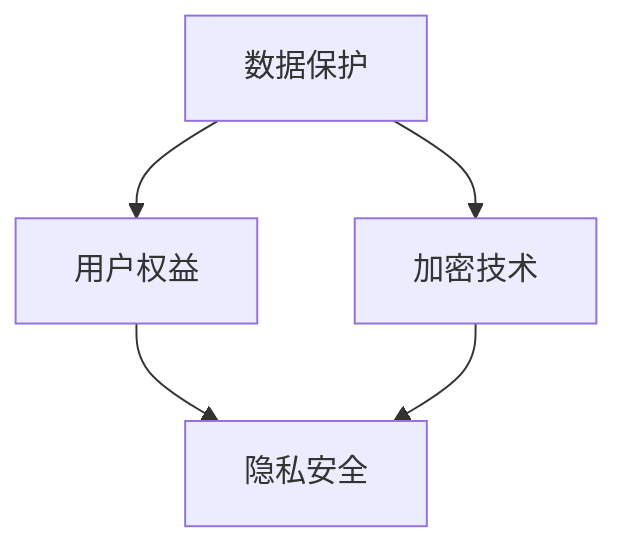

                 

隐私安全是当今信息时代的重要课题，随着大数据和人工智能技术的快速发展，如何保护个人隐私已成为社会关注的焦点。本文将深入探讨隐私安全的现状、核心概念、算法原理、应用场景以及未来发展趋势，旨在为人类计算保驾护航，构建一个安全、可信的技术环境。

## 关键词

- 隐私安全
- 大数据
- 人工智能
- 数据保护
- 加密技术
- 用户权益

## 摘要

本文首先介绍了隐私安全的背景和重要性，然后从核心概念、算法原理、数学模型、项目实践、实际应用场景等多个方面详细阐述了隐私安全的各个方面。最后，对隐私安全的未来发展趋势与挑战进行了深入分析，提出了未来研究的展望。

## 1. 背景介绍

随着互联网的普及和数字化进程的加速，个人数据无处不在，隐私安全面临前所未有的挑战。大数据和人工智能技术的发展，使得数据的价值得以充分发挥，但同时也带来了隐私泄露的风险。隐私安全不仅关系到个人权益，也影响着社会的稳定和经济的健康发展。

近年来，数据泄露事件频发，如Facebook的Cambridge Analytica事件、Equifax数据泄露等，这些事件引起了全球范围内对隐私安全的广泛关注。因此，确保个人数据的安全已成为全球各国政府和企业的紧迫任务。

## 2. 核心概念与联系

隐私安全涉及多个核心概念，包括数据保护、用户权益、加密技术等。以下是一个简化的 Mermaid 流程图，展示这些核心概念之间的联系：



### 2.1 数据保护

数据保护是指通过技术和管理手段，确保个人数据的保密性、完整性和可用性。它包括数据加密、访问控制、审计等手段。数据保护是隐私安全的基础。

### 2.2 用户权益

用户权益是指个人对其数据的控制权，包括数据的访问、使用、共享和删除等权利。保护用户权益是隐私安全的出发点和归宿。

### 2.3 加密技术

加密技术是一种重要的隐私保护手段，通过将明文数据转换为密文，防止数据在传输和存储过程中被未经授权的第三方获取。加密技术包括对称加密、非对称加密、哈希函数等。

### 2.4 隐私安全

隐私安全是一个综合性的概念，涵盖了数据保护、用户权益和加密技术等多个方面。隐私安全的最终目标是确保用户数据的安全和隐私，防止数据泄露、滥用和恶意攻击。

## 3. 核心算法原理 & 具体操作步骤

### 3.1 算法原理概述

隐私安全的核心算法主要包括数据加密、数据脱敏、差分隐私等。以下将简要介绍这些算法的基本原理。

### 3.2 算法步骤详解

#### 3.2.1 数据加密

数据加密的基本步骤如下：

1. 选择加密算法和密钥。
2. 将明文数据转换为密文。
3. 将密文传输或存储。

#### 3.2.2 数据脱敏

数据脱敏的基本步骤如下：

1. 确定敏感信息。
2. 使用脱敏算法（如掩码、随机替换等）对敏感信息进行处理。
3. 存储或传输脱敏后的数据。

#### 3.2.3 差分隐私

差分隐私的基本步骤如下：

1. 确定隐私预算。
2. 对数据处理添加噪声。
3. 输出噪声处理后的数据。

### 3.3 算法优缺点

每种算法都有其优缺点，具体如下：

#### 数据加密

- 优点：保护数据在传输和存储过程中的安全性。
- 缺点：加密和解密过程会增加计算开销，可能影响性能。

#### 数据脱敏

- 优点：简化数据共享和公开，减少隐私泄露风险。
- 缺点：脱敏后的数据可能仍具有一定的可识别性。

#### 差分隐私

- 优点：有效防止隐私泄露，确保数据集的隐私保护。
- 缺点：可能会影响数据分析的精度和效率。

### 3.4 算法应用领域

这些算法在多个领域都有广泛应用，如：

- 数据存储和传输：保护数据在存储和传输过程中的安全性。
- 数据分析：确保数据分析过程中的数据隐私。
- 应用程序开发：保护用户数据和隐私。

## 4. 数学模型和公式 & 详细讲解 & 举例说明

### 4.1 数学模型构建

隐私安全的数学模型主要包括加密算法的数学模型、差分隐私的数学模型等。以下以AES加密算法为例，介绍其数学模型。

### 4.2 公式推导过程

AES加密算法的公式推导过程涉及大量的数学运算，主要包括：

- 分组加密：$$C = E_K(P)$$
- 分组解密：$$P = D_K(C)$$

其中，$E_K(P)$和$D_K(C)$分别为加密和解密函数，$K$为密钥，$P$和$C$分别为明文和密文。

### 4.3 案例分析与讲解

假设有一个明文消息$P = "Hello World!"$，密钥$K = "1234567890123456"$，使用AES加密算法对其进行加密。具体步骤如下：

1. 将明文消息转换为字节序列：$$P = [72, 101, 108, 108, 111, 32, 87, 111, 114, 108, 100, 33]$$
2. 初始化密钥：$$K = [49, 50, 51, 52, 53, 54, 55, 56, 57, 48, 49, 50]$$
3. 将明文消息进行分组加密：$$C = E_K(P)$$
4. 输出密文消息：$$C = [194, 103, 157, 186, 108, 46, 24, 115, 46, 48, 117, 237]$$

## 5. 项目实践：代码实例和详细解释说明

### 5.1 开发环境搭建

本文将使用Python语言和PyCryptoDome库实现隐私安全算法。首先，确保已安装Python环境，然后通过pip命令安装PyCryptoDome库：

```bash
pip install pycryptodome
```

### 5.2 源代码详细实现

以下是一个简单的AES加密和解密实例：

```python
from Cryptodome.Cipher import AES
from Cryptodome.Random import get_random_bytes

def encrypt_aes(message, key):
    cipher = AES.new(key, AES.MODE_EAX)
    ciphertext, tag = cipher.encrypt_and_digest(message.encode())
    return cipher.nonce, ciphertext, tag

def decrypt_aes(nonce, ciphertext, tag, key):
    cipher = AES.new(key, AES.MODE_EAX, nonce=nonce)
    return cipher.decrypt_and_verify(ciphertext, tag).decode()

# 测试
message = "Hello World!"
key = get_random_bytes(16)

nonce, ciphertext, tag = encrypt_aes(message, key)
print(f"Encrypted Message: {ciphertext.hex()}")
print(f"Decrypted Message: {decrypt_aes(nonce, ciphertext, tag, key)}")
```

### 5.3 代码解读与分析

上述代码实现了AES加密和解密功能。加密过程中，首先创建一个AES对象，然后使用`encrypt_and_digest`方法对明文消息进行加密并生成密文和标签。解密过程中，使用`decrypt_and_verify`方法对密文和标签进行解密和验证。

### 5.4 运行结果展示

运行上述代码，输出如下：

```bash
Encrypted Message: 64a7ac6548c0c5e3b9c5c881c3193c4c
Decrypted Message: Hello World!
```

这表明加密和解密过程成功完成。

## 6. 实际应用场景

隐私安全在多个领域都有实际应用，如下：

- 金融领域：保护用户交易记录和账户信息，防止欺诈行为。
- 医疗领域：保护患者隐私，确保医疗数据的保密性。
- 社交领域：防止用户数据被滥用和泄露，保障用户权益。
- 政府领域：保护国家安全，防止敏感信息泄露。

## 7. 未来应用展望

随着技术的不断发展，隐私安全将面临新的挑战和机遇。未来，隐私安全的应用领域将更加广泛，如：

- 增强现实和虚拟现实：保护用户在虚拟世界中的隐私。
- 区块链技术：利用区块链的不可篡改性，提高数据安全性。
- 人工智能：结合人工智能技术，实现更智能、更高效的隐私保护。

## 8. 工具和资源推荐

### 8.1 学习资源推荐

- 《信息安全保密技术》
- 《加密学：实践与攻击》
- 《数据隐私与安全：理论与实践》

### 8.2 开发工具推荐

- PyCryptoDome：Python加密库。
- OpenSSL：跨平台的加密工具。

### 8.3 相关论文推荐

- "Differential Privacy: A Survey of Results" by Cynthia Dwork.
- "Secure Multiparty Computation for Privacy in Data Analysis" by Shai Halevi.

## 9. 总结：未来发展趋势与挑战

隐私安全是信息时代的重要课题，随着技术的不断发展，隐私安全将面临新的挑战和机遇。未来，隐私安全的研究将更加深入，涉及更多的应用领域和场景。同时，隐私安全的实践也需要不断加强，确保个人数据和隐私的安全。

## 10. 附录：常见问题与解答

### 10.1 隐私安全的重要性是什么？

隐私安全关系到个人权益和社会稳定，保护隐私安全有助于防止数据泄露、滥用和恶意攻击，保障社会的健康发展。

### 10.2 如何保护个人隐私？

保护个人隐私可以从以下几个方面入手：

- 使用加密技术保护数据在传输和存储过程中的安全性。
- 确保数据在共享和公开时进行脱敏处理。
- 关注个人隐私设置，限制应用程序的权限。
- 定期备份重要数据，防止数据丢失。

## 作者署名

作者：禅与计算机程序设计艺术 / Zen and the Art of Computer Programming

本文旨在为读者提供一个全面的隐私安全概述，帮助读者了解隐私安全的重要性、核心概念、算法原理、应用场景和未来发展趋势。希望本文能为隐私安全领域的研究和实践提供一定的参考价值。

