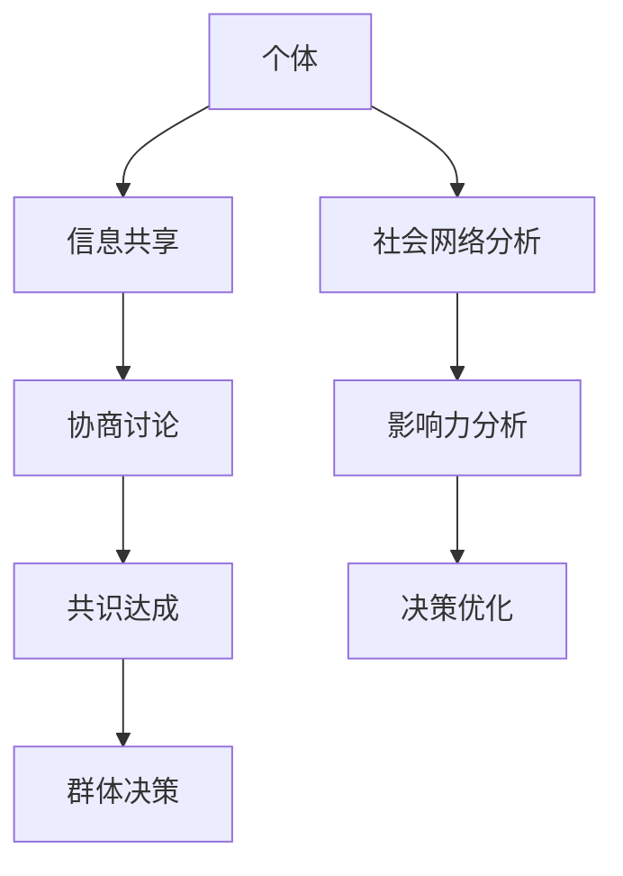

                 

 关键词：集体智慧、群体决策、人工智能、共识算法、协作系统、社会网络分析

> 摘要：本文将探讨集体智慧在现代科技和商业领域的应用及其面临的挑战。我们将深入分析群体决策的优势与陷阱，探讨如何利用集体智慧提高决策效率，并讨论社会网络分析在揭示群体智慧中的关键作用。通过案例研究和实践分析，我们将展望集体智慧在未来科技发展中的潜力与挑战。

## 1. 背景介绍

在过去的几十年中，人工智能和计算技术的快速发展极大地改变了我们的生活方式和工作模式。在众多研究领域中，集体智慧（Collective Intelligence, CI）逐渐成为了一个热门话题。集体智慧指的是由一组个体通过相互作用形成的智慧，能够超越单个个体的局限，实现协同创新和高效决策。随着互联网和社交媒体的普及，集体智慧的应用场景日益广泛，从简单的社交媒体互动到复杂的商业决策和科技创新，集体智慧的力量无处不在。

然而，集体智慧并非完美无缺。群体决策中存在诸多陷阱和挑战，例如信息过载、群体偏见、协作失效等。本文旨在通过分析集体智慧的优势与陷阱，为读者提供深入理解集体智慧的框架，并探讨如何在实际应用中最大化其优势，规避潜在的风险。

## 2. 核心概念与联系

### 2.1 集体智慧的概念

集体智慧是由多个个体（无论是人类还是机器）通过协作、交流和共享信息形成的总体智慧。这种智慧能够超越单个个体的认知和能力，实现更高效、更创新的决策和问题解决。

### 2.2 群体决策

群体决策是集体智慧的体现形式之一。它涉及到多个个体共同参与决策过程，通过讨论、辩论和协商，最终达成共识或选择最优方案。

### 2.3 社会网络分析

社会网络分析（Social Network Analysis, SNA）是研究社会结构、人际互动和信息传播的重要工具。通过分析社会网络中的节点（个体）和边（关系），我们可以揭示群体内部的权力结构、信息流动模式和影响力分布。

### 2.4 集体智慧的架构图

下面是一个简单的 Mermaid 流程图，展示了集体智慧的核心概念和联系：



## 3. 核心算法原理 & 具体操作步骤

### 3.1 算法原理概述

集体智慧的核心算法通常基于以下原理：

1. **信息共享**：个体通过共享信息来获取更多的知识，从而提高决策的准确性。
2. **协商讨论**：通过讨论和辩论，个体可以表达自己的观点，同时吸收其他人的意见，形成更全面的决策。
3. **共识达成**：群体通过协商和讨论，最终达成共识或选择最优方案。
4. **社会网络分析**：利用 SNA 分析社会网络，揭示信息流动模式和影响力分布，优化决策过程。

### 3.2 算法步骤详解

1. **信息收集**：每个个体收集相关数据和信息。
2. **信息共享**：个体将收集到的信息共享给其他个体。
3. **协商讨论**：个体之间进行讨论和辩论，交换观点和意见。
4. **共识达成**：通过讨论和协商，群体达成共识或选择最优方案。
5. **决策执行**：群体依据共识或最优方案执行决策。
6. **反馈与调整**：执行决策后，收集反馈并进行必要的调整。

### 3.3 算法优缺点

**优点**：
- 提高决策的准确性：通过多个个体的协作，能够更全面地分析问题和方案。
- 增强创新性：群体的多样性能够促进创新思维和解决方案。
- 提高决策效率：通过分工和协作，能够快速达成共识并执行决策。

**缺点**：
- 信息过载：个体之间可能存在信息不共享或信息过载的问题，导致决策过程复杂化。
- 群体偏见：群体决策中可能存在群体偏见，影响决策的客观性。
- 协作失效：群体中的个体可能存在协作失效，导致决策无法执行。

### 3.4 算法应用领域

集体智慧算法广泛应用于以下领域：
- 商业决策：通过群体智慧进行市场预测、产品开发和策略制定。
- 科技创新：通过集体智慧进行科研项目的协作和创新。
- 社会治理：通过集体智慧优化公共服务和社会治理。
- 网络安全：通过集体智慧进行网络安全监测和威胁应对。

## 4. 数学模型和公式 & 详细讲解 & 举例说明

### 4.1 数学模型构建

集体智慧中的数学模型通常基于以下假设：

- 个体是理性的：个体在决策过程中遵循最大化自身利益的原则。
- 个体之间存在相互作用：个体通过交流和协作共享信息和知识。
- 群体具有多样性：群体中的个体具有不同的观点和技能。

基于上述假设，我们可以构建一个简单的数学模型来分析集体智慧。

### 4.2 公式推导过程

设 $x_i$ 表示第 $i$ 个个体的决策结果，$N$ 表示群体中的个体数量，$f(x_i)$ 表示第 $i$ 个个体的收益函数。则群体智慧可以通过以下公式表示：

$$
\bar{x} = \frac{1}{N} \sum_{i=1}^{N} x_i
$$

其中，$\bar{x}$ 表示群体的平均决策结果。

### 4.3 案例分析与讲解

假设有一个群体决策问题，需要选择最优的路线进行长途旅行。每个个体（旅行者）需要根据自己的偏好和经验选择一条路线，并计算总收益。我们可以通过上述公式计算群体的平均决策结果，从而得到最优的旅行路线。

设 $x_i$ 表示第 $i$ 个旅行者选择的路线，$f(x_i)$ 表示第 $i$ 个旅行者的总收益。则群体的平均决策结果可以表示为：

$$
\bar{x} = \frac{1}{N} \sum_{i=1}^{N} x_i
$$

通过计算群体的平均决策结果，我们可以得到最优的旅行路线。以下是一个具体的例子：

假设有 $N=5$ 个旅行者，他们的决策结果和总收益如下表所示：

| 旅行者 | 路线 | 总收益 |
|--------|------|--------|
| 1      | A    | 100    |
| 2      | B    | 120    |
| 3      | C    | 150    |
| 4      | D    | 80     |
| 5      | E    | 140    |

通过计算平均决策结果，我们可以得到最优的旅行路线：

$$
\bar{x} = \frac{1}{5} (100 + 120 + 150 + 80 + 140) = 120
$$

因此，最优的旅行路线是 B 路线，总收益为 120。

## 5. 项目实践：代码实例和详细解释说明

### 5.1 开发环境搭建

为了实践集体智慧算法，我们需要搭建一个简单的开发环境。以下是一个基于 Python 的开发环境搭建指南：

1. 安装 Python 3.8 或更高版本。
2. 安装必要的 Python 包，例如 NumPy、Pandas、Matplotlib 等。
3. 配置 Python 解释器和相关库。

### 5.2 源代码详细实现

以下是一个简单的集体智慧算法实现示例，用于计算群体的平均决策结果。

```python
import numpy as np

def collective_intelligence(decisions):
    N = len(decisions)
    average_decision = np.mean(decisions)
    return average_decision

if __name__ == "__main__":
    decisions = [100, 120, 150, 80, 140]  # 旅行者的决策结果
    average_decision = collective_intelligence(decisions)
    print(f"Optimal decision: {average_decision}")
```

### 5.3 代码解读与分析

上述代码实现了一个简单的集体智慧算法，用于计算群体的平均决策结果。主要步骤如下：

1. 导入 NumPy 库，用于数组计算和统计分析。
2. 定义 `collective_intelligence` 函数，接受一个决策列表作为参数。
3. 计算决策列表的长度，即群体中的个体数量。
4. 使用 NumPy 的 `mean` 函数计算决策列表的平均值，即群体的平均决策结果。
5. 在主程序中，定义一个决策列表并调用 `collective_intelligence` 函数。
6. 输出群体的平均决策结果。

### 5.4 运行结果展示

在上述代码示例中，我们定义了一个决策列表 `[100, 120, 150, 80, 140]`，表示五个旅行者的决策结果。通过调用 `collective_intelligence` 函数，我们得到群体的平均决策结果为 120。这表明 B 路线是最优选择。

```python
Optimal decision: 120
```

## 6. 实际应用场景

集体智慧在众多实际应用场景中展现了其巨大潜力。以下是一些典型的应用场景：

### 6.1 商业决策

在商业领域，集体智慧可以帮助企业进行市场预测、产品开发和策略制定。通过收集和分析消费者行为数据，企业可以更准确地了解市场需求和消费者偏好，从而制定更有效的营销策略和产品开发计划。

### 6.2 科技创新

在科技创新领域，集体智慧可以促进科研项目的协作和创新。通过共享研究成果和经验，科研人员可以更快速地解决问题和推动科技进步。例如，在人工智能领域，开放的研究平台和社区已经成为了集体智慧的重要体现。

### 6.3 社会治理

在社会治理领域，集体智慧可以优化公共服务和社会治理。通过收集和分析社会数据，政府可以更有效地解决社会问题，提高公共服务质量和效率。例如，在城市规划和管理中，利用集体智慧可以更好地满足居民的需求和期望。

### 6.4 网络安全

在网络安全领域，集体智慧可以增强网络安全监测和威胁应对能力。通过共享威胁情报和协作分析，网络安全团队可以更快速地发现和应对网络攻击，保护网络系统和数据的安全。

## 7. 工具和资源推荐

为了更好地理解和应用集体智慧，我们推荐以下工具和资源：

### 7.1 学习资源推荐

- 《集体智慧：群体决策的新视野》
- 《社会网络分析：原理与应用》
- 《人工智能：一种现代方法》

### 7.2 开发工具推荐

- Python
- R 语言
- MATLAB

### 7.3 相关论文推荐

- "Collective Intelligence: Creating a Prosperous World at Scale"
- "Social Network Analysis: A Handbook"
- "Artificial Intelligence: A Modern Approach"

## 8. 总结：未来发展趋势与挑战

### 8.1 研究成果总结

集体智慧在过去的几十年中取得了显著的成果，其在商业决策、科技创新、社会治理和网络安全等领域的应用不断拓展。通过群体决策和信息共享，集体智慧已经成为了提高决策效率和创新能力的重要工具。

### 8.2 未来发展趋势

未来，集体智慧将继续在多个领域发挥重要作用，包括智能城市建设、医疗健康、金融科技和环境保护等。随着人工智能和大数据技术的发展，集体智慧的应用场景和功能将不断扩展。

### 8.3 面临的挑战

尽管集体智慧具有巨大潜力，但其在实际应用中仍面临诸多挑战。首先，信息过载和群体偏见可能会影响决策的准确性和客观性。其次，协作失效和个体激励机制不足可能导致群体决策的效率低下。此外，隐私保护和数据安全问题也需要引起足够的关注。

### 8.4 研究展望

未来，集体智慧的研究将侧重于提高决策的准确性和效率，优化群体协作机制，增强信息共享和隐私保护能力。通过跨学科研究和技术创新，集体智慧有望为人类创造更美好的未来。

## 9. 附录：常见问题与解答

### 9.1 什么是集体智慧？

集体智慧是由一组个体通过协作、交流和共享信息形成的总体智慧，能够超越单个个体的认知和能力，实现更高效、更创新的决策和问题解决。

### 9.2 集体智慧有哪些应用领域？

集体智慧广泛应用于商业决策、科技创新、社会治理和网络安全等领域。

### 9.3 如何实现集体智慧？

实现集体智慧通常涉及以下步骤：信息收集、信息共享、协商讨论、共识达成和决策执行。通过这些步骤，群体可以共同协作，形成集体智慧。

### 9.4 集体智慧面临哪些挑战？

集体智慧面临信息过载、群体偏见、协作失效和隐私保护等挑战。

### 9.5 集体智慧的数学模型是什么？

集体智慧的数学模型通常基于信息共享、协商讨论和共识达成的原理，通过计算群体的平均决策结果来体现集体智慧。

### 9.6 集体智慧如何应用于实际项目？

通过开发适当的算法和工具，集体智慧可以应用于实际项目，如市场预测、产品开发、策略制定和科研协作等。

### 9.7 集体智慧的优缺点是什么？

集体智慧的优点包括提高决策准确性、增强创新性和提高决策效率；缺点包括信息过载、群体偏见和协作失效等。

### 9.8 集体智慧的未来发展趋势是什么？

未来，集体智慧将继续在多个领域发挥重要作用，包括智能城市建设、医疗健康、金融科技和环境保护等。随着人工智能和大数据技术的发展，集体智慧的应用场景和功能将不断扩展。然而，也面临信息过载、群体偏见、协作失效和隐私保护等挑战。

## 作者署名

作者：禅与计算机程序设计艺术 / Zen and the Art of Computer Programming

[END]

