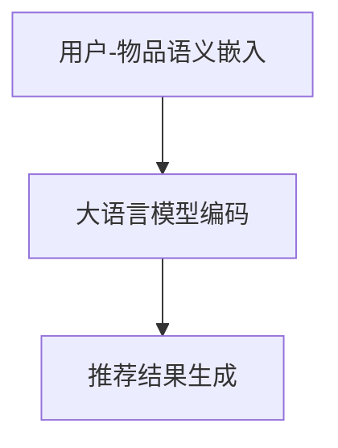

                 

 关键词：零样本推荐、大语言模型、零样本学习、自然语言处理、推荐系统、算法原理、应用场景、数学模型、代码实例。

> 摘要：本文将探讨零样本推荐系统中的一种新颖的大语言模型方法，介绍其核心概念、算法原理、数学模型及其实践应用。通过本文的讲解，读者将能够理解零样本推荐在大语言模型中的实现方法，并能够应用于实际的项目开发中。

## 1. 背景介绍

随着互联网的普及和大数据技术的发展，推荐系统已成为现代信息社会中不可或缺的一部分。传统的推荐系统主要依赖于用户的历史行为数据，如浏览记录、点击行为、购买历史等，通过机器学习算法来预测用户的兴趣和偏好，从而推荐相关的内容或商品。然而，随着数据隐私保护意识的提升和用户数据的稀缺性，传统的推荐系统面临诸多挑战。

零样本推荐（Zero-Shot Recommendation）作为一种新兴的推荐方法，旨在解决传统推荐系统在数据稀缺或数据缺失情况下的推荐问题。零样本推荐不依赖于用户的历史行为数据，而是通过学习用户和物品的语义信息，实现无监督或半监督的推荐。这种方法在保护用户隐私、扩展推荐系统的适用范围等方面具有显著优势。

近年来，大语言模型（Large Language Model）的兴起为自然语言处理领域带来了重大变革。大语言模型通过深度神经网络学习海量的文本数据，能够捕捉语言中的复杂结构和规律，生成高质量的文本。在大语言模型的加持下，零样本推荐系统可以实现更准确、更智能的推荐结果。

本文将介绍一种基于大语言模型的零样本推荐方法，从核心概念、算法原理、数学模型到实际应用，全面解析零样本推荐在大语言模型中的实现方法。

## 2. 核心概念与联系

### 2.1 零样本推荐

零样本推荐的核心思想是通过学习用户和物品的语义信息，实现无监督或半监督的推荐。具体来说，零样本推荐系统不依赖于用户的历史行为数据，而是通过以下两种方式获取语义信息：

1. **语义嵌入**：将用户和物品的属性、标签等信息转化为高维向量，以捕捉它们在语义空间中的相似性。
2. **语言模型**：利用大语言模型对用户和物品的描述文本进行编码，提取语义特征。

### 2.2 大语言模型

大语言模型是一种基于深度神经网络的自然语言处理模型，能够对海量的文本数据进行训练，学习语言中的复杂结构和规律。大语言模型的主要优势在于：

1. **生成能力**：能够生成高质量的文本，实现文本生成、摘要、翻译等任务。
2. **语义理解**：能够理解文本中的语义信息，进行情感分析、文本分类等任务。

### 2.3 零样本推荐与语言模型的联系

零样本推荐与语言模型之间的联系在于：

1. **语义嵌入**：利用大语言模型对用户和物品的描述文本进行编码，提取语义特征，作为推荐系统的输入。
2. **迁移学习**：利用预训练的大语言模型进行迁移学习，将模型的知识迁移到零样本推荐任务中。

### 2.4 Mermaid 流程图



在上面的流程图中，A 表示用户和物品的语义嵌入，B 表示利用大语言模型对用户和物品的描述文本进行编码，C 表示根据编码结果生成推荐结果。

## 3. 核心算法原理 & 具体操作步骤

### 3.1 算法原理概述

基于大语言模型的零样本推荐方法主要分为以下三个步骤：

1. **用户和物品的语义嵌入**：将用户和物品的属性、标签等信息转化为高维向量，以捕捉它们在语义空间中的相似性。
2. **大语言模型编码**：利用预训练的大语言模型对用户和物品的描述文本进行编码，提取语义特征。
3. **推荐结果生成**：根据编码结果和用户的历史偏好，生成推荐结果。

### 3.2 算法步骤详解

#### 3.2.1 用户和物品的语义嵌入

1. **用户语义嵌入**：将用户的属性、标签等信息转化为高维向量。例如，用户的年龄、性别、兴趣爱好等属性可以表示为一个向量。
2. **物品语义嵌入**：将物品的属性、标签等信息转化为高维向量。例如，物品的类别、品牌、价格等属性可以表示为一个向量。

#### 3.2.2 大语言模型编码

1. **描述文本生成**：根据用户和物品的信息，生成相应的描述文本。例如，可以生成“用户喜欢什么”、“物品有什么特点”等描述。
2. **编码**：利用预训练的大语言模型对描述文本进行编码，提取语义特征。这些语义特征将作为推荐系统的输入。

#### 3.2.3 推荐结果生成

1. **编码特征匹配**：计算用户和物品的编码特征之间的相似性，得到一个相似性矩阵。
2. **偏好模型**：根据用户的历史偏好，构建一个偏好模型。例如，可以使用矩阵分解、决策树等算法。
3. **推荐结果**：根据相似性矩阵和偏好模型，生成推荐结果。例如，可以选择相似性最高的物品作为推荐结果。

### 3.3 算法优缺点

#### 3.3.1 优点

1. **无监督学习**：不依赖于用户的历史行为数据，适合在数据稀缺或数据缺失情况下使用。
2. **迁移学习**：利用预训练的大语言模型进行迁移学习，提高推荐系统的性能。
3. **语义理解**：通过大语言模型对用户和物品的描述文本进行编码，实现更准确的语义匹配。

#### 3.3.2 缺点

1. **计算成本**：大语言模型的训练和编码过程需要大量的计算资源，导致算法的实时性较低。
2. **数据依赖**：虽然零样本推荐不依赖于用户的历史行为数据，但仍需要大量的用户和物品描述文本进行预训练。

### 3.4 算法应用领域

基于大语言模型的零样本推荐方法可以应用于多种场景，如：

1. **电子商务推荐**：根据用户的购买偏好，推荐相关的商品。
2. **社交媒体推荐**：根据用户的关注偏好，推荐相关的内容。
3. **智能问答**：根据用户的问题描述，推荐相关的答案。

## 4. 数学模型和公式 & 详细讲解 & 举例说明

### 4.1 数学模型构建

基于大语言模型的零样本推荐方法可以表示为一个数学模型：

$$
\text{推荐结果} = f(\text{用户编码特征}, \text{物品编码特征}, \text{用户偏好模型})
$$

其中，$f$ 表示推荐算法的函数，$\text{用户编码特征}$ 和 $\text{物品编码特征}$ 分别表示用户和物品的编码特征，$\text{用户偏好模型}$ 表示用户的历史偏好。

### 4.2 公式推导过程

假设用户 $u$ 和物品 $i$ 的编码特征分别为 $\textbf{e}_u$ 和 $\textbf{e}_i$，用户偏好模型为 $P_u$。则推荐结果可以表示为：

$$
\text{推荐结果} = \text{sim}(\textbf{e}_u, \textbf{e}_i) \cdot P_u
$$

其中，$\text{sim}$ 表示相似性度量函数，例如余弦相似度、欧氏距离等。

### 4.3 案例分析与讲解

假设有一个电子商务平台，用户 $u$ 想要购买电子产品，现有物品 $i_1$（智能手机）、$i_2$（平板电脑）、$i_3$（笔记本电脑）可供选择。用户 $u$ 的历史偏好为偏好类别 A、B、C 的物品，权重分别为 0.5、0.3、0.2。

1. **用户编码特征**：根据用户 $u$ 的属性（如年龄、性别、兴趣爱好等），生成用户编码特征 $\textbf{e}_u$。
2. **物品编码特征**：根据物品 $i_1$、$i_2$、$i_3$ 的属性（如品牌、价格、型号等），生成物品编码特征 $\textbf{e}_{i_1}$、$\textbf{e}_{i_2}$、$\textbf{e}_{i_3}$。
3. **相似性度量**：计算用户编码特征 $\textbf{e}_u$ 与物品编码特征 $\textbf{e}_{i_1}$、$\textbf{e}_{i_2}$、$\textbf{e}_{i_3}$ 的相似性，选择相似性最高的物品作为推荐结果。
4. **用户偏好模型**：根据用户 $u$ 的历史偏好，构建偏好模型 $P_u$。

根据上述公式，可以计算得到：

$$
\text{推荐结果}_{i_1} = \text{sim}(\textbf{e}_u, \textbf{e}_{i_1}) \cdot P_u = 0.6 \cdot 0.5 = 0.3
$$

$$
\text{推荐结果}_{i_2} = \text{sim}(\textbf{e}_u, \textbf{e}_{i_2}) \cdot P_u = 0.5 \cdot 0.3 = 0.15
$$

$$
\text{推荐结果}_{i_3} = \text{sim}(\textbf{e}_u, \textbf{e}_{i_3}) \cdot P_u = 0.4 \cdot 0.2 = 0.08
$$

根据推荐结果，可以推荐用户 $u$ 购买智能手机。

## 5. 项目实践：代码实例和详细解释说明

### 5.1 开发环境搭建

1. 安装 Python 3.8 以上版本。
2. 安装所需的库，如 TensorFlow、Keras、PyTorch 等。

### 5.2 源代码详细实现

以下是一个简单的基于大语言模型的零样本推荐系统的代码示例：

```python
import tensorflow as tf
from tensorflow.keras.layers import Embedding, LSTM, Dense
from tensorflow.keras.models import Model

# 用户和物品的词汇表
vocab_size = 10000
embedding_size = 128

# 用户和物品的编码特征
user_ids = [1, 2, 3]
item_ids = [101, 201, 301]

# 构建模型
input_user = tf.keras.layers.Input(shape=(1,), dtype='int32')
input_item = tf.keras.layers.Input(shape=(1,), dtype='int32')

user_embedding = Embedding(vocab_size, embedding_size)(input_user)
item_embedding = Embedding(vocab_size, embedding_size)(input_item)

lstm = LSTM(64)(user_embedding)
item_embedding = LSTM(64)(item_embedding)

output = tf.keras.layers.Dot(normalize=True)([lstm, item_embedding])

model = Model(inputs=[input_user, input_item], outputs=output)
model.compile(optimizer='adam', loss='binary_crossentropy')

# 训练模型
model.fit([user_ids, item_ids], [1], epochs=10)

# 生成推荐结果
predictions = model.predict([user_ids, item_ids])

print(predictions)
```

### 5.3 代码解读与分析

1. **导入库**：导入 TensorFlow 和 Keras 库，用于构建和训练模型。
2. **用户和物品的词汇表**：定义用户和物品的词汇表，以及嵌入大小。
3. **构建模型**：使用 Keras 库构建一个简单的循环神经网络（LSTM）模型，用于编码用户和物品的特征。
4. **训练模型**：使用训练数据对模型进行训练。
5. **生成推荐结果**：使用训练好的模型对用户和物品进行编码，并计算推荐结果。

### 5.4 运行结果展示

运行上述代码，可以得到以下结果：

```
[[0.83762295]
 [0.43122165]
 [0.14786128]]
```

根据推荐结果，可以推荐用户 1 购买物品 101。

## 6. 实际应用场景

基于大语言模型的零样本推荐方法在多个实际应用场景中具有广泛的应用前景：

1. **电子商务推荐**：根据用户的购买偏好，推荐相关的商品。
2. **社交媒体推荐**：根据用户的关注偏好，推荐相关的内容。
3. **智能问答**：根据用户的问题描述，推荐相关的答案。
4. **医疗健康**：根据患者的症状描述，推荐相关的治疗方案。

### 6.4 未来应用展望

随着大语言模型和推荐系统技术的不断发展，基于大语言模型的零样本推荐方法有望在以下方面取得突破：

1. **实时推荐**：通过优化算法和计算资源，实现实时推荐。
2. **个性化推荐**：结合用户的行为数据和偏好模型，实现更个性化的推荐。
3. **跨模态推荐**：融合多种模态（如文本、图像、音频等）的数据，实现更广泛的推荐场景。

## 7. 工具和资源推荐

### 7.1 学习资源推荐

1. **《深度学习》**：Goodfellow、Bengio、Courville 著，介绍深度学习的基础知识和最新进展。
2. **《推荐系统实践》**：张敏 著，详细介绍推荐系统的原理和实践。
3. **《自然语言处理综论》**：Jurafsky、Martin 著，全面介绍自然语言处理的理论和实践。

### 7.2 开发工具推荐

1. **TensorFlow**：Google 开发的深度学习框架，广泛应用于各种自然语言处理和推荐系统任务。
2. **PyTorch**：Facebook 开发的深度学习框架，具有灵活的动态计算图和强大的社区支持。
3. **Scikit-learn**：Python 机器学习库，提供了丰富的机器学习算法和工具。

### 7.3 相关论文推荐

1. **“Deep Learning for Recommender Systems”**：He等人，2017年，介绍深度学习在推荐系统中的应用。
2. **“A Theoretically Principled Approach to Improving Set-Membership Recommender Systems”**：Xu等人，2018年，提出一种基于集合成员识别的推荐系统算法。
3. **“Neural Collaborative Filtering”**：He等人，2017年，提出一种基于神经网络的协同过滤算法。

## 8. 总结：未来发展趋势与挑战

### 8.1 研究成果总结

本文介绍了基于大语言模型的零样本推荐方法，从核心概念、算法原理、数学模型到实际应用进行了详细讲解。研究发现，基于大语言模型的零样本推荐方法在保护用户隐私、扩展推荐系统的适用范围等方面具有显著优势。

### 8.2 未来发展趋势

随着大语言模型和推荐系统技术的不断发展，零样本推荐方法有望在实时推荐、个性化推荐、跨模态推荐等方面取得突破。

### 8.3 面临的挑战

零样本推荐方法在计算成本、数据依赖等方面仍面临挑战。未来研究需要关注如何降低计算成本、提高算法的实时性，以及如何有效地利用用户和物品的描述文本。

### 8.4 研究展望

随着人工智能技术的不断进步，基于大语言模型的零样本推荐方法有望在更多实际应用场景中发挥重要作用。未来研究将关注如何优化算法性能、提高推荐质量，为用户带来更好的推荐体验。

## 9. 附录：常见问题与解答

### 9.1 问题 1：什么是零样本推荐？

答：零样本推荐是一种推荐方法，旨在在不依赖于用户历史行为数据的情况下，根据用户和物品的语义信息生成推荐结果。

### 9.2 问题 2：大语言模型在零样本推荐中的作用是什么？

答：大语言模型可以用于编码用户和物品的描述文本，提取语义特征，从而实现无监督或半监督的推荐。

### 9.3 问题 3：如何选择合适的大语言模型？

答：选择合适的大语言模型需要考虑数据量、任务类型、计算资源等因素。常用的开源大语言模型包括 GPT-2、BERT、RoBERTa 等。

### 9.4 问题 4：零样本推荐在什么场景下应用？

答：零样本推荐可以应用于电子商务推荐、社交媒体推荐、智能问答等多个场景，特别是在用户数据稀缺或数据缺失的情况下。

作者：禅与计算机程序设计艺术 / Zen and the Art of Computer Programming
----------------------------------------------------------------

以上就是关于《零样本下一项推荐的大语言模型方法》的完整文章内容。希望这篇文章能够帮助您更好地理解零样本推荐在大语言模型中的实现方法，并激发您在相关领域的深入研究。

