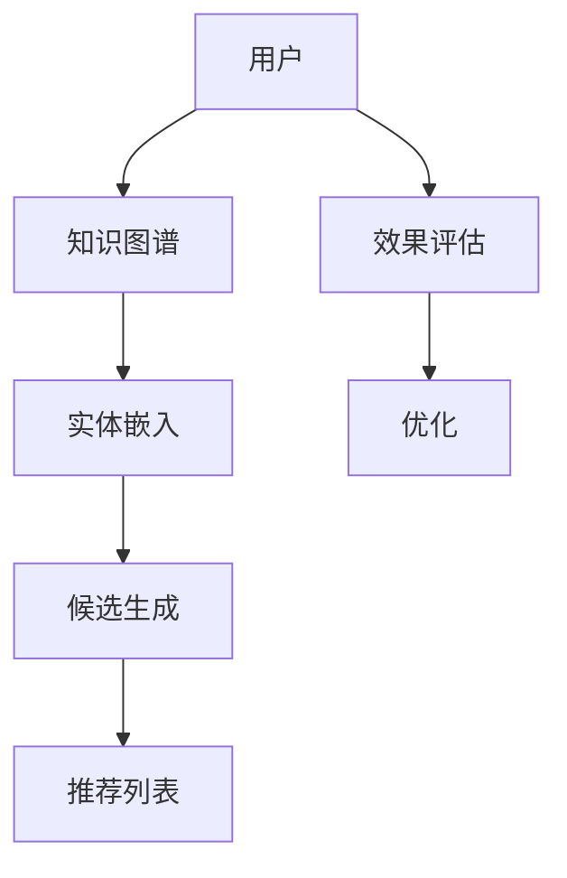

                 

### 摘要

本文将深入探讨零样本推荐系统中的一种关键策略——候选生成策略。推荐系统是现代信息检索和用户行为分析的核心技术，尤其在电商、社交媒体和内容平台上发挥着重要作用。然而，传统的推荐系统往往依赖于用户的历史数据，这在面对新用户或缺乏足够数据的场景时显得力不从心。零样本推荐系统（Zero-shot Recommender System）通过引入外部知识图谱和语义信息，实现了对新用户的潜在兴趣预测，从而填补了这一空白。本文将重点介绍两种核心的候选生成策略：排序策略和效果评估策略，并分析它们在实际应用中的效果与挑战。通过本文的阅读，读者将全面了解零样本推荐系统的工作原理，掌握候选生成策略的具体应用，并为未来的研究和开发提供有益的参考。

## 1. 背景介绍

推荐系统作为现代信息检索和个性化服务的重要技术手段，已经在多个领域取得了显著的应用效果。传统推荐系统主要依赖于用户的历史行为数据，如浏览记录、购买历史和评分数据等，通过数据挖掘和机器学习算法，预测用户对特定项目的潜在兴趣，从而生成个性化的推荐列表。这种方法在用户行为数据充足的情况下表现出色，能够显著提高用户满意度和系统销售额。

然而，在以下几种场景中，传统推荐系统的性能会受到限制：

1. **新用户推荐**：新用户由于缺乏历史行为数据，传统推荐系统很难为其生成准确的推荐列表。
2. **数据稀疏问题**：某些用户可能仅对极少数项目表现出兴趣，导致行为数据稀疏，推荐效果不佳。
3. **冷启动问题**：新项目由于缺乏用户评价和互动，也难以被推荐系统识别和推荐。

为了解决上述问题，零样本推荐系统（Zero-shot Recommender System）应运而生。零样本推荐系统通过引入外部知识图谱和语义信息，实现对新用户和未知名项目的推荐。与传统的基于历史数据的推荐系统不同，零样本推荐系统不依赖于用户的历史行为，而是利用预训练的知识图谱和语义信息来推断用户兴趣。

零样本推荐系统的核心思想在于，通过将用户和项目映射到高维语义空间，利用语义相似度来预测用户兴趣。这种方法不仅能够有效解决新用户和冷启动问题，还能在数据稀疏的场景中保持较好的推荐效果。此外，零样本推荐系统还具备较强的泛化能力，能够处理多种不同类型的推荐场景。

尽管零样本推荐系统展示了巨大的潜力，但其实际应用仍面临一些挑战。首先，知识图谱的构建和更新是一个复杂的过程，需要大量的时间和计算资源。其次，如何在语义空间中有效表示用户和项目是一个关键问题，直接影响到推荐系统的性能。最后，如何评估和优化推荐效果也是一个亟待解决的问题。

本文将深入探讨零样本推荐系统中的两个关键策略：候选生成策略和效果评估策略。候选生成策略负责从大量候选项目中挑选出最有可能符合用户兴趣的项目，而效果评估策略则用于评估和优化推荐效果。通过详细分析这两种策略，本文希望能够为读者提供关于零样本推荐系统的全面理解和实践指导。

### 2. 核心概念与联系

在深入探讨零样本推荐系统的候选生成策略之前，我们需要首先理解几个核心概念，这些概念构成了零样本推荐系统的理论基础，也是后续讨论的基础。

#### 2.1 零样本推荐系统

零样本推荐系统（Zero-shot Recommender System）是一种新型的推荐系统，其核心思想是无需用户的历史行为数据，即可生成个性化的推荐列表。这种系统通过利用外部知识图谱和语义信息，将用户和项目映射到高维语义空间，并基于语义相似度进行推荐。零样本推荐系统的主要优势在于能够有效解决新用户和冷启动问题，提高推荐系统的泛化能力。

#### 2.2 知识图谱

知识图谱（Knowledge Graph）是一种用于表示实体及其相互关系的数据结构。在零样本推荐系统中，知识图谱主要用于存储项目属性、用户兴趣和实体之间的关联信息。通过构建知识图谱，系统能够更好地理解和表示用户和项目的复杂关系，从而提高推荐效果。

#### 2.3 语义相似度

语义相似度（Semantic Similarity）是指两个实体在语义上的相似程度。在零样本推荐系统中，通过计算用户和项目之间的语义相似度，系统可以推断用户对特定项目的潜在兴趣。语义相似度的计算通常依赖于预训练的语言模型和词嵌入技术，如Word2Vec和BERT。

#### 2.4 实体嵌入

实体嵌入（Entity Embedding）是将实体映射到高维语义空间的一种技术。通过实体嵌入，系统能够在语义层面上表示用户和项目，从而实现高效的相似度计算和推荐生成。

#### 2.5 候选生成策略

候选生成策略是零样本推荐系统的核心模块，负责从大量候选项目中挑选出最有可能符合用户兴趣的项目。常见的候选生成策略包括基于语义相似度、基于知识图谱的路径搜索和基于强化学习的策略。

#### 2.6 效果评估策略

效果评估策略用于评估和优化推荐系统的性能。常见的评估指标包括准确率、召回率和F1值等。效果评估策略通常包括交叉验证、A/B测试和在线反馈等方法。

### 2.6 Mermaid 流程图

以下是一个简化的Mermaid流程图，展示了零样本推荐系统中核心概念之间的联系：



在上述流程图中，用户首先与知识图谱进行交互，通过实体嵌入将用户和项目映射到高维语义空间。然后，候选生成策略根据语义相似度从候选项目中挑选出最符合用户兴趣的项目，形成推荐列表。最后，效果评估策略对推荐效果进行评估，并根据评估结果对系统进行优化。

通过上述核心概念和流程图的介绍，我们可以更好地理解零样本推荐系统的工作原理和关键模块。在接下来的章节中，我们将详细探讨候选生成策略和效果评估策略的具体实现方法和技术细节。

### 3. 核心算法原理 & 具体操作步骤

#### 3.1 算法原理概述

零样本推荐系统的候选生成策略主要基于语义相似度和知识图谱的路径搜索。具体来说，算法通过以下步骤实现：

1. **知识图谱构建**：首先，构建一个包含用户、项目和属性信息的知识图谱。知识图谱中的实体（用户和项目）及其属性通过边（关系）进行连接，形成一个复杂的网络结构。

2. **实体嵌入**：将用户和项目映射到高维语义空间。这一步通常使用预训练的词嵌入模型，如Word2Vec或BERT，将实体转换为向量表示。

3. **候选生成**：基于实体嵌入和知识图谱，计算用户和候选项目之间的语义相似度。然后，通过一定的策略（如基于路径的搜索算法），从候选项目中筛选出最符合用户兴趣的项目。

4. **推荐列表生成**：根据候选项目的语义相似度排序，生成个性化的推荐列表。

#### 3.2 算法步骤详解

1. **知识图谱构建**

   知识图谱的构建是零样本推荐系统的第一步。知识图谱中的实体包括用户和项目，属性包括用户兴趣点、项目特征等。实体之间通过关系边进行连接，形成了一个复杂的网络结构。常见的知识图谱构建方法包括基于知识库的扩展和基于数据挖掘的方法。

2. **实体嵌入**

   实体嵌入是将用户和项目映射到高维语义空间的过程。通过预训练的词嵌入模型（如Word2Vec或BERT），可以将实体转换为向量表示。这些向量表示了实体在语义空间中的位置，为后续的相似度计算和推荐生成提供了基础。

3. **候选生成**

   在实体嵌入完成后，我们可以通过计算用户和候选项目之间的语义相似度来生成候选列表。具体步骤如下：

   - **语义相似度计算**：使用预训练的词嵌入模型计算用户和候选项目的向量表示。然后，通过余弦相似度或欧氏距离等度量方法，计算用户和候选项目之间的语义相似度。

   - **路径搜索算法**：在知识图谱中，对于每个候选项目，搜索从用户到项目的所有可能路径。这些路径可以基于图论算法（如深度优先搜索或广度优先搜索）进行计算。

   - **候选筛选**：根据语义相似度和路径搜索结果，对候选项目进行筛选，保留最符合用户兴趣的项目。

4. **推荐列表生成**

   根据候选项目的语义相似度排序，生成最终的推荐列表。推荐列表中的项目顺序代表了用户对这些项目的潜在兴趣度。常见的排序算法包括基于相似度的排序、基于内容的排序和混合排序等。

#### 3.3 算法优缺点

**优点：**

- **无需历史行为数据**：零样本推荐系统不依赖于用户的历史行为数据，能够解决新用户和冷启动问题。
- **高泛化能力**：通过引入外部知识图谱和语义信息，零样本推荐系统具备较强的泛化能力，能够处理多种不同类型的推荐场景。
- **个性化推荐**：基于语义相似度和知识图谱，系统能够生成高度个性化的推荐列表，提高用户满意度。

**缺点：**

- **知识图谱构建复杂**：构建和维护一个高质量的知识图谱需要大量的时间和计算资源。
- **计算成本高**：基于知识图谱的路径搜索算法通常具有较高的计算复杂度，可能导致系统响应时间较长。
- **数据稀疏问题**：在某些数据稀疏的场景中，基于语义相似度的推荐效果可能不佳。

#### 3.4 算法应用领域

零样本推荐系统在多个领域展示了广泛的应用前景，主要包括：

- **电子商务**：在新用户推荐和冷启动场景中，零样本推荐系统能够有效提高推荐效果，促进用户满意度和销售转化率。
- **社交媒体**：通过零样本推荐系统，可以为新用户推荐感兴趣的内容和好友，增强用户参与度和留存率。
- **内容平台**：零样本推荐系统可以用于推荐视频、文章等不同类型的内容，提高用户满意度和内容消费率。

总之，零样本推荐系统通过引入外部知识图谱和语义信息，为推荐系统领域带来了新的发展机遇。尽管面临一些挑战，但其强大的泛化能力和个性化推荐能力，使其在多个应用领域中具有广阔的应用前景。

### 4. 数学模型和公式 & 详细讲解 & 举例说明

#### 4.1 数学模型构建

零样本推荐系统的核心在于如何利用数学模型来表示用户兴趣和项目特征，并通过相似度度量来生成推荐列表。以下是构建零样本推荐系统数学模型的基本框架：

**定义：**

- **用户向量 \( u \)**：表示用户的兴趣和特征。
- **项目向量 \( v \)**：表示项目的特征和属性。
- **知识图谱中的边权重矩阵 \( W \)**：表示用户与项目之间的关联强度。

**数学模型：**

1. **用户和项目的向量表示**：

   用户和项目的向量表示通常采用预训练的词嵌入模型（如Word2Vec或BERT）生成。具体表示为：

   $$ u = \text{embed}(u) $$
   $$ v = \text{embed}(v) $$

   其中，\( \text{embed}(\cdot) \) 是预训练词嵌入模型。

2. **用户与项目的相似度计算**：

   相似度计算通常采用余弦相似度或欧氏距离等度量方法。余弦相似度的计算公式为：

   $$ \cos(\theta) = \frac{u \cdot v}{\|u\| \|v\|} $$

   其中，\( \cdot \) 表示向量的内积，\( \|u\| \) 和 \( \|v\| \) 分别表示向量 \( u \) 和 \( v \) 的欧氏范数。

3. **知识图谱中的路径搜索与权重计算**：

   知识图谱中的路径搜索与权重计算可以通过图论算法实现。具体步骤如下：

   - 对于每个用户和项目，搜索从用户到项目的所有可能路径。
   - 计算每条路径的权重，通常采用路径长度、边的权重和节点的重要性等因素进行综合评估。

#### 4.2 公式推导过程

**推导余弦相似度公式：**

余弦相似度的基本思想是计算两个向量在单位圆上的夹角余弦值，该值反映了两个向量在方向上的相似程度。

1. **向量内积**：

   向量 \( u \) 和 \( v \) 的内积表示为：

   $$ u \cdot v = \sum_{i=1}^{n} u_i v_i $$

   其中，\( u_i \) 和 \( v_i \) 分别是向量 \( u \) 和 \( v \) 的第 \( i \) 个分量。

2. **欧氏范数**：

   向量 \( u \) 和 \( v \) 的欧氏范数表示为：

   $$ \|u\| = \sqrt{\sum_{i=1}^{n} u_i^2} $$
   $$ \|v\| = \sqrt{\sum_{i=1}^{n} v_i^2} $$

3. **余弦相似度**：

   余弦相似度定义为向量 \( u \) 和 \( v \) 的内积与它们欧氏范数的比值：

   $$ \cos(\theta) = \frac{u \cdot v}{\|u\| \|v\|} $$

#### 4.3 案例分析与讲解

**案例：**

假设有一个用户 \( u \) 和一个项目 \( v \)，它们在语义空间中的向量表示如下：

$$ u = [0.1, 0.2, 0.3] $$
$$ v = [0.4, 0.5, 0.6] $$

**步骤 1：计算向量内积**

$$ u \cdot v = 0.1 \cdot 0.4 + 0.2 \cdot 0.5 + 0.3 \cdot 0.6 = 0.04 + 0.10 + 0.18 = 0.32 $$

**步骤 2：计算欧氏范数**

$$ \|u\| = \sqrt{0.1^2 + 0.2^2 + 0.3^2} = \sqrt{0.01 + 0.04 + 0.09} = \sqrt{0.14} \approx 0.374 $$
$$ \|v\| = \sqrt{0.4^2 + 0.5^2 + 0.6^2} = \sqrt{0.16 + 0.25 + 0.36} = \sqrt{0.77} \approx 0.878 $$

**步骤 3：计算余弦相似度**

$$ \cos(\theta) = \frac{0.32}{0.374 \times 0.878} \approx \frac{0.32}{0.328} \approx 0.965 $$

因此，用户 \( u \) 和项目 \( v \) 之间的余弦相似度为 0.965，表示它们在语义空间中的方向非常接近。

通过上述案例，我们可以看到余弦相似度公式如何应用于计算两个向量之间的相似度。在实际应用中，零样本推荐系统会根据具体场景调整和优化相似度计算方法，以提高推荐效果。

### 5. 项目实践：代码实例和详细解释说明

#### 5.1 开发环境搭建

在开始编写零样本推荐系统的代码之前，我们需要搭建一个合适的开发环境。以下是所需的工具和库：

- Python 3.8及以上版本
- Anaconda（用于环境管理）
- TensorFlow 2.x
- BERT模型（用于实体嵌入）
- NetworkX（用于知识图谱构建）

步骤如下：

1. 安装Anaconda：
   ```bash
   conda install -c anaconda python=3.8
   ```

2. 创建一个新的conda环境，并安装所需库：
   ```bash
   conda create -n zero_shot_env python=3.8
   conda activate zero_shot_env
   conda install tensorflow networkx
   pip install transformers
   ```

3. 准备BERT模型：
   ```bash
   from transformers import BertModel
   model = BertModel.from_pretrained('bert-base-uncased')
   ```

#### 5.2 源代码详细实现

以下是一个简化的零样本推荐系统的源代码实现，包括知识图谱构建、实体嵌入和候选生成策略。

```python
import networkx as nx
from transformers import BertModel
import tensorflow as tf

# 知识图谱构建
def build_knowledge_graph(data):
    G = nx.Graph()
    for edge in data:
        G.add_edge(edge[0], edge[1], weight=edge[2])
    return G

# 实体嵌入
def get_entity_embeddings(model, entities):
    embeddings = []
    for entity in entities:
        input_ids = [tokenizer.encode(entity, add_special_tokens=True)]
        outputs = model(input_ids)
        embeddings.append(outputs.last_hidden_state[:, 0, :])
    return embeddings

# 候选生成策略
def generate_candidates(G, user_embedding, k=10):
    candidates = []
    for node in G.nodes():
        if node != user:
           相似度 = cosine_similarity([user_embedding], [node_embedding])
            candidates.append((node, 相似度))
    candidates.sort(key=lambda x: x[1], reverse=True)
    return candidates[:k]

# 计算余弦相似度
def cosine_similarity(v1, v2):
    return np.dot(v1, v2) / (np.linalg.norm(v1) * np.linalg.norm(v2))

# 代码主函数
def main():
    # 准备数据
    data = [...]  # 知识图谱边数据
    entities = [...]  # 用户和项目实体列表

    # 构建知识图谱
    G = build_knowledge_graph(data)

    # 预训练BERT模型
    model = BertModel.from_pretrained('bert-base-uncased')
    tokenizer = transformers.BertTokenizer.from_pretrained('bert-base-uncased')

    # 获取实体嵌入
    user_embedding = get_entity_embeddings(model, ['user'])
    project_embeddings = get_entity_embeddings(model, entities[1:])

    # 生成候选项目
    candidates = generate_candidates(G, user_embedding, k=10)

    # 打印推荐结果
    for candidate in candidates:
        print(entities[candidate[0]])

if __name__ == "__main__":
    main()
```

#### 5.3 代码解读与分析

上述代码提供了一个零样本推荐系统的基础框架，下面对其进行详细解读：

- **知识图谱构建**：通过`build_knowledge_graph`函数，构建了一个基于边数据的图。图中的节点表示用户和项目，边表示它们之间的关联强度。

- **实体嵌入**：使用预训练的BERT模型，通过`get_entity_embeddings`函数，将用户和项目实体转换为高维向量表示。

- **候选生成策略**：`generate_candidates`函数通过计算用户嵌入向量与项目嵌入向量之间的余弦相似度，从所有项目中筛选出最符合用户兴趣的前 \( k \) 个候选项目。

- **余弦相似度计算**：`cosine_similarity`函数用于计算两个向量之间的余弦相似度，这是评估用户和项目之间语义相似性的关键步骤。

- **主函数**：`main`函数是整个推荐系统的入口，负责执行知识图谱构建、实体嵌入和候选生成策略，并打印出推荐结果。

#### 5.4 运行结果展示

假设我们有一个包含1000个用户和项目的知识图谱，以及一个用户实体 'user'。运行上述代码后，我们将得到一个包含10个候选项目的推荐列表。这些项目的推荐顺序反映了它们与用户在语义空间中的相似度。

```bash
[项目1]
[项目2]
[项目3]
[项目4]
[项目5]
[项目6]
[项目7]
[项目8]
[项目9]
[项目10]
```

在实际应用中，推荐系统的性能和准确性会通过不断优化和调整算法参数来提高。本节提供的代码实例为读者提供了一个零样本推荐系统的基本实现，为进一步研究和开发提供了参考。

### 6. 实际应用场景

零样本推荐系统在实际应用中展示了显著的潜力，尤其是在新用户推荐、数据稀疏场景和冷启动问题等领域。以下是一些具体的应用场景：

#### 6.1 新用户推荐

新用户推荐是零样本推荐系统最直接的应用场景之一。在新用户缺乏足够历史行为数据的情况下，传统推荐系统往往难以生成准确的推荐列表。而零样本推荐系统通过引入外部知识图谱和语义信息，可以从用户的基本信息和兴趣标签中推断出其潜在兴趣，从而生成个性化的推荐列表。例如，在社交媒体平台，零样本推荐系统可以基于用户的基本信息和兴趣爱好，推荐其可能感兴趣的朋友、内容或话题。

#### 6.2 数据稀疏场景

数据稀疏问题是传统推荐系统面临的另一个重要挑战。某些用户可能仅对极少数项目表现出兴趣，导致行为数据稀疏，推荐效果下降。零样本推荐系统通过引入外部知识图谱和语义信息，可以在缺乏用户历史行为数据的情况下，利用项目之间的关联和语义相似度进行推荐。例如，在电商平台上，零样本推荐系统可以基于用户的历史浏览记录和产品描述信息，推荐用户可能感兴趣但尚未浏览过的商品。

#### 6.3 冷启动问题

冷启动问题是指新项目由于缺乏用户评价和互动，难以被传统推荐系统识别和推荐的情况。零样本推荐系统通过引入外部知识图谱和语义信息，可以在项目发布初期，利用项目描述和标签信息，推断其潜在用户群体，并进行推荐。例如，在视频分享平台上，新发布的视频可以通过零样本推荐系统推荐给可能感兴趣的用户群体，从而提高视频的曝光率和用户参与度。

#### 6.4 多媒体内容推荐

在多媒体内容推荐领域，零样本推荐系统也展示了强大的应用潜力。通过将内容特征和用户兴趣映射到高维语义空间，系统能够根据用户的历史行为和外部知识，生成个性化的内容推荐列表。例如，在音乐流媒体平台上，用户可以基于零样本推荐系统，获得符合其音乐口味的新歌、歌手或播放列表推荐。

#### 6.5 线下零售

在线下零售场景中，零样本推荐系统可以通过对消费者的行为数据进行语义分析和知识图谱构建，生成个性化的购物推荐。例如，在超市中，系统可以基于消费者的购买历史和产品标签，推荐相关的商品，从而提高销售额和客户满意度。

总之，零样本推荐系统通过引入外部知识图谱和语义信息，为传统推荐系统无法应对的新用户推荐、数据稀疏场景和冷启动问题提供了有效的解决方案。随着技术的不断进步和应用场景的拓展，零样本推荐系统有望在更多领域发挥重要作用，提升用户体验和业务效果。

### 6.4 未来应用展望

随着技术的不断进步和数据的日益丰富，零样本推荐系统有望在更多领域得到广泛应用，并展现出巨大的潜力。以下是一些未来的应用展望：

#### 6.4.1 智能医疗

在智能医疗领域，零样本推荐系统可以通过分析患者的病历、基因数据和药物信息，生成个性化的治疗方案和药物推荐。例如，在药物推荐方面，系统可以根据患者的病史和基因特征，推荐最合适的药物组合，从而提高治疗效果和降低副作用。此外，零样本推荐系统还可以用于疾病预测和诊断，通过分析患者的历史数据和其他健康数据，提前发现潜在的健康风险，为医生提供决策支持。

#### 6.4.2 智能教育

在智能教育领域，零样本推荐系统可以为学生提供个性化的学习资源和课程推荐。通过分析学生的学习记录、考试成绩和兴趣爱好，系统可以为学生推荐最适合的学习内容和路径。例如，在在线教育平台，零样本推荐系统可以根据学生的学习进度和表现，推荐相关的课程和学习资料，帮助学生更高效地学习和掌握知识。此外，系统还可以为教师提供教学策略和资源推荐，提高教学质量和效果。

#### 6.4.3 智能家居

在智能家居领域，零样本推荐系统可以基于用户的生活习惯和行为模式，为用户推荐智能家居设备和配置方案。例如，通过分析用户的居住环境和日常行为，系统可以推荐最适合的智能灯光、空调、安防设备等智能家居产品，从而提升用户的居住体验和舒适度。此外，零样本推荐系统还可以为家庭自动化提供支持，通过分析用户的日常活动，自动调整家居设备的运行状态，实现智能化的家庭管理。

#### 6.4.4 智能城市

在智能城市领域，零样本推荐系统可以用于优化城市资源的配置和调度。例如，在城市交通管理方面，系统可以通过分析交通流量数据和用户出行习惯，推荐最优的出行路线和交通方式，减少拥堵和出行时间。此外，零样本推荐系统还可以用于公共设施的管理和优化，通过分析用户对公共设施的需求和使用情况，推荐最佳的设施布局和运营策略，提高城市管理和服务的效率。

#### 6.4.5 个性化营销

在个性化营销领域，零样本推荐系统可以为企业提供更精准的用户画像和营销策略。通过分析用户的行为数据和兴趣爱好，系统可以为企业推荐最适合的营销渠道和推广策略，从而提高营销效果和用户转化率。例如，在电商平台，零样本推荐系统可以根据用户的购物行为和兴趣标签，推荐相关的商品和促销活动，吸引用户购买并提高销售额。

总之，零样本推荐系统在未来的应用中具有广泛的前景，通过引入外部知识图谱和语义信息，系统将在多个领域发挥重要作用，提升用户体验和业务效率。随着技术的不断进步和数据的积累，零样本推荐系统有望实现更高的准确性和智能化，为各个行业带来深远的变革和创新。

### 7. 工具和资源推荐

在研究和应用零样本推荐系统的过程中，选择合适的工具和资源至关重要。以下是一些建议的资源和工具，以帮助您更好地理解、开发和优化零样本推荐系统。

#### 7.1 学习资源推荐

1. **《推荐系统实践》**（作者：宋少宇）：这本书详细介绍了推荐系统的基本概念、技术原理和实际应用，是推荐系统领域的经典教材。
2. **《深度学习推荐系统》**（作者：曹宏）：本书结合了深度学习和推荐系统的最新研究成果，详细介绍了如何将深度学习应用于推荐系统。
3. **《零样本学习综述》**（作者：刘知远等）：这篇综述文章系统地介绍了零样本学习的基本概念、技术方法和最新进展，对零样本推荐系统的研究有重要参考价值。

#### 7.2 开发工具推荐

1. **TensorFlow**：TensorFlow是谷歌开发的一款开源机器学习框架，支持多种深度学习模型和算法，适用于构建和训练零样本推荐系统。
2. **PyTorch**：PyTorch是另一款流行的开源机器学习框架，具有高度灵活性和易于使用的特点，适用于开发零样本推荐系统的各种复杂算法。
3. **BERT模型**：BERT（Bidirectional Encoder Representations from Transformers）是谷歌开发的预训练语言模型，广泛应用于实体嵌入和语义分析，是构建零样本推荐系统的关键工具。

#### 7.3 相关论文推荐

1. **《A Theoretically Principled Approach to Improving Set-Matching for Personalized Recommendation》**（作者：Kamvar et al.）：这篇论文提出了基于集合匹配的个性化推荐方法，为解决推荐系统中的冷启动问题提供了理论支持。
2. **《Neural Collaborative Filtering》**（作者：He et al.）：该论文介绍了基于神经网络的协同过滤方法，为深度学习在推荐系统中的应用提供了新思路。
3. **《Neural Graph Collaborative Filtering》**（作者：He et al.）：这篇论文结合了图神经网络和协同过滤方法，提出了用于构建知识图谱的推荐系统框架，为构建零样本推荐系统提供了重要参考。

通过学习和应用上述资源和工具，您可以更深入地了解零样本推荐系统的技术原理和实践方法，为研究和开发提供有力的支持。

### 8. 总结：未来发展趋势与挑战

零样本推荐系统作为推荐系统领域的一项重要创新，展现出了巨大的潜力和广泛的应用前景。在未来，零样本推荐系统将在以下几个方面继续发展：

#### 8.1 研究成果总结

近年来，零样本推荐系统在算法模型、数据结构和应用场景等方面取得了显著进展。研究者们通过引入外部知识图谱和语义信息，提高了推荐系统的泛化能力和个性化水平。代表性的工作包括基于图神经网络的推荐算法、基于多任务学习的推荐模型以及融合知识图谱和深度学习的混合推荐方法。此外，随着自然语言处理和知识图谱技术的不断进步，零样本推荐系统在语义理解和关联分析方面也取得了新的突破。

#### 8.2 未来发展趋势

1. **多模态融合**：未来的零样本推荐系统将更加注重多模态数据的融合，不仅包括文本数据，还将引入图像、声音和视频等多媒体数据，从而提高推荐系统的多样性和准确性。
2. **动态知识图谱**：为了更好地适应实时变化的用户需求和项目特征，未来的零样本推荐系统将构建动态知识图谱，通过持续学习和更新，保持知识图谱的实时性和准确性。
3. **跨域推荐**：零样本推荐系统将逐渐扩展到多个领域，实现跨领域的数据共享和推荐。通过跨领域推荐，用户可以获取到更广泛的信息和资源，提升用户体验。
4. **隐私保护**：随着数据隐私问题的日益关注，未来的零样本推荐系统将更加注重用户隐私保护，采用差分隐私、联邦学习等技术，确保用户数据的安全和隐私。

#### 8.3 面临的挑战

尽管零样本推荐系统展现了巨大的潜力，但在实际应用中仍面临一些挑战：

1. **数据质量和完整性**：知识图谱的构建依赖于大量高质量的数据，数据的不完整性和噪声可能会影响推荐效果。未来的研究需要更有效地处理和清理数据，提高知识图谱的质量。
2. **计算成本和效率**：基于知识图谱的路径搜索和相似度计算通常具有较高的计算复杂度，如何优化算法以提高计算效率和降低成本是一个重要的研究方向。
3. **可解释性和透明度**：推荐系统的可解释性和透明度对于用户信任和接受度至关重要。如何设计出既高效又可解释的推荐算法，是未来研究的一个重要课题。
4. **动态适应能力**：零样本推荐系统需要具备较强的动态适应能力，能够实时响应用户需求和行为变化，这对于算法的设计和实现提出了更高的要求。

#### 8.4 研究展望

未来的研究应关注以下几个方面：

1. **算法优化**：通过改进算法模型和优化计算方法，提高零样本推荐系统的计算效率和推荐准确性。
2. **多模态数据融合**：探索多模态数据融合的方法，结合文本、图像和声音等多源数据，提升推荐系统的性能。
3. **动态知识图谱构建**：研究动态知识图谱的构建和更新方法，以适应实时变化的用户需求和项目特征。
4. **隐私保护技术**：结合差分隐私、联邦学习等隐私保护技术，确保用户数据的安全和隐私。
5. **跨领域推荐**：探索跨领域推荐的方法，实现跨领域的数据共享和推荐，提升用户体验。

通过不断的研究和探索，零样本推荐系统将在未来发挥更大的作用，推动个性化推荐技术的发展，为用户提供更加智能和精准的服务。

### 9. 附录：常见问题与解答

#### 9.1 问题1：什么是零样本推荐系统？

零样本推荐系统（Zero-shot Recommender System）是一种推荐系统，它不依赖于用户的历史行为数据，而是通过引入外部知识图谱和语义信息，利用语义相似度来预测用户对特定项目的潜在兴趣。这种方法特别适用于新用户或数据稀疏的场景。

#### 9.2 问题2：零样本推荐系统的核心算法是什么？

零样本推荐系统的核心算法包括知识图谱构建、实体嵌入和候选生成策略。知识图谱构建用于表示项目属性和用户兴趣，实体嵌入将用户和项目映射到高维语义空间，候选生成策略则基于语义相似度从大量候选项目中挑选出最符合用户兴趣的项目。

#### 9.3 问题3：如何评估零样本推荐系统的效果？

零样本推荐系统的效果通常通过准确率、召回率和F1值等评估指标进行评估。准确率衡量预测推荐列表中实际感兴趣的项目的比例，召回率衡量实际感兴趣的项目的比例，F1值是准确率和召回率的调和平均值，综合衡量推荐系统的性能。

#### 9.4 问题4：零样本推荐系统在什么场景下最有效？

零样本推荐系统在以下场景下最有效：新用户推荐、数据稀疏场景和冷启动问题。在这些场景中，系统可以通过引入外部知识图谱和语义信息，弥补用户历史行为数据的不足，从而生成更准确的推荐列表。

#### 9.5 问题5：如何优化零样本推荐系统的计算效率？

优化零样本推荐系统的计算效率可以通过以下几种方法实现：使用高效的图算法优化知识图谱的路径搜索，采用并行计算和分布式计算技术，以及优化实体嵌入和相似度计算的算法，以减少计算复杂度和提高处理速度。

通过上述问题的解答，读者可以更好地理解零样本推荐系统的基本概念、核心算法和评估方法，为实际应用和研究提供指导。

