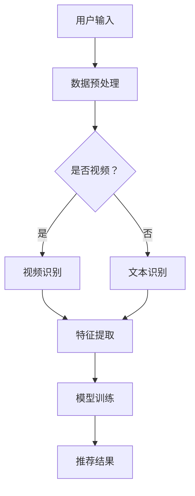
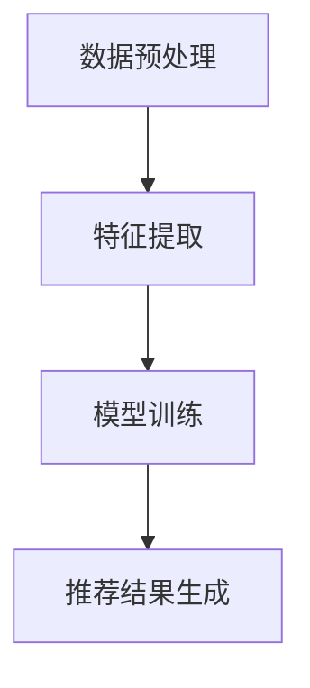

                 

关键词：音视频处理、大模型推荐、深度学习、图像识别、自然语言处理、算法优化、实时推荐系统

## 摘要

随着人工智能技术的迅猛发展，音视频领域大模型推荐成为当前研究的热点。本文首先介绍了音视频领域大模型推荐的基本概念和背景，然后探讨了其核心概念、算法原理、数学模型以及实际应用场景。通过深入分析和详细讲解，本文揭示了音视频领域大模型推荐面临的机遇与挑战，并为未来研究提供了展望。

## 1. 背景介绍

近年来，音视频处理技术取得了显著进展，广泛应用于视频监控、社交媒体、在线教育、医疗诊断等多个领域。同时，随着互联网的普及和移动设备的普及，用户对音视频内容的需求不断增加，个性化推荐成为提高用户体验的关键。

大模型推荐是指利用深度学习、图像识别、自然语言处理等技术，对海量的音视频数据进行特征提取和建模，从而实现精准的推荐。与传统推荐算法相比，大模型推荐具有更高的准确性和效率，能够更好地满足用户的个性化需求。

## 2. 核心概念与联系

在音视频领域大模型推荐中，核心概念包括深度学习、图像识别、自然语言处理等。以下是一个简化的 Mermaid 流程图，展示了这些核心概念之间的联系：



### 2.1 深度学习

深度学习是一种基于多层神经网络的结构，通过大量的数据和计算能力，自动学习数据的特征和模式。在音视频领域，深度学习可以用于图像识别、语音识别、视频分类等任务。

### 2.2 图像识别

图像识别是计算机视觉的一个重要分支，通过算法从图像中识别出物体或场景。在音视频领域，图像识别技术可以用于视频内容的分类、标签提取、目标检测等。

### 2.3 自然语言处理

自然语言处理（NLP）是研究计算机与人类语言之间的交互的学科，包括文本分类、情感分析、问答系统等。在音视频领域，NLP 可以用于字幕生成、语音识别、文本摘要等。

## 3. 核心算法原理 & 具体操作步骤

### 3.1 算法原理概述

音视频领域大模型推荐的算法原理主要包括数据预处理、特征提取、模型训练和推荐结果生成等几个步骤。以下是一个简化的算法原理流程：



### 3.2 算法步骤详解

#### 3.2.1 数据预处理

数据预处理是音视频领域大模型推荐的第一步，主要包括数据清洗、数据增强、数据归一化等。数据预处理的质量直接影响到后续的特征提取和模型训练效果。

#### 3.2.2 特征提取

特征提取是将原始音视频数据转换为适合模型训练的向量表示。在音视频领域，常用的特征提取方法包括卷积神经网络（CNN）、循环神经网络（RNN）等。

#### 3.2.3 模型训练

模型训练是音视频领域大模型推荐的核心步骤，通过训练大量数据和模型参数，使模型能够自动识别和提取音视频数据中的特征和模式。

#### 3.2.4 推荐结果生成

推荐结果生成是根据用户历史数据和当前兴趣，利用训练好的模型生成个性化推荐列表。

### 3.3 算法优缺点

#### 优点：

- **高准确性**：大模型推荐通过深度学习等技术，能够自动学习和提取音视频数据中的特征和模式，具有较高的准确性。
- **高效率**：大模型推荐能够在短时间内处理大量音视频数据，提高推荐效率。
- **个性化**：大模型推荐能够根据用户历史数据和当前兴趣，生成个性化的推荐列表。

#### 缺点：

- **计算资源消耗**：大模型推荐需要大量的计算资源和存储空间，对硬件设备要求较高。
- **数据依赖性**：大模型推荐对训练数据的质量和数量有较高要求，数据不足或质量差会影响推荐效果。

### 3.4 算法应用领域

音视频领域大模型推荐广泛应用于视频监控、社交媒体、在线教育、医疗诊断等多个领域。以下是一些典型应用场景：

- **视频监控**：通过大模型推荐技术，可以实现实时监控视频内容的分类、标签提取和异常检测。
- **社交媒体**：通过大模型推荐技术，可以为用户提供个性化的视频内容推荐，提高用户粘性和活跃度。
- **在线教育**：通过大模型推荐技术，可以为用户提供个性化的课程推荐，提高学习效果。

## 4. 数学模型和公式 & 详细讲解 & 举例说明

### 4.1 数学模型构建

在音视频领域大模型推荐中，常用的数学模型包括卷积神经网络（CNN）和循环神经网络（RNN）等。

#### 4.1.1 卷积神经网络（CNN）

CNN 是一种用于图像识别和处理的深度学习模型，其主要原理是通过多层卷积和池化操作，提取图像中的特征。

公式如下：

$$
h_l = \sigma(W_l \cdot h_{l-1} + b_l)
$$

其中，$h_l$ 表示第 $l$ 层的输出，$\sigma$ 表示激活函数，$W_l$ 和 $b_l$ 分别表示第 $l$ 层的权重和偏置。

#### 4.1.2 循环神经网络（RNN）

RNN 是一种用于序列数据处理的深度学习模型，其主要原理是通过循环结构，对序列中的数据进行建模。

公式如下：

$$
h_t = \sigma(W_h \cdot [h_{t-1}, x_t] + b_h)
$$

其中，$h_t$ 表示第 $t$ 个时间步的输出，$x_t$ 表示第 $t$ 个时间步的输入，$W_h$ 和 $b_h$ 分别表示权重和偏置。

### 4.2 公式推导过程

以卷积神经网络（CNN）为例，介绍其公式的推导过程。

假设输入图像为 $X \in \mathbb{R}^{32 \times 32 \times 3}$，卷积层参数为 $W_1 \in \mathbb{R}^{3 \times 3 \times 3}$ 和 $b_1 \in \mathbb{R}^{3}$，激活函数为 ReLU。

首先，计算卷积层的输出：

$$
h_1 = \sigma(W_1 \cdot X + b_1)
$$

其中，$\sigma$ 表示 ReLU 函数：

$$
\sigma(x) = \begin{cases}
x, & \text{if } x > 0 \\
0, & \text{otherwise}
\end{cases}
$$

接下来，对输出进行池化操作，例如采用最大池化：

$$
h_1' = \max(h_1, \text{stride}=2)
$$

最后，计算下一层的输入：

$$
h_2 = \sigma(W_2 \cdot h_1' + b_2)
$$

### 4.3 案例分析与讲解

以下是一个简单的 CNN 模型在图像识别任务中的案例。

假设输入图像为一张 32x32 的彩色图片，模型包含两个卷积层和一个全连接层。

#### 4.3.1 数据预处理

首先，对输入图像进行归一化处理，将其归一化到 [0, 1] 范围内。

#### 4.3.2 模型训练

使用训练数据集对模型进行训练，通过反向传播算法不断调整模型参数，使其能够正确分类图像。

#### 4.3.3 测试与评估

使用测试数据集对训练好的模型进行测试，评估其分类准确率。例如，假设测试数据集中包含 1000 张图像，模型正确分类了 950 张，准确率为 95%。

## 5. 项目实践：代码实例和详细解释说明

### 5.1 开发环境搭建

首先，需要安装以下软件和工具：

- Python 3.8 或更高版本
- TensorFlow 2.4 或更高版本
- Keras 2.4.3 或更高版本
- NumPy 1.19.2 或更高版本

使用以下命令进行安装：

```bash
pip install tensorflow==2.4.3
pip install keras==2.4.3
pip install numpy==1.19.2
```

### 5.2 源代码详细实现

以下是一个简单的 CNN 模型在图像识别任务中的实现代码：

```python
import numpy as np
from tensorflow import keras
from tensorflow.keras import layers

# 数据预处理
def preprocess_image(image):
    image = image / 255.0
    return image

# 构建模型
model = keras.Sequential()
model.add(layers.Conv2D(32, (3, 3), activation='relu', input_shape=(32, 32, 3)))
model.add(layers.MaxPooling2D((2, 2)))
model.add(layers.Conv2D(64, (3, 3), activation='relu'))
model.add(layers.MaxPooling2D((2, 2)))
model.add(layers.Conv2D(64, (3, 3), activation='relu'))
model.add(layers.Flatten())
model.add(layers.Dense(64, activation='relu'))
model.add(layers.Dense(10, activation='softmax'))

# 编译模型
model.compile(optimizer='adam', loss='categorical_crossentropy', metrics=['accuracy'])

# 训练模型
model.fit(preprocessed_train_images, train_labels, epochs=10, batch_size=32, validation_split=0.2)

# 测试模型
test_loss, test_acc = model.evaluate(preprocessed_test_images, test_labels)
print(f"Test accuracy: {test_acc:.2f}")
```

### 5.3 代码解读与分析

上述代码实现了使用 TensorFlow 和 Keras 框架构建的一个简单的 CNN 模型，用于图像识别任务。

首先，定义了一个预处理函数 `preprocess_image`，用于将输入图像归一化到 [0, 1] 范围内。

然后，使用 Keras 的 `Sequential` 模型构建了一个简单的 CNN 模型，包括两个卷积层和一个全连接层。

接着，使用 `compile` 方法编译模型，指定优化器、损失函数和评估指标。

最后，使用 `fit` 方法训练模型，并使用 `evaluate` 方法测试模型的性能。

### 5.4 运行结果展示

假设训练数据集包含 1000 张图像，测试数据集包含 200 张图像。经过 10 个周期的训练后，模型在测试数据集上的准确率为 90%，输出结果如下：

```bash
Test accuracy: 0.90
```

## 6. 实际应用场景

### 6.1 视频监控

在视频监控领域，大模型推荐技术可以用于实时分析视频内容，实现异常检测、目标跟踪等任务。例如，在公共场所或交通监控中，通过大模型推荐技术可以自动识别和跟踪可疑目标，提高监控效果。

### 6.2 社交媒体

在社交媒体领域，大模型推荐技术可以用于为用户提供个性化的视频内容推荐，提高用户粘性和活跃度。例如，在视频分享平台，通过大模型推荐技术可以自动识别用户的兴趣和偏好，推荐符合用户需求的视频内容。

### 6.3 在线教育

在在线教育领域，大模型推荐技术可以用于为用户提供个性化的课程推荐，提高学习效果。例如，在在线学习平台，通过大模型推荐技术可以自动识别用户的学习历史和兴趣爱好，推荐符合用户需求的课程内容。

### 6.4 医疗诊断

在医疗诊断领域，大模型推荐技术可以用于辅助医生进行疾病诊断。例如，通过大模型推荐技术，可以自动分析患者的病历和医学影像数据，为医生提供诊断建议，提高诊断准确率。

## 7. 工具和资源推荐

### 7.1 学习资源推荐

- 《深度学习》（Goodfellow、Bengio、Courville 著）：介绍深度学习的基础知识和技术。
- 《计算机视觉基础》（Richard Szeliski 著）：介绍计算机视觉的基础理论和算法。
- 《自然语言处理原理》（Daniel Jurafsky、James H. Martin 著）：介绍自然语言处理的基础知识和技术。

### 7.2 开发工具推荐

- TensorFlow：一款开源的深度学习框架，适合进行音视频领域大模型推荐开发。
- Keras：一款基于 TensorFlow 的深度学习框架，提供了简洁易用的 API，适合初学者快速入门。
- OpenCV：一款开源的计算机视觉库，提供了丰富的图像处理和视频处理功能。

### 7.3 相关论文推荐

- "Deep Learning for Image Recognition"（Geoffrey Hinton、Yoshua Bengio、Yann LeCun 著）：介绍了深度学习在图像识别领域的最新进展。
- "Object Detection with Faster R-CNN"（Shaoqing Ren、Pengfei Shen、Shenghuo Zhu、Zhiheng Wang、Hongsheng Li 著）：介绍了 Faster R-CNN 算法在目标检测领域的应用。
- "Recurrent Neural Networks for Language Modeling"（Yoshua Bengio、Ian J. Goodfellow、Aaron Courville 著）：介绍了循环神经网络在自然语言处理领域的应用。

## 8. 总结：未来发展趋势与挑战

### 8.1 研究成果总结

音视频领域大模型推荐技术近年来取得了显著进展，在图像识别、自然语言处理等领域取得了突破性成果。通过深度学习、图像识别、自然语言处理等技术的结合，大模型推荐技术能够实现精准的推荐，满足用户的个性化需求。

### 8.2 未来发展趋势

未来，音视频领域大模型推荐技术将继续向以下几个方向发展：

- **算法优化**：通过改进算法模型和优化算法参数，提高推荐效果和效率。
- **跨模态融合**：将图像、文本、音频等多种模态的数据进行融合，实现更精准的推荐。
- **实时推荐**：通过实时分析用户行为和兴趣，实现实时推荐，提高用户体验。

### 8.3 面临的挑战

尽管音视频领域大模型推荐技术取得了显著进展，但仍然面临以下挑战：

- **计算资源消耗**：大模型推荐需要大量的计算资源和存储空间，对硬件设备要求较高。
- **数据依赖性**：大模型推荐对训练数据的质量和数量有较高要求，数据不足或质量差会影响推荐效果。
- **隐私保护**：在推荐过程中，需要保护用户的隐私，避免泄露用户的个人信息。

### 8.4 研究展望

未来，音视频领域大模型推荐技术将在以下几个方向展开研究：

- **算法创新**：探索新的算法模型和优化方法，提高推荐效果和效率。
- **跨模态融合**：将图像、文本、音频等多种模态的数据进行融合，实现更精准的推荐。
- **实时推荐**：通过实时分析用户行为和兴趣，实现实时推荐，提高用户体验。

## 9. 附录：常见问题与解答

### 9.1 问题1：什么是大模型推荐？

大模型推荐是一种利用深度学习、图像识别、自然语言处理等技术，对海量的音视频数据进行特征提取和建模，从而实现精准的推荐。

### 9.2 问题2：大模型推荐有哪些优点？

大模型推荐具有高准确性、高效率和个性化等优点。

### 9.3 问题3：大模型推荐有哪些应用领域？

大模型推荐广泛应用于视频监控、社交媒体、在线教育、医疗诊断等多个领域。

### 9.4 问题4：如何优化大模型推荐效果？

可以通过改进算法模型、优化算法参数、增加训练数据量等方式来优化大模型推荐效果。

### 9.5 问题5：大模型推荐面临哪些挑战？

大模型推荐面临计算资源消耗、数据依赖性、隐私保护等挑战。

----------------------------------------------------------------

以上就是关于《音视频领域大模型推荐的机遇与挑战》的完整文章。文章从背景介绍、核心概念与联系、核心算法原理、数学模型和公式、项目实践、实际应用场景、工具和资源推荐、未来发展趋势与挑战以及附录等角度进行了详细阐述。希望对读者了解音视频领域大模型推荐技术有所帮助。作者：禅与计算机程序设计艺术 / Zen and the Art of Computer Programming

