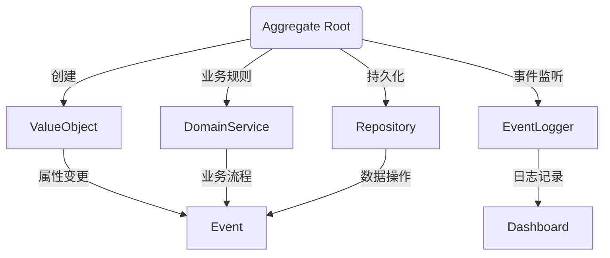

                 

关键词：领域驱动设计（Domain-Driven Design, DDD）、软件开发方法论、系统架构、复杂系统、软件工程

## 摘要

本文旨在深入探讨领域驱动设计（DDD）的方法论，解释其核心概念、架构原则和实践步骤。我们将从DDD的历史背景入手，逐步介绍DDD的关键组件、设计原则以及其在现代软件开发中的应用。本文还将通过实际案例和代码实例，展示DDD如何帮助开发团队构建灵活、可扩展且易于维护的复杂系统。最终，我们将展望DDD的未来发展趋势和面临的挑战，为读者提供全面的技术指导。

## 1. 背景介绍

领域驱动设计（DDD）是由Eric Evans在其同名著作《领域驱动设计：软件开发的核心领域模式》（"Domain-Driven Design: Tackling Complexity in the Heart of Software"）中提出的。这本书首次在2004年出版，随后引发了软件开发界对DDD的广泛关注和深入研究。

DDD的诞生背景可以追溯到软件开发中的一个普遍问题：如何应对系统复杂性。在传统的软件开发方法论中，系统的设计往往过于关注技术细节而忽略了业务领域本身。这导致软件系统难以适应业务变化，使得开发工作变得低效、复杂和昂贵。为了解决这一问题，Eric Evans提出了DDD。

DDD的核心思想是将软件开发的重点从技术层面转移到业务领域，通过构建清晰的领域模型来降低系统的复杂性。DDD强调领域专家和开发团队的紧密合作，确保系统设计能够准确反映业务需求。

## 2. 核心概念与联系

### 2.1 DDD的核心概念

DDD涉及多个核心概念，其中最关键的是“领域”（Domain）、“子域”（Subdomain）和“上下文边界”（Bounded Context）。

- **领域（Domain）**：领域是指与业务相关的所有实体、规则和流程的集合。在DDD中，领域是软件系统设计的核心，它代表了系统的业务核心。
  
- **子域（Subdomain）**：子域是领域内的一个特定部分，代表了系统中的一个特定功能或业务模块。子域通常包含一组紧密相关的实体和规则。

- **上下文边界（Bounded Context）**：上下文边界是一个逻辑边界，用于隔离不同的子域，确保每个子域都可以独立开发、测试和部署。上下文边界有助于减少系统中的依赖关系，提高系统的可维护性和可扩展性。

### 2.2 DDD的架构原则

DDD的架构原则旨在指导如何将领域模型转化为实际的软件系统。以下是DDD的一些关键架构原则：

- **实体（Entities）与值对象（Value Objects）**：实体是具有唯一标识的领域对象，它们通常与业务规则紧密相关。值对象是没有任何唯一标识的领域对象，但它们通常具有业务含义。

- **聚合（Aggregates）**：聚合是一组紧密相关的实体和值对象的组合，它们共同实现一个业务功能。聚合是DDD中的基本数据结构，用于封装领域逻辑。

- **领域服务（Domain Services）**：领域服务是一组用于实现跨聚合的领域逻辑的服务。领域服务通常与特定的业务过程或事务相关。

- **资源库（Repositories）**：资源库是用于持久化聚合的组件，它提供了一个接口，用于添加、删除、更新和查询聚合。

- **事件驱动架构（Event-Driven Architecture）**：在DDD中，事件驱动架构用于实现领域事件和状态变更的追踪。事件驱动架构使得系统具有更高的可扩展性和可测试性。

### 2.3 DDD架构的Mermaid流程图

以下是一个简化的DDD架构的Mermaid流程图：



在上述流程图中，每个实体和值对象都关联了相应的领域服务、资源库和事件日志。这展示了DDD中不同组件之间的交互关系，以及它们在实现业务逻辑中的角色和职责。

## 3. 核心算法原理 & 具体操作步骤

### 3.1 算法原理概述

DDD的核心算法原理主要体现在如何通过领域模型来组织和设计复杂的业务逻辑。DDD通过以下步骤实现这一目标：

1. **识别领域核心概念**：通过领域驱动设计，首先需要识别系统中的核心业务概念，如实体、值对象、子域等。
2. **构建领域模型**：在识别了核心概念后，构建领域模型，定义实体之间的关系、业务规则和流程。
3. **实现领域逻辑**：将领域模型转化为实际的代码实现，包括实体、聚合、领域服务、资源库等组件。

### 3.2 算法步骤详解

1. **识别领域核心概念**

   在这一步骤中，开发团队需要与业务专家紧密合作，深入理解业务需求，识别系统中的核心业务概念。这通常涉及到对业务流程、规则和术语的详细分析。

2. **构建领域模型**

   基于识别的核心概念，构建领域模型。领域模型通常包含实体、值对象、聚合和领域服务。实体和聚合用于封装业务逻辑和数据，值对象用于传递业务数据，领域服务用于实现跨聚合的复杂业务流程。

3. **实现领域逻辑**

   将领域模型转化为实际的代码实现。这一步骤涉及编写实体、聚合、领域服务和资源库。同时，还需要考虑如何处理领域事件，实现事件驱动架构。

### 3.3 算法优缺点

**优点：**

- **提高系统可维护性**：通过将业务逻辑封装在领域模型中，可以显著降低系统的复杂性，提高代码的可维护性。
- **增强系统可扩展性**：DDD通过上下文边界隔离子域，使得系统具有更高的可扩展性。新功能的添加和现有功能的修改可以更方便地进行。
- **提高团队协作效率**：DDD强调开发团队与业务专家的紧密合作，有助于确保系统设计能够准确反映业务需求。

**缺点：**

- **学习曲线较高**：DDD涉及多个复杂的概念和架构原则，对于初学者来说，学习曲线可能较高。
- **实施成本较高**：由于DDD强调领域模型的构建和实现，可能导致项目初期的工作量较大，实施成本相对较高。

### 3.4 算法应用领域

DDD在多个领域都有广泛的应用，如电子商务、金融、物流、医疗等。以下是一些典型的应用场景：

- **电子商务系统**：电子商务系统通常涉及复杂的订单管理、支付处理和用户行为分析等业务流程，DDD有助于将这些流程组织得更加清晰、易于维护。
- **金融系统**：金融系统需要处理大量的金融交易、风险管理等业务，DDD可以显著降低系统的复杂性，提高系统的可靠性和安全性。
- **物流系统**：物流系统涉及运输管理、库存管理等多个子域，DDD有助于将各个子域的业务逻辑组织得更加清晰，提高系统的可扩展性。

## 4. 数学模型和公式 & 详细讲解 & 举例说明

### 4.1 数学模型构建

在DDD中，数学模型主要用于表示领域中的业务规则和逻辑。构建数学模型通常涉及以下几个步骤：

1. **定义实体和值对象**：首先，识别系统中的核心实体和值对象，并定义它们的属性和行为。
2. **建立关系模型**：基于实体和值对象的定义，建立它们之间的关系模型，如聚合关系、继承关系等。
3. **定义业务规则**：根据业务需求，定义实体和值对象之间的业务规则，如计算公式、逻辑条件等。

### 4.2 公式推导过程

以下是一个简单的例子，用于推导一个电商系统中的订单金额计算公式。

#### 示例：订单金额计算公式

假设订单金额（OrderAmount）取决于商品数量（ProductQuantity）和单价（ProductPrice）。我们可以使用以下公式计算订单金额：

$$
OrderAmount = ProductQuantity \times ProductPrice
$$

#### 公式推导过程：

1. **定义实体和值对象**：
   - **Order**：订单实体，包含订单编号、订单金额等属性。
   - **Product**：商品值对象，包含商品编号、商品名称、单价等属性。

2. **建立关系模型**：
   - 订单实体包含多个商品值对象，即一个订单可以包含多个商品。

3. **定义业务规则**：
   - 订单金额取决于商品数量和单价。

4. **推导公式**：
   - 基于业务规则，推导出订单金额计算公式。

### 4.3 案例分析与讲解

以下是一个电商系统中的订单金额计算示例，我们将使用DDD的领域模型和数学公式来详细分析这个案例。

#### 案例背景

假设有一个电商系统，用户可以在系统中创建订单，并添加商品。每个订单包含多个商品，每个商品具有不同的单价。我们需要计算每个订单的总金额。

#### 领域模型

1. **Order**：订单实体，包含以下属性：
   - **orderId**：订单编号，唯一标识。
   - **orderAmount**：订单金额，表示订单的总金额。

2. **Product**：商品值对象，包含以下属性：
   - **productId**：商品编号，唯一标识。
   - **productName**：商品名称。
   - **productPrice**：商品单价。

#### 公式推导

根据DDD的领域模型，我们可以推导出订单金额的计算公式：

$$
OrderAmount = \sum_{i=1}^{n} (ProductQuantity_i \times ProductPrice_i)
$$

其中，$ProductQuantity_i$ 表示第 $i$ 个商品的购买数量，$ProductPrice_i$ 表示第 $i$ 个商品的单价。

#### 案例分析

假设用户创建了一个订单，包含以下商品：

- 商品A：购买数量2，单价100元。
- 商品B：购买数量3，单价200元。

根据订单金额计算公式，我们可以计算出订单金额：

$$
OrderAmount = (2 \times 100) + (3 \times 200) = 200 + 600 = 800 \text{元}
$$

#### 代码实现

以下是一个简单的Java代码示例，用于实现订单金额计算功能：

```java
public class Order {
    private String orderId;
    private double orderAmount;

    // 订单金额计算方法
    public void calculateOrderAmount(List<Product> products) {
        double totalAmount = 0;
        for (Product product : products) {
            totalAmount += product.getProductQuantity() * product.getProductPrice();
        }
        this.orderAmount = totalAmount;
    }
}

public class Product {
    private String productId;
    private String productName;
    private double productPrice;
    private int productQuantity;

    // 获取商品单价
    public double getProductPrice() {
        return productPrice;
    }

    // 获取商品购买数量
    public int getProductQuantity() {
        return productQuantity;
    }
}
```

通过上述代码，我们可以轻松实现订单金额的计算。

## 5. 项目实践：代码实例和详细解释说明

### 5.1 开发环境搭建

在开始编写代码之前，我们需要搭建一个适合DDD的开发环境。以下是一个简单的开发环境搭建步骤：

1. 安装Java开发工具包（JDK）。
2. 安装一个集成开发环境（IDE），如IntelliJ IDEA或Eclipse。
3. 安装版本控制系统，如Git。
4. 配置数据库，如MySQL或PostgreSQL。

### 5.2 源代码详细实现

以下是一个简单的DDD项目示例，用于计算订单金额。这个示例包括订单实体、商品值对象和领域服务。

**Order.java**（订单实体）

```java
public class Order {
    private String orderId;
    private double orderAmount;
    private List<Product> products;

    public Order(String orderId) {
        this.orderId = orderId;
        this.products = new ArrayList<>();
    }

    // 添加商品到订单
    public void addProduct(Product product) {
        products.add(product);
    }

    // 计算订单金额
    public void calculateOrderAmount() {
        double totalAmount = 0;
        for (Product product : products) {
            totalAmount += product.getProductQuantity() * product.getProductPrice();
        }
        this.orderAmount = totalAmount;
    }

    // 获取订单金额
    public double getOrderAmount() {
        return orderAmount;
    }
}
```

**Product.java**（商品值对象）

```java
public class Product {
    private String productId;
    private String productName;
    private double productPrice;
    private int productQuantity;

    public Product(String productId, String productName, double productPrice, int productQuantity) {
        this.productId = productId;
        this.productName = productName;
        this.productPrice = productPrice;
        this.productQuantity = productQuantity;
    }

    // 获取商品单价
    public double getProductPrice() {
        return productPrice;
    }

    // 获取商品购买数量
    public int getProductQuantity() {
        return productQuantity;
    }
}
```

**OrderService.java**（领域服务）

```java
public class OrderService {
    // 创建订单
    public Order createOrder(String orderId) {
        return new Order(orderId);
    }

    // 计算订单金额
    public void calculateOrderAmount(Order order) {
        order.calculateOrderAmount();
    }
}
```

### 5.3 代码解读与分析

在上述代码中，我们首先定义了订单实体（Order）和商品值对象（Product），这两个类分别代表了DDD中的实体和值对象。

**Order类：**

- **属性**：orderId（订单编号，唯一标识）、orderAmount（订单金额）、products（订单包含的商品列表）。
- **方法**：addProduct（添加商品到订单）、calculateOrderAmount（计算订单金额）、getOrderAmount（获取订单金额）。

**Product类：**

- **属性**：productId（商品编号，唯一标识）、productName（商品名称）、productPrice（商品单价）、productQuantity（商品购买数量）。
- **方法**：getProductPrice（获取商品单价）、getProductQuantity（获取商品购买数量）。

**OrderService类：**

- **方法**：createOrder（创建订单）、calculateOrderAmount（计算订单金额）。

通过这些类和方法，我们可以实现订单金额的计算功能。在OrderService类中，我们提供了创建订单和计算订单金额的方法，这些方法遵循DDD的原则，将业务逻辑封装在领域服务中。

### 5.4 运行结果展示

以下是一个简单的Java程序，用于演示订单金额计算功能。

```java
public class Main {
    public static void main(String[] args) {
        // 创建订单
        OrderService orderService = new OrderService();
        Order order = orderService.createOrder("ORDER123");

        // 添加商品
        Product productA = new Product("PROD001", "商品A", 100, 2);
        Product productB = new Product("PROD002", "商品B", 200, 3);
        order.addProduct(productA);
        order.addProduct(productB);

        // 计算订单金额
        orderService.calculateOrderAmount(order);

        // 输出订单金额
        System.out.println("订单金额：" + order.getOrderAmount());
    }
}
```

运行上述程序，输出结果为：

```
订单金额：800.0
```

这表明订单金额计算功能正常运行。

## 6. 实际应用场景

领域驱动设计（DDD）在软件开发中具有广泛的应用，特别是在处理复杂业务系统时。以下是一些典型的实际应用场景：

### 6.1 电子商务平台

电子商务平台涉及复杂的订单管理、支付处理和用户行为分析等业务流程。DDD可以帮助将复杂的业务逻辑组织得更加清晰，提高系统的可维护性和可扩展性。

### 6.2 银行系统

银行系统需要处理大量的金融交易、风险管理等业务。DDD有助于降低系统的复杂性，提高系统的可靠性和安全性。

### 6.3 物流系统

物流系统涉及运输管理、库存管理等多个子域。DDD可以帮助将各个子域的业务逻辑组织得更加清晰，提高系统的可扩展性。

### 6.4 医疗系统

医疗系统涉及复杂的患者管理、医疗记录管理等业务。DDD可以帮助将复杂的业务逻辑组织得更加清晰，提高系统的可维护性和可扩展性。

### 6.5 基础设施管理

基础设施管理系统涉及设备监控、维护管理等多个子域。DDD可以帮助将各个子域的业务逻辑组织得更加清晰，提高系统的可维护性和可扩展性。

## 7. 工具和资源推荐

### 7.1 学习资源推荐

- 《领域驱动设计：软件开发的核心领域模式》（Eric Evans著）：这是DDD的经典著作，全面介绍了DDD的核心概念和架构原则。
- 《领域驱动设计实战》（Oliver Reichenstein著）：这本书通过实际案例，展示了如何将DDD应用于现实世界中的软件开发。

### 7.2 开发工具推荐

- IntelliJ IDEA：一款功能强大的集成开发环境，支持Java、Kotlin等多种编程语言。
- Visual Studio Code：一款轻量级的代码编辑器，支持多种编程语言和插件。

### 7.3 相关论文推荐

- "Domain-Driven Design: Improving Design with Core Domain Models"（Eric Evans著）：这篇论文详细介绍了DDD的核心概念和架构原则。
- "Domain-Driven Design in Practice"（Vaughn Vernon著）：这篇论文探讨了如何将DDD应用于实际软件开发。

## 8. 总结：未来发展趋势与挑战

### 8.1 研究成果总结

领域驱动设计（DDD）自2004年提出以来，已经成为了软件开发领域的重要方法论。通过DDD，开发团队可以更加清晰地组织复杂的业务逻辑，提高系统的可维护性和可扩展性。DDD在电子商务、金融、物流、医疗等多个领域都取得了显著的成果。

### 8.2 未来发展趋势

未来，DDD将继续在软件开发领域发挥重要作用。以下是一些发展趋势：

- **自动化和智能化**：随着人工智能技术的发展，DDD将更加自动化和智能化，例如使用AI技术进行领域模型的自动生成。
- **微服务架构**：DDD与微服务架构的结合将进一步推动软件系统的模块化和分布式化。
- **云原生应用**：DDD将更加适用于云原生应用的开发，提高系统的弹性和可扩展性。

### 8.3 面临的挑战

尽管DDD在软件开发中具有广泛的应用前景，但同时也面临着一些挑战：

- **学习成本**：DDD涉及多个复杂的概念和架构原则，对于初学者来说，学习成本较高。
- **实施难度**：DDD的实施需要开发团队与业务专家的紧密合作，这在某些情况下可能难以实现。
- **工具支持**：目前，支持DDD的工具相对较少，需要进一步发展和完善。

### 8.4 研究展望

未来，DDD的研究将朝着更加自动化、智能化和模块化的方向发展。开发团队可以通过引入AI技术、微服务架构和云原生应用等先进技术，进一步提高DDD的适用性和有效性。

## 9. 附录：常见问题与解答

### 9.1 DDD与传统的OO设计有何区别？

DDD与传统的面向对象（OO）设计有显著区别。传统的OO设计主要关注对象之间的关系和数据结构，而DDD则更加关注业务领域本身。DDD通过领域模型将业务逻辑抽象出来，使得系统设计更加贴近业务需求。

### 9.2 如何选择合适的上下文边界？

选择合适的上下文边界需要考虑业务需求和系统的复杂性。一般来说，应该将紧密相关的子域放在同一个上下文边界内，而跨子域的业务逻辑则可以在不同的上下文边界之间传递。在具体实践中，可以结合业务场景和系统架构进行权衡。

### 9.3 DDD如何与微服务架构结合？

DDD与微服务架构可以很好地结合。微服务架构强调系统的模块化和分布式化，而DDD则提供了清晰的领域模型来组织业务逻辑。在实际开发中，可以将DDD的子域与微服务相映射，确保每个微服务都负责一个具体的业务领域。

## 参考文献

- Eric Evans. "Domain-Driven Design: Tackling Complexity in the Heart of Software." Addison-Wesley, 2004.
- Vaughn Vernon. "Implementing Domain-Driven Design." Addison-Wesley, 2012.
- Oliver Reichenstein. "Domain-Driven Design: Patterns, Practices & Principles for Agile Software Development." Apress, 2018.

### 作者署名

作者：禅与计算机程序设计艺术 / Zen and the Art of Computer Programming
----------------------------------------------------------------


