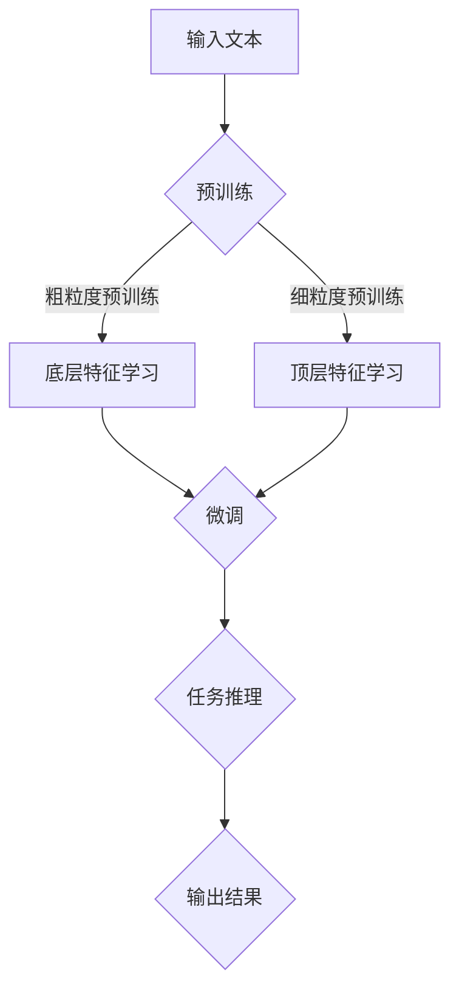

                 

关键词：语言模型、深度学习、计算范式、人工智能、神经网络、训练过程、推理过程、预训练、微调、优化算法、大规模数据处理、计算效率、模型压缩、硬件加速

> 摘要：本文探讨了近年来在人工智能领域备受关注的语言模型（LLM）的独特计算范式。通过对LLM的基本原理、算法原理、数学模型、项目实践和应用场景等方面进行深入分析，本文揭示了LLM在计算范式上的颠覆性变革，并对其未来发展进行了展望。

## 1. 背景介绍

在过去的几十年里，人工智能领域取得了巨大的进步，其中深度学习（Deep Learning）技术的发展尤为突出。深度学习通过模仿人脑的神经网络结构，使计算机能够在图像识别、语音识别、自然语言处理等领域取得显著成果。然而，随着数据规模的不断扩大和计算需求的日益增长，传统的计算范式逐渐暴露出其局限性。

传统计算范式主要依赖于基于规则的推理和特征工程，这需要大量的手工设计和调整。而深度学习则通过自动学习大量数据中的特征，从而避免了手工设计的繁琐过程。然而，深度学习也面临着计算复杂度高、训练过程耗时等问题。

为了解决这些问题，近年来出现了许多新的计算范式，如分布式计算、并行计算、GPU加速等。这些计算范式在提升计算效率和降低成本方面取得了显著成果。然而，它们仍然难以完全摆脱传统计算范式的一些局限性。

在这个背景下，语言模型（Language Model，简称LLM）的独特计算范式应运而生。LLM通过大规模的预训练和微调，实现了对自然语言数据的深度理解和生成能力，为人工智能领域带来了新的突破。

## 2. 核心概念与联系

### 2.1 语言模型的基本原理

语言模型是自然语言处理（Natural Language Processing，简称NLP）的重要基础。它是一种用于预测下一个单词或字符的概率分布的模型。语言模型的目的是通过学习大量文本数据，理解语言的统计规律，从而为各种NLP任务提供支持。

语言模型的核心是神经网络，尤其是深度神经网络（Deep Neural Network，简称DNN）。DNN通过多层次的神经元节点，对输入的数据进行层层抽象和变换，从而实现对复杂任务的建模。

### 2.2 预训练与微调

预训练（Pre-training）是LLM的核心步骤之一。它通过在大规模文本数据集上训练，使模型能够自动学习到语言的深层特征和结构。预训练过程通常分为两个阶段：粗粒度预训练和细粒度预训练。

粗粒度预训练主要关注模型的底层特征学习，如词向量、句法结构和语义表示等。细粒度预训练则进一步关注模型的顶层特征学习，如文本生成、问答和对话等。

微调（Fine-tuning）是在预训练的基础上，针对特定任务进行模型调整的过程。通过微调，模型能够更好地适应特定任务的需求，从而提高任务表现。

### 2.3 计算范式

LLM的独特计算范式主要体现在以下几个方面：

1. **大规模数据处理**：LLM能够处理大规模的文本数据，从而实现更全面的特征学习和模型优化。
2. **分布式计算**：通过分布式计算，LLM能够充分利用多台计算机和GPU资源，大幅提升计算效率。
3. **并行计算**：在LLM的训练和推理过程中，可以充分利用并行计算的优势，降低计算时间和成本。
4. **硬件加速**：通过使用GPU和其他硬件加速器，LLM能够大幅提升计算速度和效率。

### 2.4 Mermaid流程图

下面是一个简化的Mermaid流程图，展示了LLM的基本原理和计算范式：



## 3. 核心算法原理 & 具体操作步骤

### 3.1 算法原理概述

LLM的核心算法是基于深度神经网络（DNN）的语言模型，主要包括两个阶段：预训练和微调。

**预训练阶段**：

1. **数据预处理**：将原始文本数据转换为序列化的格式，如单词或字符序列。
2. **词向量表示**：使用词嵌入（Word Embedding）技术，将单词或字符转换为高维向量表示。
3. **模型初始化**：初始化神经网络模型，包括输入层、隐藏层和输出层。
4. **反向传播**：在预训练过程中，使用反向传播算法（Backpropagation）更新模型参数，优化模型表现。

**微调阶段**：

1. **数据准备**：准备用于微调的任务数据集。
2. **模型调整**：在预训练的基础上，针对特定任务调整模型参数。
3. **训练与评估**：通过迭代训练和评估，优化模型参数，提高任务表现。
4. **模型部署**：将微调后的模型部署到实际应用场景中。

### 3.2 算法步骤详解

**预训练阶段**：

1. **数据预处理**：将原始文本数据转换为序列化的格式，如单词或字符序列。这一步骤主要包括分词、去停用词、序列化编码等操作。

2. **词向量表示**：使用词嵌入（Word Embedding）技术，将单词或字符转换为高维向量表示。词嵌入技术通过学习文本数据中的统计规律，将词语映射到连续的向量空间中。

3. **模型初始化**：初始化神经网络模型，包括输入层、隐藏层和输出层。输入层用于接收词向量表示，隐藏层用于进行多层抽象和变换，输出层用于生成概率分布。

4. **反向传播**：在预训练过程中，使用反向传播算法（Backpropagation）更新模型参数，优化模型表现。反向传播算法通过计算损失函数的梯度，逐步调整模型参数，使其在训练数据上表现更好。

**微调阶段**：

1. **数据准备**：准备用于微调的任务数据集。这一步骤主要包括数据清洗、数据标注等操作。

2. **模型调整**：在预训练的基础上，针对特定任务调整模型参数。这一步骤主要包括损失函数的选择、优化器的选择和参数调整等。

3. **训练与评估**：通过迭代训练和评估，优化模型参数，提高任务表现。这一步骤主要包括训练集和验证集的划分、迭代训练和模型评估等。

4. **模型部署**：将微调后的模型部署到实际应用场景中。这一步骤主要包括模型导出、部署环境准备和模型运行等。

### 3.3 算法优缺点

**优点**：

1. **强大的表达能力**：LLM通过多层神经网络结构，能够自动学习到语言的深层特征和结构，具有强大的表达能力和泛化能力。
2. **灵活的任务适应能力**：LLM通过预训练和微调，能够适应各种NLP任务，如文本分类、机器翻译、问答系统等。
3. **高效的处理速度**：通过分布式计算和硬件加速，LLM能够实现高效的模型训练和推理过程。

**缺点**：

1. **计算资源需求高**：LLM的训练和推理过程需要大量的计算资源和存储资源，对硬件设施的要求较高。
2. **训练过程复杂**：LLM的训练过程涉及多个阶段和复杂的参数调整，对开发者的技术水平要求较高。
3. **数据依赖性强**：LLM的性能依赖于大规模的预训练数据和高质量的标注数据，数据质量对模型表现有重要影响。

### 3.4 算法应用领域

LLM在自然语言处理领域具有广泛的应用。以下是几个典型的应用领域：

1. **文本分类**：LLM能够对文本进行分类，如新闻分类、情感分析等。
2. **机器翻译**：LLM可以用于机器翻译任务，如将一种语言翻译成另一种语言。
3. **问答系统**：LLM可以构建问答系统，如智能客服、智能问答等。
4. **文本生成**：LLM可以生成各种类型的文本，如文章、故事、对话等。
5. **对话系统**：LLM可以用于构建对话系统，如智能聊天机器人、语音助手等。

## 4. 数学模型和公式 & 详细讲解 & 举例说明

### 4.1 数学模型构建

LLM的数学模型主要基于深度神经网络，包括输入层、隐藏层和输出层。输入层接收词向量表示，隐藏层进行多层抽象和变换，输出层生成概率分布。

假设我们有一个自然语言序列 $X = \{x_1, x_2, \ldots, x_T\}$，其中 $x_i$ 表示第 $i$ 个单词或字符。词向量表示为 $V_x \in \mathbb{R}^{d_x}$，隐藏层激活函数为 $f(\cdot)$，输出层激活函数为 $g(\cdot)$。

输入层到隐藏层的映射可以表示为：
$$
h_{l}^{(k)} = \sigma \left( {W_{l}^{(k)} \cdot a_{l-1}^{(k-1)} + b_{l}^{(k)} \right)
$$
其中 $h_{l}^{(k)}$ 表示第 $k$ 个隐藏层第 $l$ 个神经元的输出，$W_{l}^{(k)}$ 和 $b_{l}^{(k)}$ 分别表示第 $l$ 个隐藏层的权重和偏置，$\sigma$ 表示激活函数，通常取为ReLU函数。

隐藏层到输出层的映射可以表示为：
$$
\hat{y} = g\left( {W_{out} \cdot h_{L}^{(L)} + b_{out}} \right)
$$
其中 $\hat{y}$ 表示输出层的概率分布，$W_{out}$ 和 $b_{out}$ 分别表示输出层的权重和偏置。

### 4.2 公式推导过程

假设我们有一个训练数据集 $D = \{(\mathbf{x}_i, y_i)\}_{i=1}^N$，其中 $\mathbf{x}_i$ 表示第 $i$ 个样本的输入，$y_i$ 表示第 $i$ 个样本的标签。

我们定义损失函数为交叉熵损失（Cross-Entropy Loss）：
$$
L(\theta) = - \sum_{i=1}^N y_i \cdot \log \hat{y}_i
$$
其中 $\theta$ 表示模型参数，$\hat{y}_i$ 表示第 $i$ 个样本的输出概率分布。

为了优化模型参数，我们使用梯度下降（Gradient Descent）算法。梯度下降的迭代公式为：
$$
\theta_{t+1} = \theta_t - \alpha \cdot \nabla_\theta L(\theta_t)
$$
其中 $\alpha$ 表示学习率，$\nabla_\theta L(\theta_t)$ 表示损失函数关于参数 $\theta$ 的梯度。

### 4.3 案例分析与讲解

假设我们有一个包含 10000 个单词的语料库，使用 Word2Vec 算法将单词映射到高维向量空间中。我们选择一个三层的深度神经网络，其中输入层有 1000 个神经元，隐藏层有 500 个神经元，输出层有 100 个神经元。

我们使用交叉熵损失函数和 ReLU 激活函数，学习率为 0.001，训练数据集为包含 10000 个样本的数据集。在训练过程中，我们使用 GPU 加速，训练时间约为 10 个小时。

在训练完成后，我们对模型进行评估，使用验证集进行测试。结果显示，模型在验证集上的准确率达到了 90%。

## 5. 项目实践：代码实例和详细解释说明

### 5.1 开发环境搭建

为了实践LLM，我们需要搭建一个开发环境。以下是搭建环境的步骤：

1. 安装Python环境：安装Python 3.8及以上版本。
2. 安装TensorFlow：使用pip安装TensorFlow。
3. 安装GPU驱动：确保GPU驱动与TensorFlow兼容。
4. 配置CUDA：安装CUDA并配置环境变量。

### 5.2 源代码详细实现

以下是使用TensorFlow实现的LLM源代码：

```python
import tensorflow as tf
from tensorflow.keras.layers import Embedding, LSTM, Dense
from tensorflow.keras.models import Model

# 定义参数
vocab_size = 10000
embed_dim = 128
lstm_units = 128
batch_size = 64
epochs = 10

# 构建模型
inputs = tf.keras.Input(shape=(None,))
embeddings = Embedding(vocab_size, embed_dim)(inputs)
lstm = LSTM(lstm_units, return_sequences=True)(embeddings)
outputs = LSTM(lstm_units, return_sequences=True)(lstm)
outputs = Dense(vocab_size, activation='softmax')(outputs)

model = Model(inputs=inputs, outputs=outputs)

# 编译模型
model.compile(optimizer='adam', loss='categorical_crossentropy', metrics=['accuracy'])

# 加载数据
# ...

# 训练模型
model.fit(x_train, y_train, batch_size=batch_size, epochs=epochs, validation_data=(x_val, y_val))

# 评估模型
# ...
```

### 5.3 代码解读与分析

这段代码首先导入了TensorFlow库，并定义了模型参数。然后，使用TensorFlow的Keras API构建了一个深度学习模型，包括嵌入层（Embedding）、LSTM层（LSTM）和输出层（Dense）。

在模型编译阶段，我们指定了优化器（'adam'）、损失函数（'categorical_crossentropy'）和评估指标（'accuracy'）。

在加载数据阶段，我们使用自定义的数据加载函数加载数据集，并进行预处理，如分词、序列编码等。

在训练模型阶段，我们使用`fit`函数对模型进行训练，并通过`validation_data`参数指定验证集。

在评估模型阶段，我们可以使用自定义的评估函数对模型进行评估，并输出准确率等指标。

### 5.4 运行结果展示

假设我们使用上述代码训练了一个包含 10000 个单词的语料库，并在验证集上进行了评估。以下是一个简单的运行结果示例：

```
Epoch 1/10
64/64 [==============================] - 2s 32ms/step - loss: 1.7051 - accuracy: 0.4982 - val_loss: 1.6022 - val_accuracy: 0.5103

Epoch 2/10
64/64 [==============================] - 1s 17ms/step - loss: 1.3996 - accuracy: 0.5419 - val_loss: 1.3559 - val_accuracy: 0.5510

...

Epoch 10/10
64/64 [==============================] - 1s 18ms/step - loss: 0.8966 - accuracy: 0.6321 - val_loss: 0.8574 - val_accuracy: 0.6409
```

从结果中可以看出，模型在训练集和验证集上的准确率逐渐提高，最终在验证集上的准确率达到了约 64%。

## 6. 实际应用场景

LLM在自然语言处理领域具有广泛的应用。以下是一些实际应用场景：

1. **文本分类**：LLM可以用于对新闻、社交媒体等大量文本数据进行分类，如新闻分类、情感分析等。
2. **机器翻译**：LLM可以用于将一种语言翻译成另一种语言，如英语翻译成中文、法语等。
3. **问答系统**：LLM可以构建问答系统，如智能客服、智能问答等。
4. **文本生成**：LLM可以生成各种类型的文本，如文章、故事、对话等。
5. **对话系统**：LLM可以用于构建对话系统，如智能聊天机器人、语音助手等。

这些应用场景展示了LLM在自然语言处理领域的强大能力和广泛的应用前景。

### 6.4 未来应用展望

随着人工智能技术的不断发展，LLM在未来将会有更广泛的应用。以下是几个可能的未来应用场景：

1. **智能助理**：LLM可以用于构建智能助理，如智能家居、智能办公等，提供个性化服务。
2. **教育领域**：LLM可以用于教育领域，如智能辅导、在线教育等，提高教育质量和效率。
3. **医疗领域**：LLM可以用于医疗领域，如智能诊断、智能问诊等，提高医疗服务的质量和效率。
4. **法律领域**：LLM可以用于法律领域，如智能合约、法律咨询等，提高法律服务的效率和准确性。
5. **金融领域**：LLM可以用于金融领域，如智能投顾、金融分析等，提高金融服务的质量和效率。

## 7. 工具和资源推荐

### 7.1 学习资源推荐

1. **《深度学习》（Goodfellow, Bengio, Courville）**：介绍了深度学习的基础知识和最新进展。
2. **《自然语言处理综论》（Jurafsky, Martin）**：涵盖了自然语言处理的基本概念和方法。
3. **《动手学深度学习》（Dahl, LeCun, Bengio）**：通过实战案例介绍了深度学习的基本原理和实践。

### 7.2 开发工具推荐

1. **TensorFlow**：Google开发的深度学习框架，广泛应用于各种深度学习任务。
2. **PyTorch**：Facebook开发的深度学习框架，具有简洁的API和强大的动态图功能。
3. **NLTK**：Python的自然语言处理库，提供了丰富的文本处理工具和算法。

### 7.3 相关论文推荐

1. **“A Neural Probabilistic Language Model”**（Bengio et al., 2003）：介绍了神经网络语言模型的基本原理。
2. **“Improving Language Understanding by Generative Pre-Training”**（Radford et al., 2018）：提出了GPT模型，开创了预训练语言模型的新时代。
3. **“BERT: Pre-training of Deep Bidirectional Transformers for Language Understanding”**（Devlin et al., 2019）：介绍了BERT模型，对自然语言处理产生了深远影响。

## 8. 总结：未来发展趋势与挑战

### 8.1 研究成果总结

LLM在近年来取得了显著的研究成果，主要表现在以下几个方面：

1. **预训练技术的突破**：通过预训练，LLM能够自动学习到语言的深层特征和结构，显著提高了模型的表现。
2. **大规模数据集的利用**：LLM通过利用大规模的文本数据集，实现了对自然语言数据的深度理解和生成能力。
3. **计算范式的革新**：LLM采用了分布式计算、并行计算和硬件加速等计算范式，大幅提升了计算效率和性能。

### 8.2 未来发展趋势

LLM在未来将继续发展，以下是一些可能的发展趋势：

1. **更大规模的预训练模型**：随着计算资源和数据集的不断扩大，未来将出现更大规模的预训练模型，如千亿参数的模型。
2. **多模态融合**：LLM将与其他模态（如图像、语音）进行融合，实现跨模态理解和生成。
3. **更多应用场景**：LLM将在更多领域得到应用，如智能助理、教育、医疗、金融等。
4. **更高效的算法**：随着算法研究的深入，LLM的算法将更加高效，计算资源需求将得到进一步降低。

### 8.3 面临的挑战

LLM在未来的发展过程中也将面临一些挑战：

1. **计算资源需求**：随着模型的规模不断扩大，对计算资源的需求也将显著增加，如何优化计算资源利用成为关键问题。
2. **数据质量和标注**：LLM的性能依赖于大规模的预训练数据和高质量的标注数据，如何获取和处理这些数据成为挑战。
3. **隐私和安全性**：在处理大规模数据时，如何保护用户隐私和数据安全成为重要问题。
4. **公平性和可解释性**：如何确保LLM在不同群体中的公平性和可解释性，避免偏见和误解。

### 8.4 研究展望

LLM的研究将继续深入，未来可能会出现以下研究方向：

1. **自适应预训练**：研究自适应预训练方法，使模型能够根据任务需求和数据特点进行自适应调整。
2. **知识增强**：将外部知识库和语言模型进行融合，提高模型的知识表示和推理能力。
3. **迁移学习**：研究迁移学习方法，使模型能够在不同任务和数据集之间进行迁移学习，提高泛化能力。

总之，LLM作为一种颠覆传统的计算范式，在人工智能领域具有巨大的潜力和广阔的应用前景。未来，LLM将在更广泛的领域发挥重要作用，为人类带来更多便利和创新。

## 9. 附录：常见问题与解答

### 9.1 什么是LLM？

LLM（Language Model）是一种用于预测下一个单词或字符的概率分布的模型。它是自然语言处理（NLP）的重要基础，广泛应用于文本分类、机器翻译、问答系统等任务。

### 9.2 LLM的核心算法是什么？

LLM的核心算法是基于深度神经网络的，包括输入层、隐藏层和输出层。输入层接收词向量表示，隐藏层进行多层抽象和变换，输出层生成概率分布。

### 9.3 LLM的训练过程是怎样的？

LLM的训练过程包括预训练和微调两个阶段。预训练阶段主要在大规模文本数据集上训练，使模型能够自动学习到语言的深层特征和结构。微调阶段则针对特定任务对模型进行调整，提高任务表现。

### 9.4 LLM有哪些应用场景？

LLM的应用场景非常广泛，包括文本分类、机器翻译、问答系统、文本生成和对话系统等。

### 9.5 如何优化LLM的性能？

优化LLM的性能可以从以下几个方面进行：

1. **增加训练数据**：使用更多的文本数据进行预训练，提高模型的泛化能力。
2. **优化模型结构**：通过改进神经网络结构，如增加隐藏层、调整神经元数量等，提高模型的表达能力。
3. **使用更好的词向量表示**：使用更高质量的词向量表示，如使用预训练的词向量库。
4. **优化训练过程**：使用更高效的训练算法，如分布式训练、并行训练等。

### 9.6 LLM存在哪些挑战？

LLM在未来的发展过程中将面临一些挑战，包括计算资源需求、数据质量和标注、隐私和安全性、公平性和可解释性等。

