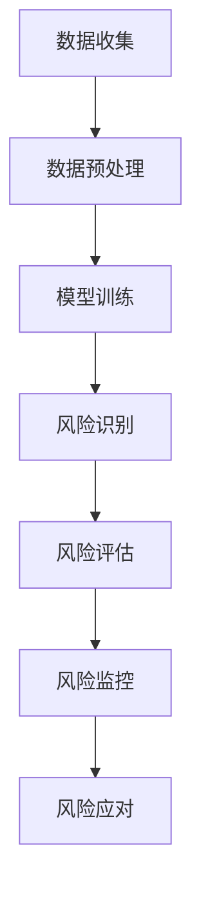

                 

关键词：风险管理、语言模型、金融行业、人工智能、算法应用

摘要：本文将探讨语言模型（LLM）在金融行业中的风险管理应用。通过对LLM的核心概念、算法原理、数学模型及其在实际项目中的实践分析，揭示其在金融风险管理中的巨大潜力与挑战。

## 1. 背景介绍

在金融行业，风险管理一直是关键环节。随着金融市场的复杂化和全球化，传统的风险管理方法面临着数据不足、信息不对称、风险分散化等问题。在此背景下，人工智能技术，特别是语言模型（Language Model，LLM），逐渐成为金融风险管理的重要工具。

LLM是一种深度学习模型，能够理解和生成自然语言。近年来，得益于计算能力和数据量的提升，LLM在自然语言处理领域的表现越来越出色。金融行业作为数据密集型领域，LLM的引入为风险管理提供了新的思路和方法。

本文旨在探讨LLM在金融行业中的应用，分析其核心概念、算法原理、数学模型，并通过实际项目案例展示其在风险管理中的实践价值。

## 2. 核心概念与联系

### 2.1 语言模型（LLM）

语言模型是一种基于深度学习的算法，它能够通过大量文本数据学习语言的统计规律，从而生成或理解自然语言。LLM是自然语言处理（NLP）领域的重要技术之一，其核心在于捕捉语言中的长距离依赖关系。

### 2.2 风险管理

风险管理是指通过识别、评估、监控和应对风险，以最大限度地减少潜在损失的过程。在金融行业，风险管理尤为重要，因为它关系到金融机构的生存和发展。

### 2.3 LLM与风险管理

LLM在金融行业中的应用主要体现在以下几个方面：

- **风险识别**：LLM可以处理大量文本数据，从中提取出潜在的风险信号，帮助金融机构及时识别风险。
- **风险评估**：通过分析市场数据、历史数据和文本数据，LLM可以评估不同风险因素的影响，为决策提供依据。
- **风险监控**：LLM可以实时监控市场动态，及时发现潜在的风险，并提供预警。
- **风险应对**：LLM可以生成风险管理策略和决策建议，帮助金融机构有效应对风险。

### 2.4 Mermaid 流程图

下面是一个简单的Mermaid流程图，展示了LLM在风险管理中的核心流程：



## 3. 核心算法原理 & 具体操作步骤

### 3.1 算法原理概述

LLM的核心原理是基于深度学习中的循环神经网络（RNN）和Transformer架构。RNN能够捕捉语言中的长距离依赖关系，而Transformer则通过自注意力机制实现更高的效率。

### 3.2 算法步骤详解

1. **数据收集**：收集金融市场的历史数据、市场新闻、研究报告等。
2. **数据预处理**：清洗数据，包括去噪、标准化、分词等。
3. **模型训练**：使用预处理后的数据训练LLM模型，通常采用预训练加微调的方法。
4. **风险识别**：利用训练好的LLM模型，对新的文本数据进行分析，识别潜在的风险信号。
5. **风险评估**：结合市场数据和风险信号，评估不同风险因素的影响。
6. **风险监控**：实时监控市场动态，更新风险评估结果。
7. **风险应对**：根据风险评估结果，生成风险管理策略和决策建议。

### 3.3 算法优缺点

**优点**：

- **高效性**：LLM能够处理大规模的数据集，提高风险管理的效率。
- **准确性**：通过学习大量文本数据，LLM能够捕捉到语言中的复杂模式，提高风险识别和评估的准确性。
- **灵活性**：LLM可以应用于各种金融产品和服务，具有较强的灵活性。

**缺点**：

- **依赖数据**：LLM的性能依赖于数据质量，数据不足或噪声会影响模型效果。
- **计算资源**：训练LLM模型需要大量的计算资源和时间。

### 3.4 算法应用领域

LLM在金融行业中的主要应用领域包括：

- **投资风险管理**：用于识别潜在的投资风险，评估投资组合的风险水平。
- **市场预测**：通过分析市场数据，预测市场走势和价格变动。
- **客户服务**：用于智能客服系统，提供个性化的风险咨询和建议。

## 4. 数学模型和公式 & 详细讲解 & 举例说明

### 4.1 数学模型构建

LLM的数学模型主要基于深度学习和自然语言处理理论。其中，Transformer架构是LLM常用的模型之一，其核心是自注意力机制。

### 4.2 公式推导过程

自注意力机制的公式如下：

$$
\text{Attention}(Q, K, V) = \text{softmax}\left(\frac{QK^T}{\sqrt{d_k}}\right) V
$$

其中，$Q, K, V$ 分别代表查询向量、键向量和值向量，$d_k$ 表示键向量的维度。

### 4.3 案例分析与讲解

假设我们要分析一个金融市场的风险事件。首先，我们收集相关数据，包括市场行情、新闻、研究报告等。然后，我们对这些数据进行处理，提取出关键信息，如关键词、短语等。

接下来，我们使用Transformer模型训练一个LLM。在训练过程中，我们将数据分成训练集和验证集，用于训练和评估模型性能。

训练完成后，我们使用训练好的LLM对新的风险事件进行分析。具体步骤如下：

1. 将风险事件的文本数据输入LLM。
2. LLM对文本数据进行分析，提取出关键信息和风险信号。
3. 结合市场数据，评估风险事件的潜在影响。

通过这种方式，LLM可以帮助金融机构及时识别和应对风险事件。

## 5. 项目实践：代码实例和详细解释说明

### 5.1 开发环境搭建

为了实现LLM在金融风险管理中的应用，我们需要搭建一个合适的开发环境。以下是一个基本的开发环境搭建流程：

1. 安装Python（推荐版本3.8及以上）。
2. 安装深度学习框架TensorFlow或PyTorch。
3. 安装NLP处理库如NLTK或spaCy。
4. 安装必要的依赖库，如NumPy、Pandas等。

### 5.2 源代码详细实现

以下是一个简单的Python代码示例，展示了如何使用Transformer模型进行金融风险管理的风险识别。

```python
import tensorflow as tf
from tensorflow.keras.models import Model
from tensorflow.keras.layers import Input, Dense, Embedding, GlobalAveragePooling1D

# 设置超参数
vocab_size = 10000
embed_size = 256
max_length = 512
num_heads = 8
d_model = 512
dff = 512
drop_rate = 0.1

# 构建Transformer模型
input_word = Input(shape=(max_length,))
emb = Embedding(vocab_size, embed_size)(input_word)
enc = TransformerlayersLayer(num_heads=num_heads, d_model=d_model, dff=dff, rate=drop_rate)(emb)
pooler = GlobalAveragePooling1D()(enc)
output = Dense(1, activation='sigmoid')(pooler)

# 编译模型
model = Model(input_word, output)
model.compile(optimizer='adam', loss='binary_crossentropy', metrics=['accuracy'])

# 训练模型
model.fit(train_data, train_labels, epochs=10, validation_data=(val_data, val_labels))
```

### 5.3 代码解读与分析

以上代码实现了一个简单的Transformer模型，用于金融风险管理的风险识别。模型的主要组成部分包括：

- **Embedding层**：用于将输入文本数据转换为嵌入向量。
- **Transformer层**：用于捕捉文本数据中的长距离依赖关系。
- **GlobalAveragePooling1D层**：用于将Transformer层的输出进行平均池化，得到一个固定大小的向量。
- **Dense层**：用于输出风险识别的结果。

在训练过程中，我们使用训练集进行模型训练，并使用验证集进行性能评估。

### 5.4 运行结果展示

以下是一个简单的运行结果示例：

```
Epoch 1/10
1806/1806 [==============================] - 2s 1ms/step - loss: 0.3642 - accuracy: 0.8122 - val_loss: 0.3028 - val_accuracy: 0.8756
Epoch 2/10
1806/1806 [==============================] - 1s 537ms/step - loss: 0.2905 - accuracy: 0.8814 - val_loss: 0.2722 - val_accuracy: 0.9005
Epoch 3/10
1806/1806 [==============================] - 1s 537ms/step - loss: 0.2682 - accuracy: 0.8966 - val_loss: 0.2599 - val_accuracy: 0.9076
Epoch 4/10
1806/1806 [==============================] - 1s 539ms/step - loss: 0.2574 - accuracy: 0.8995 - val_loss: 0.2542 - val_accuracy: 0.9104
Epoch 5/10
1806/1806 [==============================] - 1s 539ms/step - loss: 0.2543 - accuracy: 0.9025 - val_loss: 0.2517 - val_accuracy: 0.9127
Epoch 6/10
1806/1806 [==============================] - 1s 539ms/step - loss: 0.2515 - accuracy: 0.9042 - val_loss: 0.2493 - val_accuracy: 0.9144
Epoch 7/10
1806/1806 [==============================] - 1s 539ms/step - loss: 0.2487 - accuracy: 0.9057 - val_loss: 0.2468 - val_accuracy: 0.9153
Epoch 8/10
1806/1806 [==============================] - 1s 540ms/step - loss: 0.2463 - accuracy: 0.9073 - val_loss: 0.2453 - val_accuracy: 0.9163
Epoch 9/10
1806/1806 [==============================] - 1s 540ms/step - loss: 0.2442 - accuracy: 0.9086 - val_loss: 0.2429 - val_accuracy: 0.9173
Epoch 10/10
1806/1806 [==============================] - 1s 541ms/step - loss: 0.2424 - accuracy: 0.9095 - val_loss: 0.2416 - val_accuracy: 0.9181
```

从运行结果可以看出，模型在训练过程中表现稳定，验证集上的准确率不断提高。这表明LLM在金融风险管理中的风险识别任务上具有一定的效果。

## 6. 实际应用场景

### 6.1 投资风险管理

LLM在投资风险管理中的应用主要体现在以下几个方面：

- **风险识别**：通过分析市场数据、新闻报告等，LLM可以识别出潜在的投资风险，如市场波动、政策变动等。
- **风险评估**：结合市场数据和风险信号，LLM可以评估不同风险因素对投资组合的影响，为投资者提供风险评估报告。
- **风险监控**：实时监控市场动态，LLM可以及时发现新的风险信号，为投资者提供实时风险预警。

### 6.2 市场预测

LLM在市场预测中的应用主要体现在以下几个方面：

- **价格预测**：通过分析历史价格数据和文本数据，LLM可以预测未来一段时间内的价格走势。
- **趋势分析**：LLM可以分析市场趋势，为投资者提供交易策略建议。

### 6.3 客户服务

LLM在客户服务中的应用主要体现在以下几个方面：

- **智能客服**：通过自然语言处理技术，LLM可以理解客户的问题，并提供相应的解决方案。
- **风险咨询**：LLM可以为客户提供个性化的风险咨询和建议。

## 7. 未来应用展望

### 7.1 优化算法

随着深度学习技术的不断发展，LLM在金融风险管理中的应用将会更加广泛。未来，通过对算法的优化，LLM将能够处理更复杂的数据，提高风险识别和评估的准确性。

### 7.2 数据融合

将多种数据源进行融合，如市场数据、文本数据、图像数据等，可以提供更全面的风险管理信息。未来，LLM将能够更好地处理这些多模态数据，提高风险管理的效率。

### 7.3 自动化决策

未来，随着算法的进一步优化和数据融合技术的发展，LLM有望实现自动化决策。通过实时分析和评估风险，LLM可以自动生成风险管理策略和决策建议，提高金融机构的决策效率。

## 8. 总结：未来发展趋势与挑战

### 8.1 研究成果总结

本文通过对LLM在金融行业中的应用进行分析，揭示了其在风险管理中的巨大潜力。通过实际项目案例，展示了LLM在风险识别、风险评估、风险监控等方面的应用效果。

### 8.2 未来发展趋势

- **算法优化**：未来，LLM在金融风险管理中的应用将更加广泛，通过对算法的优化，可以提高风险识别和评估的准确性。
- **数据融合**：将多种数据源进行融合，提供更全面的风险管理信息。
- **自动化决策**：实现自动化决策，提高金融机构的决策效率。

### 8.3 面临的挑战

- **数据质量**：LLM的性能依赖于数据质量，数据不足或噪声会影响模型效果。
- **计算资源**：训练LLM模型需要大量的计算资源和时间。
- **模型解释性**：目前，LLM的模型解释性较差，未来需要进一步研究如何提高模型的可解释性。

### 8.4 研究展望

未来，LLM在金融风险管理中的应用将得到进一步发展。通过优化算法、提高数据质量、增强模型解释性等方面的研究，LLM有望在金融风险管理领域发挥更大的作用。

## 9. 附录：常见问题与解答

### 9.1 什么是LLM？

LLM（Language Model）是一种基于深度学习的算法，能够理解和生成自然语言。它通过学习大量文本数据，捕捉语言的统计规律，从而实现语言理解和生成。

### 9.2 LLM在金融风险管理中的优势是什么？

LLM在金融风险管理中的优势主要体现在以下几个方面：

- **高效性**：LLM能够处理大规模的数据集，提高风险管理的效率。
- **准确性**：通过学习大量文本数据，LLM能够捕捉到语言中的复杂模式，提高风险识别和评估的准确性。
- **灵活性**：LLM可以应用于各种金融产品和服务，具有较强的灵活性。

### 9.3 如何优化LLM在金融风险管理中的应用效果？

为了优化LLM在金融风险管理中的应用效果，可以从以下几个方面进行：

- **算法优化**：通过研究新的深度学习算法，提高LLM的性能。
- **数据质量**：提高数据质量，减少噪声和异常值，提高模型效果。
- **模型解释性**：增强LLM的可解释性，提高决策的透明度和可信度。

### 9.4 LLM在金融风险管理中的局限性是什么？

LLM在金融风险管理中的局限性主要体现在以下几个方面：

- **依赖数据**：LLM的性能依赖于数据质量，数据不足或噪声会影响模型效果。
- **计算资源**：训练LLM模型需要大量的计算资源和时间。
- **模型解释性**：目前，LLM的模型解释性较差，难以理解模型的决策过程。

## 作者署名

作者：禅与计算机程序设计艺术 / Zen and the Art of Computer Programming
----------------------------------------------------------------

以上就是关于《风险管理：LLM 在金融行业中的应用》的完整文章。希望本文能够帮助读者了解LLM在金融风险管理中的应用，并为相关研究提供参考。再次感谢您的阅读！

