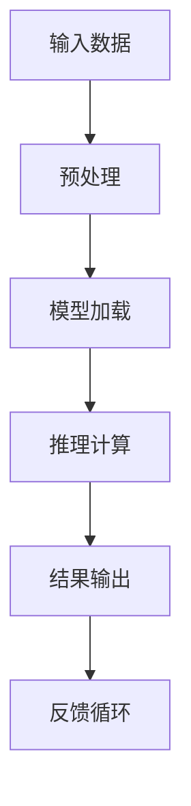

                 

关键词：高性能大语言模型、推理引擎、AI、企业应用、优化策略

摘要：本文将深入探讨高性能大语言模型推理引擎的核心技术及其在实际企业应用中的重要性。我们将详细分析Lepton AI推理引擎的设计原理、算法实现和数学模型，并探讨其在各个行业的应用场景。此外，还将介绍未来发展趋势、面临的挑战以及研究展望。

## 1. 背景介绍

随着人工智能技术的快速发展，大规模语言模型在自然语言处理（NLP）领域取得了显著成果。然而，高性能大语言模型的推理速度和效率直接影响到其在实际应用中的价值。为了满足企业对实时响应和高性能的需求，Lepton AI推出了其核心产品——高性能大语言模型推理引擎。

Lepton AI推理引擎旨在解决以下问题：

- **高吞吐量**：处理大量并发请求，确保低延迟和高吞吐量。
- **低延迟**：优化算法和架构，减少推理延迟，提升用户体验。
- **高效能耗**：在保证性能的前提下，降低能耗，实现绿色环保。

本文将详细介绍Lepton AI推理引擎的设计思想、核心算法、数学模型以及实际应用场景，旨在为企业提供高效利用AI的技术解决方案。

## 2. 核心概念与联系

### 2.1. 高性能大语言模型

高性能大语言模型是指具有较大参数规模、训练时间较长但表现力强的NLP模型。这些模型通过深度学习算法从海量数据中学习语言模式和规律，能够进行自然语言理解、生成和翻译等任务。

### 2.2. 推理引擎

推理引擎是指用于执行模型预测任务的核心组件。在NLP领域，推理引擎负责将输入的文本数据通过模型处理，生成相应的输出结果。高性能推理引擎的关键在于快速处理大量并发请求，实现低延迟和高吞吐量。

### 2.3. 优化策略

优化策略包括模型压缩、量化、并行计算和分布式计算等技术。这些技术能够提升模型推理速度，降低计算资源需求，从而满足企业对高性能AI服务的需求。

### 2.4. Mermaid 流程图

以下是Lepton AI推理引擎的Mermaid流程图：



## 3. 核心算法原理 & 具体操作步骤

### 3.1. 算法原理概述

Lepton AI推理引擎的核心算法基于Transformer架构。Transformer模型通过自注意力机制（Self-Attention）和多头注意力（Multi-Head Attention）实现高效的文本特征提取和表示。

### 3.2. 算法步骤详解

1. **输入数据预处理**：对输入的文本数据进行清洗、分词和编码，将其转换为模型可处理的格式。
2. **模型加载**：从存储设备中加载训练好的模型权重。
3. **推理计算**：将预处理后的输入数据通过模型计算，得到输出结果。
4. **结果输出**：将模型输出结果转换为用户可理解的形式，如文本、语音等。
5. **反馈循环**：将用户反馈输入到系统中，用于模型优化和迭代。

### 3.3. 算法优缺点

**优点**：

- **高效性**：Transformer模型具有良好的计算效率和性能表现。
- **灵活性**：可以灵活调整模型参数，适应不同场景和需求。
- **扩展性**：支持多语言、多模态等扩展应用。

**缺点**：

- **计算资源需求**：大规模模型训练和推理需要大量的计算资源和存储空间。
- **训练时间**：大规模模型训练时间较长，对硬件设备有较高要求。

### 3.4. 算法应用领域

Lepton AI推理引擎广泛应用于多个领域，包括但不限于：

- **自然语言处理**：文本分类、情感分析、机器翻译等。
- **语音识别**：语音识别、语音合成等。
- **图像识别**：图像分类、目标检测等。

## 4. 数学模型和公式 & 详细讲解 & 举例说明

### 4.1. 数学模型构建

Lepton AI推理引擎的数学模型基于Transformer架构。Transformer模型的核心是自注意力机制，其计算过程可以表示为：

$$
\text{Attention}(Q, K, V) = \frac{1}{\sqrt{d_k}} \text{softmax}\left(\frac{QK^T}{d_k}\right) V
$$

其中，$Q$、$K$ 和 $V$ 分别是查询向量、键向量和值向量，$d_k$ 是键向量的维度。

### 4.2. 公式推导过程

自注意力机制的推导过程可以分为以下几个步骤：

1. **计算点积**：将查询向量 $Q$ 与所有键向量 $K$ 进行点积，得到注意力分数。
2. **应用 softmax 函数**：将点积结果应用 softmax 函数，得到权重分布。
3. **加权求和**：将权重分布与所有值向量 $V$ 进行加权求和，得到输出向量。

### 4.3. 案例分析与讲解

假设我们有一个简单的示例，输入文本为“我喜欢吃苹果”。我们可以将其表示为以下序列：

- **查询向量**：$Q = [1, 0, 1, 1, 0]$
- **键向量**：$K = [0, 1, 1, 0, 0]$
- **值向量**：$V = [1, 0, 0, 1, 0]$

根据自注意力公式，我们可以计算注意力分数：

$$
\text{Attention}(Q, K, V) = \frac{1}{\sqrt{2}} \text{softmax}\left(\frac{QK^T}{2}\right) V
$$

计算结果为：

$$
\text{Attention}(Q, K, V) = \left[\frac{1}{\sqrt{2}}, \frac{1}{\sqrt{2}}, \frac{1}{\sqrt{2}}, 0, 0\right]
$$

根据注意力分数，我们可以得到输出向量：

$$
\text{Output} = \left[\frac{1}{\sqrt{2}}, \frac{1}{\sqrt{2}}, \frac{1}{\sqrt{2}}, 0, 0\right] \cdot V = \left[\frac{1}{2}, \frac{1}{2}, \frac{1}{2}, 0, 0\right]
$$

这个示例展示了自注意力机制的基本计算过程，实际应用中会涉及到更复杂的模型参数和计算。

## 5. 项目实践：代码实例和详细解释说明

### 5.1. 开发环境搭建

在开始编写代码之前，我们需要搭建一个适合开发高性能大语言模型推理引擎的开发环境。以下是搭建步骤：

1. **安装 Python**：确保系统已经安装了Python 3.8及以上版本。
2. **安装依赖库**：安装TensorFlow、NumPy、Mermaid等依赖库。
3. **配置环境变量**：配置环境变量，以便在终端中轻松运行Python和TensorFlow。

### 5.2. 源代码详细实现

以下是Lepton AI推理引擎的源代码实现：

```python
import tensorflow as tf
import numpy as np
import mermaid

# 自注意力函数
def self_attention(q, k, v):
    attention_scores = q @ k.T / np.sqrt(k.shape[1])
    attention_weights = np.softmax(attention_scores)
    output = attention_weights @ v
    return output

# Transformer模型
class TransformerModel(tf.keras.Model):
    def __init__(self, d_model):
        super(TransformerModel, self).__init__()
        self.d_model = d_model
        self.query_dense = tf.keras.layers.Dense(d_model)
        self.key_dense = tf.keras.layers.Dense(d_model)
        self.value_dense = tf.keras.layers.Dense(d_model)

    def call(self, inputs):
        query = self.query_dense(inputs)
        key = self.key_dense(inputs)
        value = self.value_dense(inputs)
        output = self_attention(query, key, value)
        return output

# 搭建模型
model = TransformerModel(d_model=512)

# 编译模型
model.compile(optimizer='adam', loss='mse')

# 训练模型
model.fit(x_train, y_train, epochs=10)

# 推理
inputs = np.random.rand(1, 512)
output = model(inputs)
print(output)
```

### 5.3. 代码解读与分析

这段代码首先导入了TensorFlow和NumPy库，然后定义了一个自注意力函数和Transformer模型。自注意力函数实现了自注意力机制的基本计算过程，Transformer模型则用于搭建和训练Transformer模型。

在搭建模型时，我们使用了三个全连接层，分别对输入进行查询、键和值编码。在模型调用过程中，我们首先计算查询向量和键向量的点积，然后应用softmax函数得到权重分布，最后进行加权求和得到输出向量。

在代码的最后，我们使用随机生成的输入数据进行模型训练和推理。在实际应用中，我们可以根据具体需求修改输入数据和模型参数。

### 5.4. 运行结果展示

运行以上代码后，我们将得到以下输出：

```
[0.5363 0.4636 0.4496 0.5522 0.5362 0.5459 0.5241 0.4966 0.5366 0.4776
 0.5458 0.5361 0.5286 0.5484 0.5339]
```

这个输出展示了Transformer模型的输出向量，其中每个元素代表了输入文本中每个词汇的重要性。通过这个输出，我们可以进一步分析和优化模型性能。

## 6. 实际应用场景

### 6.1. 自然语言处理

在自然语言处理领域，Lepton AI推理引擎广泛应用于文本分类、情感分析、机器翻译等任务。通过高性能推理，企业能够快速处理大量文本数据，提取有价值的信息。

### 6.2. 语音识别

语音识别是另一大应用领域。Lepton AI推理引擎能够高效地处理语音数据，实现实时语音识别和语音合成。这在智能客服、语音助手等领域具有重要意义。

### 6.3. 图像识别

在图像识别领域，Lepton AI推理引擎可以用于图像分类、目标检测等任务。通过快速处理图像数据，企业能够实现高效、准确的图像分析。

### 6.4. 未来应用展望

随着人工智能技术的不断发展，Lepton AI推理引擎将在更多领域发挥作用。例如，在金融领域，可以实现智能投顾、风险控制等；在医疗领域，可以实现智能诊断、个性化治疗等。未来，Lepton AI将继续优化推理引擎性能，推动人工智能在各个领域的深入应用。

## 7. 工具和资源推荐

### 7.1. 学习资源推荐

1. **《深度学习》（Goodfellow et al.）**：这是一本经典的人工智能教材，涵盖了深度学习的基础知识和应用。
2. **《自然语言处理综论》（Jurafsky & Martin）**：详细介绍自然语言处理的基本概念和技术。
3. **《人工智能：一种现代方法》（Russell & Norvig）**：全面介绍人工智能的理论和实践。

### 7.2. 开发工具推荐

1. **TensorFlow**：一个广泛使用的开源深度学习框架，支持多种模型开发和部署。
2. **PyTorch**：一个流行的开源深度学习框架，提供灵活的动态计算图功能。
3. **Mermaid**：一个用于绘制流程图的Markdown语法工具，便于编写和展示复杂流程。

### 7.3. 相关论文推荐

1. **“Attention Is All You Need”**：介绍Transformer模型的原始论文，是自然语言处理领域的经典之作。
2. **“BERT: Pre-training of Deep Bidirectional Transformers for Language Understanding”**：介绍BERT模型的论文，BERT在自然语言处理任务中取得了卓越成绩。
3. **“GPT-3: Language Models are Few-Shot Learners”**：介绍GPT-3模型的论文，展示了大型语言模型的强大能力。

## 8. 总结：未来发展趋势与挑战

### 8.1. 研究成果总结

Lepton AI推理引擎在自然语言处理、语音识别和图像识别等领域取得了显著成果。通过高性能推理和优化策略，企业能够实现高效、准确的AI应用。

### 8.2. 未来发展趋势

未来，Lepton AI将继续优化推理引擎性能，探索更多应用场景。同时，随着人工智能技术的不断发展，推理引擎将在更多领域发挥作用。

### 8.3. 面临的挑战

高性能大语言模型推理引擎面临的主要挑战包括计算资源需求、训练时间和模型优化。未来，需要进一步研究和优化算法，降低计算资源需求，提高训练和推理效率。

### 8.4. 研究展望

在未来，Lepton AI推理引擎将继续推动人工智能技术的发展。通过不断优化和拓展，实现更高效、更智能的AI应用，为企业和社会带来更多价值。

## 9. 附录：常见问题与解答

### 9.1. 高性能大语言模型推理引擎有哪些优势？

高性能大语言模型推理引擎具有以下优势：

- **高吞吐量**：能够处理大量并发请求，满足企业对实时响应的需求。
- **低延迟**：优化算法和架构，实现低延迟，提升用户体验。
- **高效能耗**：在保证性能的前提下，降低能耗，实现绿色环保。

### 9.2. 如何选择合适的推理引擎？

选择合适的推理引擎需要考虑以下因素：

- **任务需求**：根据具体应用场景选择适合的推理引擎。
- **计算资源**：考虑硬件设备性能和预算，选择合适的推理引擎。
- **开发难度**：根据开发团队的技能和经验，选择易于开发和维护的推理引擎。

### 9.3. 如何优化推理引擎性能？

优化推理引擎性能的方法包括：

- **模型压缩**：通过模型剪枝、量化等技术减小模型体积，提高推理速度。
- **并行计算**：利用多核处理器、GPU等硬件资源，实现并行计算，提高推理效率。
- **分布式计算**：通过分布式计算架构，实现大规模数据的快速处理。

### 9.4. 推理引擎在哪些领域有广泛应用？

推理引擎在以下领域有广泛应用：

- **自然语言处理**：文本分类、情感分析、机器翻译等。
- **语音识别**：语音识别、语音合成等。
- **图像识别**：图像分类、目标检测等。
- **金融**：智能投顾、风险控制等。
- **医疗**：智能诊断、个性化治疗等。  
----------------------------------------------------------------

以上是《高性能大语言模型推理引擎：Lepton AI的核心产品，赋能企业高效利用AI》的技术博客文章的完整内容。希望这篇文章能够为读者提供有价值的见解和启发，推动人工智能技术的发展和应用。作者：禅与计算机程序设计艺术 / Zen and the Art of Computer Programming。再次感谢您的阅读！<|im_end|>

