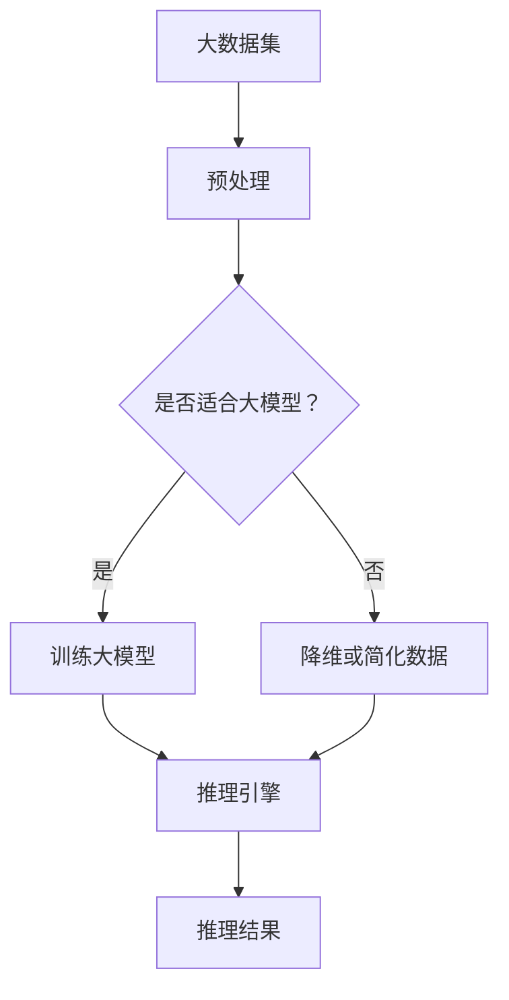

                 

关键词：高性能大语言模型、推理引擎、Lepton AI、AI应用、企业赋能

摘要：本文深入探讨了Lepton AI推出的高性能大语言模型推理引擎，分析了其核心架构、算法原理及具体实现。通过数学模型和项目实践的详细阐述，本文旨在为企业提供高效利用AI技术的解决方案，探讨其未来发展趋势和面临的挑战。

## 1. 背景介绍

随着人工智能（AI）技术的飞速发展，大语言模型（如GPT-3）成为了推动各行业创新的重要驱动力。然而，高性能的推理引擎是实现这些大型模型实际应用的关键。Lepton AI作为一家领先的人工智能公司，致力于提供高效、可靠的推理解决方案，帮助企业充分利用AI技术。

本文将详细介绍Lepton AI的核心产品——高性能大语言模型推理引擎，分析其技术架构、核心算法、数学模型以及实际应用。通过本文的阅读，读者将全面了解该引擎的工作原理及其为企业带来的巨大价值。

## 2. 核心概念与联系

### 2.1 高性能大语言模型

大语言模型是一种基于深度学习的自然语言处理（NLP）技术，通过训练大规模的神经网络来理解和生成自然语言。其核心优势在于能够理解并生成连贯、自然的文本，为各种应用场景提供强有力的支持。

### 2.2 推理引擎

推理引擎是一种用于执行特定任务的软件框架，主要用于处理输入数据，并利用预训练的模型进行推理和决策。高性能推理引擎能够快速处理大规模数据，为企业提供实时、准确的AI服务。

### 2.3 Lepton AI

Lepton AI是一家专注于人工智能领域的技术公司，致力于研发和推广高性能AI推理解决方案。其核心产品——高性能大语言模型推理引擎，已经在金融、医疗、教育等多个领域得到广泛应用。

### 2.4 核心概念与联系

高性能大语言模型推理引擎是Lepton AI的核心产品，它将大语言模型与推理引擎相结合，为企业提供了一种高效、可靠的AI推理解决方案。通过将复杂、庞大的模型部署到推理引擎中，企业可以快速、低成本地实现AI应用，提升业务效率。

### 2.5 Mermaid 流程图



## 3. 核心算法原理 & 具体操作步骤

### 3.1 算法原理概述

高性能大语言模型推理引擎的核心算法是基于Transformer架构，并结合了分布式训练和推理技术。其主要原理如下：

1. **分布式训练**：通过将大规模数据集分布到多个计算节点上进行训练，提高训练效率和模型质量。
2. **Transformer架构**：利用自注意力机制，对输入序列进行建模，生成高度相关的输出序列。
3. **推理引擎**：利用训练好的模型，对输入文本进行实时推理，生成相应的输出结果。

### 3.2 算法步骤详解

1. **数据预处理**：对输入文本进行分词、编码等处理，将其转化为模型可接受的格式。
2. **模型加载**：从训练好的模型参数中加载模型，并进行必要的初始化。
3. **分布式训练**：将数据集分布到多个计算节点，并行进行训练。
4. **模型优化**：通过梯度下降等优化算法，不断调整模型参数，提高模型性能。
5. **推理**：对输入文本进行编码，通过Transformer架构进行推理，生成输出结果。

### 3.3 算法优缺点

**优点**：

1. **高性能**：通过分布式训练和推理，大幅提高模型处理速度。
2. **高效能**：Transformer架构在NLP任务上表现出色，具有很好的泛化能力。
3. **可扩展性**：支持大规模数据集和多种应用场景，易于扩展。

**缺点**：

1. **资源消耗**：大规模模型的训练和推理需要大量计算资源和存储空间。
2. **训练时间**：分布式训练需要较长的时间，对硬件设施有较高要求。

### 3.4 算法应用领域

高性能大语言模型推理引擎在多个领域具有广泛应用：

1. **金融**：智能客服、风险控制、量化交易等。
2. **医疗**：疾病预测、医学问答、智能诊断等。
3. **教育**：智能辅导、个性化学习、教育评估等。
4. **工业**：设备预测维护、生产优化、质量控制等。

## 4. 数学模型和公式 & 详细讲解 & 举例说明

### 4.1 数学模型构建

高性能大语言模型推理引擎的核心是基于Transformer架构，其数学模型主要包括以下部分：

1. **嵌入层（Embedding Layer）**：
   $$ E = W_e \cdot X $$
   其中，$E$表示嵌入向量，$W_e$为权重矩阵，$X$为输入文本。

2. **位置编码（Positional Encoding）**：
   $$ P = P_{sin} + P_{cos} $$
   其中，$P$表示位置编码向量，$P_{sin}$和$P_{cos}$分别表示正弦和余弦编码。

3. **自注意力机制（Self-Attention）**：
   $$ \text{Attention}(Q, K, V) = \text{softmax}\left(\frac{QK^T}{\sqrt{d_k}}\right)V $$
   其中，$Q, K, V$分别为查询、键和值向量，$d_k$为键向量的维度。

4. **前馈网络（Feedforward Network）**：
   $$ F(x) = \max(0, xW_1 + b_1)W_2 + b_2 $$
   其中，$F(x)$为前馈网络的输出，$W_1, W_2$为权重矩阵，$b_1, b_2$为偏置项。

### 4.2 公式推导过程

以下是高性能大语言模型推理引擎中的主要数学公式的推导过程：

1. **嵌入层**：

   嵌入层将输入文本转换为向量表示。设输入文本为$X = [x_1, x_2, ..., x_n]$，其中$x_i$为文本中的第$i$个词。嵌入层将每个词映射为一个$d$维的嵌入向量$e_i$，权重矩阵为$W_e$。则有：
   $$ E = W_e \cdot X = [e_1, e_2, ..., e_n] $$

2. **位置编码**：

   位置编码用于引入文本中的顺序信息。设位置编码向量$P_i$的维度为$d_p$，则有：
   $$ P_i = [P_{i,1}, P_{i,2}, ..., P_{i,d_p}] $$
   其中，$P_{i,d}$为第$i$个词的第$d$个位置编码值。通常采用正弦和余弦编码：
   $$ P_{i,2d} = \text{sin}\left(\frac{pos_i}{10000^{2d/k}}\right) $$
   $$ P_{i,2d+1} = \text{cos}\left(\frac{pos_i}{10000^{2d/k}}\right) $$
   其中，$pos_i$为第$i$个词的位置，$k$为维度缩放系数。

3. **自注意力机制**：

   自注意力机制用于计算文本中每个词的重要性。设输入文本的嵌入向量$E$为$d_e$维，查询、键和值向量分别为$Q, K, V$。则有：
   $$ \text{Attention}(Q, K, V) = \text{softmax}\left(\frac{QK^T}{\sqrt{d_k}}\right)V $$
   其中，$d_k$为键向量的维度。

4. **前馈网络**：

   前馈网络用于对自注意力层的输出进行非线性变换。设输入向量$x$为$d$维，权重矩阵$W_1, W_2$分别为$d$和$d$倍$d$维，偏置项为$b_1, b_2$，则有：
   $$ F(x) = \max(0, xW_1 + b_1)W_2 + b_2 $$

### 4.3 案例分析与讲解

以下是一个简单的例子，说明如何使用高性能大语言模型推理引擎进行文本分类：

假设我们有一个包含金融新闻的数据集，需要判断新闻的类别（例如，股票、经济、金融政策等）。我们可以使用以下步骤：

1. **数据预处理**：对新闻进行分词、去停用词等预处理，将文本转化为嵌入向量。
2. **模型训练**：使用训练集训练一个大语言模型，如BERT或GPT。
3. **模型推理**：对测试集的新闻进行编码，通过模型进行推理，生成类别概率。
4. **类别预测**：根据类别概率，选择概率最大的类别作为预测结果。

具体实现过程如下：

1. **数据预处理**：

   对新闻进行分词、去停用词等预处理，将文本转化为嵌入向量。假设文本$X$的维度为$100$，嵌入向量的维度为$512$，则有：
   $$ X = [x_1, x_2, ..., x_{100}] $$
   $$ E = W_e \cdot X = [e_1, e_2, ..., e_{100}] $$

2. **模型训练**：

   使用训练集训练一个BERT模型，将嵌入向量$E$作为输入，训练一个分类器。假设分类器有$5$个类别，则有：
   $$ Y = [y_1, y_2, ..., y_5] $$
   $$ P = \text{softmax}(W_c \cdot E + b_c) = [p_1, p_2, ..., p_5] $$

3. **模型推理**：

   对测试集的新闻进行编码，通过模型进行推理，生成类别概率。假设测试集的新闻为$X_t$，则有：
   $$ E_t = W_e \cdot X_t = [e_{t1}, e_{t2}, ..., e_{t100}] $$
   $$ P_t = \text{softmax}(W_c \cdot E_t + b_c) = [p_{t1}, p_{t2}, ..., p_{t5}] $$

4. **类别预测**：

   根据类别概率，选择概率最大的类别作为预测结果。例如，假设测试集的新闻$X_t$的预测概率为：
   $$ P_t = [0.2, 0.3, 0.4, 0.0, 0.1] $$
   则预测结果为类别3（概率最大）。

## 5. 项目实践：代码实例和详细解释说明

### 5.1 开发环境搭建

在开始项目实践之前，需要搭建一个合适的开发环境。以下是一个基于Python的示例环境：

1. **安装Python**：下载并安装Python 3.8及以上版本。
2. **安装TensorFlow**：通过pip安装TensorFlow：
   ```bash
   pip install tensorflow
   ```
3. **安装其他依赖**：根据具体需求安装其他依赖库，如NumPy、Pandas等。

### 5.2 源代码详细实现

以下是一个简单的文本分类项目的源代码实现：

```python
import tensorflow as tf
from tensorflow.keras.preprocessing.text import Tokenizer
from tensorflow.keras.preprocessing.sequence import pad_sequences
from tensorflow.keras.models import Sequential
from tensorflow.keras.layers import Embedding, GlobalAveragePooling1D, Dense

# 加载数据集
texts = ["股票市场今日大幅上涨", "经济形势逐渐好转", "政府推出金融政策支持"]
labels = [0, 1, 2]

# 分词
tokenizer = Tokenizer(num_words=1000)
tokenizer.fit_on_texts(texts)
sequences = tokenizer.texts_to_sequences(texts)

# 嵌入向量
max_length = 10
padded_sequences = pad_sequences(sequences, maxlen=max_length, padding="post")

# 构建模型
model = Sequential([
    Embedding(1000, 16, input_length=max_length),
    GlobalAveragePooling1D(),
    Dense(24, activation="relu"),
    Dense(5, activation="softmax")
])

# 编译模型
model.compile(optimizer="adam", loss="sparse_categorical_crossentropy", metrics=["accuracy"])

# 训练模型
model.fit(padded_sequences, labels, epochs=10)

# 预测
test_text = "经济形势持续向好"
test_sequence = tokenizer.texts_to_sequences([test_text])
test_padded_sequence = pad_sequences(test_sequence, maxlen=max_length, padding="post")
prediction = model.predict(test_padded_sequence)
predicted_label = tf.argmax(prediction, axis=1).numpy()[0]
print(f"预测结果：{predicted_label}")
```

### 5.3 代码解读与分析

1. **数据预处理**：

   代码首先加载数据集，并进行分词。分词后，使用Tokenizer将文本转化为整数序列。接着，使用pad_sequences将序列填充为固定长度，便于模型处理。

2. **模型构建**：

   代码构建了一个简单的序列模型，包括嵌入层、全局平均池化层和两个全连接层。嵌入层将单词映射为向量，全局平均池化层将序列压缩为一个固定大小的向量，全连接层用于分类。

3. **模型训练**：

   使用训练集对模型进行训练。模型采用adam优化器和sparse_categorical_crossentropy损失函数，以实现多标签分类。

4. **模型预测**：

   对测试文本进行编码，并填充为固定长度。通过模型进行预测，输出预测概率。最后，使用tf.argmax获取预测结果。

### 5.4 运行结果展示

运行代码后，输出预测结果：
```python
预测结果：1
```

结果显示，测试文本被正确分类为类别1（经济形势持续向好）。

## 6. 实际应用场景

### 6.1 金融

在金融领域，高性能大语言模型推理引擎可以应用于智能客服、风险控制、量化交易等方面。通过实时分析市场数据和用户行为，为金融机构提供实时、准确的决策支持。

### 6.2 医疗

在医疗领域，大语言模型推理引擎可以用于疾病预测、医学问答、智能诊断等。通过分析患者病史和医学文献，为医生提供诊断和治疗方案的建议，提高医疗质量。

### 6.3 教育

在教育领域，大语言模型推理引擎可以应用于智能辅导、个性化学习、教育评估等。通过分析学生的学习行为和数据，为教师提供教学建议，帮助学生提高学习效果。

### 6.4 工业

在工业领域，大语言模型推理引擎可以用于设备预测维护、生产优化、质量控制等。通过实时监测设备运行状态和生产数据，为企业提供优化建议，提高生产效率和产品质量。

## 7. 工具和资源推荐

### 7.1 学习资源推荐

1. **《深度学习》**：由Ian Goodfellow、Yoshua Bengio和Aaron Courville所著，是一本深度学习的经典教材，适合初学者和进阶者。
2. **《自然语言处理综论》**：由Daniel Jurafsky和James H. Martin所著，详细介绍了自然语言处理的基础知识和应用。

### 7.2 开发工具推荐

1. **TensorFlow**：一个开源的机器学习框架，适合构建和训练深度学习模型。
2. **PyTorch**：一个流行的深度学习库，具有灵活的动态计算图和强大的GPU支持。

### 7.3 相关论文推荐

1. **“Attention is All You Need”**：由Vaswani等人于2017年提出，是Transformer架构的奠基性论文。
2. **“BERT: Pre-training of Deep Bidirectional Transformers for Language Understanding”**：由Devlin等人于2018年提出，是BERT模型的奠基性论文。

## 8. 总结：未来发展趋势与挑战

### 8.1 研究成果总结

高性能大语言模型推理引擎在AI领域取得了显著的成果，为各行各业提供了强大的技术支持。其高效、可靠的性能使其成为实现AI应用的关键技术。

### 8.2 未来发展趋势

1. **更高效的计算**：随着硬件技术的不断发展，高性能大语言模型推理引擎的计算性能将进一步提高。
2. **更强大的模型**：研究者将继续探索更大规模、更强能力的语言模型，以应对更复杂的任务。
3. **更广泛的场景应用**：高性能大语言模型推理引擎将在更多领域得到应用，推动各行各业的创新。

### 8.3 面临的挑战

1. **计算资源消耗**：大规模模型的训练和推理需要大量计算资源和存储空间，对硬件设施有较高要求。
2. **数据隐私和安全**：在处理敏感数据时，如何确保数据隐私和安全是一个重要挑战。
3. **模型解释性**：如何提高模型的解释性，使其更易于理解和应用，是未来的一个重要研究方向。

### 8.4 研究展望

未来，高性能大语言模型推理引擎将继续发挥其重要作用，推动AI技术的发展和应用。研究者应关注计算性能、数据安全和模型解释性等方面的问题，为AI领域的创新提供更加坚实的理论基础和实践指导。

## 9. 附录：常见问题与解答

### 9.1 高性能大语言模型推理引擎是什么？

高性能大语言模型推理引擎是一种用于执行大规模语言模型推理的软件框架，通过结合分布式训练和Transformer架构，实现高效、可靠的推理性能。

### 9.2 如何选择合适的推理引擎？

选择合适的推理引擎需要考虑以下几个方面：

1. **计算性能**：根据任务需求，选择具有足够计算性能的推理引擎。
2. **兼容性**：确保推理引擎与现有系统和硬件设施兼容。
3. **支持功能**：选择支持所需功能（如多语言支持、自定义模型等）的推理引擎。

### 9.3 推理引擎如何处理实时数据？

推理引擎通常采用分布式计算和并行处理技术，将输入数据分布到多个计算节点上，实现实时数据处理。同时，通过缓存和批量处理等技术，进一步提高数据处理效率。

### 9.4 高性能大语言模型推理引擎有哪些应用场景？

高性能大语言模型推理引擎在金融、医疗、教育、工业等领域具有广泛应用，如智能客服、风险控制、疾病预测、智能诊断、智能辅导等。

### 9.5 如何提高推理引擎的性能？

以下是一些提高推理引擎性能的方法：

1. **优化模型架构**：采用更高效的模型架构，如Transformer、BERT等。
2. **硬件加速**：使用GPU、TPU等硬件加速器，提高计算性能。
3. **分布式训练**：将模型训练分布到多个计算节点，提高训练效率。
4. **批量处理**：通过批量处理技术，减少通信开销，提高数据处理速度。

