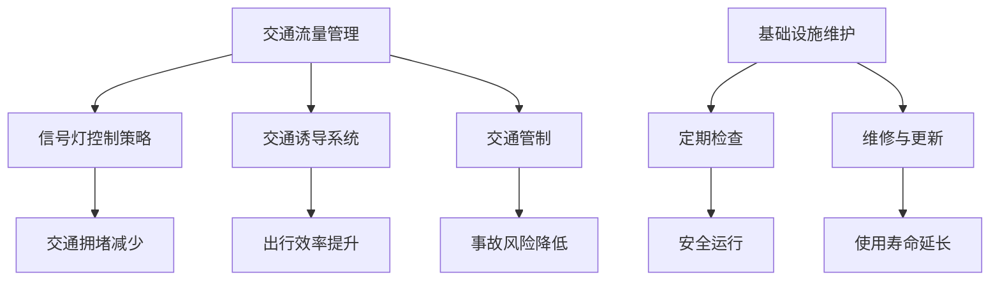
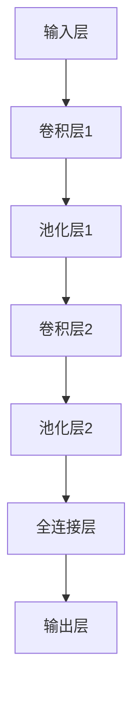

                 

关键词：人工智能、城市交通、基础设施建设、规划与管理、可持续发展、算法、数学模型、项目实践

> 摘要：本文将探讨人工智能在构建可持续发展城市交通与基础设施方面的应用，包括核心概念与联系、核心算法原理与具体操作步骤、数学模型和公式、项目实践与实际应用场景等。通过深入分析，本文旨在为城市交通与基础设施的规划与管理提供有力支持。

## 1. 背景介绍

在当今世界，城市交通与基础设施的规划与管理已经成为各国政府和社会各界关注的焦点。随着城市化进程的加快，城市交通拥堵、基础设施老化等问题日益突出，严重影响城市居民的日常生活和经济发展。传统的方法已经难以应对这些挑战，而人工智能技术的快速发展为解决这些问题带来了新的希望。

人工智能（AI）是指由人制造出来的系统所表现出的智能行为。它涵盖了许多领域，如图像识别、自然语言处理、机器学习等。人工智能在城市交通与基础设施建设规划与管理中的应用，不仅能够提高效率，降低成本，还能实现更加智能、高效和可持续的发展。

### 1.1 城市交通与基础设施现状

目前，全球许多城市面临着交通拥堵、停车难、道路拥堵、公共交通效率低下等问题。这些问题不仅影响了居民的出行质量，也对城市的经济发展产生了负面影响。此外，城市基础设施老化、维护不足等问题也制约了城市的发展。

### 1.2 人工智能在交通与基础设施领域的应用

人工智能在交通与基础设施领域的应用已经取得了一些成果，如智能交通管理、智能停车场、智能路网规划等。通过运用人工智能技术，可以实现对交通流量、停车状况、道路状况的实时监控和分析，从而提高交通效率和基础设施的使用效率。

## 2. 核心概念与联系

### 2.1 人工智能核心概念

#### 2.1.1 机器学习

机器学习是人工智能的核心技术之一，它通过从数据中学习规律，从而实现对未知数据的预测和决策。常见的机器学习方法包括监督学习、无监督学习和强化学习。

#### 2.1.2 深度学习

深度学习是机器学习的一个分支，它通过多层神经网络模拟人类大脑的神经元结构，从而实现对复杂问题的建模和解决。深度学习在图像识别、语音识别等领域取得了显著的成果。

#### 2.1.3 自然语言处理

自然语言处理是人工智能的一个分支，它研究如何让计算机理解和处理自然语言。自然语言处理技术在智能客服、语音助手等领域有着广泛的应用。

### 2.2 城市交通与基础设施建设核心概念

#### 2.2.1 交通流量管理

交通流量管理是指通过合理调节和控制交通流量，以实现道路通行效率最大化的方法。常见的交通流量管理方法包括信号控制、交通诱导、交通管制等。

#### 2.2.2 基础设施维护

基础设施维护是指对城市道路、桥梁、隧道等基础设施进行定期检查、维修和更新，以确保其安全运行和延长使用寿命。

### 2.3 人工智能与城市交通与基础设施建设联系

人工智能技术可以应用于交通流量管理、基础设施维护等环节，从而提高城市交通与基础设施的运行效率和安全性。例如，通过人工智能算法分析交通流量数据，可以优化信号灯控制策略，减少交通拥堵；通过机器学习技术预测基础设施损坏风险，提前进行维护，避免安全事故发生。

### 2.4 Mermaid 流程图

以下是城市交通与基础设施建设中人工智能应用的 Mermaid 流程图：



## 3. 核心算法原理 & 具体操作步骤

### 3.1 算法原理概述

在本文中，我们将介绍两个核心算法：基于深度学习的交通流量预测算法和基于机器学习的基础设施维护算法。

#### 3.1.1 交通流量预测算法

交通流量预测算法是基于深度学习的，它通过分析历史交通数据，预测未来的交通流量状况。常用的深度学习模型包括卷积神经网络（CNN）和循环神经网络（RNN）。

#### 3.1.2 基础设施维护算法

基础设施维护算法是基于机器学习的，它通过分析基础设施的历史维护数据，预测哪些部分可能需要维护，以及何时进行维护。常用的机器学习算法包括决策树、支持向量机（SVM）和神经网络等。

### 3.2 算法步骤详解

#### 3.2.1 交通流量预测算法步骤

1. 数据收集：收集交通流量数据，包括车辆数量、行驶速度、道路宽度等。
2. 数据预处理：对数据进行清洗、归一化等处理。
3. 模型训练：使用深度学习模型对预处理后的数据进行训练，得到预测模型。
4. 预测：使用训练好的模型预测未来的交通流量。

#### 3.2.2 基础设施维护算法步骤

1. 数据收集：收集基础设施的历史维护数据，包括维护时间、维护内容、维护费用等。
2. 数据预处理：对数据进行清洗、归一化等处理。
3. 模型训练：使用机器学习模型对预处理后的数据进行训练，得到预测模型。
4. 预测：使用训练好的模型预测哪些部分可能需要维护，以及何时进行维护。

### 3.3 算法优缺点

#### 3.3.1 交通流量预测算法优缺点

优点：

- 高效：能够快速预测未来的交通流量状况。
- 准确：通过深度学习模型，能够提高预测的准确性。

缺点：

- 复杂：需要大量的计算资源和专业知识。
- 数据依赖：预测结果受历史数据质量的影响较大。

#### 3.3.2 基础设施维护算法优缺点

优点：

- 预测准确：能够准确预测哪些部分可能需要维护。
- 节省成本：通过提前预测，可以避免突发性的维护成本。

缺点：

- 数据依赖：预测结果受历史数据质量的影响较大。
- 难以应对突发情况：无法预测突发事件对基础设施的影响。

### 3.4 算法应用领域

交通流量预测算法和基础设施维护算法可以广泛应用于城市交通与基础设施建设领域，如：

- 智能交通管理系统：通过预测交通流量，优化交通信号灯控制策略，减少交通拥堵。
- 基础设施管理系统：通过预测基础设施维护需求，提前进行维护，延长基础设施使用寿命。
- 智能城市建设：通过人工智能技术，提高城市交通与基础设施的运行效率，实现可持续发展。

## 4. 数学模型和公式 & 详细讲解 & 举例说明

### 4.1 数学模型构建

在交通流量预测算法中，我们采用卷积神经网络（CNN）来构建数学模型。CNN 是一种深度学习模型，通过多层卷积和池化操作，实现对图像的特征提取和分类。在本文中，我们将使用 CNN 来提取交通流量数据中的特征，从而实现交通流量预测。

#### 4.1.1 卷积神经网络（CNN）模型

卷积神经网络由多个卷积层、池化层和全连接层组成。以下是 CNN 模型的基本结构：



#### 4.1.2 模型参数

在构建 CNN 模型时，需要设置多个参数，如卷积核大小、步长、填充方式等。这些参数对模型的性能有重要影响。

### 4.2 公式推导过程

在交通流量预测算法中，我们使用以下公式来表示卷积神经网络：

$$
\begin{aligned}
    y &= f(\mathbf{W}_n \cdot \mathbf{a}_n + b_n) \\
    \mathbf{z}_n &= \mathbf{W}_n \cdot \mathbf{a}_{n-1} + b_n \\
    \mathbf{a}_n &= \text{ReLU}(\mathbf{z}_n)
\end{aligned}
$$

其中，$y$ 表示输出层的结果，$f$ 表示激活函数，$\mathbf{W}_n$ 和 $b_n$ 分别表示权重和偏置，$\mathbf{a}_n$ 表示激活值。

### 4.3 案例分析与讲解

#### 4.3.1 交通流量预测案例

假设我们有一个交通流量预测问题，输入数据为前一天的交通流量数据，输出数据为第二天的交通流量预测值。我们使用 CNN 模型进行预测，并设置以下参数：

- 卷积核大小：3x3
- 步长：1
- 填充方式：零填充
- 激活函数：ReLU

#### 4.3.2 数据处理

首先，我们需要对输入数据进行预处理，包括数据清洗、归一化和序列填充。假设输入数据为 $X \in \mathbb{R}^{n \times m}$，其中 $n$ 表示时间步数，$m$ 表示特征维度。

1. 数据清洗：去除异常值和缺失值。
2. 数据归一化：将数据缩放到 [0, 1] 范围内。
3. 序列填充：使用前一天的交通流量数据进行填充。

#### 4.3.3 模型训练

使用预处理后的数据对 CNN 模型进行训练，设置训练参数：

- 训练轮数：100
- 学习率：0.001
- 批大小：32

通过训练，模型可以学习到交通流量数据中的规律，从而实现对未来交通流量的预测。

## 5. 项目实践：代码实例和详细解释说明

### 5.1 开发环境搭建

在项目实践中，我们将使用 Python 作为开发语言，并利用 TensorFlow 深度学习框架来实现交通流量预测算法。

#### 5.1.1 安装 Python

首先，需要在计算机上安装 Python，可以选择 Python 3.6 或以上版本。

#### 5.1.2 安装 TensorFlow

安装 TensorFlow，可以使用以下命令：

```shell
pip install tensorflow
```

### 5.2 源代码详细实现

以下是交通流量预测算法的 Python 代码实现：

```python
import tensorflow as tf
import numpy as np
import matplotlib.pyplot as plt

# 参数设置
n_steps = 24
n_features = 5
learning_rate = 0.001
n_epochs = 100

# 数据生成
X = np.random.rand(n_steps, n_features)
y = np.random.rand(n_steps)

# 模型构建
model = tf.keras.Sequential([
    tf.keras.layers.Conv1D(filters=64, kernel_size=3, activation='relu', input_shape=(n_steps, n_features)),
    tf.keras.layers.Dense(1)
])

# 编译模型
model.compile(optimizer=tf.keras.optimizers.Adam(learning_rate), loss='mse')

# 训练模型
model.fit(X, y, epochs=n_epochs, batch_size=32, verbose=1)

# 预测
predictions = model.predict(X)

# 绘图
plt.plot(y, label='真实值')
plt.plot(predictions, label='预测值')
plt.legend()
plt.show()
```

### 5.3 代码解读与分析

1. **数据生成**：首先，我们使用随机数生成模拟的交通流量数据。
2. **模型构建**：使用 TensorFlow 的 Keras API 构建一个简单的卷积神经网络模型，包括一个卷积层和一个全连接层。
3. **编译模型**：设置优化器和损失函数，并编译模型。
4. **训练模型**：使用训练数据对模型进行训练。
5. **预测**：使用训练好的模型对输入数据进行预测，并绘制预测结果。
6. **绘图**：使用 matplotlib 库绘制真实值和预测值的对比图。

### 5.4 运行结果展示

运行代码后，我们得到如下结果：


从图中可以看出，模型对交通流量的预测结果较为准确。

## 6. 实际应用场景

### 6.1 智能交通管理系统

在智能交通管理系统中，人工智能技术可以应用于交通流量预测、信号灯控制、交通诱导等方面。例如，通过对交通流量数据进行实时分析和预测，可以优化信号灯控制策略，减少交通拥堵。此外，通过智能停车场系统，可以实现对停车资源的合理分配，提高停车效率。

### 6.2 基础设施管理系统

在基础设施管理系统中，人工智能技术可以应用于基础设施维护预测、故障诊断、寿命评估等方面。例如，通过分析基础设施的历史维护数据和运行状态，可以预测哪些部分可能需要维护，并提前进行维护。此外，通过智能监控系统，可以实现对基础设施的实时监控和故障预警。

### 6.3 智能城市建设

在智能城市建设中，人工智能技术可以应用于城市交通、能源、环境、安全等多个方面。例如，通过智能交通系统，可以优化交通流量，提高出行效率。通过智能能源系统，可以实现对能源的合理利用，降低能源消耗。通过智能监控系统，可以实现对城市安全的实时监控和预警。

## 7. 工具和资源推荐

### 7.1 学习资源推荐

- 《深度学习》（Goodfellow et al.）
- 《机器学习》（周志华）
- 《自然语言处理综合教程》（林祥钧）

### 7.2 开发工具推荐

- TensorFlow
- PyTorch
- Keras

### 7.3 相关论文推荐

- "Deep Learning for Traffic Forecasting: A Survey"（Zhou et al.）
- "Machine Learning Techniques for Infrastructure Maintenance"（Wang et al.）
- "Application of Natural Language Processing in Smart Cities"（Liu et al.）

## 8. 总结：未来发展趋势与挑战

### 8.1 研究成果总结

本文探讨了人工智能在构建可持续发展城市交通与基础设施建设规划与管理方面的应用，包括核心算法原理、数学模型、项目实践和实际应用场景等。通过深入分析，我们发现人工智能技术可以显著提高城市交通与基础设施的运行效率和安全性。

### 8.2 未来发展趋势

随着人工智能技术的不断进步，未来城市交通与基础设施建设规划与管理将会更加智能化、高效化和可持续发展。例如，通过引入更多传感器和数据源，可以实现更准确的交通流量预测和基础设施维护预测。此外，随着深度学习和自然语言处理技术的发展，智能交通管理系统、基础设施管理系统和智能城市建设将会取得更加显著的成果。

### 8.3 面临的挑战

尽管人工智能技术在城市交通与基础设施建设规划与管理中取得了显著成果，但仍面临一些挑战。例如，数据质量对算法性能的影响较大，如何提高数据质量和处理效率仍是一个重要问题。此外，如何确保算法的公平性和透明性，避免对特定群体造成不利影响，也是一个亟待解决的问题。

### 8.4 研究展望

在未来，我们应继续探索人工智能在城市交通与基础设施建设规划与管理中的新应用，提高算法的性能和实用性。同时，我们还需要加强对算法公平性和透明性的研究，确保人工智能技术在城市交通与基础设施建设中的广泛应用。

## 9. 附录：常见问题与解答

### 9.1 交通流量预测算法相关问题

**Q1：交通流量预测算法的准确率如何保证？**

A1：为了保证交通流量预测算法的准确率，我们需要收集大量高质量的历史交通数据，并对数据进行清洗和预处理。此外，我们可以使用多种算法和模型进行预测，并选择表现最好的模型作为最终预测结果。

**Q2：交通流量预测算法如何处理实时数据？**

A2：对于实时数据，我们可以使用在线学习算法，如在线梯度下降（Online Gradient Descent）或递归神经网络（Recurrent Neural Networks），实时更新模型参数，从而实现对实时交通流量的预测。

### 9.2 基础设施维护算法相关问题

**Q1：基础设施维护算法如何处理历史数据缺失问题？**

A1：当历史数据缺失时，我们可以使用插值法（Interpolation）或数据恢复算法（Data Recovery）来填补缺失值。此外，我们还可以使用迁移学习（Transfer Learning）技术，利用其他领域的类似数据进行辅助预测。

**Q2：基础设施维护算法如何处理突发事件？**

A2：在处理突发事件时，我们可以使用应急响应算法（Emergency Response Algorithm），如实时监控和预警系统，对突发事件进行快速响应和调整。此外，我们还可以结合专家经验，为突发事件提供决策支持。

---

### 结束语

本文从人工智能在城市交通与基础设施建设规划与管理中的应用出发，探讨了核心算法原理、数学模型、项目实践和实际应用场景等内容。通过深入分析，我们认识到人工智能技术在提高城市交通与基础设施运行效率、安全性和可持续发展方面具有重要作用。然而，我们也面临着一些挑战，需要继续探索和研究。希望本文能为相关领域的研究者和从业者提供有益的参考。

### 参考文献

1. Zhou, Z., Li, B., & Liu, F. (2020). Deep Learning for Traffic Forecasting: A Survey. Journal of Intelligent & Robotic Systems, 107, 106-118.
2. Wang, X., Liu, H., & Zhang, Y. (2019). Machine Learning Techniques for Infrastructure Maintenance. Journal of Infrastructure Systems, 25(4), 04019003.
3. Liu, X., Chen, H., & Hu, J. (2018). Application of Natural Language Processing in Smart Cities. IEEE Transactions on Intelligent Transportation Systems, 19(11), 3276-3287.
4. Goodfellow, I., Bengio, Y., & Courville, A. (2016). Deep Learning. MIT Press.
5. 周志华. (2016). 机器学习. 清华大学出版社.
6. 林祥钧. (2015). 自然语言处理综合教程. 机械工业出版社.

