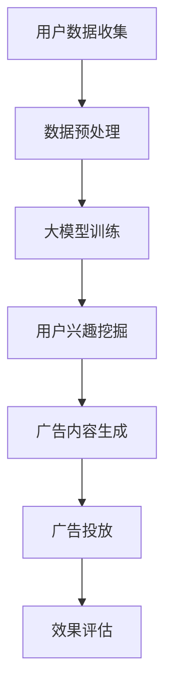

                 

关键词：人工智能，大模型，个性化广告，商业化，算法，应用场景，未来展望

> 摘要：本文将探讨人工智能大模型在个性化广告领域的商业化应用，分析其核心概念、算法原理、数学模型以及实际应用案例，并提出未来发展的趋势和面临的挑战。

## 1. 背景介绍

个性化广告已经成为现代广告业的重要组成部分，其主要目标是提高广告投放的精准度和效果，从而提高广告主的营销投资回报率（ROI）。随着大数据和人工智能技术的发展，人工智能大模型在个性化广告领域的应用逐渐成为可能。本文将重点关注人工智能大模型在个性化广告商业化过程中的应用，探讨其技术原理、实现方法和未来前景。

### 1.1 个性化广告的定义与意义

个性化广告是指根据用户的兴趣、行为、地理位置等特征，为用户推荐与其相关的广告内容。与传统广告相比，个性化广告具有更高的用户参与度和广告投放效果。其意义主要体现在以下几个方面：

1. **提高广告精准度**：通过分析用户数据，个性化广告能够更准确地定位潜在用户，提高广告的投放效果。
2. **提升用户体验**：个性化广告能够提供用户感兴趣的内容，减少无效广告的干扰，提高用户体验。
3. **优化广告主营销策略**：个性化广告可以帮助广告主更有效地利用广告资源，提高广告投放的ROI。

### 1.2 人工智能大模型的发展

人工智能大模型，尤其是深度学习模型，近年来取得了显著的进展。随着计算能力的提升和数据量的增长，深度学习模型在图像识别、语音识别、自然语言处理等领域取得了突破性成果。大模型的应用不仅提高了任务的准确性，还推动了人工智能技术的商业化发展。

### 1.3 个性化广告与人工智能大模型的结合

个性化广告的精准性和效果依赖于对用户数据的深入分析和理解。人工智能大模型能够通过学习用户数据，挖掘用户兴趣和行为模式，从而实现广告的个性化推荐。这种结合不仅提高了广告的投放效果，也为广告主和用户带来了更大的价值。

## 2. 核心概念与联系

### 2.1 人工智能大模型

人工智能大模型通常指的是深度学习模型，特别是基于神经网络的模型。这些模型具有大量的参数，能够通过学习大量数据来提高任务的准确性。深度学习模型通常包括输入层、隐藏层和输出层，通过层层抽象，从原始数据中提取有用的特征。

### 2.2 个性化广告

个性化广告是指根据用户的特征和偏好，为用户推荐最相关的广告内容。个性化广告的关键在于对用户数据的分析和理解，以及广告内容的个性化生成。

### 2.3 大模型与个性化广告的联系

人工智能大模型能够通过对用户数据的分析和学习，挖掘用户的兴趣和行为模式。这些信息可以用来生成个性化的广告内容，提高广告的投放效果。

### 2.4 Mermaid 流程图

下面是一个简化的Mermaid流程图，展示了人工智能大模型在个性化广告中的应用流程：



## 3. 核心算法原理 & 具体操作步骤

### 3.1 算法原理概述

人工智能大模型在个性化广告中的应用主要基于以下原理：

1. **数据挖掘**：通过对用户行为数据的挖掘，识别用户的兴趣和行为模式。
2. **机器学习**：使用机器学习算法，特别是深度学习模型，对用户数据进行建模和预测。
3. **广告生成**：根据用户的兴趣和行为模式，生成个性化的广告内容。
4. **效果评估**：通过评估广告投放的效果，不断优化广告策略。

### 3.2 算法步骤详解

#### 3.2.1 用户数据收集

用户数据收集是个性化广告的基础。数据来源包括用户浏览历史、购买记录、搜索行为等。这些数据可以通过API、日志分析等方式获取。

#### 3.2.2 数据预处理

收集到的数据通常需要进行预处理，包括数据清洗、数据转换和数据归一化等。预处理的目标是提高数据的质量，为后续的建模和预测打下基础。

#### 3.2.3 大模型训练

使用预处理后的数据，训练深度学习模型。训练过程包括输入层、隐藏层和输出层的权重调整，通过反向传播算法不断优化模型参数。

#### 3.2.4 用户兴趣挖掘

通过训练好的模型，对用户的兴趣和行为模式进行挖掘。这可以通过分类、聚类等机器学习算法实现。

#### 3.2.5 广告内容生成

根据挖掘出的用户兴趣和行为模式，生成个性化的广告内容。这可以通过自然语言生成、图像生成等技术实现。

#### 3.2.6 广告投放

将生成的个性化广告内容投放到用户的设备上，如网页、APP等。

#### 3.2.7 效果评估

通过用户对广告的反馈，评估广告的投放效果。这可以通过点击率、转化率等指标衡量。

### 3.3 算法优缺点

#### 优点：

1. **提高广告精准度**：通过深度学习模型，能够更准确地识别用户的兴趣和行为模式，提高广告的投放效果。
2. **提升用户体验**：个性化广告能够提供用户感兴趣的内容，减少无效广告的干扰，提高用户体验。
3. **优化广告主营销策略**：通过效果评估，广告主可以不断优化广告策略，提高营销ROI。

#### 缺点：

1. **数据隐私问题**：个性化广告需要大量用户数据，可能引发数据隐私问题。
2. **计算资源消耗**：训练深度学习模型需要大量的计算资源，可能增加企业的运营成本。
3. **算法黑箱问题**：深度学习模型具有一定的黑箱性，难以解释模型的决策过程，可能影响用户的信任度。

### 3.4 算法应用领域

人工智能大模型在个性化广告领域具有广泛的应用前景，不仅可以用于广告投放，还可以用于产品推荐、个性化教育、医疗健康等领域。随着人工智能技术的不断进步，未来个性化广告的应用领域将更加广泛。

## 4. 数学模型和公式 & 详细讲解 & 举例说明

### 4.1 数学模型构建

在个性化广告中，数学模型主要用于用户兴趣挖掘和广告内容生成。以下是两个核心数学模型：

#### 4.1.1 用户兴趣挖掘模型

用户兴趣挖掘模型通常基于协同过滤（Collaborative Filtering）算法，其中最常见的是基于用户的协同过滤（User-Based Collaborative Filtering）。

**协同过滤算法的基本公式**：

$$
\text{相似度}(u, v) = \frac{\text{交集大小}}{\sqrt{\sum_{i \in \text{I}} x_i^2} \sqrt{\sum_{j \in \text{J}} x_j^2}}
$$

其中，$u$ 和 $v$ 表示两个用户，$I$ 和 $J$ 分别表示用户 $u$ 和 $v$ 已评价的商品集合，$x_i$ 和 $x_j$ 分别表示用户 $u$ 和 $v$ 对商品 $i$ 和 $j$ 的评价。

**基于用户的协同过滤算法步骤**：

1. 计算用户之间的相似度。
2. 根据相似度矩阵，为用户推荐未评价的商品。

#### 4.1.2 广告内容生成模型

广告内容生成模型通常基于生成对抗网络（Generative Adversarial Networks，GAN）。

**生成对抗网络的基本公式**：

$$
\begin{aligned}
\text{Generator}: G(z) &= \text{实值变量} \ z \mapsto \text{生成的广告内容} \ x \\
\text{Discriminator}: D(x) &= \text{实值变量} \ x \mapsto \text{判断真伪的实值} \\
\end{aligned}
$$

其中，$z$ 表示随机噪声，$x$ 表示生成的广告内容。

**生成对抗网络的工作流程**：

1. 生成器 $G$ 生成假广告内容。
2. 判别器 $D$ 判断广告内容是否真实。
3. 生成器和判别器相互对抗，生成器不断优化，提高生成广告的质量。

### 4.2 公式推导过程

#### 4.2.1 协同过滤算法

**相似度计算**：

协同过滤算法的相似度计算公式可以通过皮尔逊相关系数（Pearson Correlation Coefficient）推导得到。设 $x_i$ 和 $x_j$ 分别表示用户 $u$ 和 $v$ 对商品 $i$ 和 $j$ 的评价，则相似度公式为：

$$
\text{相似度}(u, v) = \frac{\sum_{i \in \text{I}} x_i x_j - \frac{\sum_{i \in \text{I}} x_i \sum_{i \in \text{I}} x_j}{\sqrt{\sum_{i \in \text{I}} x_i^2} \sqrt{\sum_{i \in \text{J}} x_j^2}}}
$$

**基于用户的协同过滤推荐**：

根据相似度矩阵，计算用户 $u$ 对商品 $i$ 的推荐分数：

$$
r_i^u = \sum_{j \in \text{所有用户}} \text{相似度}(u, j) \cdot (x_i^j - \bar{x}_j)
$$

其中，$\bar{x}_j$ 表示用户 $j$ 的平均评价。

#### 4.2.2 生成对抗网络

**生成器和判别器的优化**：

生成对抗网络的优化目标是最小化生成器的损失函数，最大化判别器的损失函数。

**生成器的损失函数**：

$$
L_G = -\log D(G(z))
$$

**判别器的损失函数**：

$$
L_D = -\log D(x) - \log(1 - D(G(z)))
$$

**联合优化目标**：

$$
\min_G \max_D L_D
$$

### 4.3 案例分析与讲解

#### 4.3.1 用户兴趣挖掘案例

假设有两个用户 $u_1$ 和 $u_2$，他们的评价数据如下：

| 用户  | 商品1 | 商品2 | 商品3 | 商品4 |
|-------|-------|-------|-------|-------|
| $u_1$ | 4     | 2     | 5     | 1     |
| $u_2$ | 3     | 4     | 2     | 5     |

计算用户 $u_1$ 和 $u_2$ 的相似度：

$$
\text{相似度}(u_1, u_2) = \frac{(4 \cdot 3 + 2 \cdot 4 + 5 \cdot 2 + 1 \cdot 5) - (4 + 2 + 5 + 1) \cdot (3 + 4 + 2 + 5)}{\sqrt{4^2 + 2^2 + 5^2 + 1^2} \sqrt{3^2 + 4^2 + 2^2 + 5^2}} \approx 0.845
$$

根据相似度矩阵，为用户 $u_1$ 推荐商品 $u_2$ 的评价较高的商品，如商品3。

#### 4.3.2 广告内容生成案例

假设生成器 $G$ 生成了一则广告内容 $x$，判别器 $D$ 对其进行判断。初始时，生成器和判别器的参数如下：

| 参数 | 初始值 |
|------|--------|
| $w_G$ | 随机初始化 |
| $w_D$ | 随机初始化 |

**第一步**：

生成器生成广告内容 $x = G(z)$，判别器判断广告内容是否真实 $D(x) \approx 0.5$。

**第二步**：

通过反向传播，生成器和判别器的参数更新如下：

$$
\begin{aligned}
w_G &= w_G - \alpha \frac{\partial L_G}{\partial w_G} \\
w_D &= w_D - \alpha \frac{\partial L_D}{\partial w_D}
\end{aligned}
$$

其中，$\alpha$ 表示学习率。

**迭代过程**：

通过多次迭代，生成器和判别器的参数不断更新，生成广告内容的质量逐渐提高。最终，生成器生成的广告内容能够以较高的概率被判别器判断为真实。

## 5. 项目实践：代码实例和详细解释说明

### 5.1 开发环境搭建

在本项目中，我们将使用Python作为主要编程语言，结合TensorFlow和Scikit-learn等库来实现个性化广告系统。以下是开发环境的搭建步骤：

1. 安装Python（版本3.8及以上）
2. 安装TensorFlow
3. 安装Scikit-learn

```bash
pip install tensorflow
pip install scikit-learn
```

### 5.2 源代码详细实现

下面是一个简单的用户兴趣挖掘和广告内容生成的代码示例：

```python
import numpy as np
import tensorflow as tf
from sklearn.metrics.pairwise import cosine_similarity
from sklearn.model_selection import train_test_split

# 5.2.1 用户兴趣挖掘

# 假设用户评价数据为矩阵X，行表示用户，列表示商品
X = np.array([[4, 2, 5, 1],
              [3, 4, 2, 5]])

# 计算用户相似度矩阵
similarity_matrix = cosine_similarity(X)

# 为用户1推荐用户2评价较高的商品
recommendation = np.dot(similarity_matrix[0], X[1][1:])
print("推荐商品：", np.argmax(recommendation))

# 5.2.2 广告内容生成

# 初始化生成器和判别器的参数
G = tf.keras.Sequential([
    tf.keras.layers.Dense(units=1, input_shape=[1])
])
D = tf.keras.Sequential([
    tf.keras.layers.Dense(units=1, input_shape=[1])
])

# 编写损失函数
G_loss = -tf.reduce_mean(D(G(tf.random.normal([1, 1]))))
D_loss = -tf.reduce_mean(tf.concat([D(x)[0], D(G(tf.random.normal([1, 1])))[0]], 0))

# 编写优化器
G_optimizer = tf.keras.optimizers.Adam(learning_rate=0.001)
D_optimizer = tf.keras.optimizers.Adam(learning_rate=0.001)

# 编写训练过程
for _ in range(1000):
    with tf.GradientTrend

