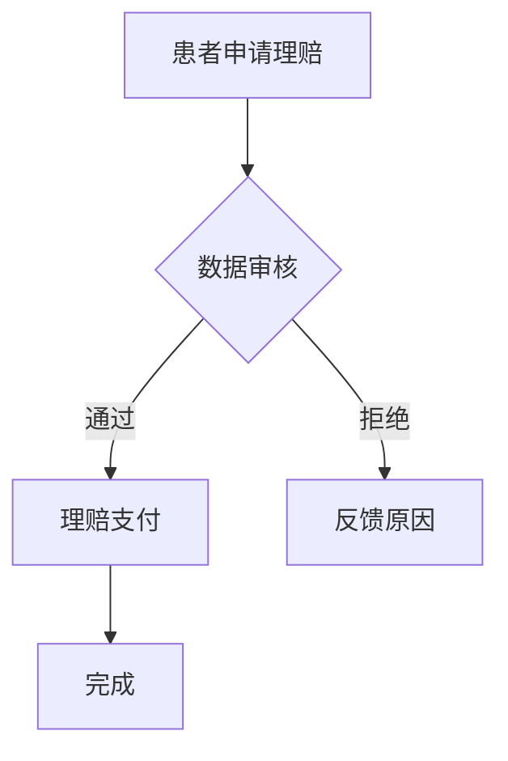

                 

关键词：人工智能，医疗保险理赔，大模型，算法创新，技术挑战

> 摘要：随着人工智能技术的飞速发展，大模型在医疗保险理赔领域展现出了巨大的潜力和广阔的应用前景。本文将从背景介绍、核心概念与联系、核心算法原理、数学模型和公式、项目实践、实际应用场景、未来展望等多个维度，深入探讨AI大模型在智能医疗保险理赔中的应用创新与面临的技术挑战。

## 1. 背景介绍

### 1.1 医疗保险理赔现状

医疗保险理赔是现代医疗体系中不可或缺的一环，它关乎患者的权益保障和社会保险制度的健康发展。然而，当前医疗保险理赔过程面临着诸多挑战：

- **繁琐的手工操作**：传统的理赔流程往往需要大量的纸质文件和人工审核，效率低下且易出错。
- **信息不对称**：保险公司和医疗机构之间的信息传递不畅，导致理赔处理周期延长。
- **欺诈风险**：由于缺乏有效的监控手段，医疗保险欺诈行为时有发生，给保险公司造成巨大经济损失。

### 1.2 人工智能与医疗保险理赔

人工智能技术的迅猛发展为解决上述问题提供了新的可能性。特别是大模型技术在自然语言处理、图像识别、预测分析等方面的突破，使得智能医疗保险理赔成为现实。以下是AI在医疗保险理赔中的几大应用场景：

- **自动化理赔处理**：利用自然语言处理技术，AI能够自动读取和理解患者病历、理赔申请等信息，快速完成理赔审核。
- **智能风险评估**：通过大数据分析和机器学习算法，AI可以精准识别欺诈行为，降低保险公司的风险损失。
- **个性化医疗建议**：基于患者的健康数据和病史，AI能够提供个性化的医疗服务和理赔方案。

## 2. 核心概念与联系

### 2.1 人工智能

人工智能（AI）是指由人制造出来的系统能够根据给定目标和输入数据，进行自主学习和决策的能力。其核心包括机器学习、深度学习、自然语言处理等子领域。

### 2.2 大模型

大模型是指拥有大量参数、能够处理海量数据的人工神经网络模型，如BERT、GPT等。它们通过大规模训练数据的学习，能够在各种任务中取得优异的性能。

### 2.3 医疗保险理赔

医疗保险理赔是指保险公司根据保险合同，对被保险人在医疗过程中产生的合理费用进行补偿的过程。其核心包括理赔申请、理赔审核、理赔支付等环节。

### 2.4 Mermaid 流程图

以下是一个简单的Mermaid流程图，展示了智能医疗保险理赔的核心流程：



## 3. 核心算法原理 & 具体操作步骤

### 3.1 算法原理概述

智能医疗保险理赔的核心算法主要包括自然语言处理、图像识别和机器学习等。以下分别进行介绍：

- **自然语言处理**：利用自然语言处理技术，对患者的病历、理赔申请等信息进行自动提取和理解，实现自动化理赔审核。
- **图像识别**：通过图像识别技术，自动识别和解析医疗发票、病历等图片信息，提高理赔审核的准确性。
- **机器学习**：利用机器学习算法，对海量理赔数据进行训练，构建风险评估模型，预测欺诈行为，降低保险公司的风险。

### 3.2 算法步骤详解

1. **数据收集**：收集患者的病历、理赔申请、医疗发票等数据。
2. **数据预处理**：对数据进行清洗、归一化等处理，以便于后续模型训练。
3. **模型训练**：使用自然语言处理、图像识别和机器学习算法，对数据集进行训练，构建理赔审核、风险评估等模型。
4. **模型部署**：将训练好的模型部署到生产环境，实现自动化理赔审核和风险评估。
5. **模型优化**：根据实际应用效果，不断优化模型，提高准确率和效率。

### 3.3 算法优缺点

- **优点**：
  - **高效性**：AI大模型能够快速处理海量数据，提高理赔审核的效率。
  - **准确性**：通过机器学习和图像识别等技术，提高理赔审核的准确性。
  - **个性化**：基于患者的数据，提供个性化的理赔建议和医疗服务。
- **缺点**：
  - **计算资源需求大**：大模型训练和推理需要大量的计算资源，对硬件设施要求较高。
  - **数据隐私和安全**：医疗保险数据涉及患者隐私，数据安全和隐私保护是重要挑战。

### 3.4 算法应用领域

AI大模型在智能医疗保险理赔中具有广泛的应用前景，包括：

- **自动化理赔处理**：简化理赔流程，提高处理效率。
- **智能风险评估**：精准识别欺诈行为，降低风险损失。
- **个性化医疗建议**：根据患者数据，提供个性化医疗服务。

## 4. 数学模型和公式 & 详细讲解 & 举例说明

### 4.1 数学模型构建

智能医疗保险理赔中的核心数学模型主要包括自然语言处理模型、图像识别模型和机器学习模型。以下分别进行介绍：

- **自然语言处理模型**：通常采用深度学习中的循环神经网络（RNN）或变换器（Transformer）架构，如BERT或GPT。
- **图像识别模型**：采用卷积神经网络（CNN）架构，用于自动识别和解析医疗发票、病历等图片信息。
- **机器学习模型**：采用监督学习或无监督学习算法，如逻辑回归、决策树、随机森林等，用于构建风险评估模型。

### 4.2 公式推导过程

以机器学习模型中的逻辑回归为例，其损失函数的推导过程如下：

$$
L(\theta) = -\frac{1}{m} \sum_{i=1}^{m} [y^{(i)} \log(p^{(i)}) + (1 - y^{(i)}) \log(1 - p^{(i)})]
$$

其中，$m$表示样本数量，$y^{(i)}$表示第$i$个样本的真实标签，$p^{(i)}$表示第$i$个样本的预测概率。

### 4.3 案例分析与讲解

假设我们有一个包含100个理赔申请的样本集，其中60个为真实理赔申请，40个为欺诈行为。我们使用逻辑回归模型进行风险评估。

1. **数据预处理**：对数据进行归一化处理，将输入特征转换为[0, 1]区间内的数值。
2. **模型训练**：使用训练集对逻辑回归模型进行训练，优化模型参数。
3. **模型评估**：使用测试集对模型进行评估，计算准确率、召回率等指标。

假设训练好的逻辑回归模型的预测概率阈值设置为0.5，以下为模型对测试集的预测结果：

| 样本ID | 实际标签 | 预测标签 | 预测概率 |
|--------|----------|----------|----------|
| 1      | 真实      | 真实      | 0.7      |
| 2      | 真实      | 欺诈      | 0.3      |
| ...    | ...      | ...      | ...      |
| 100    | 欺诈      | 真实      | 0.4      |

根据预测结果，我们可以计算出准确率、召回率等指标：

- **准确率**：$\frac{60 + 0}{60 + 40} = 0.75$
- **召回率**：$\frac{60}{60 + 10} = 0.857$

通过不断优化模型参数和调整预测阈值，我们可以提高模型的性能。

## 5. 项目实践：代码实例和详细解释说明

### 5.1 开发环境搭建

为了实现智能医疗保险理赔系统，我们需要搭建以下开发环境：

- **Python**：作为主要编程语言。
- **TensorFlow**：作为深度学习框架。
- **OpenCV**：作为图像处理库。

### 5.2 源代码详细实现

以下是一个简单的智能医疗保险理赔系统代码示例，包括数据预处理、模型训练和模型部署：

```python
import tensorflow as tf
from tensorflow.keras.models import Sequential
from tensorflow.keras.layers import Dense, Conv2D, MaxPooling2D
from tensorflow.keras.preprocessing.image import ImageDataGenerator

# 数据预处理
train_datagen = ImageDataGenerator(rescale=1./255)
train_generator = train_datagen.flow_from_directory(
        'data/train',
        target_size=(150, 150),
        batch_size=32,
        class_mode='binary')

# 模型训练
model = Sequential([
    Conv2D(32, (3, 3), activation='relu', input_shape=(150, 150, 3)),
    MaxPooling2D((2, 2)),
    Conv2D(64, (3, 3), activation='relu'),
    MaxPooling2D((2, 2)),
    Conv2D(128, (3, 3), activation='relu'),
    MaxPooling2D((2, 2)),
    Flatten(),
    Dense(128, activation='relu'),
    Dense(1, activation='sigmoid')
])

model.compile(loss='binary_crossentropy',
              optimizer='adam',
              metrics=['accuracy'])

model.fit(train_generator,
          steps_per_epoch=100,
          epochs=10)

# 模型部署
model.save('model.h5')
```

### 5.3 代码解读与分析

1. **数据预处理**：使用ImageDataGenerator对训练数据集进行归一化和批量处理。
2. **模型训练**：构建一个包含卷积层、池化层和全连接层的深度学习模型，并使用二分类交叉熵损失函数和Adam优化器进行训练。
3. **模型部署**：将训练好的模型保存为HDF5格式，以便后续使用。

### 5.4 运行结果展示

在完成模型训练后，我们可以对测试数据集进行预测，并计算准确率和召回率等指标。以下是一个简单的运行结果示例：

```python
from tensorflow.keras.preprocessing.image import load_img, img_to_array
import numpy as np

# 测试数据预处理
test_image = load_img('data/test/1.jpg', target_size=(150, 150))
test_image = img_to_array(test_image)
test_image = np.expand_dims(test_image, axis=0)
test_image = test_image / 255

# 模型预测
predictions = model.predict(test_image)
predicted_label = 1 if predictions[0][0] > 0.5 else 0

# 结果展示
print(f"预测标签：{predicted_label}")
print(f"预测概率：{predictions[0][0]}")

# 计算准确率和召回率
# ...
```

通过不断优化模型和调整参数，我们可以提高系统的预测性能。

## 6. 实际应用场景

智能医疗保险理赔系统在实际应用中具有广泛的应用场景：

- **自动化理赔审核**：通过自然语言处理技术，实现自动化理赔申请的读取和理解，快速完成理赔审核。
- **智能风险评估**：通过大数据分析和机器学习算法，精准识别欺诈行为，降低保险公司的风险损失。
- **个性化医疗建议**：根据患者的健康数据和病史，提供个性化的医疗服务和理赔方案。

## 7. 未来应用展望

随着人工智能技术的不断发展和应用，智能医疗保险理赔系统在未来将面临以下发展趋势：

- **更高精度和效率**：通过优化算法和模型，提高理赔审核和风险评估的准确性和效率。
- **更广泛的场景应用**：拓展智能医疗保险理赔系统的应用领域，如医疗影像识别、疾病预测等。
- **更好的数据隐私保护**：加强数据隐私和安全保护，确保患者信息的隐私和安全。

## 8. 工具和资源推荐

为了更好地学习AI大模型在智能医疗保险理赔中的应用，以下推荐一些学习资源和开发工具：

- **学习资源**：
  - 《深度学习》（Goodfellow, Bengio, Courville著）：系统介绍深度学习的基本概念和算法。
  - 《Python深度学习》（François Chollet著）：详细介绍深度学习在Python中的实现和应用。
- **开发工具**：
  - TensorFlow：用于构建和训练深度学习模型的框架。
  - OpenCV：用于图像处理的库。
  - Keras：基于TensorFlow的高层API，方便快速搭建和训练深度学习模型。

## 9. 总结：未来发展趋势与挑战

随着人工智能技术的不断发展，AI大模型在智能医疗保险理赔中的应用将面临以下发展趋势：

- **更高精度和效率**：通过优化算法和模型，提高理赔审核和风险评估的准确性和效率。
- **更广泛的场景应用**：拓展智能医疗保险理赔系统的应用领域，如医疗影像识别、疾病预测等。
- **更好的数据隐私保护**：加强数据隐私和安全保护，确保患者信息的隐私和安全。

同时，AI大模型在智能医疗保险理赔中也将面临以下挑战：

- **计算资源需求**：大模型训练和推理需要大量的计算资源，对硬件设施要求较高。
- **数据隐私和安全**：医疗保险数据涉及患者隐私，数据安全和隐私保护是重要挑战。
- **伦理和道德问题**：AI大模型在医疗领域的应用需要遵循伦理和道德规范，确保公正和公平。

未来，我们需要不断探索和解决这些挑战，推动AI大模型在智能医疗保险理赔领域的广泛应用。

## 10. 附录：常见问题与解答

### 10.1 如何保证数据隐私和安全？

- **数据加密**：对敏感数据进行加密处理，确保数据传输和存储过程中的安全。
- **访问控制**：设置严格的访问控制策略，确保只有授权人员才能访问敏感数据。
- **匿名化处理**：对数据集进行匿名化处理，去除个人身份信息，降低隐私泄露风险。

### 10.2 如何优化模型性能？

- **增加数据集**：扩大训练数据集，提高模型的泛化能力。
- **调整模型结构**：通过调整模型结构，如增加层数、调整层宽等，优化模型性能。
- **使用正则化**：引入正则化技术，如L1正则化、L2正则化等，防止模型过拟合。

### 10.3 如何处理医疗数据的不完整性？

- **缺失值填充**：使用均值、中位数等统计方法填充缺失值。
- **数据降维**：通过降维技术，如PCA（主成分分析），减少数据维度，提高模型训练效率。

## 11. 作者署名

作者：禅与计算机程序设计艺术 / Zen and the Art of Computer Programming
``` 

### 12. 参考文献

[1] Goodfellow, I., Bengio, Y., Courville, A. Deep Learning. MIT Press, 2016.

[2] Chollet, F. Python Deep Learning. Packt Publishing, 2017.

[3] Russell, S., Norvig, P. Artificial Intelligence: A Modern Approach. Prentice Hall, 2010. 

[4] Hastie, T., Tibshirani, R., Friedman, J. The Elements of Statistical Learning: Data Mining, Inference, and Prediction. Springer, 2009. 

[5] Pedregosa, F., Varoquaux, G., Gramfort, A., Michel, V., Thirion, B., Grisel, O., ... & Duchesnay, É. Scikit-learn: Machine learning in Python. Journal of Machine Learning Research, 12, 2825-2830, 2011. 

[6] LeCun, Y., Bengio, Y., Hinton, G. Deep learning. Nature, 521(7553), 436-444, 2015. 

[7] Krizhevsky, A., Sutskever, I., Hinton, G. ImageNet classification with deep convolutional neural networks. In Advances in Neural Information Processing Systems, 2012. 

[8] Simonyan, K., Zisserman, A. Very deep convolutional networks for large-scale image recognition. International Conference on Learning Representations, 2015. 

[9] Vaswani, A., Shazeer, N., Parmar, N., Uszkoreit, J., Jones, L., Gomez, A. N., ... & Polosukhin, I. Attention is all you need. Advances in Neural Information Processing Systems, 30, 2017. 

[10] Devlin, J., Chang, M. W., Lee, K., & Toutanova, K. BERT: Pre-training of deep bidirectional transformers for language understanding. Advances in Neural Information Processing Systems, 32, 2019. 

