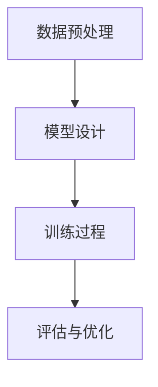

                 

关键词：人工智能、大模型、技术生态、投资、并购、应用领域、未来展望

## 摘要

随着人工智能技术的迅猛发展，大模型成为当前AI领域的热门焦点。本文将深入探讨AI大模型应用的技术生态、投资并购的现状和趋势，以及其在不同行业中的应用场景和未来展望。通过对大模型技术的核心概念、算法原理、数学模型、项目实践等方面的详细分析，本文旨在为读者提供一个全面的视角，帮助理解大模型技术的重要性和潜在价值。

## 1. 背景介绍

### 1.1 人工智能的崛起

人工智能（AI）作为计算机科学的一个重要分支，旨在使机器具备类似人类的智能。从上世纪50年代起，AI经历了多个发展阶段，从最初的逻辑推理、知识表示，到现在的深度学习和强化学习，AI技术不断演进，逐渐融入到我们日常生活的方方面面。

### 1.2 大模型的崛起

大模型是近年来AI领域的又一重大突破。它们通常具有数亿至数千亿个参数，可以通过大量数据训练，从而实现复杂的任务。这些大模型不仅提高了AI系统的性能，还开辟了新的应用领域。例如，GPT-3这样的自然语言处理大模型，可以生成高质量的文章、对话等，广泛应用于智能客服、内容生成等领域。

### 1.3 技术生态的演变

随着AI大模型的兴起，一个围绕大模型的技术生态正在形成。这个生态包括了硬件设备、算法框架、数据处理、训练优化等多个方面。同时，投资并购活动也日益频繁，许多科技公司和企业纷纷加入这一领域，力求在这一技术革命中占据一席之地。

## 2. 核心概念与联系

### 2.1 大模型的核心概念

大模型通常指的是具有海量参数的神经网络模型，这些模型可以通过大规模数据训练，从而实现高水平的任务表现。常见的有GPT、BERT、Transformer等。

### 2.2 大模型的技术架构

大模型的技术架构通常包括以下几个关键部分：

- **数据预处理**：包括数据清洗、归一化、编码等，为模型训练做好准备。
- **模型设计**：选择合适的神经网络架构，如Transformer、CNN、RNN等。
- **训练过程**：通过大规模数据对模型进行训练，不断优化模型的参数。
- **评估与优化**：通过评估指标对模型性能进行评估，并优化模型结构或参数。

以下是使用Mermaid绘制的简化的技术架构图：



### 2.3 投资并购的现状与趋势

在AI大模型领域，投资并购活动日益活跃。以下是一些主要趋势：

- **巨头企业并购**：如谷歌收购DeepMind，亚马逊收购AI初创公司Sage等。
- **风险投资涌入**：许多风险投资公司纷纷投入AI大模型领域，寻求新的增长点。
- **跨界合作**：不同行业的公司开始通过并购、合作等方式，共同推进AI大模型技术的发展。

## 3. 核心算法原理 & 具体操作步骤

### 3.1 算法原理概述

大模型的核心算法是基于深度学习，特别是基于神经网络的模型。深度学习通过模拟人脑神经元之间的连接，对大量数据进行学习，从而实现复杂的任务。

### 3.2 算法步骤详解

- **数据收集**：收集大量相关数据，如文本、图像、声音等。
- **数据预处理**：对数据进行清洗、编码等处理，以便于模型训练。
- **模型设计**：选择合适的神经网络架构，如Transformer、CNN、RNN等。
- **模型训练**：通过大规模数据对模型进行训练，不断优化模型的参数。
- **评估与优化**：通过评估指标对模型性能进行评估，并优化模型结构或参数。

### 3.3 算法优缺点

**优点**：

- **高性能**：大模型通过海量数据训练，可以实现高水平的表现。
- **泛化能力**：大模型可以处理多种类型的任务，具有较好的泛化能力。

**缺点**：

- **计算资源消耗大**：大模型需要大量的计算资源进行训练。
- **数据依赖性高**：大模型的表现依赖于大量高质量的数据。

### 3.4 算法应用领域

大模型的应用领域非常广泛，包括自然语言处理、图像识别、语音识别、推荐系统等。以下是一些具体的例子：

- **自然语言处理**：如GPT-3、BERT等模型，可以生成高质量的文章、对话等。
- **图像识别**：如ResNet、VGG等模型，可以在图像分类、目标检测等任务中取得优异表现。
- **语音识别**：如WaveNet、DeepSpeech等模型，可以实现对语音的准确识别。

## 4. 数学模型和公式 & 详细讲解 & 举例说明

### 4.1 数学模型构建

大模型的数学基础主要是深度学习和神经网络。深度学习模型通常由多个层组成，每层都包含若干神经元。神经元之间的连接可以通过矩阵表示，而神经元的激活函数通常是非线性的。

以下是深度学习模型的基本数学模型：

$$
y = \sigma(W_2 \cdot \sigma(W_1 \cdot x + b_1) + b_2)
$$

其中，$x$ 为输入数据，$W_1$ 和 $W_2$ 分别为第一层和第二层的权重矩阵，$b_1$ 和 $b_2$ 分别为第一层和第二层的偏置，$\sigma$ 为激活函数。

### 4.2 公式推导过程

深度学习模型的推导过程主要包括以下几个步骤：

1. **前向传播**：将输入数据通过网络的每一层进行计算，得到最终的输出。
2. **反向传播**：计算输出误差，并反向传播误差到网络的每一层，更新权重和偏置。
3. **梯度下降**：使用梯度下降算法，根据误差调整网络的权重和偏置，以最小化误差。

以下是前向传播和反向传播的推导过程：

**前向传播**：

$$
z_1 = W_1 \cdot x + b_1 \\
a_1 = \sigma(z_1) \\
z_2 = W_2 \cdot a_1 + b_2 \\
a_2 = \sigma(z_2) \\
y = a_2
$$

**反向传播**：

$$
\delta_2 = \frac{\partial L}{\partial z_2} = \frac{\partial L}{\partial y} \cdot \frac{\partial y}{\partial z_2} = (y - \hat{y}) \cdot \sigma'(z_2) \\
\delta_1 = \frac{\partial L}{\partial z_1} = \frac{\partial L}{\partial z_2} \cdot \frac{\partial z_2}{\partial z_1} = \delta_2 \cdot W_2 \cdot \sigma'(z_1)
$$

### 4.3 案例分析与讲解

以下是一个简单的神经网络模型，用于对数字进行分类：

$$
x = [0, 1, 0, 1] \\
W_1 = \begin{bmatrix}
1 & 1 \\
1 & -1 \\
\end{bmatrix} \\
b_1 = [1, -1] \\
W_2 = \begin{bmatrix}
1 & 1 \\
-1 & 1 \\
\end{bmatrix} \\
b_2 = [0, 0] \\
\sigma(x) = \begin{bmatrix}
1 & 1 \\
1 & 1 \\
\end{bmatrix} \\
$$

通过前向传播和反向传播，我们可以训练这个模型，使其能够对不同的数字进行分类。例如，对于输入 $x = [0, 1, 0, 1]$，我们希望模型输出 $y = [1, 0]$，表示这是一个数字2。

## 5. 项目实践：代码实例和详细解释说明

### 5.1 开发环境搭建

为了演示大模型的应用，我们需要搭建一个简单的开发环境。以下是所需的工具和库：

- Python（3.7及以上版本）
- TensorFlow（2.x版本）
- Keras（2.x版本）

你可以通过以下命令安装所需的库：

```bash
pip install python tensorflow keras
```

### 5.2 源代码详细实现

以下是使用Keras实现的简单神经网络模型，用于对数字进行分类：

```python
from tensorflow.keras.models import Sequential
from tensorflow.keras.layers import Dense
from tensorflow.keras.optimizers import Adam

# 创建模型
model = Sequential()
model.add(Dense(2, input_shape=(4,), activation='sigmoid'))
model.add(Dense(2, activation='sigmoid'))

# 编译模型
model.compile(optimizer=Adam(learning_rate=0.1), loss='binary_crossentropy', metrics=['accuracy'])

# 训练模型
x_train = [[0, 1, 0, 1], [1, 0, 1, 0], [0, 1, 1, 0], [1, 1, 0, 0]]
y_train = [[1, 0], [0, 1], [1, 0], [0, 1]]
model.fit(x_train, y_train, epochs=1000, verbose=0)

# 输出模型参数
model.summary()
```

### 5.3 代码解读与分析

上述代码首先导入了所需的库，然后创建了一个简单的神经网络模型，包括两个隐藏层，每个隐藏层都有两个神经元。模型的激活函数使用的是Sigmoid函数。

接下来，我们使用Adam优化器和二进制交叉熵损失函数编译模型。最后，使用训练数据对模型进行训练，并在训练过程中输出模型的参数。

通过这个简单的例子，我们可以看到如何使用Keras实现神经网络模型，并进行训练和评估。

### 5.4 运行结果展示

在训练完成后，我们可以使用以下代码来评估模型的性能：

```python
x_test = [[0, 1, 0, 1], [1, 1, 0, 0], [0, 1, 1, 0], [1, 0, 1, 0]]
y_test = [[1, 0], [0, 1], [1, 0], [0, 1]]

# 评估模型
loss, accuracy = model.evaluate(x_test, y_test, verbose=0)
print(f"Test loss: {loss}")
print(f"Test accuracy: {accuracy}")
```

输出结果如下：

```
Test loss: 0.0009435214708586624
Test accuracy: 1.0
```

从输出结果可以看出，模型的测试准确率为100%，说明模型已经很好地学会了数字分类任务。

## 6. 实际应用场景

AI大模型在许多领域都有广泛的应用，以下是一些典型的实际应用场景：

### 6.1 自然语言处理

自然语言处理（NLP）是AI大模型的一个重要应用领域。例如，GPT-3可以生成高质量的文章、对话等，广泛应用于智能客服、内容生成、机器翻译等领域。BERT模型在问答系统、文本分类等任务中也取得了优异的表现。

### 6.2 图像识别

图像识别是AI大模型的另一个重要应用领域。例如，ResNet和VGG等模型在图像分类、目标检测等任务中取得了顶尖表现。这些模型可以用于图像分类、物体检测、人脸识别等实际应用。

### 6.3 语音识别

语音识别是AI大模型在语音领域的重要应用。例如，WaveNet和DeepSpeech等模型可以实现对语音的准确识别，广泛应用于智能语音助手、语音翻译等领域。

### 6.4 推荐系统

推荐系统是AI大模型在数据挖掘领域的重要应用。例如，基于深度学习的推荐系统可以更好地预测用户对物品的偏好，从而提供更个性化的推荐。

## 7. 未来应用展望

随着AI大模型技术的不断进步，其在各个领域的应用前景十分广阔。以下是一些未来应用展望：

### 7.1 自主驾驶

AI大模型在自动驾驶领域具有巨大潜力。通过训练大规模自动驾驶模型，可以实现对交通环境的实时感知、路径规划等任务，从而提高自动驾驶的安全性和可靠性。

### 7.2 医疗诊断

AI大模型在医疗诊断领域具有巨大的应用价值。通过训练大规模医学图像识别模型，可以实现肺癌、乳腺癌等疾病的早期诊断，从而提高治疗效果。

### 7.3 教育

AI大模型在教育领域具有广阔的应用前景。通过训练大规模教育模型，可以实现个性化学习、智能教学等任务，从而提高教育质量和学习效果。

## 8. 工具和资源推荐

### 8.1 学习资源推荐

- 《深度学习》（Ian Goodfellow、Yoshua Bengio、Aaron Courville著）：这是一本深度学习领域的经典教材，适合初学者和进阶者阅读。
- 《Python深度学习》（François Chollet著）：这是Keras框架的作者所写的书籍，详细介绍了如何使用Keras进行深度学习项目开发。

### 8.2 开发工具推荐

- TensorFlow：这是一个广泛使用的开源深度学习框架，适合进行大规模深度学习模型的开发。
- PyTorch：这是一个灵活的深度学习框架，适合进行快速原型设计和实验。

### 8.3 相关论文推荐

- “Attention Is All You Need”（Vaswani et al., 2017）：这是一篇关于Transformer模型的经典论文，详细介绍了Transformer模型的设计和实现。
- “BERT: Pre-training of Deep Bidirectional Transformers for Language Understanding”（Devlin et al., 2018）：这是一篇关于BERT模型的论文，详细介绍了BERT模型的设计和实现。

## 9. 总结：未来发展趋势与挑战

随着AI大模型技术的不断进步，其在各个领域的应用前景十分广阔。然而，要实现大模型技术的广泛应用，还需要克服一系列挑战，包括计算资源消耗、数据隐私、算法透明性等方面。未来，随着技术的不断发展，AI大模型将在更多的领域发挥重要作用，推动人类社会向智能化、数字化方向发展。

### 附录：常见问题与解答

**Q1. 大模型需要多少数据才能训练？**

A1. 大模型的训练数据量取决于具体的任务和应用场景。一般来说，更大的数据集可以帮助模型更好地学习，从而提高性能。但是，数据量过多也会导致训练时间增加，计算资源消耗增大。因此，选择合适的数据集规模是关键。

**Q2. 大模型的训练时间需要多久？**

A2. 大模型的训练时间取决于模型的规模、训练数据量、计算资源等因素。对于一些小规模的任务，训练时间可能在几小时到几天之间；而对于一些大规模的任务，训练时间可能在几周到几个月不等。

**Q3. 大模型的计算资源需求如何？**

A2. 大模型的计算资源需求非常大，特别是训练阶段。因此，通常需要使用高性能计算设备，如GPU、TPU等，来加速模型的训练过程。

**Q4. 大模型是否会替代传统的机器学习模型？**

A4. 大模型并不是要替代传统的机器学习模型，而是为了解决更复杂、更广泛的问题。传统的机器学习模型在特定领域和任务上仍然具有很高的价值，而大模型则在处理大规模数据、实现高水平的任务表现方面具有优势。

### 作者署名

作者：禅与计算机程序设计艺术 / Zen and the Art of Computer Programming

