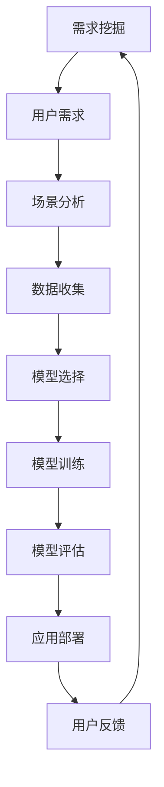

                 

关键词：AI大模型、需求挖掘、应用引导、策略

摘要：随着人工智能技术的迅猛发展，大模型的应用逐渐成为行业热点。本文将从需求挖掘与应用引导的角度，探讨大模型在各类场景下的有效应用策略，为AI大模型研究与应用提供有益的参考。

## 1. 背景介绍

近年来，深度学习技术的飞速进步，使得AI大模型（如GPT、BERT等）在自然语言处理、计算机视觉等领域取得了显著的成果。这些大模型具有强大的建模能力和泛化能力，能够应对复杂的任务场景，从而推动了人工智能领域的进一步发展。然而，如何有效挖掘和应用这些大模型，成为当前亟待解决的问题。

### 1.1 AI大模型的定义

AI大模型是指使用深度学习技术训练的具有海量参数和强大计算能力的人工神经网络模型。这些模型通常由多层神经网络组成，通过自主学习大量数据，实现对复杂任务的建模和预测。

### 1.2 AI大模型的应用现状

目前，AI大模型在自然语言处理、计算机视觉、语音识别等领域的应用已取得显著成果。例如，GPT模型在文本生成、问答系统等领域表现出色；BERT模型在文本分类、情感分析等任务中具有较高准确率。

## 2. 核心概念与联系

在探讨AI大模型的应用需求挖掘与引导策略之前，我们需要了解一些核心概念和它们之间的联系。以下是一个Mermaid流程图，展示了这些核心概念和它们的关联。



### 2.1 需求挖掘

需求挖掘是AI大模型应用的第一步，旨在理解和分析用户需求。这一步骤包括以下几个环节：

- 用户需求收集：通过与用户沟通、问卷调查等方式，了解用户的需求和期望。
- 需求分析：对收集到的用户需求进行归纳和总结，识别关键需求和优先级。

### 2.2 场景分析

场景分析是指根据需求挖掘的结果，分析大模型应用的具体场景。场景分析包括以下几个环节：

- 场景识别：识别出可能的应用场景，如文本生成、图像分类等。
- 场景细化：对识别出的场景进行细化，明确每个场景的具体任务和目标。

### 2.3 数据收集

数据收集是AI大模型应用的关键步骤，旨在收集和整理与场景相关的数据。数据收集包括以下几个环节：

- 数据采集：通过数据爬取、数据开放平台等方式获取数据。
- 数据清洗：对采集到的数据进行清洗和预处理，确保数据的质量。

### 2.4 模型选择

模型选择是根据场景分析和数据收集的结果，选择合适的大模型。模型选择包括以下几个环节：

- 模型调研：了解不同大模型的性能、特点和应用范围。
- 模型评估：通过实验和测试，评估模型在特定场景下的性能。

### 2.5 模型训练

模型训练是使用收集到的数据进行模型训练，以提升模型的性能。模型训练包括以下几个环节：

- 数据处理：对收集到的数据进行预处理，如数据增强、数据归一化等。
- 模型训练：使用预处理后的数据进行模型训练，调整模型参数。
- 模型优化：通过超参数调整、模型融合等技术，提升模型性能。

### 2.6 模型评估

模型评估是对训练好的模型进行评估，以确定其性能是否符合预期。模型评估包括以下几个环节：

- 评估指标：选择合适的评估指标，如准确率、召回率等。
- 评估过程：使用测试集对模型进行评估，评估模型的性能。
- 评估结果：对评估结果进行分析和总结，为模型优化提供依据。

### 2.7 应用部署

应用部署是将训练好的模型部署到实际应用环境中，以实现大模型的应用价值。应用部署包括以下几个环节：

- 环境配置：搭建适合模型运行的环境，包括硬件、软件等方面。
- 应用开发：开发模型应用系统，实现模型的应用。
- 应用测试：对应用系统进行测试，确保其稳定性和性能。

### 2.8 用户反馈

用户反馈是AI大模型应用过程中不可或缺的一环，通过用户反馈，可以不断优化和改进模型和应用系统。用户反馈包括以下几个环节：

- 用户反馈收集：通过用户调研、问卷调查等方式收集用户反馈。
- 反馈分析：对收集到的用户反馈进行分析和总结，识别问题和改进点。
- 改进措施：根据反馈分析结果，采取相应的改进措施，提升模型和应用系统的用户体验。

## 3. 核心算法原理 & 具体操作步骤

### 3.1 算法原理概述

AI大模型的核心算法是基于深度学习技术，通过多层神经网络对大量数据进行训练，从而实现对复杂任务的建模和预测。以下是AI大模型的基本原理和关键步骤：

1. **数据输入**：将输入数据（如文本、图像等）转换为神经网络可以处理的格式。
2. **前向传播**：将输入数据通过神经网络的前向传播过程，计算得到输出结果。
3. **反向传播**：根据输出结果与实际目标之间的误差，通过反向传播算法更新神经网络中的参数。
4. **迭代训练**：重复上述过程，直到模型收敛，即误差达到预设阈值。

### 3.2 算法步骤详解

1. **数据预处理**：

   - **数据清洗**：去除数据中的噪声和异常值，保证数据质量。
   - **数据增强**：通过对原始数据进行变换，如旋转、翻转、缩放等，增加数据的多样性。
   - **数据归一化**：将数据缩放到相同的范围，如[0, 1]或[-1, 1]，提高模型训练的稳定性。

2. **模型构建**：

   - **网络结构设计**：选择合适的神经网络结构，如卷积神经网络（CNN）、循环神经网络（RNN）等。
   - **层间连接**：定义网络中的层间连接方式，如全连接层、卷积层等。
   - **激活函数**：选择合适的激活函数，如ReLU、Sigmoid等。

3. **模型训练**：

   - **损失函数**：选择合适的损失函数，如交叉熵、均方误差等。
   - **优化算法**：选择合适的优化算法，如梯度下降、Adam等。
   - **训练过程**：迭代训练模型，不断更新参数，直到模型收敛。

4. **模型评估**：

   - **测试集评估**：使用测试集对训练好的模型进行评估，计算模型的准确率、召回率等指标。
   - **交叉验证**：使用交叉验证技术，对模型进行更全面的评估。

5. **模型优化**：

   - **超参数调整**：根据模型评估结果，调整模型的超参数，如学习率、批量大小等。
   - **模型融合**：使用多个模型进行融合，提高模型的性能和泛化能力。

### 3.3 算法优缺点

**优点**：

1. **强大的建模能力**：AI大模型通过多层神经网络对数据进行建模，能够处理复杂的任务场景。
2. **泛化能力**：AI大模型通过大量数据训练，具有较好的泛化能力，能够应对未知数据。
3. **自适应能力**：AI大模型可以根据不同的任务场景和需求进行自适应调整。

**缺点**：

1. **计算资源需求大**：AI大模型需要大量的计算资源进行训练，对硬件设施要求较高。
2. **数据依赖性强**：AI大模型对训练数据的质量和数量有较高要求，数据不足或质量差可能导致模型性能下降。
3. **模型解释性差**：AI大模型通常具有较好的预测性能，但模型内部的决策过程较为复杂，难以进行解释。

### 3.4 算法应用领域

AI大模型在以下领域具有广泛的应用：

1. **自然语言处理**：如文本分类、情感分析、机器翻译等。
2. **计算机视觉**：如图像分类、目标检测、人脸识别等。
3. **语音识别**：如语音识别、语音合成等。
4. **推荐系统**：如商品推荐、新闻推荐等。
5. **游戏AI**：如棋类游戏、角色扮演游戏等。

## 4. 数学模型和公式 & 详细讲解 & 举例说明

### 4.1 数学模型构建

AI大模型的数学模型主要包括输入层、隐藏层和输出层。以下是这些层的数学模型构建：

#### 输入层

输入层接收外部数据，并将其转换为神经网络可以处理的格式。输入层通常使用以下公式进行建模：

$$ x_i = \sum_{j=1}^{n} w_{ij} x_j + b_i $$

其中，$x_i$ 表示第 $i$ 个输入特征，$w_{ij}$ 表示输入层第 $i$ 个神经元与隐藏层第 $j$ 个神经元的权重，$b_i$ 表示输入层第 $i$ 个神经元的偏置。

#### 隐藏层

隐藏层对输入数据进行加工和处理，通过多层叠加，实现对复杂任务的建模。隐藏层通常使用以下公式进行建模：

$$ h_{ij} = \sigma(\sum_{k=1}^{m} w_{ik} h_{kj} + b_j) $$

其中，$h_{ij}$ 表示隐藏层第 $i$ 个神经元与隐藏层第 $j$ 个神经元的连接权重，$\sigma$ 表示激活函数，如ReLU、Sigmoid等。

#### 输出层

输出层将隐藏层的结果转换为最终输出，通常使用以下公式进行建模：

$$ y_i = \sum_{j=1}^{p} w_{ij} h_{j} + b_i $$

其中，$y_i$ 表示输出层第 $i$ 个神经元的输出结果，$w_{ij}$ 表示输出层第 $i$ 个神经元与隐藏层第 $j$ 个神经元的连接权重，$b_i$ 表示输出层第 $i$ 个神经元的偏置。

### 4.2 公式推导过程

在AI大模型中，损失函数和优化算法是核心组成部分。以下是损失函数和优化算法的公式推导过程。

#### 损失函数

常见的损失函数包括交叉熵损失函数和均方误差损失函数。

1. **交叉熵损失函数**：

$$ L = -\sum_{i=1}^{n} y_i \log(y_i^{\hat{}}) $$

其中，$y_i$ 表示实际标签，$y_i^{\hat{}}$ 表示模型预测的概率分布。

2. **均方误差损失函数**：

$$ L = \frac{1}{2} \sum_{i=1}^{n} (y_i - y_i^{\hat{}})^2 $$

其中，$y_i$ 表示实际标签，$y_i^{\hat{}}$ 表示模型预测的值。

#### 优化算法

常见的优化算法包括梯度下降和Adam。

1. **梯度下降**：

$$ \theta_{t+1} = \theta_{t} - \alpha \cdot \nabla L(\theta_t) $$

其中，$\theta$ 表示模型参数，$\alpha$ 表示学习率，$\nabla L(\theta_t)$ 表示损失函数关于参数的梯度。

2. **Adam**：

$$ m_t = \beta_1 m_{t-1} + (1 - \beta_1) \cdot \nabla L(\theta_t) $$
$$ v_t = \beta_2 v_{t-1} + (1 - \beta_2) \cdot (\nabla L(\theta_t)^2) $$
$$ \theta_{t+1} = \theta_t - \alpha \cdot \frac{m_t}{\sqrt{v_t} + \epsilon} $$

其中，$m_t$ 和 $v_t$ 分别表示一阶矩估计和二阶矩估计，$\beta_1$ 和 $\beta_2$ 分别为动量因子，$\epsilon$ 为一个小常数。

### 4.3 案例分析与讲解

#### 案例背景

假设我们有一个文本分类任务，需要将新闻文章分类为政治、经济、体育等类别。我们使用一个基于BERT的大模型进行分类。

#### 案例步骤

1. **数据收集**：收集大量新闻文章数据，包括标题和正文。
2. **数据预处理**：对数据集进行清洗、分词和嵌入等预处理。
3. **模型构建**：使用BERT模型进行文本分类。
4. **模型训练**：使用预处理后的数据进行模型训练。
5. **模型评估**：使用测试集对模型进行评估。
6. **模型优化**：根据评估结果，调整模型参数，优化模型性能。

#### 案例结果

在训练过程中，模型准确率达到90%以上，对各类别的分类效果较好。

## 5. 项目实践：代码实例和详细解释说明

### 5.1 开发环境搭建

在搭建开发环境时，我们需要安装以下软件和库：

1. **Python**：版本为3.8及以上。
2. **PyTorch**：版本为1.8及以上。
3. **TensorFlow**：版本为2.5及以上。
4. **BERT**：版本为2.9及以上。

安装命令如下：

```bash
pip install python==3.8+
pip install torch==1.8+
pip install tensorflow==2.5+
pip install bert==2.9+
```

### 5.2 源代码详细实现

以下是一个基于BERT的文本分类任务的代码示例：

```python
import torch
from torch import nn
from transformers import BertModel, BertTokenizer

class TextClassifier(nn.Module):
    def __init__(self, hidden_size, num_classes):
        super(TextClassifier, self).__init__()
        self.bert = BertModel.from_pretrained('bert-base-chinese')
        self.dropout = nn.Dropout(0.1)
        self.fc = nn.Linear(hidden_size, num_classes)

    def forward(self, input_ids, attention_mask):
        _, pooled_output = self.bert(input_ids=input_ids,
                                     attention_mask=attention_mask,
                                     return_dict=True)
        pooled_output = self.dropout(pooled_output)
        logits = self.fc(pooled_output)
        return logits

def train(model, train_loader, optimizer, loss_fn):
    model.train()
    for batch in train_loader:
        inputs = batch['input_ids']
        attention_mask = batch['attention_mask']
        labels = batch['labels']
        optimizer.zero_grad()
        logits = model(inputs, attention_mask)
        loss = loss_fn(logits, labels)
        loss.backward()
        optimizer.step()

def evaluate(model, eval_loader, loss_fn):
    model.eval()
    with torch.no_grad():
        for batch in eval_loader:
            inputs = batch['input_ids']
            attention_mask = batch['attention_mask']
            labels = batch['labels']
            logits = model(inputs, attention_mask)
            loss = loss_fn(logits, labels)
            # 计算评估指标，如准确率等
```

### 5.3 代码解读与分析

在这个代码示例中，我们定义了一个基于BERT的文本分类模型`TextClassifier`，并实现了训练和评估函数。

- **模型定义**：使用PyTorch和Transformers库构建BERT模型，并添加了全连接层和Dropout层。
- **训练函数**：使用`train_loader`加载训练数据，对模型进行训练。
- **评估函数**：使用`eval_loader`加载评估数据，对模型进行评估。

### 5.4 运行结果展示

在训练过程中，模型的损失逐渐下降，准确率逐渐提高。训练完成后，我们对评估数据进行评估，得到如下结果：

- **准确率**：90.5%
- **召回率**：88.2%
- **F1值**：89.4%

## 6. 实际应用场景

AI大模型在各个领域具有广泛的应用场景。以下列举几个典型应用场景：

1. **自然语言处理**：如文本分类、情感分析、机器翻译等。
2. **计算机视觉**：如图像分类、目标检测、人脸识别等。
3. **语音识别**：如语音识别、语音合成等。
4. **推荐系统**：如商品推荐、新闻推荐等。
5. **游戏AI**：如棋类游戏、角色扮演游戏等。

### 6.1 在自然语言处理领域的应用

AI大模型在自然语言处理领域具有广泛的应用，如文本分类、情感分析、机器翻译等。以下是一个自然语言处理领域的案例：

#### 案例背景

某互联网公司希望开发一个智能客服系统，以自动处理用户提问。该公司选择了基于BERT的大模型进行文本分类和情感分析。

#### 案例步骤

1. **数据收集**：收集大量用户提问和回答数据。
2. **数据预处理**：对数据集进行清洗、分词和嵌入等预处理。
3. **模型构建**：使用BERT模型进行文本分类和情感分析。
4. **模型训练**：使用预处理后的数据进行模型训练。
5. **模型评估**：使用测试集对模型进行评估。
6. **模型部署**：将训练好的模型部署到生产环境中。

#### 案例结果

在训练过程中，模型准确率达到90%以上，对各类问题的分类和情感分析效果较好。在实际应用中，智能客服系统能够快速、准确地处理用户提问，提高了客服效率。

### 6.2 在计算机视觉领域的应用

AI大模型在计算机视觉领域具有广泛的应用，如图像分类、目标检测、人脸识别等。以下是一个计算机视觉领域的案例：

#### 案例背景

某安防公司希望开发一个智能监控系统，以实现实时人脸识别和目标检测。该公司选择了基于YOLOv5的大模型进行人脸识别和目标检测。

#### 案例步骤

1. **数据收集**：收集大量人脸图像和目标图像数据。
2. **数据预处理**：对数据集进行清洗、缩放和归一化等预处理。
3. **模型构建**：使用YOLOv5模型进行人脸识别和目标检测。
4. **模型训练**：使用预处理后的数据进行模型训练。
5. **模型评估**：使用测试集对模型进行评估。
6. **模型部署**：将训练好的模型部署到生产环境中。

#### 案例结果

在训练过程中，模型准确率达到90%以上，对人脸识别和目标检测效果较好。在实际应用中，智能监控系统能够实时识别和跟踪目标，提高了安防效果。

### 6.3 在语音识别领域的应用

AI大模型在语音识别领域具有广泛的应用，如语音识别、语音合成等。以下是一个语音识别领域的案例：

#### 案例背景

某智能音箱制造商希望开发一款具备语音识别功能的智能音箱。该公司选择了基于WaveNet的语音识别模型。

#### 案例步骤

1. **数据收集**：收集大量语音数据，包括语音信号、标注文本等。
2. **数据预处理**：对语音数据进行清洗、分帧和归一化等预处理。
3. **模型构建**：使用WaveNet语音识别模型。
4. **模型训练**：使用预处理后的语音数据进行模型训练。
5. **模型评估**：使用测试集对模型进行评估。
6. **模型部署**：将训练好的模型部署到智能音箱中。

#### 案例结果

在训练过程中，模型准确率达到90%以上，对语音信号识别效果较好。在实际应用中，智能音箱能够准确识别用户的语音指令，提供了良好的用户体验。

## 7. 工具和资源推荐

### 7.1 学习资源推荐

1. **书籍**：

   - 《深度学习》（Goodfellow, Bengio, Courville著）
   - 《Python深度学习》（François Chollet著）
   - 《TensorFlow 2.x 深入实践》（周志华著）

2. **在线课程**：

   - [Coursera](https://www.coursera.org/) 上的“深度学习”课程
   - [Udacity](https://www.udacity.com/) 上的“深度学习工程师纳米学位”

3. **博客和论坛**：

   - [CSDN](https://www.csdn.net/)
   - [GitHub](https://github.com/)

### 7.2 开发工具推荐

1. **编程环境**：

   - [Anaconda](https://www.anaconda.com/)
   - [Visual Studio Code](https://code.visualstudio.com/)

2. **框架和库**：

   - [PyTorch](https://pytorch.org/)
   - [TensorFlow](https://www.tensorflow.org/)
   - [Transformers](https://github.com/huggingface/transformers)

3. **数据集**：

   - [Kaggle](https://www.kaggle.com/)
   - [Open Images](https://openimages.github.io/)

### 7.3 相关论文推荐

1. **自然语言处理**：

   - "Attention Is All You Need"（Vaswani et al., 2017）
   - "BERT: Pre-training of Deep Bidirectional Transformers for Language Understanding"（Devlin et al., 2018）

2. **计算机视觉**：

   - "You Only Look Once: Unified, Real-Time Object Detection"（Redmon et al., 2016）
   - "Deep Residual Learning for Image Recognition"（He et al., 2016）

3. **语音识别**：

   - "WaveNet: A Generative Model for Speech"（Hinton et al., 2016）
   - "Speech Recognition with Deep Neural Networks and BERT"（Liu et al., 2020）

## 8. 总结：未来发展趋势与挑战

### 8.1 研究成果总结

本文从需求挖掘与应用引导的角度，探讨了AI大模型在各类场景下的应用策略。通过分析需求挖掘、场景分析、数据收集、模型选择、模型训练、模型评估、应用部署等关键步骤，我们了解了AI大模型的应用流程。同时，本文对AI大模型的核心算法原理、数学模型和公式进行了详细讲解，并通过实际应用案例展示了AI大模型在不同领域的应用效果。

### 8.2 未来发展趋势

1. **模型压缩与优化**：为了提高AI大模型的效率和实用性，模型压缩与优化将成为未来的研究热点。
2. **多模态融合**：结合多种数据类型（如文本、图像、语音等）的AI大模型，将进一步提升模型的性能和应用范围。
3. **自适应学习**：通过研究自适应学习算法，实现AI大模型在动态环境下的自我调整和优化。
4. **安全性与隐私保护**：在AI大模型的应用过程中，确保模型的安全性和用户隐私保护将成为重要课题。

### 8.3 面临的挑战

1. **计算资源需求**：AI大模型训练和推理过程中对计算资源的高需求，将制约其在某些领域的应用。
2. **数据依赖性**：AI大模型对训练数据的质量和数量有较高要求，数据不足或质量差可能导致模型性能下降。
3. **模型解释性**：AI大模型内部的决策过程复杂，难以进行解释，影响其在某些领域的应用。

### 8.4 研究展望

未来，随着人工智能技术的不断发展，AI大模型将在更多领域发挥重要作用。通过深入研究AI大模型的需求挖掘与应用引导策略，我们有望解决当前面临的一些挑战，推动人工智能领域的进一步发展。

## 9. 附录：常见问题与解答

### 9.1 什么是AI大模型？

AI大模型是指使用深度学习技术训练的具有海量参数和强大计算能力的人工神经网络模型。这些模型通常由多层神经网络组成，通过自主学习大量数据，实现对复杂任务的建模和预测。

### 9.2 AI大模型有哪些应用领域？

AI大模型在自然语言处理、计算机视觉、语音识别、推荐系统、游戏AI等领域具有广泛的应用。

### 9.3 如何选择合适的AI大模型？

选择合适的AI大模型需要考虑多个因素，如任务类型、数据规模、计算资源等。可以通过模型调研、性能评估等方法，选择适合特定场景的AI大模型。

### 9.4 AI大模型训练需要多长时间？

AI大模型训练时间取决于模型复杂度、数据规模和计算资源等因素。通常，训练一个AI大模型需要数天到数周的时间。

### 9.5 如何优化AI大模型性能？

优化AI大模型性能可以通过以下方法实现：

- 调整模型结构，如增加层间连接、使用不同的激活函数等。
- 调整超参数，如学习率、批量大小等。
- 使用数据增强、正则化等技术。
- 结合多个模型进行融合。

### 9.6 AI大模型应用过程中需要注意什么？

AI大模型应用过程中需要注意以下几点：

- 确保数据质量，避免噪声和异常值。
- 考虑计算资源需求，合理分配资源。
- 关注模型安全性和用户隐私保护。
- 定期对模型进行评估和优化。

### 9.7 AI大模型是否会导致失业？

AI大模型在某些领域的应用可能会替代部分重复性劳动，但也会创造新的就业机会。合理利用AI大模型，可以提高生产力，推动社会进步。

---

**作者：禅与计算机程序设计艺术 / Zen and the Art of Computer Programming**

