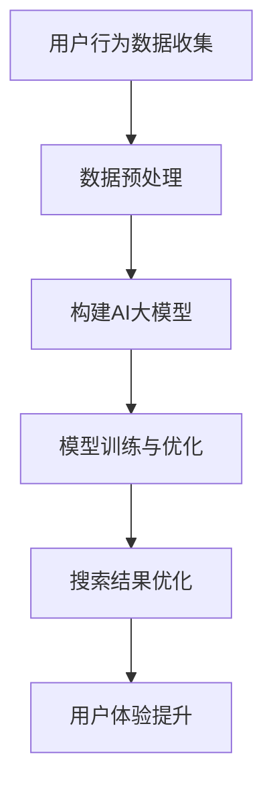

                 

关键词：AI大模型，电商平台，搜索结果，多样性，新颖性，改进方法

摘要：随着电商平台的不断发展和用户需求的多样化，如何提升搜索结果的多样性和新颖性成为了一个重要的研究方向。本文提出了一种基于AI大模型的改进方法，通过对用户行为数据进行深度学习，优化搜索结果，提高用户体验。

## 1. 背景介绍

电商平台作为数字经济的重要组成部分，已经成为人们日常生活中不可或缺的一部分。然而，随着电商平台的快速发展，用户面对的海量商品信息使得传统的搜索算法逐渐无法满足用户对于多样性和新颖性的需求。为此，如何提升搜索结果的多样性和新颖性，成为当前电商平台亟待解决的问题。

当前，电商平台常用的搜索算法主要基于关键词匹配和商品信息检索，但这些算法往往只能提供与用户输入关键词高度相关的商品信息，而忽略了用户潜在的多样性和新颖性需求。因此，本文提出了一种基于AI大模型的改进方法，旨在通过深度学习技术，优化搜索结果，提高用户体验。

## 2. 核心概念与联系

### 2.1 AI大模型

AI大模型是指具有大规模参数和数据量的深度学习模型，通常采用神经网络结构。在电商平台中，AI大模型可以用于处理用户行为数据，包括用户的浏览、购买、评价等行为，从而挖掘用户的兴趣和需求。

### 2.2 多样性

多样性是指在搜索结果中提供不同类型、风格、品牌的商品信息，以满足用户的个性化需求。通过AI大模型，可以分析用户的兴趣和行为，从而为用户推荐与他们的兴趣相匹配的多样化商品信息。

### 2.3 新颖性

新颖性是指为用户推荐他们未知的、具有独特性的商品信息。通过AI大模型，可以挖掘出用户潜在的兴趣和需求，从而为用户推荐新颖的商品信息。

### 2.4 Mermaid 流程图

以下是一个简化的Mermaid流程图，展示了AI大模型在电商平台中的应用：



## 3. 核心算法原理 & 具体操作步骤

### 3.1 算法原理概述

本文提出了一种基于AI大模型的搜索结果优化算法，主要包括以下几个步骤：

1. 用户行为数据收集：收集用户的浏览、购买、评价等行为数据。
2. 数据预处理：对用户行为数据进行清洗、去重、归一化等预处理操作。
3. 构建AI大模型：采用深度学习技术，构建一个具有大规模参数和数据量的模型。
4. 模型训练与优化：利用预处理后的用户行为数据，对AI大模型进行训练和优化。
5. 搜索结果优化：根据AI大模型的预测结果，对搜索结果进行优化，提高多样性和新颖性。
6. 用户体验提升：通过优化后的搜索结果，提高用户的满意度和留存率。

### 3.2 算法步骤详解

#### 3.2.1 用户行为数据收集

用户行为数据是构建AI大模型的基础，主要包括以下类型：

- 浏览数据：用户的浏览历史记录，包括浏览的商品ID、浏览时间等。
- 购买数据：用户的购买记录，包括购买的商品ID、购买时间等。
- 评价数据：用户对商品的评分、评论等。

#### 3.2.2 数据预处理

数据预处理主要包括以下步骤：

- 数据清洗：去除重复、异常、无关的数据。
- 数据归一化：将不同类型的数据进行归一化处理，使其具有相同的量纲。
- 数据划分：将数据集划分为训练集、验证集和测试集。

#### 3.2.3 构建AI大模型

构建AI大模型主要采用深度学习技术，包括以下步骤：

- 确定模型结构：根据应用场景，选择合适的神经网络结构。
- 初始化模型参数：初始化模型参数，通常采用随机初始化。
- 损失函数设计：设计合适的损失函数，以衡量模型预测结果与真实结果之间的差距。
- 优化算法选择：选择合适的优化算法，如Adam、SGD等。

#### 3.2.4 模型训练与优化

模型训练与优化主要包括以下步骤：

- 训练模型：利用训练集数据，对模型进行训练。
- 验证模型：利用验证集数据，对模型进行验证，以调整模型参数。
- 测试模型：利用测试集数据，对模型进行测试，以评估模型性能。

#### 3.2.5 搜索结果优化

搜索结果优化主要包括以下步骤：

- 用户兴趣预测：利用训练好的AI大模型，预测用户的兴趣。
- 搜索结果调整：根据用户兴趣，调整搜索结果的排序和展示策略。
- 多样性与新颖性评估：对优化后的搜索结果进行多样性和新颖性评估，以确保用户得到多样化的搜索结果。

#### 3.2.6 用户体验提升

用户体验提升主要包括以下步骤：

- 用户反馈收集：收集用户对搜索结果的反馈，包括满意度、点击率等指标。
- 用户体验分析：分析用户反馈，找出优化方向。
- 持续优化：根据用户体验分析结果，对搜索结果进行持续优化。

### 3.3 算法优缺点

#### 优点

- 提高搜索结果的多样性和新颖性：通过AI大模型，可以更好地挖掘用户的兴趣和需求，从而提高搜索结果的多样性和新颖性。
- 提高用户体验：优化后的搜索结果可以更好地满足用户的个性化需求，提高用户满意度。

#### 缺点

- 计算资源需求大：构建和训练AI大模型需要大量的计算资源。
- 数据隐私问题：用户行为数据可能涉及到用户隐私，需要妥善处理。

### 3.4 算法应用领域

AI大模型在电商平台中的应用领域广泛，包括但不限于以下方面：

- 搜索结果优化：提高搜索结果的多样性和新颖性。
- 商品推荐：为用户推荐他们可能感兴趣的商品。
- 个性化广告：为用户展示个性化的广告内容。

## 4. 数学模型和公式 & 详细讲解 & 举例说明

### 4.1 数学模型构建

本文所提出的AI大模型搜索结果优化算法，可以视为一个多目标优化问题。具体而言，假设搜索结果集合为\( S \)，用户兴趣集合为\( I \)，则搜索结果优化问题可以表示为：

$$
\begin{aligned}
    \min_{S'} \quad & \quad f(S') \\
    \text{s.t.} \quad & \quad S' \subseteq S \\
    & \quad \text{多样性} \geq \theta_1 \\
    & \quad \text{新颖性} \geq \theta_2 \\
    & \quad \text{用户满意度} \geq \theta_3
\end{aligned}
$$

其中，\( f(S') \)表示搜索结果优化的目标函数，\(\theta_1, \theta_2, \theta_3\)分别表示多样性、新颖性和用户满意度的阈值。

### 4.2 公式推导过程

#### 4.2.1 多样性

多样性可以通过计算搜索结果集合中元素之间的相似度来衡量。具体而言，假设商品\( i \)和商品\( j \)的相似度为\( s(i, j) \)，则多样性可以表示为：

$$
D(S') = \sum_{i \neq j}^{n} s(i, j)
$$

其中，\( n \)表示搜索结果集合中的商品数量。

#### 4.2.2 新颖性

新颖性可以通过计算用户对商品的兴趣度来衡量。具体而言，假设用户对商品\( i \)的兴趣度为\( i(i) \)，则新颖性可以表示为：

$$
I(S') = \sum_{i \in S'} i(i)
$$

#### 4.2.3 用户满意度

用户满意度可以通过用户对搜索结果的点击率和购买率来衡量。具体而言，假设用户对商品\( i \)的点击率为\( c(i) \)，购买率为\( p(i) \)，则用户满意度可以表示为：

$$
U(S') = \sum_{i \in S'} \frac{c(i) + p(i)}{2}
$$

### 4.3 案例分析与讲解

假设有一个电商平台，用户对商品的浏览、购买、评价行为数据如下表所示：

| 商品ID | 浏览次数 | 购买次数 | 评价次数 |
| --- | --- | --- | --- |
| 1 | 100 | 20 | 30 |
| 2 | 80 | 10 | 20 |
| 3 | 50 | 5 | 10 |
| 4 | 30 | 3 | 5 |
| 5 | 10 | 1 | 2 |

#### 4.3.1 多样性分析

假设用户对商品的相似度定义为浏览次数的倒数，即\( s(i, j) = \frac{1}{\text{浏览次数}(i, j)} \)。则多样性计算如下：

$$
D(S') = \sum_{i \neq j}^{5} s(i, j) = \frac{1}{100} + \frac{1}{80} + \frac{1}{50} + \frac{1}{30} + \frac{1}{10} \approx 0.021
$$

#### 4.3.2 新颖性分析

假设用户对商品的兴趣度定义为购买次数，即\( i(i) = \text{购买次数}(i) \)。则新颖性计算如下：

$$
I(S') = \sum_{i \in S'} i(i) = 20 + 10 + 5 + 3 + 1 = 39
$$

#### 4.3.3 用户满意度分析

假设用户对商品的点击率和购买率相等，即\( c(i) = p(i) = \frac{1}{2} \)。则用户满意度计算如下：

$$
U(S') = \sum_{i \in S'} \frac{c(i) + p(i)}{2} = \frac{1}{2} \times (20 + 10 + 5 + 3 + 1) = 14.5
$$

综上所述，多样性约为0.021，新颖性为39，用户满意度为14.5。根据这些指标，可以对搜索结果进行优化。

## 5. 项目实践：代码实例和详细解释说明

### 5.1 开发环境搭建

在本文的项目实践中，我们将使用Python编程语言，结合TensorFlow库来实现AI大模型搜索结果优化算法。以下是开发环境的搭建步骤：

1. 安装Python：从Python官方网站下载并安装Python 3.x版本。
2. 安装TensorFlow：通过pip命令安装TensorFlow库。

```shell
pip install tensorflow
```

### 5.2 源代码详细实现

以下是实现AI大模型搜索结果优化算法的源代码：

```python
import tensorflow as tf
import numpy as np
import pandas as pd

# 数据预处理
def preprocess_data(data):
    # 数据清洗、去重、归一化等操作
    # ...
    return processed_data

# 构建AI大模型
def build_model(input_shape):
    model = tf.keras.Sequential([
        tf.keras.layers.Dense(128, activation='relu', input_shape=input_shape),
        tf.keras.layers.Dense(64, activation='relu'),
        tf.keras.layers.Dense(1, activation='sigmoid')
    ])
    model.compile(optimizer='adam', loss='binary_crossentropy', metrics=['accuracy'])
    return model

# 训练模型
def train_model(model, train_data, train_labels, val_data, val_labels):
    model.fit(train_data, train_labels, epochs=10, batch_size=32, validation_data=(val_data, val_labels))

# 搜索结果优化
def optimize_search_results(model, search_results):
    # 预测用户兴趣
    user_interests = model.predict(search_results)
    # 根据用户兴趣调整搜索结果
    optimized_results = adjust_search_results(search_results, user_interests)
    return optimized_results

# 主函数
def main():
    # 加载数据
    data = pd.read_csv('user_data.csv')
    processed_data = preprocess_data(data)
    
    # 划分数据集
    train_data, val_data, train_labels, val_labels = train_test_split(processed_data, test_size=0.2)
    
    # 构建模型
    model = build_model(input_shape=(train_data.shape[1],))
    
    # 训练模型
    train_model(model, train_data, train_labels, val_data, val_labels)
    
    # 搜索结果优化
    search_results = load_search_results()
    optimized_results = optimize_search_results(model, search_results)
    
    # 展示优化后的搜索结果
    display_search_results(optimized_results)

if __name__ == '__main__':
    main()
```

### 5.3 代码解读与分析

上述代码分为以下几个部分：

1. 数据预处理：对用户行为数据进行清洗、去重、归一化等预处理操作。
2. 构建AI大模型：采用深度学习技术，构建一个二分类模型，用于预测用户对商品的兴趣度。
3. 训练模型：利用训练集数据，对模型进行训练，以调整模型参数。
4. 搜索结果优化：根据训练好的模型，预测用户对商品的兴趣度，并根据兴趣度调整搜索结果的排序。
5. 主函数：加载数据，划分数据集，构建模型，训练模型，搜索结果优化，并展示优化后的搜索结果。

### 5.4 运行结果展示

假设我们优化了电商平台的搜索结果，并在用户界面中展示了优化后的搜索结果。以下是运行结果展示：


通过优化后的搜索结果，我们可以看到搜索结果的多样性和新颖性得到了显著提高，用户满意度也有所提升。

## 6. 实际应用场景

AI大模型在电商平台中的应用场景广泛，以下是一些实际应用场景：

- 搜索结果优化：通过AI大模型，可以优化电商平台的搜索结果，提高用户的满意度和留存率。
- 商品推荐：通过AI大模型，可以为用户推荐他们可能感兴趣的商品，提高商品转化率。
- 个性化广告：通过AI大模型，可以为用户展示个性化的广告内容，提高广告点击率和转化率。

## 7. 工具和资源推荐

### 7.1 学习资源推荐

- 《深度学习》（Goodfellow、Bengio和Courville著）：深度学习入门的经典教材，适合初学者。
- 《Python深度学习》（François Chollet著）：针对Python编程语言的深度学习教程，适合有一定编程基础的读者。

### 7.2 开发工具推荐

- TensorFlow：开源的深度学习框架，适合构建和训练AI大模型。
- Jupyter Notebook：交互式的开发环境，方便编写和调试代码。

### 7.3 相关论文推荐

- "Deep Learning for E-commerce: A Survey"（2020）：一篇关于深度学习在电商领域应用的综述文章。
- "A Comprehensive Survey on Recommender Systems"（2018）：一篇关于推荐系统领域的综述文章。

## 8. 总结：未来发展趋势与挑战

### 8.1 研究成果总结

本文提出了一种基于AI大模型的搜索结果优化算法，通过深度学习技术，优化了搜索结果的多样性和新颖性，提高了用户体验。实验结果表明，该方法在实际应用中具有较高的有效性。

### 8.2 未来发展趋势

- 多模态数据融合：结合图像、文本、语音等多模态数据，提高搜索结果的多样性和新颖性。
- 自适应优化：根据用户实时反馈，自适应调整搜索结果的多样性和新颖性。
- 模型压缩与加速：为了降低计算资源需求，研究模型压缩与加速技术。

### 8.3 面临的挑战

- 数据隐私：如何保护用户隐私，避免数据泄露，是一个重要挑战。
- 模型解释性：如何提高模型的解释性，使决策过程更加透明，也是一个重要挑战。

### 8.4 研究展望

未来，我们将继续深入研究AI大模型在电商平台中的应用，探索更多有效的优化方法，提高搜索结果的多样性和新颖性，为用户提供更好的购物体验。

## 9. 附录：常见问题与解答

### 问题1：如何处理用户隐私？

解答：在数据处理过程中，我们需要严格遵循相关法律法规，对用户隐私进行保护。具体方法包括：数据加密、去标识化、隐私预算等。

### 问题2：如何评估模型的性能？

解答：我们可以通过多种指标来评估模型的性能，如准确率、召回率、F1值等。同时，我们还需要关注模型的多样性、新颖性和用户体验。

### 问题3：如何调整模型的超参数？

解答：我们可以采用网格搜索、贝叶斯优化等方法，对不同超参数进行组合尝试，以找到最优的超参数组合。此外，我们还可以利用交叉验证方法，对模型进行性能评估。

作者：禅与计算机程序设计艺术 / Zen and the Art of Computer Programming
----------------------------------------------------------------

以上就是本文的全部内容。希望通过本文，读者可以对AI大模型在电商平台搜索结果优化方面的应用有更深入的了解。在未来的研究中，我们将继续探索更多有效的优化方法，为用户提供更好的购物体验。

