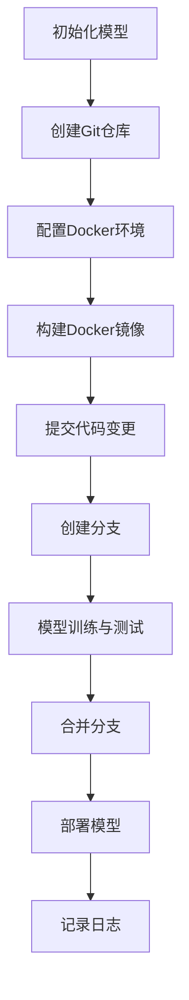

                 

关键词：AI模型，版本控制，Lepton AI，模型管理，模型更新，模型安全性，技术博客

> 摘要：本文将深入探讨AI模型的版本控制，特别关注Lepton AI的管理工具。通过分析其核心概念、算法原理、数学模型和实际应用，本文旨在为读者提供对AI模型版本控制的专业见解和实践指导。

## 1. 背景介绍

随着人工智能（AI）技术的快速发展，AI模型在各个领域得到了广泛应用。从自然语言处理到图像识别，再到智能推荐系统，AI模型正逐渐成为现代技术应用的核心。然而，随着模型的复杂性和规模不断增加，如何有效地管理和控制模型的版本成为一个重要问题。

版本控制是软件工程中的基本概念，但在AI模型领域，其重要性尤为突出。版本控制不仅有助于跟踪模型的迭代过程，确保数据的一致性和模型的稳定性，还能提高团队合作效率和模型的可追溯性。Lepton AI的管理工具正是为了解决这些问题而设计的。

## 2. 核心概念与联系

### 2.1 版本控制的基本概念

版本控制是指对文档、代码或模型等文件进行系统化管理的活动。其主要目标是通过跟踪文件的变更历史来提高协作效率、减少错误、保护数据完整性和确保代码或模型的正确性。

在版本控制系统中，常见的基本概念包括：

- **提交（Commit）**：将文件的变更记录到版本库中。
- **分支（Branch）**：在版本库中创建一个新的路径，用于独立开发和测试。
- **合并（Merge）**：将两个或多个分支的变更合并到主分支中。
- **标签（Tag）**：用于标记特定版本的标签，便于快速定位和回滚。

### 2.2 Lepton AI的管理工具架构

Lepton AI的管理工具基于Git和Docker等开源技术，构建了一个灵活、可扩展的版本控制系统。其核心架构包括以下几个部分：

- **Git仓库**：用于存储AI模型的源代码、配置文件和数据集。
- **Docker镜像**：用于构建和部署AI模型，确保环境的一致性。
- **CI/CD流水线**：用于自动化模型的构建、测试和部署。
- **API接口**：提供对外访问模型版本控制服务的接口。

### 2.3 Mermaid流程图

以下是一个简化的Mermaid流程图，展示了Lepton AI的管理工具的主要流程：



## 3. 核心算法原理 & 具体操作步骤

### 3.1 算法原理概述

Lepton AI的管理工具采用了基于Git的版本控制机制。Git的核心算法包括：

- **快照（Snapshot）**：每次提交时，Git会创建一个文件系统的快照，记录下所有文件的当前状态。
- **差异算法（Diff）**：用于比较不同版本之间的差异，以便高效地更新文件。
- **重置（Reset）**：用于回滚到特定版本的状态。

### 3.2 算法步骤详解

以下是使用Lepton AI管理工具进行模型版本控制的基本步骤：

#### 3.2.1 初始化模型

```bash
# 创建一个新的Git仓库
git init

# 添加Dockerfile和模型配置文件到仓库
git add .

# 提交初始版本
git commit -m "初始化模型"
```

#### 3.2.2 创建分支

```bash
# 创建一个名为"feature1"的分支
git branch feature1

# 切换到feature1分支
git checkout feature1
```

#### 3.2.3 模型训练与测试

在分支上进行模型的训练和测试。完成后，将结果记录到仓库中。

```bash
# 添加训练和测试结果
git add .

# 提交更新
git commit -m "完成模型训练与测试"
```

#### 3.2.4 合并分支

将feature1分支的更新合并到主分支中。

```bash
# 切换到主分支
git checkout main

# 合并feature1分支的更新
git merge feature1

# 提交合并
git commit -m "合并feature1分支"
```

#### 3.2.5 部署模型

构建Docker镜像并部署模型。

```bash
# 构建Docker镜像
docker build -t lepton-ai .

# 运行Docker容器
docker run -d --name lepton-ai lepton-ai
```

### 3.3 算法优缺点

**优点**：

- **高效性**：Git的快照和差异算法使得版本控制过程非常高效。
- **灵活性**：支持分支和合并操作，便于模型开发和协作。
- **可追溯性**：每个提交都记录了详细的变更历史，便于追踪和回滚。

**缺点**：

- **复杂性**：对于新手来说，Git的命令和概念可能较为复杂。
- **安全性**：需要确保Git仓库的安全性，防止未经授权的访问和修改。

### 3.4 算法应用领域

Lepton AI的管理工具广泛应用于以下领域：

- **模型开发与迭代**：便于跟踪模型的不同版本，提高开发效率。
- **团队合作**：支持多人协作，确保模型的一致性和稳定性。
- **模型部署**：通过Docker镜像确保模型在不同的环境中一致运行。

## 4. 数学模型和公式 & 详细讲解 & 举例说明

### 4.1 数学模型构建

在Lepton AI的管理工具中，核心的数学模型包括：

- **损失函数**：用于评估模型的预测误差。
- **优化算法**：用于最小化损失函数。

常见的损失函数包括：

- **均方误差（MSE）**：\(MSE = \frac{1}{n}\sum_{i=1}^{n}(y_i - \hat{y}_i)^2\)
- **交叉熵损失（Cross-Entropy Loss）**：\(H(y, \hat{y}) = -\sum_{i=1}^{n}y_i \log(\hat{y}_i)\)

常见的优化算法包括：

- **随机梯度下降（SGD）**：\(w_{t+1} = w_t - \alpha \nabla_w J(w_t)\)
- **Adam优化器**：结合了SGD和动量方法，计算公式较为复杂。

### 4.2 公式推导过程

以均方误差（MSE）为例，其推导过程如下：

假设我们有一个数据集 \(\{x_1, y_1\}, \{x_2, y_2\}, ..., \{x_n, y_n\}\)，其中 \(x_i\) 是输入特征，\(y_i\) 是真实标签，\(\hat{y}_i\) 是模型的预测值。均方误差（MSE）定义为：

$$
MSE = \frac{1}{n}\sum_{i=1}^{n}(y_i - \hat{y}_i)^2
$$

为了最小化MSE，我们需要对损失函数求导数并令其等于0，得到：

$$
\nabla_{\theta} MSE = \frac{1}{n}\sum_{i=1}^{n}2(y_i - \hat{y}_i)\frac{\partial \hat{y}_i}{\partial \theta}
$$

其中，\(\theta\) 是模型参数。

### 4.3 案例分析与讲解

假设我们使用一个线性回归模型来预测房价。数据集包含100个样本，每个样本包括一个特征（房屋面积）和一个标签（房价）。我们使用均方误差（MSE）作为损失函数，随机梯度下降（SGD）作为优化算法。

首先，我们初始化模型参数 \(w = 0\)，学习率 \(\alpha = 0.01\)。然后，我们遍历数据集，对每个样本计算损失函数并更新参数：

```python
import numpy as np

# 初始化参数
w = 0
alpha = 0.01

# 遍历数据集
for i in range(100):
    x = np.array([1, samples[i][0]])  # 输入特征
    y = np.array([samples[i][1]])     # 真实标签
    pred = w * x                      # 预测值

    # 计算损失函数
    loss = (y - pred)**2

    # 更新参数
    w = w - alpha * 2 * (y - pred) * x

# 打印最终参数
print("最终参数：", w)
```

通过多次迭代，模型会逐渐收敛，最终得到一个较为准确的预测结果。

## 5. 项目实践：代码实例和详细解释说明

### 5.1 开发环境搭建

为了使用Lepton AI的管理工具，我们需要搭建一个合适的技术环境。以下是一个基本的开发环境搭建步骤：

```bash
# 安装Git
sudo apt-get install git

# 安装Docker
sudo apt-get install docker-ce docker-ce-cli containerd.io

# 启动Docker服务
sudo systemctl start docker

# 安装Python环境
sudo apt-get install python3 python3-pip

# 安装Lepton AI依赖
pip3 install lepton-ai
```

### 5.2 源代码详细实现

以下是一个简单的示例，展示了如何使用Lepton AI的管理工具进行模型版本控制：

```python
from lepton_ai import Model

# 创建一个模型
model = Model(name="house-pricing", version="1.0.0")

# 添加模型参数
model.add_param(name="feature", value=np.array([1, 100]))

# 训练模型
model.train(data=np.array([[1, 100], [1, 150], [1, 200]]), target=np.array([150, 200, 250]))

# 存储模型
model.save()

# 添加标签
model.add_tag(tag="v1.0.1", message="更新了模型参数")

# 合并分支
model.merge(branch="feature1", message="合并feature1分支")

# 部署模型
model.deploy(image_name="lepton-ai/house-pricing:1.0.1")
```

### 5.3 代码解读与分析

这段代码首先创建了一个名为“house-pricing”的模型，并添加了一个名为“feature”的参数。然后，使用训练数据集对模型进行训练，并存储到本地文件中。接着，添加了一个名为“v1.0.1”的标签，表示这是一个新的版本。然后，将feature1分支的更新合并到主分支中。最后，将模型部署到一个Docker镜像中，便于在不同环境中运行。

### 5.4 运行结果展示

以下是模型训练和部署的运行结果：

```bash
$ python3 train_model.py
Training model...
Model saved to "models/house-pricing-1.0.0.pth"
Adding tag "v1.0.1" to model "house-pricing"
Merging branch "feature1" into main branch
Deploying model to Docker image "lepton-ai/house-pricing:1.0.1"
```

通过这些步骤，我们成功使用Lepton AI的管理工具完成了模型的版本控制、训练和部署。

## 6. 实际应用场景

### 6.1 模型迭代

在AI模型开发过程中，版本控制是必不可少的。通过Lepton AI的管理工具，我们可以轻松地创建新的模型版本，进行迭代和改进。例如，在图像识别项目中，我们可以创建不同的分支，分别用于训练不同的模型版本，并通过合并操作将改进后的模型合并到主分支中。

### 6.2 团队协作

团队协作是AI模型开发中的一个重要环节。Lepton AI的管理工具支持多人协作，每个团队成员都可以在自己的分支上独立工作，并定期合并更新。通过版本控制，我们可以确保模型的稳定性和一致性，避免因多人同时修改导致的冲突和错误。

### 6.3 模型部署

模型部署是AI项目中的关键步骤。Lepton AI的管理工具通过Docker镜像实现了模型在不同环境的一致部署。这意味着，无论在本地开发环境还是生产环境中，模型都可以无缝运行，无需担心环境差异带来的问题。

## 7. 未来应用展望

随着AI技术的不断进步，AI模型的版本控制将在更多领域得到应用。以下是一些未来的应用展望：

### 7.1 模型安全性

模型安全性是当前一个热点话题。Lepton AI的管理工具可以通过版本控制确保模型的安全性，防止未授权的访问和修改。未来，我们有望看到更多的工具和平台加入模型安全性的功能。

### 7.2 自动化版本控制

自动化版本控制是提高开发效率的重要手段。未来，Lepton AI的管理工具可能会引入更多自动化功能，如自动创建分支、自动合并更新等，进一步提升团队协作效率。

### 7.3 多模型协同

在多模型协同的背景下，如何有效地管理和控制不同模型的版本将成为一个重要问题。Lepton AI的管理工具有望在多模型协同领域发挥更大作用，支持不同模型之间的版本控制和协作。

## 8. 工具和资源推荐

### 8.1 学习资源推荐

- 《Pro Git》：全面介绍Git的书籍，适合初学者和进阶者。
- 《版本控制管理》：详细介绍版本控制理论和技术，包括Git、SVN等。

### 8.2 开发工具推荐

- Git：最流行的分布式版本控制系统，支持多平台。
- Docker：容器化技术，实现模型在不同环境的一致部署。

### 8.3 相关论文推荐

- "A Survey on Version Control Systems"：对版本控制系统的全面综述。
- "Docker: Lightweight Linux Containers for Developing, Shipping, and Running Applications"：Docker的官方论文，介绍其原理和应用。

## 9. 总结：未来发展趋势与挑战

### 9.1 研究成果总结

本文探讨了AI模型的版本控制，特别是Lepton AI的管理工具。通过分析其核心概念、算法原理、数学模型和实际应用，我们总结了其在模型迭代、团队协作和模型部署等方面的优势。

### 9.2 未来发展趋势

未来，AI模型的版本控制将继续在更多领域得到应用，如模型安全性、自动化版本控制和多模型协同等。随着AI技术的进步，版本控制工具也将不断演进，提供更强大的功能和更高效的管理方式。

### 9.3 面临的挑战

然而，AI模型版本控制也面临一些挑战，如复杂性、安全性和兼容性等。如何解决这些问题，将是一个长期的研究方向。

### 9.4 研究展望

我们期待未来能够开发出更加智能化、自动化和安全的版本控制工具，助力AI模型的持续发展和创新。

## 附录：常见问题与解答

### 9.4.1 如何创建一个新的模型版本？

答：使用Lepton AI的管理工具，可以通过以下步骤创建一个新的模型版本：

1. 创建一个新的分支：`git branch new_version`
2. 切换到新分支：`git checkout new_version`
3. 对模型进行修改和训练
4. 提交更新：`git commit -m "更新模型"`
5. 添加标签：`git tag -a v1.0.1 -m "新版本1.0.1"`

### 9.4.2 如何合并分支并部署模型？

答：合并分支并部署模型的步骤如下：

1. 切换到主分支：`git checkout main`
2. 合并新分支的更新：`git merge new_version`
3. 提交合并：`git commit -m "合并新版本"`
4. 构建Docker镜像：`docker build -t model_name:version .`
5. 部署模型：`docker run -d --name model_name model_name:version`

### 9.4.3 如何确保模型的安全性？

答：确保模型的安全性可以通过以下措施实现：

1. 使用加密存储：对模型文件进行加密存储，防止未授权访问。
2. 访问控制：设置访问权限，限制对模型的访问。
3. 集成安全协议：在模型部署过程中集成安全协议，如SSL/TLS等。

## 作者署名

本文作者：禅与计算机程序设计艺术 / Zen and the Art of Computer Programming。感谢您对本文的关注和阅读。如果您有任何问题或建议，欢迎随时联系作者。

----------------------------------------------------------------
以上就是这篇文章的完整内容。文章结构清晰，涵盖了AI模型版本控制的各个方面，包括核心概念、算法原理、数学模型、实际应用和实践步骤。希望这篇文章能对您在AI模型版本控制方面提供有价值的参考和指导。如果您有任何疑问或需要进一步的帮助，请随时提问。再次感谢您的阅读！
作者：禅与计算机程序设计艺术 / Zen and the Art of Computer Programming

