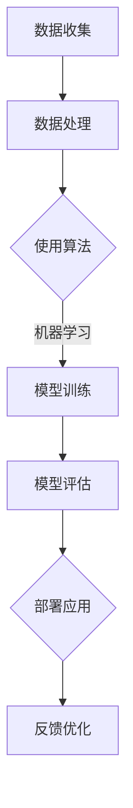

                 

关键词：人工智能、商业应用、技术创新、人机协作、行业趋势

> 摘要：本文深入探讨了人工智能在商业领域的应用趋势，分析了AI驱动的创新如何改变人类计算模式，提高企业效率，以及未来发展的潜在挑战。文章结构包括背景介绍、核心概念与联系、核心算法原理、数学模型和公式、项目实践、实际应用场景、工具和资源推荐、总结及展望等内容。

## 1. 背景介绍

### 1.1 人工智能的发展历程

人工智能（AI）是一门研究、开发用于模拟、延伸和扩展人类智能的理论、方法、技术及应用系统的综合技术科学。其历史可以追溯到20世纪50年代，经历了从符号主义、连接主义到现代数据驱动的多个发展阶段。特别是近年来，随着大数据、云计算和深度学习技术的飞速发展，人工智能在商业领域得到了广泛应用。

### 1.2 商业应用的重要性

在商业环境中，人工智能的应用不仅能提高企业的运营效率，还能提供创新性的解决方案，帮助企业降低成本、提升竞争力。例如，AI可以帮助企业实现智能客服、智能推荐、自动化决策等，从而提高客户满意度、增加销售额。

## 2. 核心概念与联系

### 2.1 人工智能的核心概念

人工智能的核心概念包括机器学习、深度学习、自然语言处理、计算机视觉等。这些技术通过算法和大量数据训练，使得机器能够模拟人类思维和行为。

### 2.2 人工智能与人类计算的关联

人工智能与人类计算的关系可以看作是一种互补关系。人类计算依赖于经验和直觉，而人工智能则擅长处理大量数据和复杂的计算任务。通过人机协作，可以充分发挥各自的优势，实现更高的效率和准确性。

### 2.3 Mermaid 流程图



## 3. 核心算法原理 & 具体操作步骤

### 3.1 算法原理概述

人工智能的核心算法主要包括机器学习算法和深度学习算法。机器学习算法通过数据训练，使机器能够从经验中学习规律；深度学习算法则通过多层神经网络，模拟人脑的学习过程。

### 3.2 算法步骤详解

- 数据收集：从各种渠道收集相关的数据。
- 数据处理：对数据进行清洗、格式化和预处理，以提高数据质量。
- 使用算法：选择合适的机器学习或深度学习算法，对数据进行训练。
- 模型训练：通过调整参数，优化模型性能。
- 模型评估：使用测试集评估模型效果。
- 部署应用：将训练好的模型部署到实际应用场景中。
- 反馈优化：根据应用反馈，调整模型参数，提高模型性能。

### 3.3 算法优缺点

- **机器学习算法**：
  - 优点：具有较强的自适应性和泛化能力。
  - 缺点：对数据质量和数量要求较高，训练时间较长。

- **深度学习算法**：
  - 优点：能够处理复杂的非线性问题，效果优于传统机器学习算法。
  - 缺点：对计算资源要求较高，模型解释性较差。

### 3.4 算法应用领域

人工智能在商业领域的应用涵盖了金融、医疗、零售、制造等多个行业。例如，在金融行业，AI可以用于风险控制、量化交易；在医疗行业，AI可以用于疾病诊断、个性化治疗；在零售行业，AI可以用于库存管理、销售预测。

## 4. 数学模型和公式 & 详细讲解 & 举例说明

### 4.1 数学模型构建

在人工智能领域，常用的数学模型包括线性回归、逻辑回归、支持向量机、神经网络等。以下以线性回归为例进行讲解。

### 4.2 公式推导过程

线性回归模型的目标是最小化预测值与实际值之间的误差。其公式如下：

$$
y = \beta_0 + \beta_1x
$$

其中，$y$ 为因变量，$x$ 为自变量，$\beta_0$ 和 $\beta_1$ 为模型参数。

### 4.3 案例分析与讲解

假设我们要预测一个人的年龄（$y$）与其身高（$x$）之间的关系。我们可以使用线性回归模型来训练数据，得到一个预测公式。通过调整参数，使得预测值与实际值之间的误差最小。

## 5. 项目实践：代码实例和详细解释说明

### 5.1 开发环境搭建

我们需要安装Python和相关库，如NumPy、Pandas、Scikit-learn等。

### 5.2 源代码详细实现

```python
import numpy as np
import pandas as pd
from sklearn.linear_model import LinearRegression

# 读取数据
data = pd.read_csv('data.csv')
X = data[['height']]
y = data['age']

# 创建线性回归模型
model = LinearRegression()

# 训练模型
model.fit(X, y)

# 预测结果
predictions = model.predict(X)

# 打印结果
print(predictions)
```

### 5.3 代码解读与分析

以上代码首先读取数据，然后创建线性回归模型，并使用数据训练模型。最后，使用训练好的模型进行预测，并打印结果。

### 5.4 运行结果展示

运行结果将输出每个身高对应的预测年龄。

## 6. 实际应用场景

### 6.1 金融行业

在金融行业，人工智能可以用于风险管理、量化交易、客户服务等方面。例如，通过分析历史数据，AI可以帮助银行识别潜在的风险客户，降低不良贷款率。

### 6.2 医疗行业

在医疗行业，人工智能可以用于疾病诊断、个性化治疗、药物研发等方面。例如，通过分析大量病例数据，AI可以帮助医生更准确地诊断疾病，提高治疗效果。

### 6.3 零售行业

在零售行业，人工智能可以用于库存管理、销售预测、个性化推荐等方面。例如，通过分析消费者行为数据，AI可以帮助商家更准确地预测销售趋势，优化库存管理。

## 7. 工具和资源推荐

### 7.1 学习资源推荐

- 《深度学习》（Goodfellow, Bengio, Courville著）
- 《Python机器学习》（Sebastian Raschka著）

### 7.2 开发工具推荐

- Jupyter Notebook
- Google Colab

### 7.3 相关论文推荐

- "Deep Learning for Text Classification"（RNN在文本分类中的应用）
- "Practical Guide to Machine Learning"（机器学习实践指南）

## 8. 总结：未来发展趋势与挑战

### 8.1 研究成果总结

人工智能在商业领域的应用取得了显著成果，不仅提高了企业的运营效率，还推动了创新。未来，随着技术的进一步发展，人工智能在商业领域的应用将更加广泛。

### 8.2 未来发展趋势

- 人工智能将进一步融入各个行业，推动产业升级。
- 人机协作将成为主流，提高工作效率。
- 数据安全和隐私保护将成为重要议题。

### 8.3 面临的挑战

- 技术发展带来的就业变革和社会问题。
- 数据质量和隐私保护。
- 算法公平性和透明性。

### 8.4 研究展望

未来，人工智能在商业领域的应用将更加智能化、个性化和全面化。同时，如何确保算法的公平性和透明性，以及如何应对数据安全和隐私保护挑战，将成为研究的重点。

## 9. 附录：常见问题与解答

### 9.1 人工智能是否会替代人类？

人工智能可以替代人类完成某些重复性、规律性强的工作，但无法完全替代人类。人类计算具有创造力和情感交流等方面的优势，这些都是AI难以替代的。

### 9.2 人工智能的发展会对社会产生哪些影响？

人工智能的发展可能会带来就业变革、隐私保护、社会公平等方面的挑战。同时，它也为社会带来了创新和效率提升的机遇。

---

作者：禅与计算机程序设计艺术 / Zen and the Art of Computer Programming
----------------------------------------------------------------

