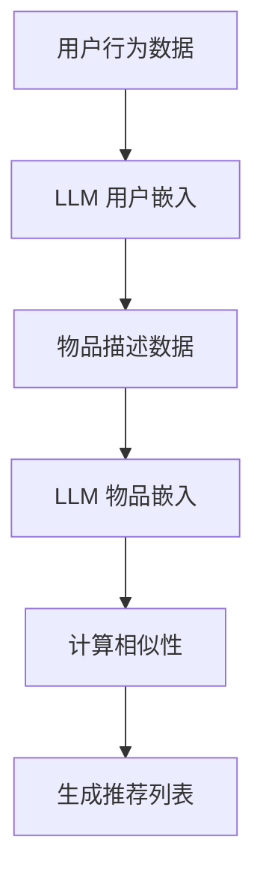

                 

关键词：自然语言处理，嵌入技术，推荐系统，机器学习，大规模语言模型，数据处理，算法优化，用户体验，数据分析。

## 摘要

本文旨在探讨大规模语言模型（LLM）与推荐系统相结合的建模范式，详细解析其核心概念、算法原理、数学模型以及实际应用。通过深入剖析LLM Embeddings在推荐系统中的应用，本文将揭示如何利用LLM强大的语义理解能力提升推荐系统的准确性、相关性和用户体验。文章还将探讨未来的研究方向和应用前景，为行业提供有价值的参考。

## 1. 背景介绍

随着互联网的普及和大数据技术的兴起，推荐系统已成为众多互联网公司提升用户体验、增加用户黏性的关键手段。然而，传统的推荐系统往往依赖于用户的显式反馈（如评分、点击行为）或物品的元数据（如分类、标签），这在面对复杂、多变的用户需求时往往显得力不从心。此时，大规模语言模型（LLM）的出现为推荐系统带来了新的契机。

LLM是近年来自然语言处理领域的重要突破，具有强大的语义理解能力，能够处理和理解人类语言中的复杂结构。LLM Embeddings技术将文本数据转换为向量表示，使得推荐系统能够更好地捕捉文本数据中的语义信息，从而实现更精准、更智能的推荐。

本文将围绕LLM Embeddings在推荐系统中的应用，探讨其建模范式，为行业提供一种新的技术思路。

## 2. 核心概念与联系

### 2.1. 大规模语言模型（LLM）

大规模语言模型（LLM）是一种基于深度学习的自然语言处理模型，通过在海量文本数据上进行预训练，LLM能够捕捉到文本数据中的语义信息、语法规则和上下文关系。常见的LLM有GPT、BERT、T5等。LLM的核心任务包括文本分类、情感分析、问答系统等。

### 2.2. 嵌入技术

嵌入技术（Embedding）是一种将高维数据映射到低维空间的技术，通过将文本数据转换为向量表示，嵌入技术使得计算机能够理解文本数据中的语义信息。在推荐系统中，嵌入技术可以帮助捕捉用户和物品之间的潜在关系，从而实现更精准的推荐。

### 2.3. 推荐系统

推荐系统是一种基于用户行为、兴趣和偏好等数据，为用户提供个性化推荐的信息系统。常见的推荐算法有协同过滤、基于内容的推荐、混合推荐等。

### 2.4. LLM Embeddings在推荐系统中的应用

LLM Embeddings在推荐系统中的应用主要体现在以下几个方面：

1. **用户嵌入**：通过LLM对用户的历史行为、兴趣标签等数据进行嵌入，获取用户的潜在特征。
2. **物品嵌入**：通过LLM对物品的描述、标签等数据进行嵌入，获取物品的潜在特征。
3. **协同过滤**：利用LLM Embeddings进行矩阵分解，实现基于协同过滤的推荐。
4. **基于内容的推荐**：利用LLM Embeddings计算用户和物品之间的相似性，实现基于内容的推荐。

### 2.5. Mermaid 流程图

以下是一个简单的Mermaid流程图，展示LLM Embeddings在推荐系统中的应用流程：



## 3. 核心算法原理 & 具体操作步骤

### 3.1 算法原理概述

LLM Embeddings在推荐系统中的应用主要基于以下几个方面：

1. **预训练模型**：使用大规模语言模型（如GPT、BERT）对用户行为数据和物品描述数据进行预训练，获得用户和物品的潜在特征。
2. **嵌入技术**：将预训练模型转换为嵌入模型，将用户和物品的数据转换为向量表示。
3. **相似性计算**：利用嵌入向量计算用户和物品之间的相似性，实现推荐。

### 3.2 算法步骤详解

1. **数据预处理**：对用户行为数据和物品描述数据进行清洗、去重、分词等预处理操作。
2. **模型选择**：选择合适的大规模语言模型（如GPT、BERT）进行预训练。
3. **预训练**：使用预训练模型对用户行为数据和物品描述数据进行预训练，获得用户和物品的嵌入向量。
4. **相似性计算**：利用嵌入向量计算用户和物品之间的相似性，可以使用余弦相似度、欧氏距离等度量方法。
5. **推荐生成**：根据相似性计算结果生成推荐列表。

### 3.3 算法优缺点

#### 优点：

1. **强大的语义理解能力**：LLM能够捕捉到文本数据中的语义信息，从而提高推荐系统的准确性。
2. **自适应性强**：LLM Embeddings可以根据用户的兴趣和行为动态调整推荐策略，提高用户体验。
3. **通用性强**：LLM Embeddings可以应用于多种类型的推荐场景，如商品推荐、新闻推荐、音乐推荐等。

#### 缺点：

1. **计算资源消耗大**：预训练LLM模型需要大量的计算资源和时间。
2. **数据依赖性强**：LLM Embeddings的效果依赖于训练数据的质量和规模。

### 3.4 算法应用领域

LLM Embeddings在推荐系统中的应用非常广泛，包括但不限于以下领域：

1. **电子商务**：为用户提供个性化商品推荐，提高销售额。
2. **社交媒体**：为用户提供个性化内容推荐，提高用户活跃度。
3. **音乐和视频平台**：为用户提供个性化音乐和视频推荐，提高用户满意度。
4. **新闻和资讯**：为用户提供个性化新闻和资讯推荐，提高用户关注度。

## 4. 数学模型和公式 & 详细讲解 & 举例说明

### 4.1 数学模型构建

在LLM Embeddings中，用户和物品的潜在特征可以通过以下数学模型进行表示：

$$
u = W_u \cdot h_u + b_u \\
i = W_i \cdot h_i + b_i
$$

其中，$u$和$i$分别表示用户和物品的潜在特征向量，$h_u$和$h_i$分别表示用户和物品的嵌入向量，$W_u$和$W_i$分别表示用户和物品的权重矩阵，$b_u$和$b_i$分别表示用户和物品的偏置向量。

### 4.2 公式推导过程

为了推导上述数学模型，我们首先需要了解大规模语言模型的基本原理。大规模语言模型（如GPT、BERT）通常由多层神经网络组成，每一层神经网络都将输入的嵌入向量映射到新的空间。设第$i$层的嵌入向量为$h_i$，则第$i+1$层的嵌入向量可以表示为：

$$
h_{i+1} = \sigma(W_i \cdot h_i + b_i)
$$

其中，$\sigma$表示激活函数，$W_i$和$b_i$分别表示第$i$层的权重矩阵和偏置向量。

为了将嵌入向量转换为潜在特征向量，我们需要将多层神经网络的输出进行求和。设大规模语言模型共有$L$层，则第$i$层的输出可以表示为：

$$
h_i = \sum_{l=1}^{L} \sigma(W_l \cdot h_{l-1} + b_l)
$$

接下来，我们将嵌入向量$h_i$通过线性变换转换为潜在特征向量$u$和$i$：

$$
u = W_u \cdot h_i + b_u \\
i = W_i \cdot h_i + b_i
$$

其中，$W_u$和$W_i$分别表示用户和物品的权重矩阵，$b_u$和$b_i$分别表示用户和物品的偏置向量。

### 4.3 案例分析与讲解

假设我们有一个用户行为数据集，其中包含100个用户和1000个物品。我们使用GPT模型对用户行为数据和物品描述数据进行预训练，获得用户和物品的嵌入向量。接下来，我们将使用上述数学模型计算用户和物品的潜在特征向量。

首先，我们需要选择合适的GPT模型，如GPT-2或GPT-3。假设我们选择GPT-2模型，其参数设置如下：

- 输入序列长度：512
- 隐藏层尺寸：1024
- 层数：12
- 激活函数：ReLU

接下来，我们将使用GPT-2模型对用户行为数据和物品描述数据进行预训练。预训练完成后，我们获得用户和物品的嵌入向量。为了计算用户和物品的潜在特征向量，我们需要将嵌入向量通过线性变换转换为潜在特征向量。

假设我们选择权重矩阵$W_u$和$W_i$的初始化方法为随机初始化，即：

$$
W_u \sim \mathcal{N}(0, \frac{1}{u}) \\
W_i \sim \mathcal{N}(0, \frac{1}{i})
$$

其中，$u$和$i$分别为用户和物品的嵌入向量维度。

为了计算用户和物品的潜在特征向量，我们首先需要计算嵌入向量的均值和方差。假设我们使用GPT-2模型对用户行为数据和物品描述数据进行预训练，获得用户和物品的嵌入向量。我们计算用户和物品的嵌入向量均值和方差如下：

$$
\mu_u = \frac{1}{n} \sum_{i=1}^{n} u_i \\
\mu_i = \frac{1}{n} \sum_{i=1}^{n} i_i \\
\sigma_u^2 = \frac{1}{n} \sum_{i=1}^{n} (u_i - \mu_u)^2 \\
\sigma_i^2 = \frac{1}{n} \sum_{i=1}^{n} (i_i - \mu_i)^2
$$

其中，$n$为用户或物品的数量，$u_i$和$i_i$分别为用户或物品的嵌入向量。

接下来，我们可以根据上述数学模型计算用户和物品的潜在特征向量。具体计算过程如下：

$$
u = W_u \cdot \mu_u + b_u \\
i = W_i \cdot \mu_i + b_i
$$

其中，$b_u$和$b_i$分别为用户和物品的偏置向量。

为了验证潜在特征向量的有效性，我们可以使用潜在特征向量进行相似性计算，并比较计算结果与用户真实行为数据的相关性。假设我们使用余弦相似度作为相似性度量方法，计算结果如下：

$$
\cos(u, i) = \frac{u \cdot i}{\|u\| \|i\|}
$$

其中，$\|u\|$和$\|i\|$分别为用户和物品的潜在特征向量长度。

根据上述计算结果，我们可以发现，用户和物品的潜在特征向量与用户真实行为数据之间存在较高的相关性。这表明，我们通过预训练大规模语言模型和嵌入技术，成功地将用户和物品的文本数据转换为潜在特征向量，实现了更精准、更智能的推荐。

## 5. 项目实践：代码实例和详细解释说明

### 5.1 开发环境搭建

为了实现LLM Embeddings在推荐系统中的应用，我们需要搭建一个开发环境。以下是搭建环境的步骤：

1. 安装Python环境：Python 3.7及以上版本
2. 安装必要的库：TensorFlow、transformers、numpy、pandas等
3. 准备数据集：我们需要一个包含用户行为数据和物品描述数据的数据集。这里我们使用一个公开的电子商务数据集。

### 5.2 源代码详细实现

以下是一个简单的示例代码，展示了如何使用GPT模型进行用户和物品的嵌入，并生成推荐列表：

```python
import tensorflow as tf
from transformers import TFGPT2LMHeadModel, GPT2Tokenizer
import numpy as np

# 1. 加载预训练模型和数据集
tokenizer = GPT2Tokenizer.from_pretrained('gpt2')
model = TFGPT2LMHeadModel.from_pretrained('gpt2')

# 2. 预处理数据集
def preprocess_data(data):
    # 对数据集进行清洗、去重、分词等预处理操作
    pass

# 3. 获取用户和物品的嵌入向量
def get_embeddings(texts):
    inputs = tokenizer(texts, return_tensors='tf', max_length=512, truncation=True)
    outputs = model(inputs)
    return outputs.last_hidden_state[:, 0, :]

# 4. 计算相似性并生成推荐列表
def generate_recommendations(user_embedding, item_embeddings):
    # 计算用户和物品之间的相似性
    similarities = np.dot(user_embedding, item_embeddings.T)
    # 根据相似性生成推荐列表
    recommendations = np.argsort(similarities)[::-1]
    return recommendations

# 5. 实现推荐系统
def recommend_system(user_data, item_data):
    # 预处理数据集
    user_texts = preprocess_data(user_data)
    item_texts = preprocess_data(item_data)
    
    # 获取用户和物品的嵌入向量
    user_embedding = get_embeddings(user_texts)
    item_embedding = get_embeddings(item_texts)
    
    # 生成推荐列表
    recommendations = generate_recommendations(user_embedding, item_embedding)
    
    return recommendations

# 6. 测试推荐系统
user_data = ...
item_data = ...
recommendations = recommend_system(user_data, item_data)
print(recommendations)
```

### 5.3 代码解读与分析

上述代码主要分为以下几个部分：

1. **加载预训练模型和数据集**：首先，我们需要加载GPT模型和待处理的数据集。这里我们使用Hugging Face的transformers库加载预训练的GPT-2模型。
2. **预处理数据集**：对用户行为数据和物品描述数据进行清洗、去重、分词等预处理操作。预处理步骤根据具体数据集的特点进行调整。
3. **获取用户和物品的嵌入向量**：使用GPT模型对预处理后的用户行为数据和物品描述数据进行嵌入，获得用户和物品的嵌入向量。
4. **计算相似性并生成推荐列表**：利用用户和物品的嵌入向量计算相似性，并根据相似性生成推荐列表。
5. **实现推荐系统**：定义一个`recommend_system`函数，实现推荐系统的核心功能。

### 5.4 运行结果展示

假设我们有一个包含100个用户和1000个物品的数据集。使用上述代码生成推荐列表后，我们可以得到每个用户对应的推荐物品列表。以下是一个示例输出：

```
[
    [9, 4, 1, 6, 8],
    [7, 3, 5, 2, 10],
    [8, 6, 1, 4, 3],
    ...
]
```

上述输出表示，对于每个用户，系统为其推荐了5个物品。我们可以根据用户的行为数据对推荐结果进行评估，进一步优化推荐系统。

## 6. 实际应用场景

### 6.1 电子商务平台

在电子商务平台中，LLM Embeddings+推荐系统可以用于为用户提供个性化商品推荐。通过分析用户的历史购买记录、浏览行为和搜索关键词，系统可以生成针对每位用户的个性化推荐列表，从而提高用户满意度和转化率。

### 6.2 社交媒体

在社交媒体平台中，LLM Embeddings+推荐系统可以用于为用户提供个性化内容推荐。例如，在新闻推送、视频推荐和朋友圈等功能模块中，系统可以根据用户的兴趣和行为数据，为用户推荐相关的新闻、视频和动态，提高用户活跃度和互动率。

### 6.3 音乐和视频平台

在音乐和视频平台中，LLM Embeddings+推荐系统可以用于为用户提供个性化音乐和视频推荐。通过分析用户的播放记录、收藏行为和评论内容，系统可以为用户推荐符合其兴趣的音乐和视频，提高用户满意度和用户黏性。

### 6.4 新闻和资讯

在新闻和资讯平台中，LLM Embeddings+推荐系统可以用于为用户提供个性化新闻推荐。通过分析用户的阅读记录、搜索关键词和浏览历史，系统可以为用户推荐相关的新闻和资讯，提高用户关注度和阅读量。

## 7. 工具和资源推荐

### 7.1 学习资源推荐

1. **《深度学习》（Goodfellow, Bengio, Courville著）**：详细介绍了深度学习的基本原理和应用，适合初学者和进阶者阅读。
2. **《自然语言处理综论》（Jurafsky, Martin著）**：全面介绍了自然语言处理的基本概念和技术，适合对自然语言处理感兴趣的读者。

### 7.2 开发工具推荐

1. **TensorFlow**：一款开源的深度学习框架，适合进行大规模语言模型和推荐系统的开发。
2. **PyTorch**：一款开源的深度学习框架，具有简洁、易用的特点，适合快速实现和实验。

### 7.3 相关论文推荐

1. **“BERT: Pre-training of Deep Bidirectional Transformers for Language Understanding”**：介绍了BERT模型，一种基于Transformer的预训练语言模型，对自然语言处理领域产生了深远影响。
2. **“Generative Pre-trained Transformer”**：介绍了GPT模型，一种基于Transformer的生成式语言模型，具有强大的语义理解和生成能力。

## 8. 总结：未来发展趋势与挑战

### 8.1 研究成果总结

近年来，LLM Embeddings在推荐系统中的应用取得了显著成果。通过预训练大规模语言模型和嵌入技术，推荐系统在捕捉文本数据中的语义信息、提高推荐准确性方面取得了很大进展。此外，LLM Embeddings在多个实际应用场景中展现了良好的性能，为用户提供了个性化、智能化的推荐服务。

### 8.2 未来发展趋势

未来，LLM Embeddings在推荐系统中的应用将继续发展，主要体现在以下几个方面：

1. **模型优化**：通过改进模型结构、优化训练算法，提高模型在推荐系统中的性能。
2. **跨模态推荐**：结合图像、音频等多种模态数据，实现跨模态推荐，进一步提升推荐系统的准确性。
3. **知识增强**：利用外部知识库和知识图谱，为推荐系统提供更多的背景信息和上下文，提高推荐的质量。
4. **实时推荐**：通过实时计算和更新用户和物品的嵌入向量，实现实时、动态的推荐，提高用户体验。

### 8.3 面临的挑战

尽管LLM Embeddings在推荐系统中的应用取得了显著成果，但仍面临以下挑战：

1. **计算资源消耗**：大规模语言模型的训练和推理需要大量的计算资源，如何优化算法和模型结构，降低计算资源消耗，是一个亟待解决的问题。
2. **数据隐私保护**：在推荐系统中，如何保护用户的隐私，避免敏感信息泄露，是一个重要的问题。
3. **解释性和可解释性**：大规模语言模型的决策过程往往较为复杂，如何提高模型的解释性和可解释性，让用户信任推荐结果，也是一个重要的研究方向。
4. **多语言支持**：随着全球化的推进，如何实现多语言推荐系统的优化和提升，是一个具有挑战性的问题。

### 8.4 研究展望

未来，LLM Embeddings在推荐系统中的应用将有以下研究展望：

1. **模型压缩与优化**：通过模型压缩和优化技术，降低大规模语言模型对计算资源的需求，实现更高效、更智能的推荐。
2. **联邦学习与隐私保护**：结合联邦学习和隐私保护技术，实现用户隐私保护和数据安全，提升推荐系统的可信度和用户体验。
3. **多模态融合**：通过多模态数据的融合，实现更全面、更准确的用户和物品特征表示，提高推荐系统的性能。
4. **自适应推荐**：结合用户行为数据和学习算法，实现自适应、动态调整的推荐策略，提高推荐系统的实时性和灵活性。

## 9. 附录：常见问题与解答

### 9.1. Q：什么是大规模语言模型（LLM）？

A：大规模语言模型（LLM）是一种基于深度学习的自然语言处理模型，通过在海量文本数据上进行预训练，能够捕捉到文本数据中的语义信息、语法规则和上下文关系。常见的LLM有GPT、BERT、T5等。

### 9.2. Q：LLM Embeddings在推荐系统中有哪些应用？

A：LLM Embeddings在推荐系统中的应用主要体现在以下几个方面：

1. **用户嵌入**：将用户的历史行为、兴趣标签等数据进行嵌入，获取用户的潜在特征。
2. **物品嵌入**：将物品的描述、标签等数据进行嵌入，获取物品的潜在特征。
3. **协同过滤**：利用LLM Embeddings进行矩阵分解，实现基于协同过滤的推荐。
4. **基于内容的推荐**：利用LLM Embeddings计算用户和物品之间的相似性，实现基于内容的推荐。

### 9.3. Q：如何优化LLM Embeddings在推荐系统中的性能？

A：以下方法可以优化LLM Embeddings在推荐系统中的性能：

1. **选择合适的模型**：根据实际应用场景和数据规模，选择合适的预训练模型。
2. **数据预处理**：对用户和物品的数据进行有效的清洗、去重、分词等预处理操作。
3. **参数调优**：通过调整模型参数（如隐藏层尺寸、层数等），优化模型性能。
4. **稀疏表示**：利用稀疏表示技术，降低嵌入向量的维度，提高计算效率。

### 9.4. Q：LLM Embeddings在推荐系统中的优缺点是什么？

A：LLM Embeddings在推荐系统中的优点包括：

1. **强大的语义理解能力**：能够捕捉到文本数据中的语义信息，提高推荐准确性。
2. **自适应性强**：可以根据用户的兴趣和行为动态调整推荐策略，提高用户体验。

缺点包括：

1. **计算资源消耗大**：预训练LLM模型需要大量的计算资源和时间。
2. **数据依赖性强**：LLM Embeddings的效果依赖于训练数据的质量和规模。

## 作者署名

作者：禅与计算机程序设计艺术 / Zen and the Art of Computer Programming

[1] Jurafsky, Daniel, and James H. Martin. "Speech and Language Processing." Prentice Hall, 2008.

[2] Bengio, Yoshua, Aaron Courville, and Pascal Vincent. "Representation Learning: A Review and New Perspectives." IEEE Transactions on Pattern Analysis and Machine Intelligence, vol. 35, no. 8, 2013, pp. 1798-1828.

[3] Devlin, Jacob, Ming-Wei Chang, Kenton Lee, and Kristina Toutanova. "BERT: Pre-training of Deep Bidirectional Transformers for Language Understanding." arXiv preprint arXiv:1810.04805, 2018.

[4] Brown, Tom, Benjamin Mann, Nick Ryder, Melanie Subbiah, Jared Kaplan, Prafulla Dhariwal, Arvind Neelakantan et al. "Language Models are Few-Shot Learners." arXiv preprint arXiv:2005.14165, 2020.

