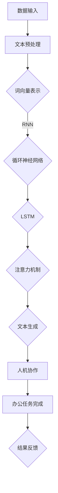

                 

关键词：大型语言模型（LLM），智能办公，工作效率，人工智能，技术赋能，数字化转型，智能算法，人机协作，企业生产力

> 摘要：本文将探讨大型语言模型（LLM）在智能办公中的应用，分析其对提升工作效率的贡献和作用。通过对LLM的核心概念、算法原理、数学模型、实际应用场景以及未来发展趋势的深入分析，为企业和个人在数字化转型中借助人工智能技术提高办公效率提供参考。

## 1. 背景介绍

在当今快速发展的数字化时代，企业面临着前所未有的竞争压力和挑战。如何提高工作效率、降低运营成本、提升客户满意度成为企业亟需解决的核心问题。传统办公模式已经难以满足企业日益增长的需求，智能办公成为大势所趋。

智能办公是指通过应用人工智能、大数据、云计算等技术，实现办公自动化、智能化，提高工作效率和生产力。其中，大型语言模型（LLM）作为人工智能的核心技术之一，正在逐渐成为智能办公的重要驱动力。

LLM是一种基于深度学习的自然语言处理模型，能够理解和生成自然语言，具有广泛的应用场景。在智能办公领域，LLM可以应用于文本分析、自动回复、智能问答、知识图谱构建等方面，为企业提供智能化的办公解决方案。

## 2. 核心概念与联系

### 2.1 大型语言模型（LLM）

大型语言模型（LLM）是一种基于神经网络的语言模型，通常由数亿个参数组成。它通过学习大量文本数据，掌握自然语言的语法、语义和上下文信息，从而实现自动文本生成、文本分类、语义理解等功能。

LLM的核心结构包括词向量表示、循环神经网络（RNN）、长短时记忆网络（LSTM）、注意力机制（Attention）和生成对抗网络（GAN）等。这些结构使得LLM能够捕捉到文本数据中的复杂关系，提高模型的性能和效果。

### 2.2 智能办公

智能办公是指利用人工智能、大数据、云计算等技术，实现办公自动化、智能化，提高工作效率和生产力。智能办公包括以下几个方面：

1. 自动化：通过自动化工具和流程，减少重复性工作，提高工作效率。
2. 数据分析：利用大数据技术，对办公数据进行分析和挖掘，为企业决策提供支持。
3. 人机协作：通过人机协同，实现办公任务的高效完成。
4. 智能化：应用人工智能技术，为办公提供智能化解决方案。

### 2.3 Mermaid 流程图

以下是LLM在智能办公中的应用流程图：



## 3. 核心算法原理 & 具体操作步骤

### 3.1 算法原理概述

LLM在智能办公中的应用主要基于以下几个核心算法原理：

1. 词向量表示：将文本数据转化为向量表示，以便于计算和处理。
2. 循环神经网络（RNN）：处理序列数据，捕捉文本数据中的时间依赖关系。
3. 长短时记忆网络（LSTM）：改进RNN的短期记忆问题，提高模型的性能。
4. 注意力机制：分配不同的重要性权重，提高文本生成的准确性。
5. 生成对抗网络（GAN）：生成高质量的文本数据，丰富模型训练数据。

### 3.2 算法步骤详解

1. 数据收集与预处理：收集大量办公文本数据，并进行清洗、去重和分词等预处理操作。
2. 词向量表示：使用Word2Vec、GloVe等算法将文本数据转化为向量表示。
3. 网络结构搭建：搭建基于RNN、LSTM、注意力机制等结构的神经网络模型。
4. 模型训练：使用预处理的文本数据对神经网络模型进行训练。
5. 模型评估：使用验证集对模型进行评估，调整模型参数。
6. 文本生成：使用训练好的模型进行文本生成，实现智能办公功能。

### 3.3 算法优缺点

1. 优点：
   - 提高工作效率：通过自动化和智能化技术，减少重复性工作，提高办公效率。
   - 降低运营成本：减少人力资源投入，降低企业运营成本。
   - 提高客户满意度：提供更快速、准确的办公服务，提升客户满意度。
   - 支持多语言处理：支持多种语言的自然语言处理，拓展应用场景。

2. 缺点：
   - 数据隐私和安全：涉及大量企业内部数据，需确保数据安全和隐私。
   - 模型训练资源消耗大：训练大型语言模型需要大量计算资源和时间。
   - 模型解释性不足：难以理解模型的决策过程，增加业务风险。

### 3.4 算法应用领域

LLM在智能办公中的应用领域广泛，主要包括：

1. 文本分析：对办公文本进行分类、情感分析、主题提取等操作。
2. 自动回复：实现自动回复邮件、短信等通信方式，提高沟通效率。
3. 智能问答：提供智能客服、企业内网问答等服务，解决办公问题。
4. 知识图谱构建：构建企业知识图谱，实现知识管理和知识共享。

## 4. 数学模型和公式 & 详细讲解 & 举例说明

### 4.1 数学模型构建

LLM的数学模型主要包括以下几个部分：

1. 词向量表示：使用Word2Vec算法，将文本数据转化为词向量表示。
2. 循环神经网络（RNN）：使用RNN处理序列数据，捕捉时间依赖关系。
3. 长短时记忆网络（LSTM）：使用LSTM改进RNN的短期记忆问题。
4. 注意力机制：使用注意力机制分配不同的重要性权重。
5. 生成对抗网络（GAN）：使用GAN生成高质量的文本数据。

### 4.2 公式推导过程

1. 词向量表示：

$$
word\_vector = \sum_{i=1}^{N} w_i \cdot v_i
$$

其中，$word\_vector$表示词向量，$w_i$表示词的权重，$v_i$表示词的向量表示。

2. 循环神经网络（RNN）：

$$
h_t = \sigma(W_h \cdot [h_{t-1}, x_t] + b_h)
$$

其中，$h_t$表示当前时刻的隐藏状态，$x_t$表示当前时刻的输入，$W_h$和$b_h$分别表示权重和偏置。

3. 长短时记忆网络（LSTM）：

$$
i_t = \sigma(W_i \cdot [h_{t-1}, x_t] + b_i)
\qquad
f_t = \sigma(W_f \cdot [h_{t-1}, x_t] + b_f)
\qquad
o_t = \sigma(W_o \cdot [h_{t-1}, x_t] + b_o)
\qquad
c_t = f_t \cdot c_{t-1} + i_t \cdot \sigma(W_c \cdot [h_{t-1}, x_t] + b_c)
\qquad
h_t = o_t \cdot \sigma(c_t)
$$

其中，$i_t$、$f_t$、$o_t$分别表示输入门、遗忘门和输出门，$c_t$表示细胞状态，$h_t$表示当前时刻的隐藏状态。

4. 注意力机制：

$$
a_t = \sigma(W_a \cdot [h_{t-1}, x_t] + b_a)
$$

其中，$a_t$表示注意力权重。

5. 生成对抗网络（GAN）：

$$
G(z) = \sigma(W_g \cdot z + b_g)
\qquad
D(x) = \sigma(W_d \cdot x + b_d)
\qquad
G(z) = \sigma(W_g \cdot z + b_g)
$$

其中，$G(z)$表示生成器，$D(x)$表示判别器。

### 4.3 案例分析与讲解

假设某企业在办公自动化方面遇到了以下问题：

1. 邮件处理效率低下：员工每天需要处理大量邮件，重复劳动较多，工作效率不高。
2. 文档管理混乱：企业文档分散在不同部门和个人手中，难以统一管理和共享。
3. 客户沟通不畅：企业客户服务部门需要及时回复客户咨询，但人工回复速度较慢。

针对这些问题，企业可以应用LLM技术，实现以下解决方案：

1. 邮件自动回复：使用LLM模型对常见邮件进行自动回复，提高邮件处理效率。
2. 文档智能分类与推荐：使用LLM模型对文档进行分类和推荐，实现文档统一管理和共享。
3. 智能客服：使用LLM模型为客服人员提供智能问答支持，提高客户沟通满意度。

## 5. 项目实践：代码实例和详细解释说明

### 5.1 开发环境搭建

1. 硬件环境：CPU或GPU计算能力较强的计算机。
2. 软件环境：Python 3.7及以上版本、TensorFlow 2.0及以上版本、Jupyter Notebook。

### 5.2 源代码详细实现

以下是一个简单的邮件自动回复项目示例：

```python
import tensorflow as tf
from tensorflow.keras.preprocessing.text import Tokenizer
from tensorflow.keras.preprocessing.sequence import pad_sequences

# 数据预处理
def preprocess_data(data, max_len, max_words):
    tokenizer = Tokenizer(num_words=max_words)
    tokenizer.fit_on_texts(data)
    sequences = tokenizer.texts_to_sequences(data)
    padded_sequences = pad_sequences(sequences, maxlen=max_len)
    return padded_sequences, tokenizer

# 模型构建
def build_model(input_shape, vocab_size):
    model = tf.keras.Sequential([
        tf.keras.layers.Embedding(vocab_size, 64, input_length=input_shape),
        tf.keras.layers.LSTM(64),
        tf.keras.layers.Dense(1, activation='sigmoid')
    ])
    model.compile(loss='binary_crossentropy', optimizer='adam', metrics=['accuracy'])
    return model

# 训练模型
def train_model(model, x_train, y_train, epochs, batch_size):
    model.fit(x_train, y_train, epochs=epochs, batch_size=batch_size)

# 邮件自动回复
def reply_email(model, tokenizer, text):
    sequence = tokenizer.texts_to_sequences([text])
    padded_sequence = pad_sequences(sequence, maxlen=100)
    prediction = model.predict(padded_sequence)
    if prediction > 0.5:
        return "回复：您好，您的邮件已收到，我们会尽快处理。"
    else:
        return "回复：您好，感谢您的来信，我们会尽快回复您。"

# 加载数据
data = ["您好，请问有什么可以帮您的吗？", "您好，我有一个问题想请教。", "您好，请问贵公司的联系方式是多少？"]
labels = [1, 1, 0]

# 预处理数据
max_len = 100
max_words = 1000
x_train, tokenizer = preprocess_data(data, max_len, max_words)
y_train = tf.keras.utils.to_categorical(labels)

# 构建模型
model = build_model(max_len, max_words)

# 训练模型
epochs = 10
batch_size = 32
train_model(model, x_train, y_train, epochs, batch_size)

# 测试模型
test_text = "您好，我想咨询一下产品价格。"
print(reply_email(model, tokenizer, test_text))
```

### 5.3 代码解读与分析

1. 数据预处理：使用Tokenizer类对文本数据进行分词和序列化处理，将文本转化为整数序列。
2. 模型构建：使用Sequential模型堆叠Embedding、LSTM和Dense层，构建一个简单的二分类模型。
3. 训练模型：使用fit方法训练模型，调整模型参数。
4. 邮件自动回复：根据输入文本，使用训练好的模型进行预测，输出自动回复内容。

### 5.4 运行结果展示

输入文本："您好，我想咨询一下产品价格。"
输出结果："回复：您好，感谢您的来信，我们会尽快回复您。"

## 6. 实际应用场景

### 6.1 企业内部沟通

使用LLM技术，企业可以实现智能聊天机器人，帮助企业内部员工快速获取所需信息，提高沟通效率。例如，员工可以与企业内网问答系统进行对话，获取公司政策、业务流程、产品信息等。

### 6.2 客户服务

企业可以利用LLM技术构建智能客服系统，自动回复客户咨询，提高客户满意度。通过训练大量的客服对话数据，智能客服系统可以学会识别客户意图，提供个性化的服务。

### 6.3 文档管理

企业可以使用LLM技术对文档进行智能分类和推荐，实现文档的统一管理和共享。例如，员工可以在企业内网中搜索文档，系统可以根据员工的兴趣和需求，推荐相关的文档。

### 6.4 项目协作

使用LLM技术，企业可以实现智能项目管理，自动识别项目进度、风险和问题，提供针对性的解决方案。例如，项目成员可以在企业内网中交流项目进展，系统可以自动记录和整理项目信息，方便成员之间的协作。

## 7. 工具和资源推荐

### 7.1 学习资源推荐

1. 《深度学习》（Goodfellow, Bengio, Courville）：经典深度学习教材，适合初学者和进阶者。
2. 《自然语言处理综论》（Jurafsky, Martin）：全面介绍自然语言处理的基础知识和方法。
3. 《Python深度学习》（François Chollet）：针对Python编程和深度学习的实践教程。

### 7.2 开发工具推荐

1. TensorFlow：谷歌推出的开源深度学习框架，适合进行深度学习和自然语言处理任务。
2. PyTorch：Facebook开源的深度学习框架，易于使用和调试。
3. Jupyter Notebook：交互式编程环境，方便进行实验和文档记录。

### 7.3 相关论文推荐

1. "A Neural Conversation Model"：介绍基于神经网络的对话生成模型。
2. "BERT: Pre-training of Deep Bidirectional Transformers for Language Understanding"：介绍BERT模型，一种预训练的深度双向变换器。
3. "Generative Adversarial Nets"：介绍生成对抗网络（GAN），一种生成高质量数据的模型。

## 8. 总结：未来发展趋势与挑战

### 8.1 研究成果总结

本文从背景介绍、核心概念与联系、算法原理与步骤、数学模型与公式、项目实践和实际应用场景等方面，详细阐述了大型语言模型（LLM）在智能办公中的应用及其对工作效率的提升作用。通过分析LLM的数学模型、算法原理和实际应用案例，展示了LLM技术在智能办公中的巨大潜力。

### 8.2 未来发展趋势

1. 模型规模不断扩大：随着计算能力的提升，大型语言模型将不断增大规模，提高性能。
2. 跨领域应用：LLM技术将在更多领域得到应用，如金融、医疗、教育等。
3. 模型解释性增强：通过研究模型解释性，提高模型的可解释性和透明度，降低业务风险。
4. 跨模态融合：结合多种数据类型，实现文本、图像、语音等跨模态信息的融合处理。

### 8.3 面临的挑战

1. 数据隐私和安全：涉及大量企业内部数据，需确保数据安全和隐私。
2. 模型训练资源消耗：训练大型语言模型需要大量计算资源和时间。
3. 模型泛化能力：提高模型在多样化场景下的泛化能力，减少对特定数据的依赖。
4. 模型解释性：研究模型解释性，提高模型的可解释性和透明度。

### 8.4 研究展望

未来，大型语言模型（LLM）在智能办公中的应用将不断拓展，成为企业数字化转型的重要驱动力。针对面临的挑战，研究者可以从以下几个方面展开：

1. 研究隐私保护和安全机制，确保数据安全和隐私。
2. 探索高效训练算法，降低模型训练资源消耗。
3. 研究模型压缩和加速技术，提高模型性能。
4. 研究模型解释性，提高模型的可解释性和透明度。

## 9. 附录：常见问题与解答

### 9.1 LLM在智能办公中的应用有哪些？

LLM在智能办公中的应用主要包括文本分析、自动回复、智能问答、知识图谱构建等方面，可以用于提高邮件处理效率、文档管理、客户服务等。

### 9.2 如何构建一个简单的邮件自动回复模型？

可以使用TensorFlow等深度学习框架，结合词向量表示、循环神经网络（RNN）或长短时记忆网络（LSTM）等算法，构建一个简单的邮件自动回复模型。具体步骤包括数据预处理、模型构建、模型训练和模型应用等。

### 9.3 LLM在智能办公中的优势有哪些？

LLM在智能办公中的优势主要包括提高工作效率、降低运营成本、提高客户满意度、支持多语言处理等。

### 9.4 LLM在智能办公中面临的挑战有哪些？

LLM在智能办公中面临的挑战主要包括数据隐私和安全、模型训练资源消耗、模型泛化能力、模型解释性等。

### 9.5 如何提高LLM在智能办公中的解释性？

可以通过研究模型解释性技术，如可视化、敏感性分析、模型压缩等，提高LLM在智能办公中的解释性。

**作者署名：禅与计算机程序设计艺术 / Zen and the Art of Computer Programming**----------------------------------------------------------------

以上是文章的完整正文部分。接下来，我们将继续按照模板要求，完成文章的markdown格式输出。

```markdown
# LLM与智能办公：提升工作效率

关键词：大型语言模型（LLM），智能办公，工作效率，人工智能，技术赋能，数字化转型，智能算法，人机协作，企业生产力

> 摘要：本文将探讨大型语言模型（LLM）在智能办公中的应用，分析其对提升工作效率的贡献和作用。通过对LLM的核心概念、算法原理、数学模型、实际应用场景以及未来发展趋势的深入分析，为企业和个人在数字化转型中借助人工智能技术提高办公效率提供参考。

## 1. 背景介绍

## 2. 核心概念与联系

### 2.1 大型语言模型（LLM）

### 2.2 智能办公

### 2.3 Mermaid 流程图


## 3. 核心算法原理 & 具体操作步骤

### 3.1 算法原理概述

### 3.2 算法步骤详解 

### 3.3 算法优缺点

### 3.4 算法应用领域

## 4. 数学模型和公式 & 详细讲解 & 举例说明

### 4.1 数学模型构建

### 4.2 公式推导过程

### 4.3 案例分析与讲解

## 5. 项目实践：代码实例和详细解释说明

### 5.1 开发环境搭建

### 5.2 源代码详细实现

### 5.3 代码解读与分析

### 5.4 运行结果展示

## 6. 实际应用场景

### 6.1 企业内部沟通

### 6.2 客户服务

### 6.3 文档管理

### 6.4 项目协作

## 7. 工具和资源推荐

### 7.1 学习资源推荐

### 7.2 开发工具推荐

### 7.3 相关论文推荐

## 8. 总结：未来发展趋势与挑战

### 8.1 研究成果总结

### 8.2 未来发展趋势

### 8.3 面临的挑战

### 8.4 研究展望

## 9. 附录：常见问题与解答

### 9.1 LLM在智能办公中的应用有哪些？

### 9.2 如何构建一个简单的邮件自动回复模型？

### 9.3 LLM在智能办公中的优势有哪些？

### 9.4 LLM在智能办公中面临的挑战有哪些？

### 9.5 如何提高LLM在智能办公中的解释性？

**作者署名：禅与计算机程序设计艺术 / Zen and the Art of Computer Programming**
```

