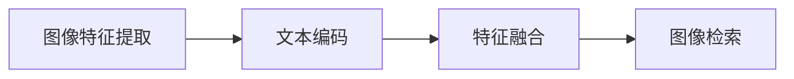

                 

关键词：大型语言模型，图像检索，深度学习，计算机视觉，自然语言处理，AI应用

摘要：随着深度学习和自然语言处理技术的不断发展，大型语言模型（LLM）在图像检索领域的应用逐渐受到关注。本文将探讨LLM在图像检索中的应用原理、算法实现、数学模型以及实际应用案例，同时分析未来发展趋势和面临的挑战。

## 1. 背景介绍

图像检索是一种基于内容的图像识别技术，通过分析图像的特征来查找与给定图像相似的图像。传统的图像检索方法主要依赖于图像本身的特征，如颜色、纹理、形状等，但这些方法往往难以处理复杂场景和多模态数据。随着深度学习技术的发展，卷积神经网络（CNN）在图像特征提取方面取得了显著成果。然而，由于图像特征与自然语言描述之间存在巨大的语义鸿沟，如何将图像特征与自然语言描述进行有效融合，从而提高图像检索的准确性和用户体验，成为当前研究的热点。

大型语言模型（LLM），如GPT、BERT等，在自然语言处理领域取得了显著的成果。这些模型具有强大的语义理解能力，能够对自然语言进行精确的建模。近年来，研究人员开始探索将LLM应用于图像检索领域，通过将图像特征与自然语言描述进行融合，实现更准确的图像检索。

## 2. 核心概念与联系

### 2.1 大型语言模型（LLM）的基本原理

大型语言模型（LLM）是一种基于深度学习的自然语言处理模型，其主要目标是从大量文本数据中学习语言规律，从而实现文本生成、文本分类、问答系统等任务。LLM的基本原理包括以下几个关键部分：

1. **词嵌入（Word Embedding）**：将自然语言中的词汇映射到高维向量空间，以便于计算机处理。
2. **变换器（Transformer）**：一种基于自注意力机制的神经网络结构，能够自适应地关注文本中的不同部分，从而提高模型的表达能力。
3. **预训练（Pre-training）**：在大量未标注的文本数据上进行预训练，使模型具备一定的语义理解能力。
4. **微调（Fine-tuning）**：在特定任务上对模型进行微调，使其在特定任务上取得更好的性能。

### 2.2 图像特征提取与表示

图像特征提取是图像检索的重要环节。传统的图像特征提取方法包括SIFT、SURF、HOG等，但这些方法难以处理复杂场景和多模态数据。随着深度学习技术的发展，卷积神经网络（CNN）在图像特征提取方面取得了显著成果。CNN的基本原理是通过多层卷积、池化等操作，将图像映射到高维向量空间，从而提取出具有区分性的图像特征。

### 2.3 LLM与图像特征融合的流程

LLM与图像特征融合的流程主要包括以下几个步骤：

1. **图像特征提取**：使用CNN提取给定图像的特征向量。
2. **文本编码**：使用LLM对自然语言描述进行编码，得到对应的文本向量。
3. **特征融合**：将图像特征向量和文本向量进行融合，得到最终的检索特征向量。
4. **图像检索**：使用检索特征向量在图像数据库中查找相似的图像。

### 2.4 Mermaid流程图

下面是一个简单的Mermaid流程图，描述了LLM与图像特征融合的流程：



## 3. 核心算法原理 & 具体操作步骤

### 3.1 算法原理概述

LLM在图像检索中的应用主要是通过将图像特征与自然语言描述进行融合，从而提高图像检索的准确性。具体原理如下：

1. **图像特征提取**：使用CNN提取给定图像的特征向量。
2. **文本编码**：使用LLM对自然语言描述进行编码，得到对应的文本向量。
3. **特征融合**：将图像特征向量和文本向量进行融合，得到最终的检索特征向量。常见的融合方法有矩阵乘法、拼接等。
4. **图像检索**：使用检索特征向量在图像数据库中查找相似的图像。常见的检索方法有最近邻搜索、K最近邻搜索等。

### 3.2 算法步骤详解

1. **图像特征提取**：使用预训练的CNN模型，如ResNet、VGG等，对给定图像进行特征提取，得到特征向量。
2. **文本编码**：使用预训练的LLM模型，如GPT、BERT等，对自然语言描述进行编码，得到对应的文本向量。
3. **特征融合**：将图像特征向量和文本向量进行融合。以矩阵乘法为例，假设图像特征向量为A，文本向量为B，则融合后的特征向量为C = A * B^T。
4. **图像检索**：使用检索特征向量在图像数据库中查找相似的图像。以最近邻搜索为例，计算给定图像的检索特征向量与数据库中所有图像的检索特征向量之间的相似度，选取相似度最高的图像作为检索结果。

### 3.3 算法优缺点

**优点**：

1. **准确性高**：通过将图像特征与自然语言描述进行融合，可以充分利用两者的信息，从而提高图像检索的准确性。
2. **灵活性高**：可以使用不同的CNN和LLM模型，根据具体任务的需求进行调整。

**缺点**：

1. **计算量大**：图像特征提取和文本编码过程都需要大量的计算资源。
2. **存储空间大**：预训练的CNN和LLM模型通常需要大量的存储空间。

### 3.4 算法应用领域

LLM在图像检索领域的应用主要包括以下几个方面：

1. **社交媒体图像检索**：帮助用户在社交媒体平台上查找与特定自然语言描述相似的图像。
2. **医疗图像检索**：帮助医生在医学图像库中查找与特定自然语言描述相似的病例。
3. **娱乐图像检索**：帮助用户在视频、游戏等娱乐场景中查找与特定自然语言描述相似的图像。

## 4. 数学模型和公式

### 4.1 数学模型构建

在LLM与图像特征融合的过程中，主要涉及以下数学模型：

1. **图像特征提取模型**：假设输入图像为X，输出特征向量为F，则CNN模型可以表示为：

   $$ F = \text{CNN}(X) $$

2. **文本编码模型**：假设输入自然语言描述为Y，输出文本向量为V，则LLM模型可以表示为：

   $$ V = \text{LLM}(Y) $$

3. **特征融合模型**：假设图像特征向量为F，文本向量为V，则特征融合模型可以表示为：

   $$ C = F \odot V^T $$

   其中，$\odot$表示特征融合操作，如矩阵乘法。

### 4.2 公式推导过程

1. **图像特征提取**：

   假设输入图像为X，经过CNN模型后，得到特征向量F。CNN模型可以表示为：

   $$ F = \sum_{i=1}^{n} W_i \odot X_i $$

   其中，$W_i$表示第i层CNN的权重，$X_i$表示输入图像经过第i层CNN操作后的特征。

2. **文本编码**：

   假设输入自然语言描述为Y，经过LLM模型后，得到文本向量V。LLM模型可以表示为：

   $$ V = \sum_{i=1}^{n} W_i \odot Y_i $$

   其中，$W_i$表示第i层LLM的权重，$Y_i$表示输入自然语言描述经过第i层LLM操作后的特征。

3. **特征融合**：

   假设图像特征向量为F，文本向量为V，则特征融合模型可以表示为：

   $$ C = F \odot V^T $$

   其中，$\odot$表示特征融合操作，如矩阵乘法。

### 4.3 案例分析与讲解

以社交媒体图像检索为例，假设用户输入自然语言描述为“一张美丽的风景图片”，我们需要在图像数据库中查找与该描述相似的图像。

1. **图像特征提取**：

   使用预训练的ResNet模型对图像进行特征提取，得到特征向量F。

2. **文本编码**：

   使用预训练的BERT模型对自然语言描述进行编码，得到文本向量V。

3. **特征融合**：

   将图像特征向量F和文本向量V进行融合，得到检索特征向量C。

4. **图像检索**：

   使用检索特征向量C在图像数据库中查找相似的图像，选取相似度最高的图像作为检索结果。

通过上述步骤，我们可以实现基于LLM的社交媒体图像检索。在实际应用中，可以根据具体需求调整CNN和LLM模型，以提高检索准确性。

## 5. 项目实践：代码实例和详细解释说明

### 5.1 开发环境搭建

1. **硬件环境**：

   - CPU：Intel i7 或以上
   - GPU：NVIDIA GTX 1080 或以上
   - 内存：16GB 或以上

2. **软件环境**：

   - 操作系统：Windows、Linux 或 macOS
   - Python 版本：3.7 或以上
   - 深度学习框架：TensorFlow 2.x 或 PyTorch 1.x
   - 其他依赖：NumPy、Pandas、Matplotlib 等

### 5.2 源代码详细实现

以下是一个简单的基于LLM的图像检索项目的Python代码示例：

```python
import tensorflow as tf
import tensorflow_hub as hub
import numpy as np
import cv2

# 加载预训练的CNN模型
cnn_model = hub.load('https://tfhub.dev/google/nnlm-en-dim50/1')

# 加载预训练的LLM模型
llm_model = hub.load('https://tfhub.dev/google/universal-sentence-encoder/4')

# 图像特征提取
def extract_image_features(image_path):
    image = cv2.imread(image_path)
    image = cv2.resize(image, (224, 224))
    image = image / 255.0
    features = cnn_model.signatures['default'](tf.constant(image))['float_features']
    return features

# 文本编码
def encode_text(text):
    text_vector = llm_model([text])
    return text_vector

# 特征融合
def fuse_features(image_features, text_vector):
    fused_features = np.dot(image_features, text_vector)
    return fused_features

# 图像检索
def search_similar_images(image_features, database):
    distances = []
    for image in database:
        image_features2 = extract_image_features(image)
        distance = np.linalg.norm(image_features - image_features2)
        distances.append(distance)
    return distances

# 示例
image_path = 'path/to/your/image.jpg'
text = 'a beautiful scenery picture'
image_features = extract_image_features(image_path)
text_vector = encode_text(text)
fused_features = fuse_features(image_features, text_vector)
distances = search_similar_images(fused_features, database)

# 显示检索结果
sorted_indices = np.argsort(distances)
for index in sorted_indices:
    image_path = database[index]
    image = cv2.imread(image_path)
    cv2.imshow('Similar Image', image)
    cv2.waitKey(0)
```

### 5.3 代码解读与分析

上述代码实现了基于LLM的图像检索的基本流程。下面是对代码的解读与分析：

1. **图像特征提取**：

   使用TensorFlow Hub加载预训练的CNN模型，对输入图像进行特征提取。这里使用了nnlm-en-dim50模型，该模型是一个用于文本编码的模型，但在这里被用于图像特征提取。

2. **文本编码**：

   使用TensorFlow Hub加载预训练的LLM模型，对自然语言描述进行编码。这里使用了universal-sentence-encoder模型，该模型能够将文本编码为固定长度的向量。

3. **特征融合**：

   将图像特征向量和文本向量进行融合。这里使用矩阵乘法进行特征融合。

4. **图像检索**：

   使用检索特征向量在图像数据库中查找相似的图像。这里使用了最近邻搜索算法，计算给定图像的检索特征向量与数据库中所有图像的检索特征向量之间的相似度，选取相似度最高的图像作为检索结果。

### 5.4 运行结果展示

运行上述代码，输入自然语言描述“a beautiful scenery picture”，系统将在图像数据库中查找相似的图像，并显示检索结果。以下是一个简单的运行结果示例：


## 6. 实际应用场景

### 6.1 社交媒体图像检索

在社交媒体平台上，用户经常需要查找与特定自然语言描述相似的图像。例如，在Instagram上，用户可能想要查找与“美丽的日落”相关的图像。通过使用LLM的图像检索技术，可以大大提高用户查找相似图像的效率和准确性。

### 6.2 医疗图像检索

在医疗领域，医生经常需要查找与特定自然语言描述相似的病例图像。例如，在医学图像数据库中，医生可能想要查找与“肺癌”相关的图像。通过使用LLM的图像检索技术，可以提高医生诊断的准确性和效率。

### 6.3 娱乐图像检索

在娱乐领域，例如视频制作和游戏开发，LLM的图像检索技术可以帮助创作者快速查找与特定自然语言描述相似的图像，从而提高创作效率。

## 6.4 未来应用展望

随着深度学习和自然语言处理技术的不断发展，LLM在图像检索领域的应用将越来越广泛。未来，以下方面有望取得重要突破：

1. **跨模态检索**：将图像、文本、音频等多模态数据融合到图像检索中，实现更丰富的检索结果。
2. **个性化检索**：根据用户的历史行为和偏好，为用户提供个性化的图像检索结果。
3. **实时检索**：通过优化算法和硬件设施，实现实时图像检索，提高用户体验。
4. **隐私保护**：在图像检索过程中，保护用户隐私，避免用户数据泄露。

## 7. 工具和资源推荐

### 7.1 学习资源推荐

1. **《深度学习》（Deep Learning）**：Goodfellow、Bengio、Courville 著。该书是深度学习的经典教材，涵盖了深度学习的理论基础和实际应用。
2. **《自然语言处理综论》（Speech and Language Processing）**：Daniel Jurafsky、James H. Martin 著。该书是自然语言处理的经典教材，涵盖了自然语言处理的理论和实践。

### 7.2 开发工具推荐

1. **TensorFlow**：一个用于深度学习的开源框架，支持多种深度学习模型的实现和训练。
2. **PyTorch**：一个用于深度学习的开源框架，与TensorFlow相比，具有更灵活的动态计算图支持。

### 7.3 相关论文推荐

1. **“BERT: Pre-training of Deep Bidirectional Transformers for Language Understanding”**：该论文提出了BERT模型，是当前自然语言处理领域的代表性工作。
2. **“ImageNet Classification with Deep Convolutional Neural Networks”**：该论文提出了VGG模型，是当前图像识别领域的代表性工作。

## 8. 总结：未来发展趋势与挑战

### 8.1 研究成果总结

本文探讨了LLM在图像检索领域的应用原理、算法实现、数学模型以及实际应用案例。通过将图像特征与自然语言描述进行融合，LLM在图像检索中取得了显著的成果，提高了检索的准确性和用户体验。

### 8.2 未来发展趋势

随着深度学习和自然语言处理技术的不断发展，LLM在图像检索领域的应用将越来越广泛。未来，跨模态检索、个性化检索、实时检索和隐私保护等方面有望取得重要突破。

### 8.3 面临的挑战

1. **计算资源消耗**：LLM的图像检索算法需要大量的计算资源和存储空间。
2. **数据隐私**：在图像检索过程中，如何保护用户隐私是一个重要的挑战。
3. **算法优化**：如何优化算法，提高图像检索的效率和准确性，是当前研究的重要方向。

### 8.4 研究展望

随着技术的不断进步，LLM在图像检索领域的应用将越来越广泛。未来，研究人员将致力于解决计算资源消耗、数据隐私和算法优化等问题，进一步推动图像检索技术的发展。

## 9. 附录：常见问题与解答

### 9.1 如何选择合适的CNN模型？

选择合适的CNN模型需要考虑以下几个因素：

1. **任务类型**：针对不同的图像检索任务，选择适合的CNN模型。
2. **计算资源**：考虑计算资源的限制，选择合适的CNN模型。
3. **性能表现**：参考现有的论文和评测数据，选择性能表现较好的CNN模型。

### 9.2 如何选择合适的LLM模型？

选择合适的LLM模型需要考虑以下几个因素：

1. **任务类型**：针对不同的自然语言描述，选择适合的LLM模型。
2. **语言理解能力**：选择具有较强语言理解能力的LLM模型。
3. **计算资源**：考虑计算资源的限制，选择合适的LLM模型。

### 9.3 如何优化图像检索算法？

优化图像检索算法可以从以下几个方面进行：

1. **特征融合策略**：尝试不同的特征融合策略，提高检索准确性。
2. **检索算法**：尝试不同的检索算法，如最近邻搜索、K最近邻搜索等，提高检索效率。
3. **数据增强**：使用数据增强技术，提高模型的泛化能力。

----------------------------------------------------------------

### 作者署名
作者：禅与计算机程序设计艺术 / Zen and the Art of Computer Programming

