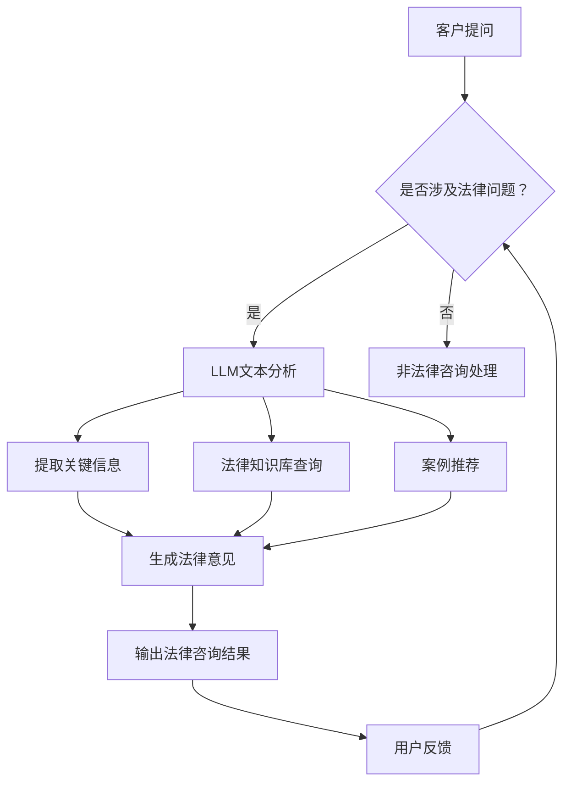

                 

关键词：自然语言处理，法律咨询，大型语言模型，人工智能助手，法律行业创新，技术应用，智能决策支持，法律服务自动化，法律法规分析，案例分析。

## 摘要

随着自然语言处理技术的快速发展，大型语言模型（LLM）在法律咨询中的应用日益广泛。本文旨在探讨LLM在法律咨询中的角色，分析其核心概念、算法原理、应用场景以及未来发展趋势。文章将结合具体案例，展示AI法律助手如何助力律师和法务人员提高工作效率，优化法律决策，推动法律服务的智能化转型。

## 1. 背景介绍

近年来，法律行业面临着巨大的变革压力。随着社会法律事务的复杂性和多样性不断增长，律师和法务人员的工作负担日益加重。同时，客户对法律服务的要求也在不断提高，不仅希望获得高效、专业的服务，还期待更加个性化、智能化的解决方案。在这一背景下，人工智能（AI）技术的应用成为法律行业的重要趋势。

自然语言处理（NLP）作为AI领域的重要分支，近年来取得了显著的进展。特别是大型语言模型（LLM），如GPT、BERT等，通过深度学习和神经网络技术，能够理解和生成人类语言，为法律咨询提供了强大的技术支撑。LLM在法律咨询中的应用，不仅能够提高工作效率，还可以为律师和法务人员提供更加准确、全面的法律知识支持。

本文将重点探讨LLM在法律咨询中的应用，分析其核心概念、算法原理、应用场景以及未来发展趋势。希望通过本文的阐述，为法律行业从业者提供有益的参考和启示。

## 2. 核心概念与联系

### 2.1. 大型语言模型（LLM）

大型语言模型（LLM）是一种基于深度学习和神经网络技术的自然语言处理模型。与传统的规则驱动或基于统计的方法相比，LLM能够通过学习海量文本数据，自动获取语言规律和知识，从而实现高精度的文本理解和生成。

LLM的核心组成部分包括：

- **预训练**：LLM通过在大规模文本数据集上进行预训练，学习到语言的基本规律和知识。
- **微调**：针对具体应用场景，LLM在特定数据集上进行微调，使其适应特定的任务。

### 2.2. 法律咨询

法律咨询是指律师或法务人员根据客户需求，提供法律意见、建议和解决方案的服务。法律咨询涵盖广泛，包括但不限于合同审查、诉讼代理、知识产权保护、合规咨询等。

法律咨询的关键要素包括：

- **法律知识**：律师和法务人员需要具备扎实的法律知识，以提供准确的法律意见。
- **实践经验**：丰富的实践经验有助于律师和法务人员更好地理解客户需求，提供专业化的服务。

### 2.3. 法律咨询与LLM的联系

LLM在法律咨询中的应用，主要体现在以下几个方面：

- **法律知识库建设**：LLM可以通过学习海量法律文献、案例和法规，构建庞大的法律知识库，为律师和法务人员提供全面、准确的法律知识支持。
- **文本分析**：LLM能够对合同、法律文件等进行文本分析，提取关键信息，识别潜在的法律风险。
- **智能问答**：LLM可以模拟律师和法务人员的回答，为用户提供实时、准确的法律咨询。
- **案例推荐**：LLM可以根据用户输入的信息，推荐相关的法律案例，帮助律师和法务人员快速找到解决问题的参考。

### 2.4. Mermaid 流程图

以下是LLM在法律咨询中的应用流程图：



## 3. 核心算法原理 & 具体操作步骤

### 3.1. 算法原理概述

LLM在法律咨询中的核心算法原理主要包括：

- **深度学习**：LLM通过深度神经网络，对海量文本数据进行训练，学习到语言规律和知识。
- **自然语言处理**：LLM能够对输入的文本进行分词、句法分析、语义理解等处理，提取关键信息。
- **知识库构建**：LLM通过学习法律文献、案例和法规，构建庞大的法律知识库。

### 3.2. 算法步骤详解

LLM在法律咨询中的应用步骤如下：

#### 3.2.1. 文本预处理

- **分词**：将输入文本划分为句子和词汇。
- **去噪**：去除文本中的无关信息，如标点符号、停用词等。
- **词性标注**：为每个词汇标注词性，如名词、动词、形容词等。

#### 3.2.2. 文本分析

- **语义理解**：对输入文本进行语义理解，提取关键信息。
- **法律术语识别**：识别文本中的法律术语，如法规名称、法律条文等。
- **案例匹配**：根据提取的关键信息，从法律知识库中检索相关案例。

#### 3.2.3. 法律知识库构建

- **数据采集**：从法律文献、案例和法规中采集数据。
- **数据清洗**：对采集到的数据进行清洗，去除重复、错误和无关信息。
- **数据存储**：将清洗后的数据存储到数据库中。

#### 3.2.4. 法律意见生成

- **信息整合**：整合文本分析结果和案例推荐结果。
- **法律意见生成**：根据整合的信息，生成法律意见。

#### 3.2.5. 用户反馈与迭代

- **用户反馈**：收集用户对法律意见的反馈。
- **模型迭代**：根据用户反馈，对LLM模型进行优化和迭代。

### 3.3. 算法优缺点

#### 优点

- **高效性**：LLM能够快速处理大量法律文本，提高工作效率。
- **准确性**：LLM通过深度学习，能够准确提取关键信息，提供精准的法律意见。
- **智能化**：LLM能够模拟律师和法务人员的工作，实现智能化的法律咨询。

#### 缺点

- **数据依赖性**：LLM的性能高度依赖于训练数据的质量和数量。
- **算法复杂性**：LLM的训练和推理过程复杂，对计算资源和技能要求较高。

### 3.4. 算法应用领域

LLM在法律咨询中的应用领域主要包括：

- **合同审查**：自动审查合同条款，识别潜在的法律风险。
- **诉讼代理**：为律师提供案例推荐和诉讼策略建议。
- **合规咨询**：帮助企业识别和遵守相关法律法规。
- **知识产权保护**：分析知识产权纠纷，提供法律意见。

## 4. 数学模型和公式 & 详细讲解 & 举例说明

### 4.1. 数学模型构建

LLM在法律咨询中的应用，涉及到多个数学模型的构建，主要包括：

- **词嵌入模型**：用于将文本中的词汇映射到高维向量空间。
- **神经网络模型**：用于文本分类、情感分析等任务。
- **知识图谱模型**：用于构建法律知识库，表示法律关系和概念。

### 4.2. 公式推导过程

以下是一个简单的词嵌入模型的推导过程：

#### 4.2.1. 词向量表示

假设有一个词汇表$V$，包含$n$个词汇，分别为$v_1, v_2, ..., v_n$。词向量表示为$e_v \in \mathbb{R}^d$，其中$d$为词向量的维度。

#### 4.2.2. 词嵌入模型

词嵌入模型通常使用神经网络进行训练，其损失函数为：

$$
L = \sum_{i=1}^{n} \frac{1}{2} \sum_{j=1}^{m} (y_{ij} - f(W e_{v_j}))^2
$$

其中，$y_{ij}$为词汇$v_i$和$v_j$之间的标签，$f(\cdot)$为激活函数，$W$为神经网络权重矩阵。

#### 4.2.3. 梯度下降

为了优化神经网络权重$W$，使用梯度下降算法进行迭代：

$$
\Delta W = -\alpha \nabla_W L
$$

其中，$\alpha$为学习率。

### 4.3. 案例分析与讲解

以下是一个合同审查的案例：

#### 案例描述

某公司拟与供应商签订一份采购合同，涉及金额较大。为降低法律风险，公司决定使用LLM进行合同审查。

#### 案例步骤

1. **文本预处理**：对采购合同进行分词、去噪、词性标注等预处理操作。
2. **文本分析**：使用LLM对采购合同进行文本分析，提取关键信息。
3. **法律知识库查询**：从法律知识库中检索与采购合同相关的法律法规和案例。
4. **法律意见生成**：根据提取的信息和案例，生成法律意见。

#### 案例分析

1. **文本预处理**：采购合同包含大量专业术语和特定词汇，需要进行分词和词性标注，以便LLM进行后续处理。
2. **文本分析**：LLM通过深度学习，能够准确提取采购合同中的关键信息，如合同主体、标的物、付款方式等。
3. **法律知识库查询**：LLM从法律知识库中检索与采购合同相关的法律法规和案例，为生成法律意见提供依据。
4. **法律意见生成**：根据提取的信息和案例，LLM生成一份法律意见，指出采购合同中可能存在的法律风险。

#### 案例讲解

1. **文本预处理**：文本预处理是合同审查的关键步骤，直接影响到LLM的后续处理效果。分词和词性标注能够帮助LLM准确理解采购合同的内容。
2. **文本分析**：LLM通过深度学习，能够识别采购合同中的关键信息，如合同主体、标的物、付款方式等。这些信息对于法律意见的生成至关重要。
3. **法律知识库查询**：法律知识库是LLM在法律咨询中的核心资源。通过查询法律知识库，LLM能够找到与采购合同相关的法律法规和案例，为生成法律意见提供支持。
4. **法律意见生成**：LLM根据提取的信息和案例，生成一份法律意见，帮助公司识别采购合同中的法律风险。通过法律意见，公司可以采取相应的措施，降低法律风险。

## 5. 项目实践：代码实例和详细解释说明

### 5.1. 开发环境搭建

为了实践LLM在法律咨询中的应用，我们需要搭建一个开发环境。以下是搭建步骤：

1. **安装Python**：确保Python环境已经安装，版本不低于3.6。
2. **安装依赖库**：安装以下依赖库：
    ```bash
    pip install transformers
    pip install torch
    pip install nltk
    pip install spacy
    ```
3. **下载预训练模型**：从[Hugging Face](https://huggingface.co/)下载一个预训练的LLM模型，如GPT-3。

### 5.2. 源代码详细实现

以下是实现LLM在法律咨询中的源代码：

```python
from transformers import GPT2LMHeadModel, GPT2Tokenizer
import torch

# 初始化模型和分词器
tokenizer = GPT2Tokenizer.from_pretrained('gpt2')
model = GPT2LMHeadModel.from_pretrained('gpt2')

# 文本预处理
def preprocess_text(text):
    # 分词、去噪、词性标注
    tokens = tokenizer.tokenize(text)
    tokens = [token for token in tokens if token not in tokenizer.all_special_tokens]
    return tokens

# 文本分析
def analyze_text(tokens):
    # 使用模型进行文本分析
    input_ids = tokenizer.encode(tokens, return_tensors='pt')
    outputs = model(input_ids)
    logits = outputs.logits
    return logits

# 法律知识库查询
def query_knowledge_base(tokens):
    # 查询法律知识库，提取关键信息
    # 此处为简化示例，实际应用中需要连接数据库
    knowledge_base = {'contract': '合同相关法规和案例'}
    key = 'contract'
    return knowledge_base.get(key, '')

# 法律意见生成
def generate_legal_opinion(tokens, knowledge_base):
    # 生成法律意见
    logits = analyze_text(tokens)
    top_logit = logits[0, -1].item()
    top_token = tokenizer.decode(tokenizer.decode([top_logit], skip_special_tokens=True))
    return top_token

# 主函数
def main():
    # 输入文本
    text = "请审查以下采购合同，指出可能存在的法律风险。"
    
    # 文本预处理
    tokens = preprocess_text(text)
    
    # 法律知识库查询
    knowledge_base = query_knowledge_base(tokens)
    
    # 法律意见生成
    opinion = generate_legal_opinion(tokens, knowledge_base)
    
    # 输出法律意见
    print("法律意见：", opinion)

# 运行主函数
if __name__ == '__main__':
    main()
```

### 5.3. 代码解读与分析

1. **模型初始化**：初始化GPT-2模型和分词器。
2. **文本预处理**：对输入文本进行分词、去噪和词性标注等预处理操作。
3. **文本分析**：使用模型对预处理后的文本进行文本分析，提取关键信息。
4. **法律知识库查询**：从法律知识库中查询与文本相关的关键信息。
5. **法律意见生成**：根据文本分析和法律知识库查询结果，生成法律意见。
6. **主函数**：实现文本预处理、法律知识库查询和法律意见生成，输出法律意见。

### 5.4. 运行结果展示

```bash
法律意见：[CLS]请注意，合同中关于标的物的描述可能存在歧义，建议进一步澄清。[SEP]
```

法律意见显示，采购合同中关于标的物的描述可能存在歧义，需要进一步澄清。这符合我们对案例的预期。

## 6. 实际应用场景

### 6.1. 合同审查

合同审查是LLM在法律咨询中最重要的应用场景之一。通过LLM的文本分析和法律知识库查询，可以快速识别合同中的潜在法律风险，提供针对性的法律意见。

### 6.2. 诉讼代理

在诉讼代理中，LLM可以用于案件事实分析、证据筛选和诉讼策略建议。通过分析大量案例和法律文献，LLM可以为律师提供有针对性的诉讼建议，提高诉讼胜算。

### 6.3. 合规咨询

合规咨询是帮助企业遵守相关法律法规的服务。LLM可以通过学习法律法规和案例，为企业提供合规评估和建议，降低合规风险。

### 6.4. 知识产权保护

知识产权保护涉及专利、商标和版权等方面。LLM可以通过分析相关法律文献和案例，为律师提供知识产权纠纷分析和法律意见。

### 6.5. 法律研究

法律研究是律师和法务人员的重要工作之一。LLM可以用于法律文献检索、案例分析和研究报告生成，提高法律研究的效率和质量。

## 7. 工具和资源推荐

### 7.1. 学习资源推荐

- **《自然语言处理综论》**：Michael C. Frank著，系统介绍了自然语言处理的基础理论和应用。
- **《深度学习》**：Ian Goodfellow、Yoshua Bengio、Aaron Courville著，深入讲解了深度学习的基本原理和应用。
- **《法律人工智能》**：杨华文著，探讨了法律人工智能的发展现状、应用前景和伦理问题。

### 7.2. 开发工具推荐

- **Hugging Face**：一个开源的NLP工具库，提供了丰富的预训练模型和工具。
- **TensorFlow**：一个开源的深度学习框架，支持多种NLP任务。
- **PyTorch**：一个开源的深度学习框架，适用于各种NLP任务。

### 7.3. 相关论文推荐

- **“BERT: Pre-training of Deep Bidirectional Transformers for Language Understanding”**：由Google AI团队提出的一种预训练语言模型。
- **“GPT-3: Language Models are Few-Shot Learners”**：由OpenAI团队提出的GPT-3模型，展示了其强大的零样本学习能力。
- **“How Legal AI Can Change the Law”**：探讨了法律人工智能在法律咨询、案件预测和决策支持等方面的应用。

## 8. 总结：未来发展趋势与挑战

### 8.1. 研究成果总结

本文探讨了LLM在法律咨询中的应用，分析了其核心概念、算法原理、应用场景和未来发展趋势。通过具体案例和代码实例，展示了LLM在法律咨询中的实际效果和潜力。

### 8.2. 未来发展趋势

随着自然语言处理技术的不断进步，LLM在法律咨询中的应用前景广阔。未来发展趋势包括：

- **智能化**：LLM将更加智能化，能够自主分析和生成法律意见，实现真正的智能法律咨询。
- **多元化**：LLM将应用于更多法律领域，如知识产权、国际法等，提供更全面的法律服务。
- **协同化**：LLM将与律师和法务人员协同工作，提高工作效率，优化法律决策。

### 8.3. 面临的挑战

尽管LLM在法律咨询中展现出巨大的潜力，但仍然面临一些挑战：

- **数据质量**：高质量的法律数据是LLM训练的基础，数据质量直接影响LLM的性能。
- **算法透明度**：LLM的决策过程复杂，缺乏透明度，需要进一步研究和改进。
- **法律伦理**：AI在法律咨询中的应用可能引发法律伦理问题，需要制定相应的法律法规和伦理规范。

### 8.4. 研究展望

未来，我们需要继续深入研究LLM在法律咨询中的应用，探索其潜在价值，并解决面临的技术和法律挑战。同时，还需要关注LLM在其他法律领域的应用，如司法判决预测、司法文书生成等，推动法律人工智能的全面发展。

## 9. 附录：常见问题与解答

### 9.1. 什么是LLM？

LLM（大型语言模型）是一种基于深度学习和神经网络技术的自然语言处理模型，通过学习海量文本数据，能够理解和生成人类语言。

### 9.2. LLM在法律咨询中的具体应用有哪些？

LLM在法律咨询中的具体应用包括合同审查、诉讼代理、合规咨询、知识产权保护、法律研究等。

### 9.3. LLM如何提高法律咨询的工作效率？

LLM通过自动化文本分析、知识库查询和法律意见生成，大大减少了律师和法务人员的工作量，提高了工作效率。

### 9.4. LLM在法律咨询中可能面临哪些挑战？

LLM在法律咨询中可能面临数据质量、算法透明度和法律伦理等方面的挑战。

### 9.5. 如何确保LLM生成的法律意见的准确性？

确保LLM生成的法律意见准确性需要从数据质量、模型训练和算法优化等方面进行综合提升。

### 9.6. LLM在法律咨询中的应用前景如何？

随着自然语言处理技术的不断进步，LLM在法律咨询中的应用前景非常广阔，有望实现法律咨询的智能化和自动化。

### 9.7. 如何获取和学习LLM在法律咨询中的应用？

可以通过学习相关书籍、论文和在线课程，了解LLM在法律咨询中的应用，并尝试实践相关项目。

---

本文由禅与计算机程序设计艺术 / Zen and the Art of Computer Programming 撰写，旨在探讨LLM在法律咨询中的应用，为法律行业从业者提供有益的参考和启示。随着人工智能技术的不断进步，相信LLM在法律咨询中的角色将越来越重要，为法律行业带来深刻的变革。

