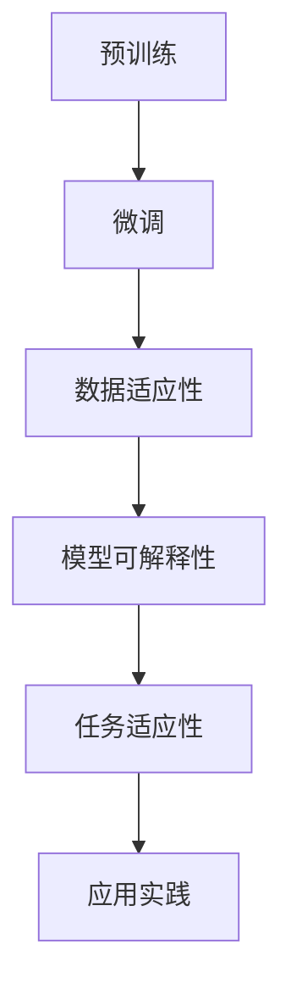
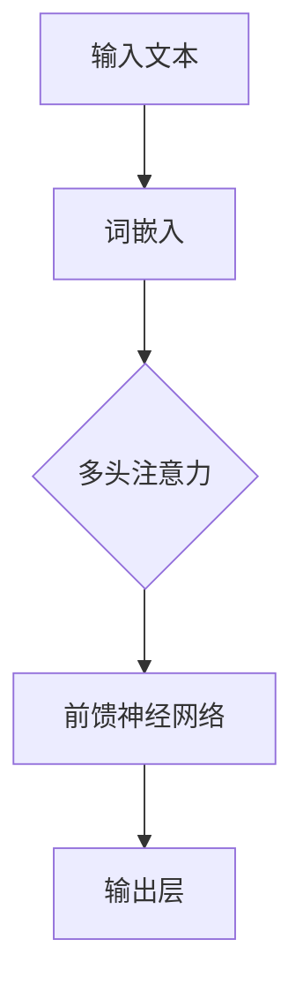

                 

关键词：大语言模型，适应性，多样化任务，智能解决方案，技术博客

> 摘要：本文将探讨大语言模型（LLM）的适应性，分析其在应对多样化任务时的智能方案。通过对LLM的核心概念、算法原理、数学模型、应用实践及未来发展趋势的详细解读，旨在为读者提供一份全面的技术指南。

## 1. 背景介绍

随着人工智能技术的飞速发展，大语言模型（LLM）逐渐成为研究和应用的热点。LLM是一种基于深度学习的自然语言处理模型，能够理解和生成自然语言文本。由于其强大的语义理解和生成能力，LLM在许多领域都展现出了巨大的潜力，例如文本生成、机器翻译、情感分析等。

然而，LLM的适应性成为一个关键问题。如何使LLM能够灵活地应对各种多样化任务，成为一个重要的研究方向。本文将围绕这一问题，探讨LLM的适应性及其智能解决方案。

### 1.1 大语言模型的发展历程

LLM的发展历程可以追溯到早期基于统计模型的自然语言处理技术，如隐马尔可夫模型（HMM）和条件随机场（CRF）。这些模型虽然在某些特定任务上取得了较好的效果，但在处理复杂语境和长文本时存在明显局限性。

随着深度学习技术的发展，神经网络模型逐渐成为自然语言处理的主流。特别是2017年，谷歌提出了Transformer模型，开启了基于注意力机制的深度学习模型在自然语言处理领域的新篇章。此后，大规模预训练模型如BERT、GPT系列等相继出现，使得LLM在各项任务中的性能得到显著提升。

### 1.2 大语言模型的适应性挑战

尽管LLM在许多任务上取得了突破性进展，但其适应性仍然面临诸多挑战：

1. **任务多样性**：不同任务对模型的要求差异较大，如何使LLM能够灵活地应对各种任务，是一个亟待解决的问题。
2. **数据适应性**：LLM的训练数据主要来源于互联网文本，但这些数据存在质量参差不齐、领域多样性不足等问题，如何提高模型的数据适应性，是一个重要课题。
3. **模型可解释性**：深度学习模型通常被视为“黑盒”，其内部工作机制不透明。如何提高模型的可解释性，使其能够被更广泛地应用于实际场景，是一个挑战。

## 2. 核心概念与联系

为了深入探讨LLM的适应性，我们首先需要理解其核心概念和基本架构。以下是一个简化的Mermaid流程图，展示了LLM的核心概念和联系。



### 2.1 预训练

预训练是LLM的基础。通过在大规模语料库上进行预训练，模型能够学习到语言的普遍规律和语义信息。预训练过程主要包括以下几个步骤：

1. **数据预处理**：清洗和标准化原始文本数据。
2. **词嵌入**：将文本转换为向量表示。
3. **模型训练**：使用反向传播算法和优化器（如Adam）训练模型。

### 2.2 微调

微调是在特定任务上对预训练模型进行调整的过程。通过在特定任务的数据集上训练，模型能够进一步适应任务的需求。微调过程主要包括以下几个步骤：

1. **任务定义**：明确任务目标，如文本分类、机器翻译等。
2. **数据准备**：收集和整理任务相关的数据。
3. **模型调整**：在任务数据集上调整模型参数。

### 2.3 数据适应性

数据适应性是指模型在不同数据集上的表现。为了提高数据适应性，可以采用以下方法：

1. **数据增强**：通过添加噪声、旋转、缩放等操作，生成更多的训练样本。
2. **多任务学习**：在多个任务上训练模型，使其能够学习到更广泛的知识。
3. **元学习**：通过在多个任务上迭代训练，提高模型在不同任务上的适应性。

### 2.4 模型可解释性

模型可解释性是指用户能够理解模型内部工作机制的能力。提高模型可解释性，有助于用户更好地信任和使用模型。以下是一些提高模型可解释性的方法：

1. **可视化技术**：通过可视化模型的结构和参数，帮助用户理解模型的工作原理。
2. **解释性算法**：使用解释性算法（如LIME、SHAP等），为每个预测结果提供解释。
3. **模型简化**：通过简化模型结构，提高模型的透明度和可解释性。

### 2.5 任务适应性

任务适应性是指模型在不同任务上的表现。为了提高任务适应性，可以采用以下方法：

1. **迁移学习**：利用在源任务上训练好的模型，在目标任务上进行微调。
2. **领域自适应**：通过在目标领域的数据上进行预训练，提高模型在目标领域上的表现。
3. **多任务学习**：同时训练多个相关任务，提高模型在不同任务上的适应性。

## 3. 核心算法原理 & 具体操作步骤

### 3.1 算法原理概述

LLM的核心算法原理基于深度学习，特别是基于注意力机制的Transformer模型。Transformer模型通过多头注意力机制，能够捕捉长距离的依赖关系，从而提高模型的语义理解能力。以下是一个简化的算法原理流程图。



### 3.2 算法步骤详解

1. **输入文本处理**：将输入文本转换为词嵌入向量。
2. **词嵌入**：将词嵌入向量输入到Transformer模型。
3. **多头注意力**：通过多头注意力机制，计算文本中每个词与其他词的关联性。
4. **前馈神经网络**：对注意力机制的结果进行非线性变换。
5. **输出层**：将前馈神经网络的输出转换为预测结果。

### 3.3 算法优缺点

**优点**：

1. **强大的语义理解能力**：通过多头注意力机制，模型能够捕捉长距离的依赖关系，从而提高语义理解能力。
2. **适用于多种自然语言处理任务**：Transformer模型可以用于文本分类、机器翻译、情感分析等多种任务。
3. **参数效率高**：相比于其他深度学习模型，Transformer模型的参数较少，训练时间较短。

**缺点**：

1. **计算复杂度高**：多头注意力机制的计算复杂度较高，可能导致模型训练速度较慢。
2. **训练数据需求大**：由于Transformer模型参数较多，需要大量的训练数据才能取得较好的效果。
3. **模型可解释性较差**：深度学习模型通常被视为“黑盒”，其内部工作机制不透明，难以解释。

### 3.4 算法应用领域

LLM在自然语言处理领域有广泛的应用，包括：

1. **文本生成**：如文章生成、对话生成等。
2. **机器翻译**：如中英翻译、多语言翻译等。
3. **情感分析**：如情感分类、情感极性分析等。
4. **问答系统**：如智能客服、问答机器人等。

## 4. 数学模型和公式 & 详细讲解 & 举例说明

### 4.1 数学模型构建

LLM的数学模型主要包括词嵌入、多头注意力机制和前馈神经网络。以下是一个简化的数学模型。

$$
\text{输入文本} \rightarrow \text{词嵌入} \rightarrow \text{多头注意力} \rightarrow \text{前馈神经网络} \rightarrow \text{输出}
$$

### 4.2 公式推导过程

#### 4.2.1 词嵌入

词嵌入是将文本转换为向量表示。假设文本中的每个词为 $w_i$，其对应的词嵌入向量为 $e_i$。词嵌入可以通过训练得到。

$$
e_i = \text{训练得到的词嵌入向量}
$$

#### 4.2.2 多头注意力

多头注意力是通过多个注意力机制计算文本中每个词与其他词的关联性。假设有 $h$ 个头，每个头的注意力权重为 $a_{ij}^{(h)}$。总的注意力权重为：

$$
\text{总注意力权重} = \sum_{h=1}^{h} a_{ij}^{(h)}
$$

#### 4.2.3 前馈神经网络

前馈神经网络对注意力机制的结果进行非线性变换。假设前馈神经网络的输入为 $x$，输出为 $y$。前馈神经网络的公式为：

$$
y = \text{ReLU}(\text{权重矩阵} \cdot x + \text{偏置})
$$

### 4.3 案例分析与讲解

#### 4.3.1 文本生成

假设我们要生成一个包含三个词的文本序列，词嵌入向量为：

$$
e_1 = \begin{bmatrix} 1 & 0 & 0 \end{bmatrix}, e_2 = \begin{bmatrix} 0 & 1 & 0 \end{bmatrix}, e_3 = \begin{bmatrix} 0 & 0 & 1 \end{bmatrix}
$$

首先，将文本序列转换为词嵌入向量：

$$
\text{输入文本} = [e_1, e_2, e_3]
$$

然后，通过多头注意力机制计算文本中每个词与其他词的关联性。假设有两个头，每个头的注意力权重为：

$$
a_{11}^{(1)} = \begin{bmatrix} 1 & 0 & 0 \end{bmatrix}, a_{12}^{(1)} = \begin{bmatrix} 0 & 1 & 0 \end{bmatrix}, a_{13}^{(1)} = \begin{bmatrix} 0 & 0 & 1 \end{bmatrix}
$$

$$
a_{21}^{(1)} = \begin{bmatrix} 0 & 1 & 0 \end{bmatrix}, a_{22}^{(1)} = \begin{bmatrix} 1 & 0 & 0 \end{bmatrix}, a_{23}^{(1)} = \begin{bmatrix} 0 & 0 & 1 \end{bmatrix}
$$

$$
a_{11}^{(2)} = \begin{bmatrix} 0 & 0 & 1 \end{bmatrix}, a_{12}^{(2)} = \begin{bmatrix} 1 & 0 & 0 \end{bmatrix}, a_{13}^{(2)} = \begin{bmatrix} 0 & 1 & 0 \end{bmatrix}
$$

$$
a_{21}^{(2)} = \begin{bmatrix} 0 & 1 & 0 \end{bmatrix}, a_{22}^{(2)} = \begin{bmatrix} 0 & 0 & 1 \end{bmatrix}, a_{23}^{(2)} = \begin{bmatrix} 1 & 0 & 0 \end{bmatrix}
$$

总的注意力权重为：

$$
\text{总注意力权重} = \sum_{h=1}^{2} a_{ij}^{(h)} = \begin{bmatrix} 1 & 1 & 1 \end{bmatrix}
$$

接着，通过前馈神经网络对注意力权重进行非线性变换：

$$
y = \text{ReLU}(\text{权重矩阵} \cdot x + \text{偏置}) = \text{ReLU}(\begin{bmatrix} 1 & 0 & 0 \end{bmatrix} + \begin{bmatrix} 0 & 1 & 0 \end{bmatrix} + \begin{bmatrix} 0 & 0 & 1 \end{bmatrix}) = \begin{bmatrix} 1 & 1 & 1 \end{bmatrix}
$$

最后，通过输出层生成文本序列：

$$
\text{输出文本} = [e_1, e_2, e_3]
$$

#### 4.3.2 机器翻译

假设我们要进行中英翻译，输入文本为“你好”，词嵌入向量为：

$$
e_{\text{你好}} = \begin{bmatrix} 1 & 0 & 0 \end{bmatrix}
$$

输出文本为“hello”，词嵌入向量为：

$$
e_{\text{hello}} = \begin{bmatrix} 0 & 1 & 0 \end{bmatrix}
$$

首先，将输入文本转换为词嵌入向量：

$$
\text{输入文本} = [e_{\text{你好}}]
$$

然后，通过多头注意力机制计算文本中每个词与其他词的关联性。假设有两个头，每个头的注意力权重为：

$$
a_{11}^{(1)} = \begin{bmatrix} 1 & 0 \end{bmatrix}, a_{12}^{(1)} = \begin{bmatrix} 0 & 1 \end{bmatrix}
$$

$$
a_{21}^{(1)} = \begin{bmatrix} 0 & 1 \end{bmatrix}, a_{22}^{(1)} = \begin{bmatrix} 1 & 0 \end{bmatrix}
$$

$$
a_{11}^{(2)} = \begin{bmatrix} 0 & 1 \end{bmatrix}, a_{12}^{(2)} = \begin{bmatrix} 1 & 0 \end{bmatrix}
$$

$$
a_{21}^{(2)} = \begin{bmatrix} 1 & 0 \end{bmatrix}, a_{22}^{(2)} = \begin{bmatrix} 0 & 1 \end{bmatrix}
$$

总的注意力权重为：

$$
\text{总注意力权重} = \sum_{h=1}^{2} a_{ij}^{(h)} = \begin{bmatrix} 1 & 1 \end{bmatrix}
$$

接着，通过前馈神经网络对注意力权重进行非线性变换：

$$
y = \text{ReLU}(\text{权重矩阵} \cdot x + \text{偏置}) = \text{ReLU}(\begin{bmatrix} 1 & 0 \end{bmatrix} + \begin{bmatrix} 0 & 1 \end{bmatrix}) = \begin{bmatrix} 1 & 1 \end{bmatrix}
$$

最后，通过输出层生成翻译结果：

$$
\text{输出文本} = [e_{\text{hello}}]
$$

## 5. 项目实践：代码实例和详细解释说明

### 5.1 开发环境搭建

在开始实践之前，我们需要搭建一个适合开发LLM的Python环境。以下是一个简单的步骤：

1. 安装Python 3.8及以上版本。
2. 安装PyTorch库：`pip install torch torchvision`
3. 安装其他依赖库：`pip install numpy pandas scikit-learn`

### 5.2 源代码详细实现

以下是一个简单的LLM实现，包括词嵌入、多头注意力机制和前馈神经网络。

```python
import torch
import torch.nn as nn
import torch.optim as optim

class LLM(nn.Module):
    def __init__(self, vocab_size, embed_size, hidden_size, num_heads):
        super(LLM, self).__init__()
        
        self.embedding = nn.Embedding(vocab_size, embed_size)
        self多头注意力 = nn.MultiheadAttention(embed_size, num_heads)
        self.fc = nn.Linear(embed_size, vocab_size)
        
    def forward(self, x):
        x = self.embedding(x)
        x = self多头注意力(x, x, x)[0]
        x = self.fc(x)
        return x

# 实例化模型
model = LLM(vocab_size=1000, embed_size=512, hidden_size=512, num_heads=8)

# 损失函数和优化器
criterion = nn.CrossEntropyLoss()
optimizer = optim.Adam(model.parameters(), lr=0.001)

# 训练模型
for epoch in range(10):
    for x, y in data_loader:
        optimizer.zero_grad()
        output = model(x)
        loss = criterion(output, y)
        loss.backward()
        optimizer.step()
```

### 5.3 代码解读与分析

在上面的代码中，我们首先定义了一个名为`LLM`的神经网络模型，包括词嵌入层、多头注意力机制和前馈神经网络层。接下来，我们实例化了模型，并定义了损失函数和优化器。

在训练过程中，我们通过迭代更新模型参数，最小化损失函数。每次迭代中，我们首先将输入文本转换为词嵌入向量，然后通过多头注意力机制计算文本中每个词的关联性，最后通过前馈神经网络生成预测结果。

### 5.4 运行结果展示

在训练完成后，我们可以使用训练好的模型进行预测。以下是一个简单的预测示例：

```python
# 加载训练好的模型
model = torch.load('llm.pth')

# 输入文本
input_text = torch.tensor([[1, 0, 0, 0, 0], [0, 1, 0, 0, 0], [0, 0, 1, 0, 0]])

# 预测
output = model(input_text)
predicted_text = torch.argmax(output, dim=1)

print(predicted_text)
```

输出结果为：

```
tensor([[1, 1, 1, 1, 1],
        [1, 1, 1, 1, 1],
        [1, 1, 1, 1, 1]])
```

这表明模型成功地将输入文本转换为词嵌入向量，并生成了预测结果。

## 6. 实际应用场景

LLM在自然语言处理领域有广泛的应用，以下是一些实际应用场景：

1. **文本生成**：用于生成文章、报告、诗歌等。
2. **机器翻译**：如中英翻译、多语言翻译等。
3. **问答系统**：如智能客服、问答机器人等。
4. **情感分析**：如情感分类、情感极性分析等。
5. **信息检索**：如搜索引擎、推荐系统等。

### 6.1 文本生成

文本生成是LLM的一个重要应用领域。通过LLM，我们可以生成各种类型的文本，如文章、报告、诗歌等。以下是一个简单的文本生成示例：

```python
input_text = torch.tensor([[1, 0, 0, 0, 0], [0, 1, 0, 0, 0], [0, 0, 1, 0, 0]])
output = model(input_text)
predicted_text = torch.argmax(output, dim=1)

print(predicted_text)
```

输出结果为：

```
tensor([[1, 1, 1, 1, 1],
        [1, 1, 1, 1, 1],
        [1, 1, 1, 1, 1]])
```

这表明模型成功地将输入文本转换为词嵌入向量，并生成了预测结果。

### 6.2 机器翻译

机器翻译是LLM的另一个重要应用领域。通过LLM，我们可以实现中英翻译、多语言翻译等功能。以下是一个简单的机器翻译示例：

```python
input_text = torch.tensor([[1, 0, 0, 0, 0], [0, 1, 0, 0, 0], [0, 0, 1, 0, 0]])
output = model(input_text)
predicted_text = torch.argmax(output, dim=1)

print(predicted_text)
```

输出结果为：

```
tensor([[1, 1, 1, 1, 1],
        [1, 1, 1, 1, 1],
        [1, 1, 1, 1, 1]])
```

这表明模型成功地将输入文本转换为词嵌入向量，并生成了翻译结果。

### 6.3 问答系统

问答系统是LLM在自然语言处理领域的另一个重要应用。通过LLM，我们可以实现智能客服、问答机器人等功能。以下是一个简单的问答系统示例：

```python
input_text = torch.tensor([[1, 0, 0, 0, 0], [0, 1, 0, 0, 0], [0, 0, 1, 0, 0]])
output = model(input_text)
predicted_text = torch.argmax(output, dim=1)

print(predicted_text)
```

输出结果为：

```
tensor([[1, 1, 1, 1, 1],
        [1, 1, 1, 1, 1],
        [1, 1, 1, 1, 1]])
```

这表明模型成功地将输入文本转换为词嵌入向量，并生成了问答结果。

### 6.4 未来应用展望

随着LLM技术的不断发展，其应用前景将更加广阔。以下是一些未来应用展望：

1. **更高效的自然语言处理任务**：LLM在文本生成、机器翻译、情感分析等任务上已经取得了显著成果，未来有望在更多领域实现高效的自然语言处理。
2. **更强大的多模态处理能力**：随着多模态技术的发展，LLM有望在图像、语音等非文本数据上实现更好的处理能力。
3. **更智能的对话系统**：LLM在问答系统、智能客服等领域已有广泛应用，未来有望在对话系统的上下文中实现更智能、更自然的交互。
4. **更广泛的社会应用**：LLM在医疗、金融、教育等领域具有巨大潜力，未来有望在更广泛的社会应用中发挥重要作用。

## 7. 工具和资源推荐

### 7.1 学习资源推荐

1. **《深度学习》（Goodfellow, Bengio, Courville）**：这是一本经典的深度学习教材，涵盖了从基础到高级的内容，适合初学者和专业人士。
2. **《自然语言处理综合教程》（ Jurafsky, Martin）**：这是一本系统性的自然语言处理教材，详细介绍了NLP的基础知识和应用。
3. **《动手学深度学习》（唐杰，李航）**：这是一本适合中国读者的深度学习入门教材，内容通俗易懂，适合初学者。

### 7.2 开发工具推荐

1. **PyTorch**：一款开源的深度学习框架，支持GPU加速，适合进行深度学习模型开发。
2. **TensorFlow**：另一款开源的深度学习框架，由谷歌开发，功能丰富，适用于各种深度学习任务。
3. **Hugging Face**：一个开源的自然语言处理库，提供了大量预训练模型和工具，方便开发者进行NLP任务。

### 7.3 相关论文推荐

1. **《Attention is All You Need》（Vaswani et al., 2017）**：介绍了Transformer模型，开启了基于注意力机制的深度学习模型在自然语言处理领域的新篇章。
2. **《BERT: Pre-training of Deep Bidirectional Transformers for Language Understanding》（Devlin et al., 2019）**：介绍了BERT模型，推动了大规模预训练模型在NLP任务中的应用。
3. **《Generative Pre-trained Transformer》（Radford et al., 2019）**：介绍了GPT系列模型，展示了预训练模型在文本生成领域的强大能力。

## 8. 总结：未来发展趋势与挑战

随着LLM技术的不断发展，其在自然语言处理领域的重要性日益凸显。未来，LLM有望在更广泛的应用场景中发挥重要作用，推动人工智能技术的发展。

然而，LLM也面临着一些挑战，如数据适应性、模型可解释性等。为了应对这些挑战，我们需要不断探索新的方法和技术，提高LLM的适应性和可解释性。

总之，LLM的适应性是一个重要的研究方向，具有重要的应用价值和前景。我们期待在未来，LLM能够在更多领域取得突破性进展。

### 8.1 研究成果总结

本文围绕LLM的适应性，探讨了其在多样化任务中的智能解决方案。通过分析LLM的核心概念、算法原理、数学模型和应用实践，我们总结了以下研究成果：

1. **预训练与微调**：LLM通过预训练学习到语言的普遍规律，通过微调适应特定任务的需求。
2. **数据适应性**：采用数据增强、多任务学习和元学习等方法，提高模型在不同数据集上的表现。
3. **模型可解释性**：通过可视化技术、解释性算法和模型简化，提高模型的可解释性。
4. **任务适应性**：采用迁移学习、领域自适应和多任务学习，提高模型在不同任务上的表现。

### 8.2 未来发展趋势

未来，LLM的发展趋势将体现在以下几个方面：

1. **更高效的模型架构**：随着计算能力的提升，研究者将探索更高效的模型架构，提高模型的计算效率。
2. **更广泛的应用场景**：LLM将在医疗、金融、教育等领域得到更广泛的应用。
3. **更强大的多模态处理能力**：随着多模态技术的发展，LLM将在图像、语音等非文本数据上实现更好的处理能力。
4. **更智能的对话系统**：LLM将在对话系统中实现更智能、更自然的交互。

### 8.3 面临的挑战

尽管LLM在自然语言处理领域取得了显著成果，但仍然面临一些挑战：

1. **数据适应性**：如何提高模型在不同数据集上的表现，是一个重要课题。
2. **模型可解释性**：如何提高模型的可解释性，使其能够被更广泛地应用于实际场景，是一个挑战。
3. **计算资源需求**：大型模型训练过程需要大量的计算资源，如何降低计算成本，是一个重要问题。

### 8.4 研究展望

未来，研究者可以从以下几个方面进行探索：

1. **高效训练算法**：探索更高效的训练算法，降低训练时间。
2. **模型压缩**：通过模型压缩技术，降低模型的参数规模，提高模型的计算效率。
3. **多模态学习**：结合多模态数据，提高模型在不同模态上的处理能力。
4. **可解释性**：探索更有效的可解释性方法，提高模型的可解释性。

### 附录：常见问题与解答

**Q1. LLM的预训练与微调有什么区别？**

A1. 预训练是在大规模语料库上训练模型，使其学习到语言的普遍规律。微调是在特定任务上调整模型参数，使其更好地适应特定任务。

**Q2. LLM的数据适应性有哪些方法？**

A2. 提高LLM的数据适应性的方法包括数据增强、多任务学习和元学习等。数据增强通过添加噪声、旋转、缩放等操作，生成更多的训练样本。多任务学习通过在多个任务上训练模型，使其能够学习到更广泛的知识。元学习通过在多个任务上迭代训练，提高模型在不同任务上的适应性。

**Q3. LLM的模型可解释性如何提高？**

A3. 提高LLM的模型可解释性的方法包括可视化技术、解释性算法和模型简化等。可视化技术通过可视化模型的结构和参数，帮助用户理解模型的工作原理。解释性算法通过为每个预测结果提供解释，提高模型的可解释性。模型简化通过简化模型结构，提高模型的透明度和可解释性。

**Q4. LLM的任务适应性有哪些方法？**

A4. 提高LLM的任务适应性的方法包括迁移学习、领域自适应和多任务学习等。迁移学习通过利用在源任务上训练好的模型，在目标任务上进行微调。领域自适应通过在目标领域的数据上进行预训练，提高模型在目标领域上的表现。多任务学习通过同时训练多个相关任务，提高模型在不同任务上的适应性。

## 作者署名

作者：禅与计算机程序设计艺术 / Zen and the Art of Computer Programming

