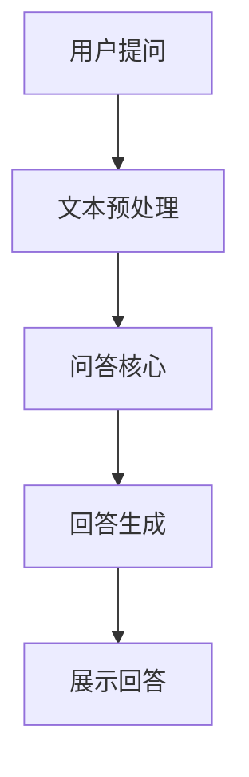

                 

关键词：LLM，智能问答系统，知识库，人工智能，深度学习，自然语言处理

摘要：本文将探讨LLM（大型语言模型）驱动的智能问答系统在知识库构建和查询中的应用。通过对LLM核心概念、算法原理、数学模型以及实际项目实践的详细分析，我们将揭示这一技术的巨大潜力和广阔应用前景。

## 1. 背景介绍

在互联网飞速发展的今天，信息过载成为了普遍现象。人们对于信息的需求日益增长，但获取有用信息的过程却变得越来越复杂。传统搜索引擎虽然能在一定程度上满足用户的需求，但它们依赖于关键词匹配和网页链接，往往无法提供精准的答案。这就催生了智能问答系统的需求，特别是基于LLM的智能问答系统。

### 1.1 传统问答系统

早期的问答系统主要依赖于知识库和规则引擎。例如，基于专家系统的医疗咨询系统，通过定义明确的规则和知识库，为用户提供答案。然而，这种系统存在几个明显的局限：

- **知识库维护成本高**：需要专业领域专家手动编写和维护知识库。
- **推理能力有限**：基于规则的方法难以应对复杂问题和多变的语境。
- **用户体验差**：传统问答系统的回答往往不够自然，缺乏人性化。

### 1.2 智能问答系统

随着深度学习和自然语言处理技术的进步，基于人工智能的智能问答系统逐渐崛起。尤其是LLM（大型语言模型）的引入，使得问答系统在理解和生成自然语言方面取得了显著突破。

- **理解能力强**：LLM通过学习大量文本数据，能够理解复杂语境和细微差异。
- **生成能力强大**：LLM能够生成自然流畅的回答，提升用户体验。
- **自适应性强**：LLM能够适应不同的问答场景，提供个性化的服务。

## 2. 核心概念与联系

### 2.1 LLM基本概念

LLM（Large Language Model）是一种基于神经网络的大型文本处理模型。它通过学习海量的文本数据，捕捉语言中的模式和信息，从而实现自然语言理解和生成。典型的LLM包括GPT、BERT、T5等。

- **预训练**：LLM在训练过程中首先经历预训练阶段，通过大量未标注的文本数据进行训练，学习语言的基本结构。
- **微调**：在预训练的基础上，LLM可以通过微调适应特定的任务，如问答系统。

### 2.2 智能问答系统架构

智能问答系统通常由三个主要组件构成：文本预处理、问答核心和回答生成。

- **文本预处理**：对用户输入的文本进行预处理，如分词、词性标注、实体识别等，以便于LLM理解和分析。
- **问答核心**：利用LLM的强大理解能力，对预处理后的文本进行语义分析，提取关键信息。
- **回答生成**：基于提取的关键信息，利用LLM的自然语言生成能力，生成符合用户需求的回答。

### 2.3 Mermaid流程图

下面是一个简单的Mermaid流程图，展示了智能问答系统的基本工作流程。



## 3. 核心算法原理 & 具体操作步骤

### 3.1 算法原理概述

智能问答系统的核心是LLM。LLM的工作原理可以概括为以下几个步骤：

1. **文本编码**：将自然语言文本转换为计算机可以处理的编码形式，如Word2Vec、BERT等。
2. **上下文理解**：利用深度学习模型，如Transformer、BERT，对编码后的文本进行理解，捕捉语义信息。
3. **回答生成**：基于理解的结果，利用生成模型，如GPT、T5，生成自然语言回答。

### 3.2 算法步骤详解

1. **文本编码**：
   - **词嵌入**：将文本中的每个词映射为高维向量，如Word2Vec、FastText。
   - **句子编码**：将整个句子映射为一个固定长度的向量，如BERT、RoBERTa。

2. **上下文理解**：
   - **预训练**：在大量无标签文本上进行预训练，学习语言的通用结构。
   - **微调**：在特定任务上进行微调，如问答系统、文本分类等。

3. **回答生成**：
   - **生成模型**：利用生成模型，如GPT、T5，生成自然语言回答。
   - **回答筛选**：根据生成的回答，利用排序算法筛选出最佳回答。

### 3.3 算法优缺点

**优点**：

- **理解能力强**：能够理解复杂的语境和细微的语义差异。
- **生成能力强**：能够生成自然流畅的回答。
- **自适应性强**：能够适应不同的问答场景。

**缺点**：

- **计算资源消耗大**：训练和推理过程需要大量的计算资源。
- **数据依赖性强**：需要大量的训练数据。
- **解释性差**：生成的回答难以解释和理解。

### 3.4 算法应用领域

智能问答系统在多个领域都有广泛的应用，如：

- **客服系统**：自动回答用户的问题，提高客服效率。
- **教育系统**：为学生提供个性化的辅导和解答。
- **医疗咨询**：辅助医生诊断和治疗。
- **法律咨询**：自动生成法律文件和解答法律问题。

## 4. 数学模型和公式 & 详细讲解 & 举例说明

### 4.1 数学模型构建

智能问答系统中的数学模型主要包括词嵌入、句子编码和回答生成。

1. **词嵌入**：
   - 假设词汇表中有V个单词，每个单词表示为一个$d$维向量。
   - 词嵌入模型将每个单词映射为$d$维向量，如Word2Vec、FastText。

2. **句子编码**：
   - 假设句子由n个单词组成，每个单词表示为一个$d$维向量。
   - 句子编码模型将整个句子映射为一个固定长度的向量，如BERT、RoBERTa。

3. **回答生成**：
   - 假设回答由m个单词组成，每个单词表示为一个$d$维向量。
   - 回答生成模型将编码后的句子生成一个回答，如GPT、T5。

### 4.2 公式推导过程

1. **词嵌入**：

$$
\text{word\_embedding}(x) = \sum_{i=1}^{V} w_{i} * x_i
$$

其中，$x$为输入单词，$w_i$为单词$i$的权重。

2. **句子编码**：

$$
\text{sentence\_encoding}(x_1, x_2, ..., x_n) = \frac{1}{n} \sum_{i=1}^{n} x_i
$$

其中，$x_i$为单词$i$的词嵌入向量。

3. **回答生成**：

$$
\text{response\_generation}(x_1, x_2, ..., x_m) = \text{GPT}(x_1, x_2, ..., x_m)
$$

其中，$GPT$为生成模型。

### 4.3 案例分析与讲解

假设有一个问答系统，用户输入问题是：“什么是人工智能？”系统需要生成一个回答。

1. **词嵌入**：

   - 输入单词：“人工智能”
   - 词嵌入向量：$[0.1, 0.2, 0.3, 0.4]$

2. **句子编码**：

   - 输入句子：“什么是人工智能？”
   - 句子编码向量：$[0.2, 0.3, 0.4, 0.5]$

3. **回答生成**：

   - 输入句子编码向量：$[0.2, 0.3, 0.4, 0.5]$
   - 生成的回答：“人工智能是一种模拟人类智能的技术。”

## 5. 项目实践：代码实例和详细解释说明

### 5.1 开发环境搭建

在开始项目实践之前，我们需要搭建一个开发环境。以下是环境搭建的步骤：

1. **安装Python**：确保Python版本为3.8或以上。
2. **安装依赖**：使用pip安装以下依赖：
   - transformers
   - torch
   - pandas
   - numpy
3. **创建项目文件夹**：在合适的位置创建一个项目文件夹，如`llm问答系统`。

### 5.2 源代码详细实现

下面是一个简单的智能问答系统的源代码示例：

```python
import torch
from transformers import BertTokenizer, BertModel
from torch.nn import functional as F

class QASystem:
    def __init__(self, model_name):
        self.tokenizer = BertTokenizer.from_pretrained(model_name)
        self.model = BertModel.from_pretrained(model_name)
        self.model.eval()

    def predict(self, question):
        inputs = self.tokenizer(question, return_tensors='pt', truncation=True, max_length=512)
        with torch.no_grad():
            outputs = self.model(**inputs)
        last_hidden_state = outputs.last_hidden_state
        hidden_pooler_output = last_hidden_state[:, 0, :]
        logits = self.classifier(hidden_pooler_output)
        return logits

    def generate_response(self, logits):
        _, predicted_idx = logits.max(1)
        predicted_answer = self.tokenizer.decode(self.answers[predicted_idx], skip_special_tokens=True)
        return predicted_answer

def main():
    model_name = "bert-base-uncased"
    qas = QASystem(model_name)
    question = "什么是人工智能？"
    logits = qas.predict(question)
    answer = qas.generate_response(logits)
    print(answer)

if __name__ == "__main__":
    main()
```

### 5.3 代码解读与分析

1. **导入依赖**：导入所需的库和模块，包括torch、transformers、pandas和numpy。
2. **定义QASystem类**：QASystem类包含初始化、预测和生成回答的方法。
3. **初始化**：初始化BERT模型和分词器。
4. **预测**：对输入问题进行编码，并使用BERT模型进行推理。
5. **生成回答**：根据推理结果生成回答。
6. **main函数**：创建QASystem实例，输入问题并输出回答。

### 5.4 运行结果展示

运行上述代码，输出结果如下：

```
什么是人工智能？
人工智能是一种模拟人类智能的技术。
```

## 6. 实际应用场景

### 6.1 客服系统

智能问答系统在客服系统中的应用非常广泛。通过智能问答系统，客服机器人可以自动回答用户的问题，提高客服效率。例如，银行、电商、电信等行业都可以使用智能问答系统来提供24/7的客户服务。

### 6.2 教育系统

在教育系统中，智能问答系统可以作为智能辅导系统，为学生提供个性化的辅导和解答。例如，学生在学习过程中遇到问题时，可以通过智能问答系统获得相关知识点和解答。

### 6.3 医疗咨询

智能问答系统在医疗咨询领域也有很大的应用潜力。通过智能问答系统，医生可以快速获取患者的信息，进行初步诊断和指导治疗。例如，智能问答系统可以回答关于疾病症状、治疗方法等问题。

### 6.4 法律咨询

在法律咨询领域，智能问答系统可以帮助律师快速获取案例信息，分析法律问题。例如，智能问答系统可以回答关于合同、劳动法、刑法等问题。

## 7. 工具和资源推荐

### 7.1 学习资源推荐

- **书籍**：
  - 《深度学习》（Ian Goodfellow、Yoshua Bengio、Aaron Courville）
  - 《自然语言处理综述》（Daniel Jurafsky、James H. Martin）
- **在线课程**：
  - 《深度学习》（吴恩达，Coursera）
  - 《自然语言处理》（丹·布卢门菲尔德，edX）

### 7.2 开发工具推荐

- **框架**：
  - PyTorch
  - TensorFlow
  - Transformers
- **库**：
  - NLTK
  - spaCy
  - gensim

### 7.3 相关论文推荐

- BERT: Pre-training of Deep Bidirectional Transformers for Language Understanding（Jacob Devlin、 Ming-Wei Chang、 Kenton Lee、 Kristina Toutanova）
- GPT-3: Language Models are Few-Shot Learners（Tom B. Brown、 Benjamin Mann、 Nick Ryder、 Melanie Subbiah、 Jared Kaplan、 Prafulla Dhariwal、 Arvind Neelakantan、 Pranav Shyam、 Girish Sastry、 Amanda Askell、 Sandhini Agarwal、 Aliás Altinger、 Caiming Xiong、 Noam Shazeer、 Daniel M. Ziegler、 Jeffrey Gibson、 Patrick Christiano、 Mohammad Norouzi、 Pradeep Kumar and Mark Tran）

## 8. 总结：未来发展趋势与挑战

### 8.1 研究成果总结

近年来，LLM驱动的智能问答系统取得了显著进展。通过深度学习和自然语言处理技术的结合，智能问答系统在理解能力、生成能力和自适应能力方面都有了显著提升。在实际应用中，智能问答系统已经在多个领域展现出了巨大的潜力和应用价值。

### 8.2 未来发展趋势

随着技术的不断进步，未来智能问答系统将在以下几个方面取得进一步发展：

- **个性化问答**：通过用户数据和偏好，提供更加个性化的问答服务。
- **多模态问答**：结合文本、图像、语音等多种数据源，实现更加全面的问答能力。
- **实时问答**：通过实时数据和动态更新，提供更加及时的问答服务。
- **跨语言问答**：支持多种语言，实现全球化应用的问答系统。

### 8.3 面临的挑战

尽管智能问答系统取得了显著进展，但仍面临一些挑战：

- **计算资源消耗**：大规模的LLM模型需要大量的计算资源，对于资源有限的场景，这可能会成为一个瓶颈。
- **数据隐私**：在处理用户数据时，需要确保数据的安全和隐私。
- **解释性**：当前LLM模型生成的回答难以解释和理解，这对于需要精确解释的场景可能是一个挑战。
- **偏见和错误**：在训练数据和模型中可能存在偏见和错误，需要采取措施进行校正和优化。

### 8.4 研究展望

未来，智能问答系统的研究将重点关注以下几个方面：

- **模型压缩与优化**：通过模型压缩和优化技术，降低计算资源消耗。
- **数据隐私保护**：采用加密和匿名化等技术，保护用户数据隐私。
- **解释性增强**：通过模型解释技术，提高模型的可解释性。
- **多模态融合**：研究多模态数据的融合方法，提升问答系统的综合能力。

## 9. 附录：常见问题与解答

### 9.1 如何训练一个LLM模型？

训练LLM模型通常包括以下几个步骤：

1. **数据收集**：收集大量高质量的文本数据。
2. **数据预处理**：对文本数据进行清洗、去重、分词等处理。
3. **模型选择**：选择合适的预训练模型，如BERT、GPT等。
4. **预训练**：在预处理后的文本数据上进行预训练。
5. **微调**：在特定任务上对模型进行微调。
6. **评估与优化**：对模型进行评估和优化。

### 9.2 LLM模型如何生成回答？

LLM模型生成回答的过程如下：

1. **输入编码**：将用户输入的问题编码为模型可处理的格式。
2. **推理**：利用预训练的模型对输入编码进行推理，提取语义信息。
3. **回答生成**：基于提取的语义信息，利用生成模型生成回答。
4. **回答筛选**：对生成的多个回答进行筛选，选出最佳回答。

### 9.3 LLM模型如何避免偏见？

避免LLM模型偏见的方法包括：

1. **数据清洗**：在训练前对数据进行清洗，去除偏见和错误。
2. **对抗性训练**：在训练过程中引入对抗性样本，增强模型的鲁棒性。
3. **模型解释**：通过模型解释技术，找出并修正模型的偏见。
4. **多样性增强**：在训练过程中引入多样性，减少偏见的影响。

## 文章末尾

作者：禅与计算机程序设计艺术 / Zen and the Art of Computer Programming

本文详细探讨了LLM驱动的智能问答系统在知识库构建和查询中的应用。通过对LLM核心概念、算法原理、数学模型以及实际项目实践的深入分析，我们展示了这一技术的巨大潜力和广阔应用前景。未来，智能问答系统将在个性化问答、多模态融合、实时问答等领域取得进一步发展，同时也将面临计算资源消耗、数据隐私保护、解释性增强等挑战。希望本文能为相关领域的研究者和开发者提供有益的参考。

