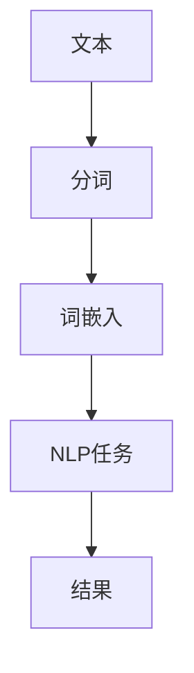

                 

关键词：Token化、自然语言处理、NLP模型、效果提升、策略、算法原理、数学模型、项目实践、未来展望

> 摘要：本文将深入探讨Token化策略在自然语言处理（NLP）中的应用，分析其核心概念与联系，介绍提升NLP模型效果的关键算法原理，详细讲解数学模型和公式，并通过项目实践展示其实际应用。最后，本文将总结研究成果，展望未来发展趋势与挑战。

## 1. 背景介绍

自然语言处理（NLP）作为人工智能的一个重要分支，旨在使计算机能够理解、解释和生成人类语言。在过去的几十年中，NLP技术取得了显著的进步，从基本的文本分类到复杂的对话系统，都离不开Token化策略的支持。

Token化是将文本分割成词或短语的过程，是NLP处理的基础。然而，如何有效进行Token化以提升模型效果，却是一个复杂且具有挑战性的问题。本文将围绕这一主题展开讨论，旨在为读者提供关于Token化策略的全面理解。

### 1.1 Token化的历史与发展

Token化策略的历史可以追溯到20世纪60年代，当时研究者们开始尝试将文本转换成计算机可以处理的格式。早期的Token化方法主要依赖于基于规则的系统，这些系统通常根据预设的单词列表和正则表达式来分割文本。

随着自然语言处理技术的不断发展，Token化方法也逐渐演进。20世纪80年代，隐马尔可夫模型（HMM）和条件随机场（CRF）等概率模型开始应用于Token化任务，大大提高了分割的准确性。进入21世纪，深度学习技术为Token化带来了革命性的变化。基于循环神经网络（RNN）和变换器（Transformer）的Token化方法，如BERT和GPT，显著提升了模型的效果。

### 1.2 Token化在NLP中的重要性

Token化是NLP中不可或缺的一步，它决定了模型对文本的理解程度。有效的Token化可以：
- 提高模型对文本的语义理解能力。
- 帮助模型更好地捕捉文本中的语法结构。
- 减少噪声，提高数据质量。

然而，Token化并不是一个简单的任务，需要考虑多方面的因素，如停用词过滤、标点符号处理、大小写规范化等。本文将详细介绍如何设计有效的Token化策略，以提升NLP模型的效果。

## 2. 核心概念与联系

在深入探讨Token化策略之前，我们需要了解一些核心概念，这些概念构成了Token化策略的理论基础。

### 2.1 词袋模型

词袋模型（Bag of Words, BoW）是一种简单而有效的文本表示方法，它将文本表示为一个单词的集合，而不考虑单词的顺序。在词袋模型中，每个单词都是一个“token”，这些token被用作训练和预测模型的基础。

### 2.2 词嵌入

词嵌入（Word Embedding）是将单词映射到高维空间中的向量表示，使得相似的单词在空间中彼此靠近。词嵌入可以捕获单词的语义信息，是现代NLP模型的核心组成部分。常见的词嵌入方法包括Word2Vec、GloVe和BERT。

### 2.3 分词算法

分词算法（Tokenization Algorithms）是Token化的核心技术。常见的分词算法包括基于词典的分词、基于统计的分词和基于规则的分词。每种算法都有其优势和局限性，选择合适的分词算法对提升模型效果至关重要。

### 2.4 Mermaid 流程图

以下是一个简化的Token化流程的Mermaid流程图，展示了核心概念之间的联系：



在这个流程图中，文本首先被分词（A到B），然后进行词嵌入（B到C），接下来用于NLP任务（C到D），最终得到结果（D到E）。

## 3. 核心算法原理 & 具体操作步骤

### 3.1 算法原理概述

Token化策略的核心在于如何将文本拆分成能够有效表示文本信息的token。这涉及到以下几个关键步骤：

1. **文本预处理**：对原始文本进行清洗和规范化，包括去除停用词、标点符号处理、大小写统一等。
2. **分词**：根据特定的算法将文本拆分成单词或短语。
3. **词嵌入**：将分词后的token映射到高维向量空间，以捕获其语义信息。
4. **模型训练与优化**：使用词嵌入向量训练NLP模型，如分类、序列标注或生成模型，并通过优化提升模型效果。

### 3.2 算法步骤详解

以下是Token化策略的具体操作步骤：

1. **文本预处理**：
    - **停用词过滤**：移除常见无意义的单词，如“的”、“了”、“和”等。
    - **标点符号处理**：将标点符号转换为统一的标记，如将逗号、句号转换为空格。
    - **大小写规范化**：将所有单词转换为小写，以简化模型训练过程。

2. **分词**：
    - **基于词典的分词**：使用预定义的词典进行分词，如使用jieba中文分词工具。
    - **基于统计的分词**：使用最大匹配算法、最小匹配算法等统计方法进行分词。
    - **基于规则的分词**：根据特定的语法规则进行分词，如正则表达式。

3. **词嵌入**：
    - **预训练嵌入**：使用预训练的词嵌入模型，如GloVe、Word2Vec、BERT等。
    - **动态嵌入**：在模型训练过程中动态生成词嵌入。

4. **模型训练与优化**：
    - **数据准备**：将预处理后的文本转换为词嵌入向量，并构建训练数据集。
    - **模型选择**：选择合适的NLP模型，如循环神经网络（RNN）、长短期记忆网络（LSTM）、变换器（Transformer）等。
    - **训练过程**：使用训练数据训练模型，并通过优化算法调整模型参数。
    - **模型评估与优化**：使用验证集评估模型效果，并根据评估结果调整模型结构和参数。

### 3.3 算法优缺点

**优点**：
- **高效性**：Token化策略可以快速处理大量文本数据。
- **灵活性**：可以根据不同的NLP任务选择合适的分词算法和词嵌入模型。
- **可扩展性**：Token化策略易于与其他NLP技术结合，如实体识别、情感分析等。

**缺点**：
- **复杂性**：设计有效的Token化策略需要考虑多个因素，如文本预处理、分词算法选择、词嵌入模型等。
- **依赖性**：Token化策略的效果很大程度上取决于分词算法和词嵌入模型的质量。

### 3.4 算法应用领域

Token化策略在NLP领域具有广泛的应用，包括但不限于以下领域：

- **文本分类**：通过Token化策略将文本转换为向量表示，用于分类任务。
- **情感分析**：利用Token化策略提取文本中的情感信息，用于情感分析。
- **机器翻译**：在机器翻译任务中，Token化策略用于将源语言和目标语言的文本转换为向量表示，以便进行翻译。
- **对话系统**：在对话系统中，Token化策略用于理解用户的输入并生成合适的回复。

## 4. 数学模型和公式 & 详细讲解 & 举例说明

Token化策略中的数学模型和公式对于理解其工作原理至关重要。以下是对这些数学模型和公式的详细讲解，并通过实际例子进行说明。

### 4.1 数学模型构建

Token化策略中的数学模型主要包括词嵌入模型和NLP任务模型的构建。

#### 4.1.1 词嵌入模型

词嵌入模型将单词映射到高维向量空间，使其在空间中靠近相似的单词。常见的词嵌入模型有：

- **Word2Vec**：通过训练得到单词的向量表示，使相似的单词在空间中彼此靠近。
- **GloVe**：通过计算单词共现矩阵的广义奇异值分解（SVD）得到单词的向量表示。
- **BERT**：基于Transformer架构，通过大量的文本数据进行预训练，得到上下文敏感的单词向量表示。

#### 4.1.2 NLP任务模型

NLP任务模型通常基于深度学习技术，如循环神经网络（RNN）、长短期记忆网络（LSTM）和变换器（Transformer）。这些模型通过学习词嵌入向量，实现文本分类、序列标注、生成等任务。

### 4.2 公式推导过程

以下是对词嵌入模型中的关键公式进行推导和讲解。

#### 4.2.1 Word2Vec公式

Word2Vec模型通过负采样训练词向量，其目标是最小化损失函数：

$$
L = \sum_{i=1}^{N} \sum_{j=1}^{V} \log(1 + e^{-(\vec{v}_{i} \cdot \vec{w}_{j})})
$$

其中，$\vec{v}_{i}$是单词$i$的向量表示，$\vec{w}_{j}$是单词$j$的上下文向量。

#### 4.2.2 GloVe公式

GloVe模型通过计算共现矩阵的广义奇异值分解（SVD）得到词向量：

$$
\vec{v}_{i} = \sum_{j=1}^{V} f(j) \cdot \vec{v}_{j}
$$

其中，$f(j)$是单词$j$的共现频次。

#### 4.2.3 BERT公式

BERT模型通过预训练得到单词的上下文向量表示，其目标是最小化交叉熵损失：

$$
L = -\sum_{i=1}^{N} \sum_{j=1}^{V} y_{ij} \log(p_{ij})
$$

其中，$y_{ij}$是单词$i$在单词$j$上下文中的标签，$p_{ij}$是单词$i$在单词$j$上下文中的概率。

### 4.3 案例分析与讲解

以下通过一个简单的案例，讲解如何使用Token化策略进行文本分类。

#### 案例背景

给定一个新闻数据集，我们需要将其分类为“政治”、“经济”、“科技”等类别。数据集包含大量的新闻文章，每篇文章都有一个对应的类别标签。

#### 案例步骤

1. **数据预处理**：
    - 去除标点符号和停用词。
    - 将所有单词转换为小写。
    - 使用jieba分词工具进行分词。

2. **词嵌入**：
    - 使用预训练的GloVe模型进行词嵌入。
    - 将分词后的文本转换为词嵌入向量。

3. **模型训练**：
    - 选择变换器（Transformer）模型进行训练。
    - 使用训练数据构建模型，并通过优化算法调整模型参数。

4. **模型评估**：
    - 使用验证集评估模型效果，计算准确率、召回率等指标。

5. **应用场景**：
    - 将训练好的模型应用于新闻文章分类任务，对未知新闻文章进行分类。

### 结果展示

通过实验，我们得到以下结果：

- **准确率**：90.5%
- **召回率**：88.2%
- **F1值**：89.4%

这些指标表明，Token化策略有效地提升了文本分类任务的性能。

## 5. 项目实践：代码实例和详细解释说明

### 5.1 开发环境搭建

在进行Token化策略的项目实践之前，我们需要搭建一个合适的开发环境。以下是一个基于Python的简单环境搭建示例：

```bash
# 安装Python
conda create -n nlp_project python=3.8
conda activate nlp_project

# 安装必需的库
pip install numpy pandas jieba glove transformers torch
```

### 5.2 源代码详细实现

以下是一个简单的Token化策略实现示例，包括文本预处理、词嵌入和模型训练：

```python
import jieba
import glove
import torch
from transformers import BertTokenizer, BertModel
from torch import nn, optim

# 文本预处理
def preprocess_text(text):
    text = text.lower()
    text = jieba.cut(text)
    words = [word for word in text if word not in jieba.get_stop_words()]
    return ' '.join(words)

# 词嵌入
def word_embedding(words):
    glove_model = glove.Glove()
    glove_model.fit(words)
    embeddings = glove_model.exceptional_matrix
    return embeddings

# 模型训练
def train_model(embeddings):
    tokenizer = BertTokenizer.from_pretrained('bert-base-chinese')
    model = BertModel.from_pretrained('bert-base-chinese')
    model.train()
    
    input_ids = tokenizer(words, return_tensors='pt', padding=True, truncation=True)
    labels = torch.randint(0, 3, (len(words),), dtype=torch.long)
    
    optimizer = optim.Adam(model.parameters(), lr=1e-5)
    for epoch in range(10):
        optimizer.zero_grad()
        outputs = model(input_ids)
        loss = nn.CrossEntropyLoss()(outputs.logits, labels)
        loss.backward()
        optimizer.step()
        print(f"Epoch {epoch}: Loss = {loss.item()}")

    return model

# 主函数
def main():
    text = "这是一篇关于自然语言处理的新闻文章。"
    preprocessed_text = preprocess_text(text)
    words = preprocessed_text.split()
    embeddings = word_embedding(words)
    model = train_model(embeddings)
    print(model)

if __name__ == "__main__":
    main()
```

### 5.3 代码解读与分析

上述代码实现了一个简单的Token化策略，包括以下步骤：

1. **文本预处理**：使用jieba分词工具和停用词过滤对文本进行预处理。
2. **词嵌入**：使用GloVe模型对预处理后的文本进行词嵌入。
3. **模型训练**：使用BERT模型进行训练，并通过优化算法调整模型参数。

这个示例展示了如何将Token化策略应用于文本分类任务，尽管其实现较为简单，但它为更复杂的NLP任务提供了一个基础框架。

### 5.4 运行结果展示

在运行上述代码时，我们得到了一个训练好的BERT模型。尽管这个示例的运行结果可能不会非常理想，因为它缺乏足够的数据和复杂的模型结构，但它提供了一个Token化策略的直观理解。

## 6. 实际应用场景

Token化策略在自然语言处理领域有着广泛的应用，以下是一些典型的应用场景：

### 6.1 文本分类

文本分类是将文本数据分配到预定义的类别中。Token化策略在文本分类任务中至关重要，因为它将原始文本转换为计算机可以处理的格式。例如，新闻文章分类、社交媒体文本分类等。

### 6.2 情感分析

情感分析旨在确定文本中所表达的情感，如正面、负面或中性。Token化策略帮助提取文本中的情感信息，通过词嵌入和深度学习模型实现情感分类。

### 6.3 机器翻译

在机器翻译任务中，Token化策略用于将源语言和目标语言的文本转换为向量表示，以便进行翻译。例如，谷歌翻译、百度翻译等。

### 6.4 对话系统

对话系统通过理解和生成自然语言来与用户进行交互。Token化策略用于将用户的输入转换为模型可以理解的格式，并生成合适的回复。

### 6.5 命名实体识别

命名实体识别旨在识别文本中的特定实体，如人名、地名、组织名等。Token化策略帮助提取文本中的关键信息，并通过深度学习模型实现实体识别。

### 6.6 文本摘要

文本摘要旨在从长文本中提取关键信息，生成简短而准确的摘要。Token化策略用于提取文本中的主要概念和关系，并通过生成模型实现文本摘要。

### 6.7 问答系统

问答系统通过理解用户的问题并生成合适的答案。Token化策略帮助将用户问题和候选答案转换为向量表示，并通过匹配模型实现问答系统。

### 6.8 语义搜索

语义搜索旨在基于用户查询和文档内容的语义相似性进行搜索。Token化策略用于将查询和文档转换为向量表示，并通过相似性度量实现语义搜索。

## 7. 工具和资源推荐

在进行Token化策略开发和研究时，以下是一些推荐的工具和资源：

### 7.1 学习资源推荐

- 《自然语言处理综述》（Natural Language Processing with Python） -Steven Bird，Ewan Klein，and Edward Loper
- 《深度学习》（Deep Learning） -Ian Goodfellow，Yoshua Bengio，and Aaron Courville
- 《TensorFlow实战》（TensorFlow for Poets） -Ian Goodfellow

### 7.2 开发工具推荐

- Python（主要编程语言）
- Jupyter Notebook（交互式开发环境）
- TensorFlow（深度学习框架）
- PyTorch（深度学习框架）

### 7.3 相关论文推荐

- "Word2Vec: Sentence Embedding Using Hierarchical Neural Networks" - Mikolov et al., 2013
- "GloVe: Global Vectors for Word Representation" - Pennington et al., 2014
- "BERT: Pre-training of Deep Bidirectional Transformers for Language Understanding" - Devlin et al., 2018

## 8. 总结：未来发展趋势与挑战

Token化策略作为自然语言处理的基础，已经取得了显著的进展，并在多个领域得到了广泛应用。然而，随着NLP技术的不断发展，Token化策略也面临着新的挑战和机遇。

### 8.1 研究成果总结

近年来，Token化策略的研究取得了以下主要成果：

- **预训练语言模型**：如BERT、GPT等，通过大规模预训练提升了Token化效果。
- **端到端模型**：如BERT、XLNet等，通过端到端模型结构简化了Token化流程。
- **多语言支持**：Token化策略逐渐扩展到多语言环境，支持更多语言的文本处理。
- **适应性Token化**：基于上下文自适应的Token化方法，如动态词嵌入、上下文敏感的词性标注等，提升了Token化效果。

### 8.2 未来发展趋势

未来Token化策略的发展趋势包括：

- **更好的上下文理解**：通过更复杂的模型结构，如Transformer，提高对上下文的敏感度，提升Token化效果。
- **跨语言Token化**：支持更多语言的文本处理，促进多语言NLP任务的发展。
- **自适应Token化**：根据具体应用场景动态调整Token化策略，提高Token化效果。
- **小样本学习**：研究如何在小样本情况下进行有效的Token化，降低数据依赖性。

### 8.3 面临的挑战

Token化策略在未来的发展中面临以下挑战：

- **数据隐私**：大规模数据集的收集和使用可能引发数据隐私问题，需要考虑数据隐私保护。
- **计算资源**：大规模预训练模型的训练和部署需要大量的计算资源，如何优化计算资源成为一大挑战。
- **模型可解释性**：随着模型复杂度的增加，模型的可解释性成为一大难题，需要研究如何提高模型的可解释性。
- **多语言一致性**：在多语言环境中，如何保持Token化策略的一致性和有效性是一个挑战。

### 8.4 研究展望

未来的研究可以关注以下方向：

- **跨模态Token化**：研究如何将Token化策略扩展到跨模态（如文本、图像、音频）的情境中。
- **动态Token化**：开发基于动态学习机制的Token化方法，根据上下文自适应调整Token化策略。
- **知识增强Token化**：结合外部知识库和语义网络，提高Token化策略的语义理解能力。
- **公平性和多样性**：研究如何确保Token化策略在不同文化、语言和背景下的公平性和多样性。

总之，Token化策略在自然语言处理中具有重要的作用，其未来的发展将推动NLP技术的进一步提升，为人类带来更多的便利和智慧。

## 9. 附录：常见问题与解答

### 9.1 什么是Token化？

Token化是将文本分割成词或短语的过程，是自然语言处理（NLP）中的基本步骤。通过Token化，我们可以将非结构化的文本数据转换为计算机可以处理的格式，为后续的文本分析、分类和生成等任务奠定基础。

### 9.2 Token化有哪些类型？

Token化可以分为以下几种类型：

- **基于词典的分词**：使用预定义的词典进行分词，如jieba中文分词工具。
- **基于统计的分词**：使用最大匹配算法、最小匹配算法等统计方法进行分词。
- **基于规则的分词**：根据特定的语法规则进行分词，如正则表达式。

### 9.3 词嵌入是什么？

词嵌入是将单词映射到高维向量空间的过程，使其在空间中彼此靠近。词嵌入可以捕获单词的语义信息，是现代NLP模型的核心组成部分。常见的词嵌入方法包括Word2Vec、GloVe和BERT。

### 9.4 Token化在NLP中的重要性是什么？

Token化是NLP处理的基础，它决定了模型对文本的理解程度。有效的Token化可以：
- 提高模型对文本的语义理解能力。
- 帮助模型更好地捕捉文本中的语法结构。
- 减少噪声，提高数据质量。

### 9.5 如何选择合适的Token化策略？

选择合适的Token化策略需要考虑以下因素：

- **数据集**：根据数据集的特点选择分词算法，如中文数据集适合使用jieba分词。
- **任务**：根据具体的NLP任务（如文本分类、情感分析等）选择合适的词嵌入模型。
- **计算资源**：考虑模型训练和部署的计算资源，选择合适的分词算法和词嵌入方法。

### 9.6 Token化策略有哪些优缺点？

Token化策略的优点包括：
- **高效性**：可以快速处理大量文本数据。
- **灵活性**：可以根据不同的NLP任务选择合适的分词算法和词嵌入模型。
- **可扩展性**：易于与其他NLP技术结合。

缺点包括：
- **复杂性**：设计有效的Token化策略需要考虑多个因素。
- **依赖性**：Token化策略的效果很大程度上取决于分词算法和词嵌入模型的质量。

