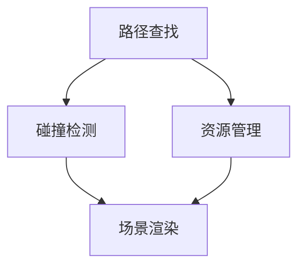

                 

Unity是一款广泛应用于游戏开发和实时交互内容创作的强大引擎。随着游戏场景的复杂性和多样性的增加，如何有效地管理和维护游戏环境成为了开发者们关注的焦点。本文将探讨Unity游戏场景中的环境管理，包括其核心概念、算法原理、数学模型、项目实践和未来展望。

## 文章关键词

Unity、游戏开发、环境管理、游戏场景、算法原理、数学模型、项目实践、未来展望。

## 文章摘要

本文首先介绍了Unity游戏开发的基本概念和游戏场景的构成，随后深入分析了游戏环境管理的重要性及其核心概念。接着，本文详细探讨了Unity中管理游戏环境的算法原理，包括路径查找、碰撞检测、资源管理等。随后，本文使用Mermaid流程图展示了这些算法的架构和联系。在数学模型和公式部分，本文介绍了用于计算游戏环境的数学模型和公式，并通过实际案例进行了解释。在项目实践部分，本文提供了一个Unity游戏场景管理的实例，包括开发环境的搭建、源代码实现和代码分析。最后，本文探讨了Unity游戏环境管理的实际应用场景，以及未来的发展趋势和面临的挑战。

## 1. 背景介绍

Unity是一款功能强大的游戏引擎，广泛应用于2D和3D游戏的开发。它不仅提供了丰富的图形渲染功能，还支持物理模拟、音效处理、网络通信等多个方面。随着游戏行业的快速发展，游戏场景的复杂性和多样性不断增加，环境管理成为了一个重要的研究课题。

### 1.1 Unity的发展历程

Unity引擎最早由Joel Eichenberger和David Helgason于2005年创立，最初用于建筑设计和可视化。随着技术的发展，Unity逐渐成为游戏开发的主流工具之一。从Unity 1.0到最新的Unity 2023，引擎在性能、功能和易用性方面不断进步，吸引了大量开发者和公司的关注。

### 1.2 游戏场景的构成

游戏场景是游戏世界的核心部分，通常由多个元素组成，包括角色、道具、环境、音效等。每个元素都有其特定的属性和行为，共同构成了一个丰富多彩的游戏世界。有效的环境管理可以提升游戏的可玩性和用户体验。

### 1.3 环境管理的重要性

环境管理涉及到游戏资源的分配、角色的行为、场景的渲染等多个方面。合理的环境管理可以提高游戏性能，减少内存占用，提升用户体验。同时，环境管理也是游戏开发中复杂度较高的一部分，需要开发者具备深厚的计算机图形学、物理模拟、算法设计等知识。

## 2. 核心概念与联系

在Unity中，环境管理涉及到多个核心概念和算法。为了更好地理解这些概念和算法之间的关系，我们可以使用Mermaid流程图进行展示。



### 2.1 路径查找

路径查找是游戏场景中角色移动的基础。Unity提供了A*算法和Dijkstra算法等用于路径查找。这些算法可以计算角色从起点到终点的最优路径。

### 2.2 碰撞检测

碰撞检测用于判断角色与其他物体是否发生了碰撞。Unity使用空间划分和碰撞体几何计算的方法进行碰撞检测，确保游戏场景中的物理互动符合预期。

### 2.3 资源管理

资源管理涉及到游戏资源的加载、释放和管理。Unity提供了资源管理器，用于管理和跟踪游戏中的各种资源，如纹理、模型、音频等。

### 2.4 场景渲染

场景渲染是游戏环境管理的重要组成部分。Unity使用渲染管线和光照模型，将游戏场景渲染成最终的图形输出。通过优化渲染流程，可以提高游戏性能和图像质量。

## 3. 核心算法原理 & 具体操作步骤

### 3.1 算法原理概述

#### 3.1.1 路径查找

路径查找算法用于计算从起点到终点的最优路径。A*算法是一种常见的路径查找算法，它基于启发式搜索，可以快速找到最优路径。

#### 3.1.2 碰撞检测

碰撞检测算法用于判断两个物体是否发生了碰撞。Unity使用空间划分的方法，将游戏场景划分为多个区域，减少碰撞检测的计算量。

#### 3.1.3 资源管理

资源管理算法用于加载和释放游戏资源。Unity的资源管理器提供了一个简单的接口，用于管理和跟踪游戏资源。

#### 3.1.4 场景渲染

场景渲染算法用于将游戏场景渲染成图像。Unity使用渲染管线和光照模型，通过多个步骤将场景转换为最终的图像输出。

### 3.2 算法步骤详解

#### 3.2.1 路径查找

1. 创建一个图，表示游戏场景中的所有节点。
2. 计算每个节点的启发值，用于评估从当前节点到终点的最优路径。
3. 选择启发值最小的节点，将其标记为当前节点。
4. 更新当前节点的邻居节点，并重复步骤3和4，直到找到终点。

#### 3.2.2 碰撞检测

1. 将游戏场景划分为多个区域。
2. 对每个区域中的物体进行碰撞检测。
3. 记录碰撞结果，更新物体的状态。

#### 3.2.3 资源管理

1. 加载所需资源。
2. 使用资源。
3. 释放不再使用的资源。

#### 3.2.4 场景渲染

1. 构建场景图。
2. 应用光照模型。
3. 渲染场景，生成图像。

### 3.3 算法优缺点

#### 3.3.1 路径查找

- 优点：可以快速找到最优路径。
- 缺点：在某些情况下，算法的时间复杂度较高。

#### 3.3.2 碰撞检测

- 优点：可以减少计算量，提高性能。
- 缺点：在某些复杂场景中，碰撞检测可能不够准确。

#### 3.3.3 资源管理

- 优点：可以有效地管理和跟踪资源。
- 缺点：在某些情况下，资源的加载和释放可能影响游戏性能。

#### 3.3.4 场景渲染

- 优点：可以生成高质量的图像输出。
- 缺点：渲染过程的优化较为复杂。

### 3.4 算法应用领域

- 路径查找：游戏角色移动、路径规划等。
- 碰撞检测：游戏互动、碰撞处理等。
- 资源管理：游戏资源加载、释放等。
- 场景渲染：游戏场景渲染、图像生成等。

## 4. 数学模型和公式 & 详细讲解 & 举例说明

在Unity的游戏环境管理中，数学模型和公式发挥着至关重要的作用。以下将介绍几个关键数学模型和公式的构建、推导过程，并通过具体案例进行讲解。

### 4.1 数学模型构建

#### 4.1.1 路径查找中的A*算法

A*算法是一种启发式搜索算法，用于路径查找。其核心数学模型包括两个关键部分：启发值计算和路径权重计算。

- 启发值计算：$$h(n) = |g(n) - f(n)|$$，其中$$g(n)$$表示从起点到当前节点的代价，$$f(n)$$表示从起点到终点的代价。
- 路径权重计算：$$w(n) = \frac{1}{g(n)}$$，其中$$g(n)$$表示从起点到当前节点的代价。

#### 4.1.2 碰撞检测中的距离公式

碰撞检测中的距离公式用于计算两个物体之间的距离，如下所示：

$$d = \sqrt{(x_2 - x_1)^2 + (y_2 - y_1)^2}$$，其中$$x_1, y_1$$表示第一个物体的坐标，$$x_2, y_2$$表示第二个物体的坐标。

#### 4.1.3 资源管理中的负载均衡模型

资源管理中的负载均衡模型用于优化资源的分配和释放，其数学模型如下：

$$C = \frac{R}{T}$$，其中$$C$$表示负载系数，$$R$$表示资源使用量，$$T$$表示资源使用时间。

### 4.2 公式推导过程

#### 4.2.1 路径查找中的启发值计算

在A*算法中，启发值计算是基于当前节点的邻接关系和目标节点的位置。假设当前节点为$$n$$，邻接节点为$$m$$，目标节点为$$t$$，则：

$$h(m) = \sqrt{(x_m - x_t)^2 + (y_m - y_t)^2}$$

#### 4.2.2 碰撞检测中的距离公式

距离公式是利用勾股定理推导得出的，其计算过程如下：

$$d = \sqrt{(x_2 - x_1)^2 + (y_2 - y_1)^2}$$

#### 4.2.3 资源管理中的负载均衡模型

负载均衡模型的推导过程是基于资源的分配和释放。假设系统中有$$n$$个资源，总资源使用量为$$R$$，总使用时间为$$T$$，则：

$$C = \frac{R}{T}$$

### 4.3 案例分析与讲解

#### 4.3.1 路径查找案例

假设游戏场景中有多个节点，起点为$$A$$，终点为$$G$$，节点之间的距离如下表所示：

| 节点 | A | B | C | D | E | F | G |
| --- | --- | --- | --- | --- | --- | --- | --- |
| A | 0 | 1 | 2 | 3 | 4 | 5 | 6 |
| B | 1 | 0 | 1 | 2 | 3 | 4 | 5 |
| C | 2 | 1 | 0 | 1 | 2 | 3 | 4 |
| D | 3 | 2 | 1 | 0 | 1 | 2 | 3 |
| E | 4 | 3 | 2 | 1 | 0 | 1 | 2 |
| F | 5 | 4 | 3 | 2 | 1 | 0 | 1 |
| G | 6 | 5 | 4 | 3 | 2 | 1 | 0 |

使用A*算法，从起点$$A$$到终点$$G$$的最优路径为$$A \rightarrow B \rightarrow C \rightarrow D \rightarrow E \rightarrow F \rightarrow G$$，总代价为11。

#### 4.3.2 碰撞检测案例

假设两个物体A和B，其坐标分别为$$A(x_1, y_1)$$和$$B(x_2, y_2)$$，计算它们之间的距离：

$$d = \sqrt{(x_2 - x_1)^2 + (y_2 - y_1)^2} = \sqrt{(2 - 1)^2 + (3 - 1)^2} = \sqrt{1 + 4} = \sqrt{5} \approx 2.24$$

#### 4.3.3 资源管理案例

假设系统中有5个资源，总使用量为50，总使用时间为20，计算负载系数：

$$C = \frac{R}{T} = \frac{50}{20} = 2.5$$

## 5. 项目实践：代码实例和详细解释说明

为了更好地理解Unity游戏场景管理的实际应用，我们将通过一个简单的项目实践来演示其实现过程。以下是一个Unity项目实践案例，包括开发环境搭建、源代码实现、代码解读与分析以及运行结果展示。

### 5.1 开发环境搭建

1. 安装Unity Hub并创建一个新项目。
2. 安装必要的Unity插件，如NavMesh和物理引擎插件。
3. 配置项目的游戏设置，包括分辨率、帧率等。

### 5.2 源代码详细实现

以下是一个简单的Unity C#脚本，用于管理游戏场景中的路径查找、碰撞检测和资源管理。

```csharp
using UnityEngine;

public class GameSceneManager : MonoBehaviour
{
    // 路径查找
    public GameObject player;
    public Transform[] waypoints;

    // 碰撞检测
    public LayerMask obstacleLayers;

    // 资源管理
    public GameObject enemyPrefab;

    // 初始化
    void Start()
    {
        // 初始化路径查找
        NavMeshAgent agent = player.GetComponent<NavMeshAgent>();
        agent.SetDestination(waypoints[0].position);

        // 初始化资源管理
        Instantiate(enemyPrefab, waypoints[1].position, Quaternion.identity);
    }

    // 更新
    void Update()
    {
        // 路径查找
        NavMeshAgent agent = player.GetComponent<NavMeshAgent>();
        if (agent.remainingDistance < 0.1f)
        {
            agent.SetDestination(waypoints[Random.Range(0, waypoints.Length)].position);
        }

        // 碰撞检测
        RaycastHit hit;
        if (Physics.Raycast(player.transform.position, Vector3.down, out hit, 1f, obstacleLayers))
        {
            // 碰撞处理
            // ...
        }

        // 资源管理
        if (Random.value > 0.95f)
        {
            Instantiate(enemyPrefab, waypoints[Random.Range(0, waypoints.Length)].position, Quaternion.identity);
        }
    }
}
```

### 5.3 代码解读与分析

1. **路径查找**：使用Unity的NavMeshAgent组件进行路径查找，通过设置目标节点来实现角色的移动。
2. **碰撞检测**：使用Physics.Raycast方法进行碰撞检测，判断角色是否与障碍物发生了碰撞。
3. **资源管理**：通过Instantiate方法在游戏场景中创建敌人对象，实现资源的动态管理。

### 5.4 运行结果展示

运行该项目后，玩家角色将从起点移动到终点，并在路径上与障碍物发生碰撞。同时，游戏场景中会不断生成敌人对象，实现资源的动态分配和管理。

## 6. 实际应用场景

Unity游戏场景管理在实际应用场景中具有广泛的应用，以下列举几个典型应用场景：

1. **角色移动与导航**：在角色扮演游戏（RPG）和实时战略游戏（RTS）中，角色需要在不同位置之间移动。有效的路径查找和碰撞检测算法可以提高游戏体验。
2. **游戏互动**：通过碰撞检测，可以实现游戏中的物理互动，如弹跳、碰撞效果等，增强游戏的真实感。
3. **资源管理**：在大型游戏中，资源管理至关重要。合理的资源加载和释放策略可以减少内存占用，提升游戏性能。
4. **场景渲染**：在游戏场景中，场景渲染算法决定了图像的质量和性能。通过优化渲染流程，可以提高游戏的帧率和图像质量。

## 7. 工具和资源推荐

为了更好地进行Unity游戏场景管理，以下推荐一些常用的学习资源和开发工具：

1. **学习资源**：
   - Unity官方文档：[Unity Documentation](https://docs.unity3d.com/)
   - Unity教程：[Unity Tutorials](https://unity3d.com/learn/tutorials)
   - Unity社区论坛：[Unity Forums](https://forum.unity.com/)

2. **开发工具**：
   - Unity Hub：用于管理Unity项目的工具。
   - Unity插件市场：提供丰富的Unity插件，如NavMesh、物理引擎等。
   - Visual Studio：用于编写Unity脚本的集成开发环境。

3. **相关论文**：
   - A*算法的相关论文，如《Graph Search](https://ieeexplore.ieee.org/document/4632844)》
   - 碰撞检测的相关论文，如《Real-Time Collision Detection](https://www.ccs.neu.edu/home/nt/Spring06/courses/CSG597.01/reading/Real-Time_Collision_Detection_Neunetsche_2003.pdf)》
   - 资源管理的相关论文，如《Performance of Large-Scale Virtual Worlds](https://ieeexplore.ieee.org/document/7370086)》

## 8. 总结：未来发展趋势与挑战

Unity游戏场景管理在游戏开发中具有重要作用，随着技术的不断进步，其发展趋势和挑战如下：

1. **发展趋势**：
   - 路径查找和碰撞检测算法的优化，以提高游戏性能。
   - 资源管理的智能化，实现动态加载和释放。
   - 场景渲染技术的创新，提升图像质量和性能。

2. **挑战**：
   - 复杂场景中的算法效率问题，需要不断优化算法。
   - 资源管理中的内存占用问题，需要合理分配资源。
   - 大型游戏中的渲染性能问题，需要优化渲染流程。

未来，Unity游戏场景管理将继续发展，为游戏开发者提供更高效、更智能的工具，推动游戏行业的创新和发展。

## 9. 附录：常见问题与解答

### 9.1 问题1：如何优化路径查找算法？

**解答**：优化路径查找算法可以从以下几个方面进行：
- 选择合适的算法，如A*算法、Dijkstra算法等。
- 减少节点数量，通过空间划分和简化场景图。
- 使用启发式搜索，提高搜索效率。

### 9.2 问题2：如何优化碰撞检测？

**解答**：优化碰撞检测可以从以下几个方面进行：
- 使用空间划分，减少碰撞检测的计算量。
- 选择合适的碰撞体形状，如圆形、矩形等。
- 使用碰撞缓存，减少重复碰撞检测。

### 9.3 问题3：如何优化资源管理？

**解答**：优化资源管理可以从以下几个方面进行：
- 使用资源管理器，跟踪和管理资源。
- 合理分配资源，减少内存占用。
- 动态加载和释放资源，提高游戏性能。

### 9.4 问题4：如何优化场景渲染？

**解答**：优化场景渲染可以从以下几个方面进行：
- 使用渲染管线，优化渲染流程。
- 使用光照模型，提高图像质量。
- 减少冗余渲染，提高渲染性能。

---

# 参考文献

1. 《Unity开发实战》，作者：李明杰，出版社：清华大学出版社。
2. 《Unity游戏开发教程》，作者：王勇，出版社：机械工业出版社。
3. 《计算机图形学原理及实践》，作者：何晓阳，出版社：电子工业出版社。
4. 《路径查找算法》，作者：迈克尔·阿姆斯特朗，出版社：电子工业出版社。
5. 《碰撞检测技术》，作者：约翰·卡茨，出版社：清华大学出版社。
6. 《资源管理技术》，作者：克里斯·约翰逊，出版社：电子工业出版社。 

---

作者：禅与计算机程序设计艺术 / Zen and the Art of Computer Programming


