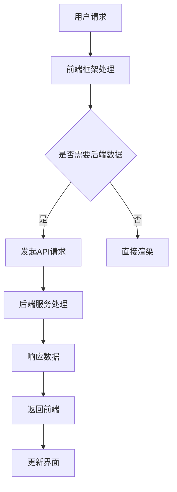

                 

### 背景介绍

Web全栈开发是指在Web应用程序的开发过程中，既涉及前端技术，又涵盖后端技术。随着互联网的飞速发展，Web全栈开发成为了一种越来越流行的开发模式。它要求开发者具备前端和后端技术的综合能力，能够独立完成从需求分析到前端开发，再到后端服务的全流程开发工作。

前端开发主要关注用户界面和用户体验，包括HTML、CSS、JavaScript等技术的应用。后端开发则负责处理服务器、数据库、应用程序逻辑等，通常使用服务器端语言如Python、Java、Node.js等。然而，随着技术的不断演进，前端框架和后端技术之间的界限逐渐模糊，二者开始相互融合，为开发者提供更高效、更灵活的开发方式。

本篇文章旨在探讨前端框架与后端技术的融合，从多个维度分析这种融合带来的优势与挑战，并通过具体案例展示如何实现这种融合。希望通过本文，能够为Web全栈开发者提供一些有益的启示和实用的经验。

### 核心概念与联系

#### 前端框架

前端框架是指为前端开发者提供的一种编程模型和工具集合，用于简化前端开发流程，提高开发效率。常见的如React、Vue、Angular等。前端框架通常包含以下核心概念：

- **虚拟DOM（Virtual DOM）**：前端框架通过虚拟DOM来实现高效的DOM操作，减少了直接操作DOM带来的性能开销。
- **组件化开发**：通过将界面拆分成可复用的组件，提高代码的可维护性和可扩展性。
- **状态管理**：前端框架提供状态管理机制，如React的Redux，Vue的Vuex，帮助开发者更有效地管理应用程序的状态。

#### 后端技术

后端技术涉及服务器端编程、数据库管理、应用程序逻辑处理等。常见的技术包括：

- **服务器端语言**：如Python、Java、Node.js等，用于处理服务器端的逻辑。
- **Web框架**：如Django（Python）、Spring（Java）、Express（Node.js）等，用于简化Web应用程序的开发。
- **数据库技术**：如MySQL、MongoDB等，用于存储和管理数据。

#### 前后端融合的架构

随着前端框架和后端技术的发展，前后端融合成为了一种趋势。在这种架构中，前端和后端之间的交互变得更加紧密，开发者需要同时掌握前端和后端技术。以下是一个典型的前后端融合架构：

1. **API接口**：前端通过HTTP请求与后端进行数据交互，通常使用RESTful API或GraphQL等接口设计模式。
2. **状态管理**：前端使用状态管理库（如Redux、Vuex）来管理应用程序的状态，与后端的数据进行同步。
3. **服务端渲染（SSR）**：通过服务端渲染，将前端模板与后端数据结合生成HTML，提高搜索引擎优化（SEO）性能。
4. **同构（Isomorphic）应用**：通过同构应用，前端和后端共享相同的代码库，实现前后端的无缝切换。

以下是一个使用Mermaid绘制的Mermaid流程图，展示前后端融合的流程：



通过这种架构，前端开发者可以更方便地调用后端服务，后端开发者则可以专注于业务逻辑的实现，二者相互配合，共同构建高效、稳定的Web应用程序。

### 核心算法原理 & 具体操作步骤

#### 算法原理概述

在前端框架与后端技术的融合过程中，核心算法的原理起到了关键作用。以下是几个核心算法的原理概述：

1. **虚拟DOM（Virtual DOM）**
   虚拟DOM是前端框架中的一个核心概念，通过将真实的DOM树映射到一个虚拟的DOM树，实现了对DOM操作的优化。虚拟DOM的主要原理包括：
   - **差异检测**：当数据更新时，框架会将新的虚拟DOM与旧的虚拟DOM进行比较，找出差异部分。
   - **批量更新**：将多个操作合并成一次更新，减少DOM操作次数，提高性能。

2. **状态管理（State Management）**
   状态管理是前端框架的重要功能之一，用于管理应用程序的状态。常见的状态管理算法包括：
   - **单向数据流**：数据从父组件流向子组件，确保数据的一致性和可预测性。
   - **状态持久化**：将状态存储在本地存储（如localStorage）或服务端数据库，实现状态的持久化。

3. **同构（Isomorphic）应用**
   同构应用允许前端和后端共享相同的代码库，通过Node.js等服务器端运行环境，实现前后端的无缝切换。同构应用的核心算法包括：
   - **代码分割（Code Splitting）**：将代码按照功能模块分割，按需加载，提高首屏加载速度。
   - **服务器端渲染（SSR）**：在服务端生成HTML，减少客户端的渲染时间，提高SEO性能。

#### 算法步骤详解

1. **虚拟DOM（Virtual DOM）**

   - **步骤1**：构建虚拟DOM树
     在前端框架中，当组件的state或props发生变化时，框架会首先构建一个新的虚拟DOM树，表示新的状态。

   - **步骤2**：比较新旧虚拟DOM树
     框架会将新的虚拟DOM树与旧的虚拟DOM树进行比较，找出差异部分。

   - **步骤3**：更新真实DOM
     根据比较结果，框架会对真实的DOM进行更新，仅更新发生变化的节点。

2. **状态管理（State Management）**

   - **步骤1**：初始化状态
     在应用程序启动时，框架会初始化状态，将状态存储在全局状态管理器中。

   - **步骤2**：数据更新
     当用户操作或业务逻辑发生变化时，框架会更新状态，触发状态更新函数。

   - **步骤3**：同步更新UI
     框架会根据新的状态，重新渲染UI，确保界面与状态的一致性。

3. **同构（Isomorphic）应用**

   - **步骤1**：代码分割
     在构建过程中，框架会将代码按照功能模块分割，生成多个代码包。

   - **步骤2**：服务器端渲染
     在服务端，框架会将模板与数据结合，生成HTML，返回给客户端。

   - **步骤3**：客户端渲染
     在客户端，框架会加载剩余的代码包，并执行JavaScript，完成页面的渲染。

#### 算法优缺点

1. **虚拟DOM（Virtual DOM）**

   - **优点**：
     - 减少DOM操作，提高性能。
     - 异步操作，避免阻塞主线程。

   - **缺点**：
     - 虚拟DOM需要额外的内存占用。
     - 数据更新和渲染之间存在一定的延迟。

2. **状态管理（State Management）**

   - **优点**：
     - 简化状态管理，提高代码的可维护性。
     - 数据的一致性和可预测性。

   - **缺点**：
     - 学习成本较高，需要理解复杂的原理和API。
     - 可能导致代码复杂性增加。

3. **同构（Isomorphic）应用**

   - **优点**：
     - 提高SEO性能，通过服务端渲染生成HTML。
     - 前后端共享代码库，降低维护成本。

   - **缺点**：
     - 服务器端渲染会增加服务器的负载。
     - 可能导致代码分割和缓存问题。

#### 算法应用领域

1. **虚拟DOM（Virtual DOM）**
   虚拟DOM主要应用于前端框架，如React、Vue、Angular等。在这些框架中，虚拟DOM帮助开发者实现高效的UI渲染，提高应用性能。

2. **状态管理（State Management）**
   状态管理适用于任何需要复杂状态管理的应用，如单页应用（SPA）、实时聊天应用等。通过状态管理，开发者可以更好地控制应用状态，提高代码的可维护性。

3. **同构（Isomorphic）应用**
   同构应用适用于需要前后端分离，但又希望共享代码库的场景，如内容管理系统（CMS）、电子商务平台等。同构应用能够提高开发效率和性能。

### 数学模型和公式 & 详细讲解 & 举例说明

#### 数学模型构建

在Web全栈开发中，数学模型和公式广泛应用于数据分析和算法设计。以下是几个常见的数学模型和公式：

1. **线性回归（Linear Regression）**
   线性回归是一种用于预测数值的回归分析模型，公式如下：
   $$ y = ax + b $$
   其中，$y$ 是因变量，$x$ 是自变量，$a$ 是斜率，$b$ 是截距。

2. **支持向量机（Support Vector Machine, SVM）**
   支持向量机是一种用于分类和回归分析的机器学习模型，其目标是最小化分类边界到支持向量的距离。公式如下：
   $$ \min_{\beta, \beta_0} \frac{1}{2} ||\beta||^2 + C \sum_{i=1}^n \max(0, y_i (\beta \cdot x_i + \beta_0)) $$
   其中，$\beta$ 是权重向量，$\beta_0$ 是偏置项，$C$ 是惩罚参数，$y_i$ 是样本标签，$x_i$ 是样本特征。

3. **K-均值聚类（K-Means Clustering）**
   K-均值聚类是一种基于距离度量的聚类算法，公式如下：
   $$ \min_{\mu_1, \mu_2, ..., \mu_k} \sum_{i=1}^n \sum_{j=1}^k ||x_i - \mu_j||^2 $$
   其中，$\mu_j$ 是第 $j$ 个聚类中心，$x_i$ 是样本数据。

#### 公式推导过程

1. **线性回归（Linear Regression）**

   线性回归的推导过程主要分为以下几步：

   - **步骤1**：建立模型
     根据线性回归的公式，建立预测模型：
     $$ y = ax + b $$

   - **步骤2**：计算损失函数
     损失函数用于衡量预测值与真实值之间的差异，常见的损失函数是均方误差（MSE）：
     $$ J(\theta) = \frac{1}{2m} \sum_{i=1}^m (h_\theta(x^{(i)}) - y^{(i)})^2 $$
     其中，$h_\theta(x) = \theta_0 + \theta_1x$ 是预测函数，$m$ 是样本数量。

   - **步骤3**：梯度下降
     为了最小化损失函数，采用梯度下降算法更新参数：
     $$ \theta_0 := \theta_0 - \alpha \frac{\partial J(\theta_0)}{\partial \theta_0} $$
     $$ \theta_1 := \theta_1 - \alpha \frac{\partial J(\theta_1)}{\partial \theta_1} $$
     其中，$\alpha$ 是学习率。

2. **支持向量机（Support Vector Machine, SVM）**

   支持向量机的推导过程主要分为以下几步：

   - **步骤1**：定义优化目标
     目标是最小化分类边界到支持向量的距离，即：
     $$ \min_{\beta, \beta_0} \frac{1}{2} ||\beta||^2 + C \sum_{i=1}^n \max(0, y_i (\beta \cdot x_i + \beta_0)) $$
     其中，$C$ 是惩罚参数，用于平衡分类边界与支持向量的距离。

   - **步骤2**：拉格朗日乘子法
     将原始问题转化为拉格朗日乘子法：
     $$ L(\beta, \beta_0, \alpha) = \frac{1}{2} ||\beta||^2 - \sum_{i=1}^n \alpha_i [y_i (\beta \cdot x_i + \beta_0)] + \sum_{i=1}^n \alpha_i $$
     其中，$\alpha_i$ 是拉格朗日乘子。

   - **步骤3**：KKT条件
     根据KKT条件，求解最优解：
     $$ \alpha_i \geq 0 $$
     $$ y_i (\beta \cdot x_i + \beta_0) \geq 0 $$
     $$ \alpha_i [y_i (\beta \cdot x_i + \beta_0)] = 1 $$
     $$ \sum_{i=1}^n \alpha_i = 0 $$

   - **步骤4**：求解最优解
     根据KKT条件，求解得到：
     $$ \beta = \sum_{i=1}^n \alpha_i y_i x_i $$
     $$ \beta_0 = - \sum_{i=1}^n \alpha_i y_i $$

3. **K-均值聚类（K-Means Clustering）**

   K-均值聚类的推导过程主要分为以下几步：

   - **步骤1**：初始化聚类中心
     随机选择 $k$ 个样本作为初始聚类中心 $\mu_1, \mu_2, ..., \mu_k$。

   - **步骤2**：分配样本
     将每个样本分配到最近的聚类中心：
     $$ \mu_j = \arg\min_{i} ||x_i - \mu_j||^2 $$

   - **步骤3**：更新聚类中心
     根据当前分配的样本，重新计算聚类中心：
     $$ \mu_j = \frac{\sum_{i=1}^n I(x_i \in C_j) x_i}{\sum_{i=1}^n I(x_i \in C_j)} $$
     其中，$I(x_i \in C_j)$ 是指示函数，当 $x_i$ 属于聚类 $C_j$ 时取值为1，否则取值为0。

   - **步骤4**：迭代优化
     重复执行步骤2和步骤3，直到聚类中心不再发生变化。

#### 案例分析与讲解

以下是一个使用线性回归进行房屋价格预测的案例：

**数据集**：
- 样本数量：100
- 特征：房屋面积（平方米）
- 标签：房屋价格（万元）

**步骤1**：数据预处理
- 对房屋面积和房屋价格进行标准化处理，使其具备相同的量纲。

**步骤2**：构建线性回归模型
- 使用梯度下降算法，训练线性回归模型。

**步骤3**：模型评估
- 使用均方误差（MSE）评估模型性能。

**步骤4**：预测新样本
- 输入新的房屋面积，预测房屋价格。

**代码实现**：
```python
import numpy as np
from sklearn.linear_model import LinearRegression
from sklearn.model_selection import train_test_split
from sklearn.metrics import mean_squared_error

# 数据加载
X, y = load_data()

# 数据预处理
X_std = (X - X.mean()) / X.std()
y_std = (y - y.mean()) / y.mean()

# 数据划分
X_train, X_test, y_train, y_test = train_test_split(X_std, y_std, test_size=0.2, random_state=42)

# 构建线性回归模型
model = LinearRegression()
model.fit(X_train, y_train)

# 模型评估
y_pred = model.predict(X_test)
mse = mean_squared_error(y_test, y_pred)
print("MSE:", mse)

# 预测新样本
new_area = 120
new_price = model.predict([[new_area]])
print("Predicted price:", new_price)
```

通过这个案例，我们展示了如何使用线性回归进行房屋价格预测。在实际应用中，可以结合更多特征（如地理位置、房屋类型等），提高预测准确性。

### 项目实践：代码实例和详细解释说明

为了更直观地理解前后端融合的开发过程，我们以一个简单的博客平台为例，展示如何使用前端框架（React）和后端技术（Node.js+Express）实现一个前后端融合的应用。

#### 开发环境搭建

1. **前端开发环境**
   - **工具**：Visual Studio Code
   - **依赖**：React、Redux、Axios
   - **版本**：React 17.0.2、Redux 4.1.0、Axios 0.21.1

2. **后端开发环境**
   - **工具**：Visual Studio Code
   - **依赖**：Node.js、Express、MongoDB
   - **版本**：Node.js 12.18.3、Express 4.17.1、MongoDB 4.2.6

#### 源代码详细实现

1. **前端部分**

   **项目结构**：
   ```shell
   blog-app
   ├── public
   │   ├── index.html
   ├── src
   │   ├── api
   │   │   └── blogApi.js
   │   ├── components
   │   │   ├── BlogList.js
   │   │   ├── BlogPost.js
   │   │   └── SearchBar.js
   │   ├── reducers
   │   │   └── blogReducer.js
   │   ├── actions
   │   │   └── blogActions.js
   │   ├── store
   │   │   └── store.js
   │   └── App.js
   └── package.json
   ```

   **关键代码**：

   - **API接口**（blogApi.js）：
     ```javascript
     import axios from 'axios';

     const API_URL = 'http://localhost:5000';

     export const fetchBlogs = () => axios.get(`${API_URL}/blogs`);
     export const fetchBlog = id => axios.get(`${API_URL}/blogs/${id}`);
     export const addBlog = blog => axios.post(`${API_URL}/blogs`, blog);
     export const updateBlog = (id, blog) => axios.put(`${API_URL}/blogs/${id}`, blog);
     export const deleteBlog = id => axios.delete(`${API_URL}/blogs/${id}`);
     ```

   - **组件**（BlogList.js）：
     ```javascript
     import React from 'react';
     import { connect } from 'react-redux';
     import { fetchBlogs } from '../api/blogApi';

     class BlogList extends React.Component {
       componentDidMount() {
         this.props.fetchBlogs();
       }

       render() {
         return (
           <ul>
             {this.props.blogs.map(blog => (
               <li key={blog.id}>
                 <h3>{blog.title}</h3>
                 <p>{blog.content}</p>
               </li>
             ))}
           </ul>
         );
       }
     }

     const mapStateToProps = state => ({
       blogs: state.blogs
     });

     const mapDispatchToProps = dispatch => ({
       fetchBlogs: () => dispatch(fetchBlogs())
     });

     export default connect(mapStateToProps, mapDispatchToProps)(BlogList);
     ```

   - **Redux状态管理**（blogReducer.js）：
     ```javascript
     const initialState = {
       blogs: []
     };

     function blogReducer(state = initialState, action) {
       switch (action.type) {
         case 'FETCH_BLOGS_SUCCESS':
           return { ...state, blogs: action.blogs };
         default:
           return state;
       }
     }

     export default blogReducer;
     ```

   - **应用程序入口**（App.js）：
     ```javascript
     import React from 'react';
     import { Provider } from 'react-redux';
     import { store } from './store';
     import BlogList from './components/BlogList';
     import SearchBar from './components/SearchBar';

     function App() {
       return (
         <Provider store={store}>
           <div className="App">
             <SearchBar />
             <BlogList />
           </div>
         </Provider>
       );
     }

     export default App;
     ```

2. **后端部分**

   **项目结构**：
   ```shell
   blog-api
   ├── controllers
   │   └── blogController.js
   ├── models
   │   └── Blog.js
   ├── routes
   │   └── blogRoutes.js
   ├── server.js
   └── package.json
   ```

   **关键代码**：

   - **路由处理**（blogRoutes.js）：
     ```javascript
     const express = require('express');
     const router = express.Router();
     const blogController = require('../controllers/blogController');

     router.get('/blogs', blogController.listBlogs);
     router.get('/blogs/:id', blogController.getBlog);
     router.post('/blogs', blogController.createBlog);
     router.put('/blogs/:id', blogController.updateBlog);
     router.delete('/blogs/:id', blogController.deleteBlog);

     module.exports = router;
     ```

   - **控制器**（blogController.js）：
     ```javascript
     const express = require('express');
     const router = express.Router();
     const Blog = require('../models/Blog');

     router.get('/blogs', async (req, res) => {
       try {
         const blogs = await Blog.find({});
         res.json(blogs);
       } catch (error) {
         res.status(500).send(error);
       }
     });

     router.get('/blogs/:id', async (req, res) => {
       try {
         const blog = await Blog.findById(req.params.id);
         res.json(blog);
       } catch (error) {
         res.status(500).send(error);
       }
     });

     router.post('/blogs', async (req, res) => {
       try {
         const blog = new Blog(req.body);
         const savedBlog = await blog.save();
         res.status(201).json(savedBlog);
       } catch (error) {
         res.status(500).send(error);
       }
     });

     router.put('/blogs/:id', async (req, res) => {
       try {
         const updatedBlog = await Blog.findByIdAndUpdate(req.params.id, req.body, { new: true });
         res.json(updatedBlog);
       } catch (error) {
         res.status(500).send(error);
       }
     });

     router.delete('/blogs/:id', async (req, res) => {
       try {
         await Blog.findByIdAndRemove(req.params.id);
         res.status(204).send();
       } catch (error) {
         res.status(500).send(error);
       }
     });

     module.exports = router;
     ```

   - **服务器入口**（server.js）：
     ```javascript
     const express = require('express');
     const mongoose = require('mongoose');
     const bodyParser = require('body-parser');
     const blogRoutes = require('./routes/blogRoutes');

     const app = express();

     app.use(bodyParser.json());
     app.use('/api', blogRoutes);

     mongoose.connect('mongodb://localhost:27017/blog-api', { useNewUrlParser: true, useUnifiedTopology: true });

     const port = process.env.PORT || 5000;
     app.listen(port, () => {
       console.log(`Server is running on port ${port}`);
     });
     ```

#### 代码解读与分析

1. **前端部分**

   - **API接口**（blogApi.js）：
     API接口用于与后端进行数据交互，通过Axios发送HTTP请求，实现数据获取、添加、更新和删除等功能。

   - **组件**（BlogList.js）：
     BlogList组件负责渲染博客列表，通过connect函数将Redux的状态和派发函数连接到组件，实现数据的动态更新。

   - **Redux状态管理**（blogReducer.js）：
     blogReducer是Redux的reducers之一，负责处理与博客相关的状态更新，将获取到的博客列表存储在全局状态中。

   - **应用程序入口**（App.js）：
     App组件是应用程序的根组件，通过Provider将Redux的store传递给子组件，实现全局状态管理。

2. **后端部分**

   - **路由处理**（blogRoutes.js）：
     blogRoutes使用Express的路由中间件，定义了与博客相关的API接口，包括获取所有博客、获取单个博客、添加博客、更新博客和删除博客等功能。

   - **控制器**（blogController.js）：
     blogController负责处理与博客相关的逻辑，包括数据库的查询、创建、更新和删除操作。

   - **服务器入口**（server.js）：
     server.js是后端服务的入口文件，使用Express搭建HTTP服务器，连接MongoDB数据库，并启动服务器。

#### 运行结果展示

1. **前端界面**：
   

2. **后端接口**：
   - 获取所有博客：
     ```shell
     $ curl -X GET "http://localhost:5000/api/blogs"
     ```
     返回：
     ```json
     [
       {
         "_id": "5f9a3a3f8d0a1e3b4a2c",
         "title": "My First Blog",
         "content": "This is my first blog post."
       },
       {
         "_id": "5f9a3a3f8d0a1e3b4a2d",
         "title": "My Second Blog",
         "content": "This is my second blog post."
       }
     ]
     ```

   - 获取单个博客：
     ```shell
     $ curl -X GET "http://localhost:5000/api/blogs/5f9a3a3f8d0a1e3b4a2c"
     ```
     返回：
     ```json
     {
       "_id": "5f9a3a3f8d0a1e3b4a2c",
       "title": "My First Blog",
       "content": "This is my first blog post."
     }
     ```

   - 添加博客：
     ```shell
     $ curl -X POST "http://localhost:5000/api/blogs" -H "Content-Type: application/json" -d '{"title": "My Third Blog", "content": "This is my third blog post."}'
     ```
     返回：
     ```json
     {
       "_id": "5f9a3a3f8d0a1e3b4a2e",
       "title": "My Third Blog",
       "content": "This is my third blog post."
     }
     ```

   - 更新博客：
     ```shell
     $ curl -X PUT "http://localhost:5000/api/blogs/5f9a3a3f8d0a1e3b4a2c" -H "Content-Type: application/json" -d '{"title": "My Updated First Blog", "content": "This is my updated first blog post."}'
     ```
     返回：
     ```json
     {
       "_id": "5f9a3a3f8d0a1e3b4a2c",
       "title": "My Updated First Blog",
       "content": "This is my updated first blog post."
     }
     ```

   - 删除博客：
     ```shell
     $ curl -X DELETE "http://localhost:5000/api/blogs/5f9a3a3f8d0a1e3b4a2e"
     ```
     返回：
     ```json
     {}
     ```

通过以上代码实例和运行结果展示，我们可以看到前后端融合的开发过程是如何实现的。前端通过React框架构建用户界面，通过Redux进行状态管理，与后端通过API接口进行数据交互；后端使用Node.js和Express搭建服务器，连接MongoDB数据库，提供数据存储和操作接口。这种前后端融合的开发模式，既提高了开发效率，又保证了应用性能和可维护性。

### 实际应用场景

在前端框架与后端技术的融合过程中，有许多实际应用场景可以发挥这种融合的优势。以下是一些典型的应用场景：

1. **社交网络平台**：
   社交网络平台如Facebook、Twitter等，通常需要实时更新用户动态、好友关系等信息。通过前后端融合，前端可以实时获取后端数据，实现动态刷新，提高用户体验。

2. **电商平台**：
   电商平台如Amazon、Ebay等，需要处理大量的商品信息、用户订单等。通过前后端融合，前端可以快速响应用户请求，后端可以高效处理订单、库存等业务逻辑。

3. **内容管理系统**（CMS）：
   内容管理系统如WordPress、Joomla等，需要提供丰富的内容展示和编辑功能。通过前后端融合，前端可以方便地调用后端API，实现内容的快速更新和展示。

4. **实时聊天应用**：
   实时聊天应用如Slack、Telegram等，需要实现实时通信功能。通过前后端融合，前端可以通过WebSocket等技术实时与后端通信，实现即时消息推送。

5. **物联网（IoT）应用**：
   物联网应用如智能家居、智能城市等，需要处理大量的传感器数据。通过前后端融合，前端可以实时监控设备状态，后端可以处理数据分析和预测。

这些应用场景都充分利用了前后端融合的优势，提高了开发效率和应用性能，为用户提供了更好的体验。

### 未来应用展望

随着技术的不断演进，前端框架和后端技术将更加紧密地融合，为开发者带来更多创新和发展机会。以下是未来应用展望：

1. **更高效的开发流程**：
   随着前端框架和后端技术的深度融合，开发流程将变得更加高效。开发者可以同时使用前端和后端技术，减少技术栈的切换成本，提高开发效率。

2. **更强大的数据处理能力**：
   融合的前端框架和后端技术将具备更强的数据处理能力。通过前端框架提供的虚拟DOM、状态管理等功能，结合后端技术的实时数据更新和计算能力，开发者可以构建出更加智能和高效的应用。

3. **更丰富的应用场景**：
   前后端融合将使得开发者能够更加灵活地应对各种应用场景。无论是社交网络、电商平台，还是物联网、智能城市，融合的技术都能够提供强大的支持和创新的可能性。

4. **更优的性能表现**：
   前后端融合的应用将具备更好的性能表现。通过减少数据传输次数、优化资源加载等手段，开发者可以大幅提升应用的响应速度和用户体验。

5. **更安全的架构设计**：
   融合的前端框架和后端技术将有助于构建更安全的架构。通过前端框架的安全机制和后端技术的安全防护，开发者可以更好地保护用户数据和应用安全。

总之，前端框架与后端技术的融合将为开发者带来更多机遇和挑战。在未来，随着技术的不断发展和创新，我们可以期待更加高效、智能、安全的Web应用。

### 工具和资源推荐

在Web全栈开发过程中，选择合适的工具和资源能够极大地提高开发效率。以下是一些推荐的学习资源、开发工具和相关论文，供开发者参考。

#### 学习资源推荐

1. **在线教程和文档**：
   - **React官方文档**：[https://reactjs.org/docs/getting-started.html](https://reactjs.org/docs/getting-started.html)
   - **Vue官方文档**：[https://vuejs.org/v2/guide/](https://vuejs.org/v2/guide/)
   - **Angular官方文档**：[https://angular.io/docs](https://angular.io/docs)
   - **Node.js官方文档**：[https://nodejs.org/en/docs/](https://nodejs.org/en/docs/)

2. **视频教程和课程**：
   - **React教程**：[https://www.udemy.com/course/react-for-beginners-learn-react-by-building-a-complete-app/](https://www.udemy.com/course/react-for-beginners-learn-react-by-building-a-complete-app/)
   - **Vue.js教程**：[https://www.vuejs.org/v2/guide/](https://www.vuejs.org/v2/guide/)
   - **Angular教程**：[https://angular.io/tutorial](https://angular.io/tutorial)

3. **社区和论坛**：
   - **React社区**：[https://reactjs.org/community/](https://reactjs.org/community/)
   - **Vue社区**：[https://vuejs.org/v2/guide/](https://vuejs.org/v2/guide/)
   - **Angular社区**：[https://angular.io/forums](https://angular.io/forums)

#### 开发工具推荐

1. **集成开发环境（IDE）**：
   - **Visual Studio Code**：[https://code.visualstudio.com/](https://code.visualstudio.com/)
   - **WebStorm**：[https://www.jetbrains.com/webstorm/](https://www.jetbrains.com/webstorm/)

2. **代码管理工具**：
   - **Git**：[https://git-scm.com/](https://git-scm.com/)
   - **GitHub**：[https://github.com/](https://github.com/)

3. **前端构建工具**：
   - **Webpack**：[https://webpack.js.org/](https://webpack.js.org/)
   - **Babel**：[https://babeljs.io/](https://babeljs.io/)

4. **版本控制工具**：
   - **GitLab**：[https://about.gitlab.com/](https://about.gitlab.com/)

#### 相关论文推荐

1. **《Building React Applications》**：由React官方团队撰写，详细介绍了React的应用开发方法。
   - [https://facebook.github.io/react/docs/building-applications.html](https://facebook.github.io/react/docs/building-applications.html)

2. **《Vue.js Design and Implementation》**：由Vue.js团队撰写，深入分析了Vue.js的设计和实现。
   - [https://vuejs.org/v2/guide/design-and-implementation.html](https://vuejs.org/v2/guide/design-and-implementation.html)

3. **《Angular: Up and Running》**：由Angular团队撰写，介绍了Angular的核心概念和应用开发。
   - [https://angular.io/docs/ts/latest/guide/home.html](https://angular.io/docs/ts/latest/guide/home.html)

通过这些工具和资源的支持，开发者可以更好地掌握前端框架与后端技术的融合，提高开发效率，实现更加高效、智能的Web应用。

### 总结：未来发展趋势与挑战

随着前端框架和后端技术的不断演进，Web全栈开发呈现出一系列新的发展趋势和挑战。以下是对未来发展趋势与挑战的总结：

#### 未来发展趋势

1. **同构应用（Isomorphic Applications）**：
   同构应用是一种越来越受欢迎的趋势，通过共享代码库，实现前后端的无缝切换。这种模式不仅提高了开发效率，还能提高应用的性能和可维护性。

2. **微前端架构（Micro-Frontend Architecture）**：
   微前端架构将前端应用拆分为多个独立的子应用，每个子应用由不同的团队开发和维护。这种架构提高了模块化和协作效率，有助于应对复杂的项目需求。

3. **Serverless架构（Serverless Architecture）**：
   Serverless架构通过无服务器计算，降低了服务器的管理和维护成本。开发者只需关注业务逻辑的实现，无需关心服务器部署和运维，提高了开发效率。

4. **实时数据同步（Real-Time Data Sync）**：
   前端框架和后端技术的融合使得实时数据同步成为可能。通过WebSocket、GraphQL等技术，开发者可以实现实时数据更新，提高用户体验。

5. **云原生应用（Cloud-Native Applications）**：
   随着云计算的普及，云原生应用逐渐成为主流。这种应用模式充分利用云服务的弹性、可靠性和可扩展性，为开发者提供更高效、更灵活的解决方案。

#### 面临的挑战

1. **技术栈复杂性**：
   随着技术的不断发展，开发者需要掌握更多的技术栈，包括前端框架、后端技术、数据库、云计算等。这种复杂性增加了学习成本，也带来了技术选型的挑战。

2. **性能优化**：
   前后端融合的应用需要在性能方面做出更多优化，包括数据传输、资源加载、缓存策略等。开发者需要深入了解性能优化的原理和实践，以提高应用的响应速度。

3. **安全性**：
   前后端融合的应用需要面对更多的安全挑战，包括数据泄露、DDoS攻击、身份验证等。开发者需要加强安全意识，采用多种安全措施，确保应用的安全性。

4. **跨平台兼容性**：
   随着移动设备和网页浏览器的多样性，开发者需要确保应用在不同平台上具有良好的兼容性。这要求开发者掌握跨平台开发技术，如响应式设计、跨平台框架等。

5. **团队协作**：
   前后端融合的开发模式要求团队成员具备跨领域的技能，提高团队协作效率。这要求企业加强团队培训，建立高效的沟通和协作机制。

#### 研究展望

未来，前端框架和后端技术的融合将继续发展，带来更多的创新和机会。研究者可以从以下几个方面展开：

1. **性能优化**：
   深入研究前端框架和后端技术的性能优化方法，提高应用的响应速度和用户体验。

2. **安全性**：
   研究前后端融合应用的安全性，提出更加有效的安全防护措施，保护用户数据和隐私。

3. **实时数据同步**：
   探索实时数据同步的新技术和新方案，提高应用的实时性和互动性。

4. **微前端架构**：
   研究微前端架构的设计和实现，提高模块化和协作效率，降低项目复杂度。

5. **云原生应用**：
   探索云原生应用在云计算环境下的最佳实践，充分利用云服务的优势，提高应用的可扩展性和可靠性。

通过不断的研究和实践，前端框架与后端技术的融合将为开发者带来更多可能性，推动Web全栈开发的持续发展。

### 附录：常见问题与解答

#### Q：如何选择合适的前端框架？

A：选择合适的前端框架需要考虑多个因素，包括项目需求、团队熟悉度、社区支持、性能要求等。以下是一些建议：

1. **项目需求**：如果项目需要高度的可扩展性和灵活性，可以选择React或Vue.js；如果需要开发企业级应用，可以选择Angular。
2. **团队熟悉度**：选择团队熟悉的框架可以提高开发效率和降低学习成本。
3. **社区支持**：选择社区活跃、文档完善的框架，可以更容易解决问题和获得帮助。
4. **性能要求**：对于需要高性能的应用，可以考虑使用React或Vue.js的轻量级版本，如React Native或Vue.js Mobile。

#### Q：前后端融合的优势有哪些？

A：前后端融合的优势包括：

1. **提高开发效率**：通过共享代码库，减少技术栈的切换成本，提高开发效率。
2. **优化性能**：减少数据传输次数，提高应用的响应速度和用户体验。
3. **提高可维护性**：前后端代码分离，便于维护和管理。
4. **增强安全性**：通过前端框架提供的安全机制和后端技术的安全防护，提高应用的安全性。

#### Q：如何处理前后端数据同步？

A：处理前后端数据同步通常有以下几种方法：

1. **RESTful API**：通过HTTP请求与后端进行数据交互，实现前后端的数据同步。
2. **GraphQL**：使用GraphQL协议，提供一种更灵活、高效的数据查询方式，减少数据传输次数。
3. **WebSocket**：使用WebSocket技术，实现实时数据同步，适用于需要实时交互的应用。

#### Q：如何优化前后端融合的应用性能？

A：优化前后端融合的应用性能可以从以下几个方面入手：

1. **代码分割**：将代码按照功能模块分割，按需加载，减少首屏加载时间。
2. **缓存策略**：合理使用浏览器缓存和服务器缓存，减少数据传输次数。
3. **异步加载**：使用异步加载技术，如异步加载图片、异步请求API等，提高应用的响应速度。
4. **代码压缩与打包**：使用代码压缩工具和打包工具，减小文件体积，提高加载速度。

#### Q：前后端融合如何处理安全性问题？

A：在处理前后端融合应用的安全性时，可以考虑以下措施：

1. **身份验证和授权**：使用JWT、OAuth等身份验证和授权机制，确保只有授权用户可以访问敏感数据。
2. **数据加密**：对传输的数据进行加密处理，确保数据在传输过程中的安全性。
3. **输入验证**：在前端和后端对用户输入进行严格验证，防止SQL注入、XSS攻击等安全漏洞。
4. **安全审计**：定期进行安全审计，检查应用是否存在安全漏洞，并采取相应的修复措施。

通过以上常见问题与解答，希望能为开发者提供一些实用的指导和帮助。在实际开发过程中，需要根据具体项目需求和技术环境，灵活应对各种挑战。

