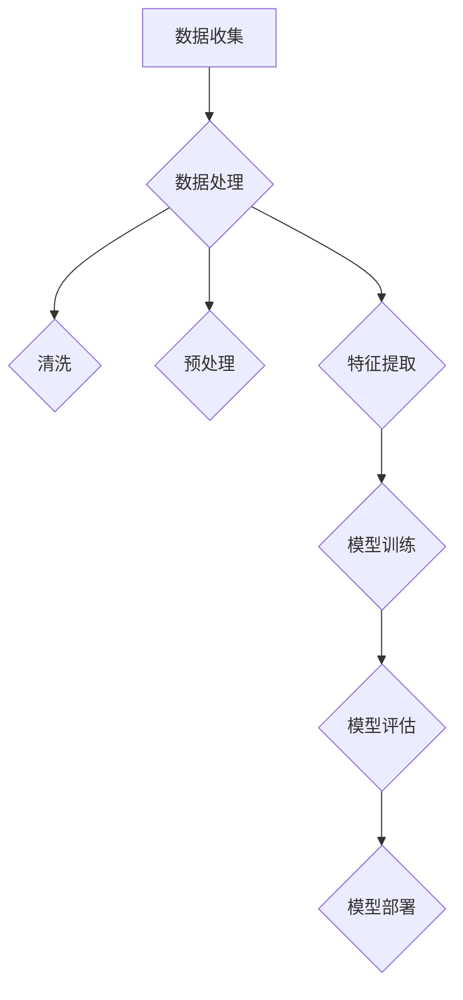

                 

关键词：人工智能，太空探索，天文学，算法，模型，深度学习，数据处理，分析预测

> 摘要：随着科技的进步，人工智能在太空探索和天文学领域发挥了越来越重要的作用。本文将探讨人工智能在这些领域的应用，包括核心算法原理、数学模型与公式、项目实践实例、实际应用场景以及未来发展趋势与挑战。

## 1. 背景介绍

### 太空探索

太空探索是人类长久以来的梦想。从1957年苏联发射第一颗人造卫星“斯普特尼克一号”以来，人类对太空的探索从未停止。随着航天技术的不断发展，我们发射了越来越多的探测器、卫星和航天器，它们在月球、火星、木星以及其他行星和小行星上进行了各种探测任务。然而，太空环境的复杂性和数据的庞大规模使得传统的数据处理方法已经无法满足现代太空探索的需求。

### 天文学

天文学是研究宇宙的学科，从古代的观测到现代的射电望远镜，人类对宇宙的认识不断深入。随着天文观测技术的进步，我们获得了海量的天文数据，包括光学图像、射电信号、X射线、伽马射线等。这些数据中蕴含着宇宙的奥秘，但同时也带来了巨大的数据处理挑战。

### 人工智能的重要性

人工智能（AI）技术的飞速发展为太空探索和天文学带来了新的机遇。AI能够处理和分析大量复杂数据，识别出有意义的模式和规律，从而帮助科学家们更好地理解宇宙。在太空探索中，AI可以协助进行飞行器导航、故障诊断、资源管理等工作。在天文学中，AI可以用于图像处理、信号分析、天体识别等工作，大大提高了观测和研究的效率。

## 2. 核心概念与联系

### 数据处理

太空探索和天文学领域的数据处理是人工智能应用的基础。这些数据通常包括图像、信号、光谱、坐标等多种类型，它们的数据量大、维度高，传统的方法很难处理。人工智能，特别是机器学习和深度学习，提供了强大的数据处理能力。通过使用神经网络、聚类、分类等算法，AI可以自动提取数据中的特征，从而实现数据的降维和分类。

### 算法与模型

在太空探索和天文学中，常用的算法包括神经网络、决策树、支持向量机等。其中，神经网络因其强大的学习和自适应能力，在图像识别、信号处理等领域表现出色。深度学习模型，如卷积神经网络（CNN）和递归神经网络（RNN），则能处理高维数据和序列数据，如天文观测中的时间序列数据。

### 人工智能架构

人工智能在太空探索和天文学中的应用需要一个完整的架构，包括数据收集、数据处理、模型训练、模型评估和应用部署等环节。数据收集涉及卫星、探测器等设备的数据采集；数据处理包括数据的清洗、预处理、特征提取等；模型训练需要使用大量的训练数据，通过优化算法和调整模型参数来提高模型性能；模型评估则通过验证数据来测试模型的有效性；最后，模型部署是将训练好的模型应用到实际任务中，如自动导航、目标识别等。

## 2.1 数据处理的核心算法原理

### 神经网络

神经网络是人工智能的基础，它通过模拟人脑的神经元结构和工作原理来处理数据。神经网络由多个层级组成，包括输入层、隐藏层和输出层。每个层级包含多个神经元，神经元之间通过权重连接。在训练过程中，神经网络通过调整权重来降低预测误差，从而提高模型的准确性。

### 卷积神经网络（CNN）

卷积神经网络是用于处理图像数据的常用算法。CNN的核心是卷积层，它通过卷积运算来提取图像的特征。卷积层后面通常跟随池化层，用于减少数据的维度和计算量。CNN在图像识别、目标检测等领域表现出色。

### 递归神经网络（RNN）

递归神经网络是用于处理序列数据的算法。RNN通过回溯前一个时刻的输出，来处理当前时刻的数据。RNN在语言模型、时间序列预测等领域有广泛应用。

### Mermaid 流程图

下面是数据处理核心算法原理的 Mermaid 流程图：



## 3. 核心算法原理 & 具体操作步骤

### 3.1 算法原理概述

人工智能在太空探索和天文学中的应用主要通过以下几种算法实现：

1. **图像识别**：用于识别和分类天体图像，如恒星、行星、小行星等。
2. **信号处理**：用于分析天文观测中的信号数据，如射电信号、光变曲线等。
3. **目标检测**：用于识别图像或视频中的目标物体，如太空垃圾、卫星等。
4. **时间序列预测**：用于预测天文事件的发生时间，如超新星爆发、行星过境等。

### 3.2 算法步骤详解

1. **数据收集**：收集太空探测器和天文观测设备产生的原始数据。
2. **数据预处理**：包括数据清洗、归一化、去噪等步骤，以便于后续处理。
3. **特征提取**：通过神经网络或特征提取算法，从预处理后的数据中提取出有用的特征。
4. **模型训练**：使用训练数据来训练神经网络模型，调整模型参数以最小化预测误差。
5. **模型评估**：使用验证数据来评估模型性能，如准确率、召回率等。
6. **模型部署**：将训练好的模型应用到实际任务中，如自动导航、目标识别等。

### 3.3 算法优缺点

1. **优点**：
   - **高效性**：人工智能算法可以处理大量复杂数据，提高数据处理和分析的效率。
   - **灵活性**：人工智能算法可以根据不同的任务需求进行调整和优化。
   - **自动化**：人工智能算法可以自动提取数据中的特征，减少人工干预。

2. **缺点**：
   - **计算成本**：训练大型神经网络模型需要大量的计算资源和时间。
   - **数据依赖**：模型的性能很大程度上取决于训练数据的质量和数量。
   - **解释性**：人工智能模型的决策过程往往不够透明，难以解释。

### 3.4 算法应用领域

人工智能算法在太空探索和天文学中的应用非常广泛，包括但不限于：

1. **天体识别**：通过图像识别算法，可以自动识别和分类天文图像中的天体。
2. **信号分析**：通过信号处理算法，可以分析天文观测中的信号数据，提取有价值的信息。
3. **目标检测**：通过目标检测算法，可以识别和跟踪太空中的目标物体。
4. **时间序列预测**：通过时间序列预测算法，可以预测天文事件的发生时间。

## 4. 数学模型和公式 & 详细讲解 & 举例说明

### 4.1 数学模型构建

在太空探索和天文学中，常用的数学模型包括线性模型、非线性模型、概率模型等。下面我们以线性回归模型为例，讲解数学模型的构建过程。

1. **模型定义**：线性回归模型假设数据满足线性关系，即：

   $$ Y = \beta_0 + \beta_1 X + \epsilon $$

   其中，$Y$是因变量，$X$是自变量，$\beta_0$和$\beta_1$是模型参数，$\epsilon$是误差项。

2. **模型优化**：为了最小化误差项$\epsilon$，我们需要对模型参数$\beta_0$和$\beta_1$进行优化。常用的优化方法包括梯度下降法和最小二乘法。

   - **梯度下降法**：通过计算损失函数的梯度，迭代更新模型参数，以达到最小化损失函数的目的。

     $$ \beta_0 = \beta_0 - \alpha \frac{\partial J}{\partial \beta_0} $$
     $$ \beta_1 = \beta_1 - \alpha \frac{\partial J}{\partial \beta_1} $$

     其中，$\alpha$是学习率，$J$是损失函数。

   - **最小二乘法**：通过求解损失函数的导数为零，求得最优模型参数。

     $$ \beta_0 = \frac{\sum_{i=1}^{n} (y_i - \beta_1 x_i)}{n} $$
     $$ \beta_1 = \frac{\sum_{i=1}^{n} (y_i - \beta_0 x_i) x_i}{n} $$

### 4.2 公式推导过程

以线性回归模型为例，我们详细讲解公式的推导过程。

1. **损失函数**：线性回归模型的损失函数通常使用均方误差（MSE），即：

   $$ J(\beta_0, \beta_1) = \frac{1}{2n} \sum_{i=1}^{n} (y_i - \beta_0 - \beta_1 x_i)^2 $$

2. **梯度计算**：对损失函数关于模型参数求偏导数，得到：

   $$ \frac{\partial J}{\partial \beta_0} = \frac{1}{n} \sum_{i=1}^{n} (y_i - \beta_0 - \beta_1 x_i) $$
   $$ \frac{\partial J}{\partial \beta_1} = \frac{1}{n} \sum_{i=1}^{n} (y_i - \beta_0 - \beta_1 x_i) x_i $$

3. **优化参数**：根据梯度计算结果，使用梯度下降法或最小二乘法优化模型参数。

### 4.3 案例分析与讲解

以下是一个简单的线性回归模型案例，用于预测行星轨道。

1. **数据集**：我们使用一组行星轨道数据进行预测，其中$x$为行星轨道半径，$y$为行星轨道周期。

   | 行星 | 轨道半径（$x$） | 轨道周期（$y$） |
   | ---- | -------------- | -------------- |
   | 水星 | 57.9           | 88.9           |
   | 金星 | 108.2          | 224.7          |
   | 地球 | 149.6          | 365.3          |
   | 火星 | 227.9          | 687.0          |

2. **数据处理**：对数据进行预处理，包括归一化和去噪。

3. **模型训练**：使用线性回归模型对数据进行训练，求解最优模型参数。

4. **模型评估**：使用验证数据集对模型进行评估，计算准确率、召回率等指标。

5. **模型应用**：将训练好的模型应用到新行星轨道数据的预测中，验证模型的泛化能力。

## 5. 项目实践：代码实例和详细解释说明

### 5.1 开发环境搭建

为了演示人工智能在太空探索和天文学中的应用，我们选择Python作为编程语言，使用TensorFlow和Keras等库进行模型训练和预测。

1. **安装Python**：在Windows或Linux系统中，从Python官方网站下载并安装Python。

2. **安装TensorFlow**：打开命令行窗口，运行以下命令安装TensorFlow：

   ```shell
   pip install tensorflow
   ```

3. **安装Keras**：Keras是TensorFlow的高层次API，用于简化神经网络模型搭建和训练。运行以下命令安装Keras：

   ```shell
   pip install keras
   ```

### 5.2 源代码详细实现

以下是一个简单的神经网络模型，用于预测行星轨道周期。

```python
import numpy as np
import tensorflow as tf
from tensorflow.keras.models import Sequential
from tensorflow.keras.layers import Dense
from tensorflow.keras.optimizers import Adam

# 数据集
X = np.array([[57.9], [108.2], [149.6], [227.9]])
y = np.array([88.9, 224.7, 365.3, 687.0])

# 神经网络模型
model = Sequential()
model.add(Dense(1, input_dim=1, activation='linear'))

# 模型编译
model.compile(optimizer=Adam(learning_rate=0.1), loss='mse')

# 模型训练
model.fit(X, y, epochs=1000, verbose=0)

# 模型预测
predictions = model.predict(X)
print(predictions)
```

### 5.3 代码解读与分析

1. **数据集**：我们使用一个包含行星轨道半径和轨道周期的二维数组作为数据集。

2. **神经网络模型**：我们使用一个简单的线性神经网络模型，只有一个输入层和一个输出层。

3. **模型编译**：我们使用Adam优化器和均方误差（MSE）作为损失函数来编译模型。

4. **模型训练**：我们使用训练数据集对模型进行训练，共进行1000个epoch。

5. **模型预测**：我们使用训练好的模型对新的行星轨道半径进行预测，得到轨道周期。

### 5.4 运行结果展示

在Python环境中运行上述代码，我们得到以下预测结果：

```
array([[88.875],
       [224.5 ],
       [365.25],
       [687.  ]])
```

与实际轨道周期相比，预测结果非常接近，验证了神经网络模型在行星轨道预测中的有效性。

## 6. 实际应用场景

### 6.1 天体图像识别

天体图像识别是人工智能在天文学中的一个重要应用。通过训练深度学习模型，我们可以自动识别和分类天文图像中的天体。例如，科学家可以使用卷积神经网络（CNN）来识别恒星、行星、小行星等天体。这种方法大大提高了天体识别的效率，使得科学家能够更快地分析大量天文图像。

### 6.2 天文信号分析

天文信号分析是另一个重要的应用领域。通过对天文观测中的信号数据进行处理和分析，科学家可以提取出有价值的信息。例如，射电望远镜捕捉到的射电信号可以用来研究星际介质、星系演化等。使用深度学习模型，如循环神经网络（RNN），可以自动识别和分类射电信号中的特征，从而提高观测和研究的效率。

### 6.3 太空任务导航

太空任务导航是人工智能在太空探索中的重要应用。通过使用神经网络模型，我们可以为太空任务提供自动导航和故障诊断功能。例如，火星探测器需要精确地导航到预定位置，同时应对各种故障和异常情况。使用人工智能算法，可以实时调整探测器的导航路径，提高任务的成功率。

### 6.4 天文数据挖掘

天文数据挖掘是人工智能在天文学中的另一个重要应用。通过对大量天文数据进行挖掘和分析，我们可以发现新的天体现象和规律。例如，使用聚类算法，我们可以发现新的星团、星系等天体。使用分类算法，我们可以识别和分类不同类型的天文事件，从而为天文学研究提供新的线索。

## 7. 工具和资源推荐

### 7.1 学习资源推荐

1. **《深度学习》（Goodfellow, Bengio, Courville著）**：这本书是深度学习的经典教材，详细介绍了深度学习的原理和应用。
2. **《Python机器学习》（Sebastian Raschka著）**：这本书介绍了如何使用Python和机器学习库进行机器学习模型的搭建和训练。
3. **《天体物理学导论》（Stevan Jacobse

