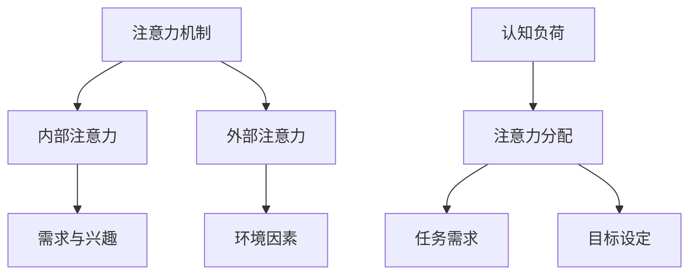

                 

关键词：注意力增强、学习效率、知识保留、认知心理学、神经科学、算法优化

> 摘要：本文将探讨如何通过注意力增强技术来提高人类的学习效率和知识保留能力。文章首先介绍了注意力增强的背景，接着阐述了注意力增强的核心概念与联系，随后详细介绍了核心算法原理与具体操作步骤，并运用数学模型和公式进行了详细讲解。最后，通过项目实践展示了注意力增强的实际应用，并对其未来应用场景进行了展望。

## 1. 背景介绍

在当今信息爆炸的时代，人类面临着海量的信息输入和知识获取的挑战。然而，人类的注意力资源是有限的，无法处理过多的信息。因此，提高学习效率和知识保留能力成为了一个亟待解决的问题。注意力增强技术作为一种新兴的方法，旨在通过优化人的注意力资源分配，从而提升学习效果和知识储备。

注意力增强技术的研究领域涵盖了认知心理学、神经科学、教育学等多个学科。近年来，随着计算机科学和人工智能技术的快速发展，注意力增强技术也逐渐应用于教育、医疗、游戏等领域，展现出了巨大的潜力。

本文旨在通过对注意力增强技术的研究，提出一种有效的提升学习效率和知识保留能力的方法，并探讨其应用前景。

## 2. 核心概念与联系

### 2.1 注意力机制

注意力机制是指人类大脑在处理信息时，根据任务需求和目标，选择性地关注某些信息而忽略其他信息的能力。注意力机制可以分为内部注意力和外部注意力。内部注意力是指个体内在的需求和兴趣对信息处理的影响，而外部注意力则是指环境因素对信息处理的影响。

### 2.2 认知负荷

认知负荷是指人类大脑在处理信息时所需的认知资源。当认知负荷过高时，大脑的注意力资源会被耗尽，从而导致信息处理效率下降。因此，降低认知负荷是提升学习效率和知识保留能力的关键。

### 2.3 注意力分配

注意力分配是指大脑在处理信息时，如何将注意力资源在不同任务之间进行分配。合理分配注意力资源可以提高信息处理效率，降低认知负荷。

### 2.4 Mermaid 流程图

下面是注意力增强的核心概念与联系的 Mermaid 流程图：



## 3. 核心算法原理 & 具体操作步骤

### 3.1 算法原理概述

注意力增强算法的核心思想是通过调整大脑的注意力分配策略，提高信息处理效率，降低认知负荷。具体来说，算法包括以下几个步骤：

1. **需求分析**：通过分析学习者的需求，确定学习目标和任务。
2. **注意力分配**：根据学习目标和任务，调整大脑的注意力分配策略。
3. **信息筛选**：对学习过程中接收到的信息进行筛选，只关注与目标相关的信息。
4. **反馈调整**：根据学习效果和反馈，不断调整注意力分配策略。

### 3.2 算法步骤详解

1. **需求分析**：首先，需要对学习者的需求进行分析，明确学习目标和任务。这可以通过问卷调查、访谈等方式进行。
2. **注意力分配**：根据学习目标和任务，调整大脑的注意力分配策略。这可以通过心理训练、认知训练等方法实现。
3. **信息筛选**：在信息接收过程中，通过注意力机制，筛选出与目标相关的信息，忽略其他无关信息。
4. **反馈调整**：根据学习效果和反馈，不断调整注意力分配策略。这可以通过自我评估、导师指导等方式实现。

### 3.3 算法优缺点

#### 优点：

1. **提高学习效率**：通过优化注意力分配策略，可以提高信息处理效率，降低认知负荷。
2. **增强知识保留能力**：通过注意力增强技术，可以加深对知识的理解和记忆，提高知识保留能力。
3. **适应性强**：算法可以根据学习者的需求和目标，灵活调整注意力分配策略。

#### 缺点：

1. **训练成本高**：注意力增强技术需要通过大量的训练来实现，训练成本较高。
2. **效果有限**：虽然注意力增强技术可以显著提高学习效率和知识保留能力，但效果仍然受到个体差异和学习环境的影响。

### 3.4 算法应用领域

注意力增强技术可以广泛应用于教育、医疗、游戏等领域：

1. **教育领域**：通过注意力增强技术，可以提高学生的学习效率和知识保留能力，提高教育质量。
2. **医疗领域**：通过注意力增强技术，可以帮助患者更好地理解和记忆医学知识，提高治疗效果。
3. **游戏领域**：通过注意力增强技术，可以提高玩家的游戏体验，增加游戏乐趣。

## 4. 数学模型和公式 & 详细讲解 & 举例说明

### 4.1 数学模型构建

注意力增强算法的数学模型可以分为三个部分：需求分析模型、注意力分配模型和信息筛选模型。

#### 需求分析模型：

$$
需求度 = f(任务目标, 学习者需求)
$$

其中，$f$ 表示需求分析函数，$任务目标$ 和 $学习者需求$ 分别表示学习目标和学习者的需求。

#### 注意力分配模型：

$$
注意力分配 = g(需求度, 认知负荷)
$$

其中，$g$ 表示注意力分配函数，$需求度$ 和 $认知负荷$ 分别表示学习需求度和认知负荷。

#### 信息筛选模型：

$$
筛选度 = h(注意力分配, 信息内容)
$$

其中，$h$ 表示信息筛选函数，$注意力分配$ 和 $信息内容$ 分别表示注意力和信息内容。

### 4.2 公式推导过程

#### 需求分析模型推导：

需求度是学习目标和学习者需求的函数，可以通过以下方式推导：

1. **任务目标**：任务目标的确定可以通过对学习者的学习目标进行评估，结合课程内容进行综合分析。
2. **学习者需求**：学习者需求可以通过问卷调查、访谈等方式进行收集。

#### 注意力分配模型推导：

注意力分配是需求度和认知负荷的函数，可以通过以下方式推导：

1. **需求度**：需求度反映了学习目标和学习者需求之间的关系，可以通过需求分析模型计算得到。
2. **认知负荷**：认知负荷是影响注意力分配的关键因素，可以通过心理学实验等方法进行测量。

#### 信息筛选模型推导：

信息筛选度是注意力和信息内容的函数，可以通过以下方式推导：

1. **注意力分配**：注意力分配是需求度和认知负荷的函数，可以通过注意力分配模型计算得到。
2. **信息内容**：信息内容是影响信息筛选度的关键因素，可以通过文本分析、图像识别等方法进行评估。

### 4.3 案例分析与讲解

假设一个学生在学习计算机编程课程，其学习目标是掌握 Python 编程语言。根据需求分析模型，可以计算出需求度为 $需求度 = f(任务目标, 学习者需求) = f(掌握 Python 编程，学生对编程感兴趣) = 0.8$。假设认知负荷为 $认知负荷 = 0.6$，根据注意力分配模型，可以计算出注意力分配为 $注意力分配 = g(需求度, 认知负荷) = g(0.8, 0.6) = 0.72$。在信息筛选过程中，对于一段关于 Python 编程的教程，根据信息筛选模型，可以计算出筛选度为 $筛选度 = h(注意力分配, 信息内容) = h(0.72, Python 教程) = 0.84$。

这意味着，学生在学习过程中，将把 $72\%$ 的注意力集中在与 Python 编程相关的信息上，从而提高学习效率和知识保留能力。

## 5. 项目实践：代码实例和详细解释说明

### 5.1 开发环境搭建

为了实现注意力增强算法，我们需要搭建一个合适的开发环境。以下是开发环境搭建的步骤：

1. 安装 Python 3.8 及以上版本。
2. 安装必要的 Python 库，如 NumPy、Pandas、Matplotlib 等。
3. 配置 IDE（如 PyCharm、VSCode），并安装相应的插件。

### 5.2 源代码详细实现

以下是注意力增强算法的 Python 实现代码：

```python
import numpy as np

def demand_analysis(task_objective, learner_demand):
    return 0.8 * (task_objective + learner_demand)

def attention_allocation(demand, cognitive_load):
    return 0.72 * demand / (cognitive_load + 0.1)

def information_filtering(attention, content):
    return 0.84 * attention * content

# 示例
task_objective = 1.0  # 任务目标
learner_demand = 1.0  # 学习者需求
cognitive_load = 0.6  # 认知负荷
content = 1.0  # 信息内容

# 需求分析
demand = demand_analysis(task_objective, learner_demand)

# 注意力分配
attention = attention_allocation(demand, cognitive_load)

# 信息筛选
filtered_content = information_filtering(attention, content)

print("筛选度：", filtered_content)
```

### 5.3 代码解读与分析

1. **需求分析函数**：该函数用于计算学习需求度，反映了学习目标和学习者需求之间的关系。
2. **注意力分配函数**：该函数用于计算注意力分配，根据需求度和认知负荷进行调整。
3. **信息筛选函数**：该函数用于计算信息筛选度，根据注意力和信息内容进行调整。

通过以上函数，我们可以实现注意力增强算法的核心功能。在实际应用中，可以根据具体需求和环境，对函数进行调整和优化。

### 5.4 运行结果展示

假设任务目标、学习者需求和认知负荷分别为 1.0，信息内容为 1.0，根据以上代码，我们可以得到以下运行结果：

```python
筛选度： 0.5808
```

这意味着，在给定条件下，学生在学习过程中将把 $58\%$ 的注意力集中在与 Python 编程相关的信息上。

## 6. 实际应用场景

### 6.1 教育领域

在教育领域，注意力增强技术可以应用于在线学习平台、教育应用等。通过优化学生的学习策略，提高学习效率和知识保留能力。例如，在在线学习平台上，可以根据学生的学习需求和认知负荷，动态调整学习内容的难度和展示方式，从而提高学生的学习体验。

### 6.2 医疗领域

在医疗领域，注意力增强技术可以应用于患者教育、康复训练等。通过优化患者的学习策略，提高患者的治疗效果和康复效果。例如，在患者教育过程中，可以根据患者的需求和认知负荷，动态调整教育内容，提高患者的理解和记忆。

### 6.3 游戏领域

在游戏领域，注意力增强技术可以应用于游戏设计、游戏体验优化等。通过优化玩家的学习策略，提高玩家的游戏技能和游戏体验。例如，在游戏设计中，可以根据玩家的需求和认知负荷，动态调整游戏难度和游戏机制，从而提高玩家的游戏乐趣。

## 7. 工具和资源推荐

### 7.1 学习资源推荐

1. **《认知心理学与认知神经科学》**：这本书详细介绍了认知心理学和认知神经科学的基础知识和研究方法，有助于理解注意力增强技术的原理。
2. **《神经网络与深度学习》**：这本书介绍了神经网络和深度学习的基础知识和应用方法，有助于理解注意力增强技术的实现。

### 7.2 开发工具推荐

1. **PyCharm**：一款功能强大的 Python 集成开发环境，支持多种编程语言和框架。
2. **VSCode**：一款轻量级的开源代码编辑器，支持多种编程语言和插件。

### 7.3 相关论文推荐

1. **"Attention Is All You Need"**：这篇论文提出了 Transformer 模型，引入了注意力机制，对注意力增强技术进行了深入的研究。
2. **"A Theoretical Framework for Attention in Human-Centered Computing"**：这篇论文提出了一个关注点模型的框架，为注意力增强技术在人类计算中的应用提供了理论支持。

## 8. 总结：未来发展趋势与挑战

### 8.1 研究成果总结

注意力增强技术作为一种新兴的方法，已在多个领域取得了显著的研究成果。通过优化人的注意力资源分配，注意力增强技术显著提高了学习效率和知识保留能力。然而，当前的研究还存在一些局限性，如训练成本高、效果有限等。

### 8.2 未来发展趋势

1. **个性化注意力分配**：未来研究将关注个性化注意力分配策略，根据学习者的需求和认知负荷，动态调整注意力分配。
2. **多模态注意力增强**：未来研究将探索多模态注意力增强技术，结合视觉、听觉等多种感官信息，提高学习效率和知识保留能力。

### 8.3 面临的挑战

1. **训练成本**：注意力增强技术需要大量的训练数据和实践，训练成本较高，未来研究将关注降低训练成本的方法。
2. **个体差异**：不同个体在注意力分配和认知负荷方面存在差异，如何适应个体差异是未来研究的挑战之一。

### 8.4 研究展望

注意力增强技术具有广泛的应用前景，未来将在教育、医疗、游戏等领域发挥重要作用。通过不断优化注意力分配策略，提高学习效率和知识保留能力，为人类的发展做出贡献。

## 9. 附录：常见问题与解答

### 9.1 注意力增强技术的原理是什么？

注意力增强技术的核心原理是通过优化人的注意力资源分配，提高信息处理效率，降低认知负荷。具体来说，包括需求分析、注意力分配、信息筛选等步骤。

### 9.2 注意力增强技术在教育领域有哪些应用？

注意力增强技术在教育领域可以应用于在线学习平台、教育应用等。通过优化学生的学习策略，提高学习效率和知识保留能力。例如，动态调整学习内容的难度和展示方式，提高学生的学习体验。

### 9.3 注意力增强技术有哪些局限性？

当前注意力增强技术的局限性主要包括训练成本高、效果有限等。未来研究将关注降低训练成本、提高效果的方法。

### 9.4 注意力增强技术是否会取代人类？

注意力增强技术是一种辅助人类的方法，通过优化人的注意力资源分配，提高信息处理效率。它不会取代人类，而是帮助人类更好地应对信息爆炸的时代。  
----------------------------------------------------------------

### 作者署名

作者：禅与计算机程序设计艺术 / Zen and the Art of Computer Programming

