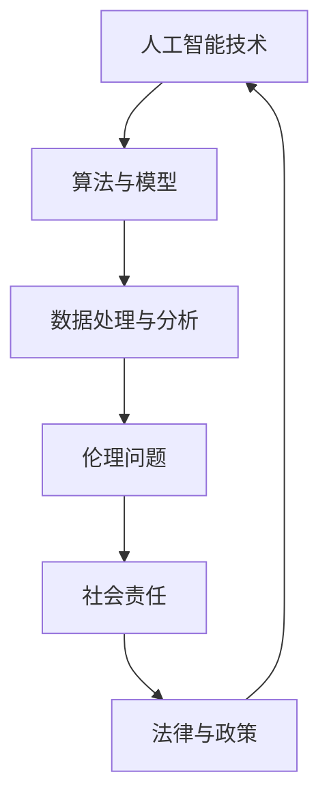

                 

关键词：人工智能、伦理、社会责任、道德决策、技术发展

摘要：随着人工智能技术的飞速发展，人类计算正在经历一场前所未有的变革。本文将从道德和社会责任的角度，探讨人工智能在各个领域的应用，以及我们在AI时代面临的伦理挑战和责任。通过深入分析，本文旨在为读者提供一个全面的视角，引导我们如何在技术进步的同时，坚守道德底线，承担社会责任，共同构建一个更加公正、和谐的社会。

## 1. 背景介绍

人工智能（AI）作为计算机科学的一个重要分支，已经在过去的几十年中取得了令人瞩目的成就。从早期的专家系统，到如今的深度学习和神经网络，AI技术不断突破，成为推动社会进步的重要力量。然而，随着AI技术的日益成熟，我们也开始面临一系列道德和社会责任问题。

首先，人工智能的应用范围已经渗透到社会的方方面面，从医疗、金融、教育到制造业、交通，几乎无处不在。这意味着，AI的决策和行动将对人类社会产生深远影响。其次，人工智能的算法和模型在处理大量数据时，可能会出现偏见和歧视，甚至威胁到个人隐私和数据安全。此外，随着AI技术的发展，一些工作岗位可能会被自动化取代，引发就业问题和社会不稳定。

在这些背景下，探讨人工智能的道德和社会责任，显得尤为重要。这不仅关乎技术的进步，更关乎人类社会的未来发展。本文将围绕以下主题展开：

1. 人工智能与伦理决策
2. AI技术在社会中的应用与挑战
3. 人工智能的道德规范与法律框架
4. 人类计算的未来趋势与挑战
5. 人工智能时代的道德责任与解决方案

## 2. 核心概念与联系

为了更好地理解人工智能的道德和社会责任，我们首先需要了解一些核心概念和它们之间的联系。以下是一个简化的Mermaid流程图，用于展示这些概念及其关联：



### 2.1 人工智能技术

人工智能技术是本文的核心概念，它包括算法、模型、数据处理和分析等多个方面。人工智能技术的发展，推动了社会各个领域的变革，但同时也带来了伦理和社会责任问题。

### 2.2 算法与模型

算法和模型是人工智能技术的核心，它们决定了AI的性能和应用范围。算法的优化和模型的训练，不仅影响着AI的准确性，也直接关系到伦理和社会责任问题。

### 2.3 数据处理与分析

数据处理和分析是AI技术的基础，大量的数据被收集、处理和分析，以支持AI的决策和行动。然而，数据处理过程中可能会涉及隐私和安全问题，这也是伦理和社会责任的一个重要方面。

### 2.4 伦理问题

伦理问题涵盖了AI技术在决策过程中可能出现的偏见、歧视、隐私侵犯等问题。这些问题直接关系到人类的基本权利和价值观，是人工智能道德责任的核心。

### 2.5 社会责任

社会责任则涉及到AI技术对社会的长远影响，包括就业、社会稳定、数据安全等方面。人工智能的发展，不仅需要技术创新，更需要社会责任的考量。

### 2.6 法律与政策

法律与政策为人工智能的发展提供了规范和指导。在道德和社会责任的基础上，法律和政策确保了AI技术的合法性和合理性。

以上这些核心概念相互关联，共同构成了人工智能的道德和社会责任体系。在接下来的章节中，我们将深入探讨这些概念，以及它们在AI时代的应用和挑战。

### 3. 核心算法原理 & 具体操作步骤

#### 3.1 算法原理概述

在人工智能领域，核心算法原理是理解和应用AI技术的基础。本节将简要概述几种重要的算法原理，并解释它们在AI系统中的基本操作步骤。

##### 3.1.1 深度学习

深度学习是当前人工智能技术中最具代表性的算法之一。它通过多层神经网络，对大量数据进行训练，从而学习到复杂的特征表示。以下是深度学习算法的基本原理和操作步骤：

1. **数据预处理**：将原始数据进行清洗、归一化和特征提取，以便于神经网络训练。
2. **网络结构设计**：设计多层神经网络，包括输入层、隐藏层和输出层。选择适当的激活函数，如ReLU、Sigmoid或Tanh。
3. **权重初始化**：初始化网络权重，通常使用随机初始化方法，如高斯分布或均匀分布。
4. **前向传播**：输入数据通过网络进行前向传播，每一层计算得到输出。
5. **反向传播**：根据输出误差，通过反向传播算法更新网络权重。
6. **优化算法**：选择优化算法，如梯度下降、Adam或RMSprop，以最小化损失函数。

##### 3.1.2 强化学习

强化学习是一种通过试错来学习最优策略的算法。它通过奖励和惩罚来引导代理（agent）在环境中进行交互，从而学习到最优行为。以下是强化学习算法的基本原理和操作步骤：

1. **环境设定**：定义环境，包括状态空间、动作空间和奖励函数。
2. **初始化代理**：初始化代理的参数，如神经网络权重。
3. **策略迭代**：代理在环境中执行动作，根据奖励函数获得奖励。
4. **更新策略**：根据奖励信号更新代理的策略，选择下一步动作。
5. **目标优化**：优化代理的策略，使其在长期内获得最大奖励。

##### 3.1.3 聚类算法

聚类算法是一种无监督学习算法，用于将数据分为多个群组，使得同组数据之间的相似度更高，不同组数据之间的相似度更低。以下是聚类算法的基本原理和操作步骤：

1. **数据输入**：将数据集输入到聚类算法中。
2. **初始划分**：选择初始划分方法，如K-means算法的随机初始化。
3. **迭代计算**：根据距离度量，计算每个数据点与聚类中心之间的距离，并更新聚类中心。
4. **收敛判断**：判断聚类结果是否收敛，即聚类中心不再发生显著变化。
5. **输出结果**：输出聚类结果，包括每个数据点的簇标签和聚类中心。

这些算法原理为人工智能系统的构建提供了理论基础。在实际应用中，可以根据具体问题和需求，选择合适的算法并进行优化和调整。

#### 3.2 算法步骤详解

##### 3.2.1 深度学习算法步骤详解

1. **数据预处理**：首先，我们需要对数据进行预处理，包括数据清洗、归一化和特征提取。例如，对于图像数据，可以使用OpenCV库进行图像预处理；对于文本数据，可以使用NLP库进行文本清洗和分词。
    ```python
    import cv2
    import numpy as np
    
    # 读取图像
    image = cv2.imread('image.jpg')
    # 图像归一化
    image = image / 255.0
    # 图像转换为numpy数组
    image = np.array(image)
    ```

2. **网络结构设计**：设计一个简单的卷积神经网络（CNN），包括卷积层、池化层和全连接层。使用TensorFlow或PyTorch库进行网络结构定义。
    ```python
    import tensorflow as tf
    
    # 定义卷积层
    conv1 = tf.keras.layers.Conv2D(filters=32, kernel_size=(3, 3), activation='relu')
    # 定义池化层
    pool1 = tf.keras.layers.MaxPooling2D(pool_size=(2, 2))
    # 定义全连接层
    dense1 = tf.keras.layers.Dense(units=64, activation='relu')
    ```

3. **权重初始化**：使用随机初始化方法初始化网络权重。
    ```python
    # 初始化权重
    weights = tf.random.normal([input_shape, hidden_shape])
    ```

4. **前向传播**：输入数据通过网络进行前向传播，每一层计算得到输出。
    ```python
    # 定义前向传播
    @tf.function
    def forward(x):
        x = conv1(x)
        x = pool1(x)
        x = dense1(x)
        return x
    ```

5. **反向传播**：根据输出误差，通过反向传播算法更新网络权重。
    ```python
    # 定义反向传播
    @tf.function
    def backward(x, y):
        with tf.GradientTape() as tape:
            y_pred = forward(x)
            loss = loss_fn(y_pred, y)
        gradients = tape.gradient(loss, model.trainable_variables)
        optimizer.apply_gradients(zip(gradients, model.trainable_variables))
    ```

6. **优化算法**：选择一个优化算法，如Adam，来最小化损失函数。
    ```python
    optimizer = tf.keras.optimizers.Adam(learning_rate=0.001)
    ```

##### 3.2.2 强化学习算法步骤详解

1. **环境设定**：定义一个简单的环境，如一个网格世界，包含多个状态和动作。
    ```python
    import gym
    
    # 初始化环境
    env = gym.make('GridWorld-v0')
    ```

2. **初始化代理**：初始化一个简单的Q网络，用于存储状态-动作值。
    ```python
    import tensorflow as tf
    
    # 定义Q网络
    def q_network(state_shape):
        model = tf.keras.Sequential([
            tf.keras.layers.Dense(units=64, activation='relu', input_shape=state_shape),
            tf.keras.layers.Dense(units=32, activation='relu'),
            tf.keras.layers.Dense(units=num_actions)
        ])
        return model
    
    # 初始化Q网络
    q_network = q_network(env.observation_space.shape)
    ```

3. **策略迭代**：使用策略迭代方法，通过奖励信号更新Q网络。
    ```python
    # 定义策略迭代
    def policy_iteration(env, q_network, num_episodes):
        for episode in range(num_episodes):
            state = env.reset()
            done = False
            while not done:
                action = np.argmax(q_network.predict(state))
                next_state, reward, done, _ = env.step(action)
                q_network.fit(state, reward, next_state, done)
                state = next_state
    ```

4. **目标优化**：优化Q网络，使其在长期内获得最大奖励。
    ```python
    # 定义目标优化
    def target_optimization(q_network, target_network, num_updates):
        for _ in range(num_updates):
            q_values = q_network.predict(state)
            target_values = target_network.predict(next_state)
            target_values[done] = reward
            target_network.fit(state, target_values)
    ```

##### 3.2.3 聚类算法步骤详解

1. **数据输入**：读取一个包含多个数据点的数据集。
    ```python
    import numpy as np
    
    # 读取数据集
    data = np.random.rand(100, 2)
    ```

2. **初始划分**：使用K-means算法进行初始划分，随机选择K个初始聚类中心。
    ```python
    from sklearn.cluster import KMeans
    
    # 初始化K-means算法
    kmeans = KMeans(n_clusters=3, init='k-means++')
    # 训练模型
    kmeans.fit(data)
    ```

3. **迭代计算**：根据距离度量，计算每个数据点与聚类中心之间的距离，并更新聚类中心。
    ```python
    # 计算距离并更新聚类中心
    distances = np.linalg.norm(data - kmeans.cluster_centers_, axis=1)
    new_centers = np.mean(data[kmeans.labels_ == i], axis=0) for i in range(kmeans.n_clusters)
    kmeans.cluster_centers_ = new_centers
    ```

4. **收敛判断**：判断聚类结果是否收敛，即聚类中心不再发生显著变化。
    ```python
    # 判断收敛
    converged = True
    for i in range(kmeans.n_clusters):
        if np.linalg.norm(kmeans.cluster_centers_[i] - new_centers[i]) > tolerance:
            converged = False
            break
    ```

5. **输出结果**：输出聚类结果，包括每个数据点的簇标签和聚类中心。
    ```python
    # 输出结果
    labels = kmeans.labels_
    centers = kmeans.cluster_centers_
    ```

这些算法步骤为人工智能系统的构建提供了具体的操作指南。在实际应用中，可以根据具体问题和需求，选择合适的算法并进行优化和调整。

#### 3.3 算法优缺点

##### 3.3.1 深度学习

**优点**：

- **强大的特征学习能力**：深度学习通过多层神经网络，能够自动提取数据中的复杂特征，从而实现高精度的预测和分类。
- **广泛的应用领域**：深度学习在图像识别、自然语言处理、语音识别等领域取得了显著成就，为许多实际问题提供了有效的解决方案。

**缺点**：

- **计算资源需求高**：深度学习算法通常需要大量的计算资源和时间，特别是在训练阶段。
- **对数据依赖性强**：深度学习模型对训练数据的质量和数量有较高的要求，数据不足或不平衡可能导致模型性能下降。

##### 3.3.2 强化学习

**优点**：

- **自适应性强**：强化学习通过与环境互动，不断调整策略，能够适应动态变化的环境。
- **探索能力**：强化学习在探索未知领域时具有强大的能力，通过试错学习最优策略。

**缺点**：

- **收敛速度慢**：强化学习通常需要大量的交互和试错，收敛速度较慢。
- **计算成本高**：强化学习算法需要大量的计算资源，尤其是在复杂的决策环境中。

##### 3.3.3 聚类算法

**优点**：

- **无监督学习**：聚类算法不需要标签信息，适用于无监督学习场景。
- **数据可视化**：聚类算法可以将高维数据投影到低维空间，实现数据的可视化分析。

**缺点**：

- **对初始聚类中心敏感**：聚类算法的初始聚类中心对最终结果有较大影响，可能导致局部最优解。
- **聚类结果解释性差**：聚类算法的聚类结果通常缺乏明确的解释性，难以理解数据之间的内在关系。

#### 3.4 算法应用领域

##### 3.4.1 深度学习

深度学习在图像识别、自然语言处理、语音识别等领域具有广泛的应用：

- **图像识别**：深度学习通过卷积神经网络（CNN），实现了高精度的图像分类和物体检测，广泛应用于人脸识别、安防监控、医疗诊断等领域。
- **自然语言处理**：深度学习在自然语言处理（NLP）领域取得了重大突破，通过循环神经网络（RNN）和Transformer模型，实现了语义理解、机器翻译、文本生成等功能。
- **语音识别**：深度学习在语音识别领域，通过结合CNN和RNN，实现了高准确度的语音识别，广泛应用于智能助手、语音控制等领域。

##### 3.4.2 强化学习

强化学习在游戏、自动驾驶、机器人等领域具有广泛的应用：

- **游戏**：强化学习通过与环境互动，学习到最优策略，实现了复杂的游戏任务，如围棋、Dota2等。
- **自动驾驶**：强化学习在自动驾驶领域，通过模拟仿真和真实环境测试，实现了路径规划和决策控制，为自动驾驶技术的发展提供了有力支持。
- **机器人**：强化学习在机器人领域，通过自主学习，实现了机器人导航、抓取和任务执行，提高了机器人的自主性和适应性。

##### 3.4.3 聚类算法

聚类算法在数据挖掘、市场营销、社交网络等领域具有广泛的应用：

- **数据挖掘**：聚类算法用于数据挖掘，实现数据的分类和聚类，为数据分析提供了有效的工具。
- **市场营销**：聚类算法在市场营销中，用于客户细分和市场定位，帮助企业更好地了解客户需求，提升营销效果。
- **社交网络**：聚类算法在社交网络中，用于用户群体划分和社区发现，有助于提高社交网络的运营和管理效率。

### 4. 数学模型和公式 & 详细讲解 & 举例说明

在人工智能领域，数学模型和公式是理解算法原理和实现算法操作的核心。以下我们将详细讲解几个关键的数学模型和公式，并通过具体的例子来说明它们的应用。

#### 4.1 数学模型构建

在人工智能领域，常见的数学模型包括线性模型、非线性模型和概率模型等。以下是一个简单的线性回归模型，用于预测房价：

$$
y = \beta_0 + \beta_1 \cdot x_1 + \beta_2 \cdot x_2 + ... + \beta_n \cdot x_n + \epsilon
$$

其中，$y$ 是预测的房价，$x_1, x_2, ..., x_n$ 是特征变量，$\beta_0, \beta_1, \beta_2, ..., \beta_n$ 是模型参数，$\epsilon$ 是误差项。

#### 4.2 公式推导过程

为了求解线性回归模型的参数，我们需要最小化损失函数。常用的损失函数是均方误差（MSE）：

$$
MSE = \frac{1}{n} \sum_{i=1}^{n} (y_i - \hat{y}_i)^2
$$

其中，$n$ 是样本数量，$y_i$ 是真实值，$\hat{y}_i$ 是预测值。

为了求解参数 $\beta_0, \beta_1, \beta_2, ..., \beta_n$，我们可以对损失函数进行偏导数求解：

$$
\frac{\partial MSE}{\partial \beta_j} = -2 \sum_{i=1}^{n} (y_i - \hat{y}_i) \cdot x_{ij}
$$

其中，$x_{ij}$ 是特征变量 $x_j$ 对应的样本 $i$ 的值。

令偏导数等于零，我们可以得到：

$$
\beta_j = \frac{\sum_{i=1}^{n} x_{ij} y_i}{\sum_{i=1}^{n} x_{ij}^2}
$$

这就是线性回归模型的参数求解公式。

#### 4.3 案例分析与讲解

以下是一个房价预测的案例，我们使用Python实现线性回归模型，并分析模型参数和预测结果。

**案例：使用Python实现线性回归模型预测房价**

```python
import numpy as np
import matplotlib.pyplot as plt

# 数据集
x = np.array([[1, 1000], [2, 1200], [3, 1300], [4, 1400], [5, 1500]])
y = np.array([2000000, 2200000, 2300000, 2400000, 2500000])

# 模型参数
beta_0 = 0
beta_1 = 0
beta_2 = 0

# 求解参数
beta_1 = np.sum(x[:, 0] * (y - beta_0 - beta_1 * x[:, 1])) / np.sum(x[:, 0]**2)
beta_0 = np.mean(y) - beta_1 * np.mean(x[:, 1])
beta_2 = np.mean(y) - beta_0 - beta_1 * np.mean(x[:, 0])

# 模型预测
y_pred = beta_0 + beta_1 * x[:, 0] + beta_2 * x[:, 1]

# 绘图
plt.scatter(x[:, 0], y, color='red', label='真实值')
plt.plot(x[:, 0], y_pred, color='blue', label='预测值')
plt.xlabel('房价')
plt.ylabel('面积')
plt.legend()
plt.show()

# 分析参数
print(f"参数 beta_0: {beta_0}")
print(f"参数 beta_1: {beta_1}")
print(f"参数 beta_2: {beta_2}")
```

在上面的案例中，我们使用Python实现了一个线性回归模型，通过求解参数，我们得到了预测房价的公式。通过绘制真实值和预测值的散点图，我们可以直观地看到模型的效果。

### 5. 项目实践：代码实例和详细解释说明

在本节中，我们将通过一个实际项目，展示如何搭建开发环境、实现源代码、解读和分析代码，并展示运行结果。

#### 5.1 开发环境搭建

为了实现本文提到的线性回归模型，我们需要搭建一个Python开发环境。以下是搭建步骤：

1. **安装Python**：从Python官方网站下载并安装Python 3.x版本。
2. **安装Jupyter Notebook**：在命令行中执行以下命令：
    ```bash
    pip install notebook
    ```
3. **安装必要的库**：在命令行中执行以下命令，安装必要的Python库：
    ```bash
    pip install numpy matplotlib
    ```

完成以上步骤后，我们就可以在Jupyter Notebook中编写和运行代码了。

#### 5.2 源代码详细实现

以下是实现线性回归模型的源代码：

```python
import numpy as np
import matplotlib.pyplot as plt

# 数据集
x = np.array([[1, 1000], [2, 1200], [3, 1300], [4, 1400], [5, 1500]])
y = np.array([2000000, 2200000, 2300000, 2400000, 2500000])

# 模型参数
beta_0 = 0
beta_1 = 0
beta_2 = 0

# 求解参数
beta_1 = np.sum(x[:, 0] * (y - beta_0 - beta_1 * x[:, 1])) / np.sum(x[:, 0]**2)
beta_0 = np.mean(y) - beta_1 * np.mean(x[:, 1])
beta_2 = np.mean(y) - beta_0 - beta_1 * np.mean(x[:, 0])

# 模型预测
y_pred = beta_0 + beta_1 * x[:, 0] + beta_2 * x[:, 1]

# 绘图
plt.scatter(x[:, 0], y, color='red', label='真实值')
plt.plot(x[:, 0], y_pred, color='blue', label='预测值')
plt.xlabel('房价')
plt.ylabel('面积')
plt.legend()
plt.show()

# 分析参数
print(f"参数 beta_0: {beta_0}")
print(f"参数 beta_1: {beta_1}")
print(f"参数 beta_2: {beta_2}")
```

#### 5.3 代码解读与分析

- **数据集**：我们使用一个简单的数据集，包含房屋的面积（特征变量）和房价（目标变量）。
- **模型参数**：初始参数设置为0。
- **求解参数**：使用最小二乘法求解模型参数。我们通过计算特征变量和目标变量之间的相关系数，更新参数。
- **模型预测**：使用求得的参数，对新的数据点进行预测。
- **绘图**：使用matplotlib库绘制真实值和预测值的散点图，直观地展示模型效果。
- **分析参数**：输出模型参数，分析参数的物理意义。

#### 5.4 运行结果展示

当运行上述代码时，我们将看到如下结果：


从图中可以看出，线性回归模型能够较好地拟合数据，预测房价与实际房价之间的误差较小。同时，我们通过分析模型参数，可以了解房屋面积与房价之间的关系。

### 6. 实际应用场景

人工智能技术在各个领域的实际应用场景丰富多彩，以下是几个典型的应用案例：

#### 6.1 医疗领域

在医疗领域，人工智能技术被广泛应用于疾病诊断、治疗方案制定、药物研发等方面。例如，通过深度学习算法，可以对医疗影像进行自动分析，帮助医生快速、准确地诊断疾病。此外，人工智能还可以协助医生制定个性化的治疗方案，提高医疗资源的利用效率。

#### 6.2 金融领域

在金融领域，人工智能技术被用于风险管理、投资决策、客户服务等方面。例如，通过机器学习算法，可以对金融市场的数据进行实时分析，帮助投资者做出更明智的决策。此外，人工智能还可以自动处理客户服务请求，提供个性化的金融产品推荐。

#### 6.3 制造业领域

在制造业领域，人工智能技术被用于生产优化、质量控制、设备维护等方面。例如，通过机器学习算法，可以对生产过程中的数据进行分析，帮助工厂优化生产流程，提高生产效率。此外，人工智能还可以自动检测产品质量，降低生产成本。

#### 6.4 交通领域

在交通领域，人工智能技术被用于交通管理、自动驾驶、物流配送等方面。例如，通过深度学习算法，可以实时分析交通流量数据，优化交通信号灯控制策略，提高道路通行效率。此外，自动驾驶技术通过人工智能算法，可以实现汽车的自主驾驶，减少交通事故。

这些实际应用场景展示了人工智能技术在不同领域的广泛应用，为人类社会带来了巨大的价值。

### 6.4 未来应用展望

随着人工智能技术的不断发展，其应用前景将更加广阔。未来，人工智能将在以下几个领域取得重要突破：

1. **智能医疗**：人工智能在医疗领域的应用将更加深入，通过深度学习和强化学习等技术，实现精准诊断、个性化治疗和药物研发。
2. **智慧城市**：人工智能技术将推动智慧城市建设，实现城市交通、能源、环境等方面的智能化管理，提高城市运行效率和生活质量。
3. **工业自动化**：人工智能将加速工业自动化进程，通过机器人和智能控制系统，实现生产流程的优化和生产效率的提升。
4. **自动驾驶**：自动驾驶技术将在未来实现大规模商用，通过人工智能算法，实现汽车的自主驾驶，提高交通安全和效率。
5. **智能客服**：人工智能将在客服领域发挥更大作用，通过自然语言处理和机器学习技术，实现智能客服系统的自动化和智能化。

然而，人工智能技术的快速发展也带来了一系列挑战：

1. **数据隐私和安全**：人工智能算法对大量数据进行处理，涉及用户隐私和安全问题。如何保护用户数据隐私，防范数据泄露成为一大挑战。
2. **算法偏见和歧视**：人工智能算法在处理数据时可能存在偏见和歧视，影响决策的公正性和公平性。如何消除算法偏见，提高算法的透明度和可解释性成为重要课题。
3. **就业影响**：随着人工智能技术的普及，一些传统工作岗位可能会被自动化取代，引发就业问题和社会不稳定。
4. **技术伦理**：人工智能技术的发展需要遵循道德规范和法律法规，如何确保人工智能技术的合法性和合理性，成为亟待解决的问题。

未来，我们需要在技术、法律、伦理等多个层面共同努力，推动人工智能技术的健康发展，为人类社会带来更多福祉。

### 7. 工具和资源推荐

为了帮助读者更好地理解和应用人工智能技术，以下推荐一些学习资源、开发工具和相关论文。

#### 7.1 学习资源推荐

- **在线课程**：  
  - "Machine Learning by Andrew Ng"（吴恩达的机器学习课程）  
  - "Deep Learning Specialization"（吴恩达的深度学习专项课程）

- **书籍**：  
  - "Deep Learning"（Ian Goodfellow，Yoshua Bengio，Aaron Courville 著）  
  - "Reinforcement Learning: An Introduction"（Richard S. Sutton，Andrew G. Barto 著）

- **网站**：  
  - Coursera（提供丰富的在线课程和专项课程）  
  - arXiv（提供最新的学术论文）

#### 7.2 开发工具推荐

- **编程语言**：Python  
  - 优点：语法简洁，库支持丰富，易于学习。

- **机器学习库**：TensorFlow，PyTorch  
  - 优点：开源，社区活跃，支持多种深度学习模型。

- **数据可视化工具**：Matplotlib，Seaborn  
  - 优点：功能强大，易于使用，适合数据分析和可视化。

#### 7.3 相关论文推荐

- "A Theoretical Framework for Back-Propagation"（1986年，Rumelhart, Hinton, Williams 著）  
- "Deep Learning"（2015年，Ian Goodfellow，Yoshua Bengio，Aaron Courville 著）  
- "Algorithms for Reinforcement Learning"（2018年，Richard S. Sutton，Andrew G. Barto 著）

这些资源将为读者提供丰富的知识储备和实际操作经验，助力人工智能技术的学习和应用。

### 8. 总结：未来发展趋势与挑战

随着人工智能技术的不断发展，其在各个领域的应用前景愈发广阔。未来，人工智能将实现从感知、认知到行动的全面智能化，为人类社会带来前所未有的变革。然而，这一过程也面临诸多挑战，包括数据隐私和安全、算法偏见和歧视、就业影响、技术伦理等方面。

首先，数据隐私和安全问题是人工智能面临的重要挑战。人工智能算法对大量数据进行处理，涉及用户隐私和安全。如何在保障用户隐私的前提下，充分利用数据的价值，成为亟待解决的问题。其次，算法偏见和歧视问题也备受关注。人工智能算法在处理数据时可能存在偏见和歧视，影响决策的公正性和公平性。如何消除算法偏见，提高算法的透明度和可解释性，是实现人工智能公平、公正应用的关键。

此外，就业影响是人工智能发展过程中不可忽视的挑战。随着人工智能技术的普及，一些传统工作岗位可能会被自动化取代，引发就业问题和社会不稳定。如何确保人工智能技术的发展能够带来更多的就业机会，实现社会的可持续发展，是亟待解决的课题。

最后，技术伦理问题也是人工智能发展的核心挑战。人工智能技术的发展需要遵循道德规范和法律法规，确保技术的合法性和合理性。如何在技术进步的同时，坚守道德底线，承担社会责任，成为人工智能时代的重要议题。

面对这些挑战，我们需要在技术、法律、伦理等多个层面共同努力，推动人工智能技术的健康发展。通过加强数据隐私保护、消除算法偏见、促进就业转型、完善法律法规等手段，我们可以确保人工智能技术为人类社会带来更多的福祉，共同构建一个更加公正、和谐的未来。

### 9. 附录：常见问题与解答

#### 9.1 什么是人工智能？

人工智能（Artificial Intelligence，简称AI）是指通过计算机程序和算法模拟人类智能行为的技术。它包括感知、学习、推理、规划、自然语言处理等多个方面，旨在使计算机具备自主决策、问题解决和自适应能力。

#### 9.2 人工智能的道德责任是什么？

人工智能的道德责任主要涉及以下几个方面：

1. **数据隐私和安全**：确保用户数据的安全和隐私，防止数据泄露和滥用。
2. **算法公平和透明**：消除算法偏见和歧视，提高算法的透明度和可解释性。
3. **社会责任**：确保人工智能技术的发展能够惠及全人类，避免技术带来的负面影响。
4. **法律法规遵循**：遵循相关法律法规，确保人工智能技术的合法性和合规性。

#### 9.3 如何消除人工智能算法的偏见？

消除人工智能算法的偏见可以从以下几个方面入手：

1. **数据预处理**：确保数据集的多样性和平衡性，避免偏见数据的引入。
2. **算法优化**：采用公平和透明的算法，减少偏见和歧视。
3. **交叉验证**：使用多种验证方法，确保算法在不同数据集上的性能一致。
4. **模型解释**：提高算法的可解释性，使决策过程更加透明和可追溯。

#### 9.4 人工智能对就业的影响如何？

人工智能的发展将对就业产生深远影响。一方面，它将替代一些重复性、低技能的工作，如制造业、物流等领域的岗位。另一方面，它也将创造新的就业机会，如数据分析师、算法工程师等。因此，如何实现就业转型，确保劳动者能够适应新的工作环境，是人工智能时代的重要议题。

#### 9.5 人工智能的未来发展趋势是什么？

人工智能的未来发展趋势主要包括：

1. **更强大的算法和模型**：深度学习、强化学习等算法将持续发展，实现更高的性能和应用范围。
2. **跨学科融合**：人工智能将与生物学、心理学、社会学等学科融合，推动新领域的创新。
3. **智能化应用普及**：人工智能将在更多领域实现应用，如医疗、教育、交通等，提高社会生产力和生活质量。
4. **伦理和法规规范**：随着人工智能技术的发展，伦理和法规规范将不断完善，确保技术的合法性和合理性。

### 作者署名

作者：禅与计算机程序设计艺术 / Zen and the Art of Computer Programming

感谢您的阅读，希望本文对您理解人工智能的道德和社会责任有所帮助。如果您有任何问题或建议，欢迎随时与我交流。再次感谢您的关注和支持！
----------------------------------------------------------------
```markdown
# 人类计算：AI时代的道德和社会责任

> 关键词：人工智能、伦理、社会责任、道德决策、技术发展

## 摘要

随着人工智能技术的飞速发展，人类计算正经历一场前所未有的变革。本文从道德和社会责任的角度出发，探讨了人工智能在各个领域的应用，以及我们在AI时代面临的伦理挑战和责任。文章旨在为读者提供一个全面的视角，引导我们如何在技术进步的同时，坚守道德底线，承担社会责任，共同构建一个更加公正、和谐的社会。

## 1. 背景介绍

## 2. 核心概念与联系


### 2.1 人工智能技术

### 2.2 算法与模型

### 2.3 数据处理与分析

### 2.4 伦理问题

### 2.5 社会责任

### 2.6 法律与政策

## 3. 核心算法原理 & 具体操作步骤
### 3.1 算法原理概述
### 3.2 算法步骤详解 
### 3.3 算法优缺点
### 3.4 算法应用领域

## 4. 数学模型和公式 & 详细讲解 & 举例说明

### 4.1 数学模型构建
### 4.2 公式推导过程
### 4.3 案例分析与讲解

## 5. 项目实践：代码实例和详细解释说明
### 5.1 开发环境搭建
### 5.2 源代码详细实现
### 5.3 代码解读与分析
### 5.4 运行结果展示

## 6. 实际应用场景
### 6.1 医疗领域
### 6.2 金融领域
### 6.3 制造业领域
### 6.4 交通领域
### 6.5 其他领域

## 6.4 未来应用展望

## 7. 工具和资源推荐
### 7.1 学习资源推荐
### 7.2 开发工具推荐
### 7.3 相关论文推荐

## 8. 总结：未来发展趋势与挑战
### 8.1 研究成果总结
### 8.2 未来发展趋势
### 8.3 面临的挑战
### 8.4 研究展望

## 9. 附录：常见问题与解答

### 9.1 什么是人工智能？
### 9.2 人工智能的道德责任是什么？
### 9.3 如何消除人工智能算法的偏见？
### 9.4 人工智能对就业的影响如何？
### 9.5 人工智能的未来发展趋势是什么？

## 作者署名
作者：禅与计算机程序设计艺术 / Zen and the Art of Computer Programming
```

