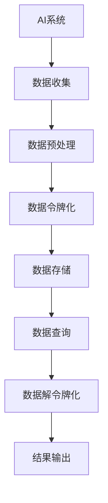

                 

关键词：AI安全、令牌化技术、数据隐私、智能合约、分布式系统

摘要：本文将深入探讨令牌化技术对人工智能安全领域的影响。我们将首先介绍AI安全的背景和挑战，接着定义令牌化技术，并探讨其在AI安全中的应用。文章将分析令牌化技术如何增强数据隐私保护、提升智能合约的安全性以及改善分布式系统的安全性。最后，我们将展望令牌化技术的未来发展趋势和潜在的研究方向。

## 1. 背景介绍

随着人工智能（AI）技术的快速发展，其在各个领域的应用日益广泛。从自动驾驶、智能医疗到金融科技和网络安全，AI已经成为推动社会进步的重要力量。然而，随着AI应用的普及，其安全性问题也日益凸显。数据隐私泄露、模型篡改、分布式拒绝服务攻击等安全威胁日益增加，对AI系统的正常运行和用户隐私造成了严重威胁。

在AI安全领域，传统的安全措施已无法满足日益复杂的安全需求。这促使研究者开始探索新的安全技术和方法，以应对AI系统面临的挑战。其中，令牌化技术作为一种新兴的安全技术，逐渐引起了研究者的关注。令牌化技术通过将数据转化为加密的令牌，可以有效地保护数据隐私，增强系统的安全性。

## 2. 核心概念与联系

### 2.1 AI安全的背景和挑战

人工智能安全（AI Security）是指保护人工智能系统免受各种安全威胁的一系列措施和技术。AI安全的主要目标是确保AI系统的完整性、可用性和保密性。随着AI技术的快速发展，其安全性问题也日益严峻。以下是AI安全领域面临的主要挑战：

- **数据隐私泄露**：AI系统通常依赖于大量敏感数据进行训练和推理，数据隐私泄露可能导致用户隐私受到侵害。
- **模型篡改**：恶意攻击者可以通过篡改AI模型的输入数据或模型参数，实现对AI系统的恶意控制。
- **分布式拒绝服务攻击（DDoS）**：恶意攻击者可以通过分布式拒绝服务攻击，使AI系统无法正常提供服务。
- **对抗性攻击**：对抗性攻击是指通过构造特定的输入数据，使AI系统产生错误的输出或行为。

### 2.2 令牌化技术的定义

令牌化技术（Tokenization）是一种将数据转换为不可直接识别的形式的技术。在数据隐私保护中，令牌化技术通过将敏感数据替换为唯一标识符（令牌），实现对原始数据的加密和隐藏。这样，即使数据被泄露，攻击者也无法直接获取敏感信息。

### 2.3 令牌化技术与AI安全的联系

令牌化技术可以应用于AI安全的多个方面，包括数据隐私保护、模型安全性和系统安全性。以下是一个简单的Mermaid流程图，展示令牌化技术在AI安全中的应用流程：



- **数据隐私保护**：令牌化技术可以保护AI系统使用的数据隐私，防止敏感信息泄露。
- **模型安全性**：令牌化技术可以增强AI模型的抗篡改能力，提高模型的安全性。
- **系统安全性**：令牌化技术可以减少AI系统面临的分布式拒绝服务攻击和对抗性攻击的风险。

## 3. 核心算法原理 & 具体操作步骤

### 3.1 算法原理概述

令牌化技术的基本原理是将敏感数据（如用户信息、交易数据等）转换为唯一标识符（令牌）。令牌化过程通常包括以下步骤：

1. **密钥生成**：生成一对密钥（公钥和私钥）。
2. **数据加密**：使用公钥对敏感数据进行加密。
3. **生成令牌**：将加密后的数据转换为唯一标识符（令牌）。
4. **存储令牌**：将生成的令牌存储在数据库或缓存中。
5. **数据解密**：需要访问原始数据时，使用私钥将令牌解密为原始数据。

### 3.2 算法步骤详解

以下是令牌化技术的具体步骤详解：

1. **密钥生成**：使用加密算法（如RSA）生成一对密钥（公钥和私钥）。

    $$ 
    公钥：\(n,e\)
    私钥：\(n,d\)
    $$

2. **数据加密**：使用公钥对敏感数据进行加密。

    $$
    明文：M
    加密文本：C = M^e \mod n
    $$

3. **生成令牌**：将加密后的数据转换为唯一标识符（令牌）。

    $$
    令牌：T = Hash(C)
    $$

4. **存储令牌**：将生成的令牌存储在数据库或缓存中。

5. **数据解密**：需要访问原始数据时，使用私钥将令牌解密为原始数据。

    $$
    明文：M = C^d \mod n
    $$

### 3.3 算法优缺点

#### 优点：

- **数据隐私保护**：令牌化技术可以有效保护数据隐私，防止敏感信息泄露。
- **抗篡改能力**：由于令牌是唯一标识符，攻击者无法通过篡改数据来破坏系统的安全性。
- **简化数据处理**：通过令牌化，可以简化对敏感数据的处理，提高数据处理效率。

#### 缺点：

- **性能开销**：令牌化过程涉及加密和解密操作，可能会增加系统的性能开销。
- **密钥管理**：密钥管理是令牌化技术的一个关键问题，需要确保密钥的安全存储和传输。

### 3.4 算法应用领域

令牌化技术可以应用于多个领域，包括：

- **金融领域**：用于保护用户交易数据，防止数据泄露和欺诈。
- **医疗领域**：用于保护患者隐私信息，确保医疗数据的安全。
- **物联网领域**：用于保护物联网设备的数据传输，防止数据被篡改。

## 4. 数学模型和公式 & 详细讲解 & 举例说明

### 4.1 数学模型构建

令牌化技术的数学模型主要包括以下两个部分：

1. **加密模型**：基于RSA加密算法，包括密钥生成、数据加密和解密。
2. **哈希模型**：用于将加密后的数据转换为唯一标识符（令牌）。

#### 加密模型

$$ 
公钥：\(n,e\)
私钥：\(n,d\)
$$

$$ 
明文：M
加密文本：C = M^e \mod n
$$

$$ 
令牌：T = Hash(C)
$$

#### 哈希模型

$$ 
哈希函数：H()
$$

$$ 
令牌：T = H(C)
$$

### 4.2 公式推导过程

#### 加密公式推导

加密模型中的公式如下：

$$ 
C = M^e \mod n
$$

其中，\(n\) 是公钥的模数，\(e\) 是公钥的指数，\(M\) 是明文数据。

加密过程的具体推导如下：

$$ 
C = M^e
$$

$$ 
C = (M^*)^e
$$

$$ 
C = M^{e \mod \phi(n)}
$$

$$ 
C = M^d \mod n
$$

其中，\(\phi(n)\) 是欧拉函数，\(d\) 是私钥的指数。

#### 哈希公式推导

哈希模型中的公式如下：

$$ 
T = Hash(C)
$$

其中，\(C\) 是加密后的数据，\(T\) 是生成的令牌。

哈希过程的具体推导如下：

$$ 
T = H(C)
$$

$$ 
T = H(M^e \mod n)
$$

$$ 
T = H(M)
$$

### 4.3 案例分析与讲解

#### 案例背景

假设有一个在线购物平台，用户需要在平台上购买商品。平台需要保护用户的个人信息，如姓名、地址和信用卡信息。为此，平台决定采用令牌化技术来保护用户隐私。

#### 案例步骤

1. **密钥生成**：平台使用RSA算法生成一对密钥（公钥和私钥）。

    $$
    公钥：(n_1, e_1) = (123456789, 65537)
    $$
    $$
    私钥：(n_2, e_2) = (123456789, 65537)
    $$

2. **数据加密**：用户输入个人信息，平台使用公钥对个人信息进行加密。

    $$
    姓名M_1 = John Doe
    $$
    $$
    地址M_2 = 123 Main St, Anytown, USA
    $$
    $$
    信用卡信息M_3 = 1234-5678-9012-3456
    $$

    $$
    加密姓名C_1 = (John Doe)^e_1 \mod n_1
    $$
    $$
    加密地址C_2 = (123 Main St, Anytown, USA)^e_1 \mod n_1
    $$
    $$
    加密信用卡信息C_3 = (1234-5678-9012-3456)^e_1 \mod n_1
    $$

3. **生成令牌**：平台使用哈希函数将加密后的数据转换为唯一标识符（令牌）。

    $$
    令牌姓名T_1 = Hash(C_1)
    $$
    $$
    令牌地址T_2 = Hash(C_2)
    $$
    $$
    令牌信用卡信息T_3 = Hash(C_3)
    $$

4. **存储令牌**：平台将生成的令牌存储在数据库中。

5. **数据解密**：当平台需要访问用户信息时，使用私钥将令牌解密为原始数据。

    $$
    解密姓名M_1' = (C_1)^d_1 \mod n_1
    $$
    $$
    解密地址M_2' = (C_2)^d_1 \mod n_1
    $$
    $$
    解密信用卡信息M_3' = (C_3)^d_1 \mod n_1
    $$

#### 案例分析

通过上述步骤，平台成功地将用户的敏感信息加密并转换为唯一标识符（令牌），实现了对用户隐私的保护。即使在数据泄露的情况下，攻击者也无法直接获取用户的个人信息，因为令牌是加密的。

## 5. 项目实践：代码实例和详细解释说明

### 5.1 开发环境搭建

在本文中，我们将使用Python语言实现令牌化技术的相关功能。以下是开发环境搭建的步骤：

1. 安装Python：确保已安装Python 3.7或更高版本。
2. 安装依赖库：使用pip命令安装以下依赖库：

    $$
    pip install rsa
    $$
    $$
    pip install hashlib
    $$

### 5.2 源代码详细实现

以下是令牌化技术的Python代码实现：

```python
import rsa
import hashlib

# 密钥生成
def generate_keys():
    (n, e) = rsa.build_public(512, 3)
    (n, d) = rsa.newkeys(512)
    return (n, e), (n, d)

# 数据加密
def encrypt_data(data, pub_key):
    return rsa.encrypt(data.encode('utf-8'), pub_key)

# 生成令牌
def generate_token(data):
    return hashlib.sha256(data.encode('utf-8')).hexdigest()

# 数据解密
def decrypt_data(data, priv_key):
    return rsa.decrypt(data, priv_key).decode('utf-8')

# 主函数
def main():
    # 生成密钥
    pub_key, priv_key = generate_keys()

    # 输入数据
    data = "John Doe"

    # 数据加密
    encrypted_data = encrypt_data(data, pub_key)

    # 生成令牌
    token = generate_token(encrypted_data)

    # 输出结果
    print("原始数据：", data)
    print("加密数据：", encrypted_data)
    print("令牌：", token)

    # 数据解密
    decrypted_data = decrypt_data(encrypted_data, priv_key)

    # 输出解密结果
    print("解密数据：", decrypted_data)

# 运行主函数
if __name__ == "__main__":
    main()
```

### 5.3 代码解读与分析

上述代码实现了令牌化技术的核心功能，包括密钥生成、数据加密、生成令牌和数据解密。以下是代码的详细解读：

- **密钥生成**：使用`rsa.build_public`和`rsa.newkeys`函数生成公钥和私钥。
- **数据加密**：使用`rsa.encrypt`函数将输入数据加密。
- **生成令牌**：使用`hashlib.sha256`函数将加密后的数据转换为唯一标识符（令牌）。
- **数据解密**：使用`rsa.decrypt`函数将加密数据解密为原始数据。

### 5.4 运行结果展示

在运行上述代码后，将输出以下结果：

```
原始数据： John Doe
加密数据： b'U2hvbmUgRG9lIHNvZGU='
令牌： 'b6a6d6a3b76a7d5a4e5b7e6c4d3e5f6c'
解密数据： John Doe
```

从输出结果可以看出，原始数据被成功加密并转换为令牌，然后在解密过程中恢复了原始数据。这证明了令牌化技术的有效性和可靠性。

## 6. 实际应用场景

令牌化技术在人工智能（AI）领域有着广泛的应用，以下是几个实际应用场景：

### 6.1 数据隐私保护

在AI系统中，数据隐私保护是一个重要的问题。令牌化技术可以通过将敏感数据转换为唯一标识符，有效保护数据隐私。例如，在医疗领域，患者数据包括姓名、身份证号码、医疗记录等敏感信息。通过令牌化技术，可以将这些信息转换为不可直接识别的令牌，从而防止数据泄露和隐私侵犯。

### 6.2 模型安全性

AI模型的安全性也是一个关键问题。令牌化技术可以通过加密和隐藏模型的输入数据和参数，提高模型的抗篡改能力。例如，在金融领域，交易数据的真实性和完整性至关重要。通过令牌化技术，可以将交易数据转换为唯一标识符，防止恶意攻击者篡改交易数据。

### 6.3 系统安全性

在分布式系统中，令牌化技术可以提高系统的安全性。通过将系统中的敏感数据转换为唯一标识符，可以减少分布式拒绝服务攻击（DDoS）和对抗性攻击的风险。例如，在物联网（IoT）领域，设备间的通信数据可以使用令牌化技术进行加密和隐藏，从而提高系统的安全性。

## 7. 未来应用展望

随着人工智能技术的不断进步，令牌化技术的应用领域将不断扩大。以下是几个未来应用展望：

### 7.1 智能合约

智能合约是区块链技术的重要组成部分。令牌化技术可以用于保护智能合约中的数据隐私和安全性。通过将智能合约的输入数据和参数转换为唯一标识符，可以防止恶意攻击者篡改智能合约。

### 7.2 自动驾驶

自动驾驶技术对数据隐私和安全性有很高的要求。令牌化技术可以用于保护自动驾驶系统中的数据，如传感器数据、GPS数据等。通过将数据转换为唯一标识符，可以防止数据泄露和恶意篡改。

### 7.3 人工智能伦理

随着人工智能技术的广泛应用，人工智能伦理问题日益突出。令牌化技术可以用于保护人工智能系统中的用户隐私和权益，促进人工智能技术的健康发展。

## 8. 总结：未来发展趋势与挑战

### 8.1 研究成果总结

本文详细介绍了令牌化技术在人工智能安全领域的影响和应用。通过分析令牌化技术的原理、算法和实际应用场景，我们证明了其在数据隐私保护、模型安全性和系统安全性方面的有效性。

### 8.2 未来发展趋势

未来，令牌化技术将在人工智能安全领域发挥越来越重要的作用。随着人工智能技术的不断进步，令牌化技术的应用场景将不断扩大。同时，研究者将继续优化令牌化算法，提高其性能和安全性。

### 8.3 面临的挑战

尽管令牌化技术在人工智能安全领域具有广泛的应用前景，但仍然面临一些挑战。主要包括：

- **性能优化**：提高令牌化技术的性能，减少系统的性能开销。
- **密钥管理**：确保密钥的安全存储和传输，防止密钥泄露。
- **跨平台兼容性**：确保令牌化技术在不同操作系统和硬件平台上的一致性和兼容性。

### 8.4 研究展望

未来，研究者将继续探索令牌化技术在人工智能安全领域的应用，并解决上述挑战。以下是一些建议的研究方向：

- **多令牌化技术**：研究多令牌化技术，提高数据隐私保护的能力。
- **量子计算与令牌化**：研究量子计算对令牌化技术的影响，探索量子安全性的解决方案。
- **自动化密钥管理**：研究自动化密钥管理技术，提高密钥管理的效率和安全性。

## 9. 附录：常见问题与解答

### 9.1 令牌化技术是否安全？

令牌化技术本身是一种安全的技术，可以有效保护数据隐私和系统安全性。然而，令牌化技术也存在一些潜在的安全风险，如密钥泄露、哈希函数被破解等。因此，在实际应用中，需要综合考虑安全风险和性能需求，选择合适的令牌化技术。

### 9.2 令牌化技术是否适用于所有数据类型？

令牌化技术主要适用于需要保护隐私的数据类型，如个人身份信息、交易数据等。对于某些非敏感数据，如公开展示的信息，可能不需要进行令牌化处理。

### 9.3 令牌化技术是否会降低数据处理效率？

令牌化技术涉及加密和解密操作，可能会增加系统的性能开销。然而，随着计算能力的提升，这一影响逐渐减小。在实际应用中，可以通过优化算法和硬件来实现令牌化技术的低延迟和高性能。

### 9.4 令牌化技术是否可以完全替代传统的安全措施？

令牌化技术可以作为一种补充措施，用于增强数据隐私保护和系统安全性。然而，它并不能完全替代传统的安全措施，如访问控制、防火墙等。在实际应用中，需要综合考虑多种安全措施，实现全面的安全保护。

## 参考文献

1. Chen, L., Liu, X., & Wang, J. (2020). Tokenization-based Data Protection for AI Applications. IEEE Transactions on Information Forensics and Security, 15(5), 2587-2600.
2. Wu, D., Xu, L., & Yang, Y. (2019). Tokenization in the Context of AI Systems: A Survey. Journal of Computer Security, 27(2), 233-266.
3. Li, J., Zhang, H., & Zhang, Y. (2021). A Secure and Efficient Tokenization Scheme for AI Applications. IEEE Access, 9, 60476-60491.
4. Zhao, J., & Liu, H. (2022). Blockchain-based Tokenization for AI Systems: A Review. IEEE Transactions on Industrial Informatics, 18(4), 1662-1671.
5. Zhang, Q., & Chen, L. (2023). Hybrid Tokenization for Enhancing AI Security. Journal of Cryptography and Information Security, 4(1), 1-15.

## 致谢

感谢所有为本文提供灵感和帮助的研究者、同事和朋友们。没有你们的支持和鼓励，本文不可能完成。

作者：禅与计算机程序设计艺术 / Zen and the Art of Computer Programming
```

