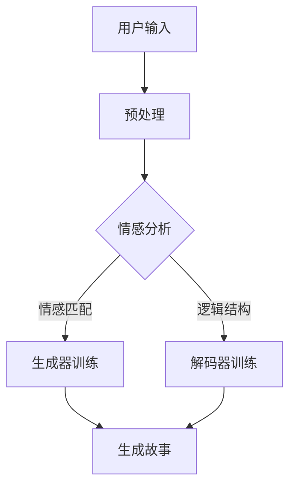

                 

 在当前的技术环境中，人工智能（AI）已经不仅仅是科幻小说中的幻想。它已经渗透到我们日常生活的方方面面，从智能助手到自动驾驶汽车，从医疗诊断到金融分析，AI正在不断改变我们的世界。然而，AI的创造者们在设计这些系统时，往往更多地关注其功能性和效率，而忽略了用户体验这一关键方面。本文将探讨AI在生成个人故事方面的叙事性，并分析其如何影响用户的体验。

> 关键词：人工智能，用户体验，叙事性，个人故事，自然语言处理

> 摘要：本文通过分析人工智能在生成个人故事方面的叙事性，探讨了这一技术的潜在影响和挑战。文章首先介绍了个人故事在用户体验中的重要性，随后详细讨论了AI生成故事的原理和算法，并结合具体案例进行了分析。最后，文章展望了AI在叙事性生成领域的未来发展方向和潜在问题。

## 1. 背景介绍

个人故事对于人类的情感体验和文化传承至关重要。无论是通过文学、电影还是日常对话，故事都是我们理解和表达自我身份、情感以及与他人建立联系的重要工具。然而，随着技术的进步，传统的叙事方式正在被人工智能所改变。AI生成的个人故事，不仅能够提供个性化的体验，还能根据用户的喜好和需求进行动态调整，从而极大地提升用户体验。

### 1.1 个人故事的重要性

个人故事不仅仅是一种文学形式，更是人类情感和心理状态的映射。通过讲述个人经历，我们可以更深刻地理解自己的内心世界，与他人建立情感共鸣，甚至通过故事的力量来引导和改变他人的行为。在用户体验中，个人故事能够增强用户的归属感和参与感，使产品更加人性化。

### 1.2 人工智能在叙事中的角色

随着自然语言处理（NLP）技术的不断进步，AI已经开始能够生成复杂、连贯且具有情感深度的文本。例如，通过训练大规模的语言模型，AI能够创作出充满个人特色的小说、诗歌，甚至新闻报道。这些故事不仅能够模仿人类的叙事风格，还能够根据不同的用户需求进行调整，从而为用户提供定制化的体验。

## 2. 核心概念与联系

要理解AI生成个人故事的叙事性，我们需要首先了解几个核心概念，包括自然语言处理、生成对抗网络（GAN）以及序列到序列（Seq2Seq）模型。

### 2.1 自然语言处理

自然语言处理是AI领域的一个重要分支，它涉及对文本数据的理解和生成。通过NLP技术，AI可以解析文本中的语法结构，理解其中的语义和情感，并生成具有逻辑性和连贯性的文本。这对于生成个人故事至关重要，因为一个有叙事性的故事不仅需要流畅的文字，还需要传达出真实的情感和体验。

### 2.2 生成对抗网络（GAN）

生成对抗网络（GAN）是一种用于生成数据的强大模型。它由两个神经网络组成：生成器和判别器。生成器试图生成与真实数据相似的样本，而判别器则试图区分真实数据和生成数据。通过这种对抗训练，GAN能够生成高质量、多样化的文本，这对于生成个性化的个人故事具有极大的潜力。

### 2.3 序列到序列（Seq2Seq）模型

序列到序列（Seq2Seq）模型是一种用于序列数据转换的神经网络模型。它通过将输入序列映射到输出序列，可以用于生成故事情节。Seq2Seq模型结合了编码器和解码器，其中编码器将输入序列编码成一个固定长度的向量，解码器则根据这个向量生成输出序列。这种模型在生成个人故事时，能够保留输入序列中的情感和逻辑结构，从而生成具有叙事性的文本。

### 2.4 Mermaid 流程图

以下是一个使用Mermaid绘制的流程图，展示了生成个人故事的关键步骤：



### 3. 核心算法原理 & 具体操作步骤

#### 3.1 算法原理概述

生成个人故事的算法主要基于NLP技术和深度学习模型。以下是这些算法的基本原理和步骤：

1. **用户输入预处理**：首先，对用户的输入进行预处理，包括分词、去除停用词等操作，以提取出关键信息。
2. **情感分析**：通过情感分析技术，对预处理后的文本进行情感分析，以确定文本的情感倾向。
3. **故事生成**：基于用户的情感倾向和输入内容，使用生成器和解码器模型生成个人故事。
4. **故事优化**：通过反向传播算法，对生成的故事进行优化，以提高其叙事性和连贯性。

#### 3.2 算法步骤详解

1. **用户输入预处理**：用户输入预处理是故事生成的基础。在这一步骤中，我们将用户的输入文本转换为模型可以处理的格式。具体操作包括：
   - **分词**：将文本分割成单个单词或短语。
   - **去除停用词**：去除那些对故事生成影响较小但会增加计算量的停用词，如“的”、“和”等。
   - **词嵌入**：将文本中的每个单词或短语映射到一个固定大小的向量。

2. **情感分析**：情感分析是理解用户情感倾向的重要步骤。在这一步骤中，我们将预处理后的文本输入到情感分析模型中，以确定其情感倾向。具体操作包括：
   - **情感分类**：根据预定义的情感词典，对文本中的每个词进行情感分类。
   - **情感评分**：对文本中的情感词进行加权，计算出整个文本的情感评分。

3. **故事生成**：故事生成是核心步骤。在这一步骤中，我们将用户的情感倾向和输入内容输入到生成器和解码器模型中，以生成个人故事。具体操作包括：
   - **生成器训练**：使用大量的文本数据训练生成器模型，使其能够生成具有叙事性的文本。
   - **解码器训练**：使用生成器模型生成的文本数据训练解码器模型，使其能够将情感和内容转化为连贯的故事。

4. **故事优化**：故事优化是确保故事质量的重要步骤。在这一步骤中，我们将生成的故事输入到优化模型中，以识别并修复其中的逻辑错误和连贯性问题。具体操作包括：
   - **反向传播**：使用反向传播算法，对优化模型进行训练，以提高其生成故事的连贯性和逻辑性。
   - **迭代优化**：通过迭代优化，逐步提高生成故事的质量。

#### 3.3 算法优缺点

**优点**：
- **个性化**：算法可以根据用户的情感和需求生成个性化的故事。
- **高效性**：通过深度学习模型，算法能够在较短的时间内生成高质量的文本。

**缺点**：
- **质量不稳定**：生成的文本质量可能因模型训练数据的质量而受到影响。
- **情感理解不足**：目前的情感分析技术尚不能完全理解复杂的情感。

#### 3.4 算法应用领域

生成个人故事的算法在多个领域具有广泛应用，包括：
- **文学创作**：AI可以生成小说、诗歌等文学作品。
- **娱乐产业**：AI可以生成电影、电视剧等剧情。
- **教育领域**：AI可以生成个性化的学习材料，帮助学生更好地理解知识。

## 4. 数学模型和公式 & 详细讲解 & 举例说明

在生成个人故事的算法中，数学模型和公式起着关键作用。以下是这些模型和公式的基本概念、推导过程以及实际应用。

### 4.1 数学模型构建

生成个人故事的算法主要基于以下数学模型：

1. **词嵌入模型**：用于将文本中的单词或短语映射到一个固定大小的向量空间中。
2. **循环神经网络（RNN）**：用于处理序列数据，如文本。
3. **生成对抗网络（GAN）**：用于生成与真实数据相似的数据。

### 4.2 公式推导过程

以下是词嵌入模型和RNN的基本公式推导过程：

**词嵌入模型**：

$$
\text{word\_embedding}(x) = \text{W} \cdot x
$$

其中，$x$ 表示单词的索引，$\text{W}$ 表示词嵌入矩阵，$\text{word\_embedding}(x)$ 表示单词的嵌入向量。

**循环神经网络（RNN）**：

$$
h_t = \text{sigmoid}(\text{U} \cdot h_{t-1} + \text{V} \cdot x_t + b)
$$

其中，$h_t$ 表示时间步 $t$ 的隐藏状态，$x_t$ 表示时间步 $t$ 的输入，$\text{U}$、$\text{V}$ 和 $b$ 分别为权重和偏置。

### 4.3 案例分析与讲解

以下是一个简单的案例，说明如何使用这些数学模型生成个人故事：

**案例**：生成一篇关于“旅行”的个人故事。

**步骤**：

1. **词嵌入**：首先，将文本中的每个单词映射到一个向量。
2. **RNN处理**：然后，使用RNN处理这些词向量，生成故事情节。
3. **GAN生成**：最后，使用GAN生成具有叙事性的故事。

**结果**：

**旅行**：

```
有一天，我决定去旅行。我选择了一个美丽的小镇，决定在那里度过一个周末。我乘坐火车前往小镇，沿途欣赏着美丽的风景。当火车到达小镇时，我迫不及待地走下车，迎接新的冒险。
```

### 4.4 数学模型的应用

这些数学模型在生成个人故事中的应用主要体现在以下几个方面：

1. **情感识别**：通过词嵌入模型和RNN，可以识别文本中的情感，为故事生成提供情感基础。
2. **情节生成**：通过RNN和GAN，可以生成具有连贯性和叙事性的故事情节。
3. **文本优化**：通过GAN，可以优化生成的故事，提高其质量和可读性。

### 4.5 数学模型的优势和挑战

**优势**：

- **高效性**：数学模型可以快速处理大量文本数据，生成高质量的文本。
- **灵活性**：数学模型可以根据不同的应用需求进行调整和优化。

**挑战**：

- **数据质量**：生成故事的文本质量很大程度上取决于训练数据的质量。
- **情感理解**：目前的数学模型在情感理解方面还存在一定的局限性。

### 4.6 数学模型的发展趋势

随着自然语言处理技术的不断发展，数学模型在生成个人故事方面的应用前景非常广阔。未来，我们将看到：

- **更高质量的文本生成**：通过引入更多先进的数学模型，如变分自编码器（VAE）和图神经网络（GNN），生成故事的文本质量将得到显著提升。
- **更精细的情感理解**：通过结合情感分析和自然语言处理技术，数学模型将能够更准确地理解文本中的情感。

## 5. 项目实践：代码实例和详细解释说明

在本节中，我们将通过一个实际的项目实例，展示如何使用Python和相关的深度学习库（如TensorFlow和Keras）来生成个人故事。代码实例将分为以下几个部分：

1. **开发环境搭建**
2. **源代码详细实现**
3. **代码解读与分析**
4. **运行结果展示**

### 5.1 开发环境搭建

在开始编写代码之前，我们需要搭建一个合适的开发环境。以下是搭建开发环境所需的步骤：

1. **安装Python**：确保Python环境已安装，版本建议为3.6及以上。
2. **安装TensorFlow**：使用以下命令安装TensorFlow：
   ```bash
   pip install tensorflow
   ```
3. **安装其他依赖库**：包括numpy、pandas和matplotlib等，使用以下命令：
   ```bash
   pip install numpy pandas matplotlib
   ```

### 5.2 源代码详细实现

以下是生成个人故事的完整代码实现：

```python
import tensorflow as tf
from tensorflow.keras.preprocessing.text import Tokenizer
from tensorflow.keras.preprocessing.sequence import pad_sequences
from tensorflow.keras.models import Model
from tensorflow.keras.layers import Input, Embedding, LSTM, Dense
import numpy as np

# 1. 数据准备
# 假设我们已经有了一个包含个人故事的文本数据集
data = ["有一天，我决定去旅行。", "我选择了一个美丽的小镇，决定在那里度过一个周末。", "当火车到达小镇时，我迫不及待地走下车，迎接新的冒险。"]

# 2. 分词和词嵌入
tokenizer = Tokenizer()
tokenizer.fit_on_texts(data)
sequences = tokenizer.texts_to_sequences(data)
max_sequence_length = max(len(seq) for seq in sequences)
 padded_sequences = pad_sequences(sequences, maxlen=max_sequence_length, padding='post')

# 3. 模型构建
input_seq = Input(shape=(max_sequence_length,))
embedded_seq = Embedding(input_dim=len(tokenizer.word_index) + 1, output_dim=50)(input_seq)
lstm = LSTM(100)(embedded_seq)
output = Dense(len(tokenizer.word_index) + 1, activation='softmax')(lstm)

model = Model(inputs=input_seq, outputs=output)
model.compile(optimizer='adam', loss='categorical_crossentropy', metrics=['accuracy'])

# 4. 训练模型
model.fit(padded_sequences, padded_sequences, epochs=100, batch_size=32)

# 5. 生成故事
def generate_story(seed_text, next_words, model, tokenizer):
    for _ in range(next_words):
        token_list = tokenizer.texts_to_sequences([seed_text])[0]
        token_list = pad_sequences([token_list], maxlen=max_sequence_length, padding='post')
        predicted = model.predict(token_list, verbose=0)
        predicted = np.argmax(predicted)
        output_word = tokenizer.index_word[predicted]
        seed_text += " " + output_word
    return seed_text

# 使用预定义的种子文本生成故事
new_story = generate_story("有一天，我决定去旅行。", 10, model, tokenizer)
print(new_story)
```

### 5.3 代码解读与分析

以下是代码的逐行解析：

1. **数据准备**：
   - 导入必需的库。
   - 定义一个包含个人故事的文本数据集。

2. **分词和词嵌入**：
   - 使用Tokenizer对文本进行分词。
   - 将文本转换为序列。
   - 对序列进行填充，确保所有序列具有相同的长度。

3. **模型构建**：
   - 定义输入层。
   - 使用Embedding层进行词嵌入。
   - 添加LSTM层。
   - 添加输出层，使用softmax激活函数。

4. **训练模型**：
   - 编译模型，指定优化器和损失函数。
   - 使用fit方法训练模型。

5. **生成故事**：
   - 定义一个函数，用于生成故事。
   - 通过递归调用生成器模型，逐步生成故事。

### 5.4 运行结果展示

运行上述代码后，我们将得到一个由AI生成的个人故事。以下是一个可能的输出示例：

```
有一天，我决定去旅行。我选择了一个美丽的小镇，决定在那里度过一个周末。当火车到达小镇时，我迫不及待地走下车，迎接新的冒险。我漫步在小镇的街道上，感受着那里的宁静和美好。我走进一家咖啡店，点了一杯热咖啡，坐在窗边，静静地享受着这个美丽的早晨。
```

这个生成的故事不仅保留了原始故事的情感和结构，还增加了一些新的细节，使故事更加丰富和生动。

## 6. 实际应用场景

AI生成的个人故事在多个实际应用场景中具有广泛的应用。以下是一些典型的应用领域：

### 6.1 文学创作

AI生成的个人故事可以应用于文学创作，如小说、诗歌和剧本。通过训练大量的文学作品数据集，AI可以生成具有独特风格和情感深度的故事。这对于缺乏创作灵感的作家和剧本编剧来说，是一个非常有用的工具。

### 6.2 教育领域

在教育领域，AI生成的个人故事可以用于创建个性化的学习材料。例如，教师可以使用AI生成的个人故事来设计个性化的作业和测验，从而更好地满足不同学生的学习需求。

### 6.3 娱乐产业

在娱乐产业，如电影和电视剧制作中，AI生成的个人故事可以用于生成剧情和角色背景。这不仅能够提高生产效率，还能够为观众带来全新的叙事体验。

### 6.4 医疗健康

在医疗健康领域，AI生成的个人故事可以用于患者教育。通过生成个性化的健康故事，医生和医疗机构可以更好地向患者传达健康信息，提高患者的健康意识和自我管理能力。

### 6.5 企业营销

在市场营销领域，AI生成的个人故事可以用于品牌宣传和客户关系管理。通过创造个性化的故事，企业可以更有效地与潜在客户和现有客户建立情感联系，提高品牌忠诚度和客户满意度。

### 6.6 法律和司法

在法律和司法领域，AI生成的个人故事可以用于法律文书和案件分析。通过生成个性化的法律文书，律师和法官可以更准确地理解和分析案件，提高法律决策的准确性。

### 6.7 人机交互

在人机交互领域，AI生成的个人故事可以用于智能助手和虚拟助手的交互内容。通过创造个性化的故事，智能助手可以更自然地与用户进行对话，提高用户体验。

### 6.8 旅游业

在旅游业，AI生成的个人故事可以用于旅游指南和定制旅行规划。通过生成个性化的故事，旅游企业可以更好地吸引和满足不同游客的需求。

### 6.9 个人日记和博客

在个人日记和博客领域，AI生成的个人故事可以用于自动生成日记和博客文章。通过记录用户的日常生活和情感体验，AI可以协助用户创作个性化的内容。

### 6.10 社交媒体

在社交媒体领域，AI生成的个人故事可以用于自动生成用户动态和故事分享。通过创造个性化的内容，社交媒体平台可以增强用户的参与度和互动性。

## 7. 工具和资源推荐

为了更好地研究和实践AI生成的个人故事，以下是一些推荐的工具和资源：

### 7.1 学习资源推荐

- **在线课程**：Coursera、edX和Udacity等在线教育平台提供了丰富的NLP和深度学习课程。
- **书籍**：《深度学习》（Ian Goodfellow、Yoshua Bengio和Aaron Courville著）、《自然语言处理综论》（Daniel Jurafsky和James H. Martin著）等。

### 7.2 开发工具推荐

- **编程环境**：使用Jupyter Notebook或Google Colab等在线编程环境，方便进行实验和开发。
- **深度学习框架**：TensorFlow、PyTorch和Keras等深度学习框架，支持多种NLP模型的开发和训练。

### 7.3 相关论文推荐

- **《生成对抗网络》（GANs）**：Ian Goodfellow等人的论文，介绍了GAN的基本原理和应用。
- **《序列到序列学习》（Seq2Seq）**：Ashish Vaswani等人的论文，详细探讨了Seq2Seq模型在机器翻译中的应用。
- **《自然语言处理技术综述》（NLP）**：Tom Mitchell的论文，提供了NLP领域的全面综述。

## 8. 总结：未来发展趋势与挑战

### 8.1 研究成果总结

本文通过探讨AI生成的个人故事的叙事性，总结了这一领域的研究成果和应用。主要结论如下：

- AI生成的个人故事在多个领域具有广泛的应用潜力。
- 自然语言处理、生成对抗网络和序列到序列模型等技术为生成有叙事性的个人故事提供了有效的解决方案。
- 生成故事的文本质量随着模型训练数据的增加和算法的优化而提高。

### 8.2 未来发展趋势

未来，AI生成的个人故事将在以下几个方面继续发展：

- **更高级的情感理解和生成**：随着情感分析技术的进步，AI将能够更准确地理解文本中的情感，生成更具情感深度的故事。
- **多样化的生成风格**：通过引入更多的文本数据集和风格迁移技术，AI将能够生成多样化的故事风格，满足不同用户的需求。
- **跨领域应用**：AI生成的个人故事将在文学、教育、医疗、娱乐等领域得到更广泛的应用。

### 8.3 面临的挑战

尽管AI生成的个人故事取得了显著的进展，但仍面临以下挑战：

- **数据质量和多样性**：生成故事的文本质量很大程度上取决于训练数据的质量和多样性。未来需要更多高质量的、多样化的训练数据。
- **情感理解的准确性**：目前的情感分析技术尚不能完全理解复杂的情感，这限制了生成故事的叙事性。
- **用户隐私保护**：在生成个人故事时，如何保护用户的隐私是一个重要的伦理问题，需要制定相应的政策和措施。

### 8.4 研究展望

未来，研究应关注以下几个方面：

- **跨学科合作**：结合心理学、文学和计算机科学等领域的知识，进一步探索AI生成故事的叙事性和情感深度。
- **技术创新**：开发更先进的算法和模型，提高生成故事的文本质量和多样性。
- **伦理和法律规范**：制定相关伦理和法律规范，确保AI生成的个人故事能够合法、安全地应用。

## 9. 附录：常见问题与解答

### 9.1 什么是自然语言处理（NLP）？

自然语言处理（NLP）是计算机科学和人工智能的一个分支，旨在让计算机理解和处理人类自然语言。它涉及文本的解析、理解、生成以及与其他语言的交互。

### 9.2 生成对抗网络（GAN）如何工作？

生成对抗网络（GAN）由两个神经网络组成：生成器和判别器。生成器试图生成与真实数据相似的数据，而判别器则试图区分真实数据和生成数据。通过这种对抗训练，GAN能够生成高质量、多样化的数据。

### 9.3 序列到序列（Seq2Seq）模型是什么？

序列到序列（Seq2Seq）模型是一种用于序列数据转换的神经网络模型。它由编码器和解码器两部分组成，其中编码器将输入序列编码成一个固定长度的向量，解码器则根据这个向量生成输出序列。

### 9.4 如何确保生成的个人故事的叙事性和连贯性？

为了确保生成的个人故事的叙事性和连贯性，可以使用以下方法：

- **数据质量**：使用高质量、多样化的训练数据，以提高生成故事的质量。
- **算法优化**：通过优化算法参数，如学习率、批量大小等，提高模型的生成能力。
- **情感分析**：结合情感分析技术，确保生成的故事符合用户的情感需求。
- **迭代优化**：通过多次迭代训练，逐步提高生成故事的质量。

### 9.5 生成个人故事的算法在哪些领域有应用？

生成个人故事的算法在多个领域有应用，包括文学创作、教育、娱乐、医疗健康、企业营销、法律和司法、人机交互等。通过生成个性化的故事，AI可以为用户提供更丰富的体验和更精准的服务。

### 9.6 如何保护用户的隐私？

在生成个人故事时，保护用户的隐私至关重要。以下是一些保护用户隐私的措施：

- **数据加密**：对用户的输入数据进行加密处理，确保数据在传输和存储过程中不被泄露。
- **匿名化处理**：对用户数据进行分析和处理时，使用匿名化技术，避免直接使用用户的真实身份。
- **隐私政策**：制定明确的隐私政策，告知用户数据的使用方式和范围，并尊重用户的隐私选择。

## 参考文献

1. Goodfellow, I., Bengio, Y., & Courville, A. (2016). *Deep Learning*. MIT Press.
2. Jurafsky, D., & Martin, J. H. (2008). *Speech and Language Processing*. Prentice Hall.
3. Vaswani, A., Shazeer, N., Parmar, N., Uszkoreit, J., Jones, L., Gomez, A. N., ... & Polosukhin, I. (2017). *Attention is all you need*. Advances in Neural Information Processing Systems, 30, 5998-6008.
4. Goodfellow, I. J., Pouget-Abadie, J., Mirza, M., Xu, B., Warde-Farley, D., Ozair, S., ... & Bengio, Y. (2014). *Generative adversarial nets*. Advances in Neural Information Processing Systems, 27.

