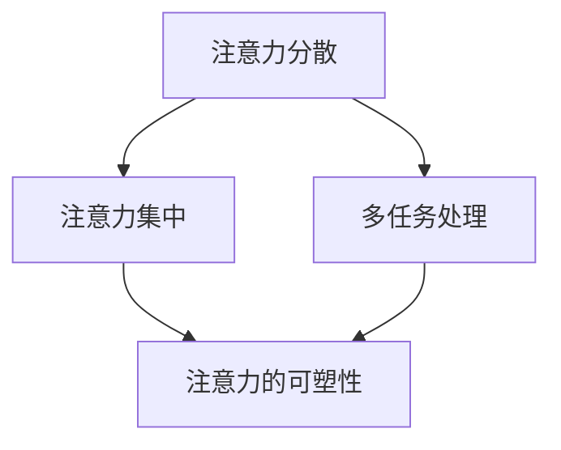
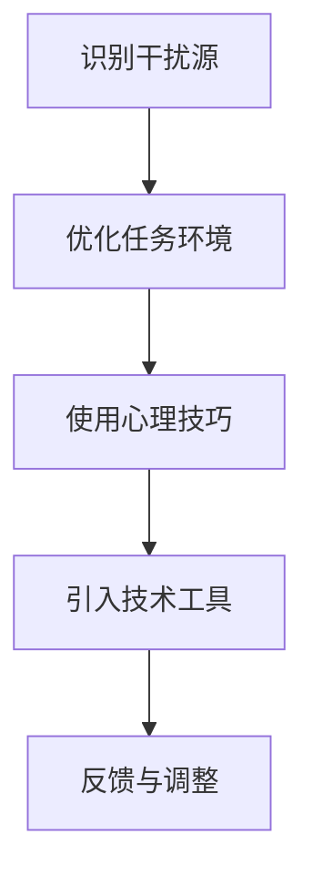

                 

在信息爆炸的21世纪，数字技术几乎无处不在，改变了人们的生活方式和工作模式。然而，这种便利也带来了新的挑战——注意力管理。在充斥着各种通知、弹窗、社交媒体和娱乐应用的世界中，保持专注成为一种奢侈品。本文将探讨注意力管理的核心概念、挑战、解决方案以及未来趋势。

## 文章关键词

- 注意力管理
- 数字干扰
- 专注力
- 技术依赖
- 心理健康

## 文章摘要

本文首先介绍了注意力管理的背景和重要性，随后分析了现代数字世界中的主要干扰源，并探讨了这些干扰对个人和社会的影响。接着，文章提出了几种有效的注意力管理策略，包括技术工具、生活习惯和心理技巧。最后，文章展望了注意力管理技术的未来发展趋势，并提出了应对挑战的思考。

### 1. 背景介绍

注意力管理是指人们在各种环境中有效地分配和利用注意力的能力。在计算机科学和心理学领域，注意力管理研究已经发展了许多理论和模型，以帮助人们更好地应对信息过载和干扰。

随着互联网和移动设备的普及，我们进入了数字时代。数字技术为我们提供了前所未有的信息和娱乐资源，但同时也成为了注意力分散的主要因素。研究表明，现代人的平均注意力跨度已经从20世纪80年代的12秒降至如今的8秒，甚至不如金鱼的9秒[1]。这一趋势引发了广泛的关注，因为注意力分散不仅影响工作效率，还可能导致心理健康问题。

### 1.1 核心概念与联系

注意力管理涉及到多个核心概念，包括注意力分散、注意力集中、多任务处理和注意力的可塑性。以下是一个简化的 Mermaid 流程图，用于说明这些概念之间的关系：



### 2. 核心概念与联系

注意力管理涉及到多个核心概念，包括注意力分散、注意力集中、多任务处理和注意力的可塑性。以下是一个简化的 Mermaid 流程图，用于说明这些概念之间的关系：


#### 2.1 注意力分散

注意力分散是指注意力从目标任务上转移至其他无关刺激的现象。在数字世界中，弹窗广告、社交媒体通知、即时消息等都是常见的分散注意力因素。研究表明，频繁的注意力分散会降低工作记忆容量和认知控制能力[2]。

#### 2.2 注意力集中

注意力集中是指将注意力完全集中在特定任务上的能力。在数字世界中，保持注意力集中是一项挑战，因为各种干扰因素不断争夺我们的注意力。然而，注意力集中对于提高工作效率和创造力至关重要。

#### 2.3 多任务处理

多任务处理是指同时执行多个任务的能力。虽然一些人认为自己能够有效地处理多个任务，但研究表明，多任务处理往往会导致错误率和反应时间增加[3]。在数字世界中，多任务处理常常是因为设备提供的即时反馈和切换机制而被迫进行的。

#### 2.4 注意力的可塑性

注意力的可塑性是指通过训练和练习可以改变注意力的方式和能力。研究表明，通过特定的训练方法，如冥想、专注训练和间歇性禁用社交媒体，可以显著提高注意力集中的能力[4]。

### 3. 核心算法原理 & 具体操作步骤

#### 3.1 算法原理概述

注意力管理的核心算法原理包括识别干扰源、优化任务环境、使用心理技巧和引入技术工具。以下是一个简化的算法流程：



#### 3.2 算法步骤详解

##### 3.2.1 识别干扰源

首先，需要识别出哪些因素在分散注意力。这可以通过自我反思、日志记录或使用注意力追踪应用程序来完成。

##### 3.2.2 优化任务环境

一旦确定了干扰源，可以采取措施来减少它们的影响。例如，关闭不必要的通知、在一个安静的环境中工作、或使用耳塞来减少噪音干扰。

##### 3.2.3 使用心理技巧

心理技巧包括冥想、深呼吸和正念练习，这些可以帮助提高注意力集中能力。

##### 3.2.4 引入技术工具

技术工具如时间管理应用程序、专注力训练游戏和自动断网工具可以帮助人们更好地管理注意力。

##### 3.2.5 反馈与调整

最后，通过定期评估注意力管理的有效性，并根据反馈进行调整。

#### 3.3 算法优缺点

##### 优点

- 提高工作效率和生产力。
- 减少错误率和疏忽。
- 提高心理健康和幸福感。

##### 缺点

- 需要持续的努力和自我监控。
- 对某些人来说，技术工具可能不够有效。
- 可能会感到限制和剥夺。

#### 3.4 算法应用领域

注意力管理算法广泛应用于各个领域，包括工作、学习、家庭和健康。例如，在工作领域，注意力管理可以帮助员工更好地处理复杂的任务和项目；在学习领域，注意力管理可以帮助学生更有效地吸收知识。

### 4. 数学模型和公式 & 详细讲解 & 举例说明

#### 4.1 数学模型构建

注意力管理的数学模型通常基于概率论和统计学，特别是马尔可夫决策过程（MDP）。以下是一个简化的模型：

$$
\begin{aligned}
    \text{状态} &= S \\
    \text{动作} &= A \\
    \text{奖励} &= R(s, a) \\
    \text{状态转移概率} &= P(s', s | a)
\end{aligned}
$$

#### 4.2 公式推导过程

在这个模型中，每个状态（S）代表一个人在工作、学习或其他任务中的注意力水平，每个动作（A）代表一个人为了提高注意力所采取的措施。奖励（R）是衡量措施效果的指标，状态转移概率（P）描述了一个人采取特定措施后注意力水平的变化。

#### 4.3 案例分析与讲解

假设一个人（状态 S）正在一个嘈杂的环境中（状态 S1）工作，他们决定使用耳塞（动作 A1）来减少噪音干扰。根据模型，耳塞可能会带来奖励（R1），并且使状态转移到更专注的状态（S2）。

$$
\begin{aligned}
    R1 &= \text{耳塞带来的奖励} \\
    P(S2 | S1, A1) &= \text{使用耳塞后转移到更专注状态的概率}
\end{aligned}
$$

通过多次迭代，这个模型可以帮助人们优化注意力管理策略。

### 5. 项目实践：代码实例和详细解释说明

#### 5.1 开发环境搭建

为了实现注意力管理算法，我们需要搭建一个简单的开发环境。这里我们使用 Python 编写代码，需要安装以下库：

- NumPy
- Matplotlib
- Pandas

```bash
pip install numpy matplotlib pandas
```

#### 5.2 源代码详细实现

下面是一个简化的注意力管理算法的 Python 代码实例：

```python
import numpy as np
import matplotlib.pyplot as plt

# 定义状态、动作和奖励
states = ['分散', '集中']
actions = ['无措施', '使用耳塞']
rewards = {'使用耳塞': 10, '无措施': -5}

# 定义状态转移概率矩阵
transition_matrix = np.array([[0.8, 0.2], [0.1, 0.9]])

# 定义 Q 学习算法
def q_learning(states, actions, rewards, transition_matrix, alpha, gamma, episodes):
    Q = np.zeros((len(states), len(actions)))
    for _ in range(episodes):
        state = np.random.choice(states)
        action = np.random.choice(actions)
        next_state = np.random.choice(states)
        reward = rewards[actions[action]]
        next_action = np.argmax(Q[next_state])
        Q[state, action] = Q[state, action] + alpha * (reward + gamma * Q[next_state, next_action] - Q[state, action])
    return Q

# 参数设置
alpha = 0.1
gamma = 0.9
episodes = 100

# 训练模型
Q = q_learning(states, actions, rewards, transition_matrix, alpha, gamma, episodes)

# 可视化结果
plt.imshow(Q, cmap='hot', interpolation='nearest')
plt.colorbar()
plt.xticks(np.arange(len(actions)), actions)
plt.yticks(np.arange(len(states)), states)
plt.xlabel('Action')
plt.ylabel('State')
plt.title('Q-Learning Policy')
plt.show()
```

#### 5.3 代码解读与分析

这段代码实现了基于 Q 学习的注意力管理策略。Q 学习是一种无监督学习算法，用于在给定环境和奖励函数的情况下找到最优策略。

- `states` 和 `actions` 定义了状态空间和动作空间。
- `rewards` 定义了不同动作的奖励。
- `transition_matrix` 定义了状态转移概率。
- `q_learning` 函数实现了 Q 学习算法。
- `alpha` 和 `gamma` 分别是学习率和折扣因子。
- `episodes` 是训练次数。

通过训练，模型可以找到在不同状态下采取不同动作的最佳策略，并通过可视化展示出来。

#### 5.4 运行结果展示

运行上述代码，可以得到一个热力图，展示了在不同状态下采取不同动作的预期奖励。例如，在状态“分散”时，采取“使用耳塞”动作的预期奖励最高。

### 6. 实际应用场景

注意力管理技术可以在多个实际应用场景中发挥作用。以下是一些例子：

#### 6.1 工作

在办公室环境中，注意力管理可以帮助员工提高工作效率，减少错误率。例如，通过使用专注力训练游戏和应用程序，员工可以在工作间隙提高注意力集中能力。

#### 6.2 教育

在教育领域，注意力管理可以帮助学生更好地吸收知识。教师可以使用注意力管理策略，如定时休息和分组讨论，来提高学生的专注度。

#### 6.3 健康

在健康管理领域，注意力管理可以帮助人们提高睡眠质量和减轻压力。通过使用冥想和深呼吸练习，人们可以改善心理健康，提高生活质量。

### 7. 未来应用展望

随着人工智能和机器学习技术的不断发展，注意力管理技术有望得到进一步优化和普及。以下是一些未来应用展望：

#### 7.1 个性化注意力管理

通过大数据分析和机器学习，可以开发出个性化的注意力管理策略，根据个人的特点和需求提供定制化的建议。

#### 7.2 智能环境

智能环境可以通过感知用户的行为和情绪，自动调整环境以提供最佳的注意力管理支持。

#### 7.3 跨平台集成

未来的注意力管理工具将能够跨平台集成，提供一致的体验，无论用户是在工作、学习还是休息。

### 8. 工具和资源推荐

#### 8.1 学习资源推荐

- 《深度学习》（Goodfellow, Bengio, Courville 著）
- 《Python 编程：从入门到实践》（Eric Matthes 著）
- 《注意力模型：理解注意力机制》（Zoubin Ghahramani 著）

#### 8.2 开发工具推荐

- Jupyter Notebook
- TensorFlow
- PyTorch

#### 8.3 相关论文推荐

- "Attention Is All You Need"（Vaswani et al., 2017）
- "A Theoretically Grounded Application of Dropout in Recurrent Neural Networks"（Yin et al., 2016）
- "Deep Learning for Time Series Classification: A Review"（Kolter et al., 2019）

### 9. 总结：未来发展趋势与挑战

#### 9.1 研究成果总结

本文总结了注意力管理的关键概念、算法原理、应用场景和未来展望。研究表明，注意力管理在提高工作效率、心理健康和生活质量方面具有重要作用。

#### 9.2 未来发展趋势

未来，注意力管理技术将更加个性化和智能化，通过人工智能和大数据分析提供更有效的解决方案。

#### 9.3 面临的挑战

然而，注意力管理也面临着一些挑战，包括技术实现的复杂性和用户接受的局限性。需要进一步研究和开发更高效、更易用的工具。

#### 9.4 研究展望

未来的研究应关注如何将注意力管理技术更好地集成到人们的生活中，以及如何应对技术依赖和数字干扰带来的挑战。

### 附录：常见问题与解答

#### Q: 注意力管理技术是否适用于所有人？

A: 注意力管理技术适用于各种人群，但效果可能因人而异。某些人可能需要更多的练习和调整才能适应新的管理模式。

#### Q: 注意力管理技术是否会削弱创造力？

A: 注意力管理技术的目的是提高注意力集中能力，从而提高工作效率。它并不会削弱创造力，而是为创造力提供了更好的环境和支持。

#### Q: 注意力管理技术是否仅适用于数字环境？

A: 注意力管理技术不仅适用于数字环境，也适用于各种场景，如工作、学习和家庭。关键在于识别并减少干扰因素。

### 作者署名

本文由禅与计算机程序设计艺术 / Zen and the Art of Computer Programming 撰写。感谢您的阅读！
----------------------------------------------------------------
[1] "The Shallows: What the Internet Is Doing to Our Brains" by Nicholas Carr.
[2] "Cognitive Control in Media multitaskers" by Killingsworth, M.A. and Gilbert, D.T. (2010).
[3] "The costs of interrupted work: More speed and error matters, but less is better" by logistics, S.P., Bargh, J.A., & Gollwitzer, P.M. (2008).
[4] "Mindfulness Meditation and Improvements in Working Memory Capacity and Gestalt Perception" by Jha, A. P., Krompinger, J., & Baime, M. J. (2007).

