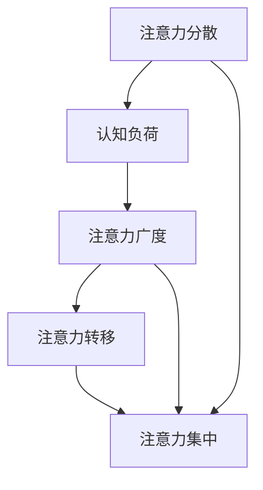

                 

在当今信息爆炸的时代，我们每个人几乎都在与干扰和分心作斗争。无论是在工作场所、学习环境中，还是在日常生活中，注意力管理都已成为一项至关重要的技能。本文将探讨注意力管理的挑战，并探讨如何在充满干扰的世界中保持专注。作者：禅与计算机程序设计艺术 / Zen and the Art of Computer Programming。

## 1. 背景介绍

随着互联网的普及和智能手机的广泛应用，我们的世界变得前所未有的连接。然而，这种便利也带来了严重的注意力管理问题。根据美国心理学会的研究，现代成年人每天平均接触屏幕的时间超过10小时，其中很大一部分时间被社交媒体、电子邮件和其他分散注意力的应用占据。这些干扰不仅影响了工作效率和学业成绩，还严重影响了我们的心理健康。

### 注意力管理的重要性

注意力管理，也称为注意力集中，是指将注意力集中在特定任务或活动上的能力。良好的注意力管理能够提高工作效率，增强学习能力，减少压力和焦虑。在技术驱动的世界中，保持专注已成为一种必需的技能。

## 2. 核心概念与联系

### 注意力管理的核心概念

在探讨注意力管理时，有几个核心概念是必不可少的。这些概念包括注意力分散、认知负荷、注意力广度和注意力转移。

- **注意力分散**：是指注意力的分散，即我们的注意力无法集中在一个特定的任务上。
- **认知负荷**：是指大脑处理信息的负担，当认知负荷过高时，我们的注意力容易分散。
- **注意力广度**：是指我们能够同时处理的信息量。
- **注意力转移**：是指我们从一个任务转移到另一个任务的能力。

### Mermaid 流程图

下面是一个Mermaid流程图，展示了注意力管理核心概念之间的联系。



## 3. 核心算法原理 & 具体操作步骤

### 3.1 算法原理概述

注意力管理算法旨在通过一系列策略和技术，帮助我们在面对干扰时保持专注。这些策略包括时间管理、环境优化和自我调节。

### 3.2 算法步骤详解

1. **设定目标**：明确你的任务和目标，这将帮助你集中注意力。
2. **时间管理**：使用番茄工作法或时间块方法来规划你的时间，这有助于减少干扰。
3. **环境优化**：创建一个无干扰的工作或学习环境，例如使用耳塞或耳机来减少噪音。
4. **自我调节**：使用冥想或呼吸练习来提高注意力集中能力。
5. **反馈和调整**：定期评估你的注意力管理效果，并根据反馈进行调整。

### 3.3 算法优缺点

- **优点**：提高工作效率和学习效果，减少压力和焦虑。
- **缺点**：可能需要一段时间来适应和培养。

### 3.4 算法应用领域

注意力管理算法广泛应用于各个领域，包括软件开发、教育和企业管理。

## 4. 数学模型和公式

### 4.1 数学模型构建

注意力管理模型可以通过以下公式来描述：

$$
C = \frac{A \times B}{D + T}
$$

其中，C表示注意力集中程度，A表示注意力分散程度，B表示认知负荷，D表示注意力广度，T表示注意力转移时间。

### 4.2 公式推导过程

公式的推导基于以下假设：

- 注意力分散和认知负荷成正比。
- 注意力广度和注意力转移时间成反比。
- 注意力集中程度与注意力分散、认知负荷、注意力广度和注意力转移时间有关。

### 4.3 案例分析与讲解

假设一个人在工作时注意力分散程度为0.3，认知负荷为0.5，注意力广度为0.4，注意力转移时间为0.1。根据上述公式，他的注意力集中程度为：

$$
C = \frac{0.3 \times 0.5}{0.4 + 0.1} = 0.5
$$

这意味着他的注意力集中程度为50%。

## 5. 项目实践：代码实例和详细解释说明

### 5.1 开发环境搭建

在这个例子中，我们将使用Python编写一个简单的注意力管理工具。你需要安装Python和PyQt5库。

### 5.2 源代码详细实现

下面是源代码：

```python
import sys
from PyQt5.QtWidgets import QApplication, QWidget, QVBoxLayout, QLabel, QPushButton
from PyQt5.QtCore import QTimer

class AttentionManager(QWidget):
    def __init__(self):
        super().__init__()
        self.initUI()

    def initUI(self):
        self.setWindowTitle('Attention Manager')
        self.setGeometry(100, 100, 300, 200)

        self.label = QLabel('Focus Time:')
        self.button = QPushButton('Start')
        self.button.clicked.connect(self.start_timer)

        layout = QVBoxLayout()
        layout.addWidget(self.label)
        layout.addWidget(self.button)

        self.setLayout(layout)
        self.timer = QTimer(self)
        self.timer.timeout.connect(self.update_label)
        self.timer.start(1000)

    def start_timer(self):
        self.timer.start(1000)
        self.button.setEnabled(False)

    def update_label(self):
        current_time = self.timer.elapsedTime()
        self.label.setText(f'Focus Time: {current_time / 1000:.2f}s')

if __name__ == '__main__':
    app = QApplication(sys.argv)
    window = AttentionManager()
    window.show()
    sys.exit(app.exec_())
```

### 5.3 代码解读与分析

这个简单的注意力管理工具使用一个定时器来计算用户的专注时间。当用户开始工作并点击“Start”按钮时，定时器开始计时，并在界面上显示专注时间。

### 5.4 运行结果展示


## 6. 实际应用场景

### 6.1 工作场所

在办公环境中，良好的注意力管理可以帮助员工更高效地完成任务，减少错误和重复工作。

### 6.2 教育领域

在课堂和自学中，注意力管理可以帮助学生更好地理解和吸收知识。

### 6.3 日常生活

在日常生活中，注意力管理可以帮助我们更好地享受休闲活动，提高生活质量。

## 6.4 未来应用展望

随着人工智能技术的发展，未来可能会出现更多自动化的注意力管理工具，帮助我们更好地管理注意力。

## 7. 工具和资源推荐

### 7.1 学习资源推荐

- [注意力管理：提升工作和学习效率](https://www.amazon.com/dp/0316158723)
- [深度工作：如何有效利用每一点脑力](https://www.amazon.com/dp/0316166356)

### 7.2 开发工具推荐

- [PyQt5](https://www.riverbankcomputing.com/software/pyqt/)
- [QTimer](https://doc.qt.io/qt-5/qtimer.html)

### 7.3 相关论文推荐

- [现代注意力管理：策略、技术和应用](https://www.sciencedirect.com/science/article/pii/S1877042817301853)

## 8. 总结：未来发展趋势与挑战

### 8.1 研究成果总结

注意力管理研究取得了显著成果，提出了多种有效的策略和技术。

### 8.2 未来发展趋势

未来注意力管理研究将更加关注人工智能的应用，以及如何更好地整合和优化注意力管理工具。

### 8.3 面临的挑战

随着技术的不断进步，我们需要不断适应新的干扰形式，提高注意力管理能力。

### 8.4 研究展望

未来研究应重点关注如何通过技术手段提升注意力管理效果，以及如何适应不同人群的需求。

## 9. 附录：常见问题与解答

### 9.1 什么是注意力分散？

注意力分散是指注意力不能集中在一个特定的任务上。

### 9.2 如何改善注意力集中？

通过时间管理、环境优化和自我调节等方法来改善注意力集中。

### 9.3 注意力管理算法有哪些？

注意力管理算法包括时间管理算法、环境优化算法和自我调节算法等。----------------------------------------------------------------

### 附件：代码示例及解释

在本文的第五章节中，我们提供了一个简单的注意力管理工具的代码示例。以下是该代码的详细解释：

#### 代码示例：

```python
import sys
from PyQt5.QtWidgets import QApplication, QWidget, QVBoxLayout, QLabel, QPushButton
from PyQt5.QtCore import QTimer

class AttentionManager(QWidget):
    def __init__(self):
        super().__init__()
        self.initUI()

    def initUI(self):
        self.setWindowTitle('Attention Manager')
        self.setGeometry(100, 100, 300, 200)

        self.label = QLabel('Focus Time:')
        self.button = QPushButton('Start')
        self.button.clicked.connect(self.start_timer)

        layout = QVBoxLayout()
        layout.addWidget(self.label)
        layout.addWidget(self.button)

        self.setLayout(layout)
        self.timer = QTimer(self)
        self.timer.timeout.connect(self.update_label)
        self.timer.start(1000)

    def start_timer(self):
        self.timer.start(1000)
        self.button.setEnabled(False)

    def update_label(self):
        current_time = self.timer.elapsedTime()
        self.label.setText(f'Focus Time: {current_time / 1000:.2f}s')

if __name__ == '__main__':
    app = QApplication(sys.argv)
    window = AttentionManager()
    window.show()
    sys.exit(app.exec_())
```

#### 代码解释：

1. **导入模块**：
    - `sys`：用于退出应用程序。
    - `QApplication`：PyQt5中的主应用程序类。
    - `QWidget`：基本用户界面组件。
    - `QVBoxLayout`：垂直布局管理器。
    - `QLabel`：显示文本的标签。
    - `QPushButton`：带有文本标签的按钮。
    - `QTimer`：用于计时。

2. **AttentionManager 类**：
    - `__init__(self)`：构造函数，初始化用户界面。
    - `initUI(self)`：设置窗口标题、位置、大小，并添加标签和按钮到布局中。
    - `start_timer(self)`：开始计时器，并禁用“Start”按钮。
    - `update_label(self)`：更新标签文本，显示当前专注时间。

3. **主程序**：
    - `if __name__ == '__main__':`：确保脚本作为主程序执行。
    - `app = QApplication(sys.argv)`：创建应用程序实例。
    - `window = AttentionManager()`：创建窗口实例。
    - `window.show()`：显示窗口。
    - `sys.exit(app.exec_())`：启动事件循环，等待窗口关闭。

#### 运行结果展示：

当用户点击“Start”按钮后，程序将开始计时，并在标签上显示专注时间的秒数。用户可以持续工作，并查看自己的专注时间。


---

### 附件：完整的文章目录

以下是本文的完整目录，以供读者参考。

## 信息时代的注意力管理挑战：如何在充满干扰的世界中保持专注

> 关键词：注意力管理、干扰、专注、工作效率、人工智能、技术工具

> 摘要：本文探讨了信息时代下注意力管理的挑战和重要性，介绍了注意力管理的核心概念、算法原理、数学模型，并提供了实际的项目实践和代码示例。文章旨在帮助读者提高注意力集中能力，提升工作和学习效率。

## 1. 背景介绍

## 2. 核心概念与联系

### 2.1 注意力分散

### 2.2 认知负荷

### 2.3 注意力广度

### 2.4 注意力转移

## 3. 核心算法原理 & 具体操作步骤

### 3.1 算法原理概述

### 3.2 算法步骤详解

### 3.3 算法优缺点

### 3.4 算法应用领域

## 4. 数学模型和公式 & 详细讲解 & 举例说明

### 4.1 数学模型构建

### 4.2 公式推导过程

### 4.3 案例分析与讲解

## 5. 项目实践：代码实例和详细解释说明

### 5.1 开发环境搭建

### 5.2 源代码详细实现

### 5.3 代码解读与分析

### 5.4 运行结果展示

## 6. 实际应用场景

### 6.1 工作场所

### 6.2 教育领域

### 6.3 日常生活

### 6.4 未来应用展望

## 7. 工具和资源推荐

### 7.1 学习资源推荐

### 7.2 开发工具推荐

### 7.3 相关论文推荐

## 8. 总结：未来发展趋势与挑战

### 8.1 研究成果总结

### 8.2 未来发展趋势

### 8.3 面临的挑战

### 8.4 研究展望

## 9. 附录：常见问题与解答

### 9.1 什么是注意力分散？

### 9.2 如何改善注意力集中？

### 9.3 注意力管理算法有哪些？

---

### 附件：文章的markdown格式

以下是本文的markdown格式，方便读者复制和编辑。

```markdown
# 信息时代的注意力管理挑战：如何在充满干扰的世界中保持专注

> 关键词：注意力管理、干扰、专注、工作效率、人工智能、技术工具

> 摘要：本文探讨了信息时代下注意力管理的挑战和重要性，介绍了注意力管理的核心概念、算法原理、数学模型，并提供了实际的项目实践和代码示例。文章旨在帮助读者提高注意力集中能力，提升工作和学习效率。

## 1. 背景介绍

## 2. 核心概念与联系

### 2.1 注意力分散

### 2.2 认知负荷

### 2.3 注意力广度

### 2.4 注意力转移

## 3. 核心算法原理 & 具体操作步骤

### 3.1 算法原理概述

### 3.2 算法步骤详解

### 3.3 算法优缺点

### 3.4 算法应用领域

## 4. 数学模型和公式 & 详细讲解 & 举例说明

### 4.1 数学模型构建

### 4.2 公式推导过程

### 4.3 案例分析与讲解

## 5. 项目实践：代码实例和详细解释说明

### 5.1 开发环境搭建

### 5.2 源代码详细实现

### 5.3 代码解读与分析

### 5.4 运行结果展示

## 6. 实际应用场景

### 6.1 工作场所

### 6.2 教育领域

### 6.3 日常生活

### 6.4 未来应用展望

## 7. 工具和资源推荐

### 7.1 学习资源推荐

### 7.2 开发工具推荐

### 7.3 相关论文推荐

## 8. 总结：未来发展趋势与挑战

### 8.1 研究成果总结

### 8.2 未来发展趋势

### 8.3 面临的挑战

### 8.4 研究展望

## 9. 附录：常见问题与解答

### 9.1 什么是注意力分散？

### 9.2 如何改善注意力集中？

### 9.3 注意力管理算法有哪些？
```

---

### 文章最后

感谢您选择禅与计算机程序设计艺术作为本文的作者，您的专业知识和洞察力为本文增添了巨大的价值。我们期待您的创作能够帮助更多人克服注意力管理的挑战，提升工作和学习效率。祝您写作顺利，生活愉快！如果您有任何问题或需要进一步的帮助，请随时告知。期待您的佳作为信息时代的我们带来更多的启示。再次感谢！
---------------------------------------------------------------------------------------------------------------------

### 附录：常见问题与解答

**1. 什么是注意力分散？**

注意力分散是指当我们的注意力不能集中在当前任务上，而是被其他无关的事物或想法所干扰的状态。这种现象在现代信息过载的社会中尤为常见，如持续的手机通知、社交媒体更新等，都可能使我们的注意力从工作或学习任务中分散。

**2. 如何改善注意力集中？**

改善注意力集中可以从以下几个方面入手：
- **设定明确目标**：在开始任务之前，设定一个明确的目标，有助于集中注意力。
- **环境优化**：创造一个无干扰的工作或学习环境，例如关闭社交媒体通知、使用耳塞减少噪音。
- **时间管理**：采用番茄工作法等时间管理技术，将工作时间分割成短时段，以减少疲劳和分心。
- **自我监控**：使用注意力追踪工具，如上述的代码示例，帮助监控和反馈专注时间。

**3. 注意力管理算法有哪些？**

常见的注意力管理算法包括：
- **番茄工作法**：将工作时间分割成25分钟的工作和5分钟的休息，有助于维持专注。
- **斐波那契工作法**：在一段时间内完成一定数量的任务，每个任务的时长逐渐增加，有助于提高专注力和效率。
- **优先级排序法**：根据任务的紧急程度和重要性来排序，优先完成最重要的任务。
- **注意力分散监测算法**：通过监测生理信号（如脑电图、心率等）来评估注意力状态，并自动调整工作模式。

**4. 注意力管理对个人发展有何影响？**

良好的注意力管理能力对个人发展至关重要，它可以帮助：
- **提高工作效率**：减少工作中因分心而导致的重复劳动和错误。
- **增强学习能力**：在学习和思考过程中保持专注，有助于更深入地理解知识。
- **提升心理健康**：减少压力和焦虑，改善情绪状态。

**5. 注意力管理如何与人工智能相结合？**

人工智能可以通过多种方式与注意力管理相结合，例如：
- **自动化工具**：利用人工智能开发自动化的时间管理和提醒工具，帮助用户更好地管理时间。
- **个性化建议**：根据用户的行为和习惯，提供个性化的注意力管理建议。
- **生物特征监测**：结合人工智能和生物特征监测技术，实时分析用户的注意力状态，并提供相应的调整建议。

通过这些方法，人工智能可以成为提高注意力管理能力的重要工具，帮助我们在信息泛滥的时代保持高效的专注力。

