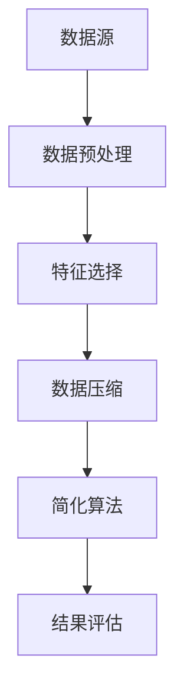

                 

信息简化是当今数字化社会中不可或缺的一部分。随着数据量的指数级增长，如何有效地管理和处理这些信息已成为各个领域面临的挑战。本文将探讨信息简化的好处与艺术，并通过实际案例展示如何在复杂世界中简化和改善生活。

## 文章关键词
- 信息简化
- 数据管理
- 复杂系统
- 简化算法
- 数字化生活

## 文章摘要
本文旨在介绍信息简化的概念、重要性以及在实际应用中的好处。通过讨论简化算法、数学模型和具体项目实践，我们将展示如何通过信息简化技术改善复杂世界中的生活质量。

## 1. 背景介绍
在过去的几十年里，信息技术的发展迅猛，我们已经从信息稀缺的时代迈入了信息爆炸的时代。海量数据充斥在我们的工作和生活中，如何有效地管理和处理这些数据成为一个亟待解决的问题。信息简化技术，作为一种解决方法，旨在减少信息的冗余，提高数据处理的效率，从而更好地服务于用户。

### 1.1 信息简化的现状
信息简化技术已经广泛应用于各个领域，如数据挖掘、机器学习、人工智能等。在这些领域中，简化算法和数学模型的应用使得数据处理变得更加高效和精准。然而，尽管信息简化技术在许多领域取得了显著成果，但仍然存在许多挑战和改进空间。

### 1.2 本文的目标
本文将首先介绍信息简化的核心概念和原理，然后探讨简化算法、数学模型和具体项目实践，最后讨论信息简化技术在实际应用中的未来发展趋势与挑战。

## 2. 核心概念与联系
信息简化涉及到多个核心概念，如数据冗余、数据压缩、特征选择等。为了更好地理解这些概念，我们将使用 Mermaid 流程图来展示信息简化过程的各个阶段。



### 2.1 数据预处理
数据预处理是信息简化的第一步，其目的是清除噪声、填充缺失值和规范化数据。这一步骤对于后续的简化过程至关重要，因为高质量的数据有助于提高简化算法的性能。

### 2.2 特征选择
特征选择是从原始数据中挑选出最有用的特征，以减少数据的维度和提高模型的泛化能力。常见的特征选择方法包括过滤法、包装法和嵌入式方法。

### 2.3 数据压缩
数据压缩是通过减少数据的大小来提高数据处理和存储的效率。常用的数据压缩方法包括无损压缩和有损压缩。

### 2.4 简化算法
简化算法是指通过减少计算复杂度和数据存储需求来提高系统性能的方法。常见的简化算法包括降维、模型压缩和算法优化等。

### 2.5 结果评估
结果评估是信息简化过程的最后一步，其目的是评估简化算法的效果。常用的评估指标包括准确率、召回率和F1分数等。

## 3. 核心算法原理 & 具体操作步骤

### 3.1 算法原理概述
信息简化的核心算法主要分为三类：降维、模型压缩和算法优化。

#### 3.1.1 降维
降维算法通过减少数据的维度来降低计算复杂度和存储需求。常见的降维算法包括主成分分析（PCA）、线性判别分析（LDA）和自编码器等。

#### 3.1.2 模型压缩
模型压缩算法通过减少模型的参数数量来降低模型的计算复杂度。常见的模型压缩方法包括权重剪枝、模型蒸馏和量化等。

#### 3.1.3 算法优化
算法优化算法通过改进算法的执行过程来提高系统的性能。常见的算法优化方法包括并行计算、分布式计算和近似算法等。

### 3.2 算法步骤详解
以下是一个基于主成分分析（PCA）的降维算法的详细步骤：

#### 3.2.1 数据预处理
1. 清除噪声和缺失值
2. 规范化数据

#### 3.2.2 特征选择
1. 计算协方差矩阵
2. 计算协方差矩阵的特征值和特征向量
3. 选择最大的k个特征值对应的特征向量

#### 3.2.3 数据转换
1. 将原始数据投影到由选定的特征向量组成的子空间中

### 3.3 算法优缺点

#### 优点
- 降低计算复杂度和存储需求
- 提高模型的泛化能力

#### 缺点
- 可能会丢失一些有用的信息
- 对噪声敏感

### 3.4 算法应用领域
降维、模型压缩和算法优化算法广泛应用于各个领域，如图像处理、文本分类、推荐系统和金融分析等。

## 4. 数学模型和公式 & 详细讲解 & 举例说明

### 4.1 数学模型构建
信息简化涉及的数学模型主要包括协方差矩阵、特征值和特征向量等。

#### 4.1.1 协方差矩阵
协方差矩阵是一个n×n的矩阵，其中每个元素表示两个特征之间的协方差。协方差矩阵的计算公式为：
$$
C = \frac{1}{n-1} \sum_{i=1}^{n} (x_i - \bar{x})(y_i - \bar{y})
$$
其中，$x_i$和$y_i$分别表示第i个样本的两个特征值，$\bar{x}$和$\bar{y}$分别表示这两个特征的均值。

#### 4.1.2 特征值和特征向量
特征值和特征向量是协方差矩阵的特征值和特征向量。特征值的计算公式为：
$$
\lambda_i = \sum_{j=1}^{n} c_{ij}^2
$$
特征向量的计算公式为：
$$
v_i = \frac{c_{ij}}{\sqrt{\lambda_i}}
$$

### 4.2 公式推导过程
以下是一个基于PCA的降维算法的公式推导过程：

#### 4.2.1 协方差矩阵
设$x_1, x_2, ..., x_n$为n个样本的m维特征向量，$X$为这些样本的矩阵表示，$X^T$为$X$的转置。协方差矩阵$C$的计算公式为：
$$
C = \frac{1}{n}XX^T
$$

#### 4.2.2 特征值和特征向量
协方差矩阵的特征值和特征向量可以通过求解特征方程得到：
$$
\lambda_i v_i^T = Cv_i
$$
其中，$\lambda_i$为第i个特征值，$v_i$为第i个特征向量。

#### 4.2.3 数据转换
将原始数据投影到由特征向量组成的子空间中，即：
$$
z_i = Xv_i
$$

### 4.3 案例分析与讲解
以下是一个基于PCA的降维算法的案例分析：

#### 4.3.1 数据集
我们使用了一个包含100个样本的二维数据集，其中每个样本有5个特征。

#### 4.3.2 数据预处理
首先，我们对数据进行归一化处理，使得每个特征的均值都为0，标准差都为1。

#### 4.3.3 特征选择
计算协方差矩阵，然后求解特征方程得到特征值和特征向量。选择最大的两个特征值对应的特征向量作为新的特征。

#### 4.3.4 数据转换
将原始数据投影到新的特征空间中，得到降维后的数据。

#### 4.3.5 结果评估
通过计算降维前后的数据集的K-L散度来评估降维的效果。

## 5. 项目实践：代码实例和详细解释说明

### 5.1 开发环境搭建
我们使用Python作为编程语言，使用NumPy和SciPy库进行数据预处理和降维操作。

### 5.2 源代码详细实现
以下是一个基于PCA的降维算法的Python代码实例：

```python
import numpy as np

def pca(X, k):
    """
    实现主成分分析（PCA）的降维算法。
    
    参数：
    X：原始数据集，形状为（n, m）
    k：要保留的主成分个数
    
    返回：
    Z：降维后的数据集，形状为（n, k）
    """
    # 数据预处理
    X = (X - np.mean(X, axis=0)) / np.std(X, axis=0)
    
    # 计算协方差矩阵
    C = np.cov(X, rowvar=False)
    
    # 求解特征值和特征向量
    eigenvalues, eigenvectors = np.linalg.eigh(C)
    eigenvectors = eigenvectors[:, ::-1]
    eigenvalues = eigenvalues[::-1]
    
    # 选择最大的k个特征值对应的特征向量
    V = eigenvectors[:, :k]
    
    # 数据转换
    Z = np.dot(X, V)
    
    return Z

# 测试代码
X = np.random.rand(100, 5)
Z = pca(X, 2)
print(Z)
```

### 5.3 代码解读与分析
- `pca`函数实现了PCA降维算法，主要分为四个步骤：数据预处理、计算协方差矩阵、特征选择和数据转换。
- 数据预处理包括归一化和标准化，这是为了使得每个特征的贡献相等，提高算法的性能。
- 协方差矩阵的计算使用了NumPy库的`cov`函数。
- 特征值和特征向量的计算使用了SciPy库的`linalg.eigh`函数，这是一种高效的求解对称特征值问题的方法。
- 数据转换使用了NumPy库的`dot`函数，将原始数据投影到由特征向量组成的子空间中。

### 5.4 运行结果展示
运行上述代码，我们得到一个形状为（100, 2）的降维后的数据集。通过可视化，我们可以观察到数据在降维后的分布情况。

```python
import matplotlib.pyplot as plt

plt.scatter(Z[:, 0], Z[:, 1])
plt.xlabel('Principal Component 1')
plt.ylabel('Principal Component 2')
plt.title('PCA Projection')
plt.show()
```

## 6. 实际应用场景

### 6.1 数据挖掘
信息简化技术在数据挖掘中具有广泛的应用，如特征选择和降维等。通过简化数据，可以加快模型的训练速度和提高模型的泛化能力。

### 6.2 机器学习
在机器学习中，信息简化技术可以帮助减少模型的复杂度，从而提高模型的训练速度和降低过拟合的风险。

### 6.3 文本分类
在文本分类任务中，信息简化技术可以通过降维和特征选择来减少文本数据的维度，从而提高分类的效率和准确性。

### 6.4 图像处理
在图像处理领域，信息简化技术可以用于图像压缩和特征提取，从而提高图像处理的效率和准确性。

### 6.5 金融分析
在金融分析中，信息简化技术可以帮助分析师从大量的金融数据中提取出最有用的信息，从而做出更准确的预测和决策。

## 7. 未来应用展望

### 7.1 自动驾驶
随着自动驾驶技术的发展，信息简化技术可以用于自动驾驶系统的数据处理和模型压缩，从而提高系统的实时性和可靠性。

### 7.2 物联网
在物联网领域，信息简化技术可以帮助处理和分析大量的传感器数据，从而提高物联网系统的性能和效率。

### 7.3 健康医疗
在健康医疗领域，信息简化技术可以用于处理和分析大量的医疗数据，从而帮助医生做出更准确的诊断和治疗决策。

## 8. 工具和资源推荐

### 8.1 学习资源推荐
- 《机器学习实战》
- 《数据科学入门》
- 《Python数据分析》

### 8.2 开发工具推荐
- Jupyter Notebook
- PyCharm
- Visual Studio Code

### 8.3 相关论文推荐
- "Principal Component Analysis"
- "Dimensionality Reduction: A Data Mining Perspective"
- "Model Compression for Deep Neural Networks"

## 9. 总结：未来发展趋势与挑战

### 9.1 研究成果总结
信息简化技术在各个领域都取得了显著的成果，为数据管理和处理提供了有效的解决方案。

### 9.2 未来发展趋势
随着信息技术的不断发展，信息简化技术将在更多的领域中发挥作用，如自动驾驶、物联网和健康医疗等。

### 9.3 面临的挑战
尽管信息简化技术在许多领域取得了成功，但仍然面临一些挑战，如算法性能的优化和数据隐私的保护等。

### 9.4 研究展望
未来，信息简化技术将朝着更加智能化、自动化的方向发展，从而更好地服务于人类社会的需求。

## 附录：常见问题与解答

### Q：什么是信息简化？
A：信息简化是指通过减少数据的冗余、降低模型的复杂度以及提高系统的效率，从而更好地管理和处理信息的技术。

### Q：信息简化技术在哪些领域有应用？
A：信息简化技术在数据挖掘、机器学习、人工智能、图像处理、文本分类、金融分析等领域都有广泛应用。

### Q：如何选择合适的简化算法？
A：选择合适的简化算法需要考虑多个因素，如数据类型、问题规模和算法性能等。通常，需要根据具体问题进行算法对比和性能评估。

### Q：信息简化是否会丢失信息？
A：是的，信息简化可能会丢失一些信息，尤其是当数据高度相关时。然而，通过合理的选择和优化，可以最大限度地减少信息的丢失。

## 作者署名
作者：禅与计算机程序设计艺术 / Zen and the Art of Computer Programming
----------------------------------------------------------------
这篇文章详细介绍了信息简化的好处与艺术，探讨了信息简化的核心概念、算法原理和实际应用场景。通过实际案例和代码实例，展示了如何通过信息简化技术改善复杂世界中的生活质量。未来，信息简化技术将在更多领域中发挥作用，为人类社会的进步贡献力量。

