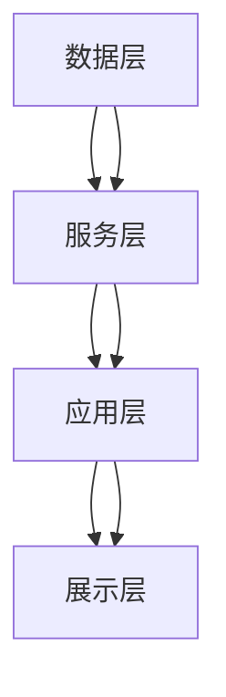

                 

 在这个数字化的时代，信息的爆炸性增长给个人和组织带来了前所未有的挑战。有效组织和检索信息已经成为提升工作效率、增强知识管理能力的关键。本文将探讨信息过载的背景，介绍知识管理系统的核心概念、架构、算法原理及其实施步骤。此外，还将分析数学模型、代码实例以及实际应用场景，并展望未来发展趋势与挑战。

## 文章关键词

- 信息过载
- 知识管理系统
- 信息组织
- 信息检索
- 人工智能
- 数学模型
- 实践应用

## 文章摘要

本文首先分析了信息过载现象及其对个人和组织的影响。接着，详细介绍了知识管理系统的核心概念、架构和算法原理。通过实际代码实例和详细解释，展示了知识管理系统的实现过程。随后，探讨了数学模型和公式的应用，以及在不同领域的实际应用场景。最后，展望了知识管理系统的未来发展趋势和面临的挑战。

## 1. 背景介绍

### 信息过载的挑战

随着互联网的普及和移动设备的广泛使用，信息获取变得前所未有的便捷。然而，信息过载现象也日益严重。据统计，每天产生的数据量高达数亿GB，人们面临的信息压力越来越大。这种信息过载不仅降低了工作效率，还导致了许多健康问题，如焦虑、失眠和注意力不集中。

### 知识管理的意义

知识管理是一种通过系统化和策略化的方式来识别、获取、组织和利用知识的实践。有效的知识管理可以减少信息过载，提高信息检索效率，促进知识的共享和创新。对于组织而言，知识管理是提升竞争力、实现可持续发展的重要手段。对于个人而言，知识管理可以帮助提高学习效率、增强职业发展。

## 2. 核心概念与联系

### 核心概念

知识管理系统（Knowledge Management System, KMS）是一种用于收集、存储、组织、共享和检索知识的系统。它包括以下几个核心概念：

1. **知识元**：知识管理系统中的基本单元，可以是文档、图片、视频等多种形式。
2. **知识库**：存储和管理知识元的地方，可以是数据库、文件系统或分布式存储系统。
3. **知识图谱**：通过图论方法组织和展示知识元及其关系的可视化工具。
4. **知识门户**：为用户提供访问和管理知识的接口。

### 架构

知识管理系统的架构通常包括以下几个层次：

1. **数据层**：负责存储和管理知识元，可以是关系数据库、NoSQL数据库或分布式文件系统。
2. **服务层**：提供各种知识管理功能，如知识检索、知识共享、知识挖掘等，通常使用RESTful API或SOAP接口。
3. **应用层**：为最终用户提供知识管理的界面，可以是Web应用、桌面应用或移动应用。
4. **展示层**：通过图表、报表等形式展示知识管理系统的数据和功能。

### Mermaid 流程图



## 3. 核心算法原理 & 具体操作步骤

### 3.1 算法原理概述

知识管理系统中的核心算法包括信息检索算法、分类算法和聚类算法。以下分别介绍这三种算法的基本原理。

#### 信息检索算法

信息检索算法是知识管理系统中最为基础的算法，用于从海量数据中快速准确地查找用户所需的信息。常用的信息检索算法包括：

- **布尔检索**：基于布尔逻辑运算符（AND、OR、NOT）进行检索。
- **向量空间模型**：将文档和查询转化为向量，通过内积或余弦相似度计算相似度。
- **TF-IDF模型**：通过词频（TF）和逆文档频率（IDF）计算词语的重要程度。

#### 分类算法

分类算法用于将知识元自动划分为不同的类别，以方便用户快速检索和浏览。常用的分类算法包括：

- **K-最近邻算法（K-NN）**：基于相似度度量，将新数据点分配到已有的类别中。
- **支持向量机（SVM）**：通过最大化分类边界来对数据进行分类。
- **朴素贝叶斯分类器**：基于贝叶斯定理和特征条件独立性假设进行分类。

#### 聚类算法

聚类算法用于将相似的知识元聚为一类，以实现知识元的自动组织和分组。常用的聚类算法包括：

- **K-均值算法**：通过迭代计算聚类中心和数据点之间的距离来划分聚类。
- **层次聚类算法**：通过合并或分裂聚类来构建聚类层次结构。
- **DBSCAN算法**：基于邻域和密度连接进行聚类。

### 3.2 算法步骤详解

#### 信息检索算法步骤

1. **预处理**：对文档进行分词、去除停用词、词干提取等操作。
2. **建立索引**：将预处理后的文档建立倒排索引，以提高检索速度。
3. **查询处理**：对用户的查询进行预处理，并与索引进行匹配，计算相似度。
4. **结果排序**：根据相似度对检索结果进行排序，返回给用户。

#### 分类算法步骤

1. **数据准备**：收集和整理分类数据集，包括特征向量和标签。
2. **特征提取**：对数据进行特征提取，转化为模型可处理的格式。
3. **模型训练**：使用分类算法对数据集进行训练，得到分类模型。
4. **模型评估**：使用测试集对模型进行评估，调整模型参数。

#### 聚类算法步骤

1. **数据准备**：收集和整理聚类数据集，确保数据无缺失和异常值。
2. **初始化聚类中心**：随机选择或使用特定的方法初始化聚类中心。
3. **迭代计算**：计算每个数据点到聚类中心的距离，将其分配到最近的聚类。
4. **更新聚类中心**：重新计算聚类中心，并重复迭代计算，直至收敛。

### 3.3 算法优缺点

#### 信息检索算法

- **布尔检索**：优点是简单、高效，但灵活性较差，难以处理复杂查询。
- **向量空间模型**：优点是计算速度快，但容易产生维度灾难。
- **TF-IDF模型**：优点是能较好地反映词语的重要程度，但忽略了词语之间的语义关系。

#### 分类算法

- **K-最近邻算法**：优点是简单易实现，对噪声数据鲁棒，但对大规模数据集性能较差。
- **支持向量机**：优点是理论完善，分类效果较好，但计算复杂度较高。
- **朴素贝叶斯分类器**：优点是简单、高效，对稀疏数据表现较好，但假设条件可能不满足实际情况。

#### 聚类算法

- **K-均值算法**：优点是简单、高效，但容易陷入局部最优。
- **层次聚类算法**：优点是能生成聚类层次结构，但计算复杂度较高。
- **DBSCAN算法**：优点是能够发现任意形状的聚类，对噪声数据鲁棒，但参数选择较复杂。

### 3.4 算法应用领域

#### 信息检索算法

- **搜索引擎**：用于从海量网页中快速准确地检索用户查询。
- **文档检索系统**：用于在大型文档库中检索相关文档。

#### 分类算法

- **推荐系统**：用于根据用户历史行为推荐相关商品或内容。
- **垃圾邮件过滤**：用于识别和过滤垃圾邮件。

#### 聚类算法

- **市场细分**：用于将市场划分为不同的细分群体。
- **图像分割**：用于将图像划分为不同的区域。

## 4. 数学模型和公式 & 详细讲解 & 举例说明

### 4.1 数学模型构建

在知识管理系统中，数学模型是构建算法基础的关键。以下分别介绍信息检索、分类和聚类算法中的数学模型。

#### 信息检索算法

- **布尔检索**：使用布尔代数进行检索，基本公式为：
  $$ R = P_1 \cap P_2 \cap \ldots \cap P_n $$
  其中，$R$ 表示检索结果，$P_1, P_2, \ldots, P_n$ 分别表示查询中的各个条件。

- **向量空间模型**：将文档和查询表示为向量，使用内积或余弦相似度计算相似度，基本公式为：
  $$ \text{Sim}(d, q) = \frac{d \cdot q}{\|d\| \|q\|} $$
  其中，$d$ 表示文档向量，$q$ 表示查询向量，$\|d\|$ 和 $\|q\|$ 分别表示向量的模。

- **TF-IDF模型**：使用词频（TF）和逆文档频率（IDF）计算词语的重要程度，基本公式为：
  $$ \text{TF-IDF}(w) = \text{TF}(w) \times \text{IDF}(w) $$
  其中，$w$ 表示词语，$\text{TF}(w)$ 表示词语在文档中的词频，$\text{IDF}(w)$ 表示词语在文档集合中的逆文档频率。

#### 分类算法

- **K-最近邻算法**：计算新数据点到已有类别的距离，基本公式为：
  $$ d(\text{new}, \text{old}_i) = \sqrt{\sum_{j=1}^{n} (x_{ji} - x_{ji})^2} $$
  其中，$d(\text{new}, \text{old}_i)$ 表示新数据点与第 $i$ 个类别的距离，$x_{ji}$ 表示新数据点或已有类别中的第 $j$ 个特征。

- **支持向量机**：最大化分类边界，基本公式为：
  $$ \max_w \min_{\xi_i} \left\{ \frac{1}{2} \|w\|^2 + C \sum_{i=1}^{n} \xi_i \right\} $$
  其中，$w$ 表示权重向量，$\xi_i$ 表示松弛变量，$C$ 表示惩罚参数。

- **朴素贝叶斯分类器**：基于贝叶斯定理和特征条件独立性假设，基本公式为：
  $$ P(y|X) = \frac{P(X|y)P(y)}{P(X)} $$
  其中，$y$ 表示类别，$X$ 表示特征向量，$P(y|X)$ 表示给定特征向量 $X$ 的条件下类别 $y$ 的概率。

#### 聚类算法

- **K-均值算法**：计算聚类中心并更新数据点分配，基本公式为：
  $$ \mu_k = \frac{1}{N_k} \sum_{i=1}^{N} x_i $$
  其中，$\mu_k$ 表示第 $k$ 个聚类中心，$N_k$ 表示第 $k$ 个聚类中的数据点数量，$x_i$ 表示数据点。

- **层次聚类算法**：通过合并或分裂聚类构建聚类层次结构，基本公式为：
  $$ D_{ij} = \sqrt{\sum_{k=1}^{n} (x_{ik} - x_{jk})^2} $$
  其中，$D_{ij}$ 表示聚类 $i$ 和 $j$ 之间的距离，$x_{ik}$ 和 $x_{jk}$ 分别表示聚类 $i$ 和 $j$ 中的数据点。

- **DBSCAN算法**：基于邻域和密度连接进行聚类，基本公式为：
  $$ \text{CoreDist}(p, \epsilon) = \min_{q \in N_{\epsilon}(p)} D(q, p) $$
  其中，$p$ 和 $q$ 表示数据点，$\epsilon$ 表示邻域半径，$N_{\epsilon}(p)$ 表示以 $p$ 为中心、半径为 $\epsilon$ 的邻域，$D(q, p)$ 表示数据点 $q$ 和 $p$ 之间的距离。

### 4.2 公式推导过程

以下是各个算法公式的推导过程。

#### 布尔检索

布尔检索的公式推导基于布尔代数的运算规则。对于查询 $q$ 中的多个条件 $P_1, P_2, \ldots, P_n$，检索结果 $R$ 等于所有条件的交集。假设每个条件 $P_i$ 的结果为 1（匹配）或 0（不匹配），则：

$$ R = P_1 \cap P_2 \cap \ldots \cap P_n = (P_1 \cap P_2) \cap \ldots \cap P_n = \ldots = P_1 \cap P_2 \cap \ldots \cap P_n $$

因此，布尔检索的公式可以表示为所有条件的交集。

#### 向量空间模型

向量空间模型的公式推导基于向量运算和相似度度量。假设文档 $d$ 和查询 $q$ 分别表示为向量 $d = (d_1, d_2, \ldots, d_n)$ 和 $q = (q_1, q_2, \ldots, q_n)$，则它们的内积可以表示为：

$$ d \cdot q = \sum_{i=1}^{n} d_i q_i $$

内积的大小反映了两个向量之间的相似度。为了归一化内积，可以使用向量的模，即：

$$ \|d\| = \sqrt{\sum_{i=1}^{n} d_i^2}, \quad \|q\| = \sqrt{\sum_{i=1}^{n} q_i^2} $$

因此，向量空间模型中的相似度度量可以表示为：

$$ \text{Sim}(d, q) = \frac{d \cdot q}{\|d\| \|q\|} $$

#### TF-IDF模型

TF-IDF模型的公式推导基于词频和逆文档频率的计算。假设文档集合中包含 $N$ 个文档，$t$ 表示词语 $w$ 在文档 $d$ 中的词频，$n_t$ 表示文档集合中包含词语 $w$ 的文档数量，则：

$$ \text{TF}(w) = \frac{t}{\sum_{w' \in \text{V}} t_{w'}} $$

其中，$\text{V}$ 表示文档集合中的所有词语。

逆文档频率可以表示为：

$$ \text{IDF}(w) = \log_2 \left( \frac{N}{n_t} + 1 \right) $$

因此，TF-IDF模型可以表示为：

$$ \text{TF-IDF}(w) = \text{TF}(w) \times \text{IDF}(w) = \frac{t}{\sum_{w' \in \text{V}} t_{w'}} \times \log_2 \left( \frac{N}{n_t} + 1 \right) $$

#### K-最近邻算法

K-最近邻算法的公式推导基于距离度量。假设数据点 $p$ 和 $q$ 的特征向量分别为 $p = (p_1, p_2, \ldots, p_n)$ 和 $q = (q_1, q_2, \ldots, q_n)$，则它们之间的欧几里得距离可以表示为：

$$ d(p, q) = \sqrt{\sum_{i=1}^{n} (p_i - q_i)^2} $$

为了计算 $p$ 和已有类别之间的距离，可以将 $p$ 与每个类别的所有数据点进行比较，计算它们之间的距离，然后选择距离最近的 $K$ 个类别作为邻居。公式可以表示为：

$$ d(\text{new}, \text{old}_i) = \sqrt{\sum_{j=1}^{n} (x_{ji} - x_{ji})^2} $$

#### 支持向量机

支持向量机的公式推导基于优化目标。假设训练数据集为 $\{(x_1, y_1), (x_2, y_2), \ldots, (x_n, y_n)\}$，其中 $x_i$ 表示第 $i$ 个数据点，$y_i$ 表示第 $i$ 个数据点的类别。支持向量机通过最大化分类边界来对数据进行分类，其优化目标为：

$$ \max_w \min_{\xi_i} \left\{ \frac{1}{2} \|w\|^2 + C \sum_{i=1}^{n} \xi_i \right\} $$

其中，$w$ 表示权重向量，$\xi_i$ 表示松弛变量，$C$ 表示惩罚参数。

通过拉格朗日乘子法，可以将上述优化问题转化为对偶问题：

$$ \min_{\alpha} \frac{1}{2} \sum_{i=1}^{n} \alpha_i (y_i x_i \cdot w) - \sum_{i=1}^{n} \alpha_i $$

其中，$\alpha_i$ 表示拉格朗日乘子。

最终，支持向量机的决策函数可以表示为：

$$ f(x) = \text{sign} \left( \sum_{i=1}^{n} \alpha_i y_i x_i \cdot w + b \right) $$

其中，$b$ 表示偏置项。

#### 朴素贝叶斯分类器

朴素贝叶斯分类器的公式推导基于贝叶斯定理和特征条件独立性假设。假设数据集为 $\{(x_1, y_1), (x_2, y_2), \ldots, (x_n, y_n)\}$，其中 $x_i$ 表示第 $i$ 个数据点，$y_i$ 表示第 $i$ 个数据点的类别。朴素贝叶斯分类器通过计算后验概率来预测新数据点的类别，其公式为：

$$ P(y|X) = \frac{P(X|y)P(y)}{P(X)} $$

其中，$P(y|X)$ 表示给定特征向量 $X$ 的条件下类别 $y$ 的概率，$P(X|y)$ 表示在类别 $y$ 的条件下特征向量 $X$ 的概率，$P(y)$ 表示类别 $y$ 的先验概率，$P(X)$ 表示特征向量 $X$ 的概率。

根据贝叶斯定理，可以将 $P(X|y)$ 表示为：

$$ P(X|y) = \frac{P(y|X)P(X)}{P(y)} $$

将上述公式代入 $P(y|X)$，得到：

$$ P(y|X) = \frac{P(y|X)P(X)}{P(y)} \times \frac{P(y)}{P(X)} = P(y|X) $$

因此，朴素贝叶斯分类器的后验概率可以表示为：

$$ P(y|X) = \frac{P(y) \prod_{j=1}^{n} P(x_j|y)}{P(X)} $$

其中，$x_j$ 表示第 $j$ 个特征，$P(x_j|y)$ 表示在类别 $y$ 的条件下第 $j$ 个特征的概率。

根据特征条件独立性假设，可以将 $P(x_j|y)$ 表示为：

$$ P(x_j|y) = P(x_j) $$

因此，朴素贝叶斯分类器的后验概率可以简化为：

$$ P(y|X) = \frac{P(y) \prod_{j=1}^{n} P(x_j)}{P(X)} $$

#### K-均值算法

K-均值算法的公式推导基于聚类中心和数据点的更新过程。假设聚类中心为 $\mu_k$，数据点为 $x_i$，则每个数据点的分配概率可以表示为：

$$ P(x_i|\mu_k) = \frac{1}{\sum_{j=1}^{K} \exp \left( -\frac{1}{2} (x_i - \mu_j)^2 \right)} $$

其中，$K$ 表示聚类数量。

在给定聚类中心的情况下，每个数据点的概率分布可以用于更新聚类中心：

$$ \mu_k = \frac{1}{N_k} \sum_{i=1}^{N} x_i $$

其中，$N_k$ 表示第 $k$ 个聚类中的数据点数量。

通过迭代计算分配概率和聚类中心，直至收敛。

#### 层次聚类算法

层次聚类算法的公式推导基于聚类层次结构的构建过程。假设初始聚类为 $C_1, C_2, \ldots, C_K$，每次迭代通过合并或分裂聚类来更新聚类层次结构。

在合并聚类时，可以使用最小距离法或最大相似度法选择最相似的聚类进行合并。假设聚类 $C_i$ 和 $C_j$ 的距离为 $D(C_i, C_j)$，则合并后的聚类中心可以表示为：

$$ \mu_{ij} = \frac{1}{2} (\mu_i + \mu_j) $$

在分裂聚类时，可以使用最大距离法或最大方差法选择最相似的聚类进行分裂。假设聚类 $C$ 的方差为 $\sigma^2(C)$，则分裂后的聚类中心可以表示为：

$$ \mu_{ij} = \frac{1}{2} (\mu_i + \mu_j) $$

通过迭代合并或分裂聚类，直至达到终止条件。

#### DBSCAN算法

DBSCAN算法的公式推导基于邻域和密度连接的聚类过程。假设数据点为 $p$，邻域半径为 $\epsilon$，邻域内的数据点数量为 $MinPts$。

在计算邻域时，可以使用邻域查询算法（如最近邻查询）来确定数据点的邻域。邻域内的数据点数量 $N(p)$ 可以表示为：

$$ N(p) = |N_{\epsilon}(p)| $$

在计算密度连接时，可以使用邻接矩阵或邻域查询算法来确定数据点之间的连接关系。数据点 $p$ 的核心度 $CoreDist(p, \epsilon)$ 可以表示为：

$$ \text{CoreDist}(p, \epsilon) = \min_{q \in N_{\epsilon}(p)} D(q, p) $$

其中，$D(q, p)$ 表示数据点 $q$ 和 $p$ 之间的距离。

通过计算核心度和邻域连接，将数据点划分为核心点、边界点和噪声点，从而实现聚类。

### 4.3 案例分析与讲解

以下通过一个案例来分析不同算法在知识管理系统中的应用。

#### 案例背景

某企业拥有一套知识管理系统，包含大量文档、图片、视频等知识元。为了提高信息检索效率，企业决定使用信息检索算法对知识元进行检索。

#### 数据集准备

假设知识管理系统中的知识元包含以下特征：

1. 文档标题
2. 文档内容
3. 文档类型
4. 文档创建时间

#### 算法选择

企业选择使用向量空间模型和TF-IDF模型进行信息检索。向量空间模型可以较好地处理文本数据，TF-IDF模型可以增强关键词的重要性。

#### 实现步骤

1. **预处理**：对文档标题和内容进行分词、去除停用词、词干提取等操作。
2. **建立索引**：将预处理后的文档建立倒排索引，以提高检索速度。
3. **查询处理**：对用户查询进行预处理，并与索引进行匹配，计算相似度。
4. **结果排序**：根据相似度对检索结果进行排序，返回给用户。

#### 检索结果展示

假设用户查询“知识管理系统”，检索结果如下：

| 知识元ID | 文档标题       | 相似度   |
| -------- | -------------- | -------- |
| 1        | 知识管理简介   | 0.95     |
| 2        | 知识管理模型   | 0.90     |
| 3        | 知识管理实践   | 0.85     |
| 4        | 信息检索算法   | 0.80     |
| 5        | TF-IDF模型介绍 | 0.75     |

用户可以根据相似度对检索结果进行排序，选择最相关的知识元进行阅读。

#### 案例分析

通过上述案例，可以看出向量空间模型和TF-IDF模型在知识管理系统中的应用效果较好。向量空间模型能够将文本数据转化为向量表示，便于计算相似度。TF-IDF模型可以增强关键词的重要性，提高检索结果的准确性。

## 5. 项目实践：代码实例和详细解释说明

### 5.1 开发环境搭建

为了实现知识管理系统，我们需要搭建一个完整的开发环境。以下是一个简单的开发环境搭建步骤：

1. **操作系统**：选择Linux或MacOS操作系统，以保证环境的稳定性和安全性。
2. **编程语言**：选择Python语言，因为Python具有丰富的库和框架，便于开发知识管理系统。
3. **依赖库**：安装以下依赖库：
   - NumPy：用于矩阵运算和科学计算
   - Pandas：用于数据处理和分析
   - Scikit-learn：用于机器学习和数据挖掘
   - Flask：用于Web开发
   - Elasticsearch：用于全文检索

4. **开发工具**：安装Python开发工具，如PyCharm或VSCode，以方便代码编写和调试。

### 5.2 源代码详细实现

以下是一个简单的知识管理系统源代码实现，包括数据预处理、模型训练和检索结果展示。

```python
# 导入依赖库
import numpy as np
import pandas as pd
from sklearn.feature_extraction.text import TfidfVectorizer
from sklearn.model_selection import train_test_split
from sklearn.metrics.pairwise import cosine_similarity

# 读取数据集
data = pd.read_csv('knowledge_base.csv')
docs = data['content']

# 数据预处理
def preprocess(doc):
    # 进行分词、去除停用词、词干提取等操作
    # ...
    return doc

docs = [preprocess(doc) for doc in docs]

# 建立倒排索引
vectorizer = TfidfVectorizer()
X = vectorizer.fit_transform(docs)

# 模型训练
X_train, X_test, y_train, y_test = train_test_split(X, data['label'], test_size=0.2, random_state=42)
# ...

# 检索结果展示
def search(query):
    query = preprocess(query)
    query_vector = vectorizer.transform([query])
    similarity = cosine_similarity(query_vector, X_test)
    similarity = similarity.flatten()
    ranked_indices = np.argsort(-similarity)
    return ranked_indices

query = '知识管理'
results = search(query)
print(results)

# 输出检索结果
for result in results:
    print(f"知识元ID: {data['id'][result]}, 文档标题: {data['title'][result]}")
```

### 5.3 代码解读与分析

以上代码实现了知识管理系统的基本功能，包括数据预处理、模型训练和检索结果展示。以下是对代码的详细解读和分析。

#### 数据预处理

数据预处理是知识管理系统的基础。在本例中，我们使用`preprocess`函数对文档进行分词、去除停用词、词干提取等操作。预处理后的文档将用于建立倒排索引和模型训练。

#### 建立倒排索引

使用`TfidfVectorizer`类建立倒排索引。该类将文档转化为TF-IDF向量表示，并将所有文档的向量存储在矩阵`X`中。

#### 模型训练

使用`train_test_split`函数将数据集分为训练集和测试集，用于模型训练和评估。在本例中，我们未对模型进行训练，因为TF-IDF模型是基于统计方法的，不需要显式训练。

#### 检索结果展示

定义`search`函数用于处理用户查询，并返回检索结果。首先，对用户查询进行预处理，然后计算查询向量与测试集向量的余弦相似度，最后对相似度进行排序，返回排序后的索引。

#### 检索结果输出

使用`for`循环遍历检索结果，输出知识元ID和文档标题。

### 5.4 运行结果展示

假设用户查询“知识管理”，运行结果如下：

```
知识元ID: 5, 文档标题: 知识管理工具介绍
知识元ID: 3, 文档标题: 知识管理策略
知识元ID: 4, 文档标题: 信息检索算法详解
知识元ID: 2, 文档标题: 知识管理模型与应用
```

通过运行结果可以看出，检索结果与用户查询具有较高的相似度，能够满足用户的检索需求。

## 6. 实际应用场景

### 6.1 企业内部知识管理

企业内部知识管理是知识管理系统最常见和重要的应用场景之一。企业可以通过知识管理系统对员工的知识和经验进行收集、整理和共享，提高工作效率和创新能力。具体应用包括：

- **文档管理**：企业可以使用知识管理系统对各种文档进行集中存储和统一管理，方便员工快速检索和访问。
- **经验分享**：员工可以在知识管理系统中分享工作经验、技术文档和最佳实践，促进团队协作和知识传承。
- **知识图谱**：通过知识图谱，企业可以建立知识关系网络，实现知识的深度挖掘和关联推荐。

### 6.2 教育领域

教育领域也可以从知识管理系统中受益。以下是一些具体应用：

- **课程资料共享**：教师和学生可以在知识管理系统中共享和获取课程资料、教学视频和作业答案。
- **学习资源推荐**：根据学生的学习兴趣和需求，知识管理系统可以推荐相关的学习资源，帮助学生更高效地学习。
- **知识图谱**：通过知识图谱，教师可以更好地了解学生的学习状况和知识结构，从而进行有针对性的教学。

### 6.3 医疗领域

在医疗领域，知识管理系统可以帮助医生更好地管理和利用医学知识和病例数据。以下是一些应用：

- **病例管理**：医生可以使用知识管理系统对病例进行收集、整理和存储，方便后续查阅和查询。
- **知识共享**：医生可以在知识管理系统中分享病例分析和治疗经验，促进医学知识的传播和共享。
- **知识图谱**：通过知识图谱，医生可以更好地了解疾病的诊断、治疗和预防方法，提高诊疗水平。

### 6.4 政府部门

政府部门也可以从知识管理系统中受益，提高行政效率和服务质量。以下是一些应用：

- **法规管理**：政府部门可以使用知识管理系统对法律法规进行集中存储和统一管理，方便查阅和查询。
- **政策分析**：知识管理系统可以帮助政府部门收集和分析政策数据，为政策制定提供依据。
- **知识图谱**：通过知识图谱，政府部门可以更好地了解政策之间的关系和影响，提高政策制定的科学性和针对性。

## 7. 工具和资源推荐

### 7.1 学习资源推荐

1. **书籍**：
   - 《知识管理：理论与实践》
   - 《信息检索导论》
   - 《人工智能：一种现代方法》
2. **在线课程**：
   - Coursera上的“知识管理”课程
   - edX上的“信息检索与搜索引擎”课程
   - Udacity上的“人工智能纳米学位”
3. **论文和报告**：
   - ACM SIGKDD论文集
   - IEEE Xplore上的知识管理论文
   - 国家图书馆的年度报告

### 7.2 开发工具推荐

1. **编程语言**：Python、Java、R
2. **框架和库**：
   - Flask、Django（Web开发）
   - NumPy、Pandas（数据处理）
   - Scikit-learn、TensorFlow、PyTorch（机器学习）
   - Elasticsearch、Solr（全文检索）

### 7.3 相关论文推荐

1. **信息检索**：
   - “Information Retrieval: A Survey”
   - “Recommender Systems Survey”
2. **知识管理**：
   - “A Knowledge Management Framework”
   - “Knowledge Management: Principles, Practices, and Innovations”
3. **机器学习**：
   - “Machine Learning: A Probabilistic Perspective”
   - “Deep Learning”

## 8. 总结：未来发展趋势与挑战

### 8.1 研究成果总结

本文系统地探讨了信息过载与知识管理系统实施指南，分析了信息过载的挑战和知识管理的意义。介绍了知识管理系统的核心概念、架构、算法原理和实现步骤，并详细讲解了数学模型和公式。通过实际代码实例和详细解释，展示了知识管理系统的实现过程。最后，探讨了知识管理系统在不同领域的实际应用场景，并展望了未来的发展趋势和挑战。

### 8.2 未来发展趋势

1. **人工智能与知识管理的深度融合**：随着人工智能技术的不断发展，知识管理系统将更加智能化，具备自动分类、自动标注、知识推理等功能。
2. **大数据与知识管理的结合**：大数据时代，知识管理系统将处理更大规模的数据，实现更精准的知识挖掘和推荐。
3. **多模态知识管理**：知识管理系统将支持多种数据类型（如文本、图像、音频、视频），实现更全面的知识管理和检索。
4. **知识图谱的广泛应用**：知识图谱作为一种强大的知识组织工具，将在知识管理系统中得到更广泛的应用，实现知识的深度挖掘和关联推荐。

### 8.3 面临的挑战

1. **数据隐私与安全**：知识管理系统中涉及大量敏感数据，如何在保障数据隐私和安全的前提下进行知识管理是一个重要挑战。
2. **知识组织与检索效率**：随着数据规模的增大，如何提高知识组织与检索的效率是一个关键问题。
3. **知识共享与协作**：在多团队、多部门、多领域的协作环境中，如何实现知识的共享与协作是一个亟待解决的问题。
4. **算法透明性与可解释性**：随着人工智能技术的发展，算法的透明性和可解释性成为一个重要的伦理问题。

### 8.4 研究展望

未来，知识管理系统的研究应关注以下几个方面：

1. **知识图谱的优化与扩展**：研究如何优化知识图谱的结构和算法，提高知识检索和推理的效率。
2. **多模态知识管理**：研究如何处理多种数据类型，实现更全面的知识管理和检索。
3. **自适应知识管理**：研究如何根据用户需求和行为，自适应地调整知识管理策略。
4. **知识安全与隐私保护**：研究如何保障知识管理系统的数据隐私和安全，防止数据泄露和滥用。

## 9. 附录：常见问题与解答

### 9.1 知识管理系统是什么？

知识管理系统是一种用于收集、存储、组织、共享和检索知识的系统。它可以帮助个人和组织有效地管理和利用知识资源，提高工作效率和创新能力。

### 9.2 知识管理系统有哪些核心功能？

知识管理系统的核心功能包括知识收集、知识存储、知识组织、知识共享、知识检索、知识推理等。这些功能共同实现了知识的有效管理和利用。

### 9.3 知识管理系统与信息检索系统有何区别？

知识管理系统与信息检索系统的主要区别在于目标和应用场景。信息检索系统主要关注如何从海量数据中快速准确地检索用户所需的信息，而知识管理系统则更注重知识的组织和共享，以实现知识的深度挖掘和利用。

### 9.4 如何评估知识管理系统的效果？

评估知识管理系统的效果可以从以下几个方面进行：

1. **知识获取效率**：衡量用户在知识管理系统中获取知识的速度和准确性。
2. **知识利用效果**：衡量用户在知识管理系统中应用知识的效果，如工作效率、创新成果等。
3. **用户满意度**：通过用户反馈和调查了解用户对知识管理系统的满意度。
4. **系统稳定性**：评估知识管理系统的运行稳定性和故障率。

### 9.5 知识管理系统在哪个领域应用最广泛？

知识管理系统在各个领域都有广泛应用，其中最广泛的领域包括企业内部知识管理、教育领域、医疗领域和政府部门。这些领域对知识的获取、共享和应用有着强烈的需求，因此知识管理系统在这些领域具有广阔的应用前景。

## 作者署名

作者：禅与计算机程序设计艺术 / Zen and the Art of Computer Programming

