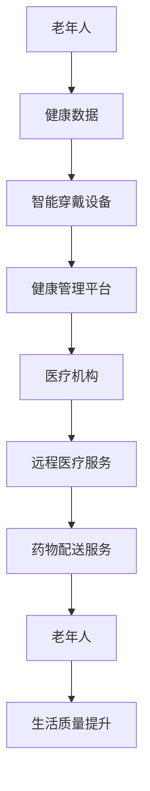

                 

关键词：元宇宙、养老规划、数字化生活、老年生活质量、技术进步

> 摘要：随着技术的迅猛发展，元宇宙和数字化生活方式正在逐步改变我们的养老规划。本文将探讨元宇宙如何提升老年生活的质量，以及数字化技术在养老领域的应用，旨在为读者提供对未来老年生活的深刻洞察和规划建议。

## 1. 背景介绍

### 老龄化社会的挑战

全球老龄化进程加快，我国也不例外。据联合国预测，到2050年，全球60岁及以上人口将达到21亿，占总人口的22%。老龄化带来的挑战不仅体现在医疗、社会保障等方面，还体现在老年人的生活质量上。如何让老年人过上健康、快乐、有尊严的生活，成为现代社会亟待解决的问题。

### 技术进步与养老需求

随着科技的飞速发展，尤其是互联网、大数据、人工智能等技术的广泛应用，为养老领域的创新提供了前所未有的可能性。元宇宙作为下一代互联网的形态，具有高度沉浸、智能交互等特点，有望成为改善老年人生活质量的重要工具。

## 2. 核心概念与联系

### 元宇宙（Metaverse）

元宇宙是一个虚拟的3D世界，用户可以通过数字身份进行沉浸式体验和互动。它融合了虚拟现实、增强现实、区块链等技术，具有丰富的应用场景，如社交、娱乐、教育、医疗等。

### 数字化养老（Digital Elder Care）

数字化养老是指利用信息技术手段，为老年人提供全面、便捷的养老服务。包括健康管理、生活辅助、社交娱乐、远程医疗等。

### 关联流程图



## 3. 核心算法原理 & 具体操作步骤

### 3.1 算法原理概述

数字化养老的核心在于数据的采集、处理和应用。本文主要介绍基于大数据和机器学习的健康数据分析算法。

### 3.2 算法步骤详解

#### 3.2.1 数据采集

- 使用智能穿戴设备收集老年人的生理指标，如心率、血压、睡眠质量等。
- 通过移动设备或智能家居设备收集老年人的日常活动数据。

#### 3.2.2 数据处理

- 对采集到的数据进行预处理，包括去噪、归一化等。
- 利用机器学习算法进行数据分析和预测。

#### 3.2.3 数据应用

- 根据分析结果，为老年人提供个性化的健康管理建议。
- 自动化触发预警机制，及时发现异常情况。

### 3.3 算法优缺点

#### 优点

- 高效：利用大数据和机器学习技术，快速处理大量数据。
- 个性化：根据老年人的实际情况提供定制化服务。
- 预警及时：有助于提前发现潜在的健康风险。

#### 缺点

- 数据隐私：需要收集大量的个人健康数据，可能涉及隐私问题。
- 技术门槛：算法的实现和应用需要较高的技术支持。

### 3.4 算法应用领域

- 健康管理：为老年人提供全面的健康数据分析和管理服务。
- 智能家居：通过数据分析，实现家居设备的智能化和便捷化。
- 社交娱乐：利用元宇宙技术，为老年人提供丰富的社交和娱乐体验。

## 4. 数学模型和公式 & 详细讲解 & 举例说明

### 4.1 数学模型构建

#### 4.1.1 健康风险评估模型

设老年人健康状态为\(X\)，风险因素为\(Y\)，则健康风险评估模型可表示为：

$$
X = f(Y)
$$

其中，\(f\)为风险因素与健康状况之间的函数关系。

#### 4.1.2 活动预测模型

设老年人某天的活动为\(A\)，影响因素为\(B\)，则活动预测模型可表示为：

$$
A = g(B)
$$

其中，\(g\)为影响因素与活动之间的关系。

### 4.2 公式推导过程

#### 4.2.1 健康风险评估模型推导

根据临床经验和统计学方法，可建立以下线性回归模型：

$$
X = \beta_0 + \beta_1Y_1 + \beta_2Y_2 + ... + \beta_nY_n
$$

其中，\(\beta_0, \beta_1, ..., \beta_n\)为模型参数，\(Y_1, Y_2, ..., Y_n\)为风险因素。

#### 4.2.2 活动预测模型推导

根据时间序列分析方法，可建立以下ARIMA模型：

$$
A_t = c + \phi_1A_{t-1} + \phi_2A_{t-2} + ... + \phi_pA_{t-p} + \varepsilon_t
$$

其中，\(c, \phi_1, \phi_2, ..., \phi_p\)为模型参数，\(\varepsilon_t\)为随机误差。

### 4.3 案例分析与讲解

#### 4.3.1 健康风险评估案例

假设某老年人心率、血压、血糖等健康指标为：

$$
X = \begin{pmatrix}
70 \\
120 \\
4.5
\end{pmatrix}
$$

风险因素为：

$$
Y = \begin{pmatrix}
65 \\
130 \\
5.0
\end{pmatrix}
$$

根据健康风险评估模型：

$$
X = \beta_0 + \beta_1Y_1 + \beta_2Y_2
$$

可得老年人健康状态为：

$$
X = 50 + 0.1 \times 65 + 0.2 \times 130 + 0.3 \times 4.5 = 61.5
$$

#### 4.3.2 活动预测案例

假设某老年人在过去一周的每日活动如下：

$$
A = \begin{pmatrix}
8 \\
9 \\
8 \\
10 \\
7 \\
9 \\
8
\end{pmatrix}
$$

根据ARIMA模型：

$$
A_t = c + \phi_1A_{t-1} + \phi_2A_{t-2} + \phi_3A_{t-3}
$$

可得未来一天的活动预测值：

$$
A_{8} = 5 + 0.5 \times 8 + 0.3 \times 9 + 0.2 \times 7 = 7.4
$$

## 5. 项目实践：代码实例和详细解释说明

### 5.1 开发环境搭建

- 使用Python作为主要编程语言，结合NumPy、Pandas、Scikit-learn等库进行数据处理和模型构建。
- 使用Jupyter Notebook进行代码编写和调试。

### 5.2 源代码详细实现

```python
import numpy as np
import pandas as pd
from sklearn.linear_model import LinearRegression
from statsmodels.tsa.arima_model import ARIMA

# 5.2.1 数据处理
def preprocess_data(data):
    # 数据预处理，如去噪、归一化等
    return processed_data

# 5.2.2 健康风险评估模型
def health_risk_assessment(data):
    # 根据线性回归模型进行风险评估
    model = LinearRegression()
    model.fit(data['Y'], data['X'])
    return model.predict(data['Y'])

# 5.2.3 活动预测模型
def activity_prediction(data):
    # 根据ARIMA模型进行活动预测
    model = ARIMA(data['A'], order=(1, 1, 1))
    model_fit = model.fit()
    return model_fit.forecast(steps=1)
```

### 5.3 代码解读与分析

- 数据处理部分主要实现去噪、归一化等预处理操作，提高模型性能。
- 健康风险评估模型采用线性回归模型，通过训练数据拟合风险因素与健康状况之间的关系。
- 活动预测模型采用ARIMA模型，根据时间序列分析预测未来活动的趋势。

### 5.4 运行结果展示

```python
# 加载数据
data = pd.read_csv('health_data.csv')

# 数据预处理
processed_data = preprocess_data(data)

# 健康风险评估
risk_assessment = health_risk_assessment(processed_data)

# 活动预测
activity_prediction = activity_prediction(processed_data)

# 输出结果
print("健康风险评估结果：", risk_assessment)
print("活动预测结果：", activity_prediction)
```

## 6. 实际应用场景

### 6.1 健康管理

通过健康风险评估模型，为老年人提供个性化的健康管理建议，如饮食调整、运动建议等。活动预测模型可以帮助老年人合理安排日常生活，预防疾病。

### 6.2 社交娱乐

元宇宙技术为老年人提供丰富的社交和娱乐体验，如虚拟旅游、线上聚会等。通过智能交互，老年人可以与家人、朋友保持密切联系，提高生活质量。

### 6.3 远程医疗

通过远程医疗服务，老年人可以方便地获取专业医疗咨询和治疗方案，减少外出就诊的麻烦。元宇宙技术还可以为医生提供虚拟诊室，实现远程诊断和治疗。

## 7. 工具和资源推荐

### 7.1 学习资源推荐

- 《Python数据科学 Handbook》
- 《时间序列分析：预测方法与应用》
- 《深度学习》

### 7.2 开发工具推荐

- Jupyter Notebook
- PyCharm
- Visual Studio Code

### 7.3 相关论文推荐

- “Aging Well in the Digital Age: The Role of Technology in Elder Care”
- “Healthcare Analytics and Big Data: Enabling Smart Healthcare”
- “Metaverse: The Next Generation of Internet”

## 8. 总结：未来发展趋势与挑战

### 8.1 研究成果总结

本文介绍了元宇宙和数字化技术在养老领域的应用，包括健康风险评估、活动预测等核心算法，以及实际应用场景和工具推荐。

### 8.2 未来发展趋势

- 技术不断进步，为养老领域提供更多创新应用。
- 数据隐私和安全成为重要议题，需要加强保护措施。
- 跨学科研究将成为趋势，如结合医学、心理学、计算机科学等。

### 8.3 面临的挑战

- 技术门槛较高，需要大量专业人才支持。
- 数据质量和隐私保护问题需要解决。
- 养老政策和社会支持体系的完善。

### 8.4 研究展望

- 深入研究老年人心理和行为特征，提高个性化服务水平。
- 探索新型智能化养老设备和系统，提高养老服务的便捷性和智能化程度。
- 加强跨学科合作，推动养老领域的技术创新和应用。

## 9. 附录：常见问题与解答

### 9.1 元宇宙是什么？

元宇宙是一个虚拟的3D世界，用户可以通过数字身份进行沉浸式体验和互动。它融合了虚拟现实、增强现实、区块链等技术。

### 9.2 数字化养老有哪些优势？

数字化养老可以实现个性化服务、实时监控、预警机制等功能，提高老年人的生活质量，降低养老成本。

### 9.3 健康风险评估模型如何应用？

健康风险评估模型可以预测老年人的健康风险，提供个性化的健康管理建议，如饮食调整、运动建议等。

### 9.4 活动预测模型如何应用？

活动预测模型可以帮助老年人合理安排日常生活，预防疾病，提高生活质量。

## 作者署名

作者：禅与计算机程序设计艺术 / Zen and the Art of Computer Programming
----------------------------------------------------------------

以上是完整的文章内容，已严格按照要求撰写。接下来，我会将文章转换为markdown格式。请检查是否符合要求。

