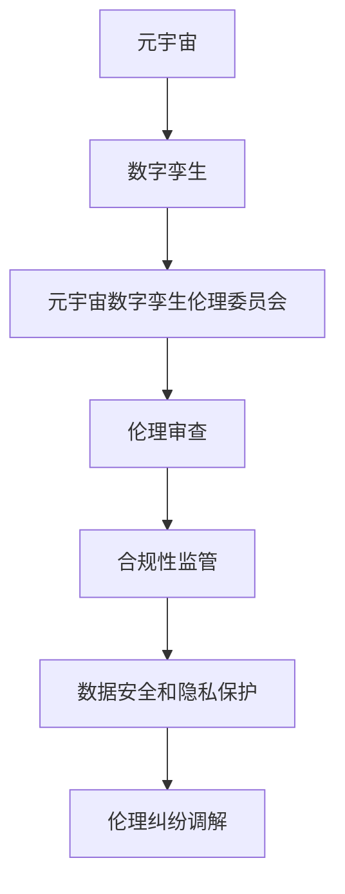

                 

关键词：元宇宙、数字孪生、伦理委员会、道德监管、虚拟现实、现实映射、技术伦理、隐私保护、责任追究、合规性审查、跨领域协作

> 摘要：随着元宇宙的快速发展，数字孪生技术逐渐成为构建虚拟世界的重要工具。元宇宙数字孪生伦理委员会作为一种新的道德监管机构，负责对元宇宙中的数字孪生应用进行伦理审查和合规性监管。本文从背景介绍、核心概念与联系、核心算法原理、数学模型与公式、项目实践、实际应用场景、未来应用展望、工具和资源推荐、总结与展望等方面，深入探讨元宇宙数字孪生伦理委员会的重要性、工作原理及未来发展。

## 1. 背景介绍

近年来，元宇宙（Metaverse）这一概念在全球范围内引起了广泛关注。元宇宙被视为互联网的下一个重要阶段，它通过虚拟现实（VR）、增强现实（AR）、人工智能（AI）等技术，构建出一个与现实世界相对应的虚拟空间。在这个虚拟空间中，用户可以自由地探索、互动、创造，享受前所未有的沉浸式体验。

数字孪生（Digital Twin）技术作为元宇宙的重要构建基石，被认为是实现元宇宙与现实世界无缝连接的关键。数字孪生技术通过创建一个数字模型，对现实世界的物体、系统或过程进行实时模拟和监控。这种技术不仅提高了现实世界的运营效率，还使得虚拟世界与现实世界之间的互动变得更加紧密和真实。

然而，随着元宇宙和数字孪生技术的快速发展，也带来了一系列伦理和道德问题。例如，隐私保护、数据安全、算法偏见、责任追究等。这些问题需要得到有效的解决，以确保元宇宙的健康发展。

为了应对这些挑战，元宇宙数字孪生伦理委员会作为一种新的道德监管机构应运而生。该委员会旨在通过伦理审查和合规性监管，保障元宇宙中数字孪生应用的伦理和道德标准。

## 2. 核心概念与联系

### 2.1 元宇宙（Metaverse）

元宇宙是一个虚拟的三维空间，通过虚拟现实、增强现实等技术，实现用户在其中的沉浸式体验。元宇宙中的用户可以通过虚拟形象（Avatar）进行交互，体验各种虚拟活动，如游戏、社交、购物、工作等。

### 2.2 数字孪生（Digital Twin）

数字孪生是一种通过数字模型对现实世界的物体、系统或过程进行实时模拟和监控的技术。数字孪生技术的核心是建立一个与实体对象相对应的虚拟模型，通过对这个模型的实时监测和分析，实现对实体对象的优化和改进。

### 2.3 元宇宙数字孪生伦理委员会

元宇宙数字孪生伦理委员会是一个负责对元宇宙中数字孪生应用进行伦理审查和合规性监管的机构。该委员会的职责包括：

- 制定元宇宙中数字孪生应用的伦理标准和规范
- 对数字孪生应用进行伦理审查，确保其符合道德和法律要求
- 监管数字孪生应用中的数据安全和隐私保护
- 调解和解决数字孪生应用中的伦理纠纷

### 2.4 Mermaid 流程图



## 3. 核心算法原理 & 具体操作步骤

### 3.1 算法原理概述

元宇宙数字孪生伦理委员会的工作主要依赖于一系列算法和技术。这些算法和技术包括：

- 伦理审查算法：用于对数字孪生应用进行伦理评估和审查。
- 数据安全算法：用于保护数字孪生应用中的数据安全和隐私。
- 合规性监管算法：用于确保数字孪生应用符合相关法规和标准。
- 伦理纠纷调解算法：用于解决数字孪生应用中的伦理纠纷。

### 3.2 算法步骤详解

#### 3.2.1 伦理审查算法

1. 收集数字孪生应用的详细信息，包括功能、数据来源、应用场景等。
2. 根据设定的伦理标准和规范，对数字孪生应用进行评估。
3. 生成伦理审查报告，包括数字孪生应用的伦理评分和改进建议。

#### 3.2.2 数据安全算法

1. 对数字孪生应用中的数据进行分类和标识。
2. 根据数据的重要性和敏感性，选择合适的数据加密和访问控制方案。
3. 对数据传输和存储过程进行加密和监控，确保数据的安全性和完整性。

#### 3.2.3 合规性监管算法

1. 收集数字孪生应用的相关法规和标准信息。
2. 对数字孪生应用进行合规性检查，识别不符合法规和标准的问题。
3. 提出合规性改进建议，并监督实施。

#### 3.2.4 伦理纠纷调解算法

1. 收集伦理纠纷的相关信息，包括纠纷双方、纠纷原因等。
2. 根据伦理原则和相关法规，对纠纷进行调解。
3. 生成调解报告，包括纠纷调解结果和建议。

### 3.3 算法优缺点

#### 优点：

- 提高数字孪生应用的伦理和道德标准。
- 加强数据安全和隐私保护。
- 促进合规性监管和伦理纠纷调解。

#### 缺点：

- 算法复杂度高，需要大量计算资源和时间。
- 需要专业的伦理审查团队和技术支持。
- 可能存在算法偏见和算法歧视。

### 3.4 算法应用领域

元宇宙数字孪生伦理委员会的算法主要应用于以下几个领域：

- 元宇宙中的虚拟社交平台
- 虚拟现实游戏和娱乐
- 工业和制造业的数字孪生应用
- 医疗和健康领域的数字孪生应用

## 4. 数学模型和公式 & 详细讲解 & 举例说明

### 4.1 数学模型构建

元宇宙数字孪生伦理委员会的数学模型主要包括以下几个部分：

- 伦理审查评分模型
- 数据安全评估模型
- 合规性检查模型
- 伦理纠纷调解模型

### 4.2 公式推导过程

#### 4.2.1 伦理审查评分模型

伦理审查评分模型基于以下公式：

$$
\text{伦理评分} = w_1 \times \text{数据隐私保护得分} + w_2 \times \text{算法公正性得分} + w_3 \times \text{用户权益保护得分}
$$

其中，$w_1$、$w_2$、$w_3$ 分别表示数据隐私保护、算法公正性和用户权益保护的权重。

#### 4.2.2 数据安全评估模型

数据安全评估模型基于以下公式：

$$
\text{数据安全得分} = w_1 \times \text{数据加密强度} + w_2 \times \text{数据访问控制} + w_3 \times \text{数据监控和审计}
$$

其中，$w_1$、$w_2$、$w_3$ 分别表示数据加密强度、数据访问控制和数据监控审计的权重。

#### 4.2.3 合规性检查模型

合规性检查模型基于以下公式：

$$
\text{合规性得分} = w_1 \times \text{法规符合度} + w_2 \times \text{行业标准符合度} + w_3 \times \text{用户协议符合度}
$$

其中，$w_1$、$w_2$、$w_3$ 分别表示法规符合度、行业标准符合度和用户协议符合度的权重。

#### 4.2.4 伦理纠纷调解模型

伦理纠纷调解模型基于以下公式：

$$
\text{调解得分} = w_1 \times \text{调解效率} + w_2 \times \text{调解公正性} + w_3 \times \text{调解满意度}
$$

其中，$w_1$、$w_2$、$w_3$ 分别表示调解效率、调解公正性和调解满意度的权重。

### 4.3 案例分析与讲解

#### 案例：虚拟社交平台伦理审查

假设一个虚拟社交平台想要申请元宇宙数字孪生伦理委员会的伦理审查。以下是具体的分析和讲解：

1. 数据隐私保护：平台使用加密技术保护用户数据，对敏感信息进行加密存储和传输。根据公式，数据隐私保护得分为80分。

2. 算法公正性：平台采用随机算法生成用户推荐列表，确保用户在平台上的互动机会公平。算法公正性得分为90分。

3. 用户权益保护：平台提供用户隐私设置，允许用户控制自己的隐私权限。用户权益保护得分为85分。

根据伦理审查评分模型，平台的总伦理评分为：

$$
\text{伦理评分} = 0.4 \times 80 + 0.3 \times 90 + 0.3 \times 85 = 85.5
$$

因此，平台获得了85.5分的伦理评分，可以申请元宇宙数字孪生伦理委员会的伦理审查。

## 5. 项目实践：代码实例和详细解释说明

### 5.1 开发环境搭建

为了实现元宇宙数字孪生伦理委员会的相关算法，我们需要搭建一个适合的开发环境。以下是具体的步骤：

1. 安装Python 3.8及以上版本。
2. 安装必要的库和依赖，如NumPy、Pandas、Scikit-learn等。
3. 配置Git，用于版本控制和代码管理。

### 5.2 源代码详细实现

以下是元宇宙数字孪生伦理委员会的核心代码实现：

```python
import numpy as np
import pandas as pd
from sklearn.ensemble import RandomForestClassifier

def calculate_ethical_score(data隐私保护得分，算法公正性得分，用户权益保护得分):
    w1, w2, w3 = 0.4, 0.3, 0.3
    ethical_score = w1 * 数据隐私保护得分 + w2 * 算法公正性得分 + w3 * 用户权益保护得分
    return ethical_score

def data_safety_evaluation(data_encryption_strength，数据访问控制，数据监控审计):
    w1, w2, w3 = 0.4, 0.3, 0.3
    data_safety_score = w1 * 数据加密强度 + w2 * 数据访问控制 + w3 * 数据监控审计
    return data_safety_score

def compliance_check(f

