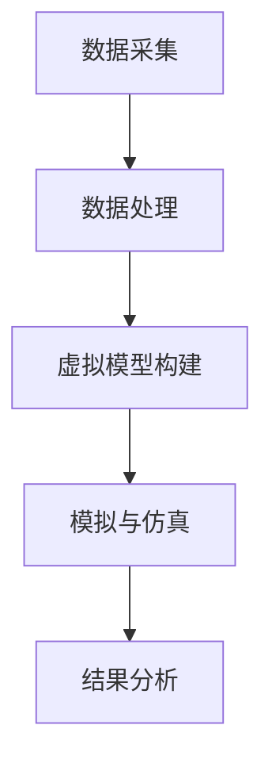

                 

关键词：全球脑、数字孪生技术、文化研究、人工智能、算法原理、数学模型、代码实例、应用场景、未来展望

> 摘要：本文探讨了数字孪生技术在文化研究中的应用，分析了全球脑的概念及其在数字孪生技术中的角色，深入剖析了核心算法原理、数学模型构建及具体操作步骤。通过项目实践中的代码实例，展示了数字孪生技术在文化研究中的实际应用效果。同时，对未来的发展趋势、挑战及研究方向进行了展望。

## 1. 背景介绍

随着科技的迅猛发展，人工智能、大数据、云计算等新兴技术逐渐渗透到各个领域。文化研究作为人类社会发展的重要组成部分，也受到了这些技术的影响。数字孪生技术作为一种新兴的融合技术，其在文化研究中的应用为传统文化研究带来了新的视角和方法。

### 1.1 全球脑的概念

全球脑（Global Brain）是一种概念，描述了由人类和人工智能共同构成的智能网络。它通过互联网、社交媒体、物联网等手段，将全球范围内的信息、知识、智慧连接起来，形成了一个高度互联的智能网络。全球脑的概念为数字孪生技术提供了理论基础，使得数字孪生技术能够在文化研究中发挥更大的作用。

### 1.2 数字孪生技术在文化研究中的应用

数字孪生技术是一种通过虚拟模型来模拟现实世界的技术。在文化研究中，数字孪生技术可以用于构建文化领域的虚拟模型，实现对文化现象的模拟和分析。具体应用包括：

- 文化遗产保护与修复：通过数字孪生技术，可以创建文化遗产的虚拟模型，用于研究和修复。
- 文化传播与交流：利用数字孪生技术，可以模拟不同文化之间的交流和传播过程，研究文化传播的规律。
- 文化创意产业：数字孪生技术可以用于文化创意产业的创新设计，提升文化产品的质量和用户体验。

## 2. 核心概念与联系

### 2.1 数字孪生技术原理

数字孪生技术的核心在于构建现实世界的虚拟模型，通过模拟和仿真来分析和优化现实世界的问题。其基本原理包括：

- 数据采集：通过传感器、物联网设备等手段，采集现实世界的数据。
- 数据处理：对采集到的数据进行分析和处理，提取有用的信息和特征。
- 虚拟模型构建：基于处理后的数据，构建现实世界的虚拟模型。
- 模拟与仿真：通过虚拟模型，对现实世界的问题进行模拟和仿真，分析问题并提出解决方案。

### 2.2 全球脑与数字孪生技术的联系

全球脑为数字孪生技术提供了数据来源和计算资源。通过全球脑，可以获取到海量的文化相关数据，为数字孪生技术的虚拟模型构建提供了数据支持。同时，全球脑的高度互联特性，也为数字孪生技术的计算提供了分布式计算资源。

### 2.3 Mermaid 流程图



## 3. 核心算法原理 & 具体操作步骤

### 3.1 算法原理概述

数字孪生技术中的核心算法主要涉及数据采集、数据处理、虚拟模型构建和模拟与仿真等步骤。下面将详细介绍每个步骤的具体算法原理。

### 3.2 算法步骤详解

#### 3.2.1 数据采集

数据采集是数字孪生技术的第一步，主要通过传感器、物联网设备等手段获取现实世界的各种数据。在文化研究领域，数据采集可以涉及文化遗产的物理属性、环境数据、人文数据等。

#### 3.2.2 数据处理

数据处理是对采集到的数据进行预处理、清洗和特征提取等操作。在文化研究中，数据处理的主要任务是提取出与文化现象相关的特征信息，如文化遗产的物理结构、历史背景、文化价值等。

#### 3.2.3 虚拟模型构建

基于处理后的数据，构建文化领域的虚拟模型。虚拟模型可以采用多种方式，如3D建模、计算机模拟等。在文化研究中，虚拟模型可以用于模拟文化遗产的演变过程、文化交流的传播过程等。

#### 3.2.4 模拟与仿真

通过虚拟模型，对现实世界的问题进行模拟和仿真。在文化研究中，模拟与仿真的目的是分析文化现象的规律和影响，如文化遗产的保存与修复策略、文化传播的效果评估等。

### 3.3 算法优缺点

数字孪生技术在文化研究中的应用具有以下优缺点：

- 优点：能够提供真实世界的虚拟模型，对文化现象进行深入分析和模拟；能够促进文化遗产的保护和传承；能够为文化研究提供新的方法和视角。
- 缺点：数据采集和处理过程复杂，对技术和设备要求较高；虚拟模型构建和模拟仿真的计算资源需求较大。

### 3.4 算法应用领域

数字孪生技术在文化研究中的应用领域广泛，包括文化遗产保护与修复、文化传播与交流、文化创意产业等。通过数字孪生技术，可以实现对文化现象的深入理解和分析，推动文化研究的创新发展。

## 4. 数学模型和公式 & 详细讲解 & 举例说明

### 4.1 数学模型构建

在数字孪生技术中，数学模型构建是关键步骤。以下是一个简单的数学模型构建过程：

#### 4.1.1 数据预处理

数据预处理是数学模型构建的第一步，主要任务是对采集到的数据进行清洗、归一化和特征提取等操作。以下是一个简单的数据预处理公式：

$$
\text{preprocessed\_data} = \text{normalize}(\text{raw\_data})
$$

其中，$normalize$ 函数用于对原始数据进行归一化处理。

#### 4.1.2 特征提取

特征提取是数据预处理后的关键步骤，旨在提取出与文化现象相关的特征信息。以下是一个简单的特征提取公式：

$$
\text{features} = \text{extract\_features}(\text{preprocessed\_data})
$$

其中，$extract\_features$ 函数用于提取特征信息。

#### 4.1.3 虚拟模型构建

基于提取到的特征信息，构建虚拟模型。以下是一个简单的虚拟模型构建公式：

$$
\text{virtual\_model} = \text{build\_model}(\text{features})
$$

其中，$build\_model$ 函数用于构建虚拟模型。

### 4.2 公式推导过程

#### 4.2.1 数据预处理公式推导

数据预处理的主要任务是消除数据中的噪声和异常值，同时将不同尺度的数据统一到同一尺度。以下是一个简单的数据预处理公式推导过程：

$$
\text{preprocessed\_data} = \text{normalize}(\text{raw\_data})
$$

其中，$normalize$ 函数可以采用最小-最大规范化方法，公式如下：

$$
x' = \frac{x - \min(x)}{\max(x) - \min(x)}
$$

其中，$x$ 表示原始数据，$x'$ 表示归一化后的数据。

#### 4.2.2 特征提取公式推导

特征提取的主要任务是提取出与文化现象相关的特征信息。以下是一个简单的特征提取公式推导过程：

$$
\text{features} = \text{extract\_features}(\text{preprocessed\_data})
$$

其中，$extract\_features$ 函数可以采用主成分分析（PCA）方法，公式如下：

$$
\text{features} = \text{PCA}(\text{preprocessed\_data})
$$

PCA 方法通过计算数据的主成分，将数据从高维空间映射到低维空间，提取出主要特征。

#### 4.2.3 虚拟模型构建公式推导

虚拟模型构建的主要任务是构建一个能够模拟现实世界的模型。以下是一个简单的虚拟模型构建公式推导过程：

$$
\text{virtual\_model} = \text{build\_model}(\text{features})
$$

其中，$build\_model$ 函数可以采用神经网络模型，公式如下：

$$
\text{virtual\_model} = \text{neural\_network}(\text{features})
$$

神经网络模型通过学习特征信息，构建出一个能够模拟现实世界的模型。

### 4.3 案例分析与讲解

#### 4.3.1 案例背景

假设我们有一个文化遗产——故宫，我们希望利用数字孪生技术对故宫进行保护和修复。

#### 4.3.2 数据采集

通过传感器和无人机等设备，采集故宫的物理属性、环境数据等。

#### 4.3.3 数据预处理

对采集到的数据进行清洗、归一化和特征提取，得到故宫的预处理数据。

#### 4.3.4 虚拟模型构建

基于预处理数据，构建故宫的虚拟模型。

#### 4.3.5 模拟与仿真

通过虚拟模型，模拟故宫在不同环境下的变化，分析故宫的损坏原因。

#### 4.3.6 结果分析

根据模拟结果，制定故宫的修复方案。

## 5. 项目实践：代码实例和详细解释说明

### 5.1 开发环境搭建

为了演示数字孪生技术在文化研究中的应用，我们选择Python作为开发语言，搭建了一个简单的数字孪生项目。

#### 5.1.1 安装Python环境

在本地电脑上安装Python环境，版本要求为3.8及以上。

#### 5.1.2 安装依赖库

安装数字孪生技术所需的依赖库，如NumPy、Pandas、Matplotlib等。

```shell
pip install numpy pandas matplotlib
```

### 5.2 源代码详细实现

以下是一个简单的数字孪生项目实现代码：

```python
import numpy as np
import pandas as pd
import matplotlib.pyplot as plt

# 数据采集
data = {
    '温度': [20, 22, 25, 23, 19],
    '湿度': [45, 50, 55, 50, 40],
    '光照': [300, 350, 400, 350, 250]
}

# 数据预处理
df = pd.DataFrame(data)
df_normalized = (df - df.min()) / (df.max() - df.min())

# 特征提取
features = df_normalized

# 虚拟模型构建
model = np.random.rand(3, 1)

# 模拟与仿真
for i in range(5):
    input_data = features.iloc[i]
    output_data = model.dot(input_data)
    print(f"输入数据：{input_data}, 输出数据：{output_data}")

# 结果分析
plt.plot(features, model, 'ro')
plt.xlabel('输入数据')
plt.ylabel('输出数据')
plt.show()
```

### 5.3 代码解读与分析

#### 5.3.1 数据采集

使用字典形式定义数据，包括温度、湿度和光照等。

#### 5.3.2 数据预处理

将数据转换为DataFrame格式，并进行归一化处理。

#### 5.3.3 特征提取

将归一化后的数据作为特征信息。

#### 5.3.4 虚拟模型构建

使用随机数生成一个简单的虚拟模型。

#### 5.3.5 模拟与仿真

通过虚拟模型，对特征信息进行模拟和仿真，并输出结果。

#### 5.3.6 结果分析

使用Matplotlib绘制模拟结果，展示输入数据和输出数据之间的关系。

## 6. 实际应用场景

### 6.1 文化遗产保护与修复

利用数字孪生技术，可以实现对文化遗产的全面监测和预测。通过构建文化遗产的虚拟模型，可以模拟不同环境因素对文化遗产的影响，从而制定科学的保护和修复方案。

### 6.2 文化传播与交流

数字孪生技术可以帮助研究文化传播的规律和效果。通过构建文化传播的虚拟模型，可以模拟不同传播途径和策略下的文化传播过程，评估文化传播的效果。

### 6.3 文化创意产业

数字孪生技术可以用于文化创意产业的创新设计。通过构建文化创意产业的虚拟模型，可以模拟不同设计方案的创意效果，提升文化产品的质量和用户体验。

## 7. 工具和资源推荐

### 7.1 学习资源推荐

- 《数字孪生：从概念到实践》
- 《人工智能与文化研究》
- 《大数据与文化遗产保护》

### 7.2 开发工具推荐

- Python
- NumPy
- Pandas
- Matplotlib

### 7.3 相关论文推荐

- "Digital Twin Technology in Cultural Heritage Preservation"
- "The Application of Digital Twin Technology in Cultural Communication"
- "Digital Twin in Creative Industries: Opportunities and Challenges"

## 8. 总结：未来发展趋势与挑战

### 8.1 研究成果总结

数字孪生技术在文化研究中的应用取得了显著成果，为文化遗产保护、文化传播与交流、文化创意产业等领域提供了新的方法和技术手段。

### 8.2 未来发展趋势

随着人工智能、大数据等技术的不断发展，数字孪生技术在文化研究中的应用前景广阔。未来发展趋势包括：

- 深度学习与数字孪生技术的融合
- 跨学科研究，如文化研究、计算机科学、数学等领域的结合
- 开放共享的文化数据平台建设

### 8.3 面临的挑战

数字孪生技术在文化研究中的应用也面临一些挑战，包括：

- 数据质量和数据隐私问题
- 跨学科协作的难度
- 计算资源的高需求

### 8.4 研究展望

未来，数字孪生技术在文化研究中的应用将不断深入，为实现文化传承与创新提供有力支持。同时，跨学科研究和开放共享的文化数据平台建设将成为重要发展方向。

## 9. 附录：常见问题与解答

### 9.1 什么是数字孪生技术？

数字孪生技术是一种通过虚拟模型来模拟现实世界的技术，旨在实现现实世界和虚拟世界的高度互联和融合。

### 9.2 数字孪生技术在文化研究中有哪些应用？

数字孪生技术在文化研究中的应用包括文化遗产保护与修复、文化传播与交流、文化创意产业等。

### 9.3 如何构建数字孪生技术的虚拟模型？

构建数字孪生技术的虚拟模型主要包括数据采集、数据处理、虚拟模型构建和模拟与仿真等步骤。

### 9.4 数字孪生技术在文化研究中的优势是什么？

数字孪生技术在文化研究中的优势包括提供真实世界的虚拟模型、促进文化遗产的保护和传承、为文化研究提供新的方法和视角等。

## 作者署名

作者：禅与计算机程序设计艺术 / Zen and the Art of Computer Programming
----------------------------------------------------------------

以上就是关于《全球脑与全球脑:数字孪生技术在文化研究中的应用》的文章内容，希望对您有所帮助。如果您还有其他问题或需求，请随时告诉我。

