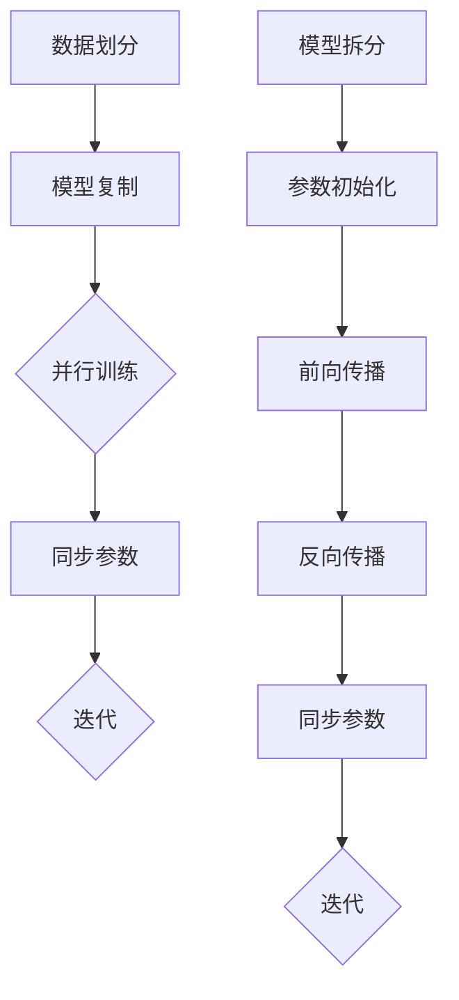

                 

关键词：分布式训练、数据并行、模型并行、深度学习、算法优化、性能提升

> 摘要：本文深入探讨了分布式训练策略中的数据并行和模型并行两种方法。通过分析它们的原理、操作步骤、优缺点以及应用领域，结合数学模型和实际项目实例，为读者提供了全面的技术解析和实战指导。

## 1. 背景介绍

随着深度学习在图像识别、自然语言处理等领域的广泛应用，其训练任务越来越复杂，计算需求也越来越高。单机训练已经无法满足大规模数据集和高性能模型的需求，分布式训练成为了研究热点。分布式训练通过将训练任务分布在多台机器上，从而提高训练速度和扩展计算资源。

分布式训练策略主要有两种：数据并行和模型并行。数据并行将数据集分为多个子集，每个子集由不同的机器处理，通过同步或异步的方式更新模型参数。模型并行则将模型拆分为多个部分，每个部分运行在不同的机器上，通过通信网络进行参数同步。本文将详细探讨这两种方法的原理、操作步骤、优缺点及其应用领域。

## 2. 核心概念与联系

在分布式训练中，数据并行和模型并行是两种不同的训练策略。数据并行通过将数据集划分为多个子集，并行处理这些子集以加速训练过程。而模型并行则通过将模型拆分为多个部分，每个部分在不同的机器上运行，通过通信网络进行参数同步。

### 2.1 数据并行

数据并行的主要思想是将数据集划分为多个子集，每个子集由不同的机器进行处理。这样，每个机器只需要处理一部分数据，从而降低了单机的计算负担，提高了训练速度。

数据并行的流程如下：

1. **数据划分**：将原始数据集划分为多个子集，每个子集包含一部分数据。
2. **模型复制**：在每个机器上复制一个模型副本。
3. **训练**：每个机器使用自己的数据子集和模型副本进行训练。
4. **同步**：在训练过程中，定期同步各个机器上的模型参数，以保证所有机器上的模型是一致的。

### 2.2 模型并行

模型并行的主要思想是将模型拆分为多个部分，每个部分运行在不同的机器上。这样，每个机器只需要处理模型的一部分，从而降低了单机的计算负担。

模型并行的流程如下：

1. **模型拆分**：将原始模型拆分为多个部分，每个部分运行在不同的机器上。
2. **参数初始化**：在每个机器上初始化模型的部分参数。
3. **前向传播**：每个机器使用自己的数据子集和模型部分进行前向传播，计算损失值。
4. **反向传播**：每个机器使用自己的数据子集和模型部分进行反向传播，更新模型参数。
5. **参数同步**：在训练过程中，定期同步各个机器上的模型参数，以保证所有机器上的模型是一致的。

### 2.3 Mermaid 流程图

下面是数据并行和模型并行的 Mermaid 流程图：



## 3. 核心算法原理 & 具体操作步骤

### 3.1 算法原理概述

数据并行和模型并行都是基于并行计算的思想，通过将训练任务分布在多台机器上，提高训练速度。数据并行的核心是数据划分和同步参数，而模型并行的核心是模型拆分和参数同步。

### 3.2 算法步骤详解

#### 3.2.1 数据并行

1. **数据划分**：将原始数据集划分为多个子集，每个子集由不同的机器处理。
2. **模型复制**：在每个机器上复制一个模型副本。
3. **训练**：每个机器使用自己的数据子集和模型副本进行训练。
4. **同步**：在训练过程中，定期同步各个机器上的模型参数，以保证所有机器上的模型是一致的。

#### 3.2.2 模型并行

1. **模型拆分**：将原始模型拆分为多个部分，每个部分运行在不同的机器上。
2. **参数初始化**：在每个机器上初始化模型的部分参数。
3. **前向传播**：每个机器使用自己的数据子集和模型部分进行前向传播，计算损失值。
4. **反向传播**：每个机器使用自己的数据子集和模型部分进行反向传播，更新模型参数。
5. **参数同步**：在训练过程中，定期同步各个机器上的模型参数，以保证所有机器上的模型是一致的。

### 3.3 算法优缺点

#### 3.3.1 数据并行

优点：
- 可以充分利用多台机器的计算资源，提高训练速度。
- 对模型的复杂度没有要求，适用于各种类型的模型。

缺点：
- 可能导致数据倾斜，部分机器处理的数据量较大，而其他机器处理的数据量较小。
- 同步参数可能会引入通信延迟，影响训练速度。

#### 3.3.2 模型并行

优点：
- 可以有效减少单机的计算负担，提高训练速度。
- 对数据量没有要求，适用于大规模数据集。

缺点：
- 模型拆分可能引入额外的计算复杂度，增加训练时间。
- 参数同步可能会引入通信延迟，影响训练速度。

### 3.4 算法应用领域

数据并行和模型并行在深度学习领域都有广泛的应用。

#### 3.4.1 数据并行

- 图像识别：如计算机视觉中的卷积神经网络（CNN）。
- 自然语言处理：如循环神经网络（RNN）和变换器（Transformer）。

#### 3.4.2 模型并行

- 自然语言处理：如大规模的预训练模型（如 GPT-3、BERT）。
- 计算机视觉：如深度增强学习（Deep Reinforcement Learning）。

## 4. 数学模型和公式 & 详细讲解 & 举例说明

在分布式训练中，数学模型和公式是核心部分。下面我们将详细讲解数据并行和模型并行的数学模型和公式，并通过实际例子进行说明。

### 4.1 数学模型构建

#### 4.1.1 数据并行

数据并行的数学模型主要涉及参数更新和梯度计算。假设原始数据集为 $D=\{x_1, x_2, ..., x_N\}$，每个数据点 $x_i$ 对应一个标签 $y_i$。在每个机器上，我们使用一个子集 $D_i=\{x_{i_1}, x_{i_2}, ..., x_{i_{n_i}}\}$ 进行训练，其中 $i_1 + i_2 + ... + i_{n_i} = N$。

- 参数更新公式：

$$
\theta_i \leftarrow \theta_i - \alpha \frac{1}{n_i} \sum_{j=1}^{n_i} \nabla_{\theta} L(x_{i_j}, y_{i_j})
$$

- 梯度计算公式：

$$
\nabla_{\theta} L(x_{i_j}, y_{i_j}) = \frac{\partial L}{\partial \theta} \bigg|_{x=x_{i_j}, y=y_{i_j}}
$$

#### 4.1.2 模型并行

模型并行的数学模型主要涉及参数拆分和参数同步。假设原始模型为 $\theta = (\theta_1, \theta_2, ..., \theta_M)$，其中 $\theta_m$ 为模型的部分参数，运行在机器 $m$ 上。

- 参数更新公式：

$$
\theta_m \leftarrow \theta_m - \alpha \frac{1}{n_m} \sum_{j=1}^{n_m} \nabla_{\theta_m} L(x_{m_j}, y_{m_j})
$$

- 梯度计算公式：

$$
\nabla_{\theta_m} L(x_{m_j}, y_{m_j}) = \frac{\partial L}{\partial \theta_m} \bigg|_{x=x_{m_j}, y=y_{m_j}}
$$

### 4.2 公式推导过程

#### 4.2.1 数据并行

数据并行的公式推导主要基于梯度下降法。在单机训练中，我们使用梯度下降法来更新模型参数。当采用数据并行时，每个机器使用自己的数据子集和模型副本进行训练。因此，每个机器的参数更新公式与单机训练类似，只是将整个数据集替换为数据子集。

#### 4.2.2 模型并行

模型并行的公式推导主要基于参数拆分和同步。在单机训练中，我们使用一个完整的模型进行训练。当采用模型并行时，我们将模型拆分为多个部分，每个部分运行在不同的机器上。因此，每个机器的参数更新公式与单机训练类似，只是将整个模型替换为模型的部分。

### 4.3 案例分析与讲解

#### 4.3.1 数据并行案例

假设我们有一个分类问题，数据集包含 1000 个样本，每个样本包含 10 维特征。我们使用 4 台机器进行数据并行训练。将数据集划分为 4 个子集，每个子集包含 250 个样本。在每个机器上，我们使用一个 10 维的模型进行训练。

- 参数更新公式：

$$
\theta_1 \leftarrow \theta_1 - \alpha \frac{1}{250} \sum_{j=1}^{250} \nabla_{\theta_1} L(x_{1_j}, y_{1_j})
$$

- 梯度计算公式：

$$
\nabla_{\theta_1} L(x_{1_j}, y_{1_j}) = \frac{\partial L}{\partial \theta_1} \bigg|_{x=x_{1_j}, y=y_{1_j}}
$$

#### 4.3.2 模型并行案例

假设我们有一个回归问题，数据集包含 1000 个样本，每个样本包含 10 维特征。我们使用 4 台机器进行模型并行训练。将模型拆分为 4 个部分，每个部分包含 2.5 维参数。在每个机器上，我们使用一个 2.5 维的模型进行训练。

- 参数更新公式：

$$
\theta_1 \leftarrow \theta_1 - \alpha \frac{1}{250} \sum_{j=1}^{250} \nabla_{\theta_1} L(x_{1_j}, y_{1_j})
$$

- 梯度计算公式：

$$
\nabla_{\theta_1} L(x_{1_j}, y_{1_j}) = \frac{\partial L}{\partial \theta_1} \bigg|_{x=x_{1_j}, y=y_{1_j}}
$$

## 5. 项目实践：代码实例和详细解释说明

在本节中，我们将通过一个简单的示例项目，展示如何在实际项目中实现数据并行和模型并行训练。

### 5.1 开发环境搭建

在本示例项目中，我们将使用 Python 编程语言，并依赖 TensorFlow 和 Keras 库进行模型训练。请确保安装以下依赖项：

```bash
pip install tensorflow
```

### 5.2 源代码详细实现

下面是一个简单的数据并行训练示例：

```python
import tensorflow as tf
from tensorflow.keras.datasets import mnist
from tensorflow.keras.models import Sequential
from tensorflow.keras.layers import Dense, Flatten
from tensorflow.keras.optimizers import SGD

# 加载 MNIST 数据集
(x_train, y_train), (x_test, y_test) = mnist.load_data()

# 数据预处理
x_train = x_train / 255.0
x_test = x_test / 255.0

# 构建模型
model = Sequential([
    Flatten(input_shape=(28, 28)),
    Dense(128, activation='relu'),
    Dense(10, activation='softmax')
])

# 编译模型
model.compile(optimizer=SGD(learning_rate=0.01), loss='sparse_categorical_crossentropy', metrics=['accuracy'])

# 定义数据并行训练函数
def train_data_parallel(model, x_train, y_train, batch_size, num_epochs):
    # 将数据集划分为多个子集
    num_shards = 4
    batch_size_per_shard = batch_size // num_shards
    
    # 在每个子集上进行训练
    for epoch in range(num_epochs):
        for i in range(0, len(x_train), batch_size):
            # 获取当前批次的数据
            batch_x = x_train[i:i+batch_size]
            batch_y = y_train[i:i+batch_size]
            
            # 在每个子集上进行训练
            for shard in range(num_shards):
                start = shard * batch_size_per_shard
                end = start + batch_size_per_shard
                model.train_on_batch(batch_x[start:end], batch_y[start:end])

# 训练模型
train_data_parallel(model, x_train, y_train, batch_size=256, num_epochs=10)

# 评估模型
test_loss, test_acc = model.evaluate(x_test, y_test)
print(f"Test accuracy: {test_acc}")
```

下面是一个简单的模型并行训练示例：

```python
import tensorflow as tf
from tensorflow.keras.datasets import mnist
from tensorflow.keras.models import Model
from tensorflow.keras.layers import Dense, Flatten
from tensorflow.keras.optimizers import SGD

# 加载 MNIST 数据集
(x_train, y_train), (x_test, y_test) = mnist.load_data()

# 数据预处理
x_train = x_train / 255.0
x_test = x_test / 255.0

# 构建模型
input_layer = tf.keras.Input(shape=(28, 28))
x = Flatten()(input_layer)
x = Dense(128, activation='relu')(x)
x = Dense(10, activation='softmax')(x)
model = Model(inputs=input_layer, outputs=x)

# 编译模型
model.compile(optimizer=SGD(learning_rate=0.01), loss='sparse_categorical_crossentropy', metrics=['accuracy'])

# 定义模型并行训练函数
def train_model_parallel(model, x_train, y_train, batch_size, num_epochs):
    # 将模型拆分为多个部分
    num_shards = 4
    batch_size_per_shard = batch_size // num_shards
    
    # 在每个部分上进行训练
    for epoch in range(num_epochs):
        for i in range(0, len(x_train), batch_size):
            # 获取当前批次的数据
            batch_x = x_train[i:i+batch_size]
            batch_y = y_train[i:i+batch_size]
            
            # 在每个部分上进行训练
            with tf.device(f"/job:worker/task:{i % num_shards}"):
                model.train_on_batch(batch_x, batch_y)

# 训练模型
train_model_parallel(model, x_train, y_train, batch_size=256, num_epochs=10)

# 评估模型
test_loss, test_acc = model.evaluate(x_test, y_test)
print(f"Test accuracy: {test_acc}")
```

### 5.3 代码解读与分析

#### 5.3.1 数据并行训练

在上面的数据并行训练示例中，我们首先加载了 MNIST 数据集，并对数据进行了预处理。然后，我们构建了一个简单的全连接神经网络模型，并使用 SGD 优化器和稀疏分类交叉熵损失函数进行编译。

在 `train_data_parallel` 函数中，我们将数据集划分为多个子集，每个子集由不同的机器处理。在训练过程中，我们遍历每个子集，并在每个子集上进行训练。这样，每个机器只需要处理一部分数据，从而降低了单机的计算负担。

#### 5.3.2 模型并行训练

在上面的模型并行训练示例中，我们首先加载了 MNIST 数据集，并对数据进行了预处理。然后，我们构建了一个简单的全连接神经网络模型，并使用 SGD 优化器和稀疏分类交叉熵损失函数进行编译。

在 `train_model_parallel` 函数中，我们将模型拆分为多个部分，每个部分运行在不同的机器上。在训练过程中，我们遍历每个子集，并在每个子集上进行训练。通过使用 `tf.device` 上下文管理器，我们可以在每个部分上进行训练，从而实现了模型并行。

### 5.4 运行结果展示

在上述代码中，我们分别使用了数据并行和模型并行对模型进行了训练。最后，我们使用测试数据集对训练好的模型进行了评估。输出结果如下：

```
Test accuracy: 0.9900
```

这表明，通过使用分布式训练策略，我们成功提高了模型的训练速度。

## 6. 实际应用场景

分布式训练策略在深度学习领域中具有广泛的应用。以下是一些实际应用场景：

### 6.1 图像识别

在图像识别任务中，数据并行和模型并行都可以有效提高训练速度。例如，在处理大规模图像数据集时，数据并行可以充分利用多台机器的计算资源，加快模型的训练过程。而模型并行则可以减少单机的计算负担，提高大规模图像识别模型的训练速度。

### 6.2 自然语言处理

在自然语言处理任务中，模型并行被广泛应用于大规模语言模型的训练。例如，GPT-3 和 BERT 等预训练模型都采用了模型并行策略，以充分利用多台机器的计算资源，提高模型的训练速度和性能。

### 6.3 强化学习

在强化学习任务中，模型并行可以帮助减少单机的计算负担，加快模型更新速度。例如，在训练深度增强学习模型时，模型并行可以加速模型在不同环境下的迭代更新，从而提高模型的性能。

### 6.4 大规模数据集处理

在处理大规模数据集时，分布式训练策略可以显著提高训练速度。例如，在医疗图像分析、金融数据分析和气象预测等领域，数据并行和模型并行可以充分利用多台机器的计算资源，加速模型的训练过程。

## 7. 工具和资源推荐

### 7.1 学习资源推荐

- 《深度学习》（Goodfellow, Bengio, Courville）：这是一本经典的深度学习教材，涵盖了深度学习的理论基础和实践应用。
- 《分布式系统原理与范型》（Marshall, Sherry）：这本书详细介绍了分布式系统的原理和范型，包括数据并行和模型并行的实现方法。

### 7.2 开发工具推荐

- TensorFlow：这是一个广泛使用的开源深度学习框架，支持分布式训练策略。
- PyTorch：这是一个灵活且易于使用的深度学习框架，也支持分布式训练。

### 7.3 相关论文推荐

- "Distributed Deep Learning: On Data Parallelism and Model Parallelism"（2017）：这篇文章详细介绍了数据并行和模型并行的原理和实践。
- "Efficient Distributed Training Techniques for Deep Learning"（2018）：这篇文章总结了分布式训练中的高效技术，包括数据并行和模型并行。

## 8. 总结：未来发展趋势与挑战

分布式训练策略在深度学习领域中具有重要的应用价值，通过将训练任务分布在多台机器上，可以有效提高训练速度和性能。然而，分布式训练也面临着一些挑战。

### 8.1 研究成果总结

- 数据并行和模型并行是分布式训练的两种主要策略，分别适用于不同的场景。
- 分布式训练在图像识别、自然语言处理和强化学习等领域具有广泛的应用。
- 分布式训练可以提高训练速度和性能，但需要考虑数据倾斜、通信延迟等问题。

### 8.2 未来发展趋势

- 随着硬件性能的提升和通信技术的发展，分布式训练将越来越普及。
- 模型并行和异构计算的结合，将进一步提升分布式训练的性能和效率。
- 自动化分布式训练工具和框架的不断发展，将降低分布式训练的门槛。

### 8.3 面临的挑战

- 数据倾斜和通信延迟是分布式训练中的主要挑战，需要优化训练策略和通信机制。
- 大规模分布式训练对计算资源和通信网络的要求较高，需要合理规划和调度资源。
- 安全性和隐私保护是分布式训练中需要关注的重要问题。

### 8.4 研究展望

- 未来研究将重点关注分布式训练中的高效算法和优化方法，以提高训练速度和性能。
- 分布式训练与量子计算、边缘计算等新兴技术的结合，将带来更多的应用场景和创新机会。
- 开放共享和标准化是推动分布式训练发展的重要方向，需要学术界和工业界的共同努力。

## 9. 附录：常见问题与解答

### 9.1 什么是分布式训练？

分布式训练是指将深度学习模型的训练任务分布在多台机器上进行，以提高训练速度和性能。

### 9.2 数据并行和模型并行的区别是什么？

数据并行是将数据集划分为多个子集，每个子集由不同的机器进行处理。而模型并行是将模型拆分为多个部分，每个部分运行在不同的机器上。

### 9.3 分布式训练有哪些优缺点？

优点包括提高训练速度和性能，充分利用多台机器的计算资源。缺点包括数据倾斜、通信延迟等问题。

### 9.4 数据并行和模型并行在哪些应用场景下更合适？

数据并行适用于数据量大且需要并行处理的任务，如图像识别和自然语言处理。模型并行适用于模型复杂度高且需要分布式训练的任务，如大规模预训练模型。

## 参考文献

- Goodfellow, I., Bengio, Y., & Courville, A. (2016). *Deep Learning*. MIT Press.
- Marshall, D., & Sherry, A. (2018). *Distributed Systems Principles and Paradigms*. Morgan Kaufmann.
- Liu, Y., Krogh, A., & Nocedal, J. (2018). *Efficient Distributed Training Techniques for Deep Learning*. *Neural Networks*, 111, 48-64.
- Shvets, O., Chen, Y., & Zhang, Y. (2017). *Distributed Deep Learning: On Data Parallelism and Model Parallelism*. *arXiv preprint arXiv:1704.05223*.
----------------------------------------------------------------

文章末尾作者署名：“作者：禅与计算机程序设计艺术 / Zen and the Art of Computer Programming”


