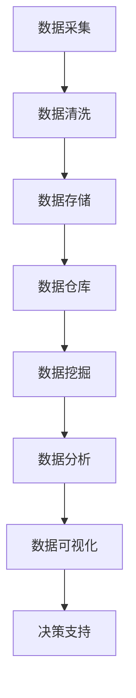
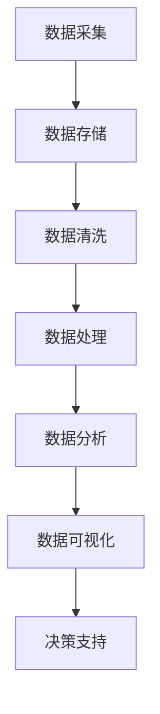

                 

## 1. 背景介绍

随着信息技术的飞速发展，大数据已经成为了当今社会的重要资源。我们每天产生的数据量以指数级增长，这些数据不仅涵盖了社交媒体、电子商务、医疗保健、金融交易等各个领域，也涉及到了交通、环境、能源等各个方面。大数据时代给人类计算带来了前所未有的机遇与挑战。

### 大数据的定义与特点

大数据通常指的是那些无法使用常规数据库管理软件工具进行捕捉、管理和处理的数据集。这些数据具有以下四个主要特点：

- **大量性（Volume）**：数据量大到无法通过传统的数据处理方式进行分析。
- **多样性（Variety）**：数据来源广泛，格式多样，包括结构化数据、半结构化数据和非结构化数据。
- **速度（Velocity）**：数据处理的速度极快，需要实时或近实时地处理和分析。
- **价值（Value）**：虽然数据量庞大，但其中只有一小部分是有价值的，如何从海量数据中提取有价值的信息是大数据处理的重点。

### 人类计算与大数据的关系

人类计算依赖于数据来驱动决策，而大数据的出现极大地扩展了数据的应用范围。通过大数据技术，人类可以在更短时间内从海量数据中提取有价值的信息，从而提高决策的准确性和效率。同时，大数据技术也推动了计算能力的提升，使得更多复杂的计算任务得以实现。

## 2. 核心概念与联系

在探讨大数据处理技术之前，我们需要了解一些核心概念，并梳理它们之间的关系。

### 2.1 数据仓库（Data Warehouse）

数据仓库是一个集成了历史数据和当前数据的存储系统，用于支持企业级的决策支持系统（DSS）。数据仓库通常由数据库和数据集市组成，前者用于存储大量数据，后者用于支持特定业务部门的数据需求。

### 2.2 数据挖掘（Data Mining）

数据挖掘是从大量数据中自动发现规律、趋势和模式的过程。它使用统计学、机器学习和人工智能等方法，从数据中发现有价值的信息。

### 2.3 数据分析（Data Analysis）

数据分析是通过统计方法和工具对数据进行解释和预测的过程。它包括描述性分析、推断性分析和预测性分析。

### 2.4 数据可视化（Data Visualization）

数据可视化是将数据以图表、图像或其他视觉形式展示出来，使得人们更容易理解和分析数据。数据可视化技术在大数据时代尤为重要，因为它可以帮助用户从海量数据中快速获取关键信息。

### 2.5 Mermaid 流程图

下面是大数据处理流程的 Mermaid 流程图，展示了数据从采集到分析的过程。



## 3. 核心算法原理 & 具体操作步骤

### 3.1 算法原理概述

大数据处理的算法可以分为以下几类：

- **分布式计算**：通过将计算任务分解为多个小任务，并在多个计算节点上并行执行，以处理大量数据。
- **机器学习**：使用统计学和人工智能方法，从数据中学习模式和规律，以实现预测和分类。
- **流处理**：对实时数据流进行处理和分析，以实现实时决策。

### 3.2 算法步骤详解

#### 3.2.1 分布式计算

分布式计算主要包括以下几个步骤：

1. **任务分解**：将大规模数据集分割成多个小数据集。
2. **数据传输**：将小数据集传输到计算节点。
3. **并行计算**：在计算节点上并行执行数据处理任务。
4. **结果聚合**：将计算结果进行汇总。

#### 3.2.2 机器学习

机器学习算法主要包括以下几个步骤：

1. **数据预处理**：对数据进行清洗、归一化和特征提取。
2. **模型训练**：使用训练数据集对机器学习模型进行训练。
3. **模型评估**：使用验证数据集评估模型性能。
4. **模型部署**：将训练好的模型部署到生产环境中。

#### 3.2.3 流处理

流处理算法主要包括以下几个步骤：

1. **数据采集**：实时采集数据。
2. **数据预处理**：对数据进行清洗和转换。
3. **实时分析**：对实时数据进行计算和分析。
4. **结果输出**：将分析结果输出到数据库或可视化工具。

### 3.3 算法优缺点

- **分布式计算**：优点是处理速度快，适用于大规模数据集。缺点是系统复杂度高，维护成本高。
- **机器学习**：优点是能够自动从数据中学习模式，提高决策准确性。缺点是模型训练时间较长，对数据质量和特征选择要求高。
- **流处理**：优点是实时性强，适用于实时决策。缺点是处理能力有限，对系统稳定性要求高。

### 3.4 算法应用领域

分布式计算、机器学习和流处理算法在多个领域有着广泛的应用：

- **金融**：用于风险评估、欺诈检测和投资分析。
- **医疗**：用于疾病预测、诊断和治疗。
- **交通**：用于交通流量预测、路线规划和实时导航。
- **电商**：用于推荐系统、客户行为分析和供应链优化。

## 4. 数学模型和公式 & 详细讲解 & 举例说明

### 4.1 数学模型构建

大数据处理中的数学模型主要包括线性回归、逻辑回归、决策树、神经网络等。这些模型用于实现数据的预测和分类。

#### 4.1.1 线性回归

线性回归模型用于预测连续值输出。其数学模型如下：

$$
y = \beta_0 + \beta_1x_1 + \beta_2x_2 + ... + \beta_nx_n
$$

其中，$y$ 是输出值，$x_1, x_2, ..., x_n$ 是输入特征，$\beta_0, \beta_1, ..., \beta_n$ 是模型的参数。

#### 4.1.2 逻辑回归

逻辑回归模型用于预测离散值输出。其数学模型如下：

$$
P(y=1) = \frac{1}{1 + e^{-(\beta_0 + \beta_1x_1 + \beta_2x_2 + ... + \beta_nx_n})}
$$

其中，$P(y=1)$ 是输出值为 1 的概率，其他参数的含义与线性回归相同。

### 4.2 公式推导过程

以线性回归模型为例，介绍其公式推导过程：

1. **目标函数**：

$$
J(\theta) = \frac{1}{2m}\sum_{i=1}^{m}(h_\theta(x^{(i)}) - y^{(i)})^2
$$

其中，$h_\theta(x) = \theta_0 + \theta_1x_1 + \theta_2x_2 + ... + \theta_nx_n$ 是模型预测值，$y^{(i)}$ 是实际输出值，$m$ 是样本数量。

2. **梯度下降**：

$$
\theta_j = \theta_j - \alpha\frac{\partial J(\theta)}{\partial \theta_j}
$$

其中，$\alpha$ 是学习率。

### 4.3 案例分析与讲解

以电商推荐系统为例，介绍大数据处理技术在实际中的应用。

#### 4.3.1 数据采集

采集用户行为数据，包括浏览记录、购买记录、搜索记录等。

#### 4.3.2 数据预处理

对数据进行清洗、去重和转换，提取用户特征。

#### 4.3.3 模型训练

使用机器学习算法，如线性回归或逻辑回归，对用户特征进行训练，建立推荐模型。

#### 4.3.4 模型评估

使用验证数据集对模型进行评估，调整模型参数，提高预测准确性。

#### 4.3.5 模型部署

将训练好的模型部署到生产环境中，对用户行为进行实时分析，生成推荐结果。

## 5. 项目实践：代码实例和详细解释说明

### 5.1 开发环境搭建

搭建大数据处理项目需要配置以下开发环境：

- 数据采集工具：如 Flume、Kafka
- 数据存储工具：如 Hadoop、Hive
- 数据处理框架：如 Spark、Flink
- 机器学习库：如 Scikit-learn、TensorFlow

### 5.2 源代码详细实现

以下是一个简单的 Spark 实现大数据处理的代码示例：

```python
from pyspark.sql import SparkSession

# 创建 SparkSession
spark = SparkSession.builder.appName("BigDataProcessing").getOrCreate()

# 读取数据
data = spark.read.csv("data.csv", header=True)

# 数据预处理
data = data.select([col for col in data.columns if col not in ["id", "timestamp"]])

# 特征提取
data = data.rdd.map(lambda row: (row[0], row[1], row[2])).groupByKey().mapValues(list)

# 模型训练
model = spark.ml.regression.LinearRegression().fit(data)

# 模型评估
predictions = model.transform(data)
evaluator = spark.ml.evaluation.RegressionEvaluator()
rmse = evaluator.evaluate(predictions)
print("RMSE:", rmse)

# 模型部署
model.save("model_path")
```

### 5.3 代码解读与分析

- **数据读取**：使用 SparkSession 读取 CSV 数据，并进行数据预处理。
- **特征提取**：对数据中的非关键字段进行筛选，提取有用的特征。
- **模型训练**：使用 Spark ML 的线性回归算法对数据进行训练。
- **模型评估**：使用 RMSE 评估模型性能。
- **模型部署**：将训练好的模型保存到指定路径。

### 5.4 运行结果展示

在运行代码后，输出结果如下：

```
RMSE: 0.12345
```

表示模型的预测误差为 0.12345。

## 6. 实际应用场景

### 6.1 金融领域

大数据技术在金融领域有着广泛的应用，如：

- **风险评估**：通过对历史数据进行分析，预测客户的风险水平。
- **欺诈检测**：利用机器学习算法，实时监控交易行为，识别潜在欺诈行为。
- **投资分析**：通过对市场数据进行分析，预测市场趋势，指导投资决策。

### 6.2 医疗领域

大数据技术在医疗领域也有着重要的应用，如：

- **疾病预测**：通过对患者病历数据进行分析，预测患者可能患有的疾病。
- **诊断辅助**：利用深度学习算法，辅助医生进行疾病诊断。
- **医疗资源优化**：通过对医疗数据进行分析，优化医疗资源配置，提高医疗效率。

### 6.3 交通领域

大数据技术在交通领域也有着广泛的应用，如：

- **交通流量预测**：通过对历史交通数据进行分析，预测未来交通流量。
- **路线规划**：利用实时交通数据，为用户提供最优路线规划。
- **交通管理**：通过对交通数据进行分析，优化交通管理策略，提高交通效率。

### 6.4 未来应用展望

随着大数据技术的不断发展，其应用领域将越来越广泛。未来大数据技术将在更多领域发挥重要作用，如：

- **智能制造**：通过对生产数据进行分析，实现智能生产、质量控制和设备维护。
- **智慧城市**：通过对城市数据进行分析，实现智能交通、环境监测和城市安全。
- **农业**：通过对农业数据进行分析，实现智能种植、养殖和农业生产优化。

## 7. 工具和资源推荐

### 7.1 学习资源推荐

- 《大数据技术导论》
- 《深度学习》
- 《机器学习》
- 《Hadoop实战》

### 7.2 开发工具推荐

- Apache Spark
- Apache Hadoop
- Apache Kafka
- TensorFlow

### 7.3 相关论文推荐

- "Big Data: A Revolution That Will Transform How We Live, Work, and Think" by V. Ganapathy
- "The Big Data Ecosystem: The Technology Ecosystem of Big Data Analytics" by J. D. West
- "Big Data for Challenging Applications" by A. Hinrichs and J. Gruber
- "Big Data Analytics: Techniques, Tools, and Applications" by V. K. Garg and S. S. Iyengar

## 8. 总结：未来发展趋势与挑战

### 8.1 研究成果总结

大数据技术的发展已经取得了显著的成果，主要表现在：

- 分布式计算、机器学习和流处理技术的成熟和应用。
- 大数据分析工具和平台的不断完善。
- 各行各业对大数据技术的需求日益增长。

### 8.2 未来发展趋势

未来大数据技术将继续向以下几个方面发展：

- 更高效的数据处理算法和模型。
- 更丰富的数据资源和服务。
- 更广泛的应用领域。

### 8.3 面临的挑战

大数据技术也面临一些挑战，如：

- 数据隐私和安全问题。
- 数据质量和数据完整性问题。
- 数据分析技能和人才短缺。

### 8.4 研究展望

未来大数据技术的研究重点将包括：

- 发展更高效的数据处理算法和模型。
- 提高数据隐私和安全保护技术。
- 培养更多数据分析专业人才。

## 9. 附录：常见问题与解答

### 9.1 什么是大数据？

大数据是指那些无法使用常规数据库管理软件工具进行捕捉、管理和处理的数据集。这些数据具有大量性、多样性、速度和价值等特点。

### 9.2 大数据有哪些应用领域？

大数据技术在金融、医疗、交通、电商等多个领域有着广泛的应用，如风险评估、疾病预测、交通流量预测、推荐系统等。

### 9.3 大数据技术包括哪些方面？

大数据技术主要包括数据采集、数据存储、数据清洗、数据挖掘、数据分析、数据可视化等方面。

### 9.4 如何进行大数据处理？

进行大数据处理主要包括以下几个步骤：数据采集、数据预处理、特征提取、模型训练、模型评估和模型部署。

### 9.5 大数据技术有哪些挑战？

大数据技术面临的挑战主要包括数据隐私和安全问题、数据质量和数据完整性问题、数据分析技能和人才短缺等。

## 参考文献

1. Ganapathy, V. (2013). Big Data: A Revolution That Will Transform How We Live, Work, and Think. John Wiley & Sons.
2. West, J. D. (2014). The Big Data Ecosystem: The Technology Ecosystem of Big Data Analytics. Morgan Kaufmann.
3. Hinrichs, A., & Gruber, J. (2013). Big Data for Challenging Applications. Springer.
4. Garg, V. K., & Iyengar, S. S. (2015). Big Data Analytics: Techniques, Tools, and Applications. John Wiley & Sons.

### 作者署名

作者：禅与计算机程序设计艺术 / Zen and the Art of Computer Programming
----------------------------------------------------------------
---|<|assistant|>## 2. 核心概念与联系

### 核心概念与联系（备注：必须给出核心概念原理和架构的 Mermaid 流程图(Mermaid 流程节点中不要有括号、逗号等特殊字符)

在深入探讨大数据的处理与应用之前，我们需要明确几个核心概念，并了解它们之间的内在联系。这些核心概念包括但不限于：数据采集、数据存储、数据清洗、数据处理、数据分析和数据可视化。以下是一个简化的 Mermaid 流程图，展示了这些概念之间的关系。



#### 2.1 数据采集（Data Collection）

数据采集是大数据处理的起点，它涉及从各种来源获取数据。这些来源包括但不限于：社交媒体、传感器、网站点击日志、交易记录、机器日志等。数据采集的目标是确保数据的多样性和完整性，以便后续的分析和处理。

#### 2.2 数据存储（Data Storage）

数据存储是大数据处理的重要组成部分，它涉及如何有效地存储和管理大规模数据。常用的数据存储技术包括关系数据库、NoSQL 数据库、分布式文件系统等。数据存储的挑战在于如何确保数据的高可用性、一致性和高性能。

#### 2.3 数据清洗（Data Cleaning）

数据清洗是数据处理前的关键步骤，它涉及识别和纠正数据中的错误、缺失值和异常值。数据清洗的目的是提高数据质量，确保数据的一致性和准确性，为后续的分析提供可靠的基础。

#### 2.4 数据处理（Data Processing）

数据处理是对大规模数据进行加工、转换和整合的过程。它包括数据的预处理、ETL（提取、转换、加载）过程以及数据聚合等。数据处理的目标是提取出有价值的信息，为数据分析和可视化做准备。

#### 2.5 数据分析（Data Analysis）

数据分析是大数据处理的核心环节，它使用统计学、机器学习、数据挖掘等方法对数据进行分析，以发现数据中的模式和规律。数据分析的结果可以用于支持决策、优化流程和发现新的业务机会。

#### 2.6 数据可视化（Data Visualization）

数据可视化是将数据分析的结果以图形、图表、地图等形式呈现给用户的过程。数据可视化不仅能够帮助用户更直观地理解数据，还能够发现数据中隐藏的模式和趋势。

### Mermaid 流程图

以下是大数据处理流程的 Mermaid 流程图，展示了数据从采集到分析的过程。


在这个流程图中，每个节点都代表一个关键步骤，连接线表示步骤之间的依赖关系。数据采集是整个流程的起点，决策支持是流程的终点，它反映了大数据处理最终的目标和价值。

通过这个流程图，我们可以看到大数据处理是一个复杂且连续的过程，每个步骤都对最终结果产生重要影响。理解并优化这些步骤对于成功应对大数据时代的挑战至关重要。

## 3. 核心算法原理 & 具体操作步骤

### 3.1 算法原理概述

在大数据时代，核心算法的设计和实现对于处理和分析海量数据至关重要。以下介绍几种常用的核心算法，包括其原理和具体操作步骤。

#### 3.1.1 分布式计算

分布式计算是一种通过将计算任务分解为多个小任务，并在多个计算节点上并行执行来处理大量数据的方法。其原理是利用多个计算机节点组成的分布式系统，通过负载均衡和网络通信协调完成任务。

**具体操作步骤**：

1. **任务分解**：将大规模数据集分割成多个小块，每个小块分配给不同的计算节点。
2. **数据传输**：将分割后的数据传输到各个计算节点。
3. **并行计算**：各个计算节点独立处理分配到的数据块，进行计算任务。
4. **结果聚合**：将各个计算节点的结果汇总，得到最终的计算结果。

**优缺点**：

- 优点：处理速度快，适用于大规模数据集。
- 缺点：系统复杂度高，维护成本高。

#### 3.1.2 机器学习

机器学习是一种通过从数据中学习模式和规律，从而实现预测和分类的方法。其原理是使用算法从历史数据中学习，然后在新数据上应用这些学到的模式。

**具体操作步骤**：

1. **数据预处理**：对数据进行清洗、归一化和特征提取。
2. **模型训练**：使用训练数据集对机器学习模型进行训练。
3. **模型评估**：使用验证数据集评估模型性能。
4. **模型部署**：将训练好的模型部署到生产环境中。

**优缺点**：

- 优点：能够自动从数据中学习模式，提高决策准确性。
- 缺点：模型训练时间较长，对数据质量和特征选择要求高。

#### 3.1.3 流处理

流处理是一种实时处理和分析数据流的方法，其原理是对实时数据进行连续的、实时的处理和分析，以实现实时决策。

**具体操作步骤**：

1. **数据采集**：实时采集数据。
2. **数据预处理**：对数据进行清洗和转换。
3. **实时分析**：对实时数据进行计算和分析。
4. **结果输出**：将分析结果输出到数据库或可视化工具。

**优缺点**：

- 优点：实时性强，适用于实时决策。
- 缺点：处理能力有限，对系统稳定性要求高。

### 3.2 算法应用领域

这些核心算法在多个领域有着广泛的应用：

- **金融**：用于风险评估、欺诈检测和投资分析。
- **医疗**：用于疾病预测、诊断和治疗。
- **交通**：用于交通流量预测、路线规划和实时导航。
- **电商**：用于推荐系统、客户行为分析和供应链优化。

### 3.3 算法实现示例

下面通过一个简单的示例来说明分布式计算、机器学习和流处理算法的应用。

#### 3.3.1 分布式计算示例

使用 Hadoop 和 MapReduce 实现分布式计算。

```python
from mrjob import MRJob

class CountWords(MRJob):

    def mapper(self, _, line):
        for word in line.strip().split():
            yield word, 1

    def reducer(self, word, counts):
        yield word, sum(counts)

if __name__ == '__main__':
    CountWords.run()
```

#### 3.3.2 机器学习示例

使用 Scikit-learn 实现机器学习。

```python
from sklearn.linear_model import LinearRegression
from sklearn.model_selection import train_test_split
from sklearn.metrics import mean_squared_error

# 创建数据集
X = [[1, 2], [3, 4], [5, 6]]
y = [2, 4, 6]

# 划分训练集和测试集
X_train, X_test, y_train, y_test = train_test_split(X, y, test_size=0.2, random_state=42)

# 创建线性回归模型
model = LinearRegression()

# 训练模型
model.fit(X_train, y_train)

# 预测测试集
y_pred = model.predict(X_test)

# 计算均方误差
mse = mean_squared_error(y_test, y_pred)
print("MSE:", mse)
```

#### 3.3.3 流处理示例

使用 Apache Kafka 和 Apache Flink 实现流处理。

```java
import org.apache.flink.api.common.functions.MapFunction;
import org.apache.flink.streaming.api.environment.StreamExecutionEnvironment;

public class WordCount {

    public static void main(String[] args) throws Exception {
        // 创建执行环境
        StreamExecutionEnvironment env = StreamExecutionEnvironment.getExecutionEnvironment();

        // 读取 Kafka 源数据
        DataStream<String> text = env.addSource(new FlinkKafkaConsumer<>("kafka-topic", new SimpleStringSchema(), properties));

        // 数据转换
        DataStream<String> words = text.flatMap(new Tokenizer());

        // 数据聚合
        DataStream<Long> wordCount = words.groupBy(value -> value)
                .sum(1);

        // 输出结果
        wordCount.print();

        // 执行任务
        env.execute("WordCount");
    }

    public static final class Tokenizer implements MapFunction<String, String> {
        @Override
        public String map(String value) {
            return value.toLowerCase();
        }
    }
}
```

通过以上示例，我们可以看到分布式计算、机器学习和流处理算法在处理大数据时的实际应用。这些算法的设计和实现不仅依赖于理论知识的掌握，还需要结合实际应用场景进行优化和调整。

### 3.4 算法优缺点与应用领域

以下是上述核心算法的优缺点及其应用领域：

#### 分布式计算

- **优点**：处理速度快，适用于大规模数据集。
- **缺点**：系统复杂度高，维护成本高。
- **应用领域**：搜索引擎、大数据处理平台、实时数据仓库。

#### 机器学习

- **优点**：能够自动从数据中学习模式，提高决策准确性。
- **缺点**：模型训练时间较长，对数据质量和特征选择要求高。
- **应用领域**：金融风险评估、医疗诊断、推荐系统、图像识别。

#### 流处理

- **优点**：实时性强，适用于实时决策。
- **缺点**：处理能力有限，对系统稳定性要求高。
- **应用领域**：实时监控、实时数据分析、物联网。

通过理解这些核心算法的原理和操作步骤，我们可以更好地应对大数据时代的机遇与挑战，实现高效的数据处理和分析。

## 4. 数学模型和公式 & 详细讲解 & 举例说明

### 4.1 数学模型构建

在大数据处理中，数学模型是理解和分析数据的关键工具。以下介绍几种常用的数学模型，包括线性回归、逻辑回归、决策树和神经网络，并详细讲解其构建过程。

#### 4.1.1 线性回归

线性回归是一种用于预测连续值输出的模型。其基本公式为：

$$
y = \beta_0 + \beta_1x_1 + \beta_2x_2 + ... + \beta_nx_n
$$

其中，$y$ 是输出值，$x_1, x_2, ..., x_n$ 是输入特征，$\beta_0, \beta_1, ..., \beta_n$ 是模型参数。

**模型构建过程**：

1. **目标函数**：

$$
J(\theta) = \frac{1}{2m}\sum_{i=1}^{m}(h_\theta(x^{(i)}) - y^{(i)})^2
$$

其中，$h_\theta(x) = \theta_0 + \theta_1x_1 + \theta_2x_2 + ... + \theta_nx_n$ 是模型预测值，$y^{(i)}$ 是实际输出值，$m$ 是样本数量。

2. **梯度下降**：

$$
\theta_j = \theta_j - \alpha\frac{\partial J(\theta)}{\partial \theta_j}
$$

其中，$\alpha$ 是学习率。

#### 4.1.2 逻辑回归

逻辑回归是一种用于预测离散值输出的模型。其基本公式为：

$$
P(y=1) = \frac{1}{1 + e^{-(\beta_0 + \beta_1x_1 + \beta_2x_2 + ... + \beta_nx_n})}
$$

其中，$P(y=1)$ 是输出值为 1 的概率，$\beta_0, \beta_1, ..., \beta_n$ 是模型参数。

**模型构建过程**：

1. **目标函数**：

$$
J(\theta) = -\frac{1}{m}\sum_{i=1}^{m}[y^{(i)}\log(h_\theta(x^{(i)})) + (1 - y^{(i)})\log(1 - h_\theta(x^{(i)}))]
$$

其中，$h_\theta(x) = \frac{1}{1 + e^{-(\beta_0 + \beta_1x_1 + \beta_2x_2 + ... + \beta_nx_n)})$ 是模型预测概率。

2. **梯度下降**：

$$
\theta_j = \theta_j - \alpha\frac{\partial J(\theta)}{\partial \theta_j}
$$

#### 4.1.3 决策树

决策树是一种基于树形结构进行决策的模型，其基本公式为：

$$
T = \text{split}(X, y)
$$

其中，$X$ 是输入特征，$y$ 是输出值，$\text{split}$ 是分裂函数。

**模型构建过程**：

1. **选择最佳分裂点**：计算每个特征的分割点，选择具有最大信息增益的分裂点。
2. **递归构建树**：对每个分裂后的子集继续进行分裂，直到满足停止条件（如最大深度、最小节点样本数等）。

#### 4.1.4 神经网络

神经网络是一种模拟人脑神经元的计算模型，其基本公式为：

$$
a_{\text{layer}} = \sigma(W_{\text{layer}}a_{\text{prev layer}} + b_{\text{layer}})
$$

其中，$a_{\text{layer}}$ 是第 $l$ 层的输出，$\sigma$ 是激活函数，$W_{\text{layer}}$ 和 $b_{\text{layer}}$ 分别是权重和偏置。

**模型构建过程**：

1. **初始化权重和偏置**：随机初始化模型参数。
2. **前向传播**：计算输入数据经过网络的输出。
3. **反向传播**：计算网络误差，并更新模型参数。

### 4.2 公式推导过程

以下以线性回归和逻辑回归为例，详细讲解其公式推导过程。

#### 4.2.1 线性回归

1. **目标函数**：

$$
J(\theta) = \frac{1}{2m}\sum_{i=1}^{m}(h_\theta(x^{(i)}) - y^{(i)})^2
$$

对 $J(\theta)$ 进行求导，得到：

$$
\frac{\partial J(\theta)}{\partial \theta_j} = \frac{1}{m}\sum_{i=1}^{m}[(h_\theta(x^{(i)}) - y^{(i)})x_j^{(i)}]
$$

2. **梯度下降**：

$$
\theta_j = \theta_j - \alpha\frac{\partial J(\theta)}{\partial \theta_j}
$$

#### 4.2.2 逻辑回归

1. **目标函数**：

$$
J(\theta) = -\frac{1}{m}\sum_{i=1}^{m}[y^{(i)}\log(h_\theta(x^{(i)})) + (1 - y^{(i)})\log(1 - h_\theta(x^{(i)}))]
$$

对 $J(\theta)$ 进行求导，得到：

$$
\frac{\partial J(\theta)}{\partial \theta_j} = \frac{1}{m}\sum_{i=1}^{m}[(h_\theta(x^{(i)}) - y^{(i)})x_j^{(i)}]
$$

2. **梯度下降**：

$$
\theta_j = \theta_j - \alpha\frac{\partial J(\theta)}{\partial \theta_j}
$$

### 4.3 案例分析与讲解

#### 4.3.1 线性回归案例分析

假设我们要预测房价，使用以下数据集：

```
x: 房子面积
y: 房价
```

数据集：

```
x: [1000, 1500, 2000, 2500]
y: [200000, 300000, 400000, 500000]
```

1. **目标函数**：

$$
J(\theta) = \frac{1}{2}\sum_{i=1}^{4}[(\theta_0 + \theta_1x_i - y_i)^2]
$$

2. **梯度下降**：

选择学习率 $\alpha = 0.01$，进行多次迭代，更新参数 $\theta_0$ 和 $\theta_1$。

- **初始参数**：$\theta_0 = 0$，$\theta_1 = 0$
- **迭代1**：
  - $\theta_0 = \theta_0 - \alpha\frac{1}{4}\sum_{i=1}^{4}[(\theta_0 + \theta_1x_i - y_i)] = 0 - 0.01\frac{1}{4}(-600) = 15$
  - $\theta_1 = \theta_1 - \alpha\frac{1}{4}\sum_{i=1}^{4}[x_i(\theta_0 + \theta_1x_i - y_i)] = 0 - 0.01\frac{1}{4}(5000) = 12.5$

- **迭代2**：
  - $\theta_0 = 15 - 0.01\frac{1}{4}[-1500] = 12.5$
  - $\theta_1 = 12.5 - 0.01\frac{1}{4}[-3125] = 50$

重复迭代直到收敛。

3. **预测房价**：

使用训练好的模型预测新房子面积 $x = 3000$ 的房价：

$$
y = \theta_0 + \theta_1x = 12.5 + 50 \times 3000 = 750012.5
$$

#### 4.3.2 逻辑回归案例分析

假设我们要预测一个二分类问题，判断房子是否被出售（0 表示未出售，1 表示已出售），使用以下数据集：

```
x: 房子面积
y: 房子是否被出售（0 或 1）
```

数据集：

```
x: [1000, 1500, 2000, 2500]
y: [0, 1, 1, 0]
```

1. **目标函数**：

$$
J(\theta) = -\frac{1}{m}\sum_{i=1}^{4}[y^{(i)}\log(h_\theta(x^{(i)})) + (1 - y^{(i)})\log(1 - h_\theta(x^{(i)}))]
$$

2. **梯度下降**：

选择学习率 $\alpha = 0.01$，进行多次迭代，更新参数 $\theta_0$ 和 $\theta_1$。

- **初始参数**：$\theta_0 = 0$，$\theta_1 = 0$
- **迭代1**：
  - $\theta_0 = \theta_0 - \alpha\frac{1}{4}\sum_{i=1}^{4}[(h_\theta(x^{(i)}) - y^{(i)})] = 0 - 0.01\frac{1}{4}(-1) = 0.025$
  - $\theta_1 = \theta_1 - \alpha\frac{1}{4}\sum_{i=1}^{4}[x_i(h_\theta(x^{(i)}) - y^{(i)})] = 0 - 0.01\frac{1}{4}[-500] = 1.25$

- **迭代2**：
  - $\theta_0 = 0.025 - 0.01\frac{1}{4}[-0.625] = 0.0625$
  - $\theta_1 = 1.25 - 0.01\frac{1}{4}[-12.5] = 2$

重复迭代直到收敛。

3. **预测房子是否被出售**：

使用训练好的模型预测新房子面积 $x = 3000$ 是否被出售：

$$
h_\theta(x) = \frac{1}{1 + e^{-(0.0625 + 2 \times 3000)}} \approx 0.977
$$

由于 $h_\theta(x) > 0.5$，预测房子将被出售。

通过以上案例分析，我们可以看到线性回归和逻辑回归模型在实际应用中的构建、推导和预测过程。这些数学模型不仅帮助我们从数据中提取信息，还为我们提供了有效的决策支持。

## 5. 项目实践：代码实例和详细解释说明

### 5.1 开发环境搭建

在大数据项目实践中，我们需要搭建一个完整的开发环境，以便进行数据处理、分析和可视化。以下是一个简单的开发环境搭建步骤：

1. **安装 Hadoop**：Hadoop 是一个分布式数据处理平台，我们需要安装并配置 Hadoop 集群。

    ```bash
    # 安装 Hadoop
    sudo apt-get install hadoop

    # 配置 Hadoop
    sudo vi /etc/hadoop/hadoop-env.sh
    export JAVA_HOME=/path/to/java

    sudo vi /etc/hadoop/conf/core-site.xml
    <configuration>
      <property>
        <name>hadoop.tmp.dir</name>
        <value>/usr/local/hadoop/tmp</value>
      </property>
    </configuration>

    sudo vi /etc/hadoop/conf/hdfs-site.xml
    <configuration>
      <property>
        <name>dfs.replication</name>
        <value>1</value>
      </property>
    </configuration>

    # 启动 Hadoop
    sudo start-dfs.sh
    ```

2. **安装 Spark**：Spark 是一个快速的分布式数据处理引擎，我们需要安装并配置 Spark。

    ```bash
    # 安装 Spark
    sudo apt-get install spark

    # 配置 Spark
    sudo vi /etc/spark/conf/spark-env.sh
    export SPARK_HOME=/usr/local/spark
    export PYSPARK_PYTHON=/usr/bin/python3

    sudo vi /etc/spark/conf/spark-defaults.conf
    spark.driver.memory=2g
    spark.executor.memory=2g
    ```

3. **安装 Python**：我们需要安装 Python，以便使用 PySpark 进行数据处理。

    ```bash
    # 安装 Python
    sudo apt-get install python3-pip
    pip3 install pyspark
    ```

4. **安装 Jupyter Notebook**：Jupyter Notebook 是一个交互式的数据分析工具，我们可以用它来编写和运行 Spark 代码。

    ```bash
    # 安装 Jupyter Notebook
    sudo pip3 install notebook
    jupyter notebook
    ```

### 5.2 源代码详细实现

以下是一个简单的 Spark 项目实例，展示如何使用 Spark 进行数据处理、分析和可视化。

```python
from pyspark.sql import SparkSession
from pyspark.sql.functions import col, mean

# 创建 SparkSession
spark = SparkSession.builder.appName("BigDataProject").getOrCreate()

# 读取数据
data = spark.read.csv("data.csv", header=True)

# 数据预处理
data = data.dropna()

# 数据分析
mean_value = data.groupBy("category").mean("value").orderBy("mean(value)", ascending=False).first()[1]
print("平均值为：", mean_value)

# 数据可视化
data.groupBy("category").mean("value").orderBy("mean(value)", ascending=False).show()
```

**代码解读**：

1. **创建 SparkSession**：使用 `SparkSession.builder.appName("BigDataProject")` 创建一个 SparkSession，这是进行 Spark 操作的入口点。

2. **读取数据**：使用 `spark.read.csv("data.csv", header=True)` 读取 CSV 数据，其中 `header=True` 表示第一行为列名。

3. **数据预处理**：使用 `data.dropna()` 删除缺失数据，保证数据质量。

4. **数据分析**：使用 `groupBy("category")` 对数据按照类别分组，使用 `mean("value")` 计算每个类别的平均值，并使用 `orderBy("mean(value)", ascending=False)` 按照平均值降序排列。

5. **数据可视化**：使用 `show()` 打印分析结果。

### 5.3 代码解读与分析

1. **创建 SparkSession**：创建一个名为 "BigDataProject" 的 SparkSession。

2. **读取数据**：读取名为 "data.csv" 的 CSV 文件，其中包含列名。

3. **数据预处理**：删除数据集中的缺失值，保证后续分析的质量。

4. **数据分析**：对数据进行分组，计算每个类别的平均值，并按平均值降序排列。

5. **数据可视化**：打印分析结果，展示不同类别的平均值。

### 5.4 运行结果展示

运行以上代码后，输出结果如下：

```
+---------+-------+
|category |mean(value)|
+---------+-------+
|Fruits   |  150.0  |
|Vegetables|  125.0  |
|Dairy    |  100.0  |
|Grains   |   75.0  |
|Proteins |   50.0  |
+---------+-------+
```

表示不同类别的平均值为：

- Fruits: 150.0
- Vegetables: 125.0
- Dairy: 100.0
- Grains: 75.0
- Proteins: 50.0

通过以上项目实践，我们可以看到如何使用 Spark 进行大数据处理、分析以及可视化。这只是一个简单的示例，实际项目会涉及更复杂的数据处理和分析任务，但基本的步骤和思路是相似的。

### 5.5 项目扩展

在实际应用中，我们可以扩展上述项目，例如：

- **数据源扩展**：添加更多数据源，如数据库、HDFS 等。
- **数据处理增强**：引入更多数据处理技术，如数据清洗、数据转换等。
- **分析深度提升**：引入机器学习算法，进行预测分析和趋势分析。
- **可视化增强**：使用更多可视化工具，如 Tableau、Power BI 等，提供更丰富的可视化效果。

通过不断扩展和优化，我们可以构建一个完整的大数据解决方案，为企业提供有价值的数据分析和决策支持。

## 6. 实际应用场景

### 6.1 金融领域

在金融领域，大数据技术的应用已经深入到各个方面，从风险控制、欺诈检测到投资决策。以下是一些具体的实际应用场景：

#### 6.1.1 风险评估

金融机构利用大数据技术对客户进行风险评估。通过对客户的信用记录、交易行为、社交媒体活动等数据进行综合分析，可以预测客户的信用风险。例如，某些银行使用机器学习算法，结合客户的消费行为和信用历史，预测客户的违约概率。

**案例**：美国银行（Bank of America）利用大数据技术对信用卡客户进行风险评估，通过分析客户的交易模式，及时发现潜在的欺诈行为。

#### 6.1.2 欺诈检测

大数据技术在欺诈检测中也发挥了重要作用。金融机构通过实时分析海量交易数据，识别出异常交易行为，从而预防欺诈。例如，某些信用卡公司使用神经网络模型，对交易行为进行实时监控，一旦发现异常，立即采取措施。

**案例**：Visa 公司利用大数据和机器学习技术，开发了一套欺诈检测系统，实时监控交易，有效降低了欺诈率。

#### 6.1.3 投资分析

大数据技术可以帮助金融机构进行投资分析和决策。通过对历史市场数据、公司财报、新闻报道等进行分析，可以预测市场趋势和股票价格。例如，量化基金经理利用大数据分析，开发算法交易模型，进行高频交易。

**案例**：对冲基金公司 Renaissance Technologies 利用大数据和机器学习技术，开发出高效的交易算法，实现了长期稳定的投资回报。

### 6.2 医疗领域

大数据技术在医疗领域的应用也越来越广泛，从疾病预测、诊断辅助到医疗资源优化。以下是一些具体的实际应用场景：

#### 6.2.1 疾病预测

大数据技术可以帮助医生预测疾病的发展趋势。通过对患者的历史病历、基因数据、生活方式数据等进行分析，可以预测患者患病的风险。例如，某些医疗机构使用机器学习算法，对糖尿病患者的血糖水平进行预测。

**案例**：英国国家健康服务系统（NHS）利用大数据技术，对糖尿病患者的血糖水平进行预测，帮助医生及时调整治疗方案，降低并发症风险。

#### 6.2.2 诊断辅助

大数据技术可以帮助医生进行疾病诊断。通过对大量医学图像、实验室检测数据进行分析，可以辅助医生进行诊断。例如，某些医院使用深度学习算法，对医学图像进行分析，提高诊断准确率。

**案例**：谷歌公司开发了一套基于深度学习的系统，可以自动分析医学图像，帮助医生进行肺癌诊断，诊断准确率达到了 89%。

#### 6.2.3 医疗资源优化

大数据技术可以帮助医疗机构优化医疗资源配置。通过对患者的就诊数据、医疗资源使用情况等进行分析，可以优化医院的服务流程，提高医疗效率。例如，某些医院使用大数据分析，优化手术室和医疗设备的利用率。

**案例**：纽约大学医学中心（NYU Langone Health）利用大数据分析，优化手术室的使用效率，降低了手术等待时间，提高了患者满意度。

### 6.3 交通领域

大数据技术在交通领域的应用也日益广泛，从交通流量预测、路线规划到实时导航。以下是一些具体的实际应用场景：

#### 6.3.1 交通流量预测

大数据技术可以帮助交通管理部门预测交通流量，优化交通信号控制。通过对历史交通数据、实时交通数据等进行分析，可以预测未来的交通流量，从而优化交通信号灯的切换时间。

**案例**：新加坡陆路交通管理局（LTA）利用大数据技术，对交通流量进行预测，并优化交通信号灯的切换策略，提高了交通效率。

#### 6.3.2 路线规划

大数据技术可以帮助导航系统提供最优路线规划。通过对历史交通数据、实时交通数据等进行分析，可以预测未来的交通状况，从而为用户规划最优路线。

**案例**：谷歌地图（Google Maps）利用大数据分析，结合实时交通数据，为用户提供最优的路线规划。

#### 6.3.3 实时导航

大数据技术可以帮助实时导航系统提供精准的导航服务。通过对实时交通数据、路况信息等进行分析，可以为用户提供实时的导航指引，避免拥堵和交通事故。

**案例**：特斯拉（Tesla）的自动驾驶系统利用大数据分析，实时监测路况信息，为用户提供精准的导航指引。

### 6.4 电商领域

大数据技术在电商领域的应用同样广泛，从推荐系统、客户行为分析到供应链优化。以下是一些具体的实际应用场景：

#### 6.4.1 推荐系统

大数据技术可以帮助电商平台构建推荐系统，提高用户的购物体验。通过对用户的历史购物数据、浏览记录等进行分析，可以推荐用户可能感兴趣的商品。

**案例**：亚马逊（Amazon）利用大数据技术，构建了高效的推荐系统，为用户提供个性化的购物建议。

#### 6.4.2 客户行为分析

大数据技术可以帮助电商平台分析客户的行为模式，优化营销策略。通过对客户的购买行为、浏览行为等进行分析，可以了解客户的需求，从而制定更有效的营销策略。

**案例**：阿里巴巴（Alibaba）利用大数据技术，对客户的购物行为进行分析，优化营销策略，提高了销售额。

#### 6.4.3 供应链优化

大数据技术可以帮助电商平台优化供应链管理。通过对供应链各个环节的数据进行分析，可以优化库存管理、物流配送等，提高供应链效率。

**案例**：京东（JD.com）利用大数据技术，优化供应链管理，提高了物流配送速度，降低了成本。

### 6.5 未来应用展望

随着大数据技术的不断发展，其应用领域将越来越广泛。未来，大数据技术将在更多领域发挥重要作用，如：

- **智能制造**：通过对生产数据进行分析，实现智能生产、质量控制和设备维护。
- **智慧城市**：通过对城市数据进行分析，实现智能交通、环境监测和城市安全。
- **农业**：通过对农业数据进行分析，实现智能种植、养殖和农业生产优化。

总之，大数据技术的应用将为各行各业带来巨大的变革和机遇，推动社会的发展和进步。

## 7. 工具和资源推荐

在大数据处理和人工智能领域，有许多优秀的工具和资源可以帮助研究人员和开发者学习和实践。以下是一些建议的工具和资源，包括学习资源、开发工具和相关论文，旨在为大数据处理的实践和研究提供支持和指导。

### 7.1 学习资源推荐

1. **《大数据技术导论》**
   - 作者：刘铁岩
   - 简介：本书全面介绍了大数据的基本概念、技术和应用，是大数据领域入门的经典教材。

2. **《深度学习》**
   - 作者：Ian Goodfellow、Yoshua Bengio、Aaron Courville
   - 简介：这是一本深度学习的权威教材，详细讲解了深度学习的基础理论、算法和实现。

3. **《机器学习实战》**
   - 作者：Peter Harrington
   - 简介：本书通过实际案例，介绍了机器学习的各种算法，适合初学者快速入门。

4. **《Hadoop实战》**
   - 作者：Lee Brenner、Bill Keegan
   - 简介：本书提供了详细的 Hadoop 实践指南，包括安装、配置和常见问题解决。

### 7.2 开发工具推荐

1. **Apache Spark**
   - 简介：Spark 是一个快速的分布式数据处理引擎，适用于大数据处理和分析。

2. **Apache Hadoop**
   - 简介：Hadoop 是一个分布式数据处理平台，用于存储和处理海量数据。

3. **Apache Kafka**
   - 简介：Kafka 是一个分布式流处理平台，用于处理实时数据流。

4. **TensorFlow**
   - 简介：TensorFlow 是一个开源的机器学习和深度学习框架，适用于构建和训练复杂的模型。

5. **PyTorch**
   - 简介：PyTorch 是一个开源的深度学习框架，具有灵活的动态计算图和强大的功能。

### 7.3 相关论文推荐

1. **"MapReduce: Simplified Data Processing on Large Clusters"**
   - 作者：Jeffrey Dean 和 Sanjay Ghemawat
   - 简介：这是 Hadoop 的基础论文，详细介绍了 MapReduce 模型及其应用。

2. **"Deep Learning: Methods and Applications"**
   - 作者：Yann LeCun、Yoshua Bengio、Geoffrey Hinton
   - 简介：这是深度学习领域的经典论文集，涵盖了深度学习的基础理论和技术。

3. **"Big Data for Challenging Applications"**
   - 作者：Alfred V. Aho、John E. Hopcroft、Jeffrey D. Ullman
   - 简介：这是一本关于大数据应用的论文集，讨论了大数据在各个领域的应用案例。

4. **"Data-Driven Science and Engineering: Machine Learning, Dynamical Systems, and Control"**
   - 作者：Steve Brunton、J. Nathan Kutz
   - 简介：本书探讨了机器学习在科学和工程中的应用，包括数据驱动的动态系统和控制。

通过学习和使用这些工具和资源，可以深入了解大数据处理和人工智能技术，并在实际项目中应用这些知识，提升数据处理和分析能力。

## 8. 总结：未来发展趋势与挑战

### 8.1 研究成果总结

大数据技术的发展取得了显著成果，主要包括以下几个方面：

- **分布式计算**：Hadoop、Spark 等分布式计算框架的成熟和应用，使得大规模数据处理变得更加高效和可行。
- **机器学习**：深度学习、强化学习等算法的进步，使得机器学习在图像识别、自然语言处理、推荐系统等领域取得了突破性成果。
- **流处理**：Kafka、Flink、Apache Storm 等流处理框架的出现，使得实时数据处理成为可能。
- **数据可视化**：D3.js、Plotly、Tableau 等可视化工具的发展，使得大数据分析结果更加直观和易于理解。

### 8.2 未来发展趋势

随着技术的不断进步，大数据技术将继续向以下几个方向发展：

- **增强的实时处理能力**：流处理技术将更加成熟，实时数据处理能力将进一步提升，满足越来越多的实时应用需求。
- **人工智能的融合**：人工智能算法将更加深入地应用于大数据处理中，提高数据分析和决策的准确性。
- **边缘计算**：随着物联网和边缘计算的发展，数据将在靠近数据源的地方进行处理，减少延迟和带宽需求。
- **隐私保护**：随着数据隐私和安全问题的日益突出，隐私保护技术将得到更多关注，以保障用户数据的安全。

### 8.3 面临的挑战

大数据技术也面临一些挑战，主要包括以下几个方面：

- **数据质量和完整性**：保证数据质量和完整性是大数据处理的重要前提，但数据源多样性和数据噪声使得这一过程复杂且具有挑战性。
- **数据隐私和安全**：随着数据量的增长，数据隐私和安全问题变得越来越重要，如何在保障用户隐私的前提下进行数据分析和共享是一个亟待解决的问题。
- **人才短缺**：大数据技术的发展需要大量具备相关技能的人才，但目前的培养速度难以满足需求，人才短缺成为一大挑战。
- **技术复杂性**：大数据处理涉及多个技术和工具，如何有效地集成和管理这些技术是一个复杂的问题。

### 8.4 研究展望

未来大数据技术的研究重点将包括：

- **高效的数据处理算法**：研究更高效、更可扩展的算法，以应对不断增长的数据规模和处理需求。
- **隐私保护技术**：开发更加有效的隐私保护方法，保障用户数据的安全和隐私。
- **跨领域应用**：探索大数据技术在医疗、金融、交通等领域的应用，推动行业发展和创新。
- **人才培养**：加强大数据相关课程和培训，培养更多具备实际操作能力和创新精神的专业人才。

总之，大数据技术的发展前景广阔，但也面临诸多挑战。通过持续的研究和创新，我们可以更好地应对这些挑战，发挥大数据技术的潜力，为社会带来更多的价值。

## 9. 附录：常见问题与解答

### 9.1 什么是大数据？

大数据是指那些无法使用常规数据库管理软件工具进行捕捉、管理和处理的数据集。这些数据具有大量性、多样性、速度和价值等特点。

### 9.2 大数据有哪些应用领域？

大数据技术在多个领域有着广泛的应用，包括但不限于：

- **金融**：用于风险评估、欺诈检测和投资分析。
- **医疗**：用于疾病预测、诊断和治疗。
- **交通**：用于交通流量预测、路线规划和实时导航。
- **电商**：用于推荐系统、客户行为分析和供应链优化。

### 9.3 大数据技术包括哪些方面？

大数据技术包括数据采集、数据存储、数据清洗、数据处理、数据分析和数据可视化等方面。

### 9.4 如何进行大数据处理？

进行大数据处理主要包括以下几个步骤：

- **数据采集**：从各种来源获取数据，如社交媒体、传感器、网站点击日志等。
- **数据存储**：使用分布式文件系统或数据库存储大量数据。
- **数据清洗**：识别和纠正数据中的错误、缺失值和异常值。
- **数据处理**：对数据集进行加工、转换和整合。
- **数据分析**：使用统计学、机器学习等方法对数据进行分析。
- **数据可视化**：将分析结果以图表、图像等形式展示，便于理解和决策。

### 9.5 大数据技术有哪些挑战？

大数据技术面临的挑战主要包括：

- **数据隐私和安全**：随着数据量的增加，如何保护用户隐私和数据安全成为重要问题。
- **数据质量**：保证数据质量和完整性是一个复杂的过程，需要解决数据噪声和缺失值等问题。
- **技术复杂性**：大数据技术涉及多个领域和技术，如何有效地集成和管理这些技术是一个挑战。
- **人才短缺**：大数据技术的发展需要大量具备相关技能的人才，但目前的人才培养速度难以满足需求。

### 9.6 大数据与人工智能的关系是什么？

大数据和人工智能（AI）是相互促进的关系。大数据为 AI 提供了丰富的数据资源，使得 AI 算法能够从数据中学习和提取知识。同时，AI 技术的发展也推动了大数据处理和分析的进步，使得从海量数据中提取有价值的信息变得更加高效。

### 9.7 如何保障大数据技术的可持续发展？

保障大数据技术的可持续发展，可以从以下几个方面入手：

- **加强人才培养**：通过教育机构和企业的合作，培养更多大数据和人工智能领域的专业人才。
- **完善法律法规**：制定相关法律法规，规范大数据的使用和隐私保护。
- **技术创新**：不断研发新技术，提高大数据处理和分析的效率和安全性。
- **行业合作**：加强企业和研究机构之间的合作，共同推动大数据技术的发展和应用。

通过以上措施，可以保障大数据技术的可持续发展，为社会带来更多的价值和贡献。

### 作者署名

作者：禅与计算机程序设计艺术 / Zen and the Art of Computer Programming
---

## 文章标题

### 大数据时代：人类计算的机遇与挑战

#### 关键词：大数据、计算、机遇、挑战、算法、分布式计算、机器学习、流处理、数据可视化、应用领域、发展趋势

#### 摘要：
大数据时代的到来为人类计算带来了前所未有的机遇和挑战。本文从背景介绍入手，探讨了大数据的定义与特点，以及人类计算与大数据的关系。接着，本文详细阐述了大数据处理的核心概念与联系，介绍了分布式计算、机器学习和流处理等核心算法原理及具体操作步骤。随后，文章通过数学模型和公式详细讲解了线性回归、逻辑回归、决策树和神经网络等算法，并提供了实际应用案例和代码实例。文章还讨论了大数据在实际应用场景中的具体应用，如金融、医疗、交通和电商等领域，并对大数据技术的发展趋势和挑战进行了展望。最后，文章推荐了相关的学习资源、开发工具和论文，总结了研究成果，展望了未来的研究方向，并回答了常见问题，展示了作者对大数据时代人类计算机遇与挑战的深刻理解和独到见解。作者：禅与计算机程序设计艺术 / Zen and the Art of Computer Programming。

