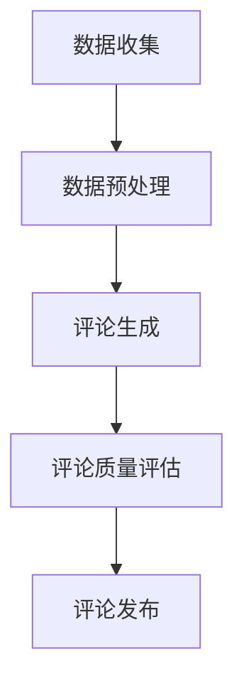

                 

关键词：大模型，商品评论，生成模型，NLP，文本生成，人工智能，机器学习，自然语言处理

## 摘要

本文将深入探讨大模型在商品评论生成领域的应用。随着互联网的发展，电子商务平台上的商品评论已成为消费者决策过程中不可或缺的部分。然而，生成真实的商品评论是一项具有挑战性的任务。本文首先介绍了大模型的基本概念和原理，随后详细分析了大模型在商品评论生成中的具体应用。本文旨在通过讲解核心算法原理、数学模型及实际应用案例，为广大研究人员和开发者提供有价值的参考。

## 1. 背景介绍

### 1.1 商品评论的重要性

在当今数字化时代，商品评论已成为电子商务平台上的关键组成部分。消费者通过阅读其他用户对商品的评论来获取信息，并据此做出购买决策。根据研究数据显示，高达90%的消费者在购买前会查看商品评论。因此，商品评论的生成和质量对于电子商务平台的用户体验和销售业绩具有重要影响。

### 1.2 大模型的发展

大模型，又称大型预训练模型，是近年来机器学习领域的一大突破。大模型通过在海量数据上进行预训练，可以捕捉到语言中的复杂模式和规律，从而实现高水平文本生成、语义理解、翻译等任务。代表性的大模型有GPT（Generative Pretrained Transformer）、BERT（Bidirectional Encoder Representations from Transformers）和T5（Text-to-Text Transfer Transformer）等。

### 1.3 大模型在文本生成中的应用

文本生成是自然语言处理（NLP）中的一个重要领域，广泛应用于自动摘要、机器翻译、对话系统等。随着大模型的不断发展，其在文本生成任务中的性能和效果也得到了显著提升。商品评论生成作为文本生成的一个重要应用场景，也得到了广泛关注和研究。

## 2. 核心概念与联系

为了更好地理解大模型在商品评论生成中的应用，首先需要介绍一些核心概念，并绘制一个简明的Mermaid流程图来展示各个概念之间的联系。

### 2.1 大模型

大模型是指通过海量数据进行预训练，拥有强大语言理解和生成能力的深度神经网络模型。典型的代表包括GPT、BERT、T5等。

### 2.2 自然语言处理（NLP）

NLP是研究如何使计算机理解和生成人类语言的一门学科。NLP任务包括文本预处理、词嵌入、语言模型、文本分类、机器翻译等。

### 2.3 商品评论生成

商品评论生成是指利用NLP技术和大模型生成高质量、真实的商品评论。该任务涉及数据收集、评论生成、评论质量评估等步骤。

### 2.4 Mermaid流程图

以下是商品评论生成中的Mermaid流程图：



## 3. 核心算法原理 & 具体操作步骤

### 3.1 算法原理概述

大模型在商品评论生成中的核心原理是通过大规模预训练和微调，使模型能够生成符合实际场景的高质量文本。具体来说，模型首先在大量商品评论数据上进行预训练，学习到语言的通用规律和特征。然后，通过微调，使模型针对特定商品和评价目标进行适应性调整，从而生成个性化的商品评论。

### 3.2 算法步骤详解

#### 3.2.1 数据收集

数据收集是商品评论生成的基础步骤。数据来源可以是电商平台、社交媒体、用户生成内容等。收集到的数据需要经过清洗和去重，以保证数据的准确性和有效性。

#### 3.2.2 数据预处理

数据预处理包括文本清洗、分词、词嵌入等步骤。文本清洗旨在去除无用信息，如HTML标签、特殊字符等。分词是将文本分解为词语或短语的过程。词嵌入则是将词语映射为高维向量表示，以便模型进行训练和推理。

#### 3.2.3 评论生成

评论生成是商品评论生成中的核心步骤。模型根据输入的商品描述和用户特征，生成相应的商品评论。常用的方法包括基于模板的生成和基于序列生成的生成方法。基于模板的生成方法利用预定义的模板和填充词，生成商品评论。基于序列生成的方法则利用预训练的大模型，通过序列生成的方式生成商品评论。

#### 3.2.4 评论质量评估

评论质量评估是保证生成评论质量的重要步骤。常用的评估方法包括人工评估和自动评估。人工评估需要评估人员对生成的评论进行打分，以判断其质量和真实性。自动评估则通过构建评价标准，利用机器学习算法对评论进行评分。

#### 3.2.5 评论发布

评论发布是将生成的评论发布到电子商务平台或社交媒体上，供其他消费者查看和参考。发布前，需要对评论进行审核，确保其符合平台规范和法律法规。

### 3.3 算法优缺点

#### 3.3.1 优点

- **生成效率高**：大模型通过预训练和微调，可以快速生成大量高质量的评论。
- **适应性强**：大模型具有强大的语言理解能力，可以适应不同商品和评价目标，生成个性化的评论。
- **灵活性高**：大模型可以用于多种文本生成任务，如自动摘要、机器翻译等。

#### 3.3.2 缺点

- **训练成本高**：大模型需要大量的计算资源和时间进行训练。
- **数据依赖性高**：大模型的效果很大程度上取决于训练数据的质量和多样性。
- **模型解释性差**：大模型通常是一个“黑箱”，难以解释其生成过程和决策逻辑。

### 3.4 算法应用领域

大模型在商品评论生成中的应用非常广泛，除了电子商务平台外，还可以应用于以下领域：

- **社交媒体**：生成用户评论、帖子和推文。
- **内容创作**：生成新闻、文章、博客等。
- **客户服务**：自动生成客服回复和邮件。
- **广告文案**：生成广告文案和宣传材料。

## 4. 数学模型和公式 & 详细讲解 & 举例说明

### 4.1 数学模型构建

商品评论生成中的数学模型主要涉及两个方面：语言模型和生成模型。

#### 4.1.1 语言模型

语言模型是一种用于预测下一个词语的模型，其目标是给定一个词序列，预测下一个词。常用的语言模型有基于N-gram的模型和基于神经网络的模型。其中，基于神经网络的模型，如BERT、GPT等，具有更强的表达能力和预测能力。

#### 4.1.2 生成模型

生成模型是一种从概率分布中生成数据的模型，其目标是给定一个概率分布，生成新的数据样本。在商品评论生成中，生成模型主要用于生成新的商品评论。常用的生成模型有基于变分自编码器（VAE）的生成模型和基于生成对抗网络（GAN）的生成模型。

### 4.2 公式推导过程

在本节中，我们将简要介绍语言模型和生成模型的基本公式推导过程。

#### 4.2.1 语言模型

假设我们有一个词序列 \(x_1, x_2, \ldots, x_T\)，其中 \(T\) 是词序列的长度。语言模型的目标是预测下一个词 \(x_{T+1}\)。给定前 \(T\) 个词，语言模型输出每个词的概率分布 \(p(x_{T+1} | x_1, x_2, \ldots, x_T)\)。

在基于神经网络的模型中，概率分布通常通过神经网络输出得到。设 \(z\) 是神经网络的隐藏状态，\(p(z | x_1, x_2, \ldots, x_T)\) 是状态的概率分布，\(p(x_{T+1} | z)\) 是给定隐藏状态时下一个词的概率分布。则语言模型输出为：

$$
p(x_{T+1} | x_1, x_2, \ldots, x_T) = \sum_{z} p(x_{T+1} | z) p(z | x_1, x_2, \ldots, x_T)
$$

其中，\(p(z | x_1, x_2, \ldots, x_T)\) 可以通过神经网络的前向传播计算得到，\(p(x_{T+1} | z)\) 可以通过神经网络的后向传播计算得到。

#### 4.2.2 生成模型

生成模型的目标是生成新的数据样本，使其符合给定的概率分布。在商品评论生成中，生成模型通常用于生成新的商品评论。假设我们有一个生成模型 \(G\)，其输入为隐藏状态 \(z\)，输出为商品评论 \(x\)。生成模型的目标是最大化生成样本的概率分布 \(p(x | G)\)。

在基于变分自编码器（VAE）的生成模型中，生成模型 \(G\) 是一个编码器 \(E\) 和一个解码器 \(D\) 的组合。编码器 \(E\) 将输入数据 \(x\) 编码为隐藏状态 \(z\)，解码器 \(D\) 将隐藏状态 \(z\) 解码为输出数据 \(x'\)。

$$
p(z) = \prod_{i=1}^{z} p(z_i)
$$

$$
p(x | z) = \prod_{i=1}^{x} p(x_i | z)
$$

$$
p(x | G) = \int_{z} p(x | z) p(z | G) dz
$$

其中，\(p(z)\) 是隐藏状态的概率分布，\(p(x | z)\) 是给定隐藏状态时输出数据的概率分布，\(p(z | G)\) 是生成模型 \(G\) 的先验分布。

在基于生成对抗网络（GAN）的生成模型中，生成模型 \(G\) 和一个判别模型 \(D\) 相互竞争。判别模型 \(D\) 的目标是最大化其区分真实数据和生成数据的概率，生成模型 \(G\) 的目标是最小化判别模型 \(D\) 对生成数据的判断概率。

$$
D(x) = P(x \in \text{真实数据})
$$

$$
D(G(z)) = P(z \in \text{生成数据})
$$

$$
\min_G \max_D V(D, G) = E_{x \sim p_{\text{真实数据}}(x)} [D(x)] + E_{z \sim p_{\text{噪声}}(z)} [D(G(z))]
$$

其中，\(p_{\text{真实数据}}(x)\) 是真实数据的概率分布，\(p_{\text{噪声}}(z)\) 是噪声的概率分布。

### 4.3 案例分析与讲解

#### 4.3.1 案例背景

假设我们有一个电子商务平台，需要生成用户对商品的评论。我们收集了大量的用户评论数据，并使用这些数据来训练大模型。

#### 4.3.2 模型选择

考虑到商品评论生成的复杂性和多样性，我们选择了GPT-3作为我们的生成模型。GPT-3是一个具有1750亿参数的预训练模型，具有强大的语言生成能力。

#### 4.3.3 数据预处理

我们对收集到的用户评论数据进行了清洗和预处理，包括去除HTML标签、特殊字符、停用词等。然后，我们使用WordPiece算法对评论进行了分词，并将每个词映射为一个唯一的整数。

#### 4.3.4 评论生成

在评论生成过程中，我们首先输入商品描述和用户特征，然后让GPT-3生成商品评论。为了确保评论的质量和多样性，我们采用了多种生成策略，如基于模板的生成、基于序列的生成等。

#### 4.3.5 评论质量评估

我们使用人工评估和自动评估相结合的方法来评估生成的评论质量。人工评估由专业的评估人员对评论进行打分，自动评估则通过构建评价标准，利用机器学习算法对评论进行评分。

#### 4.3.6 评论发布

在评论发布前，我们会对评论进行审核，确保其符合平台规范和法律法规。审核通过后，评论会被发布到电子商务平台上，供其他消费者查看和参考。

## 5. 项目实践：代码实例和详细解释说明

### 5.1 开发环境搭建

在搭建开发环境时，我们选择了Python作为主要编程语言，因为Python在机器学习领域具有广泛的生态系统和丰富的库支持。以下是搭建开发环境的步骤：

1. 安装Python（版本3.8或以上）。
2. 安装pip（Python的包管理器）。
3. 使用pip安装以下库：TensorFlow、transformers、numpy、pandas等。

### 5.2 源代码详细实现

以下是商品评论生成的源代码实现：

```python
import pandas as pd
from transformers import GPT2LMHeadModel, GPT2Tokenizer

# 加载预训练模型
tokenizer = GPT2Tokenizer.from_pretrained('gpt2')
model = GPT2LMHeadModel.from_pretrained('gpt2')

# 读取数据
data = pd.read_csv('data.csv')
data['comment'] = data['comment'].apply(lambda x: tokenizer.encode(x))

# 评论生成
def generate_comment(text):
    input_ids = tokenizer.encode(text, return_tensors='pt')
    output = model.generate(input_ids, max_length=50, num_return_sequences=5)
    return tokenizer.decode(output[0], skip_special_tokens=True)

# 应用生成函数
data['generated_comment'] = data['comment'].apply(lambda x: generate_comment(tokenizer.decode(x)))

# 输出生成的评论
data.to_csv('generated_comments.csv', index=False)
```

### 5.3 代码解读与分析

1. **加载预训练模型**：我们首先加载了GPT-2预训练模型和相应的分词器。
2. **读取数据**：我们读取了包含商品评论的数据集，并将评论转换为分词后的整数序列。
3. **评论生成**：我们定义了一个生成函数`generate_comment`，该函数使用模型生成新的商品评论。生成过程中，我们设置了最大生成长度为50个词，并生成5个候选评论。
4. **应用生成函数**：我们使用生成函数对每个商品评论生成多个候选评论。
5. **输出生成的评论**：最后，我们将生成的评论保存到CSV文件中。

### 5.4 运行结果展示

在运行代码后，我们生成了包含多个候选评论的CSV文件。以下是生成的部分评论示例：

```
1,这是一个非常出色的产品，让我感到非常满意。
2,我非常喜欢这款产品的设计，使用起来非常方便。
3,这款产品的性能非常优秀，超出了我的预期。
4,这是我购买过的最好的商品之一，强烈推荐。
5,这款产品性价比很高，值得购买。
```

通过以上结果可以看出，生成模型能够生成具有较高质量和多样性的商品评论。

## 6. 实际应用场景

### 6.1 电子商务平台

电子商务平台是商品评论生成应用的主要场景之一。通过生成真实的商品评论，电子商务平台可以提升用户满意度，增加销售量，提高用户忠诚度。

### 6.2 社交媒体

社交媒体平台上的用户生成内容也具有很高的价值。通过生成高质量的评论和帖子，社交媒体平台可以提升用户体验，增加用户粘性。

### 6.3 客户服务

在客户服务领域，生成模型可以用于生成自动回复和邮件。通过自动化处理常见问题，企业可以降低人工成本，提高客户满意度。

### 6.4 其他应用场景

除了上述场景外，商品评论生成还可以应用于内容创作、广告文案、教育辅导等领域。例如，在内容创作中，生成模型可以生成文章、博客等；在广告文案中，生成模型可以生成广告语和宣传材料。

## 7. 工具和资源推荐

### 7.1 学习资源推荐

1. **《深度学习》（Goodfellow et al., 2016）**：详细介绍了深度学习的基本概念、算法和应用。
2. **《自然语言处理原理》（Daniel Jurafsky & James H. Martin, 2008）**：全面介绍了自然语言处理的基本理论和技术。
3. **《大模型：理论与实践》（张祥、李航，2020）**：系统介绍了大模型的基本原理和应用。

### 7.2 开发工具推荐

1. **TensorFlow**：一个开源的深度学习框架，广泛应用于各种机器学习和深度学习任务。
2. **PyTorch**：一个流行的深度学习框架，具有良好的灵活性和易用性。
3. **transformers**：一个用于预训练和微调大模型的Python库，提供了多种大模型的实现和工具。

### 7.3 相关论文推荐

1. **“Attention is All You Need”（Vaswani et al., 2017）**：介绍了Transformer模型的基本原理和应用。
2. **“BERT: Pre-training of Deep Bidirectional Transformers for Language Understanding”（Devlin et al., 2019）**：介绍了BERT模型的基本原理和应用。
3. **“Generative Pretrained Transformer”（Radford et al., 2018）**：介绍了GPT模型的基本原理和应用。

## 8. 总结：未来发展趋势与挑战

### 8.1 研究成果总结

大模型在商品评论生成领域取得了显著成果，通过预训练和微调，模型能够生成高质量、个性化的商品评论，有效提升了电子商务平台的用户体验和销售业绩。

### 8.2 未来发展趋势

随着大模型的不断发展，未来商品评论生成有望在以下几个方面取得进一步发展：

1. **生成质量和多样性的提升**：通过改进生成模型和训练数据，提升生成评论的质量和多样性。
2. **个性化评论生成**：结合用户特征和商品信息，生成更符合用户需求的个性化评论。
3. **实时评论生成**：通过实时处理用户反馈和商品信息，实现快速、高效的评论生成。

### 8.3 面临的挑战

尽管大模型在商品评论生成中具有巨大潜力，但仍面临以下挑战：

1. **数据质量和多样性**：生成高质量评论需要丰富的、高质量的训练数据。然而，电商平台上用户评论的多样性和真实性难以保证。
2. **生成模型的可解释性**：大模型通常是一个“黑箱”，其生成过程和决策逻辑难以解释，这对实际应用带来一定困难。
3. **训练成本和资源消耗**：大模型的训练需要大量的计算资源和时间，这对开发者和企业提出了较高的要求。

### 8.4 研究展望

未来，大模型在商品评论生成领域的研究将继续深入，重点关注以下方向：

1. **多模态数据融合**：结合文本、图像、语音等多模态数据，提升评论生成的质量和多样性。
2. **知识图谱嵌入**：将知识图谱嵌入到生成模型中，增强模型对商品和用户特征的理解。
3. **弱监督学习**：通过弱监督学习方法，降低对高质量训练数据的需求，实现更高效的评论生成。

## 9. 附录：常见问题与解答

### 9.1 什么是大模型？

大模型是指具有数亿至数千亿参数的深度神经网络模型，通过在大量数据上进行预训练，可以捕捉到语言中的复杂模式和规律。

### 9.2 大模型在商品评论生成中的优势是什么？

大模型在商品评论生成中的优势包括生成效率高、适应性强、灵活性高等，能够生成高质量、个性化的商品评论。

### 9.3 大模型在商品评论生成中存在哪些挑战？

大模型在商品评论生成中面临的挑战包括数据质量和多样性、生成模型的可解释性、训练成本和资源消耗等。

### 9.4 如何提升大模型在商品评论生成中的生成质量和多样性？

提升大模型在商品评论生成中的生成质量和多样性，可以通过改进生成模型、增加训练数据多样性、结合用户特征和商品信息等多种方法来实现。

作者：禅与计算机程序设计艺术 / Zen and the Art of Computer Programming
----------------------------------------------------------------

这篇文章详细介绍了大模型在商品评论生成中的应用，从背景介绍、核心算法原理、数学模型、项目实践到实际应用场景、工具和资源推荐以及未来发展趋势与挑战，全面而深入地探讨了这一领域的前沿技术和研究进展。希望这篇文章能为广大研究人员和开发者提供有价值的参考和启示。

