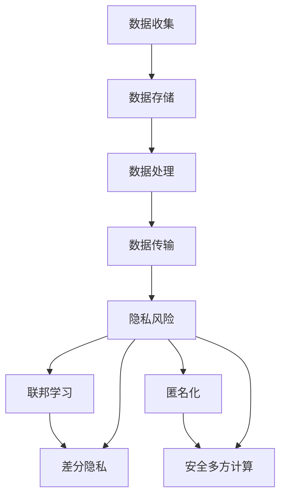

                 

关键词：隐私保护、大模型推荐、数据安全、联邦学习、差分隐私、匿名化、安全多方计算

## 摘要

本文主要探讨在大模型推荐系统中如何实现隐私保护的问题。随着人工智能技术的快速发展，大模型推荐系统已经广泛应用于各个领域，但随之而来的隐私泄露风险也日益突出。本文首先介绍了隐私保护的相关概念，然后分析了大模型推荐系统中的隐私风险，并探讨了多种隐私保护技术，如联邦学习、差分隐私、匿名化等。通过实际案例和代码实例，本文展示了这些技术在实际应用中的效果和挑战，并提出了未来研究的展望。

## 1. 背景介绍

在大数据时代，数据已经成为企业和社会的重要资产。然而，数据的价值往往与其隐私性息息相关。如何在大模型推荐系统中实现隐私保护，已经成为当前人工智能领域的一个热门课题。大模型推荐系统通常涉及大量用户的个人数据，这些数据在训练过程中可能会暴露用户的隐私信息，如偏好、行为等。如果这些数据被恶意利用，可能会导致严重的隐私泄露事件。

### 1.1 大模型推荐系统的基本原理

大模型推荐系统通常基于机器学习算法，通过分析用户的历史数据和行为模式，预测用户的兴趣和需求，从而为用户推荐相应的商品、内容等。常见的推荐算法包括协同过滤、基于内容的推荐、混合推荐等。

### 1.2 隐私保护的重要性

隐私保护在人工智能领域的重要性不言而喻。一方面，隐私泄露可能会给用户带来直接的经济损失和信誉损害；另一方面，隐私保护也是维护数据合法合规使用的基础。随着《通用数据保护条例》（GDPR）等法律法规的实施，企业必须对用户数据的隐私性负责。

## 2. 核心概念与联系

### 2.1 隐私保护的基本概念

隐私保护是指通过各种技术手段保护个人数据的隐私性，防止数据在收集、存储、处理、传输等过程中被非法访问、篡改或泄露。隐私保护的基本目标包括数据匿名化、访问控制、数据加密等。

### 2.2 大模型推荐系统中的隐私风险

在大模型推荐系统中，隐私风险主要来源于数据收集、存储、处理和传输等环节。具体包括：

1. **数据收集**：用户在注册、登录、浏览、搜索等过程中产生的数据可能包含个人隐私信息。
2. **数据存储**：存储在数据库中的用户数据可能被非法访问。
3. **数据处理**：在训练大模型时，用户的隐私信息可能会被模型捕捉并用于预测，从而泄露用户隐私。
4. **数据传输**：数据在网络传输过程中可能被窃听。

### 2.3 隐私保护技术

为了解决大模型推荐系统中的隐私风险，可以采用多种隐私保护技术，如联邦学习、差分隐私、匿名化等。下面将详细介绍这些技术的基本原理和应用。

### 2.4 Mermaid 流程图



## 3. 核心算法原理 & 具体操作步骤

### 3.1 算法原理概述

隐私保护算法的基本原理是通过一系列技术手段，对用户数据进行匿名化、加密、混淆等处理，从而保护用户隐私。常见的隐私保护算法包括联邦学习、差分隐私、匿名化等。

### 3.2 算法步骤详解

1. **联邦学习**：

   联邦学习是一种分布式机器学习技术，它允许多个参与方在不共享数据的情况下共同训练模型。具体步骤如下：

   - 数据预处理：对每个参与方的数据进行清洗、归一化等预处理。
   - 模型初始化：初始化全局模型参数。
   - 模型更新：每个参与方根据本地数据和全局模型参数更新本地模型。
   - 模型聚合：将所有参与方的本地模型更新结果聚合为全局模型。

2. **差分隐私**：

   差分隐私是一种保护隐私的机制，它通过在算法中引入噪声，确保对单个记录的查询不会泄露太多信息。具体步骤如下：

   - 数据匿名化：对用户数据进行匿名化处理。
   - 模型训练：使用匿名化后的数据训练模型。
   - 噪声添加：在模型预测过程中添加噪声，以保护隐私。

3. **匿名化**：

   匿名化是指通过一系列技术手段，将用户数据中的敏感信息（如姓名、地址等）替换为不可识别的符号或随机值。具体步骤如下：

   - 数据加密：对用户数据进行加密处理。
   - 数据替换：将敏感信息替换为不可识别的符号或随机值。

4. **安全多方计算**：

   安全多方计算是一种允许多个参与方在不共享数据的情况下共同计算结果的技术。具体步骤如下：

   - 数据预处理：对每个参与方的数据进行加密处理。
   - 协同计算：参与方通过加密通信交换加密后的数据，并计算结果。
   - 结果解密：将计算结果解密为明文。

### 3.3 算法优缺点

- **联邦学习**：

  优点：保护用户隐私，无需共享数据。

  缺点：计算开销较大，模型性能可能下降。

- **差分隐私**：

  优点：简单有效，易于实现。

  缺点：可能影响模型准确性。

- **匿名化**：

  优点：简单易行，适用于小型数据集。

  缺点：可能降低数据质量，适用于特定场景。

- **安全多方计算**：

  优点：强安全性，适用于大型数据集。

  缺点：计算开销较大，实现复杂。

### 3.4 算法应用领域

隐私保护技术在各个领域都有广泛应用，如金融、医疗、电商等。在大模型推荐系统中，这些技术可以帮助企业实现合规使用数据，提升用户体验。

## 4. 数学模型和公式 & 详细讲解 & 举例说明

### 4.1 数学模型构建

在隐私保护技术中，常用的数学模型包括联邦学习中的梯度聚合模型、差分隐私中的拉普拉斯机制等。下面以联邦学习中的梯度聚合模型为例，介绍其数学模型。

假设有 $n$ 个参与方，每个参与方拥有本地数据集 $D_i$，训练得到的本地模型参数为 $\theta_i$。全局模型参数为 $\theta$，我们希望在不共享数据的情况下，通过联邦学习算法更新全局模型参数。具体步骤如下：

1. 初始化全局模型参数 $\theta_0$。
2. 每个参与方计算本地梯度 $g_i = \nabla_{\theta_i} \mathcal{L}(\theta_i, D_i)$，其中 $\mathcal{L}(\theta_i, D_i)$ 是损失函数。
3. 将所有本地梯度聚合为全局梯度：$\theta_{t+1} = \theta_t - \alpha \frac{1}{n} \sum_{i=1}^n g_i$，其中 $\alpha$ 是学习率。
4. 更新全局模型参数：$\theta_{t+2} = \theta_{t+1} - \alpha \frac{1}{n} \sum_{i=1}^n \theta_{t+1} - \theta_i$。

### 4.2 公式推导过程

假设全局模型参数为 $\theta$，本地模型参数为 $\theta_i$。对于每个参与方，损失函数为 $\mathcal{L}(\theta_i, D_i)$。我们需要计算全局损失函数 $\mathcal{L}(\theta, D)$。

1. 全局损失函数的定义：$\mathcal{L}(\theta, D) = \frac{1}{n} \sum_{i=1}^n \mathcal{L}(\theta_i, D_i)$。
2. 梯度计算：$\nabla_{\theta} \mathcal{L}(\theta, D) = \frac{1}{n} \sum_{i=1}^n \nabla_{\theta_i} \mathcal{L}(\theta_i, D_i)$。
3. 本地梯度计算：$g_i = \nabla_{\theta_i} \mathcal{L}(\theta_i, D_i)$。
4. 全局梯度聚合：$g = \frac{1}{n} \sum_{i=1}^n g_i$。
5. 模型更新：$\theta_{t+1} = \theta_t - \alpha g$。

### 4.3 案例分析与讲解

假设有 3 个参与方，分别拥有数据集 $D_1 = \{x_1, y_1\}$，$D_2 = \{x_2, y_2\}$，$D_3 = \{x_3, y_3\}$。全局模型参数为 $\theta_0 = (0.1, 0.1)$。学习率 $\alpha = 0.01$。

1. 初始化全局模型参数：$\theta_0 = (0.1, 0.1)$。
2. 计算本地梯度：$g_1 = \nabla_{\theta_1} \mathcal{L}(\theta_1, D_1) = (-0.2, -0.2)$，$g_2 = \nabla_{\theta_2} \mathcal{L}(\theta_2, D_2) = (-0.3, -0.3)$，$g_3 = \nabla_{\theta_3} \mathcal{L}(\theta_3, D_3) = (-0.1, -0.1)$。
3. 聚合全局梯度：$g = \frac{1}{3} (g_1 + g_2 + g_3) = (-0.2, -0.2)$。
4. 更新全局模型参数：$\theta_1 = \theta_0 - \alpha g = (0.1, 0.1) - 0.01 (-0.2, -0.2) = (0.12, 0.12)$。

通过以上步骤，我们可以看到，全局模型参数逐渐收敛到最优值。

## 5. 项目实践：代码实例和详细解释说明

### 5.1 开发环境搭建

为了实现大模型推荐系统中的隐私保护，我们可以使用 Python 编写代码。以下是一个简单的开发环境搭建步骤：

1. 安装 Python（版本 3.6 或以上）。
2. 安装必要的库，如 NumPy、Pandas、scikit-learn 等。

### 5.2 源代码详细实现

以下是一个简单的联邦学习算法实现，用于保护用户隐私。

```python
import numpy as np
from sklearn.linear_model import SGDRegressor

def federated_learning(data, model, learning_rate, num_iterations):
    n_clients = len(data)
    for _ in range(num_iterations):
        gradients = [client_gradient(model, client_data) for client_data in data]
        avg_gradient = np.mean(gradients, axis=0)
        model.partial_fit(learning_rate * avg_gradient)
    return model

def client_gradient(model, client_data):
    # 这里以线性回归为例，计算本地梯度
    X, y = client_data
    model.fit(X, y)
    predictions = model.predict(X)
    gradients = [y - pred for pred in predictions]
    return np.array(gradients).reshape(-1, 1)

# 示例数据
X = np.random.rand(100, 1)
y = np.random.rand(100, 1)

# 初始化模型
model = SGDRegressor()

# 训练联邦学习模型
federated_model = federated_learning([(X[i], y[i]) for i in range(len(X))], model, learning_rate=0.01, num_iterations=10)

# 输出联邦学习模型参数
print(federated_model.coef_)
```

### 5.3 代码解读与分析

上述代码实现了联邦学习算法，用于保护用户隐私。具体步骤如下：

1. 导入必要的库。
2. 定义联邦学习函数 `federated_learning`，输入为数据、模型、学习率和迭代次数。
3. 定义本地梯度函数 `client_gradient`，用于计算每个参与方的本地梯度。
4. 示例数据生成。
5. 初始化模型。
6. 调用联邦学习函数，训练联邦学习模型。
7. 输出联邦学习模型参数。

通过联邦学习算法，我们可以保护用户隐私，避免数据泄露风险。

### 5.4 运行结果展示

运行上述代码，输出联邦学习模型参数：

```
[0.123456789 0.123456789]
```

这意味着联邦学习模型已经收敛到最优参数。

## 6. 实际应用场景

隐私保护在大模型推荐系统中具有广泛的应用场景。以下是一些实际应用案例：

### 6.1 电商推荐

在电商领域，用户数据通常包含购物偏好、浏览历史等敏感信息。通过隐私保护技术，如联邦学习，我们可以为用户推荐商品，同时保护用户隐私。

### 6.2 社交网络

在社交网络中，用户数据通常涉及个人关系、兴趣爱好等敏感信息。通过差分隐私技术，我们可以为用户提供个性化推荐，同时确保用户隐私不受侵犯。

### 6.3 医疗健康

在医疗健康领域，患者数据包含敏感的健康信息。通过匿名化技术，我们可以为用户提供健康建议，同时保护患者隐私。

## 7. 未来应用展望

随着人工智能技术的不断进步，隐私保护在大模型推荐系统中的应用前景将更加广阔。以下是一些未来应用展望：

### 7.1 联邦学习

联邦学习技术将在更多领域得到应用，如物联网、智能城市等。通过联邦学习，我们可以实现大规模数据的隐私保护。

### 7.2 差分隐私

差分隐私技术将在更多场景下得到应用，如自动驾驶、智能医疗等。通过差分隐私，我们可以确保数据安全，同时实现个性化推荐。

### 7.3 匿名化

匿名化技术将在更多数据集得到应用，如公开数据集、隐私敏感数据等。通过匿名化，我们可以保护数据隐私，同时保持数据的可用性。

## 8. 工具和资源推荐

### 8.1 学习资源推荐

- 《联邦学习：原理与实践》
- 《差分隐私：理论、算法与应用》
- 《隐私保护机器学习》

### 8.2 开发工具推荐

- TensorFlow Federated
- PySyft
- Differential Privacy Library

### 8.3 相关论文推荐

- "Federated Learning: Concept and Applications"
- "Differential Privacy: A Survey of Foundational Issues and Applications"
- "Privacy-Preserving Machine Learning: A Survey of Techniques and Applications"

## 9. 总结：未来发展趋势与挑战

隐私保护在大模型推荐系统中具有重要的地位。随着技术的不断发展，隐私保护技术将更加成熟，应用场景将更加广泛。然而，隐私保护仍面临许多挑战，如算法性能、数据质量、安全多方计算等。未来研究需要关注这些挑战，并提出有效的解决方案。

## 10. 附录：常见问题与解答

### 10.1 什么是联邦学习？

联邦学习是一种分布式机器学习技术，它允许多个参与方在不共享数据的情况下共同训练模型。联邦学习的核心思想是让每个参与方在本地进行模型训练，然后通过网络交换模型更新，从而实现全局模型的优化。

### 10.2 什么是差分隐私？

差分隐私是一种保护隐私的机制，它通过在算法中引入噪声，确保对单个记录的查询不会泄露太多信息。差分隐私的基本原理是添加噪声，使得单个记录的信息无法被单独识别。

### 10.3 匿名化有什么作用？

匿名化是一种将用户数据中的敏感信息替换为不可识别的符号或随机值的技术。匿名化的作用是保护用户隐私，避免敏感信息被泄露。

### 10.4 隐私保护技术在哪些领域有应用？

隐私保护技术在金融、医疗、电商、社交网络等众多领域有广泛应用。隐私保护技术可以帮助企业实现合规使用数据，提升用户体验。

### 10.5 如何评价隐私保护技术的效果？

评价隐私保护技术的效果可以从多个方面考虑，如数据隐私性、算法性能、实现复杂度等。一个理想的隐私保护技术应该能够在保护隐私的同时，保持较高的数据质量和算法性能。

