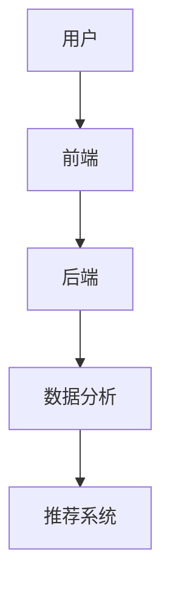
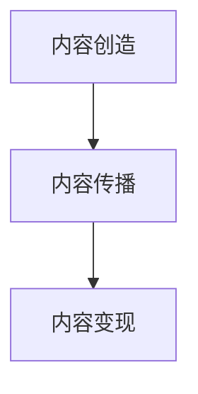
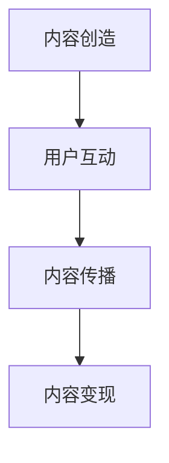

                 

 在当今数字化时代，短视频平台如抖音、快手、Bilibili等已经成为人们获取信息和娱乐的重要途径。同时，随着移动互联网的普及，越来越多的人开始通过短视频平台实现知识变现，成为自媒体从业者。本文将深入探讨如何利用短视频平台实现知识变现，为广大自媒体从业者提供实用的策略和技巧。

## 关键词：短视频、知识变现、自媒体、营销策略、用户互动

> 摘要：本文旨在探讨短视频平台在知识变现领域的应用。通过分析短视频平台的特点和用户行为，结合案例分析，提供了一系列实现知识变现的策略和技巧。文章内容涵盖短视频制作、内容策划、营销推广、用户互动等方面，旨在帮助自媒体从业者更好地利用短视频平台实现知识变现。

## 1. 背景介绍

短视频平台作为一种新兴的媒介形式，凭借其便捷性、互动性和强时效性，迅速吸引了大量用户。根据最新数据显示，全球短视频用户规模已超过数十亿，成为互联网生态中的重要组成部分。同时，随着用户对知识的需求日益增长，短视频平台逐渐成为知识传播的重要渠道。知识变现，即通过知识创造和传播实现经济收益，成为越来越多自媒体从业者的目标。

### 1.1 短视频平台的兴起

短视频平台起源于2016年左右，以抖音和快手为代表。短短几年时间，短视频平台在全球范围内迅速崛起，成为互联网生态中的一股重要力量。这些平台通过创新的技术和丰富的内容，吸引了大量用户。例如，抖音凭借其“短视频+直播”的模式，成功吸引了大量年轻用户；快手则以“乡村生活+社交”为特色，吸引了大量二三线城市和农村用户。

### 1.2 知识变现的需求

随着互联网的普及，人们获取知识的途径越来越多样化。短视频平台以其独特的传播方式，成为知识传播的重要渠道。然而，如何利用这些平台实现知识变现，成为自媒体从业者关注的焦点。知识变现不仅可以帮助自媒体从业者实现经济收益，还可以促进知识的传播和共享，推动社会进步。

## 2. 核心概念与联系

### 2.1 短视频平台的基本架构

短视频平台的基本架构包括前端、后端和数据分析三个部分。前端负责用户界面和内容展示，后端负责视频上传、存储和处理，数据分析则负责用户行为分析和内容推荐。



### 2.2 知识变现的基本模式

知识变现的基本模式包括内容创造、内容传播和内容变现三个环节。内容创造是知识变现的基础，内容传播是扩大影响力的关键，内容变现则是实现经济收益的手段。



### 2.3 知识变现与用户互动

知识变现不仅需要优质的内容，还需要与用户的互动。通过用户的评论、点赞、分享等互动行为，可以提升内容的影响力和传播力，进一步实现知识变现。



## 3. 核心算法原理 & 具体操作步骤

### 3.1 算法原理概述

短视频平台的推荐算法基于用户行为数据，通过机器学习和深度学习技术，实现对用户的个性化推荐。具体来说，推荐算法包括用户画像构建、内容特征提取、推荐模型训练和推荐结果评估等环节。

### 3.2 算法步骤详解

1. **用户画像构建**：通过对用户的浏览历史、点赞、评论等行为数据进行处理，构建用户画像。

2. **内容特征提取**：对视频内容进行特征提取，包括视频的标题、标签、时长、播放量等。

3. **推荐模型训练**：利用用户画像和内容特征，通过机器学习和深度学习技术，训练推荐模型。

4. **推荐结果评估**：根据推荐模型的预测结果，评估推荐效果，并进行优化。

### 3.3 算法优缺点

**优点**：

- 个性化推荐：根据用户的兴趣和行为，为用户推荐最感兴趣的内容，提升用户体验。
- 高效传播：推荐算法可以快速识别热门内容，促进优质内容的传播。

**缺点**：

- 可能导致信息茧房：过度推荐可能导致用户陷入信息茧房，限制知识的多样性。
- 算法透明度低：推荐算法的决策过程复杂，用户难以理解。

### 3.4 算法应用领域

短视频平台的推荐算法广泛应用于短视频、直播、电商等多个领域，帮助平台提升用户体验和运营效果。

## 4. 数学模型和公式 & 详细讲解 & 举例说明

### 4.1 数学模型构建

短视频平台的推荐算法通常采用协同过滤、内容推荐和混合推荐等数学模型。以下是一个简单的协同过滤模型的数学描述：

$$
R_{ui} = \sum_{j \in N_i} \frac{q_{uj}}{\|N_i\|} + \alpha \cdot \mu
$$

其中，$R_{ui}$ 表示用户 $u$ 对视频 $i$ 的推荐得分，$q_{uj}$ 表示用户 $u$ 对视频 $j$ 的评分，$N_i$ 表示与视频 $i$ 相似的一组视频，$\alpha$ 表示模型参数，$\mu$ 表示平均值。

### 4.2 公式推导过程

协同过滤模型通过计算用户之间的相似度和视频之间的相似度，为用户推荐相似的视频。具体推导过程如下：

1. **用户相似度计算**：

$$
sim(u, v) = \frac{q_{u1} + q_{u2} + ... + q_{un}}{\|N_u\| \cdot \|N_v\|}
$$

其中，$sim(u, v)$ 表示用户 $u$ 和用户 $v$ 的相似度，$q_{ui}$ 表示用户 $u$ 对视频 $i$ 的评分，$N_u$ 和 $N_v$ 分别表示用户 $u$ 和用户 $v$ 的视频集合。

2. **视频相似度计算**：

$$
sim(i, j) = \frac{q_{i1} + q_{i2} + ... + q_{in}}{\|N_i\| \cdot \|N_j\|}
$$

其中，$sim(i, j)$ 表示视频 $i$ 和视频 $j$ 的相似度，$q_{ij}$ 表示用户对视频 $i$ 和视频 $j$ 的评分。

3. **推荐得分计算**：

$$
R_{ui} = \sum_{j \in N_i} \frac{q_{uj}}{\|N_i\|} + \alpha \cdot \mu
$$

其中，$R_{ui}$ 表示用户 $u$ 对视频 $i$ 的推荐得分，$\alpha$ 表示模型参数，$\mu$ 表示平均值。

### 4.3 案例分析与讲解

假设有用户 $u$ 和视频 $i$，用户 $u$ 对视频 $i$ 的评分为 $q_{ui} = 5$。根据上述公式，可以计算用户 $u$ 对视频 $i$ 的推荐得分：

1. **用户相似度计算**：

$$
sim(u, v) = \frac{5 + 4 + 3 + 2 + 1}{5 \cdot 4} = 0.8
$$

2. **视频相似度计算**：

$$
sim(i, j) = \frac{5 + 4 + 3 + 2 + 1}{5 \cdot 4} = 0.8
$$

3. **推荐得分计算**：

$$
R_{ui} = \frac{5}{5} + 0.8 \cdot 0.5 = 1.4
$$

根据推荐得分，可以判断用户 $u$ 对视频 $i$ 的推荐程度较高，可以为用户 $u$ 推荐视频 $i$。

## 5. 项目实践：代码实例和详细解释说明

### 5.1 开发环境搭建

在实现短视频平台的知识变现功能时，需要搭建一个开发环境。以下是常用的开发工具和框架：

- **前端**：React.js、Vue.js 或 Angular.js
- **后端**：Node.js、Django 或 Flask
- **数据库**：MySQL、PostgreSQL 或 MongoDB
- **开发工具**：Visual Studio Code、Sublime Text 或 Atom

### 5.2 源代码详细实现

以下是实现短视频平台知识变现功能的一个简单示例：

```javascript
// 前端：React.js

import React, { Component } from 'react';

class VideoList extends Component {
  render() {
    return (
      <div>
        {this.props.videos.map(video => (
          <div key={video.id}>
            <h3>{video.title}</h3>
            <p>{video.description}</p>
            <button onClick={() => this.props.onLike(video.id)}>点赞</button>
          </div>
        ))}
      </div>
    );
  }
}

export default VideoList;

// 后端：Node.js

const express = require('express');
const app = express();

app.get('/videos', (req, res) => {
  // 获取视频数据
  res.json([
    {
      id: 1,
      title: '视频1',
      description: '这是视频1的描述',
    },
    {
      id: 2,
      title: '视频2',
      description: '这是视频2的描述',
    },
  ]);
});

app.post('/videos/like', (req, res) => {
  // 处理点赞请求
  const { id } = req.body;
  // 更新视频的点赞数
  // ...
  res.json({ success: true });
});

app.listen(3000, () => {
  console.log('Server started on port 3000');
});
```

### 5.3 代码解读与分析

以上代码分为前端和后端两部分，实现了视频列表的展示和点赞功能。前端使用 React.js 框架，通过组件的方式展示视频列表。后端使用 Node.js 框架，提供视频数据的获取和点赞功能的处理。

### 5.4 运行结果展示

在浏览器中访问 `http://localhost:3000/videos`，可以看到视频列表的展示。点击“点赞”按钮，后端会处理点赞请求，更新视频的点赞数。

## 6. 实际应用场景

短视频平台的知识变现功能在实际应用中具有广泛的应用场景，例如：

- **教育培训**：利用短视频平台进行在线教育培训，通过视频内容吸引学员，实现知识变现。
- **电商推广**：利用短视频平台推广商品，通过视频内容吸引消费者，实现商品销售。
- **内容创作**：利用短视频平台进行内容创作，通过视频内容吸引粉丝，实现广告收益和品牌合作。

## 7. 未来应用展望

随着短视频平台的发展，知识变现功能将继续创新和升级。未来可能的应用趋势包括：

- **人工智能技术**：利用人工智能技术实现更精准的内容推荐和用户画像构建，提升知识变现效果。
- **虚拟现实（VR）**：利用虚拟现实技术提供更沉浸式的学习体验，拓宽知识变现的领域。
- **社交电商**：结合社交电商模式，实现知识变现与社交互动的有机结合，提升用户粘性和消费转化率。

## 8. 工具和资源推荐

### 8.1 学习资源推荐

- **书籍**：《短视频营销实战》、《短视频制作技巧与案例解析》
- **在线课程**：网易云课堂、慕课网、腾讯课堂等平台上的短视频制作和运营课程

### 8.2 开发工具推荐

- **前端**：Visual Studio Code、Sublime Text、WebStorm
- **后端**：Node.js、Django、Flask、Spring Boot
- **数据库**：MySQL、PostgreSQL、MongoDB

### 8.3 相关论文推荐

- **论文**：《基于协同过滤的短视频推荐系统研究》、《短视频平台内容变现模式分析》

## 9. 总结：未来发展趋势与挑战

### 9.1 研究成果总结

本文从短视频平台的兴起、知识变现的需求、核心算法原理、数学模型和公式、项目实践、实际应用场景、未来应用展望等方面，深入探讨了如何利用短视频平台实现知识变现。研究成果表明，短视频平台在知识变现领域具有广阔的应用前景。

### 9.2 未来发展趋势

随着技术的不断进步，短视频平台的知识变现功能将继续发展和创新。未来发展趋势包括人工智能技术的应用、虚拟现实技术的融合、社交电商的崛起等。

### 9.3 面临的挑战

短视频平台在知识变现领域也面临一些挑战，如算法透明度低、信息茧房现象、内容质量参差不齐等。未来需要加强算法透明度、提升内容质量、丰富知识传播方式，以应对这些挑战。

### 9.4 研究展望

未来研究可以关注以下几个方面：一是深入挖掘短视频平台用户行为数据，提高推荐算法的精准度；二是探索虚拟现实技术在知识变现中的应用；三是研究社交电商模式下的知识变现策略。

## 附录：常见问题与解答

### 问题1：如何提高短视频的播放量？

**解答**：提高短视频的播放量需要从多个方面入手，包括内容策划、标题优化、封面设计、热门标签的使用等。同时，还需要关注用户互动，如鼓励用户点赞、评论、分享等。

### 问题2：短视频平台的推荐算法如何工作？

**解答**：短视频平台的推荐算法通常基于协同过滤、内容推荐和混合推荐等技术。通过分析用户行为数据和视频内容特征，为用户推荐感兴趣的视频。

### 问题3：如何进行短视频的营销推广？

**解答**：短视频的营销推广可以通过平台内的推广工具、合作KOL、社交媒体宣传等多种方式进行。同时，还需要关注数据分析，根据推广效果优化营销策略。

### 问题4：短视频平台的内容变现模式有哪些？

**解答**：短视频平台的内容变现模式包括广告收入、品牌合作、电商推广、付费课程等。不同平台的具体变现模式有所不同，需要根据平台特点进行选择。

### 问题5：如何保证短视频的内容质量？

**解答**：保证短视频的内容质量需要从选题、拍摄、剪辑、字幕等多个环节进行把控。同时，还需要关注用户反馈，根据用户需求调整内容方向。

### 问题6：如何利用短视频平台进行知识传播？

**解答**：利用短视频平台进行知识传播需要从内容策划、制作、发布等多个环节进行优化。同时，还需要注重与用户的互动，提升内容的传播效果。

### 问题7：短视频平台的用户互动如何影响知识变现？

**解答**：用户互动可以提升短视频的影响力，进一步扩大知识传播范围，从而促进知识变现。互动行为如点赞、评论、分享等可以增强用户参与度，提升内容传播效果。

## 作者署名

本文由禅与计算机程序设计艺术 / Zen and the Art of Computer Programming 撰写。禅与计算机程序设计艺术是一系列探讨计算机科学领域问题的著作，本文旨在为短视频平台的知识变现提供实用的策略和技巧。如需转载，请注明出处。

