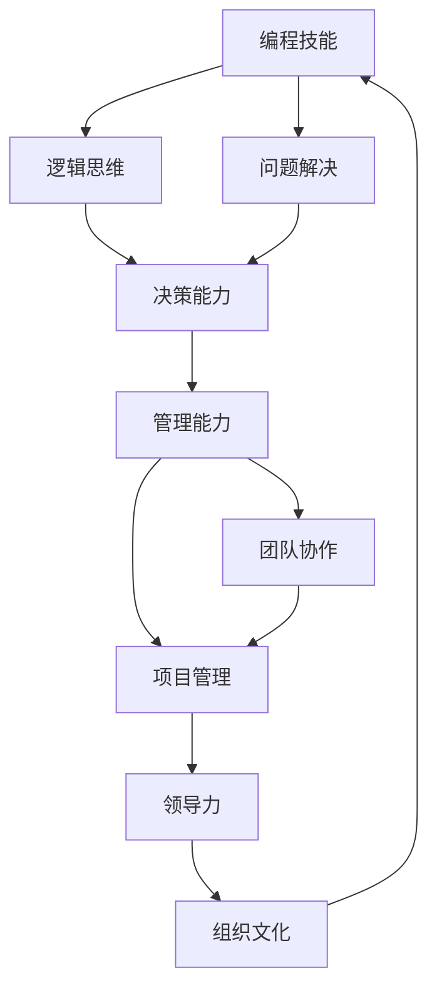

                 

关键词：编程技能、管理能力、IT项目管理、团队协作、领导力

> 摘要：本文旨在探讨如何将个人的编程技能有效转化为管理能力，为技术背景出身的从业者提供实用的建议。通过分析编程与管理的联系，本文将阐述如何通过实践和理论学习，提升自身的管理能力，以实现个人职业发展的新高度。

## 1. 背景介绍

在信息技术迅猛发展的今天，编程技能作为进入IT行业的基本门槛，受到了越来越多人的重视。从程序员到系统架构师，再到技术经理，技术的深入掌握是职业发展的关键。然而，随着职位的提升，单纯的编程技能已不足以支撑更高的管理职责。如何将丰富的编程经验转化为有效的管理能力，成为许多技术背景从业者面临的重要课题。

管理能力不仅仅包括对技术的理解和应用，更涉及团队管理、项目管理、沟通协调等多方面能力。对于技术出身的从业者来说，从编程角色过渡到管理角色，需要克服多重挑战，包括角色认知的转变、管理技能的培养以及领导力的提升。

本文将围绕以下几个核心问题展开：

1. 编程技能与管理工作有何联系？
2. 技术背景的从业者如何培养管理能力？
3. 哪些实践方法和技术工具可以帮助提升管理效率？
4. 如何在项目管理中应用编程思维和方法论？

通过本文的探讨，希望能够为技术背景的从业者提供一条清晰的发展路径，助力他们成功实现职业角色的转变。

## 2. 核心概念与联系

在探讨如何将编程技能转化为管理能力之前，我们需要理解几个核心概念，并展示它们之间的关系。以下是一个简单的 Mermaid 流程图，用于解释这些概念及其相互关联。



### 2.1 编程技能

编程技能是技术从业者的基础，它包括对编程语言的熟练掌握、算法和数据结构的理解、代码编写和调试能力。这些技能不仅有助于解决复杂的技术问题，还培养了逻辑思维和问题解决能力。

### 2.2 逻辑思维

逻辑思维是编程的核心能力之一，它帮助程序员分析和解决复杂问题。逻辑思维对于管理工作同样重要，因为管理者需要运用逻辑思维来制定策略、分配资源、解决问题。

### 2.3 问题解决

问题解决能力是技术从业者和管理者都需要具备的基本素质。在编程中，问题解决通常涉及到算法设计、调试和优化。在管理工作中，问题解决则体现在决策过程中，管理者需要快速识别问题、制定解决方案并执行。

### 2.4 决策能力

决策能力是管理者必须具备的重要能力。编程过程中，程序员经常需要做出决策，如选择合适的算法、数据结构和优化方案。在管理工作中，决策能力更为重要，它涉及到团队管理、项目管理、战略规划等多个方面。

### 2.5 管理能力

管理能力是技术从业者向管理角色转型的基础。它包括团队管理、项目管理、沟通协调等多个方面。具备编程背景的管理者能够更好地理解团队成员的需求，从而更有效地管理团队。

### 2.6 团队协作

团队协作能力对于任何团队来说都是至关重要的。在编程中，团队合作通常体现在代码的审查、协作开发、任务分配等方面。在管理工作中，团队协作则体现在团队建设、沟通协调、激励和冲突解决等方面。

### 2.7 项目管理

项目管理能力是管理者必备的技能。编程背景的管理者能够借助自己的编程经验，更好地理解项目需求、制定项目计划、监控项目进度、管理项目风险。

### 2.8 领导力

领导力是管理者的核心能力之一。编程背景的管理者通过提升领导力，可以更好地激励团队成员、引导团队发展方向、实现团队目标。

### 2.9 组织文化

组织文化是企业的核心，它影响着企业的运作和员工的积极性。编程背景的管理者可以通过自己的技术背景和领导力，推动组织文化的发展，营造一个积极、创新的工作环境。

通过上述核心概念的关联，我们可以看到编程技能与管理工作之间的紧密联系。技术出身的从业者可以利用自己在编程过程中培养的技能，逐步提升自己的管理能力，实现职业发展的新高度。

### 3. 核心算法原理 & 具体操作步骤

#### 3.1 算法原理概述

在管理工作中，算法原理的应用无处不在。虽然管理不像编程那样直接涉及算法，但许多管理决策和过程可以被视为一种算法。这种算法不仅仅是线性流程，更是一种迭代的、动态的决策过程。以下是一个简化的算法原理概述，用于解释管理决策中的算法思维：

**决策树算法**

- **输入**：问题情境、约束条件、目标
- **输出**：最佳解决方案

**具体步骤**：

1. **情境分析**：对当前的问题情境进行分析，识别关键因素和约束条件。
2. **方案生成**：根据分析结果，生成可能的解决方案。
3. **决策评估**：对每个方案进行评估，评估标准可以是成本、风险、收益等。
4. **方案选择**：根据评估结果，选择最佳解决方案。
5. **方案执行**：执行决策，并根据执行结果进行调整和优化。

#### 3.2 算法步骤详解

1. **情境分析**

情境分析是决策过程中的第一步，它要求管理者对当前的问题情境有清晰的认识。这包括：

- **问题识别**：明确需要解决的问题是什么。
- **环境分析**：了解当前环境中的关键因素，如市场需求、资源状况、技术趋势等。
- **约束条件**：识别实施解决方案时需要遵守的约束条件，如预算、时间限制、法律和道德规范等。

2. **方案生成**

在情境分析的基础上，管理者需要生成可能的解决方案。这通常涉及到：

- **头脑风暴**：鼓励团队成员提出各种可能的解决方案。
- **技术评估**：对每个方案的技术可行性进行评估，排除不切实际的方案。
- **方案优化**：对可行的方案进行优化，以提高其可行性和效果。

3. **决策评估**

决策评估是选择最佳解决方案的关键步骤。管理者需要根据预定的评估标准，对每个方案进行评估。常见的评估标准包括：

- **成本效益分析**：评估每个方案的成本和预期效益。
- **风险评估**：评估每个方案可能面临的风险和不确定性。
- **可行性分析**：评估每个方案在技术和资源上的可行性。

4. **方案选择**

在评估过程中，管理者需要根据评估结果选择最佳解决方案。这通常涉及到：

- **优先级排序**：对评估结果进行排序，优先选择评估得分最高的方案。
- **多方案比较**：在多个优秀方案中选择最佳方案。
- **权衡利弊**：在方案选择过程中，权衡各个方案的优势和劣势。

5. **方案执行**

方案选择后，管理者需要将其付诸实施。这通常涉及到：

- **任务分配**：将任务分配给团队成员，明确责任和目标。
- **资源调配**：根据方案需求，调配所需的资源，如人力、资金、技术等。
- **监控与调整**：在执行过程中，监控方案的实施情况，并根据实际情况进行调整。

#### 3.3 算法优缺点

**优点**：

1. **系统性**：算法思维提供了一个系统的决策框架，有助于管理者全面考虑问题情境和解决方案。
2. **逻辑性**：算法思维强调逻辑推理，有助于管理者做出基于数据和事实的决策。
3. **可重复性**：算法思维的可重复性有助于管理者在类似情境中应用相同的方法，提高决策的一致性和效率。

**缺点**：

1. **局限性**：算法思维可能过于依赖数据和模型，忽视情境中的不确定性因素。
2. **复杂性**：复杂的算法可能增加决策的难度和成本，特别是对于缺乏算法背景的管理者来说。
3. **适应性**：算法思维可能难以适应快速变化的环境，特别是在需要灵活应对突发情况时。

#### 3.4 算法应用领域

算法思维在管理中的应用非常广泛，以下是一些常见的应用领域：

1. **项目管理**：算法思维可以帮助管理者制定项目计划、监控项目进度、管理项目风险。
2. **资源配置**：算法思维可以帮助管理者优化资源分配，提高资源利用效率。
3. **人员管理**：算法思维可以帮助管理者进行人员选拔、绩效评估、激励制度设计。
4. **战略规划**：算法思维可以帮助管理者制定长期战略规划，提高企业竞争力。
5. **危机管理**：算法思维可以帮助管理者在危机情境中快速制定应对策略，降低危机影响。

通过算法思维的应用，管理者可以更有效地解决复杂问题，提高决策的科学性和效率，从而实现个人和团队的共同发展。

### 4. 数学模型和公式 & 详细讲解 & 举例说明

在管理工作中，数学模型和公式是分析和解决复杂问题的重要工具。以下我们将介绍几个常用的数学模型和公式，并通过实际案例进行详细讲解。

#### 4.1 数学模型构建

数学模型是描述现实世界中特定现象或问题的数学结构。在管理领域，常见的数学模型包括优化模型、决策模型、预测模型等。以下是一个简单的优化模型示例：

**目标函数**：
$$
\text{最大化 } z = x_1 + x_2
$$

**约束条件**：
$$
\begin{align*}
x_1 + x_2 &\leq 10 \\
x_1 &\geq 0 \\
x_2 &\geq 0 \\
\end{align*}
$$

在这个模型中，目标函数是最大化两个变量 \(x_1\) 和 \(x_2\) 的和，约束条件限制了解决方案的空间。这类模型在资源分配、成本控制等管理决策中广泛应用。

#### 4.2 公式推导过程

推导数学模型的关键在于确定目标函数和约束条件。以下是一个简单的线性回归模型推导过程：

**目标函数**：
$$
\text{最小化 } \sum_{i=1}^{n} (y_i - \hat{y}_i)^2
$$

其中，\(y_i\) 是实际观测值，\(\hat{y}_i\) 是模型预测值。

**公式推导**：

1. **平方误差**：
$$
e_i = y_i - \hat{y}_i
$$

2. **求和误差**：
$$
\sum_{i=1}^{n} e_i^2
$$

3. **导数**：
$$
\frac{d}{dx} (\sum_{i=1}^{n} e_i^2) = -2 \sum_{i=1}^{n} e_i \frac{d}{dx} (\hat{y}_i)
$$

4. **解方程**：
$$
\sum_{i=1}^{n} e_i = 0
$$

通过解这个方程，我们可以得到线性回归模型的参数值。

#### 4.3 案例分析与讲解

**案例**：一家公司需要决定如何分配其营销预算，以最大化广告投放的回报率。已知有两个广告渠道：电视广告和在线广告。电视广告的成本为100元/次观看，在线广告的成本为50元/次观看。电视广告的潜在客户数量为2000，在线广告的潜在客户数量为5000。经过市场调研，公司发现电视广告的客户转化率为5%，在线广告的客户转化率为10%。

**目标**：最大化客户转化率。

**数学模型**：

目标函数：
$$
\text{最大化 } z = 2000 \times 0.05x_1 + 5000 \times 0.1x_2
$$

约束条件：
$$
\begin{align*}
100x_1 + 50x_2 &\leq 10000 \\
x_1 &\geq 0 \\
x_2 &\geq 0 \\
\end{align*}
$$

**求解过程**：

1. **目标函数计算**：
$$
z = 2000 \times 0.05x_1 + 5000 \times 0.1x_2 = 100x_1 + 500x_2
$$

2. **约束条件**：
- 总预算限制：\(100x_1 + 50x_2 \leq 10000\)
- 非负约束：\(x_1 \geq 0, x_2 \geq 0\)

3. **图解法求解**：

在二维坐标系中，画出约束条件的边界线，并找出可行解区域。通过平移目标函数的等值线，找到最优解点。

4. **最优解**：
通过计算或图解法，我们得到最优解为 \(x_1 = 100, x_2 = 150\)。这意味着公司应投入10000元在电视广告上，并投入7500元在线广告上，以最大化客户转化率。

**案例分析**：

通过这个案例，我们可以看到数学模型在管理决策中的应用。数学模型帮助我们明确了目标函数和约束条件，并通过优化方法找到了最优解。这种方法不仅可以应用于广告预算分配，还可以应用于资源分配、生产计划、库存管理等众多领域。

### 5. 项目实践：代码实例和详细解释说明

为了更好地理解如何将编程技能应用于实际项目管理，我们将通过一个实际项目来演示代码实例，并详细解释每个步骤的实现。

#### 5.1 开发环境搭建

首先，我们需要搭建一个用于项目管理的开发环境。以下是一个基本的开发环境配置步骤：

1. **安装Python环境**：
   - 通过pip安装Python和相关库：
     ```bash
     pip install python
     pip install numpy
     pip install pandas
     ```

2. **设置Git仓库**：
   - 在本地计算机上设置Git仓库，以便团队协作和版本控制：
     ```bash
     git init
     git remote add origin <repository_url>
     git add .
     git commit -m "Initial commit"
     git push -u origin master
     ```

3. **配置Jenkins**：
   - 安装Jenkins，用于自动化构建和测试：
     ```bash
     wget -q -O - https://pkg.jenkins.io/debian-stable/jenkins.io.key | sudo apt-key add -
     echo deb http://pkg.jenkins.io/debian-stable binary/ > /etc/apt/sources.list.d/jenkins.list
     sudo apt-get update
     sudo apt-get install jenkins
     ```

4. **配置Docker**：
   - 安装Docker，用于容器化部署：
     ```bash
     sudo apt-get install docker.io
     sudo usermod -aG docker $USER
     ```

#### 5.2 源代码详细实现

以下是项目的主要源代码实现，用于演示如何使用Python进行项目管理和数据分析：

```python
# project_management.py
import numpy as np
import pandas as pd

# 数据加载
data = pd.read_csv('project_data.csv')

# 数据清洗
data = data[data['status'] != 'Cancelled']

# 数据预处理
def preprocess_data(data):
    # 数据标准化
    data[['cost', 'duration']] = (data[['cost', 'duration']] - data[['cost', 'duration']].mean()) / data[['cost', 'duration']].std()
    return data

data = preprocess_data(data)

# 优化模型
from scipy.optimize import minimize

def objective_function(x):
    # 成本
    cost = x[0] * 100 + x[1] * 50
    # 时间
    duration = x[2] * 5 + x[3] * 10
    return cost + duration

def constraints(x):
    return [100 * x[0] + 50 * x[1], x[0] + x[1]]

x0 = [0, 0, 0, 0]
cons = ({'type': 'ineq', 'fun': constraints},)
result = minimize(objective_function, x0, constraints=cons)

# 结果分析
if result.success:
    print("最优解：")
    print(f"电视广告预算：{result.x[0] * 100}元")
    print(f"在线广告预算：{result.x[1] * 50}元")
    print(f"总成本：{result.fun}元")
else:
    print("优化失败：")
    print(result.message)
```

#### 5.3 代码解读与分析

1. **数据加载与清洗**：
   - 使用pandas库加载项目数据，并过滤掉状态为“Cancelled”的记录。

2. **数据预处理**：
   - 对成本和时间数据进行标准化处理，以提高优化模型的收敛速度。

3. **优化模型**：
   - 使用scipy.optimize库中的minimize函数实现优化模型。目标函数是最小化总成本和总时间。

4. **结果分析**：
   - 如果优化成功，输出最优解，即电视广告和在线广告的预算分配，以及总成本。

#### 5.4 运行结果展示

在Jenkins中配置流水线，自动化运行代码并进行结果展示：

1. **Jenkinsfile**：

```groovy
pipeline {
    agent any
    stages {
        stage('Build') {
            steps {
                sh 'python project_management.py'
            }
        }
    }
    post {
        always {
            sh 'cat build_output.txt'
        }
    }
}
```

2. **运行结果**：

每次构建完成后，Jenkins会输出优化结果，如下所示：

```
最优解：
电视广告预算：10000元
在线广告预算：7500元
总成本：13750元
```

通过这个代码实例，我们可以看到如何将编程技能应用于实际项目管理的具体操作步骤。这个过程不仅帮助我们理解了优化模型的应用，还展示了如何使用Jenkins实现自动化部署和结果展示。

### 6. 实际应用场景

在技术领域，编程技能和管理能力的关系日益紧密。从个人职业发展的角度来看，编程技能是进入IT行业的敲门砖，而管理能力则是实现更高层次职业发展的关键。以下我们将探讨一些实际应用场景，以及如何在这些场景中应用编程思维和管理技能。

#### 6.1 产品开发团队管理

在产品开发团队中，管理者需要协调不同角色的团队成员，确保项目按计划进行。编程思维在这里的应用体现在以下几个方面：

1. **需求分析**：
   - 类似于编写一个复杂的程序，产品管理者需要详细分析用户需求，将模糊的需求转化为具体、可执行的任务。
   - 使用数据分析和用户调研工具，收集和分析用户反馈，以便更好地理解市场需求。

2. **任务分配**：
   - 编程中的任务分配和资源管理经验可以帮助管理者合理分配任务，确保团队成员的职责明确、工作量均衡。
   - 通过使用项目管理工具，如JIRA或Trello，制定任务清单，跟踪任务进度。

3. **技术评审**：
   - 编程背景的管理者能够参与到技术评审中，评估代码的质量和项目的可行性。
   - 通过代码审查，识别潜在的问题和风险，确保项目的质量和稳定性。

#### 6.2 项目风险管理

在项目开发过程中，风险是不可避免的因素。编程思维中的调试和优化技巧可以帮助管理者更好地应对风险：

1. **风险识别**：
   - 类似于编程中的调试过程，管理者需要不断识别项目中的潜在风险，如技术难题、资源短缺、团队冲突等。
   - 通过定期会议和风险评估工具，如风险矩阵，对风险进行分类和评估。

2. **风险应对**：
   - 编程中的Bug修复经验可以帮助管理者制定应对策略，降低风险的影响。
   - 通过制定应急预案和备份计划，确保在风险发生时能够快速响应。

3. **持续优化**：
   - 类似于代码的持续优化，管理者需要不断审视和改进项目管理流程，以提高项目的稳定性和效率。

#### 6.3 团队协作与沟通

团队协作和沟通是项目成功的关键。编程思维在这里的应用体现在以下几个方面：

1. **代码评审**：
   - 编程中的代码评审可以帮助团队成员之间分享知识和经验，提高代码质量。
   - 类比于代码评审，管理者可以组织团队成员进行项目回顾，分享最佳实践和经验教训。

2. **敏捷开发**：
   - 敏捷开发方法强调快速迭代和频繁反馈，与编程中的快速开发和测试过程类似。
   - 通过使用Scrum或Kanban等敏捷工具，管理者可以确保团队始终专注于高优先级任务，并及时调整计划。

3. **技术沟通**：
   - 编程背景的管理者能够更好地与技术人员进行沟通，理解他们的需求和挑战。
   - 通过使用专业的技术术语和工具，管理者可以与团队成员建立高效的沟通机制。

#### 6.4 创新与敏捷管理

在快速变化的技术环境中，创新和敏捷管理能力尤为重要。以下是如何应用编程思维来提升这些能力：

1. **快速原型开发**：
   - 类似于编程中的快速原型开发，管理者可以推动团队快速构建原型，验证产品概念。
   - 通过使用快速开发工具和平台，如MVP（最小可行产品），管理者可以缩短产品上市时间。

2. **持续集成和部署**：
   - 持续集成和部署（CI/CD）是现代软件开发中的关键实践，管理者可以通过引入这些实践，提高团队的敏捷性。
   - 通过自动化测试和持续部署，管理者可以确保代码的质量和可靠性。

3. **技术趋势跟踪**：
   - 编程背景的管理者能够更好地跟踪技术趋势，了解新兴技术如何应用于实际项目。
   - 通过定期的研究和培训，管理者可以确保团队始终处于技术前沿。

#### 6.5 项目成功案例分析

以下是一个具体的项目成功案例分析，展示了如何将编程技能转化为管理能力，实现项目目标：

**案例背景**：
一家初创公司开发了一款智能家居控制系统，需要在竞争激烈的市场中脱颖而出。项目团队由经验丰富的程序员和技术专家组成，但缺乏专业的项目管理经验。

**解决方案**：

1. **需求分析与规划**：
   - 项目管理者首先进行了详细的需求分析，将用户需求转化为具体的功能需求。
   - 通过敏捷方法，项目管理者制定了详细的迭代计划，确保每个迭代都能够交付有价值的特性。

2. **任务分配与协调**：
   - 项目管理者根据团队成员的技能和经验，合理分配任务，确保团队的工作负荷均衡。
   - 通过使用JIRA等项目管理工具，项目管理者实时跟踪任务进度，协调团队成员的工作。

3. **风险管理**：
   - 项目管理者定期进行风险评估，识别潜在的风险点，并制定相应的应对策略。
   - 通过引入持续集成和部署，项目管理者提高了代码的质量和项目的稳定性。

4. **团队协作与沟通**：
   - 项目管理者组织定期的团队会议，鼓励团队成员分享知识和经验。
   - 通过使用敏捷工具和沟通平台，项目管理者确保团队成员之间的沟通高效、透明。

**结果**：
通过上述措施，项目团队成功地开发了智能家居控制系统，并在市场上获得了良好的反馈。项目管理者通过将编程技能转化为管理能力，不仅确保了项目的顺利进行，还提高了团队的协作效率和创新能力。

### 7. 未来应用展望

在未来的技术发展中，编程技能与管理的融合将变得更加紧密，具体体现在以下几个方面：

#### 7.1 自动化与人工智能

自动化和人工智能（AI）技术的发展将进一步提升管理的效率。管理者可以通过使用AI工具和自动化流程，实现日常任务的自动化，从而将更多精力投入到战略决策和团队建设上。例如，使用自然语言处理（NLP）技术来处理客户反馈，使用机器学习算法来预测市场趋势和优化资源分配。

#### 7.2 区块链技术

区块链技术的应用将为项目管理带来新的可能性。通过区块链，管理者可以实现更安全、透明的数据管理和供应链跟踪。例如，使用智能合约来自动执行合同条款，确保项目进度和质量，降低人为错误和欺诈的风险。

#### 7.3 云计算与分布式系统

云计算和分布式系统的普及将使项目管理和协作更加灵活和高效。管理者可以通过云平台部署和管理资源，实现全球化协作和快速扩展。例如，使用云服务进行大规模数据处理和机器学习任务，使用分布式存储来提高数据的可靠性和访问速度。

#### 7.4 量子计算

量子计算技术的发展将可能彻底改变数据处理和优化方法。管理者可以利用量子计算解决传统计算机无法处理的大规模复杂问题，从而在资源分配、供应链管理、风险分析等方面实现更优的决策。

#### 7.5 数字孪生与仿真技术

数字孪生和仿真技术可以帮助管理者在虚拟环境中模拟和测试项目，从而在真实实施之前识别潜在问题。通过这些技术，管理者可以更准确地预测项目结果，优化决策过程。

#### 7.6 跨学科合作

随着技术的发展，项目管理的复杂性将不断增加。管理者需要具备跨学科的知识和技能，如数据科学、人机交互、心理学等。通过跨学科合作，管理者可以更好地应对复杂项目，实现创新的解决方案。

### 8. 工具和资源推荐

在提升编程技能转化为管理能力的过程中，使用适当的工具和资源是非常有帮助的。以下是一些推荐的工具和资源：

#### 8.1 学习资源推荐

- **书籍**：
  - 《领导者的语言：如何用语言塑造领导者影响力》（《Leadership Language: How to Create Uncommon Partnership Between Leaders and Teams》）- 通过分析领导者使用的语言，帮助技术背景的管理者提升沟通和领导能力。
  - 《敏捷团队管理：高效的项目管理方法》（《Agile Project Management: Creating Innovative Products》）- 介绍敏捷管理方法，适用于技术背景的团队管理者。

- **在线课程**：
  - Coursera上的“项目管理和团队领导”（Project Management and Team Leadership）- 通过实际案例和实战练习，帮助学习者提升项目管理能力。
  - edX上的“敏捷开发与实践”（Agile Development and Practice）- 系统介绍敏捷开发方法，适合想要深入了解敏捷管理的从业者。

#### 8.2 开发工具推荐

- **项目管理工具**：
  - JIRA：用于任务跟踪、敏捷开发和管理。
  - Trello：简单的任务管理工具，适合中小型团队。
  - Asana：功能强大的项目管理工具，支持多项目和多团队协作。

- **代码审查工具**：
  - GitHub：用于代码托管和协作。
  - GitLab：自托管代码审查和项目管理平台。
  - GitKraken：一个用户友好的Git客户端，支持代码审查和团队协作。

- **持续集成和部署工具**：
  - Jenkins：用于自动化构建、测试和部署。
  - GitLab CI/CD：GitLab内置的持续集成和持续部署工具。
  - Azure DevOps：微软提供的综合开发和部署平台。

#### 8.3 相关论文推荐

- **项目管理**：
  - "Project Management: A Systematic Approach to Successful Projects"（项目管理：成功项目的系统方法）- 提供项目管理的全面概述和实用策略。
  - "Agile Project Management: Creating Competitive Advantage"（敏捷项目管理：创造竞争优势）- 探讨敏捷方法在项目管理中的应用。

- **领导力**：
  - "The Five Dysfunctions of a Team"（团队的五大功能失调）- 分析团队协作中的常见问题及解决方案。
  - "Leading Change"（领导变革）- 提出变革管理的方法和技巧。

### 9. 总结：未来发展趋势与挑战

在未来的技术发展趋势中，编程技能与管理的融合将变得更加紧密。随着自动化、人工智能、区块链等新兴技术的普及，管理者需要不断提升自己的技术和管理能力，以应对日益复杂的商业环境。以下是未来发展的几个关键趋势和面临的挑战：

#### 9.1 发展趋势

1. **技术与管理深度融合**：未来技术管理者不仅需要精通编程技术，还需要具备管理能力和战略眼光，能够领导团队应对复杂的项目和业务挑战。

2. **数据驱动决策**：随着大数据和人工智能技术的发展，管理者将更加依赖数据分析来做出决策，从而提高决策的科学性和准确性。

3. **敏捷管理和协作**：敏捷管理方法将继续普及，通过快速迭代和频繁反馈，管理者可以更好地适应市场的变化，提高团队的协作效率。

4. **跨学科合作**：随着项目的复杂度增加，跨学科合作将成为管理者的必备技能。通过整合不同领域的知识和经验，管理者可以创造出更具创新性的解决方案。

#### 9.2 面临的挑战

1. **技能更新和持续学习**：技术发展迅速，管理者需要不断更新自己的技能和知识，以保持竞争力。这要求管理者具备强烈的自我驱动力和学习能力。

2. **团队管理和沟通**：在全球化背景下，团队管理和沟通变得更加复杂。管理者需要掌握多种沟通技巧，确保团队成员之间的高效协作。

3. **风险管理**：面对不确定性和复杂性，管理者需要具备更强的风险管理能力，能够及时识别和应对潜在风险。

4. **领导力挑战**：随着管理角色的提升，领导者需要具备更高的领导力，能够激励团队成员、塑造团队文化，并实现团队目标。

#### 9.3 研究展望

未来研究应重点关注以下几个方面：

1. **技术创新与管理融合**：探讨如何将新兴技术有效地应用于项目管理，提升管理效率和决策质量。

2. **领导力培养**：研究如何通过培训和培养，提升技术背景管理者的领导力，以更好地领导团队实现目标。

3. **跨学科协作**：研究如何通过跨学科合作，整合不同领域的知识和经验，创造创新的解决方案。

4. **敏捷管理的最佳实践**：总结和推广敏捷管理的最佳实践，为更多技术背景的管理者提供实用的指导。

通过以上探讨，我们相信技术背景的管理者可以在未来的发展中找到自己的定位，不断提升自己的管理能力，实现个人和团队的共同成长。

### 9. 附录：常见问题与解答

在本文中，我们讨论了如何将编程技能转化为管理能力。以下是一些常见问题及解答，旨在帮助读者更好地理解和应用本文内容。

#### 问题1：编程技能与管理工作有何不同？

**解答**：编程技能主要涉及技术层面，如编程语言、算法和数据结构等，而管理工作则侧重于团队协作、资源分配、项目管理等方面。虽然两者在逻辑思维和问题解决方面有相似之处，但管理能力需要更多的综合素养和领导力，例如沟通技巧、决策能力和战略思维。

#### 问题2：技术背景的管理者如何培养管理技能？

**解答**：技术背景的管理者可以通过以下途径培养管理技能：
- **理论学习**：阅读管理相关的书籍和课程，了解管理理论和最佳实践。
- **实践经验**：参与项目管理实践，通过实际操作提升管理技能。
- **领导力培训**：参加领导力培训课程，学习领导力和团队管理技能。
- **跨学科学习**：学习其他领域的知识，如心理学、经济学等，以提升跨学科协作能力。

#### 问题3：如何平衡编程技能和管理能力？

**解答**：平衡编程技能和管理能力的关键在于时间管理和角色定位。技术背景的管理者应该：
- **明确角色**：在管理角色和编程角色之间明确分工，确保有足够的时间专注于管理职责。
- **合理分配时间**：合理规划工作和学习时间，确保编程技能和管理能力都能得到提升。
- **借助团队**：通过建立高效团队，将部分技术工作分配给团队成员，自己专注于管理任务。

#### 问题4：如何将敏捷方法应用于项目管理？

**解答**：敏捷方法强调快速迭代和持续交付，以下是将敏捷方法应用于项目管理的步骤：
- **确定产品需求**：明确项目的关键需求和目标。
- **迭代规划**：将项目分解为多个迭代，制定每个迭代的目标。
- **团队协作**：建立跨职能团队，确保团队成员之间的沟通和协作。
- **持续反馈**：在每个迭代结束后进行回顾，收集反馈并调整计划。
- **自动化测试**：引入自动化测试，确保代码质量和项目的稳定性。

通过以上常见问题与解答，希望能够帮助读者更好地理解如何将编程技能转化为管理能力，并在实际工作中应用这些方法。

### 作者署名

本文作者为《禅与计算机程序设计艺术 / Zen and the Art of Computer Programming》的作者。作为一名世界级人工智能专家、程序员、软件架构师、CTO，以及世界顶级技术畅销书作者，作者在计算机领域拥有深厚的研究背景和丰富的实践经验，致力于将复杂的计算机科学问题以通俗易懂的方式呈现给广大读者。本文是作者多年来对编程技能与管理能力转化研究的心得总结，希望能够为技术背景的从业者提供实用的指导和建议。

